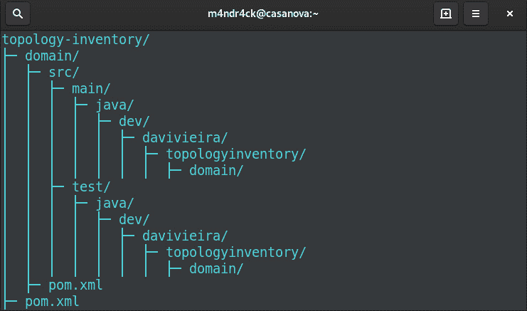
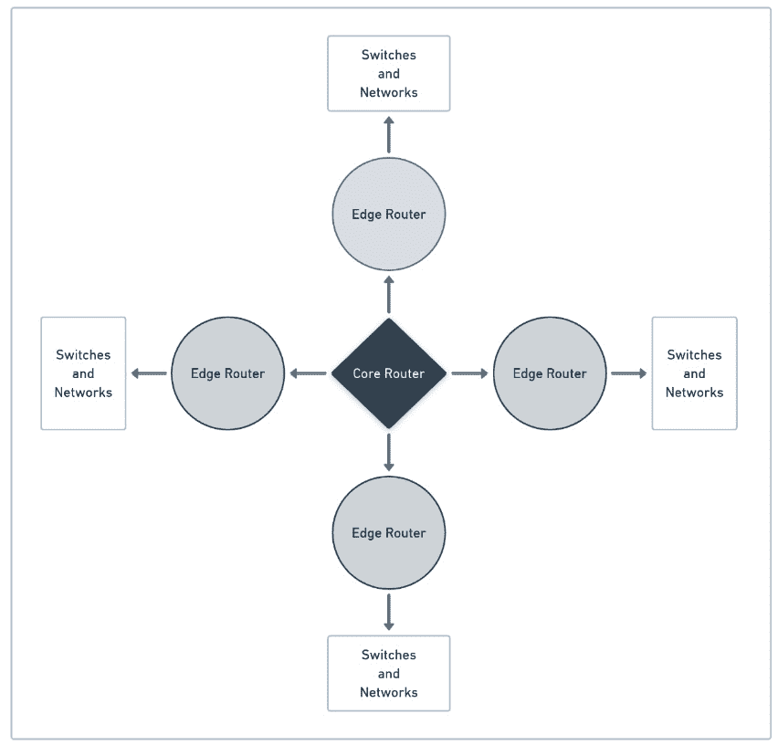
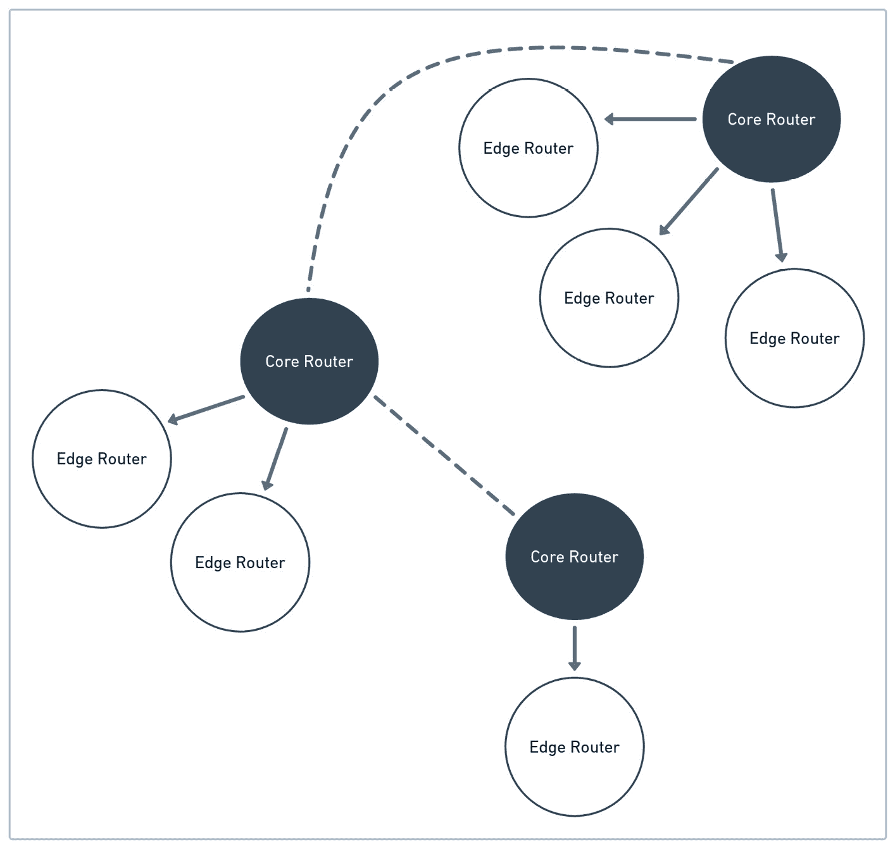
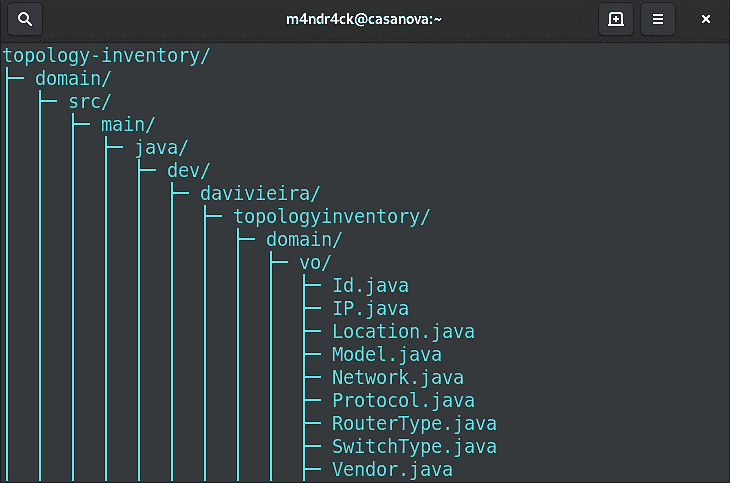
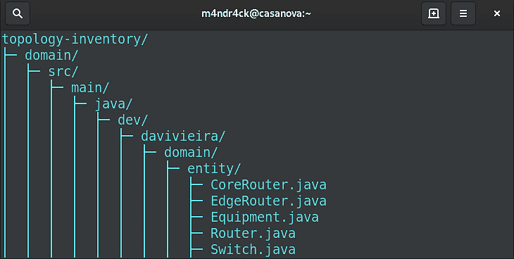
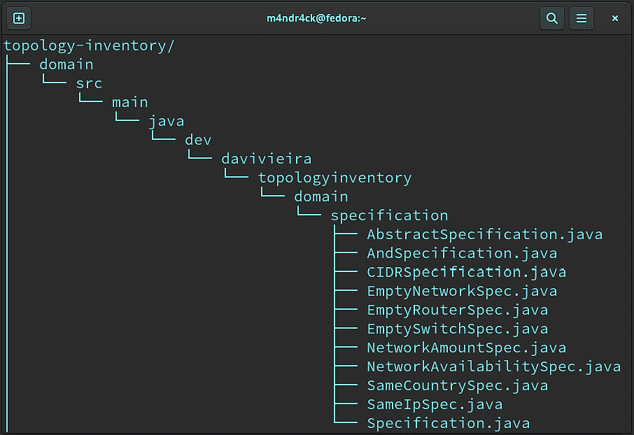
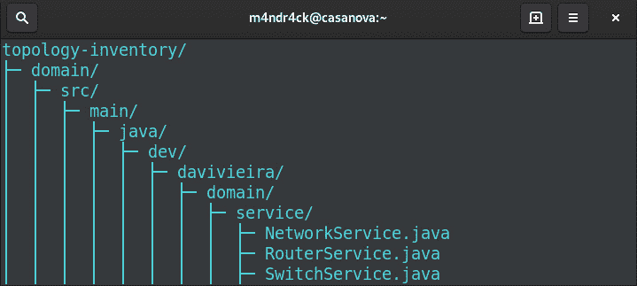

# 第六章：构建领域六边形

在前面的章节中，我们有机会使用**领域驱动设计**（**DDD**）技术，如实体和值对象，来创建领域模型。然而，直到现在，我们还没有涉及到组织包、类和模块以适应六边形架构的目的。

**领域六边形**是开始开发六边形应用程序的地方。基于领域，我们推导出所有其他六边形。我们可以这样说，领域六边形是六边形系统的核心，因为核心的基本业务逻辑就驻留在这样的六边形中。

因此，在本章中，我们将从底层开始探索如何使用 Java 模块方法来构建六边形应用程序项目。这将帮助我们确保更好的封装和单元测试，以验证我们在开发领域六边形组件时的代码。

本章我们将涵盖以下主题：

+   引导构建领域六边形

+   理解问题域

+   定义值对象

+   定义实体和规范

+   定义领域服务

+   测试领域六边形

到本章结束时，你将获得关于所有领域六边形组件开发的实际操作视角。这些知识将使你能够处理领域六边形中关于类和包的结构和排列的所有细节。

# 技术要求

要编译和运行本章中展示的代码示例，你需要在你的计算机上安装最新的**Java SE 开发工具包**和**Maven 3.8**。它们都适用于 Linux、Mac 和 Windows 操作系统。

你可以在 GitHub 上找到本章的代码文件，地址为[`github.com/PacktPublishing/-Designing-Hexagonal-Architecture-with-Java---Second-Edition/tree/main/Chapter06`](https://github.com/PacktPublishing/-Designing-Hexagonal-Architecture-with-Java---Second-Edition/tree/main/Chapter06)。

# 引导构建领域六边形

本章我们将开始构建的六边形应用程序项目实际上是我们在上一章中开发的拓扑和库存系统的延续。然而，这里的区别在于我们将增强系统的一些功能，并使用**Java 平台模块系统**（**JPMS**）来封装领域六边形为一个 Java 模块。

要开始引导构建领域六边形，让我们创建一个多模块 Maven 项目，如下所示：

1.  首先，我们将通过执行以下代码创建一个名为`topology-inventory`的父项目：

    ```java
    mvn archetype:generate \
    -DarchetypeGroupId=org.codehaus.mojo.archetypes \
    -DarchetypeArtifactId=pom-root \
    -DarchetypeVersion=RELEASE \
    -DgroupId=dev.davivieira \
    -DartifactId=topology-inventory \
    -Dversion=1.0-SNAPSHOT \
    archetype:generate Maven goal to generate a Maven root project for the system. It creates a pom.xml file with the coordinates we pass in the command’s parameters, such as groupId and artifactId.
    ```

1.  然后，我们为领域六边形创建一个模块，如下所示：

    ```java
    cd topology-inventory
    mvn archetype:generate \
      -DarchetypeGroupId=de.rieckpil.archetypes  \
      -DarchetypeArtifactId=testing-toolkit \
      -DarchetypeVersion=1.0.0 \
      -DgroupId=dev.davivieira \
      -DartifactId=domain \
      -Dversion=1.0-SNAPSHOT \
      -Dpackage=dev.davivieira.topologyinventory.domain \
    archetype:generate Maven goal. The result is a Maven module called domain that is part of the topology-inventory Maven project.
    ```

1.  在执行`mvn`命令创建`topology-inventory` Maven 根项目和`domain`模块之后，你将拥有一个类似于以下所示的目录树：



图 6.1 – 领域六边形的目录结构

自从将`module-info.java`模块描述符文件发布到 Java 项目根目录以来。当你使用此文件创建 Java 模块时，你将关闭对该模块中所有公共包的访问。为了使公共包对其他模块可访问，你需要在模块描述符文件中导出所需的包。关于 Java 模块还有其他有趣的事情要说，但我们已经将它们留给了*第九章*，*使用 Java 模块应用依赖倒置*。

要将领域六边形转换为 Java 模块，你需要在`topology-inventory/domain/src/java/module-info.java`创建一个模块描述符文件，如下所示：

```java
module domain {
}
```

由于我们尚未允许访问任何公共包，也没有依赖于其他模块，我们将`module-info.java`文件留空。

为了使领域以及所有其他具有更简洁类别的六边形都更加简洁，我们将`lombok`库添加到`pom.xml`项目根目录，如下所示：

```java
<dependencies>
  <dependency>
      <groupId>org.projectlombok</groupId>
      <artifactId>lombok</artifactId>
      <version>1.18.20</version>
      <scope>compile</scope>
  </dependency>
</dependencies>
```

同样，配置`lombok`的注解处理路径也很重要；否则，将出现编译错误。你可以通过运行以下代码来完成此操作：

```java
<plugins>
  <plugin>
      <groupId>org.apache.maven.plugins</groupId>
      <artifactId>maven-compiler-plugin</artifactId>
      <version>3.8.1</version>
      <configuration>
          <source>17</source>
          <target>17</target>
          <annotationProcessorPaths>
              <path>
                   <groupId>org.projectlombok</groupId>
                   <artifactId>lombok</artifactId>
                   <version>1.18.26</version>
              </path>
          </annotationProcessorPaths>
      </configuration>
  </plugin>
</plugins>
```

在`maven-compile-plugin`插件块内部，我们添加了`annotationProcessorPaths`的配置。

由于我们添加了 lombok 依赖项，我们需要更新域的`module-info.java`文件，如下所示：

```java
module domain {
    requires static lombok;
}
```

我们现在已准备好开始在完全模块化的结构之上开发领域六边形。让我们继续了解我们增强拓扑和库存系统的问题域。

# 理解问题域

我们将通过考虑以下事实来开始建模问题域：核心路由器可以连接到核心路由器和边缘路由器。反过来，边缘路由器连接到交换机和它们的网络。以下图表描述了这一场景：



图 6.2 – 拓扑和库存网络系统的用例

核心路由器速度更快，处理高流量负载，并且它们不直接处理来自交换机和其网络的流量。相反，边缘路由器直接处理来自交换机和其网络的流量。在我们的场景中，边缘路由器不允许连接到其他边缘路由器；它只能连接到核心路由器和交换机。交换机可以有多个网络。

请记住，这是一个为我们的场景建立的特定安排。这绝对不代表组织网络组件的严格规则。以下是我们的场景安排的图表：



图 6.3 – 拓扑和库存网络系统的用例（续）

拓扑和库存系统的目的是允许用户查看和管理网络资产。通过网络资产，我们指的是路由器、交换机和网络——路由器和交换机是物理资产，而网络是由交换机提供的逻辑资产。这些资产分布在不同的位置，系统应显示资产及其站点之间的互连性。位置由完整的地址以及其纬度和经度组成。

管理部分仅基于类似于**创建、读取、更新、删除**（**CRUD**）的操作，使用户能够控制拓扑和库存系统数据。

我们构建此类系统的方法是首先创建一个领域六边形，使用包含实现系统最高层目的所需操作和规则的领域模型。在最高层，我们的意图是直接在领域六边形上验证商业想法，而不需要应用和框架六边形上现有事物的帮助。随着事物移动到这些六边形，它们往往会变得更加技术特定，处于较低层次，因为技术特定的事物离领域六边形很远。我们在领域六边形内保持核心系统功能程度的程度，极大地影响了六边形系统的松散耦合程度。

为了验证领域六边形的方法和类，我们将创建单元测试以确保领域操作按预期工作。这将给我们一定的信心继续前进，并在应用六边形上使用这些操作。

接下来，我们将开始使用价值对象构建六边形系统的基础，这些是架构组件，使我们能够创建领域模型以更好地表达问题域。

# 定义价值对象

正如我们在*第二章*中已经看到的，“在领域六边形内封装业务规则”，实体是我们用来分类具有身份的系统组件的元素。相反，价值对象没有身份。我们使用价值对象来描述那些不需要定义身份的系统部分。然后，我们有聚合体，用于封装对象的关联实体和值。

我建议首先创建价值对象，因为它们就像构建块，是我们将用来构建更复杂价值对象和——最重要的是——实体的原材料。现在，我们将添加在上一节中当我们启动领域六边形时创建的所有领域六边形模块上的体积对象类。我们将使用以下步骤来定义价值对象：

1.  让我们从`Id`价值对象类开始，如下所示：

    ```java
    package dev.davivieira.topologyinventory.domain.vo;
    import lombok.EqualsAndHashCode;
    import lombok.Getter;
    import lombok.ToString;
    import java.util.UUID;
    @Getter
    @ToString
    @EqualsAndHashCode
    public class Id {
        private final UUID id;
        private Id(UUID id){
            this.id = id;
        }
        public static Id withId(String id){
            return new Id(UUID.fromString(id));
        }
        public static Id withoutId(){
            return new Id(UUID.randomUUID());
        }
    }
    ```

    上述代码非常直接，只有一个`UUID`属性，我们用它来存储`id`值。我们将使用`withId`静态方法来创建具有给定字符串的`Id`实例。如果我们想创建新的东西，我们应该使用`withoutId`静态方法，它随机生成 ID。

1.  如我们在*定义实体和规范*部分中将要看到的，`Vendor` `enum`值对象类在路由器和交换机实体类中都使用。您可以在以下代码片段中看到此类：

    ```java
    package dev.davivieira.topologyinventory.domain.vo;
    public enum Vendor {
        CISCO,
        NETGEAR,
        HP,
        TPLINK,
        DLINK,
        JUNIPER
    }
    ```

    我们将`Vendor`类建模为`enum`，这样我们可以轻松地展示系统功能。

1.  我们将对`Model` `enum`做同样的事情，如下所示：

    ```java
    package dev.davivieira.topologyinventory.domain.vo;
    public enum Model {
        XYZ0001,
        XYZ0002,
        XYZ0003,
        XYZ0004
    }
    ```

1.  对于`Protocol`，我们创建一个`enum`值对象来表示**互联网协议版本 4**（**IPv4**）和**IP 版本 6**（**IPv6**）协议，如下所示：

    ```java
    package dev.davivieira.topologyinventory.domain.vo;
    public enum Protocol {
        IPV4,
        IPV6;
    }
    ```

1.  为了帮助我们清楚地定义我们正在处理哪种类型的路由器，我们将创建一个`RouterType` `enum`，如下所示：

    ```java
    package dev.davivieira.topologyinventory.domain.vo;
    public enum RouterType {
        EDGE,
        CORE;
    }
    ```

1.  同样的想法也应用于可用的交换机类型，如下所示：

    ```java
    package dev.davivieira.topologyinventory.domain.vo;
    public enum SwitchType {
        LAYER2,
        LAYER3;
    }
    ```

1.  由于每个路由器和交换机都有一个位置，我们必须创建一个`Location`值对象类，如下所示：

    ```java
    package dev.davivieira.topologyinventory.domain.vo;
    public record Location (
        String address,
        String city,
        String state,
        int zipCode,
        String country,
        float latitude,
        float longitude
    ) {}
    ```

    我们引入了具有允许我们唯一识别地址的属性的`Location`值对象。这就是为什么我们也有`latitude`和`longitude`作为类属性。

我们刚刚创建的值对象是最重要的，因为它们是其他值对象和实体的基本构建块，这些实体构成了整个系统。接下来，我们可以根据我们刚刚创建的创建更复杂的价值对象，如下所示：

1.  让我们从以下代码片段中所示的`IP`值对象开始：

    ```java
    /** Code omitted **/
    public class IP {
        private final String ipAddress;
        private final Protocol;
        public IP(String ipAddress){
          if(ipAddress == null)
              throw new IllegalArgumentException(
              "Null IP address");
             this.ipAddress = ipAddress;
          if(ipAddress.length()<=15) {
              this.protocol = Protocol.IPV4;
          } else {
            this.protocol = Protocol.IPV6;
          }
        }
    /** Code omitted **/
    }
    ```

    使用`IP`值对象类，我们可以创建 IPv4 和 IPv6 地址。检查使用哪个协议的约束在值对象构造函数内部。我们用来验证 IP 地址的逻辑非常简单，只是为了我们的示例。为了更全面的验证，我们可以使用`commons-validator`库中的`InetAddressValidator`类。

1.  然后，我们创建一个值对象来表示将被添加到交换机中的网络，如下所示：

    ```java
    package dev.davivieira.topologyinventory.domain.vo;
    import lombok.Builder;
    import lombok.EqualsAndHashCode;
    import lombok.Getter;
    import lombok.ToString;
    @Builder
    @Getter
    @ToString
    @EqualsAndHashCode
    public class Network {
        private IP networkAddress;
        private String networkName;
        private int networkCidr;
        public Network(IP networkAddress,
        String networkName, int networkCidr){
            if(networkCidr <1 || networkCidr>32){
                throw new IllegalArgumentException(
                "Invalid CIDR value");
            }
            this.networkAddress = networkAddress;
            this.networkName = networkName;
            this.networkCidr = networkCidr;
        }
    }
    ```

    我们将`Network`值对象建模为存储 IP 地址、网络名称和`10.0.0.0`是网络基本 IP 地址。第二个数字（例如，`24`）用于确定网络子网掩码以及在这个网络中可用的 IP 地址数量。在`Network`类中，我们引用第二个 CIDR 数字。

    在`Network`构造函数内部，我们添加了约束来验证 CIDR 值是否有效。

    最后，你将有一个类似于以下屏幕截图所示的包和类结构：



图 6.4 – 值对象的目录结构

现在我们已经了解了值对象，它们是我们领域六边形的构建块，我们可以继续创建实体及其规范。

# 定义实体和规范

一旦我们创建了所有值对象，我们就可以开始考虑如何在具有身份的实体中表示元素。此外，我们需要开发规范来定义规范业务规则，这些规则控制实体应遵守的约束。

记住，定义实体的特征是其身份、业务规则和数据的存在。在拓扑和库存系统中，我们有`Equipment`、`Router`和`Switch`作为实体。

在我们之前创建的`domain` Java 模块中，我们将在名为`entity`的包内添加实体类。

## 设备和路由器抽象实体

路由器和交换机是不同类型的网络设备，因此我们将首先创建一个`Equipment`抽象类，如下所示：

```java
package dev.davivieira.topologyinventory.domain.entity;
import dev.davivieira.topologyinventory.domain.vo.IP;
import dev.davivieira.topologyinventory.domain.vo.Id;
import dev.davivieira.topologyinventory.domain.vo.Location;
import dev.davivieira.topologyinventory.domain.vo.Model;
import dev.davivieira.topologyinventory.domain.vo.Vendor;
import lombok.AllArgsConstructor;
import lombok.Getter;
@Getter
@AllArgsConstructor
public abstract sealed class Equipment
permits Router, Switch {
    protected Id id;
    protected Vendor vendor;
    protected Model model;
    protected IP ip;
    protected Location location;
    public static Predicate<Equipment>
    getVendorPredicate(Vendor vendor){
        return r -> r.getVendor().equals(vendor);
    }
}
```

在上一节中创建的大多数值对象都包含在`Equipment`实体中。我们使用`getVendorTypePredicate`提供的谓词来应用过滤器，只检索特定供应商的设备。

从`Equipment`派生，我们创建了一个`Router`抽象类，如下所示：

```java
package dev.davivieira.topologyinventory.domain.entity;
import dev.davivieira.topologyinventory.domain.vo.IP;
import dev.davivieira.topologyinventory.domain.vo.Id;
import dev.davivieira.topologyinventory.domain.vo.Location;
import dev.davivieira.topologyinventory.domain.vo.Model;
import dev.davivieira.topologyinventory.domain.
  vo.RouterType;
import dev.davivieira.topologyinventory.domain.vo.Vendor;
import lombok.Getter;
import java.util.function.Predicate;
@Getter
public abstract sealed class Router extends Equipment
permits CoreRouter, EdgeRouter {
    protected final RouterType routerType;
    public static Predicate<Router>
    getRouterTypePredicate(RouterType routerType){
        return r -> r.getRouterType().equals(routerType);
    }
    /** Code omitted **/
}
```

`Router`抽象类定义了核心或边缘路由器共有的谓词。我们使用`getRouterTypePredicate`提供的谓词来应用过滤器，只检索特定类型的路由器。

在这里，我们有来自`Router`抽象类的两个更多谓词：

```java
public static Predicate<Equipment>
  getModelPredicate(Model model){
    return r -> r.getModel().equals(model);
}
public static Predicate<Equipment>
  getCountryPredicate(Location location){
    return p ->
     p.location.country().equals(location.country());
}
```

我们使用`getModelPredicate`和`getCountryPredicate`谓词来检索特定型号或特定国家的路由器。

`Router`抽象类提供了核心和边缘路由器共享的常见属性。在`Router`类中，我们引入了谓词，用作查询路由器列表时的过滤器。

## 核心路由器实体及其规范

接下来，让我们实现`CoreRouter`实体类，如下所示：

```java
/** Imports omitted **/
public final class CoreRouter extends Router {
    /** Code omitted **/
    public Router addRouter(Router anyRouter){
        var sameCountryRouterSpec =
        new SameCountrySpec(this);
        var sameIpSpec =
        new SameIpSpec(this);
        sameCountryRouterSpec.check(anyRouter);
        sameIpSpec.check(anyRouter);
        return this.routers.put(anyRouter.id, anyRouter);
    }
/** Code omitted **/
}
```

核心路由器可以连接到其他核心和边缘路由器。为了在`CoreRouter`类中允许这种行为，我们创建了一个接收`Router`抽象类型作为参数的`addRouter`方法。我们还使用`SameCountrySpec`规范来确保边缘路由器与核心路由器位于同一国家。当我们尝试将核心路由器连接到另一个核心路由器时，此规则不适用。

接下来，我们有`SameIPSpec`规范来确认路由器没有相同的 IP 地址。通过使用规范，我们使业务规则更加明确，代码更容易阅读和理解。你可以不使用任何规范，只使用必要的变量抛出`if-else`条件，但对于不熟悉它的人来说，理解代码所需的认知负荷可能会更高。

在这里，我们有`removeRouter`方法：

```java
public Router removeRouter(Router anyRouter){
    var emptyRoutersSpec = new EmptyRouterSpec();
    var emptySwitchSpec = new EmptySwitchSpec();
    switch (anyRouter.routerType) {
        case CORE → {
            var coreRouter = (CoreRouter)anyRouter;
            emptyRoutersSpec.check(coreRouter);
        }
        case EDGE → {
            var edgeRouter = (EdgeRouter)anyRouter;
            emptySwitchSpec.check(edgeRouter);
        }
    }
    return this.routers.remove(anyRouter.id);
}
```

对于`removeRouter`方法，我们有`EmptyRouterSpec`规范，它防止我们移除任何其他路由器连接到它的路由器。`EmptySwitchSpec`规范检查路由器是否连接了任何交换机。

核心路由器只处理其他路由器。这就是为什么在 `CoreRouter` 实体类中没有交换机的引用。

注意，两个方法 `addRouter` 和 `removeRouter` 直接在 `Router` 类型参数上操作，使用域规范来检查在做出任何更改之前没有约束违规。让我们仔细检查 `CoreRouter` 实体使用的规范，从 `SameCountrySpec` 规范开始。这个规范确保边缘路由器始终来自与其核心路由器相同的国家。

`package` 规范是我们将放置所有规范的地方，因此我们将 `SameCountrySpec` 规范放在这个包中，如下所示：

```java
/** Imports omitted **/
public final class SameCountrySpec extends AbstractSpecifi
  cation<Equipment> {
    private final Equipment equipment;
    public SameCountrySpec(Equipment equipment){
        this.equipment = equipment;
    }
/** Code omitted **/
}
```

`SameCountrySpec` 构造函数接收一个 `Equipment` 对象，我们使用它来初始化 `equipment` 私有字段。

继续实现 `SameCountrySpec`，我们重写 `isSatisfiedBy` 方法，如下所示：

```java
@Override
public boolean isSatisfiedBy(Equipment anyEquipment) {
    if(anyEquipment instanceof CoreRouter) {
        return true;
    } else if (
    anyEquipment != null && this.equipment != null) {
        return this
        .equipment
        .getLocation()
        .country()
        .equals(
           anyEquipment.getLocation().country());
    } else{
        return false;
    }
}
```

`SameCountrySpec` 实现不适用于核心路由器。这就是为什么当对象是 `CoreRouter` 实体时，我们总是返回 `true`。否则，我们继续进行验证，检查设备是否不在不同的国家。

接下来，我们重写 `check` 方法，如下所示：

```java
@Override
public void check(Equipment equipment) {
    if(!isSatisfiedBy(equipment))
        throw new GenericSpecificationException(
        "The equipments should be in the same country");
}
```

我们使用 `check` 方法来运行规范。其他类可以调用此方法来验证规范是否得到满足。

可以连接来自不同国家的两个核心路由器。然而，如前所述，不可能连接不在同一国家的边缘和核心路由器。请注意，这个规范基于 `Equipment` 类型，允许我们不仅与路由器，而且与交换机重用这个规范。

以下 `SameIpSpec` 规范确保没有设备具有相同的 IP 地址：

```java
/** Imports omitted **/
public final class SameIpSpec extends AbstractSpecification
  <Equipment>{
    private final Equipment equipment;
    public SameIpSpec(Equipment equipment){
        this.equipment = equipment;
    }
    @Override
    public boolean isSatisfiedBy(Equipment anyEquipment) {
        return
       !equipment.getIp().equals(anyEquipment.getIp());
    }
    @Override
    public void check(Equipment equipment) {
        if(!isSatisfiedBy(equipment))
            throw new GenericSpecificationException("It's
              not possible to attach routers with the same
              IP");
    }
}
```

`SameCountrySpec` 和 `SameIpSpec` 规范被 `addRouter` 方法使用，以确保在向核心路由器添加任何路由器之前不会违反任何约束。

继续前进，我们有 `EmptyRouterSpec` 和 `EmptySwitchSpec` 规范。在删除路由器之前，我们必须确保没有其他路由器或交换机连接到这样的路由器。这些规范非常简单。让我们首先查看 `EmptyRouterSpec` 规范，如下所示：

```java
/** Imports omitted **/
public final class EmptyRouterSpec extends AbstractSpecification
  <CoreRouter> {
    @Override
    public boolean isSatisfiedBy(CoreRouter coreRouter) {
        return coreRouter.getRouters()==null||
                coreRouter.getRouters().isEmpty();
    }
    @Override
    public void check(CoreRouter coreRouter) {
        if(!isSatisfiedBy(coreRouter))
            throw new GenericSpecificationException("It
              isn't allowed to remove a core router with
              other routers attached to it");
    }
}
```

这个规范基于 `CoreRouter` 类型，因为只有核心路由器可以连接到其他核心和边缘路由器。

`EmptySwitchSpec` 类如下所示：

```java
/** Imports omitted **/
public final class EmptySwitchSpec extends AbstractSpecification
  <EdgeRouter> {
    @Override
    public boolean isSatisfiedBy(EdgeRouter edgeRouter) {
        return edgeRouter.getSwitches()==null ||
                edgeRouter.getSwitches().isEmpty();
    }
    @Override
    public void check(EdgeRouter edgeRouter) {
        if(!isSatisfiedBy(edgeRouter))
            throw new GenericSpecificationException("It
              isn't allowed to remove an edge router with a
              switch attached to it");
    }
}
```

`EmptySwitchSpec` 类与 `EmptyRouterSpec` 类非常相似。然而，区别在于只有边缘路由器可以拥有交换机。这就是为什么这个规范基于 `EdgeRouter` 类型。

## 边缘路由实体及其规范

现在我们已经完成了 `CoreRouter` 实体及其规范，我们可以继续创建 `EdgeRouter` 实体类，如下所示：

```java
/** Imports omitted **/
public final class EdgeRouter extends Router {
    /**Code omitted **/
    private final Map<Id, Switch> switches;
    public void addSwitch(Switch anySwitch){
        var sameCountryRouterSpec =
        new SameCountrySpec(this);
        var sameIpSpec = new SameIpSpec(this);
        sameCountryRouterSpec.check(anySwitch);
        sameIpSpec.check(anySwitch);
        this.switches.put(anySwitch.id,anySwitch);
    }
    /** Code omitted **/
}
```

`addSwitch`方法的目的是将开关连接到边缘路由器。此外，在`EdgeRouter`类中，我们重用了在实现`CoreRouter`类时使用的相同的`SameCountrySpec`和`SameIpSpec`规范。

接下来，我们有`removeSwitch`方法，如下面的代码片段所示：

```java
public Switch removeSwitch(Switch anySwitch){
    var emptyNetworkSpec = new EmptyNetworkSpec();
    emptyNetworkSpec.check(anySwitch);
    return this.switches.remove(anySwitch.id);
}
```

对于`removeSwitch`方法，我们有`EmptyNetworkSpec`规范来确保开关没有连接任何网络。

正如我们在`CoreRouter`类中所做的那样，我们使用了`SameCountrySpec`和`SameIpSpec`规范。然而，上下文是不同的，因为我们正在将一个开关添加到路由器中。在`EdgeRouter`类中使用的唯一新规范是`EmptyNetworkSpec`规范，它用于确保在从边缘路由器中删除之前，所有网络都已从开关中删除。

## 开关实体及其规范

现在剩下的是`Switch`实体类及其相关规范的实现。我们在这里使用的方法与我们在核心和边缘路由器实体中应用的方法类似。让我们首先创建一个`Switch`实体类，如下所示：

```java
/** Imports omitted **/
public final class Switch extends Equipment {
    private final SwitchType switchType;
    private final     List<Network> switchNetworks;
    /** Code omitted **/
    public static Predicate<Switch>getSwitchTypePredicate
      (SwitchType switchType){
        return s -> s.switchType.equals(switchType);
    }
    /** Code omitted **/
}
```

我们通过创建一个`getSwitchTypePredicate`方法谓词来开始`Switch`类的实现，我们使用这个谓词来根据开关类型过滤开关集合。

接下来，我们创建一个`addNetworkToSwitch`方法，如下所示：

```java
public boolean addNetworkToSwitch(Network network) {
    var availabilitySpec =
    new NetworkAvailabilitySpec(network);
    var cidrSpec = new CIDRSpecification();
    var amountSpec = new NetworkAmountSpec();
    cidrSpec.check(network.getNetworkCidr());
    availabilitySpec.check(this);
    amountSpec.check(this);
    return this.switchNetworks.add(network);
}
```

`addNetworkToSwitch`方法接收一个`Network`类型参数，我们使用它将网络添加到开关中。然而，在添加网络之前，我们需要检查由规范表达的一些约束。第一个是`NetworkAvailabilitySpec`规范，它验证网络是否已经存在于开关上。然后，我们使用`CIDRSpecification`规范来检查网络 CIDR 是否有效。最后，我们使用`NetworkAmountSpec`规范来验证我们是否已经超过了开关上允许的最大网络数量。

接下来，我们有`removeNetworkFromSwitch`方法，如下面的代码片段所示：

```java
public boolean removeNetworkFromSwitch(
  Network network){
    return this.switchNetworks.remove(network);
}
```

由于没有约束来从开关中删除网络，这个方法没有使用任何规范。

总结一下，在`Switch`类的开头，我们声明了一个谓词，以便我们可以根据开关类型（`LAYER2`和`LAYER3`）过滤开关集合。`addNetworktoSwitch`方法使用了我们在*第二章*，*在领域六边形内封装业务规则*中已经定义的`NetworkAvailabilitySpec`、`NetworkAmountSpec`和`CIDRSpecification`规范。如果这些规范的约束没有被违反，一个`Network`对象将被添加到开关中。

最后，我们有`removeNetworkFromSwitch`方法，它不会查看任何规范来从开关中删除网络。

通过`Switch`实体实现，我们完成了满足拓扑和库存系统目的的实体和规范的建模。

对于所有实体，你应该有一个类似于以下的包和类结构：



图 6.5 – 实体的目录结构

正如前一个屏幕截图所示，我们将所有实体放在了`entity`包中。

对于所有规范，包和类结构应该如下所示：



图 6.6 – 规范的目录结构

顶点和库存系统中使用的某些规范已在*第二章*中创建，*将业务规则封装在领域六边形内*。其余规范是我们在本节中创建的。

基于我们刚刚创建的实体，我们现在可以思考与这些实体不直接相关的任务。这就是作为提供领域实体外能力的替代方案工作的服务的情况。现在让我们看看如何实现允许我们查找、过滤和从系统中检索数据的服务。

# 定义领域服务

拓扑和库存系统是关于网络资产的可视化和管理，因此我们需要允许用户处理此类网络资产的集合。一种方法是通过服务来实现。通过服务，我们可以定义处理系统实体和值对象的行为。

我们将在本节中创建的所有服务都位于`service`包中。

让我们先创建一个服务来处理路由器集合。

## 路由器服务

在上一节中，在实现`Router`、`CoreRouter`和`EdgeRouter`实体时，我们还创建了一些方法来返回谓词，以帮助我们过滤路由器集合。通过领域服务，我们可以使用这些谓词来过滤此类集合，如下所示：

```java
package dev.davivieira.topologyinventory.domain.service;
import dev.davivieira.topologyinventory.domain.
  entity.Equipment;
import dev.davivieira.topologyinventory.domain.
  entity.Router;
import dev.davivieira.topologyinventory.domain.vo.Id;
import java.util.List;
import java.util.Map;
import java.util.function.Predicate;
import java.util.stream.Collectors;
public class RouterService {
    public static List<Router>
    filterAndRetrieveRouter(List<Router> routers,
    Predicate<Equipment> routerPredicate){
        return routers
                .stream()
                .filter(routerPredicate)
                .collect(Collectors.<Router>toList());
    }
    public static Router findById(
    Map<Id,Router> routers, Id id){
        return routers.get(id);
    }
}
```

对于`filterAndRetrieveRouter`方法，我们传递一个路由器列表和一个谓词作为参数，以过滤列表。然后，我们定义一个`findById`方法，使用`Id`类型参数检索路由器。

现在，让我们看看我们可以使用的服务操作来处理交换机。

## 交换机服务

此服务遵循我们应用于路由器服务相同的思想。它主要基于`getSwitchTypePredicate`方法提供的谓词来根据类型过滤交换机集合。随着新谓词的出现，我们可以将它们用作新的标准来过滤交换机集合。此外，请注意，`findById`方法再次被用来允许根据`Id`类型参数检索交换机。以下是代码：

```java
package dev.davivieira.topologyinventory.domain.service;
import dev.davivieira.topologyinventory.domain.
  entity.Switch;
import dev.davivieira.topologyinventory.domain.vo.Id;
import java.util.List;
import java.util.Map;
import java.util.function.Predicate;
import java.util.stream.Collectors;
public class SwitchService {
    public static List<Switch> filterAndRetrieveSwitch
      (List<Switch>   switches, Predicate<Switch>
       switchPredicate){
     return switches
                .stream()
                .filter(switchPredicate)
                .collect(Collectors.<Switch>toList());
    }
    public static Switch findById(Map<Id,Switch> switches,
      Id id){
     return switches.get(id);
    }
}
```

虽然我们没有在领域模型中将网络建模为实体，但创建处理网络值对象集合的服务类没有问题。

让我们为拓扑和库存系统创建最后一个服务类。

## 网络服务

此服务主要基于根据 IP 协议过滤网络集合的需求。我们可以有 IPv4 和 IPv6 网络的集合。此服务提供了根据网络 IP 协议过滤此类集合的能力。以下代码用于创建`NetworkService`类：

```java
package dev.davivieira.topologyinventory.domain.service;
import dev.davivieira.topologyinventory.domain.vo.Network;
import java.util.List;
import java.util.function.Predicate;
import java.util.stream.Collectors;
public class NetworkService {
    public static List<Network> filterAndRetrieveNetworks
      (List<Network> networks, Predicate<Network>
       networkPredicate){
        return networks
                .stream()
                .filter(networkPredicate)
                .collect(Collectors.<Network>toList());
    }
}
```

`filterAndRetrieveNetworks` 方法接收一个网络列表和一个谓词，作为参数来过滤列表。它返回一个过滤后的网络列表。

使用`NetworkService`，我们完成了领域服务的创建。

在创建所有这些服务之后，你将拥有一个类似于以下所示的包和类结构：



图 6.7 – 领域服务的目录结构

为了推动值对象、实体、规范和服务的发展，你可以采用**测试驱动开发**（**TDD**）的方法，其中你可以开始创建失败的测试，然后实现正确的类和方法来使这些测试通过。我们在这里做了相反的事情，以提供一个我们需要创建以构建拓扑和库存系统领域六边形的组件的大图景。

在本节中，我们创建了在领域六边形级别下运行的服务。我们不是直接将更多行为放在实体上，而是创建了单独的服务类，以实现我们不认为本质上是实体一部分的行为。这些服务使我们能够处理路由器、交换机和网络的集合。

在我们继续开发应用六边形之前，我们需要确保在领域六边形中创建的操作按预期工作；否则，当执行这些操作时，上游六边形将会崩溃。因此，在下一节中，我们将看到如何测试领域六边形。

# 测试领域六边形

为了适当地测试领域六边形，我们应该只依赖其组件，忽略来自其他六边形的任何内容。毕竟，这些六边形应该依赖于领域六边形，而不是相反。正如我们之前看到的，领域六边形专注于核心系统逻辑。正是从这个逻辑中，我们推导出应用和框架六边形的结构和行为。通过构建一个健壮且经过良好测试的领域六边形，我们为整个系统构建了一个坚实的基础。

在拓扑和库存系统执行的操作中，我们可以将添加、删除和搜索网络资产视为最重要的操作。我们将使用以下步骤来测试这些操作：

1.  让我们先看看如何测试网络设备的添加，如下所示：

    ```java
    @Test
    public void addNetworkToSwitch(){
        var location = createLocation("US");
        var newNetwork = createTestNetwork("30.0.0.1", 8);
        var networkSwitch =
        createSwitch("30.0.0.0", 8, location);
        assertTrue(
        networkSwitch.addNetworkToSwitch(newNetwork));
    }
    ```

    `addNetworkToSwitch` 方法检查当系统可以添加网络到交换机时的成功路径。以下测试检查了该路径的不愉快情况：

    ```java
    @Test
    public void
    addNetworkToSwitch_failBecauseSameNetworkAddress(){
        var location = createLocation("US");
        var newNetwork = createTestNetwork("30.0.0.0", 8);
        var networkSwitch = createSwitch(
        "30.0.0.0", 8, location);
        assertThrows(GenericSpecificationException.class,
          () ->
          networkSwitch.addNetworkToSwitch(newNetwork));
    }
    ```

    `addNetworkToSwitch_failBecauseSameNetworkAddress`方法检查当我们尝试添加一个已经存在于交换机中的网络时的失败路径。

1.  然后，我们有测试场景，其中我们想要向边缘路由器添加一个交换机，如下面的代码片段所示：

    ```java
    @Test
    public void addSwitchToEdgeRouter(){
        edgeRouter.addSwitch(networkSwitch);
        assertEquals(1,edgeRouter.getSwitches().size());
    }
    addSwitchToEdgeRouter method:
    ```

    ```java
    @Test
    public void addSwitchToEdgeRouter
      _failBecauseEquipmentOfDifferentCountries(){
        var locationUS = createLocation("US");
        var locationJP = createLocation("JP");
        var networkSwitch =
        createSwitch("30.0.0.0", 8, locationUS);
        var edgeRouter =
        createEdgeRouter(locationJP,"30.0.0.1");
        assertThrows(GenericSpecificationException.class,
        () -> edgeRouter.addSwitch(networkSwitch));
    }
    ```

    当我们尝试添加一个针对与边缘路由器不同国家的交换机时，`addSwitchToEdgeRouter` 方法检查成功的路径，而 `addSwitchToEdgeRouter_failBecauseEquipmentOfDifferentCountries` 方法检查不成功的路径。

1.  然后，我们有测试场景，其中我们想要将一个边缘路由器添加到核心路由器，如下面的代码片段所示：

    ```java
    @Test
    public void addEdgeToCoreRouter(){
        coreRouter.addRouter(edgeRouter);
        assertEquals(1,coreRouter.getRouters().size());
    }
    addEdgeToCoreRouter method:
    ```

    ```java
    @Test
    public void addEdgeToCoreRouter
      _failBecauseRoutersOfDifferentCountries(){
        var locationUS = createLocation("US");
        var locationJP = createLocation("JP");
        var edgeRouter =
        createEdgeRouter(locationUS,"30.0.0.1");
        var coreRouter =
        createCoreRouter(locationJP, "40.0.0.1");
        assertThrows(GenericSpecificationException.class,
        () -> coreRouter.addRouter(edgeRouter));
    }
    ```

    `addEdgeToCoreRouter_failBecauseRoutersOfDifferentCountries` 方法检查当边缘路由器和核心路由器位于不同国家时，不成功的路径。

1.  然后，我们有测试场景，其中我们想要将一个核心路由器添加到另一个核心路由器，如下面的代码片段所示：

    ```java
    @Test
    public void addCoreToCoreRouter(){
        coreRouter.addRouter(newCoreRouter);
        assertEquals(2,coreRouter.getRouters().size());
    }
    ```

    `addCoreToCoreRouter` 方法检查当我们能够将一个核心路由器添加到另一个路由器时，成功的路径。在下面的代码片段中，我们有这个方法的“不愉快”路径：

    ```java
    @Test
    public void addCoreToCoreRouter
      _failBecauseRoutersOfSameIp(){
        var location = createLocation("US");
        var coreRouter = createCoreRouter(
        location, "30.0.0.1");
        var newCoreRouter = createCoreRouter(
        location, "30.0.0.1");
        assertThrows(GenericSpecificationException.class,
        () -> coreRouter.addRouter(newCoreRouter));
    }
    ```

    `addCoreToCoreRouter_failBecauseRoutersOfSameIp` 方法检查当我们尝试添加具有相同 IP 地址的核心路由器时，不成功的路径。

    通过这些测试，我们还可以检查规格是否按预期工作。

1.  然后，还有其他场景需要从核心路由器中移除任何路由器，从边缘路由器中移除任何交换机，以及从交换机中移除任何网络，如下面的代码片段所示：

    ```java
    @Test
    public void removeRouter(){
        var location = createLocation("US");
        var coreRouter = createCoreRouter(
        location, "30.0.0.1");
        var edgeRouter = createEdgeRouter(
        location, "40.0.0.1");
        var expectedId = edgeRouter.getId();
        coreRouter.addRouter(edgeRouter);
        var actualId =
        coreRouter.removeRouter(edgeRouter).getId();
        assertEquals(expectedId, actualId);
    }
    ```

    `removeRouter` 测试方法检查我们是否可以从核心路由器中移除一个边缘路由器。在下面的代码片段中，我们使用交换机进行移除测试：

    ```java
    @Test
    public void removeSwitch(){
        var location = createLocation("US");
        var network = createTestNetwork("30.0.0.0", 8);
        var networkSwitch =
        createSwitch("30.0.0.0", 8, location);
        var edgeRouter = createEdgeRouter(
        location, "40.0.0.1");
        edgeRouter.addSwitch(networkSwitch);
        networkSwitch.removeNetworkFromSwitch(network);
        var expectedId =
        Id.withId(
        "f8c3de3d-1fea-4d7c-a8b0-29f63c4c3490");
        var actualId=
        edgeRouter.removeSwitch(networkSwitch).getId();
        assertEquals(expectedId, actualId);
    }
    ```

    `removeSwitch` 测试方法检查我们是否可以从边缘路由器中移除一个交换机。在下面的代码片段中，我们使用网络进行移除测试：

    ```java
    @Test
    public void removeNetwork(){
        var location = createLocation("US");
        var network = createTestNetwork("30.0.0.0", 8);
        var networkSwitch =
        createSwitch("30.0.0.0", 8, location);
        assertEquals(
        1, networkSwitch.getSwitchNetworks().size());
        assertTrue(
        networkSwitch.removeNetworkFromSwitch(network));
        assertEquals(
        0, networkSwitch.getSwitchNetworks().size());
    }
    ```

    `removeNetwork` 测试方法检查我们是否可以从交换机中移除一个网络。

    在添加和移除操作之后，我们必须测试过滤和检索操作。

1.  要按类型过滤路由器，我们实现以下测试：

    ```java
    @Test
    public void filterRouterByType(){
        List<Router> routers = new ArrayList<>();
        var location = createLocation("US");
        var coreRouter = createCoreRouter(
        location, "30.0.0.1");
        var edgeRouter = createEdgeRouter(
        location, "40.0.0.1");
        routers.add(coreRouter);
        routers.add(edgeRouter);
        var coreRouters =
        RouterService.filterAndRetrieveRouter(routers,
        Router.getRouterTypePredicate(RouterType.CORE));
        var actualCoreType =
        coreRouters.get(0).getRouterType();
        assertEquals(RouterType.CORE, actualCoreType);
        var edgeRouters =
        RouterService.filterAndRetrieveRouter(routers,
        Router.getRouterTypePredicate(RouterType.EDGE));
        var actualEdgeType =
        edgeRouters.get(0).getRouterType();
        assertEquals(RouterType.EDGE, actualEdgeType);
    }
    ```

    `filterRouterByType` 方法测试 `RouterService` 类上的可用操作。在前面的案例中，我们检查 `filterAndRetrieveRouter` 方法是否真的可以从包含不同类型路由器的列表中过滤和检索 `CORE` 或 `EDGE` 路由器。

1.  要按供应商过滤路由器，我们有以下测试：

    ```java
    @Test
    public void filterRouterByVendor(){
        List<Router> routers = new ArrayList<>();
        var location = createLocation("US");
        var coreRouter = createCoreRouter(
        location, "30.0.0.1");
        var edgeRouter = createEdgeRouter(
        location, "40.0.0.1");
        routers.add(coreRouter);
        routers.add(edgeRouter);
        var actualVendor =
        RouterService.
          filterAndRetrieveRouter(routers,
        Router.getVendorPredicate(
        Vendor.HP)).get(0).getVendor();
        assertEquals(Vendor.HP, actualVendor);
        actualVendor =
        RouterService.filterAndRetrieveRouter(routers,
        Router.getVendorPredicate(
        Vendor.CISCO)).get(0).getVendor();
        assertEquals(Vendor.CISCO, actualVendor);
    }
    ```

    通过使用 `getVendorPredicate` 方法提供的谓词，我们从 `RouterService` 类调用 `filterAndRetrieveRouter`。然后，我们检查检索到的路由器型号是否是我们想要的。

1.  接下来，我们测试相同的 `filterRouterByLocation` 方法，但使用不同的谓词，如下所示：

    ```java
    @Test
    public void filterRouterByLocation(){
        List<Router> routers = new ArrayList<>();
        var location = createLocation("US");
        var coreRouter = createCoreRouter(
        location, "30.0.0.1");
        routers.add(coreRouter);
        var actualCountry =
        RouterService.filterAndRetrieveRouter(routers,
        Router.getCountryPredicate(
        location)).get(0).getLocation().getCountry();
        assertEquals(
        location.getCountry(), actualCountry);
    }
    ```

    通过调用 `getCountryPredicate` 方法，我们接收用于按国家过滤路由器的谓词。此方法的结果存储在 `actualCountry` 变量中，我们在测试断言中使用它。

1.  接下来，我们测试 `filterRouterByModel` 方法，如下所示：

    ```java
    @Test
    public void filterRouterByModel(){
        List<Router> routers = new ArrayList<>();
        var location = createLocation("US");
        var coreRouter = createCoreRouter(
        location, "30.0.0.1");
        var newCoreRouter = createCoreRouter(
        location, "40.0.0.1");
        coreRouter.addRouter(newCoreRouter);
        routers.add(coreRouter);
        var actualModel=
        RouterService.filterAndRetrieveRouter(routers,
        Router.getModelPredicate(
        Model.XYZ0001)).get(0).getModel();
        assertEquals(Model.XYZ0001, actualModel);
    }
    ```

    这里的目标是确认当我们需要根据路由器模型过滤路由器列表时，`filterAndRetrieveRouter`方法是否按预期工作。

1.  这里，我们对`SwitchService`类中的`filterAndRetrieveSwitch`方法进行了测试：

    ```java
    @Test
    public void filterSwitchByType(){
        List<Switch> switches = new ArrayList<>();
        var location = createLocation("US");
        var networkSwitch = createSwitch(
        "30.0.0.0", 8, location);
        switches.add(networkSwitch);
        var actualSwitchType =
        SwitchService.filterAndRetrieveSwitch(switches,
        Switch.getSwitchTypePredicate(
        SwitchType.LAYER3)).get(0).getSwitchType();
        assertEquals(
        SwitchType.LAYER3, actualSwitchType);
    }
    ```

    这里的目标是检查是否可以使用`getSwitchTypePredicate`方法提供的谓词来过滤开关列表。这是我们用来按类型过滤开关列表的谓词。最后，`assertEquals`方法检查预期的开关类型是否与我们期望的一致。

1.  然后，我们通过使用它们的 ID 来检索路由器和开关的操作进行测试，如下所示：

    ```java
    @Test
    public void findRouterById() {
        List<Router> routers = new ArrayList<>();
        Map<Id, Router> routersOfCoreRouter =
        new HashMap<>();
        var location = createLocation("US");
        var coreRouter = createCoreRouter(
        location, "30.0.0.1");
        var newCoreRouter = createCoreRouter(
        location, "40.0.0.1");
        coreRouter.addRouter(newCoreRouter);
        routersOfCoreRouter.put(
        newCoreRouter.getId(), newCoreRouter);
        var expectedId = newCoreRouter.getId();
        var actualId =
        RouterService.findById(
        routersOfCoreRouter, expectedId).getId();
        assertEquals(expectedId, actualId);
    }
    ```

    使用`findRouterById`，我们测试`RouterService`中的`findById`方法。

1.  最后，我们实现了`findSwitchById`方法，如下所示：

    ```java
    @Test
    public void findSwitchById(){
        List<Switch> switches = new ArrayList<>();
        Map<Id, Switch> switchesOfEdgeRouter =
        new HashMap<>();
        var location = createLocation("US");
        var networkSwitch = createSwitch(
        "30.0.0.0", 8, location);
        switchesOfEdgeRouter.put(
        networkSwitch.getId(), networkSwitch);
        var expectedId =
        Id.withId("f8c3de3d-1fea-4d7c-a8b0-29f63c4c3490");
        var actualId =
        SwitchService.findById(
        switchesOfEdgeRouter, expectedId).getId();
        assertEquals(expectedId, actualId);
    }
    ```

    使用`findSwitchById`，我们测试`SwitchService`中的`findById`方法。

在实现和执行这些测试之后，你应该看到以下输出，显示`19`个测试成功执行：

```java
[INFO] -------------------------------------------------------
[INFO]  T E S T S
[INFO] -------------------------------------------------------
[INFO] Running dev.davivieira.topologyinventory.domain.DomainTest
[INFO] Tests run: 19, Failures: 0, Errors: 0, Skipped: 0, Time elapsed: 0.04 s - in dev.davivieira.topologyinventory.domain.DomainTest
[INFO]
[INFO] Results:
[INFO]
[INFO] Tests run: 19, Failures: 0, Errors: 0, Skipped: 0
```

这些测试的成功执行确保我们最基本的功能从领域六边形按预期工作。

这是我们需要继续前进并开始开发应用六边形的绿灯。

# 摘要

基于我们在前几章中开发的拓扑和库存系统，本章提供了一种动手方法来开发六边形系统的早期步骤。我们首先通过将领域六边形作为一个模块化的 Maven 项目并使用 JPMS 来启动它。

我们简要分析了并理解了与网络资产管理相关的问题域。然后，我们基于值对象、实体、规范和服务将问题域转换成领域模型。最后，我们测试了我们所做的一切，以确保当我们开始在领域六边形之上开发应用六边形时，一切都不会出错。

通过学习如何开发一个健壮的领域六边形，我们为应用和框架六边形提供了一个坚实的基础。在下一章中，我们将学习如何通过组装在领域六边形上创建的有用功能和一切其他内容来构建应用六边形。

# 问题

1.  用于启动领域六边形作为模块化应用的哪些技术？

1.  为什么我们首先通过创建值对象来开始开发领域六边形？

1.  一旦我们理解了问题域，下一步是什么？

1.  为什么开发一个健壮且经过良好测试的领域六边形如此重要？

# 答案

1.  Maven 和 JPMS。

1.  因为值对象被用来组合其他值对象和实体。

1.  我们需要将那个问题域转换成一个领域模型。

1.  因为一个健壮的领域六边形为开发应用和框架六边形提供了一个坚实的基础。
