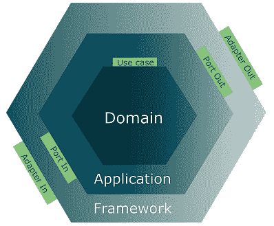
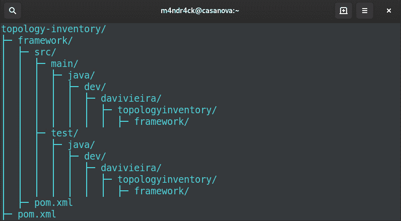

# 第八章：构建框架六边形

当构建六边形应用时，最后一步是通过将输入适配器连接到输入端口来公开应用功能。此外，如果需要从外部系统获取数据或将其持久化，则需要将输出适配器连接到输出端口。框架六边形是我们组装所有适配器以使六边形系统工作的地方。

我们首先在领域六边形中创建了领域模型，包括实体、值对象和规范。然后，在应用六边形中，我们使用用例和端口表达用户的意图。现在，在框架六边形中，我们必须使用适配器来公开系统功能并定义将用于启用这些功能的技术。在组装了领域、应用和框架六边形之后，我们将拥有一个类似于以下图示的架构：



图 8.1 – 领域、应用和框架六边形组合

六边形架构之所以引人入胜，在于我们可以在不担心改变领域六边形包裹的核心系统逻辑的情况下添加和删除适配器。当然，这需要付出数据在领域实体和外部实体之间转换的代价。然而，作为交换，我们获得了一个更加解耦的系统，其责任领域之间有清晰的边界。

在本章中，我们将涵盖以下主题：

+   引入框架六边形

+   实现输出适配器

+   实现输入适配器

+   测试框架六边形

到本章结束时，您将学会创建输入适配器，使六边形应用功能可供其他用户和系统使用。您还将学习如何实现输出适配器，以使六边形系统能够与外部数据源通信。

# 技术要求

要编译和运行本章中展示的代码示例，您需要在计算机上安装最新的**Java SE 开发工具包**和**Maven 3.8**。它们都适用于 Linux、Mac 和 Windows 操作系统。

您可以在 GitHub 上找到本章的代码文件，地址为[`github.com/PacktPublishing/-Designing-Hexagonal-Architecture-with-Java---Second-Edition/tree/main/Chapter08`](https://github.com/PacktPublishing/-Designing-Hexagonal-Architecture-with-Java---Second-Edition/tree/main/Chapter08)。

# 引入框架六边形

当使用六边形架构构建系统时，你不需要一开始就决定系统 API 将使用 REST 还是 gRPC，也不需要决定系统的主要数据源将是 MySQL 数据库还是 MongoDB。相反，你需要做的是从领域六边形开始建模你的问题域，然后在应用六边形中设计和实现用例。然后，只有在创建了前两个六边形之后，你才需要开始考虑哪些技术将使六边形系统的功能得以实现。

以**领域驱动设计**为中心的六边形方法使我们能够推迟关于六边形系统内部或外部底层技术的决策。六边形方法的另一个优点是适配器的可插拔性。如果你想通过 REST 公开某个系统功能，你可以在输入端口创建并插入一个 REST 输入适配器。稍后，如果你想通过 gRPC 向客户端公开相同的功能，你可以在同一个输入端口创建并插入一个 gRPC 输入适配器。

在处理外部数据源时，我们使用输出适配器具有相同的可插拔优势。你可以将不同的输出适配器插入到同一个输出端口，无需对整个六边形系统进行大规模重构即可更改底层数据源技术。

为了进一步探索输入适配器，我们将在*第十二章*，*使用 RESTEasy Reactive 实现输入适配器*中进行更深入的讨论。我们还将调查在*第十三章*，*使用输出适配器和 Hibernate Reactive 持久化数据*中输出适配器的更多可能性。

让我们坚持基础，为输入和输出适配器创建一个坚实的基础结构。在这个结构之上，稍后我们将能够添加 Quarkus 框架提供的令人兴奋的功能。

继续开发拓扑和库存系统，我们需要将框架六边形作为 Maven 和 Java 模块启动。

在拓扑和库存 Maven 根项目中，我们必须运行以下命令：

```java
mvn archetype:generate \
    -DarchetypeGroupId=de.rieckpil.archetypes  \
    -DarchetypeArtifactId=testing-toolkit \
    -DarchetypeVersion=1.0.0 \
    -DgroupId=dev.davivieira \
    -DartifactId=framework \
    -Dversion=1.0-SNAPSHOT \
    -Dpackage=dev.davivieira.topologyinventory.framework \
    -DinteractiveMode=false
```

如果你使用 Windows，我们建议直接在 CMD 中运行前面的命令，而不是 PowerShell。如果你需要使用 PowerShell，你需要将命令的每一部分用双引号括起来。

`mvn` `archetype:generate`目标在`topology-inventory`内部创建一个名为`framework`的 Maven 模块。此模块包含基于我们传递给`mvn`命令的`groupId`和`artificatId`的骨架目录结构。此外，它还包括`framework`目录内的子`pom.xml`文件。

执行`mvn`命令创建`framework`模块后，根项目的`pom.xml`文件将更新以包含新的模块：

```java
<modules>
  <module>domain</module>
  <module>application</module>
  <module>framework</module>
</modules>
```

`framework`模块作为最新添加的模块被插入到末尾。

由于 `framework` 模块依赖于 `domain` 和 `application` 模块，我们需要将它们添加为依赖项到 `framework` 模块的 `pom.xml` 文件中：

```java
<dependencies>
  <dependency>
    <groupId>dev.davivieira</groupId>
    <artifactId>domain</artifactId>
    <version>1.0-SNAPSHOT</version>
  </dependency>
  <dependency>
    <groupId>dev.davivieira</groupId>
    <artifactId>application</artifactId>
    <version>1.0-SNAPSHOT</version>
  </dependency>
<dependencies>
```

运行 Maven 命令创建 `framework` 模块后，你应该看到一个类似于下面所示的目录树：



图 8.2 – 框架六边形的目录结构

在 `framework` 目录中应该有一个子 `pom.xml` 文件，在 `topology-inventory` 目录中应该有一个父 `pom.xml` 文件。

一旦我们完成了 Maven 配置，我们就可以创建将 `framework` Maven 模块转换为 Java 模块的描述符文件。我们通过创建以下文件来完成此操作，`topology-inventory/framework/src/java/module-info.java`：

```java
module framework {
    requires domain;
    requires application;
}
```

由于我们已经将 `domain` 和 `application` 作为 Maven 依赖项添加到框架的 `pom.xml` 文件中，我们也可以将它们作为 Java 模块依赖项添加到 `module-info.java` 描述符文件中。

在为框架六边形正确配置了 Maven 和 Java 模块之后，我们可以继续创建拓扑和库存系统的输出适配器。

# 实现输出适配器

我们将首先实现输出适配器，以设置我们的拓扑和库存系统与底层数据源技术（一个 `H2` 内存数据库）之间的集成。首先实现输出适配器也很重要，因为我们实现输入适配器时会引用它们。

拓扑和库存系统允许外部检索路由器和交换机实体的数据。因此，在本节中，我们将回顾获取与这些实体相关的外部数据的输出端口接口。我们还将为每个输出端口接口提供输出适配器实现。

## 路由管理输出适配器

我们需要创建的路由管理输出适配器应该实现这个 `RouterManagementOutputPort` 接口：

```java
package dev.davivieira.topologyinventory.application.
  ports.output;
import
  dev.davivieira.topologyinventory.domain.entity.Router;
import dev.davivieira.topologyinventory.domain.vo.Id;
public interface RouterManagementOutputPort {
    Router retrieveRouter(Id id);
    Router removeRouter(Id id);
    Router persistRouter(Router router);
}
```

`retrieveRouter` 和 `removeRouter` 方法的签名都包含 `Id` 参数。我们使用 `Id` 来识别底层数据源中的路由器。然后，我们有 `persistRouter` 方法的签名接收一个 `Router` 参数，它可以代表核心路由器和边缘路由器。我们使用该 `Router` 参数在数据源中持久化数据。

对于拓扑和库存系统，目前我们只需要实现一个输出适配器，以便系统可以使用 `H2` 内存数据库。

我们从 `RouterManagementH2Adapter` 类开始实现：

```java
package dev.davivieira.topologyinventory.framework.
  adapters.output.h2;
import dev.davivieira.topologyinventory.application.ports.
  output.RouterManagementOutputPort;
import dev.davivieira.topologyinventory.domain.
  entity.Router;
import dev.davivieira.topologyinventory.domain.vo.Id;
import dev.davivieira.topologyinventory.framework.adapters.
  output.h2.data.RouterData;
import dev.davivieira.topologyinventory.framework.adapters.
  output.h2.mappers.RouterH2Mapper;
import jakarta.persistence.EntityManager;
import jakarta.persistence.EntityManagerFactory;
import jakarta.persistence.Persistence;
import jakarta.persistence.PersistenceContext;
public class RouterManagementH2Adapter implements
  RouterManagementOutputPort {
    private static RouterManagementH2Adapter instance;
    @PersistenceContext
    private EntityManager em;
    private RouterManagementH2Adapter(){
        setUpH2Database();
    }
    /** Code omitted **/
}
```

`H2` 数据库连接由 `EntityManager` 控制。此连接由 `setUpH2Database` 方法配置，我们在调用类的空构造函数时执行此方法。我们使用名为 `instance` 的变量来提供单例，以便其他对象可以触发数据库操作。

让我们实现输出端口接口上声明的每个方法：

1.  我们从`retrieveRouter`方法开始，它接收`Id`作为参数：

    ```java
    @Override
    public Router retrieveRouter(Id id) {
        var routerData = em.getReference(
                         RouterData.class, id.getUuid());
        return RouterH2Mapper.
          routerDataToDomain(routerData);
    }
    ```

    使用`EntityManager`的`getReference`方法调用，并使用`RouterData.class`作为参数，UUID 值从`Id`对象中提取。`RouterData`是我们用来将来自数据库的数据映射到`Router`域实体类的数据库实体类。这种映射是通过`RouterH2Mapper`类的`routerDataToDomain`方法完成的。

1.  然后，我们实现`removeRouter`方法，它从数据库中删除路由器：

    ```java
    @Override
    public Router removeRouter(Id id) {
        var routerData = em.getReference(
                         RouterData.class, id.getUuid());
        em.remove(routerData);
        return null;
    }
    ```

    要删除一个路由器，我们首先需要通过调用`getReference`方法来检索它。一旦我们有了表示数据库实体的`RouterData`对象，我们就可以从`EntityManager`调用`remove`方法，从而从数据库中删除路由器。

1.  最后，我们实现`persistRouter`方法：

    ```java
    @Override
    public Router persistRouter(Router router) {
        var routerData = RouterH2Mapper.
                         routerDomainToData(router);
        em.persist(routerData);
        return router;
    }
    ```

    它接收一个需要转换为`RouterData`数据库实体对象以便使用`EntityManager`的`persist`方法持久化的`Router`域实体对象。

通过实现`retrieveRouter`、`removeRouter`和`persistRouter`方法，我们提供了拓扑和库存系统所需的基本数据库操作。

让我们继续查看交换机输出适配器的实现。

## 交换机管理输出适配器

我们为交换机实现的输出适配器更简单，因为我们不需要直接持久化交换机或删除它们。交换机输出适配器的唯一目的是从数据库中检索交换机。我们只允许通过路由器输出适配器进行持久化。

要开始，让我们定义`SwitchManagementOutputPort`接口：

```java
package dev.davivieira.topologyinventory.application.
  ports.output;
import dev.davivieira.topologyinventory.domain.
  entity.Switch;
import dev.davivieira.topologyinventory.domain.vo.Id;
public interface SwitchManagementOutputPort {
    Switch retrieveSwitch(Id id);
}
```

我们只有一个名为`retrieveSwitch`的方法，它接收`Id`并返回`Switch`。

`SwitchManagementH2Adapter`输出适配器的实现非常简单，与其路由器对应部分类似。所以，我们只需评估`retrieveSwitch`方法的实现：

```java
/** Code omitted **/
public class SwitchManagementH2Adapter implements
  SwitchManagementOutputPort {
    /** Code omitted **/
    @Override
    public Switch retrieveSwitch(Id id) {
        var switchData = em.getReference(
                         SwitchData.class, id.getUuid());
        return
        RouterH2Mapper.switchDataToDomain(switchData);
    }
    /** Code omitted **/
}
```

我们使用`EntityManager`的`getReference`方法，并使用`SwitchData.class`和从`Id`对象中提取的 UUID 值作为参数来检索一个`SwitchData`数据库实体对象。然后，当我们从`RouterH2Mapper`类调用`switchDataToDomain`方法时，该对象被转换为`Switch`域实体。

现在我们已经正确实现了`RouterManagementH2Adapter`和`SwitchManagementH2Adapter`，我们可以继续实现输入适配器。

# 实现输入适配器

当构建应用程序六边形时，我们需要创建用例和输入端口来表示系统能力。为了使这些能力对用户和其他系统可用，我们需要构建输入适配器并将它们连接到输入端口。

对于拓扑和库存系统，我们将实现一组通用输入适配器作为 Java POJO。这些通用输入适配器是技术特定实现的基础，该实现发生在 *第十二章*，*使用 RESTEasy Reactive 实现输入适配器*。在该章中，我们将重新实现通用输入适配器，作为基于 RESTEasy 的输入适配器，使用 Quarkus 框架。

输入适配器的核心作用是从六边形系统外部接收请求，并使用输入端口来满足这些请求。

继续开发拓扑和库存系统，让我们实现接收与路由器管理相关的请求的输入适配器。

## 路由器管理输入适配器

我们首先创建 `RouterManagementGenericAdapter` 类：

```java
public class RouterManagementGenericAdapter {
    private RouterManagementUseCase
      routerManagementUseCase;
    public RouterManagementGenericAdapter(){
        setPorts();
    }
    /** Code omitted **/
}
```

我们通过声明一个 `RouterManagementUseCase` 类属性来开始 `RouterManagementGenericAdapter` 的实现。我们不是使用输入端口类引用，而是利用用例接口引用 `RouterManagementUseCase` 来连接到输入端口。

在 `RouterManagementGenericAdapter` 构造函数中，我们调用 `setPorts` 方法，该方法使用 `RouterManagementH2Adapter` 参数作为输出端口来连接到输入端口使用的 H2 内存数据库。

下面是我们应该如何实现 `setPorts` 方法：

```java
private void setPorts(){
    this.routerManagementUseCase =
            new RouterManagementInputPort(
            RouterManagementH2Adapter.getInstance()
    );
}
/** Code omitted **/
```

`setPorts` 方法将一个 `RouterManagementInputPort` 对象存储在我们之前定义的 `RouterManagementUseCase` 属性中。

在类初始化之后，我们需要创建暴露六边形系统支持的操作的方法。这里的意图是在输入适配器中接收请求，并通过使用其用例接口引用将其转发到输入端口：

1.  这里是检索和从系统中删除路由器的操作：

    ```java
    /**
     * GET /router/retrieve/{id}
     * */
    public Router retrieveRouter(Id id){
        return routerManagementUseCase.retrieveRouter(id);
    }
    /**
     * GET /router/remove/{id}
     * */
    public Router removeRouter(Id id){
        return routerManagementUseCase.removeRouter(id);
    }
    ```

    注释是为了提醒我们，这些操作在将 Quarkus 集成到六边形系统时将被转换为 REST 端点。`retrieveRouter` 和 `removeRouter` 都接收 `Id` 作为参数。然后，使用用例引用将请求转发到输入端口。

1.  然后，我们有创建新路由器的操作：

    ```java
    /**
     * POST /router/create
     * */
    public Router createRouter(Vendor vendor,
                                   Model,
                                   IP,
                                   Location,
                                   RouterType routerType){
        var router = routerManagementUseCase.createRouter(
                null,
                vendor,
                model,
                ip,
                location,
                routerType
       );
       return routerManagementUseCase.
         persistRouter(router);
    }
    ```

    从 `RouterManagementUseCase` 引用中，我们首先调用 `createRouter` 方法创建一个新的路由器，然后使用 `persistRouter` 方法将其持久化。

1.  记住，在拓扑和库存系统中，只有核心路由器可以接收来自核心路由器和边缘路由器的连接。为了允许将路由器添加到或从核心路由器中移除，我们首先定义以下操作来添加路由器：

    ```java
    /**
     * POST /router/add
     * */
    public Router addRouterToCoreRouter(
        Id routerId, Id coreRouterId){
        Router = routerManagementUseCase.
        retrieveRouter(routerId);
        CoreRouter =
            (CoreRouter) routerManagementUseCase.
            retrieveRouter(coreRouterId);
        return routerManagementUseCase.
                addRouterToCoreRouter(router, coreRouter);
    }
    ```

    对于`addRouterToCoreRouter`方法，我们传递路由器的`Id`实例作为参数，我们打算添加的目标核心路由器的`Id`。有了这些 ID，我们调用`retrieveRouter`方法从我们的数据源获取路由器对象。一旦我们有了`Router`和`CoreRouter`对象，我们通过使用情况引用来处理对输入端口的请求，通过调用`addRouterToCoreRouter`将一个路由器添加到另一个路由器。

    然后，我们定义从核心路由器中移除路由器的操作：

    ```java
    /**
     * POST /router/remove
     * */
    public Router removeRouterFromCoreRouter(
        Id routerId, Id coreRouterId){
        Router =
        routerManagementUseCase.
        retrieveRouter(routerId);
        CoreRouter =
             (CoreRouter) routerManagementUseCase.
             retrieveRouter(coreRouterId);
        return routerManagementUseCase.
                removeRouterFromCoreRouter(router,
                  coreRouter);
    }
    ```

    对于`removeRouterFromCoreRouter`方法，我们遵循与`addRouterToCoreRouter`方法相同的步骤。然而，唯一的区别是，在最后，我们从使用情况中调用`removeRouterFromCoreRouter`以从另一个路由器中移除一个路由器。

让我们现在创建处理交换机相关操作的适配器。

## 交换机管理输入适配器

在我们定义暴露交换机相关操作的函数之前，我们需要配置`SwitchManagementGenericAdapter`类的适当初始化：

```java
package dev.davivieira.topologyinventory.framework.
  adapters.input.generic;
import dev.davivieira.topologyinventory.application.
  ports.input.*
import dev.davivieira.topologyinventory.application.
  usecases.*;
import dev.davivieira.topologyinventory.domain.entity.*;
import dev.davivieira.topologyinventory.domain.vo.*;
import dev.davivieira.topologyinventory.framework.
  adapters.output.h2.*;
public class SwitchManagementGenericAdapter {
    private SwitchManagementUseCase
      switchManagementUseCase;
    private RouterManagementUseCase
      routerManagementUseCase;
    public SwitchManagementGenericAdapter(){
        setPorts();
    }
```

`SwitchManagementGenericAdapter`连接到两个输入端口——第一个输入端口是来自`SwitchManagementUseCase`的`SwitchManagementInputPort`，第二个输入端口是来自`RouterManagementUseCase`的`RouterManagementInputPort`。这就是为什么我们开始类实现时声明了`SwitchManagementUseCase`和`RouterManagementUseCase`的属性。我们将交换机适配器连接到路由器输入端口，因为我们想强制任何持久化活动只通过路由器发生。`Router`实体作为一个聚合，控制与其相关的对象的生命周期。

接下来，我们实现`setPorts`方法：

```java
private void setPorts(){
    this.switchManagementUseCase =
            new SwitchManagementInputPort(
            SwitchManagementH2Adapter.getInstance()
    );
    this.routerManagementUseCase =
            new RouterManagementInputPort(
            RouterManagementH2Adapter.getInstance()
    );
}
** Code omitted **
```

通过`setPorts`方法，我们使用`SwitchManagementH2Adapter`和`RouterManagementH2Adapter`适配器初始化两个输入端口，以允许访问 H2 内存数据库。

让我们看看如何实现暴露交换机相关操作的函数：

1.  我们从一个简单的操作开始，这个操作只是检索一个交换机：

    ```java
    /**
     * GET /switch/retrieve/{id}
     * */
    public Switch retrieveSwitch(Id switchId) {
        return switchManagementUseCase.
          retrieveSwitch(switchId);
    }
    ```

    `retrieveSwitch`方法接收`Id`作为参数。然后，它利用使用情况引用将请求转发到输入端口。

1.  接下来，我们有一个方法，允许我们创建并添加一个交换机到边缘路由器：

    ```java
    /**
     * POST /switch/create
     * */
    public EdgeRouter createAndAddSwitchToEdgeRouter(
           Vendor,
           Model,
           IP,
           Location,
           SwitchType, Id routerId
    ) {
        Switch newSwitch = switchManagementUseCase.
        createSwitch(vendor, model, ip, location,
          switchType);
        Router edgeRouter = routerManagementUseCase.
        retrieveRouter(routerId);
        if(!edgeRouter.getRouterType().equals
          (RouterType.EDGE))
            throw new UnsupportedOperationException(
        "Please inform the id of an edge router to add a
         switch");
        Router = switchManagementUseCase.
        addSwitchToEdgeRouter(newSwitch, (EdgeRouter)
          edgeRouter);
        return (EdgeRouter)
        routerManagementUseCase.persistRouter(router);
    }
    ```

    我们通过传递`createAndAddSwitchToEdgeRouter`方法接收到的参数调用交换机输入端口的`createSwitch`方法来创建一个交换机。通过`routerId`，我们通过调用`router`输入端口的`retrieveRouter`方法检索边缘路由器。一旦我们有了`Switch`和`EdgeRouter`对象，我们可以调用`addSwitchToEdgeRouter`方法将交换机添加到边缘路由器。作为最后一步，我们调用`persistRouter`方法在数据源中持久化操作。

1.  最后，我们有`removeSwitchFromEdgeRouter`方法，它允许我们从边缘路由器中移除一个交换机：

    ```java
    /**
     * POST /switch/remove
     * */
    public EdgeRouter removeSwitchFromEdgeRouter(
    Id switchId, Id edgeRouterId) {
        EdgeRouter =
                (EdgeRouter) routerManagementUseCase.
                             retrieveRouter(edgeRouterId);
        Switch networkSwitch = edgeRouter.
                               getSwitches().
                               get(switchId);
        Router = switchManagementUseCase.
                        removeSwitchFromEdgeRouter(
                        networkSwitch, edgeRouter);
        return (EdgeRouter) routerManagementUseCase.
        persistRouter(router);
    }
    ```

    `removeSwitchFromEdgeRouter`接收交换机的`Id`参数以及边缘路由器的另一个`Id`。然后，它通过调用`retrieveRouter`方法检索路由器。使用交换机 ID，它从边缘路由器对象中检索`switch`对象。一旦获取到`Switch`和`EdgeRouter`对象，它就调用`removeSwitchFromEdgeRouter`方法从边缘路由器中移除交换机。

现在剩下的是实现处理拓扑和库存网络的适配器。

## 网络管理输入适配器

正如我们在路由器和交换机适配器中所做的那样，让我们首先定义它需要的端口来实现`NetworkManagementGenericAdapter`类：

```java
package dev.davivieira.topologyinventory.framework.
  adapters.input.generic;
import dev.davivieira.topologyinventory.application.
  ports.input.*;
import dev.davivieira.topologyinventory.application.
  usecases.*;
import dev.davivieira.topologyinventory.domain.
  entity.Switch;
import dev.davivieira.topologyinventory.domain.vo.*;
import dev.davivieira.topologyinventory.framework.
  adapters.output.h2.*;
public class NetworkManagementGenericAdapter {
    private SwitchManagementUseCase
      switchManagementUseCase;
    private NetworkManagementUseCase
    networkManagementUseCase;
    public NetworkManagementGenericAdapter(){
        setPorts();
    }
```

除了`NetworkManagementUseCase`，我们还使用`SwitchManagementUseCase`。我们需要从`NetworkManagementGenericAdapter`的构造函数中调用`setPorts`方法，以正确初始化输入端口对象并将它们分配给相应的用例引用。以下是如何实现`setPorts`方法的示例：

```java
private void setPorts(){
    this.switchManagementUseCase =
             new SwitchManagementInputPort(
             SwitchManagementH2Adapter.getInstance());
    this.networkManagementUseCase =
             new NetworkManagementInputPort(
             RouterManagementH2Adapter.getInstance());
}
/** Code omitted **/
```

正如我们在之前的输入适配器实现中所做的那样，我们配置`setPorts`方法以初始化输入端口对象并将它们分配给用例引用。

让我们实现与网络相关的函数：

1.  首先，我们实现`addNetworkToSwitch`方法以将网络添加到交换机：

    ```java
    /**
     * POST /network/add
     * */
    public Switch addNetworkToSwitch(Network network, Id
      switchId) {
        Switch networkSwitch = switchManagementUseCase.
                               retrieveSwitch(switchId);
        return networkManagementUseCase.
               addNetworkToSwitch(
               network, networkSwitch);
    }
    ```

    `addNetworkToSwitch`方法接收`Network`和`Id`对象作为参数。为了继续操作，我们需要通过调用`retrieveSwitch`方法来检索`Switch`对象。然后，我们可以调用`addNetworkToSwitch`方法将网络添加到交换机。

1.  然后，我们实现从交换机中移除网络的方法：

    ```java
    /**
     * POST /network/remove
     * */
    public Switch removeNetworkFromSwitch(
    String networkName, Id switchId) {
        Switch networkSwitch = switchManagementUseCase.
                               retrieveSwitch(switchId);
        return networkManagementUseCase.
               removeNetworkFromSwitch(
               networkName, networkSwitch);
    }
    ```

    首先，我们通过使用`Id`参数调用`retrieveSwitch`方法来获取`Switch`对象。要从交换机中移除网络，我们使用网络名称从交换机附加的网络列表中找到它。我们通过调用`removeNetworkFromSwitch`方法来完成这个操作。

管理网络的适配器是我们必须实现的最后一个输入适配器。有了这三个适配器，我们现在可以从框架六边形管理路由器、交换机和网络。为了确保这些适配器工作良好，让我们为它们创建一些测试。

# 测试框架六边形

通过测试框架六边形，我们不仅有机会检查输入和输出适配器是否工作良好，还可以测试其他六边形（域和应用）是否在响应来自框架六边形的请求时履行其职责。

为了测试它，我们调用输入适配器以触发下游六边形中所有必要操作的执行，以满足请求。我们首先实现路由器管理适配器的测试。交换机和网络的测试遵循相同的模式，并在本书的 GitHub 仓库中可用。

对于路由器，我们将把我们的测试放入`RouterTest`类中：

```java
public class RouterTest extends FrameworkTestData {
    RouterManagementGenericAdapter
    routerManagementGenericAdapter;
    public RouterTest() {
        this.routerManagementGenericAdapter =
        new RouterManagementGenericAdapter();
        loadData();
    }
    /** Code omitted **/
}
```

在`RouterTest`构造函数中，我们实例化了用于执行测试的`RouterManagementGenericAdapter`输入适配器类。`loadData`方法从`FrameworkTestData`父类加载一些测试数据。

一旦我们正确配置了测试的要求，我们就可以继续进行测试：

1.  首先，我们测试路由器检索：

    ```java
    @Test
    public void retrieveRouter() {
        var id = Id.withId(
        "b832ef4f-f894-4194-8feb-a99c2cd4be0c");
        var actualId = routerManagementGenericAdapter.
                       retrieveRouter(id).getId();
        assertEquals(id, actualId);
    }
    ```

    我们调用输入适配器，通知它我们想要检索的路由器`id`。使用`assertEquals`，我们比较预期的 ID 与实际 ID，以查看它们是否匹配。

1.  为了测试路由器创建，我们必须实现`createRouter`测试方法：

    ```java
    @Test
    public void createRouter() {
        var ipAddress = "40.0.0.1";
        var routerId  = this.
        routerManagementGenericAdapter.createRouter(
                Vendor.DLINK,
                Model.XYZ0001,
                IP.fromAddress(ipAddress),
                locationA,
                RouterType.EDGE).getId();
        var router = this.routerManagementGenericAdapter.
        retrieveRouter(routerId);
        assertEquals(routerId, router.getId());
        assertEquals(Vendor.DLINK, router.getVendor());
        assertEquals(Model.XYZ0001, router.getModel());
        assertEquals(ipAddress,
        router.getIp().getIpAddress());
        assertEquals(locationA, router.getLocation());
        assertEquals(RouterType.EDGE,
        router.getRouterType());
    }
    ```

    从路由器输入适配器中，我们调用`createRouter`方法来创建和持久化一个新的路由器。然后，我们使用刚刚创建的路由器之前生成的 ID 调用`retrieveRouter`方法。最后，我们运行`assertEquals`以确认从数据源检索的路由器确实是我们创建的路由器。

1.  为了测试将路由器添加到核心路由器，我们实现了`addRouterToCoreRouter`测试方法：

    ```java
    @Test
    public void addRouterToCoreRouter() {
        var routerId = Id.withId(
        "b832ef4f-f894-4194-8feb-a99c2cd4be0b");
        var coreRouterId = Id.withId(
        "b832ef4f-f894-4194-8feb-a99c2cd4be0c");
        var actualRouter =
        (CoreRouter) this.routerManagementGenericAdapter.
        addRouterToCoreRouter(routerId,coreRouterId);
        assertEquals(routerId,
        actualRouter.getRouters().get(routerId).getId());
    }
    ```

    我们将变量`routerId`和`coreRouterId`作为参数传递给输入适配器的`addRouterToCoreRouter`方法，该方法返回一个核心路由器。`assertEquals`检查核心路由器是否包含我们添加的路由器。

1.  为了测试从核心路由器中移除路由器，我们将使用以下代码：

    ```java
    @Test
    public void removeRouterFromCoreRouter(){
        var routerId = Id.withId(
        "b832ef4f-f894-4194-8feb-a99c2cd4be0a");
        var coreRouterId = Id.withId(
        "b832ef4f-f894-4194-8feb-a99c2cd4be0c");
        var removedRouter =
        this.routerManagementGenericAdapter.
        removeRouterFromCoreRouter(routerId,
        coreRouterId);
        var coreRouter =
        (CoreRouter)this.routerManagementGenericAdapter.
        retrieveRouter(coreRouterId);
        assertEquals(routerId, removedRouter.getId());
        assertFalse(
        coreRouter.getRouters().containsKey(routerId));
    }
    ```

    此测试与上一个测试非常相似。我们再次使用`routerId`和`coreRouterId`变量，但现在我们还使用了`removeRouterFromCoreRouter`方法，该方法返回被移除的路由器。`assertEquals`检查移除的路由器的 ID 是否与`routerId`变量的 ID 匹配。

要运行这些测试，请在 Maven 项目根目录中执行以下命令：

```java
mvn test
```

输出应类似于以下内容：

```java
[INFO]  T E S T S
[INFO] -------------------------------------------------------
[INFO] Running dev.davivieira.topologyinventory.framework.NetworkTest
[INFO] Tests run: 2, Failures: 0, Errors: 0, Skipped: 0, Time elapsed: 0.654 s - in dev.davivieira.topologyinventory.framework.NetworkTest
[INFO] Running dev.davivieira.topologyinventory.framework.RouterTest
[INFO] Tests run: 5, Failures: 0, Errors: 0, Skipped: 0, Time elapsed: 0.014 s - in dev.davivieira.topologyinventory.framework.RouterTest
[INFO] Running dev.davivieira.topologyinventory.framework.SwitchTest
[INFO] Tests run: 3, Failures: 0, Errors: 0, Skipped: 0, Time elapsed: 0.006 s - in dev.davivieira.topologyinventory.framework.SwitchTest
```

除了`RouterTest`之外，我们还有来自`SwitchTest`和`NetworkTest`的测试，这些测试可以在之前提到的书的 GitHub 仓库中找到。

通过实现框架六边形测试，我们完成了框架六边形的开发以及整个拓扑和库存系统后端。结合本章和前几章所学，我们可以将涵盖的所有技术应用于创建遵循六边形架构原则的系统。

# 摘要

我们通过首先实现输出适配器来启动框架六边形构建，以使拓扑和库存系统可以使用 H2 内存数据库作为其主要数据源。

然后，我们创建了三个输入适配器：一个用于路由器操作，另一个用于交换操作，最后一个用于与网络相关的操作。最后，我们实现了测试以确保适配器和整个六边形系统按预期工作。通过完成框架六边形的开发，我们已经完成了我们整体六边形系统的开发。

我们可以通过探索**Java 模块平台系统**（**JPMS**）提供的可能性来改进我们创建的六边形系统。例如，我们可以利用六边形模块结构来应用**依赖倒置原则**（**DIP**）。通过这样做，我们可以使六边形系统更加松散耦合。我们将在下一章中探讨 DIP 和其他令人兴奋的功能。

## 问题

1.  `Framework hexagon` Java 模块依赖于哪些其他 Java 模块？

1.  为什么我们需要创建输出适配器？

1.  为了与输入端口通信，输入适配器实例化输入端口对象并将它们分配给一个接口引用。那么这个接口是什么？

1.  当我们测试`Framework hexagon`的输入适配器时，我们也在测试其他六边形。为什么会发生这种情况？

# 答案

1.  `Framework hexagon`模块依赖于领域和应用程序六边形的 Java 模块。

1.  我们创建输出适配器以使六边形系统能够连接到外部数据源。

1.  那是使用案例接口。

1.  因为输入适配器依赖于领域和应用程序六边形提供的组件。
