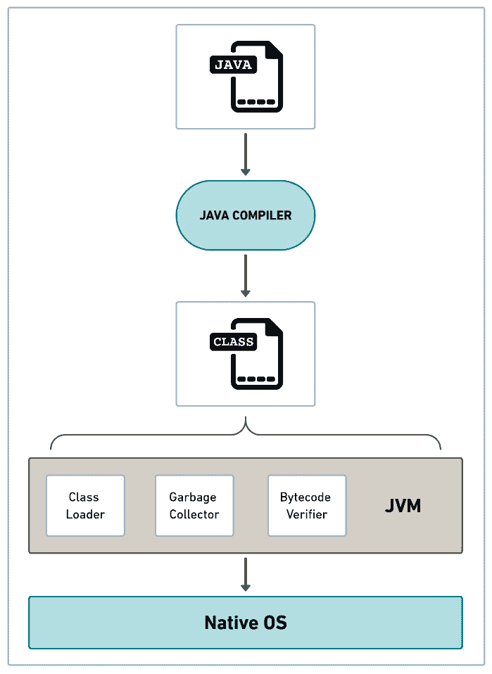
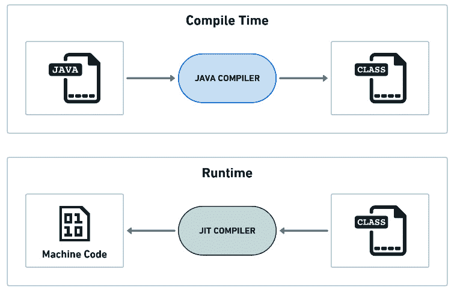
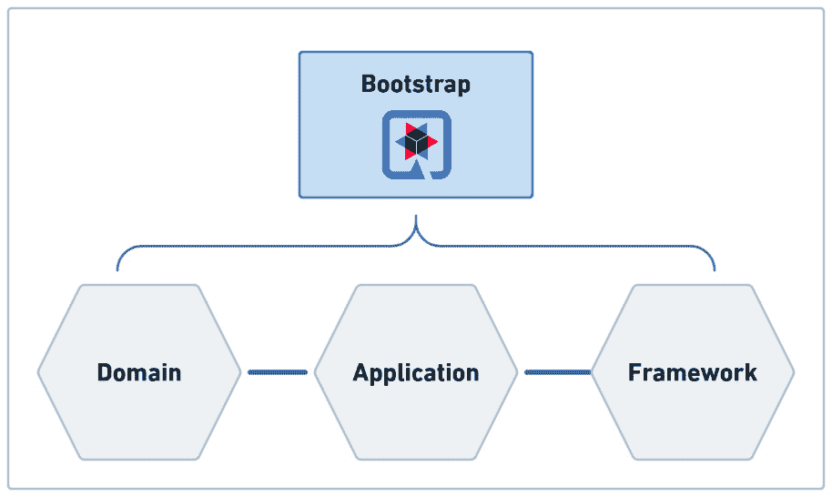
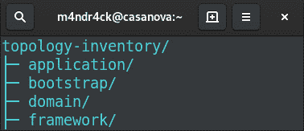
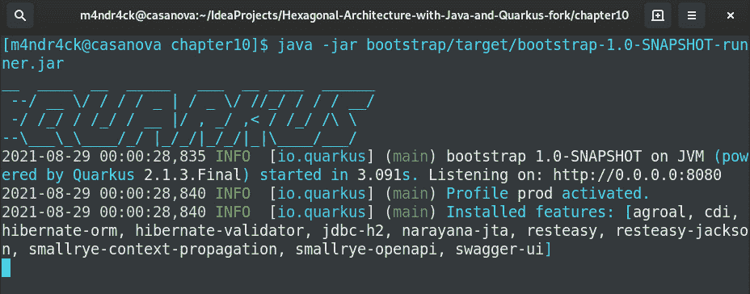

# 第十章：将 Quarkus 添加到模块化六边形应用中

本章将通过探索将我们的六边形应用转变为云原生应用的概念和技术来拓宽我们的视野。为了支持我们走向云端的旅程，我们有 Quarkus 作为关键技术，它是一个突出的 Java 云原生框架。为了理解 Quarkus 以及如何利用其特性来增强六边形系统，我们需要重新审视与 Java 虚拟机（**JVM**）内部工作原理相关的某些基本知识。通过理解 JVM 的主要特性和它们的工作方式，我们可以更好地理解 Quarkus 旨在解决的问题。

在本章中，我们还将简要浏览 Quarkus 的主要特性，以了解我们可以用这样一款优秀的软件做什么。一旦我们熟悉了 Quarkus，我们就会迈出将我们的六边形系统转变为云原生系统的第一步。为了实现这一点，我们将创建一个新的 Java 模块并配置 Quarkus 依赖项。

这些是我们将在本章中讨论的主题：

+   重新审视 JVM

+   介绍 Quarkus

+   将 Quarkus 添加到模块化六边形应用中

到本章结束时，你将了解如何配置 Quarkus 与六边形应用一起工作。这是准备一个系统以接收 Quarkus 提供的所有云原生特性的第一步。

# 技术要求

要编译和运行本章中展示的代码示例，你需要在你的计算机上安装最新的**Java 标准版（SE）开发工具包**和**Maven 3.8**。它们都适用于 Linux、Mac 和 Windows 操作系统。你可以在 GitHub 上找到本章的代码文件，网址为[`github.com/PacktPublishing/-Designing-Hexagonal-Architecture-with-Java---Second-Edition/tree/main/Chapter10`](https://github.com/PacktPublishing/-Designing-Hexagonal-Architecture-with-Java---Second-Edition/tree/main/Chapter10)。

# 重新审视 JVM

当 Java 在 1995 年回归时，**虚拟机**（**VM**）的概念并不是什么新鲜事物。在此之前，许多其他语言都使用了虚拟机，尽管它们在开发者中并不那么受欢迎。Java 架构师决定使用虚拟机，因为他们想要一个机制来创建平台独立性，以提高开发者的生产力。

在详细阐述虚拟机概念之前，让我们首先检查 Java 可以在虚拟机中运行什么。在 C 或 C++等语言中，我们将源代码编译成针对特定操作系统和 CPU 架构定制的本地代码。当用 Java 编程时，我们将源代码编译成字节码。JVM 理解字节码中的指令。

虚拟机的想法来源于在真实机器之上运行的程序在中间或虚拟环境中的概念。在这种安排中，程序不需要直接与底层操作系统通信——程序只与虚拟机打交道。然后虚拟机将字节码指令转换为本地代码指令。

我们可以用一个著名的 Java 格言来表达 JVM 的一个优点——“一次编写，到处运行”。在过去，我想现在也是如此，使用一种允许你开发无需重新编译就能在不同的操作系统和 CPU 架构上运行的软件的语言是非常吸引人的。对于其他语言，如 C++，你需要为每个目标操作系统和 CPU 架构调整你的代码，这促使你付出更多努力以使你的程序与不同的平台兼容。

在今天的云计算世界中，我们有像 Docker 和 Kubernetes 这样的服务，使软件单元比以往任何时候都更加可移植。为了在 Java 中实现可移植性，我们有执行相同编译字节码到不同操作系统和 CPU 架构上运行的 JVM 的特权。可移植性是可能的，因为每个 JVM 实现都必须遵守 JVM 规范，无论它在何处或如何实现。

相反，我们可以通过将编译好的软件及其运行时环境和依赖项打包到容器镜像中来使用容器虚拟化以实现可移植性。在不同的操作系统和 CPU 架构上运行的容器引擎可以根据容器镜像创建容器。

当你有更快、更便宜的替代方案时，JVM 在将字节码转换为本地代码以制作可移植软件方面的吸引力不再那么吸引人。今天，你可以将应用程序打包——无需 JVM 和重新编译——到一个 Docker 镜像中，并在不同的操作系统和 CPU 架构上分发。然而，我们不应忘记像 JVM 这样的软件是多么的健壮和经得起时间的考验。我们很快将回到关于 Docker 和 Kubernetes 的讨论，但就目前而言，让我们来探讨一些更有趣的 JVM 特性。

另一个重要的 JVM 方面与内存管理相关。在使用 Java 时，开发者无需担心程序如何处理内存释放和分配。这种责任转移给了 JVM，因此开发者可以更多地关注程序的功能细节，而不是技术细节。问问任何 C++开发者，在大型系统上调试内存泄漏有多有趣。

负责在 JVM 内部管理内存的功能被称为**垃圾回收器**。其目的是自动检查对象是否不再被使用或引用，以便程序可以释放未使用的内存。JVM 可以使用跟踪对象引用并标记不再引用任何对象的算法。存在不同的垃圾回收器算法，例如**并发标记清除**（**CMS**）和**垃圾优先垃圾回收器**（**G1 GC**）。自 JDK7 更新 4 以来，G1 GC 已经取代了 CMS，因为它强调首先识别和释放大部分为空的 Java 对象堆区域，从而释放更多内存，并且比 CMS 方法更快。

垃圾收集器并非在每一个 JVM 实现中都是必需的，但只要内存资源在计算中仍然是限制因素，我们经常会看到带有垃圾收集器的 JVM 实现。

JVM 还负责应用程序的整个生命周期。一切始于将 Java 类文件加载到虚拟机中。当我们编译 Java 源文件时，编译器会生成一个包含字节码的 Java 类文件。字节码是 JVM 能识别的格式。虚拟机的主要目标是加载并处理这种字节码，通过实现和遵守 JVM 规范的算法和数据结构。

以下图表说明了执行 Java 程序所需的步骤：



图 10.1 – JVM 上的 Java 编译和类加载

所有这一切都始于 Java 源代码文件，该文件由 Java 编译器编译成 Java 类文件（字节码）。这个字节码由 JVM 读取，并转换为**本地操作系统**所能理解的指令。

这种字节码问题一直是那些试图找到更快处理方法的人不懈工作的对象。

随着时间的推移，JVM 得到了良好的改进和增强技术，这些技术大大提高了字节码加载性能。在这些技术中，我们可以引用**即时编译**（**JIT**）和**提前编译**（**AOT**）。让我们来考察这两个。

## 通过即时编译加速运行时性能

**JIT 编译器**起源于这样的想法：某些程序指令可以在程序运行时进行优化以获得更好的性能。因此，为了完成这种优化，JIT 编译器寻找具有优化潜力的程序指令。一般来说，这些指令是程序执行最频繁的指令。

由于这些指令执行频率很高，它们消耗了大量的计算机时间和资源。记住这些指令是以字节码格式存在的。传统的编译器会在运行程序之前将所有字节码编译成本地代码。与 JIT 编译器不同，如下图表所示：



图 10.2 – JIT 工作原理

JIT 编译器通过使用其动态优化算法选择字节码的一部分。然后，它编译并应用优化到这些字节码部分。结果是经过优化的本地代码，经过调整以提供更好的系统性能。使用*JIT*这个术语是因为优化是在代码执行之前进行的。

然而，在使用即时编译器（JIT compilers）时，并没有免费的午餐。即时编译器最著名的缺点之一是应用程序启动时间的增加，这是因为即时编译器在运行程序之前进行的初始优化。为了克服这个启动问题，存在另一种称为 AOT 编译的技术。包括 Quarkus 在内的各种云原生框架都使用了这种技术。让我们看看 AOT 编译是如何工作的。

## 使用 AOT 编译提高启动时间

**AOT**在 Java 领域如此吸引人，因为传统的 Java 系统——主要是基于企业应用服务器，如**JBoss**和**WebLogic**——启动时间太长。除了较慢的启动时间外，我们还需要考虑这些应用服务器消耗的计算机资源。这些特性对于想要将 Java 工作负载迁移到云中的人来说是一个致命的缺点，在云中，实例和 Kubernetes Pods 疯狂地被创建和销毁。因此，通过在 Java 中使用 AOT，我们放弃了 JVM 及其字节码提供的跨平台能力，以换取 AOT 及其本地代码提供的更好性能。通过使用 Docker 和 Kubernetes 等容器技术，跨平台问题在一定程度上得到了缓解。

这里有一个表示如何将 Java 字节码转换为**机器代码**的 AOT 编译过程直观表示：


图 10.3 – AOT 的工作原理

在 Java 中使用 AOT 并不总是有利。AOT 编译器生成本地二进制文件所需的时间比 Java 编译器创建字节码类所需的时间要多。因此，AOT 编译可能会对**持续集成（CI**）管道产生相当大的影响。此外，开发者需要做一些额外的工作来确保使用反射时一切正常。**GraalVM**是用于为 Java 和其他基于 JVM 的语言提供本地二进制文件的 AOT 编译器。

使用 Quarkus，我们有权利选择使用 JIT 或 AOT 编译方法来创建应用程序。选择哪种技术更适合我们的需求取决于我们。

在本节中，我们了解了一些关于 JVM 内部工作原理以及它是如何通过 JIT 和 AOT 编译来尝试改进字节码加载的背景知识。这种知识对于理解 Quarkus 在底层是如何工作以及如何实现显著的性能提升非常重要。

既然我们已经熟悉了一些 JVM 基础和基本的编译技术，让我们深入探讨并了解 Quarkus 的主要特性。

# 介绍 Quarkus

如果你开发企业级 Java 应用程序，你已经使用过 Spring Boot 了。经过时间考验且在业界广泛使用，Spring Boot 是一款功能强大且社区活跃的软件。它的库通过提供现成的解决方案，如安全性、持久性、API 等，大大提高了开发效率，这些都是典型企业级应用程序所必需的。你可能想知道为什么这本书没有讨论 Spring Boot 而是 Quarkus。有两个原因。首先，关于 Spring Boot 的资料比 Quarkus 多，这是可以理解的，因为 Spring Boot 存在的时间更长，拥有更大的社区。第二个原因是 Quarkus 的核心是云原生开发，而 Spring Boot 则是适应了这一趋势。由于这本书专注于云原生开发和六边形架构，因此选择了 Quarkus，因为它是一个以云为先的框架。

专注于性能，Quarkus 内置了对基于 GraalVM 的本地可执行文件的支持，这使得快速启动成为可能。

为了吸引开发者，它提供了诸如实时开发等有价值的特性，该特性通过避免在代码中发生更改时需要重新启动应用程序来提高生产力。

面向云原生环境，Quarkus 配备了适当的工具，让你能够处理约束并利用在基于容器环境（如 Kubernetes）上开发软件时带来的好处。

从企业级开发中借鉴了优秀思想，Quarkus 建立在诸如**上下文和依赖注入**（**CDI**）框架、Hibernate ORM 实现的**Jakarta Persistence API**（**JPA**）规范以及 RESTEasy 实现的**Jakarta RESTful Web Services**（**JAX-RS**）规范等成熟标准之上。对于那些沉浸在 Java **企业版**（**EE**）世界的人来说，这意味着掌握 Quarkus 的学习曲线很浅，因为他们已经获得的大部分企业级开发知识可以重新用于开发 Quarkus 应用程序。

由红帽公司创建的 Quarkus，通过作为一个从头开始设计的软件开发框架来处理云技术，将自己与竞争对手区分开来。与那些带来过时代码和功能的更老框架不同，Quarkus 展示了自己作为一个新鲜现代的软件产品。

建立在其他成熟的开源项目之上，Quarkus 是我们用来为云原生系统准备六边形系统的云原生框架。在此之前，我们将探索这个框架提供的一些主要功能。让我们首先看看如何使用 Quarkus 创建 REST 端点。

## 使用 JAX-RS 创建 REST 端点

使用 Quarkus 创建 REST 端点非常简单。为了做到这一点，该框架依赖于一个名为 RESTEasy 的 JAX-RS 实现。此实现可在以下 Maven 依赖项中找到：

```java
<dependency>
    <groupId>io.quarkus</groupId>
    <artifactId>quarkus-resteasy</artifactId>
</dependency>
```

看看以下示例，它展示了如何使用 RESTEasy 创建 REST 服务：

```java
package dev.davivieira.bootstrap.samples;
import javax.ws.rs.GET;
import javax.ws.rs.Path;
import javax.ws.rs.Produces;
import javax.ws.rs.core.MediaType;
@Path("/app")
public class RestExample {
    @GET
    @Path("/simple-rest")
    @Produces(MediaType.TEXT_PLAIN)
    public String simpleRest() {
        return "This REST endpoint is provided by Quarkus";
    }
}
```

我们使用 `@Path` 注解设置端点地址。使用 `@GET`，我们设置该端点支持的 HTTP 方法。使用 `@Produces`，我们定义请求的返回类型。

在同一个 `RestExample` 类中，我们可以注入与 REST 端点一起使用的依赖项。让我们看看如何完成这个任务。

## 使用 Quarkus DI 进行依赖注入

Quarkus 有自己的基于 **Quarkus ArC** 的依赖注入机制，该机制反过来又来自 CDI 规范，其根源可以追溯到 **Java EE 6**。使用 CDI，我们不再需要控制提供给系统的依赖对象创建和生命周期。如果没有依赖注入框架，你必须这样创建对象：

```java
BeanExample beanExample = new BeanExample();
```

在使用 CDI 时，你只需将 `class` 属性注解为 `@Inject` 注解即可，如下所示：

```java
@Inject
BeanExample beanExample
```

为了使 `@Inject` 注解生效，我们首先需要将依赖项声明为托管豆。请看以下示例：

```java
package dev.davivieira.bootstrap.samples;
import javax.enterprise.context.ApplicationScoped;
import javax.validation.Valid;
@ApplicationScoped
public class BeanExample {
    public String simpleBean() {
        return "This is a simple bean";
    }
}
```

`@ApplicationScoped` 注解表示只要应用程序没有终止，这个豆就会可用。此外，这个豆在整个系统中可以从不同的请求和调用中访问。让我们更新我们的 `RestExample` 以注入这个豆，如下所示：

```java
package dev.davivieira.bootstrap.samples;
import javax.inject.Inject;
import javax.ws.rs.GET;
import javax.ws.rs.Path;
import javax.ws.rs.Produces;
import javax.ws.rs.core.MediaType;
@Path("/app")
public class RestExample {
    @Inject
    BeanExample beanExample;
    /** Code omitted **/
    @GET
    @Path("/simple-bean")
    @Produces(MediaType.TEXT_PLAIN)
    public String simpleBean() {
        return beanExample.simpleBean();
    }
}
```

在顶部，我们使用 `@Inject` 注解注入 `BeanExample` 依赖项。然后，我们调用注入的 `BeanExample` 依赖项中的 `simpleBean` 方法。

接下来，让我们看看当系统接收到 HTTP 请求时如何验证创建的对象。

## 验证对象

我们学习了如何创建 REST 端点以及如何在应用程序中注入依赖项。*但是关于对象验证呢？* *我们如何确保给定请求提供的数据是有效的呢？* Quarkus 可以帮助我们解决这个问题。Quarkus 验证机制在以下 Maven 依赖项中可用：

```java
<dependency>
    <groupId>io.quarkus</groupId>
    <artifactId>quarkus-hibernate-validator</artifactId>
</dependency>
```

Quarkus 验证机制基于 **Hibernate Validator**。

为了了解它是如何工作的，让我们首先创建一个包含我们期望在请求中出现的字段的示例对象，如下所示：

```java
package dev.davivieira.bootstrap.samples;
import javax.validation.constraints.Min;
import javax.validation.constraints.NotBlank;
public class SampleObject {
    @NotBlank(message = "The field cannot be empty")
    public String field;
    @Min(message = "The minimum value is 10", value = 10)
    public int value;
}
```

使用 `@NotBlank` 注解，我们声明 `field` 变量永远不应该为空。然后，通过使用 `@Min` 注解，我们确保 `value` 变量应该始终包含一个等于或高于 `10` 的数字。让我们回到 `RestExample` 类并创建一个新的 REST 端点来验证请求，如下所示：

```java
@POST
@Path("/request-validation")
@Produces(MediaType.APPLICATION_JSON)
@Consumes(MediaType.APPLICATION_JSON)
public Result validation(@Valid SampleObject sampleObject) {
    try {
        return new Result("The request data is valid!");
    } catch (ConstraintViolationException e) {
        return new Result(e.getConstraintViolations());
    }
}
```

当捕获到 `ConstraintViolationException` 时，系统返回一个 `HTTP 400 Bad Request` 失败响应。

注意在 `SampleObject` 之前使用的 `@Valid` 注解。通过使用该注解，每当请求击中 `/app/request-validation` 端点时，都会触发验证检查。查看以下结果：

```java
$ curl -H "Content-Type: application/json"  -d '{"field": "", "value": 10}' localhost:8080/app/request-validation | jq
{
  "exception": null,
  "propertyViolations": [],
  "classViolations": [],
  "parameterViolations": [
    {
      "constraintType": "PARAMETER",
      "path": "validation.arg0.field",
      "message": "The field cannot be empty",
      "value": ""
    }
  ],
  "returnValueViolations": []
}
```

在之前的 `POST` 请求中，字段为空，导致返回了一个带有 `HTTP 400 Bad Request` 代码的失败响应。

在下一个请求中，我们将 `value` 设置为一个小于 `10` 的数字，如下所示：

```java
$ curl -s -H "Content-Type: application/json"  -d '{"field": "test", "value": 9}' localhost:8080/app/request-validation | jq
{
  "exception": null,
  "propertyViolations": [],
  "classViolations": [],
  "parameterViolations": [
    {
      "constraintType": "PARAMETER",
      "path": "validation.arg0.value",
      "message": "The minimum value is 10",
      "value": "9"
    }
  ],
  "returnValueViolations": []
}
```

再次，违反了约束，结果显示验证失败。失败的原因是我们发送了数字 `9`，而接受的最低值是 `10`。

这里是一个带有有效数据的正确请求：

```java
$ curl -s -H "Content-Type: application/json"  -d '{"field": "test", "value": 10}' localhost:8080/app/request-validation | jq
{
  "message": "The request data is valid!",
  "success": true
}
```

`field` 参数不是 `null`，`value` 也不是小于 `10`。因此，请求返回了一个有效的响应。

## 配置数据源和使用 Hibernate ORM

Quarkus 允许您以两种方式连接到数据源。第一种是传统的基于 JDBC 连接的方式。要使用此方法连接，您需要 `agroal` 库以及您想要连接的特定数据库类型的 JDBC 驱动程序。第二种是反应式的方式，允许您将数据库连接视为数据流。为此模式，您需要 `Vert.x` 反应式驱动程序。

在以下步骤中，我们将使用传统的 JDBC 方法设置数据源连接：

1.  要开始，我们需要以下依赖项：

    ```java
    <dependency>
      <groupId>io.quarkus</groupId>
      <artifactId>quarkus-agroal</artifactId>
    </dependency>
    <dependency>
      <groupId>io.quarkus</groupId>
      <artifactId>quarkus-jdbc-h2</artifactId>
    </dependency>
    <dependency>
      <groupId>io.quarkus</groupId>
      <artifactId>quarkus-hibernate-orm</artifactId>
    </dependency>
    ```

    `quarkus-hibernate-orm` 指的是 JPA 的 Hibernate ORM 实现。正是这个依赖项提供了将 Java 对象映射到数据库实体的能力。

1.  接下来，我们需要在 `application.properties` 文件中配置数据源设置，如下所示：

    ```java
    quarkus.datasource.db-kind=h2
    quarkus.datasource.jdbc.url=jdbc:h2:mem:de
      fault;DB_CLOSE_DELAY=-1
    quarkus.hibernate-orm.dialect=org.hibernate.dia
      lect.H2Dialect
    quarkus.hibernate-orm.database.generation=drop-and-
      create
    ```

    `quarkus.datasource.db-kind` 是可选的，但我们使用它来强调应用程序使用 H2 内存数据库。我们使用 `quarkus.datasource.jdbc.url` 来提供连接字符串。`quarkus.hibernate-orm.dialect` 选项设置用于数据源通信的方言，而 `quarkus.hibernate-orm.database.generation=drop-and-create` 强制在启动时创建数据库结构。

    如果 `classpath` 中存在 `import.sql` 文件，这个 `drop-and-create` 选项允许使用该文件将数据加载到数据库中。关于这个 `drop-and-create` 选项的一个非常有趣的特点是，应用程序实体或 `import.sql` 文件上的每次更改都会自动检测并应用到数据库中，而无需重新启动系统。为了实现这一点，系统需要以实时开发模式运行。

让我们创建一个 `SampleEntity` 类以持久化到数据库中，如下所示：

```java
@Entity
@NamedQuery(name = "SampleEntity.findAll",
        query = "SELECT f FROM SampleEntity f ORDER BY
          f.field",
        hints = @QueryHint(name =
          "org.hibernate.cacheable",
        value = "true") )
public class SampleEntity {
    @Id
    @GeneratedValue(strategy = GenerationType.AUTO)
    private Long id;
    @Getter
    @Setter
    private String field;
    @Getter
    @Setter
    private int value;
}
```

`SampleEntity` 类对应于我们之前创建的 `SampleObject` 类。使用 `SampleEntity` 类作为数据库实体的要求是使用 `@Entity` 注解对其进行标注。在该注解之后，我们有 `@NamedQuery`，我们稍后会使用它从数据库中检索所有实体。为了自动生成 ID 值，我们将使用 `GenerationType.AUTO`。`SampleEntity` 中的 `field` 和 `value` 变量映射到 `SampleObject` 类中存在的相同变量。

现在让我们创建一个新的名为 `PersistenceExample` 的 Bean，以帮助我们创建和检索数据库实体。以下是这样做的方法：

```java
package dev.davivieira.bootstrap.samples;
import javax.enterprise.context.ApplicationScoped;
import javax.inject.Inject;
import javax.persistence.EntityManager;
import javax.transaction.Transactional;
import java.util.List;
@ApplicationScoped
public class PersistenceExample {
    @Inject
    EntityManager em;
    /** Code omitted **/
}
```

要与数据库交互，我们首先要做的是注入`EntityManager`。Quarkus 将负责检索一个`EntityManager`对象，该对象包含我们在`application.properties`文件中提供的所有数据库连接设置。继续`PersistenceExample`实现，让我们创建一个持久化实体的方法，如下所示：

```java
@Transactional
public String createEntity(SampleObject sampleObject) {
    SampleEntity sampleEntity = new SampleEntity();
    sampleEntity.setField(sampleObject.field);
    sampleEntity.setValue(sampleObject.value);
    em.persist(sampleEntity);
    return "Entity with field "+sampleObject.field+"
      created!";
}
```

`createEntity`方法将实体持久化到数据库中。

方法声明上方的`@Transactional`注解将使`EntityManager`对象在数据库操作提交时刷新事务。这如下面的代码片段所示：

```java
@Transactional
public List<SampleEntity> getAllEntities(){
    return em.createNamedQuery(
    "SampleEntity.findAll", SampleEntity.class)
            .getResultList();
}
```

`getAllEntities`方法从数据库中检索所有实体。

现在，让我们回到`RestExample`来创建 REST 端点以触发数据库实体的创建和检索。我们将首先注入`PersistenceExample`，这样我们就可以使用这个豆来开始对数据库的操作。代码如下所示：

```java
@Inject
PersistenceExample persistenceExample;
```

然后，我们创建一个`/create-entity`端点，如下所示：

```java
@POST
@Path("/create-entity")
@Produces(MediaType.TEXT_PLAIN)
@Consumes(MediaType.APPLICATION_JSON)
public String persistData(@Valid SampleObject sampleObject) {
    return persistenceExample.createEntity(sampleObject);
}
```

我们传递`SampleObject`作为参数。这个对象代表了`POST`请求的主体。

最后，我们创建一个`/get-all-entities`端点来从数据库中检索所有实体，如下所示：

```java
@GET
@Path("/get-all-entities")
public List<SampleEntity> retrieveAllEntities() {
    return persistenceExample.getAllEntities();
}
```

`retrieveAllEntities`方法在`PersistenceExample`豆中调用`getAllEntities`。结果是`SampleEntity`对象的一个列表。

让我们看看当我们点击`/create-entity`来创建一个新实体时我们会得到什么。你可以在这里看到输出：

```java
$ curl -s -H "Content-Type: application/json"  -d '{"field": "item-a", "value": 10}' localhost:8080/app/create-entity
Entity with field item-a created!
$ curl -s -H "Content-Type: application/json"  -d '{"field": "item-b", "value": 20}' localhost:8080/app/create-entity
Entity with field item-b created!
```

要查看我们创建的实体，我们向`/get-all-entities`发送请求，如下所示：

```java
$ curl -s localhost:8080/app/get-all-entities | jq
[
  {
    "field": "item-a",
    "value": 10
  },
  {
    "field": "item-b",
    "value": 20
  }
]
```

如预期的那样，我们以 JSON 格式收到了之前在数据库中持久化的所有实体。

Quarkus 是一个庞大且持续增长的框架，它吸收了越来越多的功能。我们看到的特性涵盖了开发现代应用程序所需的一些基本功能。

我们将在重新实现输入适配器以支持我们六边形应用程序的 REST 时使用 RESTEasy。Quarkus DI 将使我们能够更好地管理框架和应用六边形对象的生命周期。Quarkus 验证机制将有助于验证进入六边形系统的数据。数据源配置和 Hibernate ORM 将支持输出适配器的重构。

在本节中，我们学习了如何调整`application.properties`文件以在 Quarkus 上配置数据库连接，并简要探讨了 Hibernate 的 ORM 功能，这些功能有助于将 Java 类映射到数据库实体。我们将在*第十三章*中进一步探讨这个主题，*使用输出适配器和 Hibernate Reactive 持久化数据*。

现在我们来看看如何将 Quarkus 集成到六边形系统中。

# 将 Quarkus 添加到模块化的六边形应用程序中

为了总结，我们将拓扑和库存系统结构化为三个模块化的六角：**领域**、**应用**和**框架**。可能出现的疑问是，*哪个模块应该负责启动 Quarkus 引擎？* 好吧，为了避免模糊拓扑和库存系统中每个模块的责任，我们将创建一个专门的模块，其唯一目的是聚合其他六角系统模块并启动 Quarkus 引擎。我们将把这个新模块命名为**Bootstrap**，如下面的图所示：



图 10.4 – Bootstrap 聚合器模块

`bootstrap`模块是一个聚合器模块，它从一方面提供初始化 Quarkus 所需的依赖项，从另一方面提供与 Quarkus 一起使用的`hexagonal`模块依赖项。

让我们在拓扑和库存系统中创建这个新的`bootstrap`模块，如下所示：

1.  在拓扑和库存系统的 Maven 根项目中，你可以执行以下 Maven 命令来创建这个`bootstrap`模块：

    ```java
    mvn archetype:generate \
    -DarchetypeGroupId=de.rieckpil.archetypes  \
    -DarchetypeArtifactId=testing-toolkit \
    -DarchetypeVersion=1.0.0 \
    -DgroupId=dev.davivieira \
    -DartifactId=bootstrap \
    -Dversion=1.0-SNAPSHOT \
    -Dpackage=dev.davivieira.topologyinventory.bootstrap \
    bootstrap module. We set artifactId to bootstrap and groupId to dev.davivieira, as this module is part of the same Maven project that holds the modules for other topology and inventory system hexagons. The final high-level structure should be similar to the one shown here:
    ```



图 10.5 – 拓扑和库存系统高级目录结构

1.  接下来，我们需要在项目的根`pom.xml`文件中设置 Quarkus 依赖项，如下所示：

    ```java
    <dependencyManagement>
      <dependencies>
        <dependency>
          <groupId>io.quarkus</groupId>
          <artifactId>quarkus-universe-bom</artifactId>
          <version>${quarkus.platform.version}</version>
          <type>pom</type>
          <scope>import</scope>
        </dependency>
    </dependencyManagement>
    ```

    `quarkus-universe-bom`依赖项使所有 Quarkus 扩展可用。

    由于我们正在处理一个多模块应用程序，我们需要配置 Quarkus 以在不同的模块中查找 CDI 豆。

1.  因此，我们需要在 Maven 项目的根`pom.xml`文件中配置`jandex-maven-plugin`，如下所示：

    ```java
    <plugin>
      <groupId>org.jboss.jandex</groupId>
      <artifactId>jandex-maven-plugin</artifactId>
      <version>${jandex.version}</version>
      <executions>
        <execution>
          <id>make-index</id>
          <goals>
            <goal>jandex</goal>
          </goals>
        </execution>
      </executions>
    </plugin>
    ```

    如果没有前面的插件，我们将在框架和应用六角上设置和使用 CDI 豆时遇到问题。

1.  现在是至关重要的部分——配置`quarkus-maven-plugin`。为了使`bootstrap`模块成为启动 Quarkus 引擎的模块，我们需要在该模块中正确配置`quarkus-maven-plugin`。

    这是我们在`bootstrap/pom.xml`上应该如何配置`quarkus-maven-plugin`：

    ```java
    <build>
      <plugins>
        <plugin>
          <groupId>io.quarkus</groupId>
          <artifactId>quarkus-maven-plugin</artifactId>
          <version>${quarkus-plugin.version}</version>
          <extensions>true</extensions>
          <executions>
            <execution>
              <goals>
                <goal>build</goal>
                <goal>generate-code</goal>
                <goal>generate-code-tests</goal>
              </goals>
            </execution>
          </executions>
        </plugin>
      </plugins>
    </build>
    ```

    这里重要的是包含`<goal>build</goal>`的行。通过为`bootstrap`模块设置此构建目标，我们使该模块负责启动 Quarkus 引擎。

1.  接下来，我们需要添加拓扑和库存系统六角中的 Maven 依赖项。我们在`bootstrap/pom.xml`文件中这样做，如下所示：

    ```java
    <dependency>
      <groupId>dev.davivieira</groupId>
      <artifactId>domain</artifactId>
    </dependency>
    <dependency>
      <groupId>dev.davivieira</groupId>
      <artifactId>application</artifactId>
    </dependency>
    <dependency>
      <groupId>dev.davivieira</groupId>
      <artifactId>framework</artifactId>
    </dependency>
    ```

1.  最后，我们创建一个带有 Quarkus 和拓扑及库存六角模块的`requires`指令的`module-info.java` Java 模块描述符，如下所示：

    ```java
    module dev.davivieira.bootstrap {
        requires quarkus.core;
        requires domain;
        requires application;
        requires framework;
    }
    ```

为了将三个六角模块聚合为一个部署单元，我们将配置 Quarkus 生成一个 uber `.jar`文件。这种 JAR 将所有运行应用程序所需的依赖项组合在一个单一的 JAR 中。为了实现这一点，我们需要在项目的根`pom.xml`文件中设置以下配置：

```java
<quarkus.package.type>uber-jar</quarkus.package.type>
```

然后，我们可以通过运行以下 Maven 命令来编译应用程序：

```java
mvn clean package
```

此 Maven 命令将编译整个应用程序并创建一个可以执行以下命令以启动应用程序的 uber `.jar`文件：

```java
java -jar bootstrap/target/bootstrap-1.0-SNAPSHOT-runner.jar
```

注意，我们使用的工件是由`bootstrap`模块生成的，该模块聚合了所有其他模块。以下截图展示了运行中的 Quarkus 应用程序应该看起来是什么样子：



图 10.6 – 运行中的 Quarkus 应用程序

在前面的屏幕截图中看到的程序正在`prod`配置文件下运行。在该配置文件中，出于安全考虑，一些功能被禁用。我们还可以看到应用程序中运行的功能。当我们向`pom.xml`添加 Quarkus 扩展依赖项时，这些功能被激活。

`bootstrap`模块充当桥梁，使我们能够将外部开发框架连接到构成六边形系统的六边形模块。对于拓扑和库存应用程序，我们使用了 Quarkus，但也可以使用其他开发框架。我们无法说我们已经完全解耦了系统逻辑和开发框架；毕竟，仍有一些系统逻辑可以从框架功能中受益。然而，本章中提出的方法表明，该系统的一部分可以先开发，然后再引入开发框架。

# 摘要

在本章中，我们回顾了 JVM 的基本原理，评估了一些与其 JIT 编译和 AOT 编译相关的功能。我们了解到 JIT 可以提高运行时性能，而 AOT 有助于提高应用程序的启动时间，这证明了对目标云环境框架（如本例中的 Quarkus）来说是一个基本功能。

在熟悉了一些 JVM 概念之后，我们继续学习 Quarkus 及其提供的一些重要功能。最后，我们将 Quarkus 集成到我们已开发的六边形系统拓扑和库存中。为了完成这样的集成，我们创建了一个新的`bootstrap`模块，作为六边形系统模块和开发框架之间的桥梁。我们现在知道将 Quarkus 集成到模块化六边形应用程序需要什么。

在下一章中，我们将深入了解 Quarkus 和六边形架构之间的集成。我们将学习如何重构用例和端口从应用程序六边形到利用 Quarkus DI 功能。

# 问题

1.  使用 JIT 编译的优势是什么？

1.  使用 AOT 编译，我们能获得哪些好处？

1.  Quarkus 是为哪种环境专门设计的开发框架？

1.  `bootstrap`模块在六边形架构中扮演什么角色？

# 答案

1.  JIT 提高了应用程序的运行时性能。

1.  AOT 提高了应用程序的启动时间。

1.  Quarkus 是为开发云环境中的应用程序而设计的。

1.  其作用是将 Quarkus 框架与六边形系统集成。
