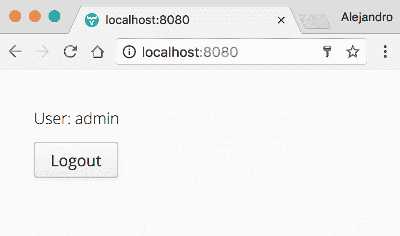
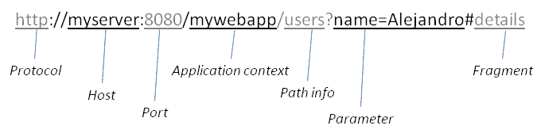

# 第四章：实现认证和授权

认证是确保用户身份的过程，通常通过提供一组识别凭证（用户名和密码）来完成。授权是确定用户在应用程序中访问级别的安全过程。在本章中，我们将继续开发在第三章中实现的登录表单，*使用国际化实现服务器端组件*，通过添加认证和授权功能。我们还将学习如何在登录表单中实现*记住我*选项。

本章涵盖了以下主题：

+   HTTP 会话

+   Cookie 管理

+   授权和认证机制

# 技术要求

您需要具备 Java SE 开发工具包和 Java EE SDK 版本 8 或更高版本。您还需要 Maven 版本 3 或更高版本。建议使用具有 Maven 支持的 Java IDE，例如 IntelliJ IDEA、Eclipse 或 NetBeans。最后，为了使用本书的 Git 仓库，您需要安装 Git。

本章的代码文件可以在 GitHub 上找到：

[`github.com/PacktPublishing/Data-centric-Applications-with-Vaadin-8/tree/master/chapter-04`](https://github.com/PacktPublishing/Data-centric-Applications-with-Vaadin-8/tree/master/chapter-04)

查看以下视频以查看代码的实际效果：

[`goo.gl/RM8KNY`](https://goo.gl/RM8KNY)

# 实现公共和私有视图

通常，Web 应用程序有两个主要屏幕。一个用于未认证的访客，另一个用于已认证的用户。以这种方式实现 UI 以反映这一点是有意义的。想法是创建两个自定义组件（使用`Composite`类）；一个用于公开访问，另一个用于已认证用户。所以，现在让我们假设我们有一个自定义的`PublicComponent`类，它显示登录表单，以及一个`PrivateComponent`，它显示如下内容：



当用户成功认证后，将显示`PrivateComponent`。当点击注销按钮时，用户应被重定向到`PublicComponent`。在本章示例中，Vaadin `UI`实现（`VaadinUI`）应反映这样一个事实：根据用户是否已认证，可以显示两个主要屏幕。

`UI`实现的`init`方法应验证用户是否已经认证，如果是，则显示`PrivateComponent`。否则，应显示`PublicComponent`。这是必要的，以覆盖用户在浏览器中重新加载页面的情况：我们不希望用户在页面重新加载后需要重新认证。在纯 Java 中，此功能看起来如下：

```java
public class VaadinUI extends UI {

    static { Messages.addBundle("messages"); }

    @Override
    protected void init(VaadinRequest vaadinRequest) {
        if (AuthService.isAuthenticated()) {
            setContent(new PrivateComponent());
        } else {
            setContent(new PublicComponent());
        }
    }
}
```

我们将在稍后开发 `AuthService` 类，但本节的重点是向你展示 `UI` 实现可以多么简单。始终尝试保持你的 `UI` 实现简单！将应用程序的实际功能委托给其他类。在你的 `UI` 实现中仅反映应用程序顶级工作流程的本质。在我们的案例中，一个简单的类显示两个主要屏幕之一，以及根据认证状态的一个合理的默认值，就足够了。

Vaadin 框架的一个安全特性是默认情况下，无法通过请求不同的 URL 来访问代码的执行。在先前的示例中，请求 `http://localhost:8080` 总是会调用 `init` 方法，这给了我们机会通过询问一个服务类来检查用户是否已认证。你可能想知道认证状态是如何在服务器上保持的。答案是 HTTP 会话。

你可以在 [`vaadin.com/security`](https://vaadin.com/security) 上了解更多关于 Vaadin 框架应用中的安全信息。

# 使用 HTTP 会话和 cookies 来识别用户

跟踪 Web 应用程序状态的一种方式是利用 HTTP 会话。当前认证的用户是应用程序状态的一部分，可以存储在 HTTP 会话中。在 Vaadin 应用程序中，你可以使用 `VaadinSession.setAttribute(String, Object)` 方法在 HTTP 会话中存储值。第一个参数是值的自定义标识符，它使用第二个参数指定。例如，我们可以在 HTTP 会话中按以下方式将数字 `777` 存储在名为 `number` 的属性中：

```java
VaadinSession.getCurrent().setAttribute("number", 777);
```

你可以通过传递 `null` 来从会话中移除值：

```java
VaadinSession.getCurrent().setAttribute("number", null);
```

# 跟踪认证用户

采用这种方法，我们可以在用户成功认证时在 HTTP 会话中存储 `username`。我们还可以通过检查 HTTP 会话中是否存在值来检查用户是否已认证。这可以按以下方式实现：

```java
public class AuthService {

    private static final String USERNAME_ATTRIBUTE = "username";

    public static boolean authenticate(
            String username, String password) {

        boolean authentic = "admin".equals(username) &&
                "admin".equals(password);

        if (authentic) {
            VaadinSession.getCurrent().setAttribute(
                    USERNAME_ATTRIBUTE, username);
        }

        return authentic;
    }

    public static boolean isAuthenticated() {
        return VaadinSession.getCurrent().getAttribute(
                USERNAME_ATTRIBUTE) != null;
    }
}
```

在这里有几个需要注意的地方。首先，为了简化这个示例，代码检查 `username` 和 `password` 是否都等于字符串 `"admin"`。在实际应用中，这应该查询数据库或委托给任何其他认证过程。例如，如果你有一个提供查询用户数据功能的类，布尔检查可能看起来像以下这样：

```java
User existingUser = userRepository.findByUsernameAndPassword(
        username, password);
boolean authentic = existingUser != null;
```

永远不要以可以恢复的方式存储密码。换句话说，总是存储密码的**盐值哈希**而不是密码本身。这不仅可以保护你的用户，也可以保护你自己！如果你将密码存储为其哈希值，你可以确信没有人，包括你自己，能够知道真正的密码。如果数据库被破坏，至少密码将会是垃圾。假设你有一个使用 SHA 或其他任何安全算法的`hash`方法。在设置密码时，你可以保存一个实体，如下所示：

`user.setPassword(hash(theActualPassword));`

为了检查密码是否正确（例如，在认证过程中），你可以将给定密码的哈希值与数据库中存储的值进行比较。如下所示：

+   `String stored = user.getPassword();`

+   `String hash = hash(attemptedPassword);`

+   `if (stored.equals(hash) {...}`

其次，`AuthService`类中包含了一些 Vaadin 相关的内容。服务类应该与表示技术解耦，但就我们而言，这是可以的，因为我们不太可能改变我们的 Web 框架！在现实生活中的应用程序中通常也是这种情况。此外，在 Vaadin 应用程序之外重用这个类似乎不太可能，但如果有必要，你可以通过直接使用 HTTP 会话将其从 Vaadin 中解耦。

如果你的应用程序允许第三方开发者向你的应用程序添加新功能，并且它公开了 HTTP 会话，那么如果开发者知道用户的用户名，他们可能能够冒充用户。由于将用户声明为已认证的唯一条件是在 HTTP 会话中有一个条目，其键为相应的用户名，恶意开发者可以添加这样的用户名并代表他们调用其他功能。在这种情况下，考虑对称加密键（用户名）或者甚至使用 HTTP 会话的替代存储机制。

# 实现登录/注销过程

让我们回顾一下到目前为止我们已经实现的内容。我们有一个多语言的`LoginFormComponent`准备使用（在第三章*，使用国际化实现服务器端组件*中开发），一个`UI`实现，根据用户是否认证显示`PublicComponent`或`PrivateComponent`，以及一个`AuthService`类，允许我们验证用户（如果他们的登录凭证正确）并检查会话中是否有已认证的用户。

是时候通过实现`PublicComponent`和`PrivateComponent`类来完成登录/注销过程了。让我们从`PublicComponent`类开始：

```java
public class PublicComponent extends Composite {

    public PublicComponent() {
        LoginFormComponent loginForm = new LoginFormComponent();
        loginForm.setCaptions(
                Messages.get("auth.username"),
                Messages.get("auth.password"),
                Messages.get("auth.login"),
                Messages.get("auth.rememberMe"));

        loginForm.setLoginListener(form -> loginClicked(form));
        setCompositionRoot(loginForm);
    }

    private void loginClicked(LoginFormComponent form) {
        if (!AuthService.authenticate(
                form.getUsername(), form.getPassword())) {
            Notification.show(
                    Messages.get("auth.bad.credentials"),
                            Notification.Type.ERROR_MESSAGE);
        }
    }
}
```

这个组件扩展了`Composite`，并使用`LoginFormComponent`作为其组合根。当用户点击相应的按钮时，会调用`loginClicked`方法，并且就在这个方法中我们尝试验证用户。如果凭据正确，我们显示一个错误通知，但如果它们是正确的，我们实际上根本不需要做任何事情！实际上，我们在这个类中真的不需要做其他任何事情。你还记得我们是如何实现`VaadinUI`类，以便根据认证状态显示一个屏幕或另一个屏幕的吗？好吧，为了使这个功能正常工作，我们只需要在认证成功时将简单的页面刷新添加到`AuthService.authenticate`方法中：

```java
public class AuthService {

    private static final String USERNAME_ATTRIBUTE = "username";

    public static boolean authenticate(
            String username, String password) {

        boolean authentic = "admin".equals(username) &&
                "admin".equals(password);

        if (authentic) {
            VaadinSession.getCurrent().setAttribute(
                    USERNAME_ATTRIBUTE, username);
            Page.getCurrent().reload();
        }

        return authentic;
    }
    ...
}
```

确实如此！因为当用户刷新浏览器时，会调用`VaadinUI.init`方法，并且我们的实现会检查 HTTP 会话中是否存在已认证的用户（通过`AuthService`类），所以我们不需要做其他任何事情。

那反过来呢？当用户登出时，我们应该执行两个操作：

1.  删除 HTTP 会话中的所有数据（使会话无效）。

1.  刷新浏览器（以调用`VaadinUI.init`方法并自动显示`PublicComponent`）。

在`AuthService`类中实现这个功能是合理的：

```java
public class AuthService {
    ...

    public static void logout() {
        VaadinService.getCurrentRequest().getWrappedSession()
                .invalidate();
        Page.getCurrent().setLocation("");
    }
}
```

`invalidate`方法会从 HTTP 会话中删除任何值并使其无效。如果再次请求应用程序，服务器将创建一个新的会话。

服务器通过多种方式维护会话，例如通过 cookie 或 URL 重写。根据您的特定服务器，您可能需要调用`VaadinService.reinitializeSession(VaadinService.getCurrentRequest())`以确保在使会话无效后生成新的会话密钥。

注意我们这次是如何重新加载浏览器的。我们不是调用`Page.reload()`方法，而是确保浏览器中的 URL 请求 Web 应用程序的起始 URL。这也会删除例如可能包含*敏感信息*的任何片段或参数。

*敏感信息*指的是任何必须保护免受未经授权访问的数据、信息或知识。

最后，`PrivateComponent`类的实现应该相当直接。为了完整性，以下是代码：

```java
public class PrivateComponent extends Composite {

    public PrivateComponent() {
        Label label = new Label(
                "User: " + AuthService.getAuthenticatedUser());
        Button logOutButton = new Button(
                Messages.get("auth.logout"),e -> logoutClicked());
        setCompositionRoot(new VerticalLayout(label,
                logOutButton));
    }

    private void logoutClicked() {
        AuthService.logout();
    }
}
```

注意`AuthService.getAuthenticatedUser()`方法。您可以使用一行代码实现该方法：

```java
public class AuthService { 
    ... 

    public static String getAuthenticatedUser() { 
        return (String) VaadinSession.getCurrent().getAttribute( 
                USERNAME_ATTRIBUTE); 
    } 
} 
```

记得在拥有发送用户凭据通过网络登录表单的 Web 应用程序时，始终使用 HTTPS（HTTP 安全）。通过启用 HTTPS，数据会被加密，防止中间人攻击。您可以在[`vaadin.com/blog/enabling-https-in-your-java-server-using-a-free-certificate`](https://vaadin.com/blog/enabling-https-in-your-java-server-using-a-free-certificate)了解更多关于如何启用 HTTPS 的信息。

# 实现记住我功能

“记住我”功能允许用户在关闭浏览器或 HTTP 会话被销毁后，无需输入用户名和密码，自动通过 Web 应用程序进行身份验证。如果用户之前已经进行了身份验证并选择被记住，Web 应用程序将使用 HTTP cookie 记住用户。

实际上，使用“记住我”功能，您的应用程序可以消耗两种类型的“登录凭证”：

+   用户名和密码组合

+   之前由 Web 应用程序创建的有效 HTTP cookie

让我们考虑登录/注销过程，这次将“记住我”功能付诸实践。当用户第一次请求 Web 应用程序时，会调用`VaadinUI.init`方法。此方法将检查用户是否已认证，以便显示相应的`UI`组件。在我们的示例中，这被委托给`AuthService`类。`AuthService.isAuthenticated`方法检查 HTTP 会话中是否有已认证的用户。一开始，没有用户，因此它应该检查用户之前是否被“记住”。忽略细节，我们知道用户之前没有被记住。因此，显示`PublicComponent`，用户可以使用用户名和密码登录。但这次，用户勾选了“记住我”复选框。

我们需要将这个选择告诉`AuthService.authenticate`方法（通过从复选框传递一个布尔值），然后它将检查用户名和密码是否正确，如果是，则执行记住用户的逻辑。这是有趣的部分。

通过创建一个名为，例如`remember-me`的 HTTP cookie 并存储一个允许我们以后识别用户的值，用户会被记住。我们可能会被诱惑简单地在这个 cookie 中存储纯用户名，但这会导致一个严重的安全问题；如果恶意用户能够访问浏览器并获取`remember-me` cookie 的值，他们只需创建一个带有被盗值的 cookie，就能以该用户身份登录。

我们可以将敏感信息存储在 cookie 中，而是存储一个随机生成的字符串，并使用 Java `Map`在服务器上存储用户名，其中键是随机字符串，值是用户名。

在本章的示例中，使用 Java `Map`就足够了。然而，请记住，如果您重新启动服务器，被记住的用户将不再被记住（有意为之）。现实生活中的应用程序应该使用持久`Map`，例如 SQL 表，但原理完全相同。此外，您可能还想以与用户密码相同的方式存储随机键的散列。这将保护用户，如果此表中的数据被泄露。

因此，让我们回顾一下。用户通过提供用户名和密码并勾选“记住我”选项来登录，Web 应用程序创建了一个包含随机密钥的 cookie，并使用该密钥在 `Map` 中存储用户名。现在，让我们看看当用户关闭浏览器（或等待 HTTP 会话关闭）并再次请求 Web 应用程序时会发生什么。

如同往常，`VaadinUI.init` 方法被调用，`AuthService.isAuthenticated` 方法检查 HTTP 会话中是否有已认证的用户。当然，没有，它继续进行 cookie 检查。这次，有一个 `remember-me` cookie，所以该方法只是在记住用户的 `Map` 中搜索用户名并获取用户名的值。现在，它应该将用户名存储在 HTTP 会话中并返回 `true`。用户已被自动认证！

我们需要考虑的最后一部分是注销操作。当用户注销时，`remember-me` cookie 应该被销毁，同时也会销毁 Java `Map` 中记住的用户对应的条目。

我强烈建议您自己尝试实现所有这些。我已经在本书所附源代码中创建了一个名为 `remember-me-exercise` 的分支。如果您想进行练习，可以使用这个分支作为起点。您可以通过运行以下命令来检出它：

```java
    cd Data-centric-Applications-with-Vaadin-8
    git checkout remember-me-exercise
```

如果您想查看解决方案，只需检查 `master` 分支中的代码。

让我们看看一些可用于练习的代码片段。让我们从 HTTP cookie 管理开始。您可以通过使用 `VaadinRequest.addCookie` 方法向浏览器发送一个新的 cookie。以下代码片段创建了一个名为 `remember-me` 且值为 `admin` 的新 cookie 并将其发送到浏览器：

```java
Cookie cookie = new Cookie("remember-me", "admin"); 
cookie.setPath("/"); 
cookie.setMaxAge(60 * 60 * 24 * 15); 
VaadinService.getCurrentResponse().addCookie(cookie); 
```

`setPath` 定义了 cookie 的路径。浏览器会在随后的请求中将与该路径关联的 cookie 发送到服务器。

注意，路径应包括 servlet 的上下文路径。您可以通过调用 `VaadinServlet.getCurrent().getServletContext().getContextPath()` 来获取它。

`setMaxAge` 方法允许您设置 cookie 有效的时长。时间以秒为单位，这意味着前面的代码片段创建了一个有效期为 15 天的 cookie。

要删除 cookie，将其年龄设置为零。例如，以下代码删除了 `remember-me` cookie：

```java
Cookie cookie = new Cookie("remember-me", ""); 
cookie.setPath("/"); 
cookie.setMaxAge(0); 
VaadinService.getCurrentResponse().addCookie(cookie); 
```

您可以通过使用 `VaadinRequest.getCookies` 方法获取浏览器报告的所有 cookie。您可以通过调用 `VaadinService.getCurrent()` 获取 `VaadinRequest` 的实例。以下代码片段检索名为 `remember-me` 的 cookie 的 `Optional` 实例：

```java
Cookie[] cookies = VaadinService.getCurrentRequest().getCookies(); 

Optional<Cookie> cookie = Arrays.stream(cookies) 
        .filter(c -> "remember-me".equals(c.getName())) 
        .findFirst(); 
```

最后，这里有一个提示，用于生成适合记住用户 `Map` 的随机字符串：

```java
SecureRandom random = new SecureRandom(); 
String randomKey = new BigInteger(130, random).toString(32); 
```

简而言之，这会将由`130`位组成的随机生成的`BigInteger`转换为一系列基于 32 的字符。尽管`128`位已经足够安全，但一个基于 32 的字符可以占用五个比特。*128/5 = 25.6*，因此我们需要额外的几个比特来得到下一个 5 的倍数，这导致*130/5=26*。总之，我们得到 26 个随机字符。请记住，UUID 不是设计成不可预测的，不应该用于标识会话。

一个好的实现应该定期清理存储已记住用户的`Map`。这可以通过添加一个自定义数据类型来实现，该数据类型不仅存储用户名，还存储过期日期。一个后台进程可以每天运行，检查过期的条目并将它们从`Map`中删除。

# 根据用户的角色启用功能

本节讨论授权实现策略。授权是根据定义的政策授予资源访问权限的过程。请记住，*认证*是验证用户或其他系统是否是他们所声称的身份的过程，*授权*处理特定用户可以做什么。

授权机制可以根据应用程序的具体要求以多种方式实现。一些应用程序使用基本的公共/私有方法（就像我们在本章中迄今为止所使用的那样），其中策略很简单，即检查用户是否已认证，以便授予对某个 UI 组件的访问权限。其他应用程序可能需要多个角色，每个角色都有不同的权限集。此外，用户可能同时拥有多个角色，并且这些角色可能在运行时发生变化。而且，为了使事情更加复杂，一个角色可以定义一组权限，这些权限也可能在运行时发生变化。

根据您的应用程序必须支持的认证规则复杂度，您将使用一种或另一种授权方法。让我们讨论一些方法，希望它们能给您以启发，并为您提供关于如何实现适合您应用程序的授权机制的想法。

# 在 UI 组件中编码授权逻辑

我们将要讨论的第一种方法是将授权逻辑包含在 UI 组件本身中。这就是我们在示例应用程序中所做的，其中如果用户已认证，则显示`PrivateComponent`，如果没有认证，则显示`PublicComponent`。你可以扩展这个方法，例如使用角色。假设有两个角色：*员工*和*管理员*。你必须向具有管理员角色的用户显示假设的`AdminComponent`，向具有*员工*角色的用户显示`EmployeeComponent`。你可以轻松编写一个方法，根据角色返回正确的组件，如下所示：

```java
private Optional<Component> getComponent(User user) {

    if (user.getRole().equals(Role.Admin)) {
        return new AdminComponent();

    } else if (user.getRole().equals(Role.Employee)) {
        return new EmployeeComponent();
    }

    return Optional.empty();
}
```

如果将来出现新的`Role`，你可以简单地添加另一个`if`子句来处理该情况。

如果不需要为某个角色创建一个全新的 UI 组件，会怎样呢？例如，假设 `EmployeeComponent` 必须只为具有 `employee` 角色的用户显示 `delete` 按钮，而不是为具有 `trainee` 角色的用户显示。一个更简单的解决方案是在 `EmployeeComponent` 类内部编码这个逻辑，如下所示：

```java
public class EmployeeComponent extends Composite {
    public EmployeeComponent() {
        ...

        User user = AuthService.getCurrentUser();

        if (user.getRole().equals(Role.Employee)) {
            Button delete = new Button();
            someLayout.addComponent(delete);
        }
        ...
    }
}
```

这种方法的一个好处是你可以通过代码来了解哪些内容可见，哪些不可见。然而，你可能会在源代码的各个地方看到授权代码。至少在 UI 相关的类中是这样。然而，这是一个有效的方法，你应该至少考虑它。

这种实现授权方式的一个缺点是它将 UI 代码与授权代码耦合在一起。这使得软件重用变得稍微困难一些。例如，前面的类如果没有携带 `AuthService` 类就无法在另一个应用程序中使用。幸运的是，我们可以轻松地将这个类从认证相关的内容中解耦。关键是**最小权限原则**。

最小权限原则指出，一个软件实体应该只访问它执行其功能所需的最少或最小量的数据。你能看到 `EmployeeComponent` 类是如何违反这个原则的吗？这个类只需要知道是否显示 `delete` 按钮。它并不真正关心角色和认证逻辑。我们向它传递了过多的信息。这个类需要的最小信息量是多少？一个简单的布尔值，告诉它是否显示 `delete` 按钮。就是这样。可能的实现可以包括一个构造函数参数来达到这个目的。以下是一个例子：

```java
public class EmployeeComponent extends Composite { 
    public EmployeeComponent(boolean showDeleteButton) { 
        ... 

        if (showDeleteButton) { 
            Button delete = new Button(); 
            someLayout.addComponent(delete); 
            ... 
        } 
        ... 
    } 
} 
```

我们刚刚解除了这个类与认证逻辑之间的耦合。然而，我们将认证逻辑移动到了其他地方。现在，`EmployeeComponent` 类的客户端必须根据授权规则进行配置。考虑到这样的客户端已经与 `AuthService` 类耦合，这并不是一件坏事，对吧？看看新的实现：

```java
private Optional<Component> getComponent(User user) { 

    if (user.getRole().equals(Role.Admin)) { 
        return new AdminComponent(); 

    } else if (user.getRole().equals(Role.Employee)) { 
        return new EmployeeComponent(true); 

    } else if (user.getRole().equals(Role.Trainee)) { 
        return new EmployeeComponent(false); 
    } 

    return Optional.empty(); 
} 
```

`Optional` 类用作可能为 `null` 或不为 `null` 的值的容器（我们这里不是在谈论 Vaadin 的 `Container`；`Container` 接口在 Vaadin 框架 8.0 中已被移除）。`Optional` 有助于减少代码中的空值检查。你不需要从方法中返回一个 `null` 值，而是可以返回一个 `Optional`，当封装的值是 `null` 时，它将是空的。这样，方法的客户端就知道返回的值可能为 `null`。记住，`Optional` 类的原始目的是作为**可选返回值**。避免在方法参数中使用 `Optional`。

本讨论的主要收获是要记住，你可以为你的 UI 组件提供配置选项。不要仅仅无谓地将它们与认证类耦合在一起。在构造函数、设置器或甚至在需要时使用配置类提供参数，以便告诉 UI 组件它应该如何看起来以及如何表现。

# 使用请求数据编码授权

让我们研究一种在 UI 组件外部实现授权的策略。Web 框架可以分为：

+   基于组件的框架

+   基于请求/响应的框架

Vaadin 框架是一个基于组件的框架。它抽象掉了请求和响应的概念。在开发 Vaadin 应用程序时，你不需要过多地考虑它，这也是框架的关键特性之一。得益于其允许开发者直接使用 Java 编程语言实现 Web 应用程序的能力，开发者可以使用任何面向对象的技术来实现诸如授权等特性。实际上，在前一节中，我们探讨了如何使用简单的 Java `if` 语句来实现这一点。

相反，基于请求/响应的框架通常会使我们在前一节中讨论的方法（直接在 UI 组件中编码授权逻辑）的使用变得有些困难，部分原因是因为 UI 层运行在客户端。在客户端编码认证规则是不可行的。基于请求/响应的框架是如何实现授权的？通常，这些框架包括一个 *前端控制器*，这是一个处理所有请求并决定你的代码中哪一部分应该被调用的软件实体。然后很容易添加一个 *过滤器* 来根据一组规则保护请求的资源。简而言之，授权是通过服务器端代码（决定在浏览器中显示什么）和根据授权规则保护 URL 的过滤器相结合来实现的。

我们能否在 Vaadin 中使用类似的东西？让我们探索 Vaadin 在 *请求信息* 方面的能力，看看我们如何利用它来设计一个完全与实际 UI 组件解耦的认证机制。

# 获取请求信息

当我们谈论对 Web 应用程序的 *请求* 时，我们是在谈论客户端（通常是浏览器）向 Web 服务器发出的 HTTP 请求。服务器获取 *上下文路径* 并将请求路由到适当的 Web 应用程序（例如，Vaadin 应用程序）。HTTP 请求的一个重要部分是用于访问应用程序及其资源的 URL。以下截图显示了 URL 的最重要的部分：



使用 Vaadin 框架，你可以访问所有这些部分。例如，为了获取 URL 的 *路径信息* 部分，你可以调用：

```java
String pathInfo = VaadinRequest.getCurrent().getPathInfo(); 
assert(pathInfo.equals("users")); 
```

要获取 *参数* 值，你可以调用：

```java
String name = VaadinRequest.getCurrent().getParameter("name"); 
assert(name.equals("Alejandro")); 
```

# 将请求路由到 UI 组件

使用*路径信息*部分和*参数*，你就可以实现一个机制，将请求*路由*到特定的组件，这类似于在基于请求/响应的框架中前端控制器所做的工作。例如：

```java
public class FrontController { 
    public static void route(VaadinRequest request, 
        SingleComponentContainer container) { 

        String path = request.getPathInfo(); 

        if ("users".equals(path)) { 
            container.setContent(new UsersComponent()); 

        } else if ("orders".equals(path)) { 
            container.setContent(new OrdersComponent()); 

        } else { ... }         
    } 
} 
```

相应的`UI`实现可能看起来像这样：

```java
public class VaadinUI extends UI { 
    @Override 
    protected void init(VaadinRequest request) { 
        FrontController.route(request, this); 
    } 
} 
```

`FrontController`类可以在将请求路由到 UI 组件之前，调用任何授权逻辑，以决定当前用户是否可以看到`UI`组件。例如：

```java
public class FrontController { 
    public static void route(VaadinRequest request, 
        SingleComponentContainer container) { 

        String path = request.getPathInfo(); 

        if (!AuthService.userCanAccess(path)) { 
            container.setContent(new ErrorComponent( 
                "Access denied.")); 
            return; 
       } 

       ... 
    } 
} 
```

`AuthService.userCanAccess`方法可以以各种方式实现：

1.  一组检查每个路径/角色组合的`if`/`else`语句

1.  对一个 Java `Map`进行检查，其中每个键是一个路径，每个值是该路径允许的角色`Set`。

1.  使用外部资源（如 SQL 数据库、Web 服务或`properties`文件）进行检查

1.  结合先前替代方案的算法

实施这些解决方案中的每一个都会占用本书太多的空间，而且它们更多地与 Java 相关，而不是 Vaadin 本身，所以我会让你决定如何实现这个方法。

# 在 Navigator 的帮助下进行授权编码

你可能已经听说过 Vaadin Framework 中的`Navigator`类。简而言之，`Navigator`类允许你将 URI 片段与 UI 组件配对。当浏览器中的片段部分发生变化时，相关的 UI 组件将被渲染。它还允许你通过指定其关联的片段来程序性地*导航*到特定的 UI 组件。例如：

```java
public class VaadinUI extends UI { 
    @Override 
    protected void init(VaadinRequest vaadinRequest) { 
        Navigator navigator = new Navigator(this, this); 

        navigator.addView("view1", new View1()); 
        navigator.addView("view2", new View2()); 
    } 
} 
```

当你创建一个`Navigator`时，你指定`Navigator`附加到的`UI`以及一个`ComponentContainer`（例如`VerticalLayout`），其内容将在视图可见时（例如在浏览器中更改片段时）被替换。你通过使用`addView`方法将*视图名称*与 UI 组件关联。在先前的例子中，我们传递了 UI 组件的实例（使用`new`关键字）。`Navigator`类将在整个会话中使用这些实例，因此即使导航离开一个视图，每个视图的状态也会得到保持。你可以通过使用重载的`addView(String, Class<? extends View>)`方法让`Navigator`类在每次请求视图时创建 UI 组件的新实例。以下是一个示例：

```java
navigator.addView("view1", View1.class);
```

你可以添加到`Navigator`中的 UI 组件必须实现`View`接口，如下面的类所示：

```java
public class View1 extends Composite implements View { 
    public View1() { 
        setContent(new Label("View 1")); 
    } 
}
```

自从 Vaadin Framework 8.0 以来，`View`接口包含了一个 Java 8 *默认*的`enter`方法，因此你不必实现它。Vaadin Framework 8.1 包含了一些额外的默认方法，如果你需要的话可以实施。查看`View`接口的参考 API 以获取更多信息：`https://vaadin.com/api/8.3.2/com/vaadin/navigator/View.html`。

但让我们回到授权策略的讨论。`Navigator`类允许你添加一个`ViewChangeListener`。我们可以使用这个监听器来引入授权规则和*安全*的 UI 组件。例如：

```java
public class AuthViewListener implements ViewChangeListener { 

    @Override 
    public boolean beforeViewChange(ViewChangeEvent event) { 
        if (AuthService.userCanAccess(event.getViewName())) { 
            return true; 
        } 

        return false; 
    } 
} 
```

`beforeViewChange`方法必须返回`true`以允许视图更改，返回`false`以阻止它。

Vaadin 框架 8.0 增加了对*HTML 5 历史 API*的支持。有了它，你可以避免在 URL 中包含*hashbangs*（那个小的`!#`序列）。Vaadin 框架 8.2 通过`Navigator`类增加了对 HTML 5 历史 API 的支持。你可以通过在`UI`实现上使用`@PushStateNavigation`注解来激活这项支持。

# 摘要

在本章中，我们学习了如何通过使用 HTTP 会话来跟踪认证用户。我们还学习了如何通过安全地使用 cookie 来实现“记住我”功能。最后，我们讨论了授权策略，包括直接在 UI 组件中编码授权逻辑以及通过请求数据进行编码。

在下一章中，你将学习如何使用多个 Java 持久化框架通过 Vaadin 连接到 SQL 数据库。
