# 第一章：准备您的开发环境

本章将安装和配置您的开发环境。**快速应用开发**（**RAD**）工具是**NetBeans**，这是一个开源的、跨平台的**集成开发环境**（**IDE**），可用于创建视觉桌面、移动、Web 和**面向服务的体系结构**（**SOA**）应用程序。NetBeans 官方支持 Java、PHP、JavaScript 和 C/C++编程语言，但它以为所有最新的**Java 企业版**（**Java EE**）标准提供了完整的工具集而闻名（目前是 Java EE 7）。

本书选择的数据库是 MySQL，这是世界上最广泛使用的开源**关系数据库管理系统**（**RDBMS**）。MySQL 是 Linux 平台上托管的 Web 应用程序的最受欢迎的数据库选择，并且在多种应用程序中继续提供出色的性能。其小巧的占用空间和易用性使其非常适合在单台计算机上进行开发使用。

本书中使用的应用服务器是**GlassFish 4**，它与 NetBeans 捆绑在一起。GlassFish 作为 NetBeans 安装的一部分进行安装，两者之间的紧密集成使得配置 GlassFish 变得简单。GlassFish 是一个开源的、生产级的应用服务器，实现了所有的 Java EE 7 特性。它具有企业级的可靠性，并被许多人认为是最好的开源应用服务器。GlassFish 4 是 Java EE 7 规范的**参考实现**（**RI**），完整的描述可以在[`glassfish.java.net/downloads/ri/`](https://glassfish.java.net/downloads/ri/)找到。

所有这些开发工具都可以免费在 PC、Mac 和 Linux 上使用。每个工具都有大量的示例、全面的教程和在线支持论坛可供使用。

需要注意的是，尽管本章重点介绍了 NetBeans、MySQL 和 GlassFish，但读者可以根据自己熟悉的工具配置任何合适的组合。本书中概述的开发任务同样可以使用 Eclipse、Oracle 和 JBoss 来完成，尽管一些描述的配置细节可能需要进行微小的修改。

在本章中，我们将执行以下任务：

+   安装 MySQL 数据库服务器

+   安装 Java SDK

+   安装和配置 NetBeans IDE

+   创建应用项目并探索 Maven

+   在 GlassFish 中运行项目

# 安装 MySQL

MySQL 可以从[`www.mysql.com/downloads/mysql`](http://www.mysql.com/downloads/mysql)下载。选择适合您操作系统和架构的 MySQL 社区服务器。重要的是要遵循说明，注意安装目录和路径以备将来参考。下载并运行安装文件后，您应该选择本书的**开发者默认**安装。

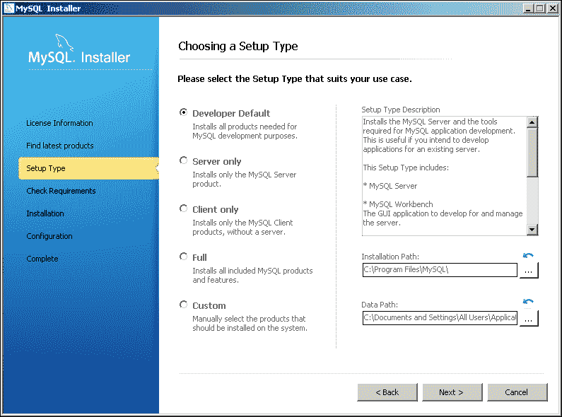

除非您熟悉 MySQL，否则最好选择默认设置。这将包括将默认端口设置为`3306`，启用 TCP/IP 网络，并打开所需的防火墙端口以进行网络访问（在所有应用程序都在同一环境上运行的开发机器上并不是严格要求的，但如果您正在配置专用的 MySQL 服务器，则是必需的）。

无论环境如何，在安装过程中设置 root 用户密码是很重要的。我们将使用 root 用户连接到运行的 MySQL 服务器来执行命令。

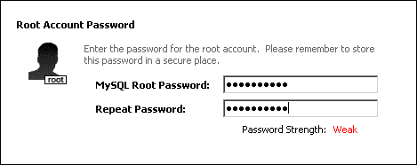

### 注意

本书的其余部分将假定 root 用户的密码为`adminadmin`。这不是一个非常安全的密码，但应该很容易记住！

我们建议将 MySQL 服务器配置为在操作系统启动时启动。如何完成此操作将取决于您的环境，但通常是在“初始配置”操作的最后执行的。Windows 用户将有选项在系统启动时启动 MySQL 服务器。Mac 用户需要在安装服务器后安装**MySQL 启动项**。

如果您决定不在操作系统启动时启动 MySQL，则需要在需要时手动启动 MySQL 服务器。如何完成此操作将再次取决于您的环境，但您现在应该启动服务器以确认安装成功。

### 注意

Unix 和 Linux 用户需要根据其操作系统安装 MySQL。这可能包括使用高级包装工具（APT）或另一个安装工具（YaST），甚至从源代码安装 MySQL。有关各种操作系统的详细说明，请参见[`dev.mysql.com/doc/refman/5.7/en/installing.html`](http://dev.mysql.com/doc/refman/5.7/en/installing.html)。

在配置过程结束时，您将拥有一个运行的 MySQL 服务器，可以在第二章中使用，*任务时间跟踪器数据库*。

# 安装 Java SE 开发工具包（JDK）

可以从[`www.oracle.com/technetwork/java/javase/downloads/index.html`](http://www.oracle.com/technetwork/java/javase/downloads/index.html)下载 Java SE 开发工具包（JDK）。如果您的系统已安装了 JDK 7 Update 45（或更高版本），则可以选择跳过此步骤。

### 注意

不要选择 NetBeans 捆绑包，因为它不包含 GlassFish 服务器。

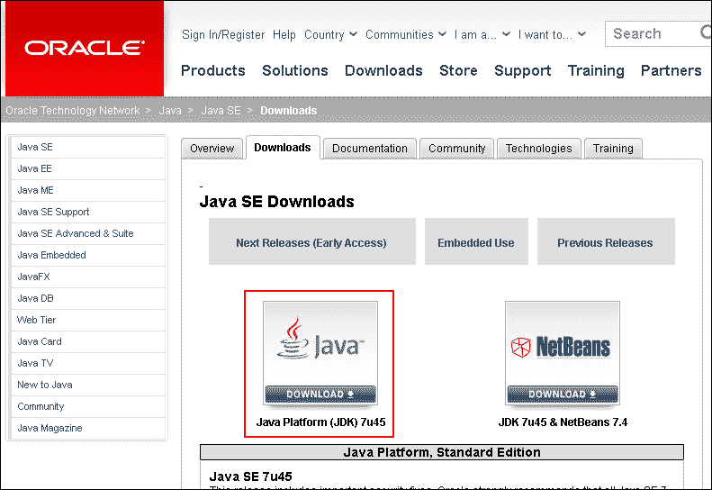

在选择适当的发行版之前，您需要接受 JDK 7 许可协议。下载 JDK 后，运行安装程序并按照说明和提示操作。

# 安装 NetBeans IDE

NetBeans 可以从[`netbeans.org/downloads/`](https://netbeans.org/downloads/)下载。该发行版要求在您的平台上已安装有效的 JDK。在撰写本文时，我使用了 JDK 7 Update 45，但任何 JDK 7（或更高版本）都可以。有几个发行版捆绑包；您需要选择**Java EE**捆绑包。

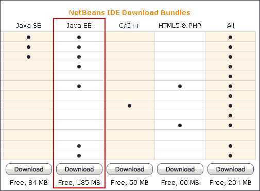

撰写本文时的最新版本是 NetBeans 7.4，引入了重要的新功能，包括扩展的 HTML5 和 JavaScript 支持。首次，NetBeans 还包括对 Ext JS 框架的编辑和代码完成支持。

要安装软件，只需从 NetBeans 网站下载并按照详细说明进行操作。这将带您通过以下一系列设置屏幕：

1.  GlassFish 4 服务器会自动选择。您无需安装 Tomcat。

1.  接受许可协议中的条款。

1.  接受 JUnit 许可协议的条款。JUnit 用于第五章中的测试，*使用 Spring 和 JUnit 测试 DAO 层*。

1.  注意 NetBeans IDE 的安装路径以备将来参考。选择先前安装的适当 JDK（如果系统上有多个 JDK）。

1.  注意 GlassFish 4 服务器的安装路径以备将来参考。

1.  最终屏幕总结了安装过程。在单击**安装**开始过程之前，请务必**检查更新**。

该过程可能需要几分钟，具体取决于您的平台和硬件。

安装完成后，您可以首次运行 NetBeans。如果您之前安装过 NetBeans 的版本，则可能会提示您**导入设置**。然后默认的开放屏幕将显示如下：

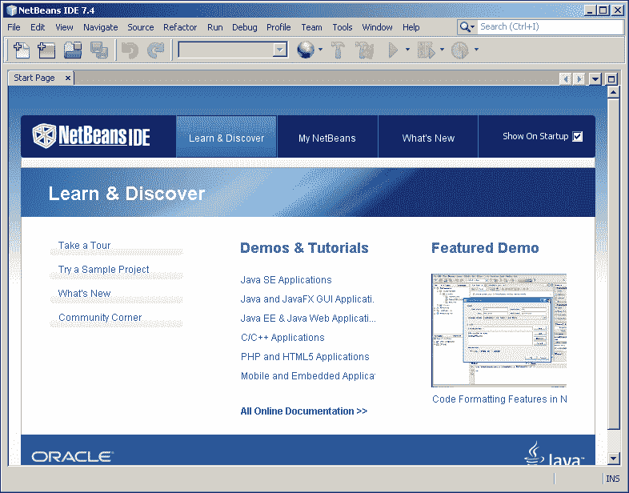

现在可以从菜单中打开最有用的面板：

+   **项目**：此面板是项目源的主要入口点。它显示了重要项目内容的逻辑视图，分组到适当的上下文中。

+   **文件**：此面板显示项目节点在文件系统上的实际文件结构。

+   **服务**：此面板显示您的运行时资源。它显示了重要的运行时资源的逻辑视图，如与 IDE 注册的服务器和数据库。

在这个阶段，前两个面板将是空的，但**服务**面板将有几个条目。打开**服务器**面板将显示安装的 GlassFish 4 服务器，如下截图所示：

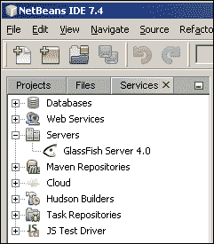

# 介绍 Maven

Apache Maven 是一个用于构建和管理基于 Java 的项目的工具。它是一个开源项目，托管在[`maven.apache.org`](http://maven.apache.org)，并与 NetBeans IDE 捆绑在一起。Maven 简化了所有 Java 开发项目中常见的许多步骤，并提供了许多功能，包括以下内容：

+   提供约定优于配置。Maven 带有一系列预定义的目标，用于执行某些明确定义的任务，包括项目的编译、测试和打包。所有任务都通过单个配置文件`pom.xml`管理。

+   一致的编码结构和项目框架。每个 Maven 项目都具有相同的目录结构和源文件、测试文件、构建文件和项目资源的位置。这种共同的结构使我们能够轻松地了解项目。

+   一个一致的构建系统，具有许多插件，使常见任务变得容易。

+   作为构建过程的一部分执行测试的能力。

+   一个高度灵活和强大的依赖管理系统。这允许软件开发人员通过（外部或远程）Maven 仓库在互联网上发布信息和共享 Java 库。然后 Maven 会将这些库下载并在本地缓存，以供项目使用。

我们鼓励您访问 Maven 网站，探索其中提供的许多功能。NetBeans 将使用 Maven 来创建和管理 Web 应用程序项目。

# 创建 Maven Web 应用程序项目

NetBeans 项目封装了维护和开发应用程序所需的所有源代码和相关组件。从菜单中导航到**文件** | **新建项目**开始这个过程：

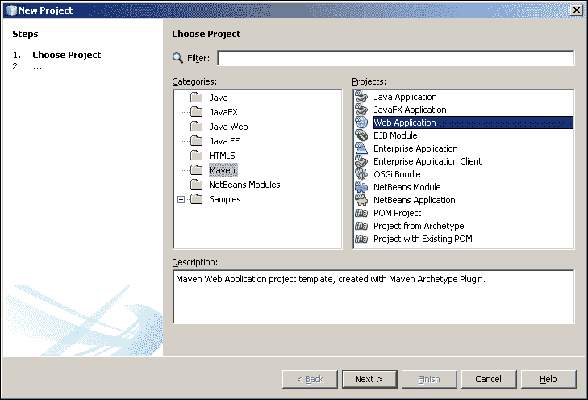

在**类别**列表中选择**Maven**，在**项目**列表中选择**Web 应用程序**，如前面的截图所示，然后选择**下一步**按钮。这将呈现给您项目配置屏幕，其中包括以下字段：

+   **项目名称**：这指定了项目在项目窗口中的显示名称。这个名称也用于创建项目文件夹，不能包含空格。

### 注意

我们的项目名为 Task Time Tracker。这个工具将允许用户管理不同项目的不同任务所花费的时间。项目名称字段是项目名称的小写、无空格的翻译：`task-time-tracker`。

+   **项目位置**：这指定了您想要存储项目元数据和源代码的文件系统根文件夹。我们通常会在驱动器的根级别创建一个特定于项目的文件夹，而不是将其深埋在 NetBeans 下的文件夹结构中。这样可以更容易地找到并将文件复制到项目中。

### 注意

Windows 用户应在`c:\projects`下创建一个项目文件夹。Mac 用户可以用`/Users/{username}/projects`替换这个位置，Unix 用户可以用`/home/{username}/projects`替换。本书的其余部分将在所有示例中引用这个位置为*项目文件夹*。

+   **项目文件夹**：项目文件夹是只读的，根据项目名称和项目位置生成。

+   **Artifact Id**：这是一个只读的 Maven 特定属性，用于标识项目，基于项目名称。

+   **Group Id**：这是另一个 Maven 属性，表示多个构件的顶级容器。它通常代表拥有项目的组织的**顶级域**（**TLD**）。

### 注意

项目的**Group Id**是`com.gieman`，作者的公司。

+   **版本**：这是另一个 Maven 属性，表示构件的版本。默认版本是**1.0-SNAPSHOT**，我们将其更改为`1.0`。随着项目的发展和发布新版本，Maven 将根据它们的版本跟踪不同的构建。

+   **包**：IDE 将根据此字段自动创建基于 Java 源包的结构。我们将使用包`com.gieman.tttracker`。

您现在应该已经输入了以下项目详细信息：

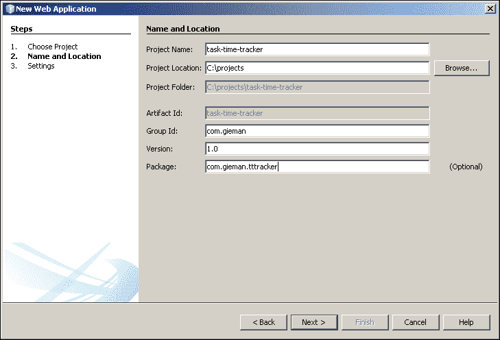

点击**下一步**按钮查看最终屏幕。在单击**完成**按钮之前，不要更改默认的 GlassFish Server 4.0 和 Java EE 7 设置。现在您将在**项目创建**输出选项卡中看到活动，因为项目正在创建和配置。打开**项目**和**文件**面板将允许您查看项目结构：

### 提示

**下载示例代码**

您可以从[`www.packtpub.com`](http://www.packtpub.com)的帐户中下载您购买的所有 Packt 图书的示例代码文件。如果您在其他地方购买了本书，您可以访问[`www.packtpub.com/support`](http://www.packtpub.com/support)并注册，以便直接通过电子邮件接收文件。

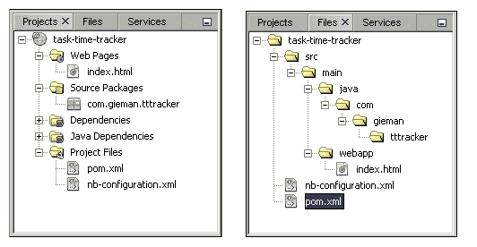

在任一选项卡中右键单击项目名称将允许您选择项目的**属性**。这将显示与项目相关的所有属性和路径，分别属于不同的类别：

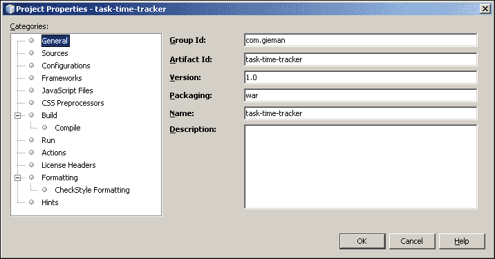

您不需要在本书的其余部分更改这些属性。

## 理解 POM 和依赖管理

每个 Maven 项目在 NetBeans 项目的根级别都有一个`pom.xml`配置文件。点击**文件**视图，双击`pom.xml`文件以在编辑器中打开它：

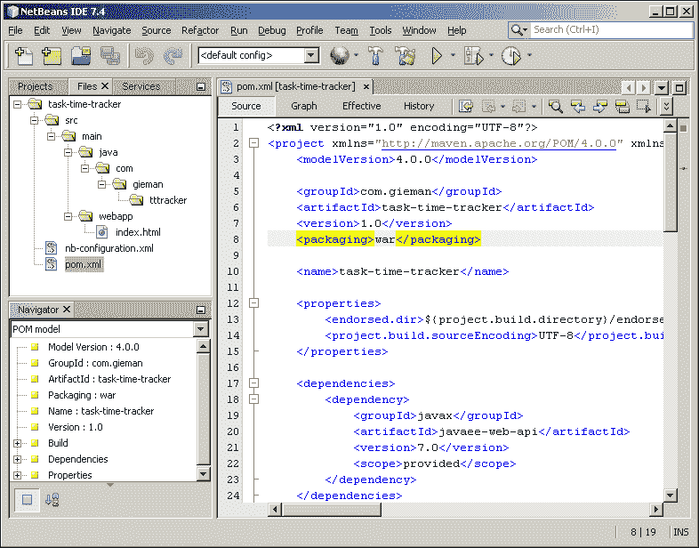

### 注意

您应该看到**导航器**窗口在左下角面板中打开。这显示了正在编辑的文件的大纲，在浏览大文件时非常有帮助。在**导航器**中双击节点将会将光标定位到编辑器中的适当行。

如果**导航器**窗口没有打开（或已关闭），您可以通过从菜单导航到**窗口** | **导航** | **导航器**来手动打开它。

**项目对象模型（POM）**完全定义了项目和所有必需的 Maven 属性和构建行为。`pom.xml`中只显示了一个依赖项：

```java
<dependencies>
  <dependency>
    <groupId>javax</groupId>
    <artifactId>javaee-web-api</artifactId>
    <version>7.0</version>
    <scope>provided</scope>
  </dependency>
</dependencies>
```

这个依赖项标识了项目构建所需的 Java EE 7。这个条目确保了完整的 Java EE 7 API 在任务时间跟踪项目中可用于 Java 编码。我们的项目还需要 Spring 框架，现在必须将其添加为额外的依赖项。在编辑器中输入时，将会出现自动补全帮助来确定正确的依赖项。在添加 Spring 框架的`groupId`和`artifactId`条目后，如下截图所示，按下*Ctrl* +空格键盘快捷键将打开以文本`spring`开头的`artifactId`的可用匹配条目：

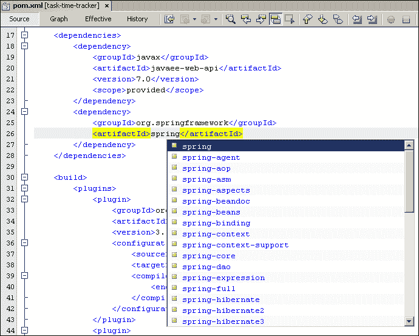

如果此自动完成列表不可用，可能是因为 Maven 仓库首次进行索引。在这种情况下，您将在编辑器底部看到以下截图：


耐心等待几分钟，索引将完成，自动完成将变为可用。索引是从 Maven 仓库下载可用条目所必需的。

所需的 Spring 框架组件如下：

+   `spring-context`：这是 Spring 的依赖注入容器所需的中心构件

+   `spring-tx`：这是实现事务行为所需的事务管理抽象

+   `spring-context-support`：这些是各种应用程序上下文实用程序，包括 Ehcache、JavaMail、Quartz 和 FreeMarker 集成

+   `spring-jdbc`：这是 JDBC 数据访问库

+   `spring-orm`：这是用于 JPA 开发的**对象-关系映射**（**ORM**）集成

+   `spring-instrument`：用于类的编织

+   `spring-webmvc`：这是用于 Servlet 环境的**Spring 模型-视图-控制器**（**MVC**）

+   `spring-test`：这是用于使用 JUnit 测试 Spring 应用程序的支持

要使用最新的 Spring 发布版本（3.2.4）添加这些依赖项，需要对`pom.xml`文件进行以下添加：

```java
<dependency>
  <groupId>org.springframework</groupId>
  <artifactId>spring-context</artifactId>
  <version>3.2.4.RELEASE</version>
</dependency>
<dependency>
  <groupId>org.springframework</groupId>
  <artifactId>spring-context-support</artifactId>
  <version>3.2.4.RELEASE</version>
</dependency>
<dependency>
  <groupId>org.springframework</groupId>
  <artifactId>spring-tx</artifactId>
  <version>3.2.4.RELEASE</version>
</dependency>
<dependency>
  <groupId>org.springframework</groupId>
  <artifactId>spring-jdbc</artifactId>
  <version>3.2.4.RELEASE</version>
</dependency>
<dependency>
  <groupId>org.springframework</groupId>
  <artifactId>spring-orm</artifactId>
  <version>3.2.4.RELEASE</version>
</dependency>
<dependency>
  <groupId>org.springframework</groupId>
  <artifactId>spring-instrument</artifactId>
  <version>3.2.4.RELEASE</version>
</dependency>
<dependency>
  <groupId>org.springframework</groupId>
  <artifactId>spring-webmvc</artifactId>
  <version>3.2.4.RELEASE</version>
</dependency>
<dependency>
  <groupId>org.springframework</groupId>
  <artifactId>spring-test</artifactId>
  <version>3.2.4.RELEASE</version>
</dependency>
```

## 理解依赖范围

最后一个 Spring 框架依赖项仅在测试时才需要。我们可以通过添加`scope`属性并将其值设置为`test`来定义这一点。这告诉 Maven 该依赖项仅在运行构建的测试阶段时才需要，并且不需要部署。

```java
<dependency>
  <groupId>org.springframework</groupId>
  <artifactId>spring-test</artifactId>
  <version>3.2.4.RELEASE</version>
  <scope>test</scope>
</dependency>
```

NetBeans 自动生成的`javaee-web-api`依赖项的范围为`provided`。这意味着该依赖项不需要部署，并且由目标服务器提供。GlassFish 4 服务器本身是该依赖项的提供者。

如果没有包含`scope`属性，依赖的 JAR 将包含在最终构建中。这相当于提供`compile`范围的条目。因此，所有 Spring 框架依赖的 JAR 将包含在最终构建文件中。

有关 Maven 依赖机制和范围的详细解释，请参阅[`maven.apache.org/guides/introduction/introduction-to-dependency-mechanism.html`](http://maven.apache.org/guides/introduction/introduction-to-dependency-mechanism.html)。

## 定义 Maven 属性

在`pom.xml`中定义的 Spring 框架依赖项都具有相同的版本（3.2.4.RELEASE）。这种重复不理想，特别是当我们希望在以后升级到新版本时。需要在多个地方进行更改，每个 Spring 依赖项都需要更改一次。一个简单的解决方案是添加一个属性来保存发布版本值，如下所示：

```java
<properties>
<endorsed.dir>${project.build.directory}/endorsed</endorsed.dir>
<project.build.sourceEncoding>UTF-8</project.build.sourceEncoding>
<spring.version>3.2.4.RELEASE</spring.version>
</properties>
```

我们现在可以使用这个自定义属性`spring.version`来替换多个重复项，如下所示：

```java
<dependency>
<groupId>org.springframework</groupId>
  <artifactId>spring-context-support</artifactId>
  <version>${spring.version}</version>
</dependency>
```

然后在构建过程中，`${spring.version}`占位符将被替换为`properties`的值。

## 理解 Maven 构建插件

Maven 构建过程在适当的构建阶段执行每个定义的构建插件。可以在[`maven.apache.org/plugins/index.html`](http://maven.apache.org/plugins/index.html)找到构建插件的完整列表。我们将在后续章节中根据需要介绍插件，但现在我们对 NetBeans IDE 创建的默认插件感兴趣。

`maven-compiler-plugin`控制并执行 Java 源文件的编译。该插件允许您指定编译的`source`和`target` Java 版本，如下所示：

```java
<plugin>
  <groupId>org.apache.maven.plugins</groupId>
  <artifactId>maven-compiler-plugin</artifactId>
  <version>3.1</version>
  <configuration>
    <source>1.7</source>
    <target>1.7</target>
    <compilerArguments>
      <endorseddirs>${endorsed.dir}</endorseddirs>
    </compilerArguments>
  </configuration>
</plugin>
```

在为旧的 Java 服务器编译项目时，可能需要将这些值更改为`1.6`。

`maven-war-plugin`为项目构建 WAR 文件，如下所示：

```java
<plugin>
  <groupId>org.apache.maven.plugins</groupId>
  <artifactId>maven-war-plugin</artifactId>
  <version>2.3</version>
  <configuration>
    <failOnMissingWebXml>false</failOnMissingWebXml>
  </configuration>
</plugin>
```

默认生成的 WAR 文件名是`{artifactId}-{version}.war`，可以通过包含`warName`配置属性来更改。在最后一章中，我们将在为生产发布构建项目时向此插件添加属性。`maven-war-plugin`选项的完整列表可以在[`maven.apache.org/plugins/maven-war-plugin/war-mojo.html`](http://maven.apache.org/plugins/maven-war-plugin/war-mojo.html)找到。

`maven-dependency-plugin`将依赖的 JAR 文件复制到定义的输出目录，如下所示：

```java
<plugin>
  <groupId>org.apache.maven.plugins</groupId>
  <artifactId>maven-dependency-plugin</artifactId>
  <version>2.6</version>
  <executions>
    <execution>
      <phase>validate</phase>
      <goals>
        <goal>copy</goal>
      </goals>
      <configuration>
        <outputDirectory>${endorsed.dir}</outputDirectory>
        <silent>true</silent>
        <artifactItems>
          <artifactItem>
            <groupId>javax</groupId>
            <artifactId>javaee-endorsed-api</artifactId>
            <version>7.0</version>
            <type>jar</type>
          </artifactItem>
        </artifactItems>
      </configuration>
    </execution>
  </executions>
</plugin>
```

这对于查看项目使用了哪些 JAR，并识别所需的传递依赖（依赖的依赖）非常有用。

我们将修改此插件，将项目的所有编译时依赖项复制到`${project.build.directory}`中的目录。这个特殊的构建目录位于项目的根文件夹下，名为`target`，是构建过程的目标目的地。更新后的条目现在如下所示：

```java
<plugin>
  <groupId>org.apache.maven.plugins</groupId>
  <artifactId>maven-dependency-plugin</artifactId>
  <version>2.1</version>
  <executions>
    <execution>
      <id>copy-endorsed</id>
      <phase>validate</phase>
      <goals>
        <goal>copy</goal>
      </goals>
      <configuration>
        <outputDirectory>${endorsed.dir}</outputDirectory>
        <silent>true</silent>
        <artifactItems>
          <artifactItem>
            <groupId>javax</groupId>
            <artifactId>javaee-endorsed-api</artifactId>
            <version>7.0</version>
            <type>jar</type>
          </artifactItem>
        </artifactItems>
      </configuration>
    </execution> 
    <execution>
      <id>copy-all-dependencies</id>
      <phase>compile</phase>
      <goals>
        <goal>copy-dependencies</goal>
      </goals>
      <configuration>
        <outputDirectory>${project.build.directory}/lib
        </outputDirectory>
        <includeScope>compile</includeScope>
      </configuration> 
    </execution>
  </executions>
</plugin>
```

由于我们现在在单个插件中执行两个执行，每个执行都需要自己的`<id>`。第二个执行，ID 为`copy-all-dependencies`，将把所有依赖的 JAR（范围为`compile`）复制到`target/lib`目录中。

## 执行 Maven 构建

执行构建的最简单方法是单击工具栏中的**清理和构建项目**按钮。您还可以在**项目**选项卡中右键单击项目节点，然后从菜单中选择**清理和构建**。然后，构建过程将执行 POM 中定义的每个阶段，导致 Java 代码编译，依赖项解析（和复制），最后生成 WAR 文件。打开目标目录结构将显示构建结果，如下所示：

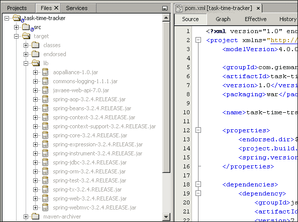

尽管我们还没有写一行代码，但生成的 WAR 文件`task-time-tracker-1.0.war`现在可以部署到 GlassFish 服务器上。

# 启动 GlassFish 4 服务器

打开**服务**选项卡并展开**服务器**节点将列出在 NetBeans 安装过程中安装的 GlassFish 服务器。您现在可以右键单击**GlassFish Server 4.0**节点，并选择**启动**，如下截图所示：

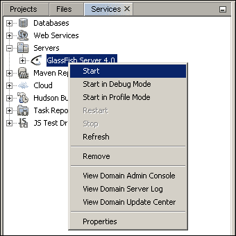

**输出**面板现在应该在您的 NetBeans IDE 底部打开，并显示启动结果。选择**GlassFish Server 4.0**选项卡以查看详细信息。

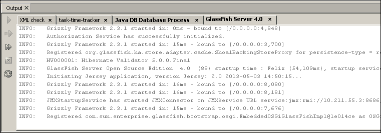

倒数第五行标识服务器已启动，并正在监听端口 8080，日志中写为 8,080：

**INFO: Grizzly Framework 2.3.1 started in: 16ms - bound to [/0.0.0.0:8,080]**

您现在可以打开您喜欢的浏览器，并查看页面`http://localhost:8080`。

### 注意

请注意，根据您的环境，可能有其他应用程序监听端口 8080。在这种情况下，您需要用 GlassFish 服务器输出中定义的正确端口替换 8080。

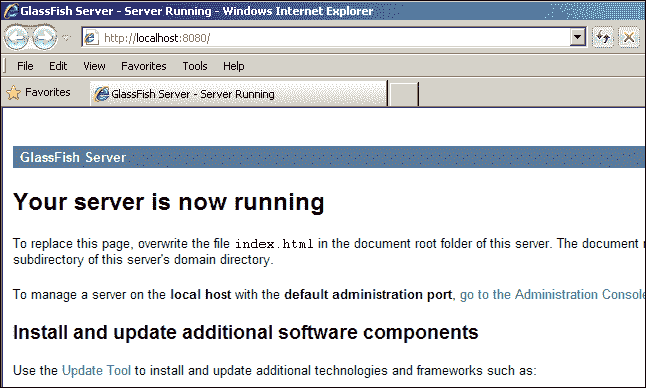

您现在可以右键单击**GlassFish Server 4.0**节点，然后单击**停止**来停止服务器。

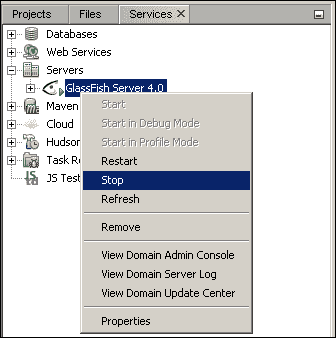

# 运行 Task Time Tracker 项目

我们已经成功构建了项目；现在是时候在 GlassFish 中运行项目了。单击**运行**工具栏项以启动进程，如下所示：

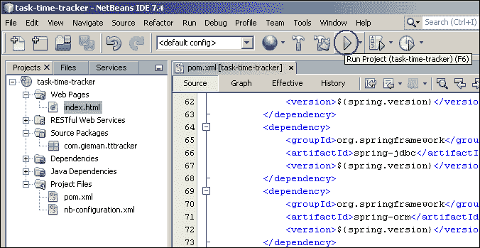

输出应该显示进程，首先构建项目，然后启动并部署到 GlassFish 服务器。最后一步将打开您的默认浏览器，并显示所有开发人员都喜爱的世界著名消息，如下截图所示：

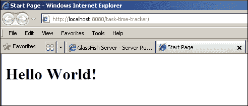

恭喜！您现在已配置了开发、构建和部署 Spring Java 项目的核心组件。最后一步是更改默认页面上的文本。打开`index.html`文件，如下面的截图所示：

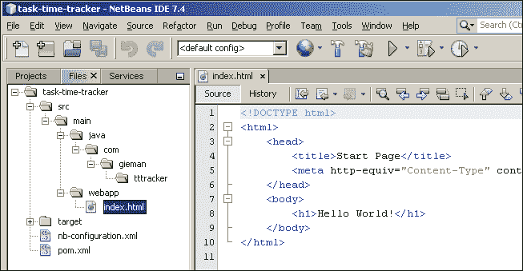

将`<title>`更改为`任务时间跟踪器首页`，将`<h1>`文本更改为`欢迎来到任务时间跟踪器！`。保存页面并刷新浏览器以查看更改。

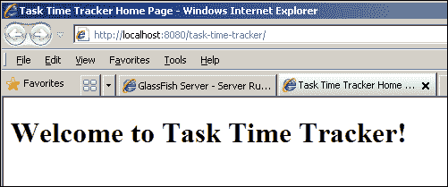

### 注意

在刷新浏览器后没有看到更新的文本更改？在某些情况下，首次部署到 GlassFish 后，刷新页面时可能看不到在`index.html`文件中所做的更改。重新启动您的 NetBeans IDE 应该可以解决问题，并确保随后的更改在保存任何项目资源时立即部署到 GlassFish。

# 总结

在本章中，我们介绍了本书中将使用的一些关键技术。您已经下载并安装了 MySQL 数据库服务器、JDK 和 NetBeans IDE。然后我们介绍了 Maven 以及它如何简化 Java 项目的构建和管理。最后，我们在不写一行代码的情况下将我们的骨架任务时间跟踪器项目部署到了 GlassFish。

尽管我们已将 Spring 框架添加到我们的项目中，但我们尚未深入了解它的用法。同样，我们还没有提到 Sencha Ext JS。请耐心等待，还有很多内容要介绍！下一章将介绍我们的任务时间跟踪器数据库表，并开始我们的开发之旅。
