# 第二章：任务时间跟踪器数据库

本章定义了**任务时间跟踪器**（3T）数据库设计，并将 NetBeans 配置为 MySQL 服务器的客户端。

3T 应用程序将用于跟踪不同公司项目上花费的时间。主要实体包括：

+   公司：这是拥有零个或多个项目的实体。公司是独立的，可以独立存在（它没有外键）。

+   项目：这代表任务的分组。每个项目都属于一个公司，可以包含零个或多个任务。

+   任务：这些代表可能为项目承担的活动。一个任务属于一个项目。

+   用户：他们是承担任务的参与者。用户可以将花费的时间分配给不同的任务。

+   任务日志：这是用户在任务上花费的时间记录。花费的时间以分钟为单位存储。

这些实体定义导致了一个非常简单的数据库设计：

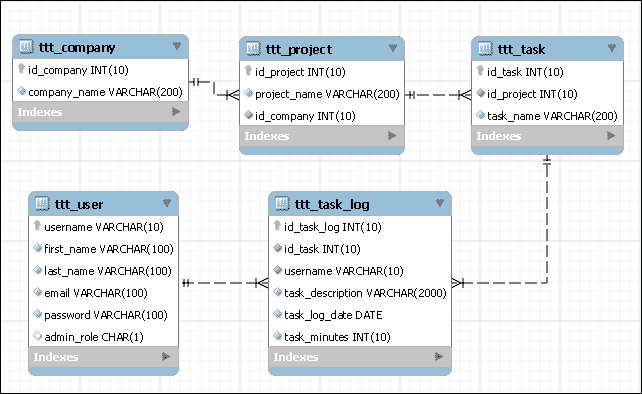

我们将所有的 3T 表都以`ttt_`作为前缀。大型企业数据库可能包含数百个表，您很快就会欣赏到表名的前缀以将相关表分组。

# 用 NetBeans 连接 MySQL

在 NetBeans IDE 的**服务**选项卡中，导航到**数据库** | **驱动程序**。您会看到 NetBeans 带有几种不同的数据库驱动程序：

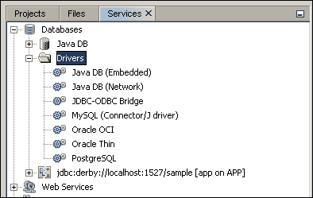

右键单击**数据库**节点，然后单击**注册 MySQL 服务器…**，如下面的屏幕截图所示：

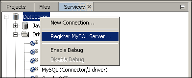

对于 Windows 用户，这将打开一个具有默认设置的对话框。在上一章安装 MySQL 服务器时输入管理员密码，并勾选**记住密码**选项：

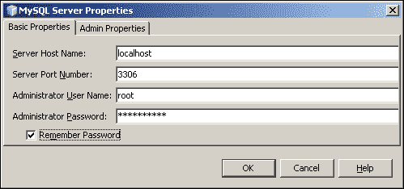

Mac 用户在设置连接属性之前会看到一个不同的窗口。在单击**下一步**按钮之前选择 MySQL 驱动程序：

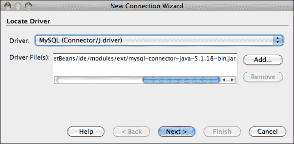

然后，您可以指定所需的数据库连接详细信息：

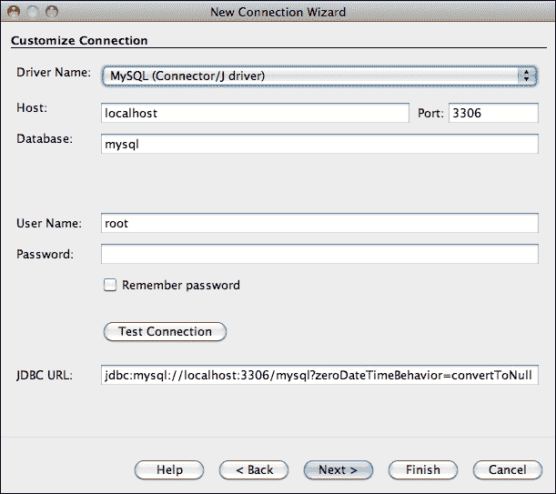

完成这些任务后，您将在**数据库**节点中看到**MySQL 服务器**。右键单击服务器，然后选择**连接**以连接到服务器（如果尚未连接）：

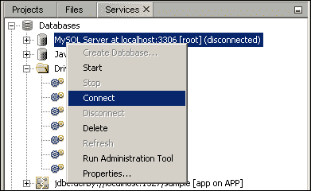

这将连接 NetBeans 到 MySQL 服务器并列出可用的数据库。右键单击服务器，然后选择**创建数据库**，如下面的屏幕截图所示：

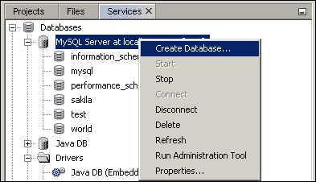

输入数据库名称，如下面的屏幕截图所示，然后单击**确定**创建数据库：

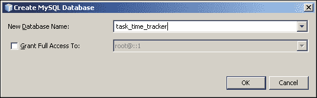

最后一步是连接到新创建的**task_time_tracker**数据库。右键单击**task_time_tracker**，然后选择**连接…**，如下面的屏幕截图所示：

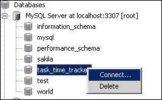

这将为**task_time_tracker**数据库添加一个 MySQL 数据库连接条目，可以在需要时通过右键单击打开：

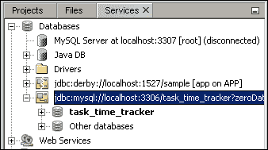

现在，您可以右键单击数据库连接并选择**执行命令…**选项，在工作区中打开**SQL 命令**编辑器：

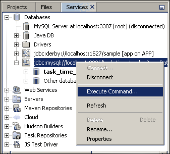

**SQL 命令**编辑器是您将在其中输入并执行针对数据库的命令的地方：

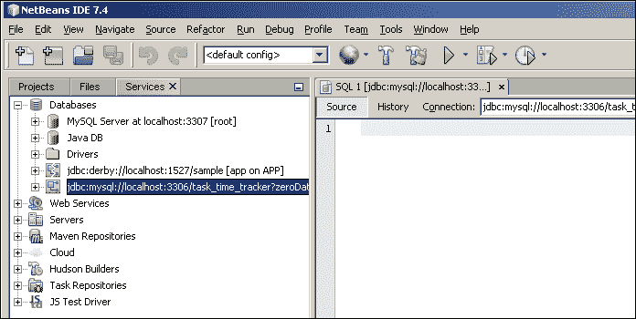

# 3T 数据库

以下的 SQL 语句定义了 3T 中使用的 MySQL 表。可以使用任何数据库，并且用 MySQL 特定的代码进行了突出以识别与 ANSI SQL 的不同之处。

## 公司表

公司有项目，我们需要跟踪不同任务所花费的时间。因此，公司是需要定义的第一个表。它是一个非常简单的结构：

```java
create table ttt_company(
  id_company  int unsigned not null auto_increment,
  company_name varchar(200) not null,
  primary key(id_company)
);
```

MySQL 使用`auto_increment`关键字来标识应自动递增的数字列（默认递增速率为一个数字），基于列中当前最高值。这用于生成`id_company`主键值。让我们添加一些公司数据：

```java
insert into ttt_company(company_name) values ('PACKT Publishing');
insert into ttt_company(company_name) values ('Gieman It Solutions');
insert into ttt_company(company_name) values ('Serious WebDev');
```

在**SQL 命令**编辑器中输入这些语句后，您可以通过单击以下截图右上角的按钮来执行这些语句（运行 SQL 按钮已用圈圈标出）：

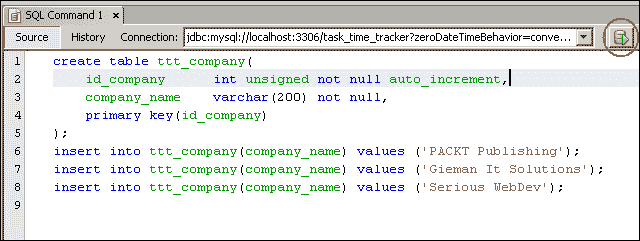

这些语句的输出将显示在 IDE 的底部：

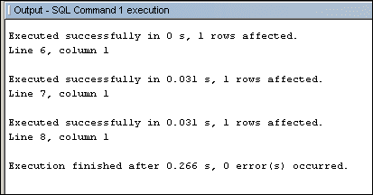

您现在可以通过在**SQL 命令**编辑器中执行以下语句来查看插入的数据：

```java
select * from ttt_company;
```

或者，您还可以右键单击数据库中的表节点，然后选择**查看数据...**：

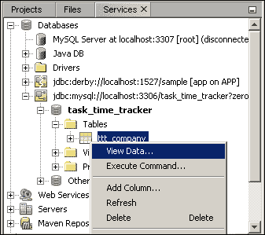

这将导致以下截图：

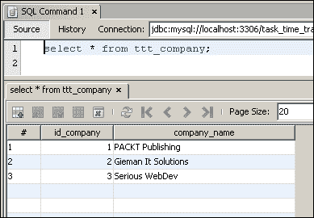

## 项目表

一个公司可以有任意数量的项目，每个项目都属于一个公司。表定义如下：

```java
create table ttt_project(
  id_project  int unsigned not null auto_increment,
  project_name varchar(200) not null,
  id_company  int unsigned not null,
  primary key(id_project),
  foreign key(id_company) references ttt_company(id_company)
);
```

再次，我们可以添加一些数据：

```java
insert into ttt_project(project_name, id_company) values('Enterprise Application Development with Spring and ExtJS', 1);
insert into ttt_project(project_name, id_company) values ('TheSpring Framework for Beginners', 1);
insert into ttt_project(project_name, id_company) values('Advanced Sencha ExtJS4 ', 1);
insert into ttt_project(project_name, id_company) values ('The 3TProject', 2);
insert into ttt_project(project_name, id_company) values('Breezing', 2);
insert into ttt_project(project_name, id_company) values ('GiemanWebsite', 2);
insert into ttt_project(project_name, id_company) values('Internal Office Projects', 3);
insert into ttt_project(project_name, id_company) values('External Consulting Tasks', 3);
```

在这些`insert`语句中，我们已经提供了对公司表的外键，并再次允许 MySQL 生成主键。执行这些命令并浏览`ttt_project`表数据应该显示如下截图所示：

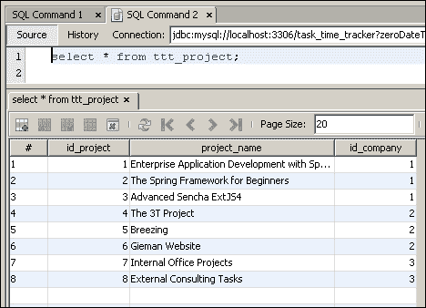

## 任务表

一个项目可以有任意数量的任务，每个任务都属于一个项目。现在可以添加表和测试数据如下：

```java
create table ttt_task(
  id_task   int unsigned not null auto_increment,
  id_project  int unsigned not null,  
  task_name  varchar(200) not null,
  primary key(id_task),
  foreign key(id_project) references ttt_project(id_project)
);
```

我们现在将为一些项目添加一系列任务：

```java
insert into ttt_task(id_project, task_name)values (1, 'Chapter 1');
insert into ttt_task(id_project, task_name)values (1, 'Chapter 2');
insert into ttt_task(id_project, task_name)values (1, 'Chapter 3');

insert into ttt_task(id_project, task_name)values (2, 'Chapter 1');
insert into ttt_task(id_project, task_name)values (2, 'Chapter 2');
insert into ttt_task(id_project, task_name)values (2, 'Chapter 3');

insert into ttt_task(id_project, task_name)values (3, 'Preface');
insert into ttt_task(id_project, task_name)values (3, 'Appendix');
insert into ttt_task(id_project, task_name)values (3, 'Illustrations');

insert into ttt_task(id_project, task_name)values (4, 'DatabaseDevelopment');
insert into ttt_task(id_project, task_name)values (4, 'Javadevelopment');
insert into ttt_task(id_project, task_name)values (4, 'SenchaDevcelopment');
insert into ttt_task(id_project, task_name)values (4, 'Testing');
```

执行这些命令并浏览`ttt_task`表数据将显示以下截图：

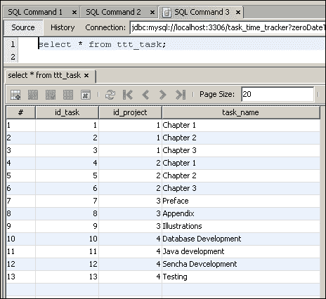

## 用户表

我们设计的下一个表包含用户信息：

```java
create table ttt_user(
  username        varchar(10) not null,
  first_name      varchar(100) not null,
  last_name       varchar(100) not null,
  email           varchar(100) not null unique,
  password        varchar(100) not null,
  admin_role      char(1) not null,
  primary key(username)
);
```

请注意，`admin_role`列将用于标识用户是否在 3T 应用程序中具有管理权限。我们现在将添加两个用户：

```java
insert into ttt_user(username, first_name, last_name, email,password, admin_role) values ('jsmith', 'John', 'Smith', 'js@tttracker.com', 'admin','N');
insert into ttt_user(username, first_name, last_name, email,password, admin_role) values ('bjones', 'Betty', 'Jones', 'bj@tttracker.com','admin','Y');
```

运行这组命令将创建用户表，然后插入我们的两个测试用户，如下截图所示：

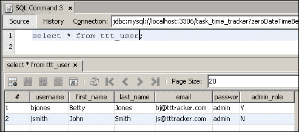

## 任务日志表

最终的表将用于输入不同任务所花费的时间。

```java
create table ttt_task_log(
  id_task_log   int unsigned not null auto_increment,
  id_task    int unsigned not null,
  username   varchar(10) not null,
  task_description varchar(2000) not null,
  task_log_date  date not null,
  task_minutes  int unsigned not null,
  primary key(id_task_log),
  foreign key(id_task) references ttt_task(id_task),
  foreign key(username) references ttt_user(username)
);
```

现在我们将为我们的用户约翰史密斯（`jsmith`）的表添加一些数据。请注意，每个任务所花费的时间以分钟为单位，并且 MySQL 函数`now()`用于返回当前时间戳：

```java
insert into ttt_task_log (id_task, username, task_description,task_log_date,task_minutes)values(1,'jsmith','Completed Chapter 1 proof reading',now(),120);
insert into ttt_task_log (id_task, username, task_description,task_log_date,task_minutes)values(2,'jsmith','Completed Chapter 2 draft',now(), 240);
insert into ttt_task_log (id_task, username, task_description,task_log_date,task_minutes)values(3,'jsmith','Completed preparation work for initialdraft',now(), 90);
insert into ttt_task_log (id_task, username, task_description,task_log_date,task_minutes)values(3,'jsmith','Prepared database for Ch3 task',now(), 180);
```

类似地，我们将为贝蒂琼斯（`bjones`）插入一些测试数据：

```java
insert into ttt_task_log (id_task, username, task_description,task_log_date,task_minutes)values(1,'bjones','Started Chapter 1 ',now(), 340);
insert into ttt_task_log (id_task, username, task_description,task_log_date,task_minutes)values(2,'bjones','Finished Chapter 2 draft',now(), 140);
insert into ttt_task_log (id_task, username, task_description,task_log_date,task_minutes)values(3,'bjones','Initial draft work completed',now(), 450);
insert into ttt_task_log (id_task, username, task_description,task_log_date,task_minutes)values(3,'bjones','Database design started',now(), 600);
```

现在可以查看这些`insert`语句的结果，如下截图所示：

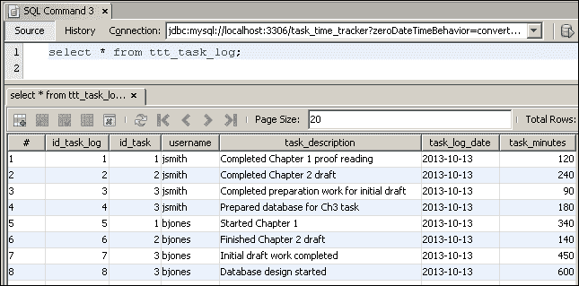

# 3T 数据库的企业选项

先前提供的表和列定义是我们 3T 项目所需的最简单的。然而，还有一些潜在的选项可以添加以增强企业使用的结构。

## 密码加密

企业应用程序要求密码字段使用单向算法进行加密以确保安全。密码永远不应以明文形式存储，也永远不应该在数据库中可见（就像我们目前可以做的那样）。本书的范围超出了涵盖密码安全策略的范围，但可以在[`www.jasypt.org/howtoencryptuserpasswords.html`](http://www.jasypt.org/howtoencryptuserpasswords.html)找到核心原则的非常好的解释。

MySQL 提供了许多密码加密函数，可以用于此目的。我们建议您浏览文档[`dev.mysql.com/doc/refman/5.7/en/encryption-functions.html`](https://dev.mysql.com/doc/refman/5.7/en/encryption-functions.html)以了解可用的不同选项。

## LDAP 集成

许多企业使用**LDAP**（轻量级目录访问协议）来维护其组织内的用户。LDAP 最常用于提供单一登录，其中一个用户的密码在许多服务之间共享。因此，在这种情况下，用户表中的密码列将不需要。如果一个组织跨越多个地理位置，可能会有几个分布在不同大陆的 LDAP 领域。这种情况可能需要一个新的表来存储 LDAP 授权服务器。然后，每个用户可能会被分配一个授权 LDAP 服务器来处理他们的登录。

## 审计追踪

企业系统通常需要广泛的审计追踪（何时以及为什么发生了某个动作，以及是谁执行了它）。这对于公开上市的大型组织尤为重要。例如，**萨班斯-奥克斯法案**（**SOX**）要求所有在美国境内上市的公司必须建立内部控制和程序，以减少公司欺诈的可能性。这些流程包括识别任何时间段内的授权和未授权更改或潜在可疑活动。

“谁，何时，为什么”这些问题是设计企业数据库时需要考虑的审计追踪的基础。简单地向所有表添加一些额外的列是一个很好的开始：

```java
who_created varchar(10) not null
who_updated varchar(10) not null
when_created datetime default current_timestamp
when_updated datetime on update current_timestamp
```

请注意，这个语法是针对 MySQL 的，但类似的功能对大多数数据库都是可用的。`who_created`和`who_updated`列将需要通过程序更新。开发人员需要确保在处理相关操作时这些字段被正确设置。`when_created`和`when_updated`列不需要开发人员考虑。它们会被 MySQL 自动维护。`when_created`字段将自动设置为`current_timestamp` MySQL 函数，表示查询开始时间，以确定记录被插入到数据库中的确切时刻。`when_updated`字段将在每次记录本身被更新时自动更新。添加这四个额外的列将确保基本级别的审计追踪是可用的。现在我们可以查看谁创建了记录以及何时，还可以查看谁执行了最后的更新以及何时。例如，`ttt_company`表可以重新设计如下：

```java
create table ttt_company(
  id_company      int unsigned not null auto_increment,
  company_name    varchar(200) not null,
  who_created varchar(10) not null,
  who_updated varchar(10) not null,
  when_created datetime default current_timestamp,
  when_updated datetime on update current_timestamp,
  primary key(id_company)
);
```

### 登录活动审计

这提供了跟踪基本用户活动的能力，包括谁登录了，何时登录了，以及从哪里登录了。这是企业审计追踪的另一个关键部分，还应包括跟踪无效的登录尝试。这些信息需要通过程序维护，并需要一个类似以下代码结构的表：

```java
create table ttt_user_log(
  id_user_log int unsigned not null auto_increment,
  username varchar(10) not null,
  ip_address varchar(20) not null,
  status char not null,
  log_date datetime default current_timestamp,
  primary key(id_user_log)
);
```

`status`字段可以用于标识登录尝试（例如，**S**可以表示成功，**F**可以表示失败，而**M**可以表示成功的移动设备登录）。所需的信息需要根据企业的合规要求来定义。

### 自定义审计表

通常需要审计特定表的每个操作和数据更改。在这种情况下，“何时”和“谁”更新字段是不够的。这种情况需要一个包含原始表中所有字段的审计（或快照）表。每次记录更新时，当前快照都会被写入审计表，以便每个更改都可以用于审计目的。这样的表也可能被称为存档表，因为数据的演变在每次更改时都被存档。这些自定义审计表通常不是通过编程方式维护的，而是由关系数据库管理系统（RDBMS）管理，可以通过触发器或内置的日志记录/存档功能来管理。

# 摘要

本章定义了一个将用于构建 3T 应用程序的数据库结构。我们已连接到 MySQL 服务器并执行了一系列 SQL 语句来创建和填充一组表。每个表都使用“自动增量”列，以便 MySQL 可以自动管理和生成主键。虽然表结构并不复杂，但我们也已经确定了可能适用于企业使用的可能增强功能。

在第三章中，*使用 JPA 逆向工程领域层*，我们将通过逆向工程我们的数据库来创建一组**Java 持久化 API**（**JPA**）实体，开始我们的 Java 之旅。我们的 JPA 领域层将成为我们 3T 应用程序的数据核心。
