# 第三章：使用 JPA 进行领域层的逆向工程

领域层代表了模拟应用程序核心的真实世界实体。在最高层次上，领域层代表了应用程序的业务领域，并完全描述了实体、它们的属性以及它们之间的关系。在最基本的层次上，领域层是一组**普通的旧 Java 对象**（**POJOs**），它们定义了数据库表的 Java 表示，这些表被映射到应用程序上。这种映射是通过 JPA 实现的。

**Java 持久化 API**（**JPA**）是 Java EE 5 平台中最重要的进步之一，它用更简单的基于 POJO 的编程模型取代了复杂和繁琐的实体 bean。JPA 提供了一套标准的**对象关系映射**（**ORM**）规则，这些规则简单直观，易于学习。数据库关系、属性和约束通过 JPA 注解映射到 POJOs 上。

在本章中，我们将执行以下操作：

+   使用 NetBeans IDE 对 3T 数据库进行逆向工程

+   探索并定义我们领域层的 JPA 注解

+   介绍**Java 持久化查询语言**（**JPQL**）

# 理解使用 JPA 的原因

JPA 是一种提高开发人员专注于业务而不是编写低级 SQL 和 JDBC 代码的生产力工具。它完全消除了将 Java 的`ResultSet`映射到 Java 领域对象的需要，并大大减少了产生可用和功能性应用程序所需的工作量。基于 JPA 的应用程序将更容易维护、测试和增强。更重要的是，您的应用程序代码质量将显著提高，领域实体将变得自我描述。

根据个人经验，我估计编写传统的 SQL 应用程序（不使用 JPA，直接编写 CRUD SQL 语句）所需的时间大约是使用 JPA 方法的 10-15 倍。这意味着在企业应用程序中节省了大量的时间和精力。在应用程序的生命周期中，考虑到维护、错误修复和增强，仅仅通过节约成本就可能是成功与失败之间的差异。

# 理解 JPA 实现

JPA 规范最初是从包括 TopLink（来自 Oracle）、Hibernate 和 Kodo 在内的关键 ORM 实现的经验中演变而来。这些产品通过将领域层中的底层 SQL 抽象出来，并简化实现核心 CRUD 操作（创建、读取、更新和删除）所需的开发工作，从而彻底改变了 Java 数据库交互。每个实现都支持 JPA 标准以及它们自己的专有 API。例如，TopLink 提供了超出 JPA 规范的缓存增强功能，以及针对 Oracle 数据库的复杂查询优化。您选择的实现可能取决于应用程序的要求（例如，分布式缓存）以及底层数据库本身。

GlassFish 4 服务器捆绑了开源的**EclipseLink** JPA 实现，这是我们将在本书中使用的。有关 EclipseLink 项目的更多信息，请访问[`www.eclipse.org/eclipselink/`](http://www.eclipse.org/eclipselink/)。您无需下载任何文件，因为在逆向工程过程中，EclipseLink 依赖项将自动添加到您的`pom.xml`文件中。

# 使用 NetBeans 进行逆向工程

“从数据库创建新实体类”向导是 NetBeans 中最有帮助和节省时间的向导之一。它从现有的数据库连接生成一组实体类，提取和注释所有字段，并定义类之间的关系。要访问该向导，请导航到“文件”|“新建文件”。这将打开“新建文件”窗口，然后您可以选择“持久性”类别，然后选择“来自数据库的实体类”文件类型：

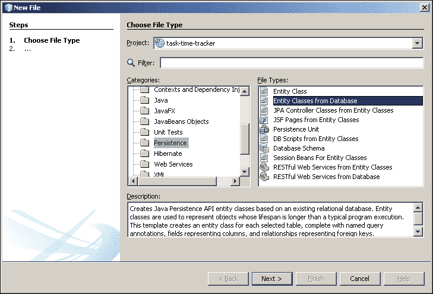

单击“下一步”以显示“数据库表”屏幕，您可以在其中创建“新数据源”：

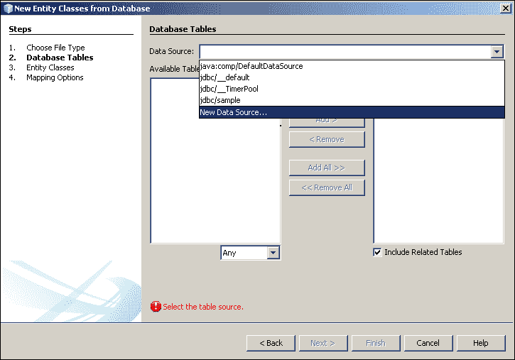

这将允许您输入“JNDI 名称”并选择在上一章中创建的“数据库连接”：

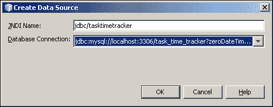

向导现在将读取所有表并将它们显示在“可用表”列表中。选择所有表并将它们添加到“已选表”列表中，如图所示：

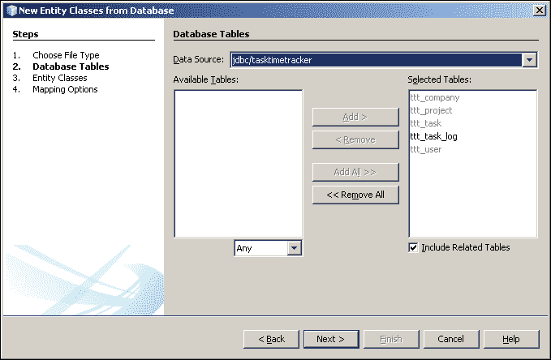

单击“下一步”按钮。这将显示以下屏幕，显示实体类生成属性。通过双击每个“类名”行来更改每个实体的“类名”，以删除“Ttt”前缀来编辑此属性（屏幕截图显示了编辑前的`User`实体）。为什么要删除这个“Ttt”？简单地因为反向工程过程会自动创建基于表名的类名，而“Ttt”前缀对我们的设计没有任何帮助。下一个更改必须在包名中完成。如图所示，在包名中添加“domain”。这将在“com.gieman.tttracker.domain”包中生成新的实体类，代表我们的业务领域对象和相关的辅助类。根据用途或目的将我们的类放在定义明确的独立包中，增强了我们轻松维护应用程序的能力。对于大型企业应用程序，定义良好的 Java 包结构至关重要。

最后一步是取消选中“生成 JAXB 注释”复选框。我们不需要通过 JAXB 生成 XML，因此我们不需要额外的注释。

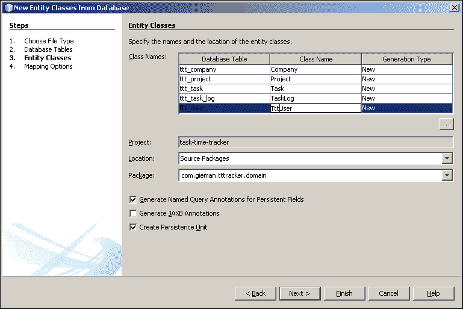

现在单击“下一步”按钮，将显示以下屏幕。最后一步涉及选择适当的“集合类型”。有三种不同类型的集合可以使用，并且都可以同样成功地使用。我们将默认的“集合类型”更改为`java.util.List`，因为在应用程序的业务逻辑中，排序顺序通常很重要，而其他类型不允许排序。在更个人的层面上，我们更喜欢使用`java.util.List` API 而不是`java.util.Set`和`java.util.Collection` API。

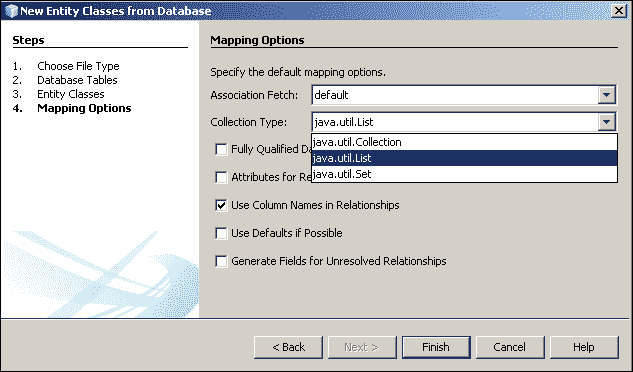

单击“完成”按钮开始反向工程过程。过程完成后，您可以打开`src/java`节点查看生成的文件，如下图所示：

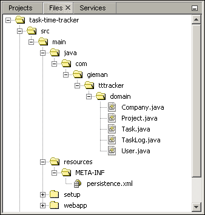

# 介绍 persistence.xml 文件

`persistence.xml`文件是在反向工程过程中生成的，为一组实体类定义了 JPA 配置。该文件始终位于类路径根目录下的`META-INF`目录中。Maven 项目有一个名为`resources`的特殊目录，位于`src/main`目录中，其中包含适用于构建 Java 项目的其他资源。构建项目时，Maven 会自动将`resources`目录复制到类路径的根目录。双击打开文件以在编辑器中显示文件的“设计”视图：

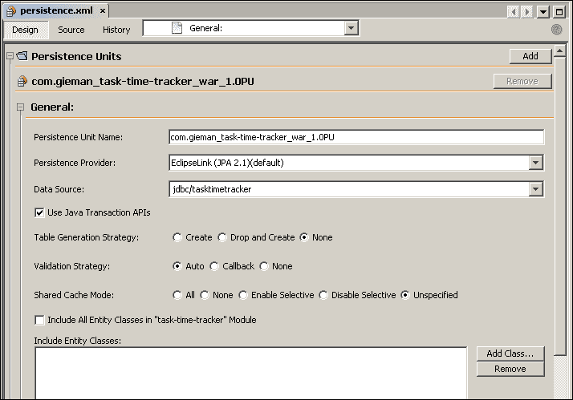

**设计**视图包含用于配置持久性单元行为的几个属性。我们将坚持使用最简单的设置，但我们鼓励您探索可能对您自己应用程序需求有用的不同策略。例如，需要自动创建表的项目将欣赏**表生成策略**的**创建**或**删除和创建**。选择不同的选项并切换到**源**视图将帮助我们快速识别`persistence.xml`文件中的适当属性。

点击顶部的**源**按钮以以文本格式查看默认文件内容：

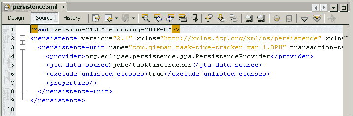

将默认的`persistence-unit`节点`name`属性值更改为`tttPU`，而不是长自动生成的名称。此值将用于您的 Java 代码来引用此持久性单元，并且易于记忆。`provider`节点值会自动设置为适当的 EclipseLink 类，`jta-data-source`节点值会自动设置为在反向工程向导期间使用的数据源。`exclude-unlisted-classes`设置将定义是否对注释的实体类进行类路径扫描。将其更改为`false`。对于大型项目，这是确保类不会被意外省略的最安全方法。还可以以以下方式明确指定每个类：

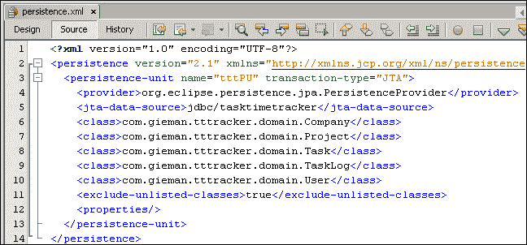

这对于小型项目来说很好，但如果您有数百个实体类，这就不太实际了。在前面的示例中，`exclude-unlisted-classes`属性设置为`true`，这意味着只有指定的类将被加载，无需进行类路径扫描。我们更喜欢通过将`exclude-unlisted-classes`设置为`false`来定义我们的 JPA 类的第一种方法，从而通过类路径扫描加载所有注释的实体类。

感兴趣的最终配置项是`transaction-type`属性。此项支持两种不同类型的事务，我们默认设置为`JTA`。**JTA**（**Java 事务 API**）表示事务将由 GlassFish 服务器提供的 Java EE 事务管理器管理。我们将在第五章中构建测试用例时探索`RESOURCE_LOCAL`替代 JTA。在这种情况下，事务将在没有 Java EE 容器的情况下在本地管理。

# 重构 Java 类

通过一些重构，可以改进反向工程过程生成的类，使代码更易读和理解。当我们实际上是在引用类时，一些自动生成的属性和字段的名称中都有`id`，而`java.util.List`对象的集合中都有`list`。让我们从`Company.java`文件开始。

## Company.java 文件

该文件代表`Company`实体。双击文件以在编辑器中打开并浏览内容。这个类是一个简单的 POJO，除了标准的`hashCode`，`equals`和`toString`方法外，还有每个属性的 set 和 get 方法。该类有一个无参构造函数（JPA 规范要求域对象必须动态创建，没有任何属性），一个仅接受主键的第二个构造函数和一个完整（所有参数）的构造函数。我们将通过对`Company.java`文件进行一些小的更改来使代码更易读。

第一个更改是将文件中的`projectList`字段到处重命名为`projects`。这可以通过选择`projectList`字段，然后从菜单中选择**重构** | **重命名**来轻松实现：

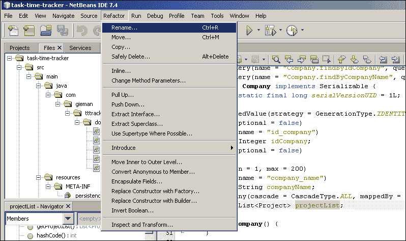

现在您可以将字段名称更改为**projects**。在单击**Refactor**按钮之前，确保还选择**Rename Getters and Setters**选项。

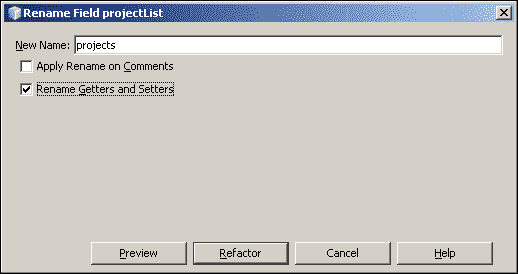

进行这些更改将更改字段名称并为`projects`字段生成新的获取和设置方法。

`Company.java`文件的最终更改是将`mappedBy`属性从`idCompany`重命名为`company`。适当的行现在应该如下所示的代码：

```java
@OneToMany(cascade = CascadeType.ALL, mappedBy = "company")
private List<Project> projects;
```

最终重构的`Company.java`文件现在应该如下所示的代码片段：

```java
package com.gieman.tttracker.domain;

import java.io.Serializable;
import java.util.List;
import javax.persistence.Basic;
import javax.persistence.CascadeType;
import javax.persistence.Column;
import javax.persistence.Entity;
import javax.persistence.GeneratedValue;
import javax.persistence.GenerationType;
import javax.persistence.Id;
import javax.persistence.NamedQueries;
import javax.persistence.NamedQuery;
import javax.persistence.OneToMany;
import javax.persistence.Table;
import javax.validation.constraints.NotNull;
import javax.validation.constraints.Size;

@Entity
@Table(name = "ttt_company")
@NamedQueries({
    @NamedQuery(name = "Company.findAll", query = "SELECT c FROM Company c"),
    @NamedQuery(name = "Company.findByIdCompany", query = "SELECT c FROM Company c WHERE c.idCompany = :idCompany"),
    @NamedQuery(name = "Company.findByCompanyName", query = "SELECT c FROM Company c WHERE c.companyName = :companyName")})
public class Company implements Serializable {
    private static final long serialVersionUID = 1L;
    @Id
    @GeneratedValue(strategy = GenerationType.IDENTITY)
    @Basic(optional = false)
    @Column(name = "id_company")
    private Integer idCompany;
    @Basic(optional = false)
    @NotNull
    @Size(min = 1, max = 200)
    @Column(name = "company_name")
    private String companyName;
    @OneToMany(cascade = CascadeType.ALL, mappedBy = "company")
    private List<Project> projects;

    public Company() {
    }

    public Company(Integer idCompany) {
        this.idCompany = idCompany;
    }

    public Company(Integer idCompany, String companyName) {
        this.idCompany = idCompany;
        this.companyName = companyName;
    }

    public Integer getIdCompany() {
        return idCompany;
    }

    public void setIdCompany(Integer idCompany) {
        this.idCompany = idCompany;
    }

    public String getCompanyName() {
        return companyName;
    }

    public void setCompanyName(String companyName) {
        this.companyName = companyName;
    }

    public List<Project> getProjects() {
        return projects;
    }

    public void setProjects(List<Project> projects) {
        this.projects = projects;
    }

    @Override
    public int hashCode() {
        int hash = 0;
        hash += (idCompany != null ? idCompany.hashCode() : 0);
        return hash;
    }

    @Override
    public boolean equals(Object object) {
        if (!(object instanceof Company)) {
            return false;
        }
        Company other = (Company) object;
        if ((this.idCompany == null && other.idCompany != null) || (this.idCompany != null && !this.idCompany.equals(other.idCompany))) {
            return false;
        }
        return true;
    }

    @Override
    public String toString() {
        return "com.gieman.tttracker.domain.Company[ idCompany=" + idCompany + " ]";
    }

}
```

JPA 使用约定优于配置的概念来简化实体的配置。这是通过使用具有合理默认值的注释来实现的，以保持实体定义的简洁。现在，让我们看看此文件中的关键 JPA 注释。

### @Entity 注释

这是一个标记注释，指示 JPA 持久性提供者`Company`类是一个实体。当`persistence.xml`文件中的`exclude-unlisted-classes`设置为`false`时，JPA 会扫描`@Entity`注释。没有`@Entity`注释，持久性引擎将忽略该类。

### @Table 注释

@Table 注释定义了由此实体类表示的底层数据库表。`@Table(name = "ttt_company")`行告诉持久性提供者`Company`类表示`ttt_company`表。任何实体类中只能定义一个表注释。

### @Id 注释

@Id 注释定义了类中的主键字段，并且对于每个实体都是必需的。如果不存在@Id 注释，持久性提供者将抛出异常。表示`ttt_company`表中主键的`Company`类属性是`Integer idCompany`字段。此字段附加了三个附加注释，其中以下注释特定于主键。

### @GeneratedValue 注释

此注释标识持久性引擎应如何为将记录插入表中生成新的主键值。`strategy=GenerationType.IDENTITY`行将在后台使用 MySQL 自动增量策略将记录插入`ttt_company`表。不同的数据库可能需要不同的策略。例如，Oracle 数据库表可以通过定义以下生成器注释以使用序列作为主键生成的基础：

```java
@GeneratedValue(generator="gen_seq_company")
@SequenceGenerator(name="gen_seq_company", sequenceName="seq_id_company")
```

### 注意

主键生成与类本身无关。持久性引擎将根据生成策略处理主键的生成。

### @Basic 注释

这是一个可选的注释，用于标识字段的可空性。`@Basic(optional = false)`行用于指定字段不是可选的（不可为 null）。同样，`@Basic(optional = true)`行可用于其他可能可为空的字段。

### @Column 注释

此注释指定字段映射到的列。因此，`@Column(name = "id_company")`行将`ttt_company`表中的`id_company`列映射到类中的`idCompany`字段。

### @NotNull 和@Size 注释

这些注释是`javax.validation.constraints`包的一部分（Bean Validation 包是在 Java EE 6 中引入的），定义了字段不能为空以及字段的最小和最大大小。`ttt_company`表中的`company_name`列被定义为`varchar(200) not null`，这就是在反向工程过程中创建这些注释的原因。

### @OneToMany 注释

`Company`类可能有零个或多个`Projects`实体。这种关系由`@OneToMany`注解定义。简而言之，我们可以描述这种关系为*一个公司可以有多个项目*。在 JPA 中，通过在此注解中定义`mappedBy`属性，实体与其他实体的集合相关联。我们已经将原始的`mappedBy`值重构为`company`。这将是在我们在下一节中重构`Project`文件后，在`Project.java`文件中的字段的名称。

### @NamedQueries 注解

`@NamedQueries`注解值得单独解释。我们稍后会详细讨论这些。

## Projects.java 文件

你现在可能已经猜到，这个文件代表`Project`实体，并映射到`ttt_project`表。双击文件以在编辑器中打开并浏览内容。我们将再次进行一些重构，以澄清自动生成的字段：

+   使用重构过程将自动生成的`idCompany`字段重命名为`company`。不要忘记重命名 get 和 set 方法。

+   将自动生成的`taskList`字段重命名为`tasks`。不要忘记再次编写 get 和 set 方法！

+   将`mappedBy`值从`idProject`重命名为`project`。

最终重构后的文件现在应该如下代码所示：

```java
package com.gieman.tttracker.domain;

import java.io.Serializable;
import java.util.List;
import javax.persistence.Basic;
import javax.persistence.CascadeType;
import javax.persistence.Column;
import javax.persistence.Entity;
import javax.persistence.GeneratedValue;
import javax.persistence.GenerationType;
import javax.persistence.Id;
import javax.persistence.JoinColumn;
import javax.persistence.ManyToOne;
import javax.persistence.NamedQueries;
import javax.persistence.NamedQuery;
import javax.persistence.OneToMany;
import javax.persistence.Table;
import javax.validation.constraints.NotNull;
import javax.validation.constraints.Size;

@Entity
@Table(name = "ttt_project")
@NamedQueries({
    @NamedQuery(name = "Project.findAll", query = "SELECT p FROM Project p"),
    @NamedQuery(name = "Project.findByIdProject", query = "SELECT p FROM Project p WHERE p.idProject = :idProject"),
    @NamedQuery(name = "Project.findByProjectName", query = "SELECT p FROM Project p WHERE p.projectName = :projectName")})
public class Project implements Serializable {
    private static final long serialVersionUID = 1L;
    @Id
    @GeneratedValue(strategy = GenerationType.IDENTITY)
    @Basic(optional = false)
    @Column(name = "id_project")
    private Integer idProject;
    @Basic(optional = false)
    @NotNull
    @Size(min = 1, max = 200)
    @Column(name = "project_name")
    private String projectName;
    @JoinColumn(name = "id_company", referencedColumnName = "id_company")
    @ManyToOne(optional = false)
    private Company company;
    @OneToMany(cascade = CascadeType.ALL, mappedBy = "project")
    private List<Task> tasks;

    public Project() {
    }
    public Project(Integer idProject) {
        this.idProject = idProject;
    }

    public Project(Integer idProject, String projectName) {
        this.idProject = idProject;
        this.projectName = projectName;
    }

    public Integer getIdProject() {
        return idProject;
    }

    public void setIdProject(Integer idProject) {
        this.idProject = idProject;
    }

    public String getProjectName() {
        return projectName;
    }

    public void setProjectName(String projectName) {
        this.projectName = projectName;
    }

    public Company getCompany() {
        return company;
    }

    public void setCompany(Company company) {
        this.company = company;
    }

    public List<Task> getTasks() {
        return tasks;
    }

    public void setTasks(List<Task> tasks) {
        this.tasks = tasks;
    }

    @Override
    public int hashCode() {
        int hash = 0;
        hash += (idProject != null ? idProject.hashCode() : 0);
        return hash;
    }

    @Override
    public boolean equals(Object object) {
        if (!(object instanceof Project)) {
            return false;
        }
        Project other = (Project) object;
        if ((this.idProject == null && other.idProject != null) || (this.idProject != null && !this.idProject.equals(other.idProject))) {
            return false;
        }
        return true;
    }

    @Override
    public String toString() {
        return "com.gieman.tttracker.domain.Project[ idProject=" + idProject + " ]";
    }

}
```

### @ManyToOne 注解

这个注解表示实体之间的关系；它是`@OneToMany`注解的反向。对于`Project`实体，我们可以说*多个项目对应一个公司*。换句话说，一个`Project`实体属于一个单一的`Company`类，而（反过来）一个`Company`类可以有任意数量的`Projects`实体。这种关系在数据库级别（即底层表中的外键关系）中定义，并在`@JoinColumn`注解中实现：

```java
@JoinColumn(name = "id_company", referencedColumnName = "id_company")
```

`name`属性定义了`ttt_project`表中的列名，该列是指向`ttt_company`表中的`referencedColumnName`列的外键。

## 双向映射和拥有实体

通过`@ManyToOne`和`@OneToMany`注解，理解一个实体如何通过这两个注解与另一个实体相关联是非常重要的。`Company`类有一个映射的`Projects`实体列表，定义如下：

```java
  @OneToMany(cascade = CascadeType.ALL, mappedBy = "company")
  private List<Project> projects;
```

而`Project`类恰好有一个映射的`Company`实体：

```java
  @JoinColumn(name="id_company", referencedColumnName="id_company")
  @ManyToOne(optional=false)
  private Company company;
```

这被称为双向映射，每个方向上每个类都有一个映射。一个多对一的映射回到源，就像`Project`实体回到`Company`实体一样，意味着源（`Company`）到目标（`Project`）有一个对应的一对多映射。术语**源**和**目标**可以定义如下：

+   **源**：这是一个可以独立存在于关系中的实体。源实体不需要目标实体存在，`@OneToMany`集合可以为空。在我们的例子中，`Company`实体可以存在而不需要`Project`实体。

+   **目标**：这是一个没有参考有效源就无法独立存在的实体。目标上定义的`@ManyToOne`实体不能为空。在我们的设计中，`Project`实体不能存在而没有有效的`Company`实体。

**拥有实体**是一个从数据库角度理解另一个实体的实体。简单来说，拥有实体具有`@JoinColumn`定义，描述形成关系的基础列。在`Company`-`Project`关系中，`Project`是拥有实体。请注意，一个实体可以同时是目标和源，如下面的`Project.java`文件片段所示：

```java
  @OneToMany(cascade = CascadeType.ALL, mappedBy = "project")
  private List<Task> tasks;
```

在这里，`Project`是`Task`实体关系的源，我们期望在`Task`类上找到一个反向的`@ManyToOne`注解。这正是我们将找到的。

## Task.java 文件

这个文件定义了代表`ttt_task`表的`Task`实体。打开文件并执行以下重构：

+   删除自动生成的`taskLogList`字段，同时也删除相关的 get 和 set 方法。为什么要这样做？系统中可能有数百万条任务日志与每个`Task`实例相关联，不建议在`Task`对象内保存对这么大一组`TaskLog`实例的引用。

+   将自动生成的`idProject`字段重命名为`project`。不要忘记再次删除 get 和 set 方法。

在进行了上述更改之后，您会发现一些导入不再需要，并且在 NetBeans IDE 中被标记出来：

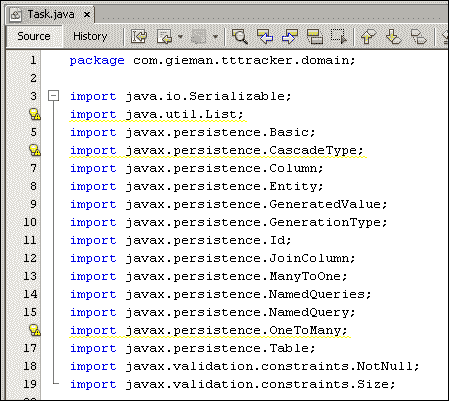

*Ctrl* + *Shift* + *I*的组合键将删除所有未使用的导入。另一种选择是单击下图中显示的图标，打开菜单并选择**删除**选项：

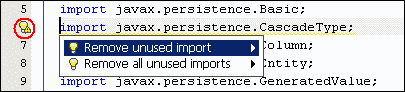

清理代码并删除未使用的导入是一个简单的过程，这是一个良好的实践。

最终重构后的文件现在应该看起来像以下代码片段：

```java
package com.gieman.tttracker.domain;

import java.io.Serializable;
import javax.persistence.Basic;
import javax.persistence.Column;
import javax.persistence.Entity;
import javax.persistence.GeneratedValue;
import javax.persistence.GenerationType;
import javax.persistence.Id;
import javax.persistence.JoinColumn;
import javax.persistence.ManyToOne;
import javax.persistence.NamedQueries;
import javax.persistence.NamedQuery;
import javax.persistence.Table;
import javax.validation.constraints.NotNull;
import javax.validation.constraints.Size;

@Entity
@Table(name = "ttt_task")
@NamedQueries({
    @NamedQuery(name = "Task.findAll", query = "SELECT t FROM Task t"),
    @NamedQuery(name = "Task.findByIdTask", query = "SELECT t FROM Task t WHERE t.idTask = :idTask"),
    @NamedQuery(name = "Task.findByTaskName", query = "SELECT t FROM Task t WHERE t.taskName = :taskName")})
public class Task implements Serializable {
    private static final long serialVersionUID = 1L;
    @Id
    @GeneratedValue(strategy = GenerationType.IDENTITY)
    @Basic(optional = false)
    @Column(name = "id_task")
    private Integer idTask;
    @Basic(optional = false)
    @NotNull
    @Size(min = 1, max = 200)
    @Column(name = "task_name")
    private String taskName;
    @JoinColumn(name = "id_project", referencedColumnName = "id_project")
    @ManyToOne(optional = false)
    private Project project;

    public Task() {
    }

    public Task(Integer idTask) {
        this.idTask = idTask;
    }

    public Task(Integer idTask, String taskName) {
        this.idTask = idTask;
        this.taskName = taskName;
    }

    public Integer getIdTask() {
        return idTask;
    }

    public void setIdTask(Integer idTask) {
        this.idTask = idTask;
    }

    public String getTaskName() {
        return taskName;
    }

    public void setTaskName(String taskName) {
        this.taskName = taskName;
    }

    public Project getProject() {
        return project;
    }

    public void setProject(Project project) {
        this.project = project;
    }

    @Override
    public int hashCode() {
        int hash = 0;
        hash += (idTask != null ? idTask.hashCode() : 0);
        return hash;
    }

    @Override
    public boolean equals(Object object) {
        if (!(object instanceof Task)) {
            return false;
        }
        Task other = (Task) object;
        if ((this.idTask == null && other.idTask != null) || (this.idTask != null && !this.idTask.equals(other.idTask))) {
            return false;
        }
        return true;
    }

    @Override
    public String toString() {
        return "com.gieman.tttracker.domain.Task[ idTask=" + idTask + " ]";
    }    
}
```

注意`@ManyToOne`注释引用`Project`类，使用`@JoinColumn`定义。`Task`对象拥有这个关系。

## User.java 文件

`User`实体代表了底层的`ttt_user`表。生成的类对与`TaskLog`类的关系有一个`@OneToMany`定义：

```java
  @OneToMany(cascade = CascadeType.ALL, mappedBy = "username")
  private List<TaskLog> taskLogList;
```

在这个文件中进行重构将再次**完全删除**这个关系。如`Tasks.java`部分所述，一个`User`实体也可能有成千上万的任务日志。通过了解应用程序的要求和数据结构，完全删除不必要的关系通常更加清晰。

您还会注意到在反向工程过程中，默认情况下`@Pattern`注释被注释掉了。`email`字段名称告诉 NetBeans 这可能是一个电子邮件字段，如果需要，NetBeans 会添加注释以供使用。我们将取消注释此注释以启用对该字段的电子邮件模式检查，并添加所需的导入：

```java
import javax.validation.constraints.Pattern;
```

重构后的`User.java`文件现在应该看起来像以下代码片段：

```java
package com.gieman.tttracker.domain;

import java.io.Serializable;
import javax.persistence.Basic;
import javax.persistence.Column;
import javax.persistence.Entity;
import javax.persistence.Id;
import javax.persistence.NamedQueries;
import javax.persistence.NamedQuery;
import javax.persistence.Table;
import javax.validation.constraints.NotNull;
import javax.validation.constraints.Pattern;
import javax.validation.constraints.Size;

@Entity
@Table(name = "ttt_user")
@NamedQueries({
    @NamedQuery(name = "User.findAll", query = "SELECT u FROM User u"),
    @NamedQuery(name = "User.findByUsername", query = "SELECT u FROM User u WHERE u.username = :username"),
    @NamedQuery(name = "User.findByFirstName", query = "SELECT u FROM User u WHERE u.firstName = :firstName"),
    @NamedQuery(name = "User.findByLastName", query = "SELECT u FROM User u WHERE u.lastName = :lastName"),
    @NamedQuery(name = "User.findByEmail", query = "SELECT u FROM User u WHERE u.email = :email"),
    @NamedQuery(name = "User.findByPassword", query = "SELECT u FROM User u WHERE u.password = :password"),
    @NamedQuery(name = "User.findByAdminRole", query = "SELECT u FROM User u WHERE u.adminRole = :adminRole")})
public class User implements Serializable {
    private static final long serialVersionUID = 1L;
    @Id
    @Basic(optional = false)
    @NotNull
    @Size(min = 1, max = 10)
    @Column(name = "username")
    private String username;
    @Basic(optional = false)
    @NotNull
    @Size(min = 1, max = 100)
    @Column(name = "first_name")
    private String firstName;
    @Basic(optional = false)
    @NotNull
    @Size(min = 1, max = 100)
    @Column(name = "last_name")
    private String lastName;
    @Pattern(regexp="[a-z0-9!#$%&'*+/=?^_`{|}~-]+(?:\\.[a-z0-9!#$%&'*+/=?^_`{|}~-]+)*@(?:a-z0-9?\\.)+a-z0-9?", message="Invalid email")
    @Basic(optional = false)
    @NotNull
    @Size(min = 1, max = 100)
    @Column(name = "email")
    private String email;
    @Basic(optional = false)
    @NotNull
    @Size(min = 1, max = 100)
    @Column(name = "password")
    private String password;
    @Column(name = "admin_role")
    private Character adminRole;

    public User() {
    }

    public User(String username) {
        this.username = username;
    }

    public User(String username, String firstName, String lastName, String email, String password) {
        this.username = username;
        this.firstName = firstName;
        this.lastName = lastName;
        this.email = email;
        this.password = password;
    }

    public String getUsername() {
        return username;
    }

    public void setUsername(String username) {
        this.username = username;
    }

    public String getFirstName() {
        return firstName;
    }

    public void setFirstName(String firstName) {
        this.firstName = firstName;
    }

    public String getLastName() {
        return lastName;
    }

    public void setLastName(String lastName) {
        this.lastName = lastName;
    }

    public String getEmail() {
        return email;
    }

    public void setEmail(String email) {
        this.email = email;
    }

    public String getPassword() {
        return password;
    }

    public void setPassword(String password) {
        this.password = password;
    }

    public Character getAdminRole() {
        return adminRole;
    }

    public void setAdminRole(Character adminRole) {
        this.adminRole = adminRole;
    }

    @Override
    public int hashCode() {
        int hash = 0;
        hash += (username != null ? username.hashCode() : 0);
        return hash;
    }

    @Override
    public boolean equals(Object object) {
         if (!(object instanceof User)) {
            return false;
        }
        User other = (User) object;
        if ((this.username == null && other.username != null) || (this.username != null && !this.username.equals(other.username))) {
            return false;
        }
        return true;
    }

    @Override
    public String toString() {
        return "com.gieman.tttracker.domain.User[ username=" + username + " ]";
    }   
}
```

## TaskLog.java 文件

我们应用程序中的最终实体代表了`ttt_task_log`表。这里需要进行的重构是将`idTask`字段重命名为`task`（记得同时重命名 get 和 set 方法），然后将`username`字段重命名为`user`。文件现在应该看起来像以下代码片段：

```java
package com.tttracker.domain;

import java.io.Serializable;
import java.util.Date;
import javax.persistence.Basic;
import javax.persistence.Column;
import javax.persistence.Entity;
import javax.persistence.GeneratedValue;
import javax.persistence.GenerationType;
import javax.persistence.Id;
import javax.persistence.JoinColumn;
import javax.persistence.ManyToOne;
import javax.persistence.NamedQueries;
import javax.persistence.NamedQuery;
import javax.persistence.Table;
import javax.persistence.Temporal;
import javax.persistence.TemporalType;
import javax.validation.constraints.NotNull;
import javax.validation.constraints.Size;

@Entity
@Table(name = "ttt_task_log")
@NamedQueries({
  @NamedQuery(name = "TaskLog.findAll", query = "SELECT t FROM TaskLog t"),
  @NamedQuery(name = "TaskLog.findByIdTaskLog", query = "SELECT t FROM TaskLog t WHERE t.idTaskLog = :idTaskLog"),
  @NamedQuery(name = "TaskLog.findByTaskDescription", query = "SELECT t FROM TaskLog t WHERE t.taskDescription = :taskDescription"),
  @NamedQuery(name = "TaskLog.findByTaskLogDate", query = "SELECT t FROM TaskLog t WHERE t.taskLogDate = :taskLogDate"),
  @NamedQuery(name = "TaskLog.findByTaskMinutes", query = "SELECT t FROM TaskLog t WHERE t.taskMinutes = :taskMinutes")})
public class TaskLog implements Serializable {
  private static final long serialVersionUID = 1L;
  @Id
  @GeneratedValue(strategy = GenerationType.IDENTITY)
  @Basic(optional = false)
  @Column(name = "id_task_log")
  private Integer idTaskLog;
  @Basic(optional = false)
  @NotNull
  @Size(min = 1, max = 2000)
  @Column(name = "task_description")
  private String taskDescription;
  @Basic(optional = false)
  @NotNull
  @Column(name = "task_log_date")
  @Temporal(TemporalType.DATE)
  private Date taskLogDate;
  @Basic(optional = false)
  @NotNull
  @Column(name = "task_minutes")
  private int taskMinutes;
  @JoinColumn(name = "username", referencedColumnName = "username")
  @ManyToOne(optional = false)
  private User user;
  @JoinColumn(name = "id_task", referencedColumnName = "id_task")
  @ManyToOne(optional = false)
  private Task task;

  public TaskLog() {
  }

  public TaskLog(Integer idTaskLog) {
    this.idTaskLog = idTaskLog;
  }

  public TaskLog(Integer idTaskLog, String taskDescription, Date taskLogDate, int taskMinutes) {
    this.idTaskLog = idTaskLog;
    this.taskDescription = taskDescription;
    this.taskLogDate = taskLogDate;
    this.taskMinutes = taskMinutes;
  }

  public Integer getIdTaskLog() {
    return idTaskLog;
  }

  public void setIdTaskLog(Integer idTaskLog) {
    this.idTaskLog = idTaskLog;
  }

  public String getTaskDescription() {
    return taskDescription;
  }

  public void setTaskDescription(String taskDescription) {
    this.taskDescription = taskDescription;
  }

  public Date getTaskLogDate() {
    return taskLogDate;
  }

  public void setTaskLogDate(Date taskLogDate) {
    this.taskLogDate = taskLogDate;
  }

  public int getTaskMinutes() {
    return taskMinutes;
  }

  public void setTaskMinutes(int taskMinutes) {
    this.taskMinutes = taskMinutes;
  }

  public User getUser() {
    return user;
  }

  public void setUser(User user) {
    this.user = user;
  }

  public Task getTask() {
    return task;
  }

  public void setTask(Task task) {
    this.task = task;
  }

  @Override
  public int hashCode() {
    int hash = 0;
    hash += (idTaskLog != null ? idTaskLog.hashCode() : 0);
    return hash;
  }

  @Override
  public boolean equals(Object object) {
    if (!(object instanceof TaskLog)) {
      return false;
    }
    TaskLog other = (TaskLog) object;
    if ((this.idTaskLog == null && other.idTaskLog != null) || (this.idTaskLog != null && !this.idTaskLog.equals(other.idTaskLog))) {
      return false;
    }
    return true;
  }

  @Override
  public String toString() {
    return "com.tttracker.domain.TaskLog[ idTaskLog=" + idTaskLog + " ]";
  }
}
```

# 介绍 Java 持久性查询语言

阅读本书的每个人都应该熟悉 SQL 查询及其工作原理。针对`ttt_company`表构建一个简单的查询以检索所有记录将如下所示：

```java
select * from ttt_company
```

将结果集限制为以`G`开头的公司将如下代码行所示：

```java
select * from ttt_company where company_name like "G%"
```

在 JPA 中，我们处理实体和实体之间的关系。**Java 持久性查询语言**（**JPQL**）用于以类似于 SQL 的方式制定查询。前面提到的语句将以 JPQL 形式写成如下：

```java
SELECT c FROM Company c
```

接下来的语句将被写成如下形式：

```java
SELECT c FROM Company c WHERE c.companyName LIKE 'G%'
```

以下是 SQL 和 JPQL 之间的主要区别：

+   JPQL 类和字段名称区分大小写。当我们处理类时，类名必须以大写字母开头。所有字段必须与类中定义的大小写完全一致。以下语句将无法编译，因为公司实体以小写`c`开头：

```java
SELECT c FROM company c WHERE c.companyName LIKE 'G%'
```

+   JPQL 关键字不区分大小写。上述语句也可以写成如下形式：

```java
select c from Company c where c.companyName like 'G%'
```

+   JPQL 使用别名来定义实例和实例之间的关系。在前面的例子中，小写的`c`被用作`SELECT`和`WHERE`子句中的别名。

+   JPQL 查询可以是静态的（在注释中定义）或动态的（在运行时构建和执行）。静态查询只编译一次，并在需要时查找。这使得静态查询更快速和更高效。

+   JPQL 查询被翻译成 SQL；然后针对底层数据库执行。这种翻译允许在持久性引擎中进行特定于数据库的查询优化。

+   JPQL 有一套丰富的函数来定义条件表达式。这些表达式被翻译成底层数据库的正确 SQL。这意味着开发人员不再需要编写特定于数据库的 SQL 语句。在不同数据库之间切换不需要任何编码，因为 JPQL 语句抽象了执行语句所需的底层 SQL。

### 注意

我们强烈建议您花时间学习 JPQL。有许多专门介绍 JPA 和 JPQL 的优秀书籍可供阅读，它们解释了高级用法。互联网上也有许多在线教程和 JPQL 示例。本书的范围超出了基础知识，我们将其留给您进一步深入学习这种丰富语言。

## 定义命名查询

反向工程过程在每个类中生成了一组`@NamedQuery`注解，每个持久字段都有一个。例如，`Company`类定义了以下命名查询：

```java
@NamedQueries({
  @NamedQuery(name = "Company.findAll", query = "SELECT c FROM Company c"),
  @NamedQuery(name = "Company.findByIdCompany", query = "SELECT c FROM Company c WHERE c.idCompany = :idCompany"),
  @NamedQuery(name = "Company.findByCompanyName", query = "SELECT c FROM Company c WHERE c.companyName = :companyName")}) 
```

每个`@NamedQuery`名称在持久性引擎内必须是唯一的；因此，它以类的名称为前缀。第一个查询名称`Company.findAll`表示`Company`对象的完整列表。第二个查询使用命名参数`idCompany`作为运行时提供的值的占位符。命名参数总是以冒号符号为前缀。您应该花一些时间浏览 Java 类中生成的查询，以熟悉基本的 JPQL 语法。我们将在接下来的章节中学习更多关于命名查询以及它们的用法。

# 重构 Java equals()和 hashCode()

我们的领域层实体类已定义了自动生成的`equals`和`hashCode`方法。例如，`Company`类定义了如下方法：

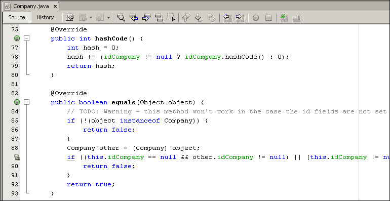

最佳实践是始终提供正确实现的`equals`和`hashCode`方法，这些方法使用实体 ID 来计算返回的值。这些方法由 JPA 用于确定实体之间的相等性。我们的自动生成的`equals`方法将与 JPA 一起正常工作，因为 ID 实体在每个方法的比较中都被使用。然而，83 行上的`//TODO: Warning`消息（参见上一个屏幕截图）指示了一个问题，如果我们使用 NetBeans IDE 重新生成`equals`方法，就可以避免这个问题。

删除`equals`方法，并使用鼠标右键单击编辑器中的`Company.java`文件，显示上下文菜单。选择**Insert Code…**选项：

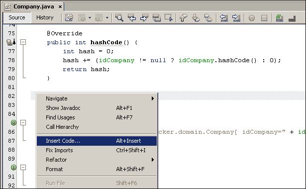

从弹出菜单中，选择**equals()…**选项，并确保在**Generate equals()**弹出窗口中选择了**idCompany : Integer**字段：

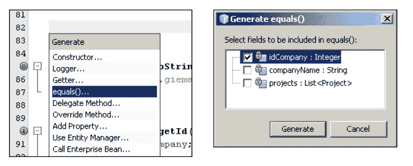

单击**Generate**以创建新的`equals`方法：

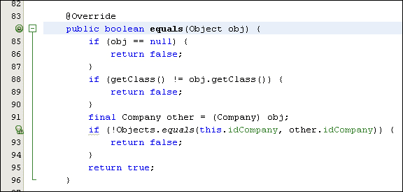

单击信息图标（圈出的）在第 92 行上显示上下文信息：

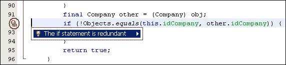

单击**if 语句是多余的**以进一步清理您的代码，并用以下行替换`if`语句：

```java
return Objects.equals(this.idCompany, other.idCompany);
```

`Objects`类是在 Java 1.7 中引入的，它包含用于操作对象的静态实用方法。`Objects.equals`方法考虑了`null`值，并解决了自动生成的`equals`方法可能出现的`//TODO: Warning`问题。来自 Java 1.7 JavaDoc 的`Objects.equals`方法：

### 注意

如果参数彼此相等，则返回`true`，否则返回`false`。因此，如果两个参数都为 null，则返回`true`，如果恰好一个参数为 null，则返回`false`。否则，使用第一个参数的`equals`方法来确定相等性。

现在，您可以以类似的方式替换`Project`，`Task`，`User`和`TaskLog`实体类的自动生成的`equals`方法。

# 总结

在本章中，我们将 3T 数据库反向工程为一组 Java 类。每个 Java 类代表一个带有注释的 JPA 实体，定义了实体之间的关系以及数据库列与 Java 字段的映射。我们通过命名查询定义简要介绍了 JPQL，并介绍了关键的 JPA 注释。

尽管本章介绍了许多关键概念，但 JPA 和 JPQL 的范围还有很多需要学习的地方。JPA 是企业应用程序开发中的关键工具，可以轻松进行增强和与数据库无关的编程。

下一章将介绍**数据访问对象**（**DAO**）设计模式，并使用我们刚刚定义的领域类实现一个强大的数据访问层。我们的 JPA 之旅刚刚开始！
