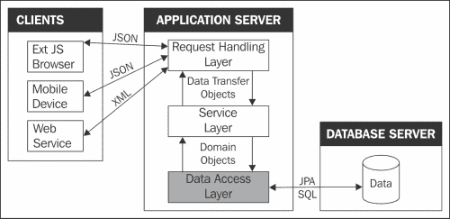
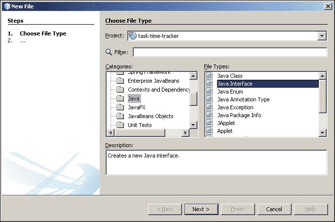
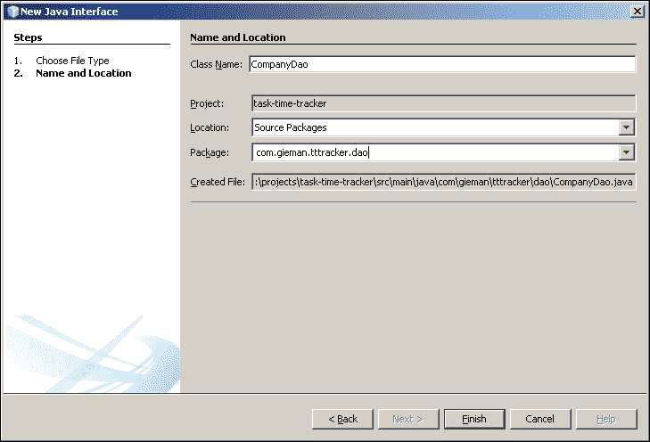
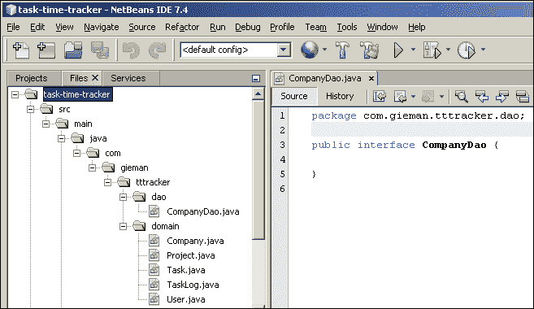

# 第四章：数据访问变得简单

数据访问对象（DAO）设计模式是一种简单而优雅的方式，将数据库持久性与应用程序业务逻辑抽象出来。这种设计确保了企业应用程序的两个核心部分的清晰分离：数据访问层和服务（或业务逻辑）层。DAO 模式是一种广为人知的 Java EE 编程结构，最初由 Sun Microsystems 在其 Java EE 设计蓝图中引起关注，后来被其他编程环境如.NET 框架所采用。

以下图片说明了 DAO 层在整个应用程序结构中的位置：



在 DAO 层更改实现不应以任何方式影响服务层。这是通过定义 DAO 接口来实现的，以封装服务层可以访问的持久性操作。DAO 实现本身对服务层是隐藏的。

# 定义 DAO 接口

Java 编程语言中的接口定义了一组方法签名和常量声明。接口公开行为（或*可以做什么）并定义了实现类承诺提供的合同（*如何做）。我们的 DAO 层将包含每个域对象一个接口和一个实现类。

### 注意

接口的使用在企业编程中经常被误解。有人认为，“为什么在代码库中添加另一组 Java 对象，当它们并不是必需的时候”。接口确实增加了你编写的代码行数，但它们的美妙之处将在你被要求重构一个使用接口编写的老项目时得到赞赏。我曾将基于 SQL 的持久性层迁移到 JPA 持久性层。新的 DAO 实现替换了旧的实现，而服务层几乎没有发生任何重大变化，这要归功于接口的使用。开发是并行进行的，同时支持现有（旧的）实现，直到我们准备好切换到新的实现。这是一个相对轻松的过程，如果没有接口的使用，就不会那么容易实现。

让我们从公司接口开始。

## 添加 CompanyDao 接口

1.  从菜单中导航到“文件”|“新建文件”，并选择“Java 接口”，如下截图所示：

1.  点击“下一步”按钮，并按照以下截图中显示的方式填写详细信息：

接口的名称是`CompanyDao`。我们本可以使用大写首字母缩写`CompanyDAO`来命名此接口。为了符合较新的 Java EE 命名风格，我们决定使用驼峰式缩写形式。最近的例子包括`Html`*、`Json`*和`Xml`*类和接口，例如`javax.json.JsonObject`。我们也相信这种形式更容易阅读。但是，这并不妨碍您使用大写首字母缩写；在 Java EE 中也有许多这样的例子（`EJB`*、`JAXB`*和`JMS`*接口和类等）。无论您选择哪种形式，都要保持一致。不要混合形式，创建`CompanyDAO`和`ProjectDao`接口！

请注意，包`com.gieman.tttracker.dao`目前还不存在，将由系统为您创建。点击“完成”以创建您的第一个接口，之后 NetBeans 将在编辑器中打开该文件。



公司接口将定义我们在应用程序中将使用的持久性方法。核心方法必须包括执行每个 CRUD 操作的能力，以及适合我们业务需求的任何其他操作。我们将在此接口中添加以下方法：

+   `persist`：此方法插入新的公司记录

+   `merge`：此方法更新现有的公司记录

+   `remove`：这个方法删除公司记录

+   `find`：这个方法使用主键选择公司记录

+   `findAll`：这个方法返回所有公司记录

请注意，JPA 术语`persist`、`merge`、`remove`和`find`等同于 SQL 操作`insert`、`update`、`delete`和`select`。按照以下代码将这些方法添加到`CompanyDao`中：

```java
package com.gieman.tttracker.dao;

import com.gieman.tttracker.domain.Company;
import java.util.List;
public interface CompanyDao {

    public Company find(Integer idCompany);

    public List<Company> findAll();

    public void persist(Company company);

    public Company merge(Company company);

    public void remove(Company company);
}
```

我们已经定义了实现类必须承诺提供的契约。现在我们将添加`ProjectDao`接口。

## 添加 ProjectDao 接口

`ProjectDao`接口将定义一组类似于`CompanyDao`接口的方法：

```java
package com.gieman.tttracker.dao;

import com.gieman.tttracker.domain.Company;
import com.gieman.tttracker.domain.Project;
import java.util.List;

public interface ProjectDao {

    public Project find(Integer idProject);

    public List<Project> findAll();

    public void persist(Project project);

    public Project merge(Project project);

    public void remove(Project project);
}
```

你会注意到`ProjectDao`接口中的所有方法签名与`CompanyDao`接口中的完全相同。唯一的区别在于类类型，其中`Company`被`project`替换。在我们将要添加的所有其他接口（`TaskDao`、`UserDao`和`TaskLogDao`）中，情况也是如此。每个接口都需要一个`find`方法的定义，看起来像下面的代码：

```java
public Company find(Integer idCompany); // in CompanyDao
public Project find(Integer idProject); // in ProjectDao
public Task find(Integer idTask); // in TaskDao
public User find(Integer idUser); // in UserDao
public TaskLog find(Integer idTaskLog); // in TaskLogDao
```

正如你所看到的，每个方法的唯一功能区别是返回类型。对于`persist`、`merge`和`remove`方法也是如此。这种情况非常适合使用 Java 泛型。

## 定义一个通用的 DAO 接口

这个接口将被我们的每个 DAO 接口扩展。`GenericDao`接口使用泛型来定义每个方法，以便可以被每个后代接口使用。然后这些方法将免费提供给扩展接口。与在`CompanyDao`、`ProjectDao`、`TaskDao`、`UserDao`和`TaskLogDao`接口中定义`find(Integer id)`方法不同，`GenericDao`接口定义了通用方法，然后这些方法对所有后代接口都可用。

### 注意

这是一种强大的企业应用程序编程技术，应该在设计或构建应用程序框架时始终考虑。使用 Java 泛型的良好结构设计将简化多年来的变更请求和维护。

通用接口定义如下：

```java
package com.gieman.tttracker.dao;

public interface GenericDao<T, ID> {

    public T find(ID id);

    public void persist(T obj);

    public T merge(T obj);

    public void remove(T obj);
}
```

我们现在可以按照以下方式重构`CompanyDao`接口：

```java
package com.gieman.tttracker.dao;

import com.gieman.tttracker.domain.Company;
import java.util.List;

public interface CompanyDao extends GenericDao<Company, Integer>{

    public List<Company> findAll();

}
```

注意我们如何使用`<Company, Integer>`类型扩展了`GenericDao`接口。`GenericDao`接口中的类型参数`<T, ID>`成为了`CompanyDao`定义中指定的类型的占位符。在`CompanyDao`接口中，`GenericDao`接口中找到的`T`或`ID`将被替换为`Company`和`Integer`。这会自动将`find`、`persist`、`merge`和`remove`方法添加到`CompanyDao`中。

泛型允许编译器在编译时检查类型正确性。这提高了代码的健壮性。关于 Java 泛型的良好解释可以在[`docs.oracle.com/javase/tutorial/extra/generics/index.html`](http://docs.oracle.com/javase/tutorial/extra/generics/index.html)找到。

以类似的方式，我们现在可以重构`ProjectDao`接口：

```java
package com.gieman.tttracker.dao;

import com.gieman.tttracker.domain.Company;
import com.gieman.tttracker.domain.Project;
import java.util.List;

public interface ProjectDao extends GenericDao<Project, Integer>{

    public List<Project> findAll();

}
```

让我们以相同的方式继续添加缺失的接口。

## TaskDao 接口

除了通用的泛型方法，我们还需要一个`findAll`方法。这个接口看起来像下面的代码：

```java
package com.gieman.tttracker.dao;

import com.gieman.tttracker.domain.Project;
import com.gieman.tttracker.domain.Task;
import java.util.List;

public interface TaskDao extends GenericDao<Task, Integer>{

    public List<Task> findAll();    
}
```

## UserDao 接口

我们需要系统中所有用户的列表，以及一些查找方法来根据不同的参数识别用户。当我们开发前端用户界面和服务层功能时，将需要这些方法。`UserDao`接口看起来像下面的代码：

```java
package com.gieman.tttracker.dao;

import com.gieman.tttracker.domain.User;
import java.util.List;

public interface UserDao extends GenericDao<User, String> {

    public List<User> findAll();

    public User findByUsernamePassword(String username, String password);

    public User findByUsername(String username);

    public User findByEmail(String email);
}
```

请注意，`UserDao`接口使用`String` ID 类型扩展了`GenericDao`。这是因为`User`领域实体具有`String`主键类型。

## TaskLogDao 接口

`TaskLogDao`接口还需要定义一些额外的方法，以便允许对任务日志数据进行不同的查看。当我们开发前端用户界面和服务层功能时，这些方法将再次被需要。

```java
package com.gieman.tttracker.dao;

import com.gieman.tttracker.domain.Task;
import com.gieman.tttracker.domain.TaskLog;
import com.gieman.tttracker.domain.User;
import java.util.Date;
import java.util.List;

public interface TaskLogDao extends GenericDao<TaskLog, Integer>{

    public List<TaskLog> findByUser(User user, Date startDate, Date endDate);

    public long findTaskLogCountByTask(Task task);

    public long findTaskLogCountByUser(User user);
}
```

请注意，我们为`TaskLogDao`接口的查找方法命名具有描述性的名称，以标识方法的目的。每个查找方法将用于检索适合应用程序业务需求的任务日志条目的子集。

这涵盖了我们应用程序所需的所有接口。现在是时候为我们的每个接口定义实现了。

# 定义通用的 DAO 实现

我们将再次使用 Java 泛型来定义一个通用的祖先类，该类将由我们的每个实现类（`CompanyDaoImpl`、`ProjectDaoImpl`、`TaskDaoImpl`、`TaskLogDaoImpl`和`UserDaoImpl`）扩展。`GenericDaoImpl`和所有其他实现类将被添加到与我们的 DAO 接口相同的`com.gieman.tttracker.dao`包中。`GenericDaoImpl`中的关键代码行已经突出显示，并将在接下来的章节中进行解释：

```java
package com.gieman.tttracker.dao;

import java.io.Serializable;
import org.slf4j.Logger;
import org.slf4j.LoggerFactory;
import javax.persistence.EntityManager;
import javax.persistence.PersistenceContext;
import org.springframework.transaction.annotation.Propagation;
import org.springframework.transaction.annotation.Transactional;

public class GenericDaoImpl<T, ID extends Serializable> implements GenericDao<T, ID> {

    final protected Logger logger = LoggerFactory.getLogger(this.getClass());    

    @PersistenceContext(unitName = "tttPU")
    protected EntityManager em;

    private Class<T> type;

    public GenericDaoImpl(Class<T> type1) {
        this.type = type1;
    }

    @Override
    @Transactional(readOnly = true, propagation = Propagation.SUPPORTS)
  public T find(ID id) {
        return (T) em.find(type, id);
    }

    @Override
    @Transactional(readOnly = false, propagation = Propagation.REQUIRED)
    public void persist(T o) {
      em.persist(o);
    }

    @Override
    @Transactional(readOnly = false, propagation = Propagation.REQUIRED)
    public T merge(T o) {

          o = em.merge(o);
      return o;
    }
    @Override
    @Transactional(readOnly = false, propagation = Propagation.REQUIRED)
    public void remove(T o) {

        // associate object with persistence context
        o = merge(o);
        em.remove(o);

    }    
}
```

这个类中有很多新概念！让我们一次解决一个。

## Java 的简单日志门面

Java 的简单日志门面或 SLF4J 是对关键日志框架（包括`java.util.logging`、`log4j`和`logback`）的简单抽象。SLF4J 允许最终用户在部署时通过简单地包含适当的实现库来插入所需的日志记录框架。有关 SLF4J 的更多信息可以在[`slf4j.org/manual.html`](http://slf4j.org/manual.html)找到。日志记录不仅允许开发人员调试代码，还可以提供应用程序内部操作和状态的永久记录。应用程序状态的示例可能是当前内存使用情况、当前已经登录的授权用户数量或等待处理的挂起消息数量。在分析生产错误时，日志文件通常是首要查看的地方，它们是任何企业应用程序的重要组成部分。

尽管默认的 Java 日志记录对于简单的用途已经足够，但对于更复杂的应用程序来说就不合适了。`log4J`框架（[`logging.apache.org/log4j/1.2`](http://logging.apache.org/log4j/1.2)）和`logback`框架（[`logback.qos.ch`](http://logback.qos.ch)）是高度可配置的日志记录框架的例子。`logback`框架通常被认为是`log4j`的继任者，因为它在性能、内存消耗和配置文件的自动重新加载等方面都比`log4j`具有一些关键优势。我们将在我们的应用程序中使用`logback`。

通过将以下依赖项添加到`pom.xml`中，所需的 SLF4J 和`logback`库将被添加到应用程序中：

```java
  <dependency>
   <groupId>ch.qos.logback</groupId>
   <artifactId>logback-classic</artifactId>
   <version>${logback.version}</version>
  </dependency>
```

您还需要将额外的`logback.version`属性添加到`pom.xml`中：

```java
 <properties>
  <endorsed.dir>${project.build.directory}/endorsed</endorsed.dir>
  <project.build.sourceEncoding>UTF-8</project.build.sourceEncoding>
  <spring.version>3.2.4.RELEASE</spring.version>
 <logback.version>1.0.13</logback.version>
 </properties>
```

您现在可以执行**清理和构建项目**以下载`logback-classic`、`logback-core`和`slf4j-api` JAR 文件。这将使我们能够添加`GenericDaoImpl`中定义的导入以及日志记录器定义：

```java
final protected Logger logger = LoggerFactory.getLogger(this.getClass());
```

所有后代类现在都可以使用日志记录器（它被声明为`protected`），但不能更改它（它被声明为`final`）。我们将在第五章中开始使用日志记录器，*使用 Spring 和 JUnit 测试 DAO 层*，在那里我们将详细检查`logback.xml`配置文件。

## @PersistenceContext(unitName = "tttPU")行

这一行注释`EntityManager`接口方法是 Spring 框架在运行时插入或注入`EclipseLink`实现所需的全部。`EntityManager`接口定义了与持久化上下文交互的方法，如`persist`、`merge`、`remove`和`find`。`EntityManager`接口方法的完整列表可以在[`docs.oracle.com/javaee/7/api/javax/persistence/EntityManager.html`](http://docs.oracle.com/javaee/7/api/javax/persistence/EntityManager.html)找到。

我们的持久化上下文在`persistence.xml`中定义，我们将其命名为`tttPU`。这是将`GenericDaoImpl`中的`EntityManager`与持久化上下文绑定的方式，通过`@PersistenceContext`注解的`unitName`属性。持久化上下文是一组实体实例（在我们的应用程序中，这些是`Company`、`Project`、`Task`、`User`和`TaskLog`对象），对于任何持久实体，都有一个唯一的实体实例。在持久化上下文中，实体实例及其生命周期是受管理的。

`EntityManager` API 用于创建和删除持久化实体实例，按主键查找实体，以及对实体进行查询。在我们的`GenericDaoImpl`类中，`EntityManager`实例`em`用于执行通用的 CRUD 操作。因此，每个子类都将可以访问这些方法以及`em`实例本身（它被声明为 protected）。

## `@Transactional`注解

`@Transactional`注解是 Spring 声明式事务管理的基石。它允许您在单个方法级别指定事务行为，并且非常简单易用。这个选项对应用程序代码的影响最小，不需要任何复杂的配置。事实上，它完全是非侵入性的，因为不需要 Java 编码来进行提交和回滚。

Spring 建议只对类（和类的方法）使用`@Transactional`注解，而不是对接口进行注解（完整的解释可以在[`static.springsource.org/spring/docs/3.2.x/spring-framework-reference/html/transaction.html`](http://static.springsource.org/spring/docs/3.2.x/spring-framework-reference/html/transaction.html)找到）。因此，我们将对通用和实现类中的所有适当方法使用以下之一的注解：

```java
@Transactional(readOnly = false, propagation = Propagation.REQUIRED)
@Transactional(readOnly = true, propagation = Propagation.SUPPORTS)
```

`@Transactional`注解是指定方法必须具有事务语义的元数据。例如，我们可以定义元数据，定义在调用此方法时启动全新的只读事务，挂起任何现有事务。默认的`@Transactional`设置如下：

+   - `propagation`设置为`Propagation.REQUIRED`

+   - `readOnly`为 false

定义所有属性，包括默认设置，是一个好习惯，就像我们之前做的那样。让我们详细地检查这些属性。

### Propagation.REQUIRED 属性

- 默认值为不指定`propagation`设置的事务。如果存在当前事务，则支持此属性，如果不存在事务，则创建一个新的事务。这确保了`Propagation.REQUIRED`注解的方法始终有一个有效的事务可用，并且应该在持久化存储中修改数据时使用。这个属性通常与`readOnly=false`结合使用。

### - Propagation.SUPPORTS 属性

如果存在当前事务，则支持此属性，如果不存在事务，则以非事务方式执行。如果注解的方法不修改数据（不会对数据库执行 insert、update 或 delete 语句），则应该使用`Propagation.SUPPORTS`属性。这个属性通常与`readOnly=true`结合使用。

### readOnly 属性

这只是一个提示，用于实际事务子系统，以便在可能的情况下优化执行的语句。可能事务管理器无法解释此属性。然而，对于自我记录的代码来说，包含此属性是一个很好的做法。

### 其他事务属性

Spring 允许我们使用额外的选项来微调事务属性，这超出了本书的范围。浏览之前提到的链接，了解更多关于如何在更复杂的情况下管理事务的信息，包括多个事务资源。

# 定义 DAO 实现

以下 DAO 实现将从`GenericDaoImpl`继承核心 CRUD 操作，并根据实现的接口添加自己的特定于类的方法。每个方法将使用`@Transactional`注解来定义适当的事务行为。

## `CompanyDaoImpl`类

我们的`CompanyDaoImpl`类的完整列表如下：

```java
package com.gieman.tttracker.dao;

import com.gieman.tttracker.domain.Company;
import java.util.List;
import org.springframework.stereotype.Repository;
import org.springframework.transaction.annotation.Propagation;
import org.springframework.transaction.annotation.Transactional;

@Repository("companyDao")
@Transactional
public class CompanyDaoImpl extends GenericDaoImpl<Company, Integer> 
    implements CompanyDao {

    public CompanyDaoImpl() {
        super(Company.class);
    }

    @Override
    @Transactional(readOnly = true, propagation = Propagation.SUPPORTS)
    public List<Company> findAll() {
        return em.createNamedQuery("Company.findAll")
                .getResultList();
    }    
}
```

首先要注意的是`@Repository("companyDao")`注解。这个注解被 Spring 用来在应用程序加载时自动检测和处理 DAO 对象。Spring API 将这个注解定义如下：

### 注意

它表示一个带注解的类是一个`Repository`，最初由领域驱动设计（Evans, 2003）定义为一种模拟对象集合的存储、检索和搜索行为的机制。

注解的目的是允许 Spring 通过`classpath`扫描自动检测实现类，并处理该类以进行数据访问异常转换（Spring 用于将数据库异常消息从底层实现中抽象出来）。Spring 应用程序将持有实现类的引用，键为`companyDao`。最佳实践是将键值与实现的接口名称匹配。

`CompanyDaoImpl`类还引入了在上一章的反向工程过程中定义的 JPA 命名查询的使用。方法调用`em.createNamedQuery("Company.findAll")`创建了持久化引擎中由唯一标识符`"Company.findAll"`定义的命名查询。这个命名查询是在`Company`类中定义的。调用`getResultList()`执行了针对数据库的查询，返回了一个`java.util.List`的 Company 对象。现在让我们来审查一下`Company`类中的命名查询定义：

```java
@NamedQuery(name = "Company.findAll", query = "SELECT c FROM Company c")
```

我们将对这个命名查询进行微小的更改，以按照`companyName`的升序排列结果。这将需要在查询语句中添加`ORDER BY`子句。`Company`类中的最终命名查询定义现在看起来像以下代码：

```java
@NamedQueries({
    @NamedQuery(name = "Company.findAll", query = "SELECT c FROM Company c ORDER BY c.companyName ASC "),
    @NamedQuery(name = "Company.findByIdCompany", query = "SELECT c FROM Company c WHERE c.idCompany = :idCompany"),
    @NamedQuery(name = "Company.findByCompanyName", query = "SELECT c FROM Company c WHERE c.companyName = :companyName")})
```

## `ProjectDaoImpl`类

这个实现被定义为：

```java
package com.gieman.tttracker.dao;

import com.gieman.tttracker.domain.Company;
import com.gieman.tttracker.domain.Project;
import java.util.List;
import org.springframework.stereotype.Repository;
import org.springframework.transaction.annotation.Propagation;
import org.springframework.transaction.annotation.Transactional;

@Repository("projectDao")
@Transactional
public class ProjectDaoImpl extends GenericDaoImpl<Project, Integer> 
    implements ProjectDao {

    public ProjectDaoImpl() {
        super(Project.class);
    }

    @Override
    @Transactional(readOnly = true, propagation = Propagation.SUPPORTS)
    public List<Project> findAll() {
        return em.createNamedQuery("Project.findAll")
                .getResultList();
    }    
}
```

再次，我们将在`Project`类的`Project.findAll`命名查询中添加`ORDER BY`子句：

```java
@NamedQuery(name = "Project.findAll", query = "SELECT p FROM Project p ORDER BY p.projectName")
```

## `TaskDaoImpl`类

这个类被定义为：

```java
package com.gieman.tttracker.dao;

import com.gieman.tttracker.domain.Project;
import com.gieman.tttracker.domain.Task;
import java.util.List;
import org.springframework.stereotype.Repository;
import org.springframework.transaction.annotation.Propagation;
import org.springframework.transaction.annotation.Transactional;

@Repository("taskDao")
@Transactional
public class TaskDaoImpl extends GenericDaoImpl<Task, Integer> implements TaskDao {

    public TaskDaoImpl() {
        super(Task.class);
    }

    @Override
    @Transactional(readOnly = true, propagation = Propagation.SUPPORTS)
    public List<Task> findAll() {
        return em.createNamedQuery("Task.findAll")
                .getResultList();
    }
}
```

再次，我们将在`Task`类的`Task.findAll`命名查询中添加`ORDER BY`子句：

```java
@NamedQuery(name = "Task.findAll", query = "SELECT t FROM Task t ORDER BY t.taskName")
```

## `UserDaoImpl`类

这个`UserDaoImpl`类将需要在`User`领域类中添加一个额外的命名查询，以测试用户的登录凭据（用户名/密码组合）。`UserDaoImpl`类的定义如下：

```java
package com.gieman.tttracker.dao;

import com.gieman.tttracker.domain.User;
import java.util.List;
import org.springframework.stereotype.Repository;
import org.springframework.transaction.annotation.Propagation;
import org.springframework.transaction.annotation.Transactional;

@Repository("userDao")
@Transactional
public class UserDaoImpl extends GenericDaoImpl<User, String> implements UserDao {

    public UserDaoImpl() {
        super(User.class);
    }

    @Override
    @Transactional(readOnly = true, propagation = Propagation.SUPPORTS)
    public List<User> findAll() {
        return em.createNamedQuery("User.findAll")
                .getResultList();
    }

    @Override
    @Transactional(readOnly = true, propagation = Propagation.SUPPORTS)
    public User findByUsernamePassword(String username, String password) {

        List<User> users = em.createNamedQuery("User.findByUsernamePassword")
                .setParameter("username", username)
                .setParameter("password", password)
                .getResultList();

        return (users.size() == 1 ? users.get(0) : null);
    }    

    @Override
    @Transactional(readOnly = true, propagation = Propagation.SUPPORTS)
    public User findByUsername(String username) {
        List<User> users = em.createNamedQuery("User.findByUsername")
                .setParameter("username", username)
                .getResultList();

        return (users.size() == 1 ? users.get(0) : null);
    }    

    @Override
    @Transactional(readOnly = true, propagation = Propagation.SUPPORTS)
    public User findByEmail(String email) {

        List<User> users = em.createNamedQuery("User.findByEmail")
                .setParameter("email", email)
                .getResultList();

        return (users.size() == 1 ? users.get(0) : null);
    }    
}
```

缺少的命名查询是`User.findByUsernamePassword`，用于验证具有给定用户名和密码的用户。查询定义必须添加到`User`类中，如下所示：

```java
@NamedQuery(name = "User.findByUsernamePassword", query = "SELECT u FROM User u WHERE u.password = :password AND (u.email = :username OR u.username = :username)")
```

请注意，这个定义允许用户通过用户名或电子邮件字段进行匹配。正如在 Web 应用程序中的常见做法一样，用户可以使用他们的唯一登录名（用户名）或他们的电子邮件地址进行登录。

`findByEmail`、`findByUsername`和`findByUsernamePassword`方法只能返回`null`（未找到匹配）或单个结果，因为数据库中这些唯一字段不可能有多条记录。我们可以使用类似以下的代码来代替使用`getResultList()`方法来检索结果列表并测试列表大小是否为一：

```java
public User findByEmail(String email) {

  User user = (User) em.createNamedQuery("User.findByEmail")
      .setParameter("email", email)
      .getSingleResult();

  return user;
}
```

`getSingleResult()`方法返回确切的一个结果，如果找不到单个结果，则会抛出异常。您还会注意到需要将返回的结果转换为所需的`User`类型。调用方法还需要捕获从`getSingleResult()`方法抛出的任何异常，除非之前给出的示例代码更改为捕获异常。

```java
public User findByEmail(String email) {

  User user = null;

  try {
    user = (User) em.createNamedQuery("User.findByEmail")
      .setParameter("email", email)
      .getSingleResult();

  } catch(NoResultException nre){

 }
  return user;
}
```

我们相信我们的`UserDaoImpl`接口中的代码比使用`try`/`catch`函数包装`getSingleResult()`方法的先前示例更清晰。然而，在两种情况下，如果找不到记录，该方法都会返回`null`。

### 注意

在企业编程中应谨慎使用异常，只能在真正的异常情况下使用。除非异常表示调用代码无法恢复的情况，否则应避免抛出异常。如果情况不如预期，返回`null`（或者在适当的情况下返回 true/false）会更清晰。

我们不认为无法按 ID 或电子邮件或电子邮件地址找到记录是一个异常情况；可能是不同的用户已删除了记录，或者根本没有使用指定电子邮件的记录。返回`null`清楚地表明未找到记录，而无需抛出异常。

无论您是抛出异常来指示找不到记录，还是使用`null`作为我们的首选，您的 API 都应该记录下行为。例如，`UserDaoImpl.findByUsernamePassword`方法可以记录如下：

```java
/**
 * Find a User with the username/password combination or return null
 * if a valid user could not be found.
 * @param username
 * @param password
 * @return valid User object or null if not found.
 */
```

您的 API 的用户将了解预期的行为并相应地编写其交互。

## `TaskLogDaoImpl`类

我们应用程序中的最终 DAO 类如下：

```java
package com.gieman.tttracker.dao;

import com.gieman.tttracker.domain.Task;
import com.gieman.tttracker.domain.TaskLog;
import com.gieman.tttracker.domain.User;
import java.util.Date;
import java.util.List;
import javax.persistence.TemporalType;

public class TaskLogDaoImpl extends GenericDaoImpl<TaskLog, Integer> implements TaskLogDao {

    public TaskLogDaoImpl() {
        super(TaskLog.class);
    }

    @Override
    public List<TaskLog> findByUser(User user, Date startDate, Date endDate) {
        return em.createNamedQuery("TaskLog.findByUser")
                .setParameter("user", user)
                .setParameter("startDate", startDate, TemporalType.DATE)
                .setParameter("endDate", endDate, TemporalType.DATE)
                .getResultList();
    }

    @Override
    public long findTaskLogCountByTask(Task task) {
        Long count = (Long) em.createNamedQuery("TaskLog.findTaskLogCountByTask")
                .setParameter("task", task)
                .getSingleResult();
        return count;
    }

    @Override
    public long findTaskLogCountByUser(User user) {
        Long count = (Long) em.createNamedQuery("TaskLog.findTaskLogCountByUser")
                .setParameter("user", user)
                .getSingleResult();

        return count;
    }
}
```

这一次，我们将重构`TaskLog`命名查询如下：

```java
@NamedQueries({
    @NamedQuery(name = "TaskLog.findByUser", query = "SELECT tl FROM TaskLog tl WHERE tl.user = :user AND tl.taskLogDate BETWEEN :startDate AND :endDate order by tl.taskLogDate ASC"),
    @NamedQuery(name = "TaskLog.findTaskLogCountByTask", query = "SELECT count(tl) FROM TaskLog tl WHERE tl.task = :task "),
    @NamedQuery(name = "TaskLog.findTaskLogCountByUser", query = "SELECT count(tl) FROM TaskLog tl WHERE tl.user = :user ")
})
```

我们已删除几个不需要的查询，并添加了三个新的查询，如所示。`TaskLog.findByUser`查询将用于列出分配给用户的任务日志的给定日期范围。请注意在`TaskLogDaoImpl.findByUser`方法中设置参数时，使用`TemporalType.DATE`来确保严格的日期比较，忽略任何时间组件（如果存在）。

`TaskLog.findTaskLogCountByTask`和`TaskLog.findTaskLogCountByUser`命名查询将在我们的服务层中用于测试是否允许删除。我们将实施检查以确保如果分配了有效的任务日志，则用户或任务可能不会被删除。

# 更好的领域层

让我们现在重新审视在第三章中创建的领域层，*使用 JPA 逆向工程领域层*。为这一层中的所有实体定义一个祖先类不仅是最佳实践，而且还将使我们的领域层在未来更容易增强。我们的祖先类定义如下：

```java
package com.gieman.tttracker.domain;

import java.io.Serializable;

public abstract class AbstractEntity implements Serializable{

}
```

尽管这个类有一个空的实现，但我们将在随后的章节中添加功能。

我们还将定义一个适当的接口，该接口具有一个通用方法来返回实体的 ID：

```java
package com.gieman.tttracker.domain;

public interface EntityItem<T> {

    public T getId();

}
```

我们的领域层现在可以扩展我们的基本`AbstractEntity`类并实现`EntityItem`接口。对我们的`Company`类所需的更改如下：

```java
public class Company extends AbstractEntity implements EntityItem<Integer> {

// many more lines of code here

 @Override
 public Integer getId() {
 return idCompany;
 } 
}
```

以类似的方式，我们可以更改剩余的领域类：

```java
public class Project extends AbstractEntity implements EntityItem<Integer> {

// many more lines of code here

 @Override
 public Integer getId() {
 return idProject;
 } 
}
public class Task extends AbstractEntity implements EntityItem<Integer> {

// many more lines of code here

 @Override
 public Integer getId() {
 return idTask;
 } 
}
public class User extends AbstractEntity implements EntityItem<String> {

// many more lines of code here

 @Override
 public String getId() {
 return username;
 } 
}
public class TaskLog extends AbstractEntity implements EntityItem<Integer> {

// many more lines of code here

 @Override
 public Integer getId() {
 return idTaskLog;
 } 
}
```

我们现在将为领域层中的未来变更做好充分准备。

# 练习-一个简单的变更请求

这个简单的练习将再次展示泛型的强大。现在，插入到数据库中的每条记录都应该使用`logger.info()`记录日志，消息为：

```java
The "className" record with ID=? has been inserted
```

此外，删除的记录应该使用`logger.warn()`记录日志，消息为：

```java
The "className" record with ID=? has been deleted
```

在这两种情况下，`?`标记应该被插入或删除的实体的 ID 替换，而`className`标记应该被插入或删除的实体的类名替换。使用泛型时，这是一个微不足道的改变，因为这段代码可以添加到`GenericDaoImpl`类的`persist`和`remove`方法中。如果不使用泛型，每个`CompanyDaoImpl`、`ProjectDaoImpl`、`TaskDaoImpl`、`UserDaoImpl`和`TaskLogDaoImpl`类都需要进行这个改变。考虑到企业应用程序可能在 DAO 层中表示 20、30、40 个或更多的表，这样一个微不足道的改变在没有使用泛型的情况下可能并不那么微不足道。

您的任务是按照之前概述的实现更改请求。请注意，这个练习将向您介绍`instanceof`运算符。

# 总结

本章介绍了数据访问对象设计模式，并定义了一组接口，这些接口将在我们的 3T 应用程序中使用。DAO 设计模式清楚地将持久层操作与应用程序的业务逻辑分离开来。正如将在下一章中介绍的那样，这种清晰的分离确保了数据访问层易于测试和维护。

我们还介绍了 Java 泛型作为一种简化应用程序设计的技术，通过将通用功能移动到祖先。`GenericDao`接口和`GenericDaoImpl`类定义并实现了将免费提供给扩展组件的方法。我们的实现还介绍了 SLF4J、事务语义和使用 JPA 命名查询。

我们的旅程现在将继续进行，第五章，*使用 Spring 和 JUnit 测试 DAO 层*，在那里我们将配置一个测试环境，并为我们的 DAO 实现开发测试用例。
