# 第五章：使用 Spring 和 JUnit 测试 DAO 层

每个人都会同意软件测试应该是开发过程的一个基本部分。彻底的测试将确保业务需求得到满足，软件按预期工作，并且缺陷在客户发现之前被发现。尽管测试永远无法完全识别所有错误，但普遍认为，问题被发现得越早，修复成本就越低。在开发过程中修复代码块中的`NullPointerException`要比系统部署到客户的生产服务器后修复要快得多。在开发企业系统时，交付高质量代码变得更加关键。您公司的声誉岌岌可危；在交付之前识别和修复问题是使测试成为开发生命周期的关键部分的一个重要原因。

有许多不同类型的测试，包括但不限于单元测试、集成测试、回归测试、黑盒/白盒测试和验收测试。每种测试策略都可能值得一章来详细讨论，但超出了本书的范围。关于软件测试的一篇优秀文章可以在这里找到：[`en.wikipedia.org/wiki/Software_testing`](https://en.wikipedia.org/wiki/Software_testing)。我们将专注于**单元测试**。

# 单元测试概述

单元测试是测试源代码离散单元的策略。从程序员的角度来看，一个单元是应用程序中最小的可测试部分。源代码的一个单元通常被定义为可在应用程序中调用并具有特定目的的**公共方法**。DAO 层的单元测试将确保每个公共方法至少有一个适当的测试用例。实际上，我们需要比每个公共方法只有一个测试用例更多的测试用例。例如，每个 DAO 的`find(ID)`方法都需要至少两个测试用例：一个返回有效找到对象的结果，一个返回未找到有效对象的结果。因此，对于每行代码编写，开发人员通常需要编写几行测试代码。

单元测试是一门需要时间来掌握的艺术。我们的目标是建立一组尽可能多地覆盖各种场景的测试。这与我们作为开发人员试图实现的目标恰恰相反，我们的目标是确保任务按照精确的功能要求执行。考虑以下业务需求：将成本价值以分为单位，并根据当天的汇率转换为欧元等值。

解决方案可能看起来很简单，但如果汇率不可用会发生什么？或者日期是在未来？或者成本价值为空？如果无法计算值，预期的行为是什么？这些都是应该在制定测试用例时考虑的有效场景。

通过单元测试，我们定义程序应该如何行为。每个单元测试应该讲述程序的一部分在特定场景下应该如何行为的一个清晰的故事。这些测试成为了一个合同，描述了在各种可重现的条件下，从客户端代码的角度来看应该发生什么。

## 单元测试的好处

单元测试让我们确信我们编写的代码是正确的。单元测试过程还鼓励我们思考我们的代码将如何使用以及需要满足什么条件。其中包括许多好处：

+   **早期识别问题：**单元测试将有助于在开发生命周期的早期识别编码问题，这时修复问题要容易得多。

+   **更高的质量：**我们不希望客户发现错误，导致停机和昂贵的发布周期。我们希望构建尽可能少 bug 的软件。

+   **信心：**开发人员不愿触碰脆弱的代码。经过充分测试的代码和可靠的测试用例可以让人放心地处理。

+   **回归测试：**测试用例随应用程序一起构建和演变。增强和新功能可能会悄无声息地破坏旧代码，但良好编写的测试套件将在识别这种情况方面发挥重要作用。

企业应用程序，许多程序员在不同模块上进行并行开发，甚至更容易受到影响。如果不及早发现，编码副作用可能会导致深远的后果。

### 注意

一个辅助方法用于修剪作为参数传递的 Java 字符串。如果参数为 null，则对其进行测试，并且如果是这种情况，则该方法将返回一个空字符串" "。该辅助方法在应用程序的各个地方都被使用。有一天，开发人员将辅助方法更改为如果传入参数为 null 则返回 null（他们需要区分 null 和空字符串）。一个简单的测试用例将确保此更改不会被提交到版本控制中。在使用应用程序时出现的大量空指针异常令人惊讶！

# 配置测试环境

我们的单元测试策略是创建一组可以在开发生命周期的任何时候以自动方式运行的测试用例。 "自动"意味着不需要开发人员交互；测试可以作为构建过程的一部分运行，不需要用户输入。整个过程通过 Maven、JUnit 和 Spring 无缝管理。Maven 约定期望在`src`目录下有一个测试目录结构，其中包含测试资源和 Java 测试用例的子目录，如下面的屏幕截图所示：

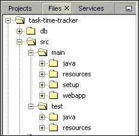

请注意，Maven 对源代码和测试布局都使用相同的目录结构。执行测试用例所需的所有资源都将在`src/test/resources`目录中找到。同样，部署所需的所有资源都将在`src/main/resources`目录中找到。 "约定优于配置"范式再次减少了开发人员需要做出的决策数量。只要遵循这个目录结构，基于 Maven 的测试将无需任何进一步的配置即可工作。如果您尚未拥有此目录结构，则需要通过右键单击所需的文件夹来手动创建它：

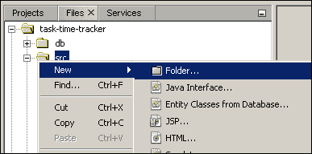

添加目录结构后，我们可以创建如下的单个文件：

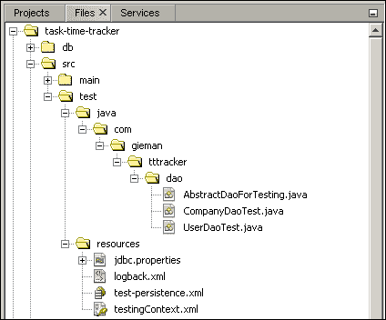

我们将首先使用 NetBeans 创建`jdbc.properties`文件。

## jdbc.properties 文件

右键单击`test/resources`文件夹，导航到**新建** | **其他**。将打开**新建文件**向导，在其中可以从**类别**和**属性文件**中选择**其他**，如下所示：

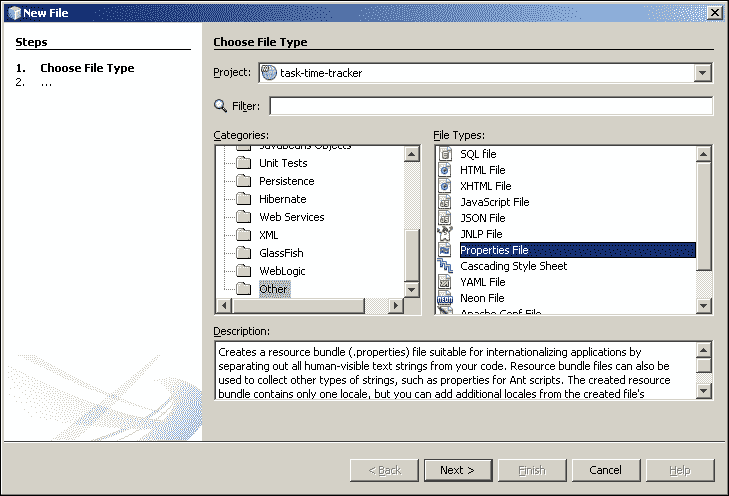

选择**下一步**，并输入`jdbc`作为文件名：

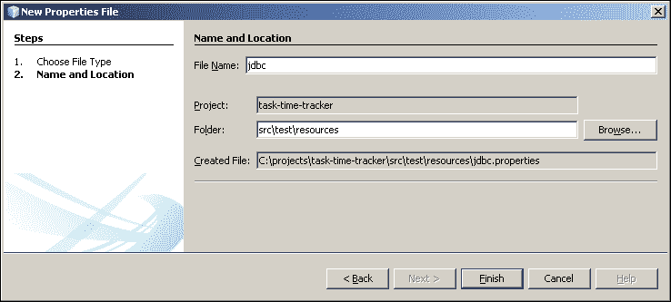

单击**完成**按钮创建`jdbc.properties`文件。NetBeans 将在编辑器中打开文件，您可以添加以下代码：

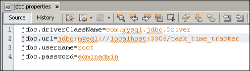

`jdbc.properties`文件用于定义数据库连接详细信息，Spring 将使用这些信息来配置我们的 DAO 层进行单元测试。企业项目通常有一个或多个专用的测试数据库，这些数据库预先填充了适用于所有测试场景的适当数据。我们将使用在第二章中生成和填充的数据库，*任务时间跟踪器数据库*。

## logback.xml 文件

通过使用**新建文件**向导**XML**类别创建此文件，如下所示：

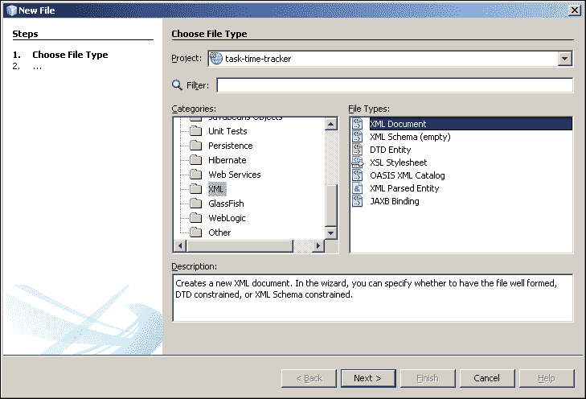

创建`logback.xml`文件后，您可以输入以下内容：

```java
<?xml version="1.0" encoding="UTF-8"?>
<configuration scan="true" scanPeriod="30 seconds" >
    <contextName>TaskTimeTracker</contextName>
    <appender name="STDOUT" class="ch.qos.logback.core.ConsoleAppender">
        <encoder>
            <pattern>%d{HH:mm:ss.SSS} [%thread] %-5level %logger{5} - %msg%n</pattern>
        </encoder>
    </appender>

    <logger name="com.gieman.tttracker" level="DEBUG" additivity="false">
        <appender-ref ref="STDOUT" />
    </logger>
    <logger name="com.gieman.tttracker.dao" level="DEBUG" additivity="false">
        <appender-ref ref="STDOUT" />
    </logger>
    <logger name="com.gieman.tttracker.domain" level="DEBUG" additivity="false">
        <appender-ref ref="STDOUT" />
    </logger>
    <logger name="com.gieman.tttracker.service" level="DEBUG" additivity="false">
        <appender-ref ref="STDOUT" />
    </logger>
    <logger name="com.gieman.tttracker.web" level="DEBUG" additivity="false">
        <appender-ref ref="STDOUT" />
    </logger>

    <root level="INFO">          
        <appender-ref ref="STDOUT" />
    </root>
</configuration>
```

对于熟悉 log4j 的人来说，logback 记录器定义的语法非常相似。我们将根日志级别设置为`INFO`，这将覆盖所有未明确定义的记录器（请注意，默认级别为`DEBUG`，但这通常会导致根级别的广泛记录）。每个名称与`com.gieman.tttracker`包匹配的单独记录器都设置为`DEBUG`级别。这种配置为我们提供了在包级别上灵活控制记录属性的能力。在生产环境中，我们通常会为所有记录器部署`WARN`级别以最小化记录。如果遇到问题，我们将有选择地在不同的包中启用记录以帮助识别任何问题。与 log4j 不同，由于 logback 的`scan="true" scanPeriod="30 seconds"`选项在`<configuration>`节点中，可以动态重新加载记录器属性。有关 logback 配置的更多信息，请参见：[`logback.qos.ch/manual/configuration.html`](http://logback.qos.ch/manual/configuration.html)。

## test-persistence.xml 文件

按照前一节中概述的**新建文件**步骤创建`test-persistence.xml`文件。输入以下持久化上下文定义：

```java
<?xml version="1.0" encoding="UTF-8"?>
<persistence version="2.1"   xsi:schemaLocation="http://java.sun.com/xml/ns/persistence http://java.sun.com/xml/ns/persistence/persistence_2_1.xsd">
  <persistence-unit name="tttPU" transaction-type="RESOURCE_LOCAL">
    <provider>org.eclipse.persistence.jpa.PersistenceProvider</provider>
    <class>com.gieman.tttracker.domain.Company</class>
    <class>com.gieman.tttracker.domain.Project</class>
    <class>com.gieman.tttracker.domain.Task</class>
    <class>com.gieman.tttracker.domain.TaskLog</class>
    <class>com.gieman.tttracker.domain.User</class>
    <exclude-unlisted-classes>true</exclude-unlisted-classes>
    <properties>
      <property name="eclipselink.logging.level" value="WARNING"/>
    </properties>
  </persistence-unit>
</persistence>
```

这个持久化单元定义与第三章中创建的定义略有不同，*使用 JPA 反向工程领域层*：

```java
<?xml version="1.0" encoding="UTF-8"?>
<persistence version="2.1"   xsi:schemaLocation="http://xmlns.jcp.org/xml/ns/persistence http://xmlns.jcp.org/xml/ns/persistence/persistence_2_1.xsd">
  <persistence-unit name="tttPU" transaction-type="JTA">
    <provider>org.eclipse.persistence.jpa.PersistenceProvider</provider>
    <jta-data-source>jdbc/tasktimetracker</jta-data-source>
    <exclude-unlisted-classes>false</exclude-unlisted-classes>
    <properties/>
  </persistence-unit>
</persistence>
```

请注意，测试`persistence-unit`的事务类型是`RESOURCE_LOCAL`，而不是`JTA`。我们的测试环境使用本地（由 Spring 管理的）事务管理器，而不是我们的 GlassFish 服务器容器提供的事务管理器（即`JTA`）。在两种情况下，`tttPU`持久化单元名称与`GenericDaoImpl`中的`EntityManager`字段的`@PersistenceContext` `unitName`注解匹配：

```java
@PersistenceContext(unitName = "tttPU")
protected EntityManager em;
```

第二个区别是类的发现方式。在测试期间，我们的域实体被明确列出，并排除任何未定义的类。这简化了处理，并确保仅加载测试所需的实体*而不扫描类路径*。这对于 Windows 用户来说是一个重要的问题；在某些 Windows 版本中，命令行语句的长度有限，因此，您可以使类路径参数的长度有限。使用类路径扫描，加载域实体进行测试可能无法正常工作，导致诸如以下的奇怪错误：

```java
org.springframework.dao.InvalidDataAccessApiUsageException: Object: com.tttracker.domain.Company[ idCompany=null ] is not a known entity type.; nested exception is java.lang.IllegalArgumentException: Object: com.tttracker.domain.Company[ idCompany=null ] is not a known entity type.
```

始终确保您的测试持久化 XML 定义包括应用程序中的所有域类。

# 介绍 Spring IoC 容器

现代 Spring 框架是一个基于世纪初的架构概念的广泛框架“堆栈”。Spring 框架最初是在 2002 年由*Rod Johnson*的*Expert One-on-One J2EE Design and Development*中首次引人注目。Spring 对**控制反转**（**IoC**）原则的实现，有时也被称为**依赖注入**（**DI**），是企业应用设计和开发的突破。Spring IoC 容器提供了一种简单的配置对象（JavaBeans）和通过构造函数参数、工厂方法、对象属性或 setter 方法注入依赖项的方式。我们已经在 DAO 层中看到了`@PersistenceContext`注解，该注解由 Spring 用于确定是否应将`EntityManager`对象注入`GenericDaoImpl`类中。可用的复杂配置选项使 Spring 框架成为企业开发的非常灵活的基础。

本书的范围超出了 Spring 框架配置的基础知识，这是我们项目需求所必需的。但是，我们建议您浏览有关 IoC 容器如何工作的详细描述，以增进对核心原则的了解。

## 探索 testingContext.xml 文件

这是 Spring 用来配置和加载 IoC bean 容器的主要配置文件。自从一开始，基于 XML 的配置一直是配置 Spring 应用程序的默认方式，但是在 Spring 3 框架中，可以使用基于 Java 的配置。这两种选项都可以实现相同的结果-一个完全配置的 Spring 容器。我们将使用 XML 方法，因为它不需要任何 Java 编码，而且更直观和简单。

### 注意

多年来已经有许多关于 Spring XML 配置的“复杂性”的文章。在 Java 1.5 之前和注解引入之前，可能会有这样的评论。配置文件对新用户来说既冗长又令人望而却步。但现在不再是这种情况。使用 XML 配置 Spring 容器现在是一个微不足道的过程。对于任何告诉你相反的人要小心！

`testingContext.xml`配置文件完全定义了测试 DAO 层所需的 Spring 环境。完整的文件清单如下：

```java
<?xml version="1.0" encoding="UTF-8"?>
<beans  

       xsi:schemaLocation="
       http://www.springframework.org/schema/beans http://www.springframework.org/schema/beans/spring-beans-3.0.xsd
       http://www.springframework.org/schema/context http://www.springframework.org/schema/context/spring-context-3.0.xsd
        http://www.springframework.org/schema/tx http://www.springframework.org/schema/tx/spring-tx-3.0.xsd">

    <bean id="propertyConfigurer"
          class="org.springframework.beans.factory.config.PropertyPlaceholderConfigurer"
          p:location="classpath:jdbc.properties" />

    <bean id="tttDataSource"
          class="org.springframework.jdbc.datasource.DriverManagerDataSource"
          p:driverClassName="${jdbc.driverClassName}"
          p:url="${jdbc.url}"
          p:username="${jdbc.username}"
          p:password="${jdbc.password}"/>

    <bean id="loadTimeWeaver" class="org.springframework.instrument.classloading.InstrumentationLoadTimeWeaver" />

    <bean id="jpaVendorAdapter" class="org.springframework.orm.jpa.vendor.EclipseLinkJpaVendorAdapter"
        p:showSql="true"
        p:databasePlatform="org.eclipse.persistence.platform.database.MySQLPlatform" />
    <bean id="entityManagerFactory" class="org.springframework.orm.jpa.LocalContainerEntityManagerFactoryBean"
        p:dataSource-ref="tttDataSource"
        p:jpaVendorAdapter-ref="jpaVendorAdapter"
        p:persistenceXmlLocation="test-persistence.xml"
    />

    <!-- Transaction manager for a single JPA EntityManagerFactory (alternative to JTA) -->
    <bean id="transactionManager" class="org.springframework.orm.jpa.JpaTransactionManager"
          p:dataSource-ref="tttDataSource" 
          p:entityManagerFactory-ref="entityManagerFactory"/>

    <!-- checks for annotated configured beans -->
    <context:annotation-config/>  

    <!-- Scan for Repository/Service annotations -->
    <context:component-scan base-package="com.gieman.tttracker.dao" />

    <!-- enable the configuration of transactional behavior based on annotations -->
    <tx:annotation-driven />

</beans>
```

让我们详细看看每个部分。

### Spring XML 命名空间

对于那些不熟悉 XML 的人，可以简单地忽略`xmlns`定义和模式位置 URL。将它们视为配置文件中提供验证条目能力的“快捷方式”或“限定符”。Spring 了解在加载 Spring 环境的上下文中`<tx:annotation-driven />`的含义。

每个 Spring 应用程序配置文件将具有多个命名空间声明，具体取决于应用程序所需的资源。除了命名空间之外，定义模式位置还将允许 NetBeans 提供有关配置选项的有用提示：

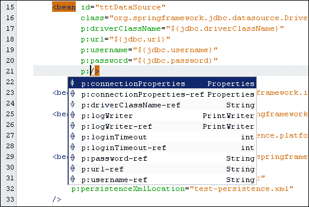

对于新手来说，不同命名空间的有效属性列表非常有用。

### 属性文件配置

以下 bean 加载`jdbc.properties`文件并使其在配置文件中可用：

```java
<bean id="propertyConfigurer"
    class="org.springframework.beans.factory.config.PropertyPlaceholderConfigurer"
    p:location="classpath:jdbc.properties" />
```

然后可以在`testingContext.xml`文件的任何地方使用`${}`语法来替换令牌为所需的`jdbc`属性。

### 创建 JDBC DataSource

DAO 测试需要连接到 MySQL 数据库。以下 Spring bean 定义实例化并提供了一个完全配置的 DataSource：

```java
<bean id="tttDataSource"
    class="org.springframework.jdbc.datasource.DriverManagerDataSource"
    p:driverClassName="${jdbc.driverClassName}"
    p:url="${jdbc.url}"
    p:username="${jdbc.username}"
    p:password="${jdbc.password}"
    />
```

占位符将自动设置为从`jdbc.properties`文件加载的属性：

```java
jdbc.driverClassName=com.mysql.jdbc.Driver
jdbc.url=jdbc:mysql://localhost:3306/task_time_tracker
jdbc.username=root
jdbc.password=adminadmin
```

这个非常简单的 Spring 配置片段可以替换许多等效的 Java 代码行，如果我们必须自己实现 DataSource 实例化。请注意，要更改任何数据库属性以进行不同的测试场景，或者例如，甚至将数据库服务器从 MySQL 更改为 Oracle 将是多么简单。这种灵活性使 Spring IoC 容器在企业使用中非常强大。

您应该注意`org.springframework.jdbc.datasource.DriverManagerDataSource`只应用于测试目的，不适用于生产环境。GlassFish 服务器将为生产使用提供连接池`DataSource`。

### 定义辅助 bean

`loadTimeWeaver`和`jpaVendorAdapter` bean 定义有助于配置用于加载持久性上下文的`entityManagerFactory` bean。请注意我们如何使用特定的 Spring bean 类来标识数据库平台（MySQL）和 JPA 实现（EclipseLink）：

```java
<bean id="jpaVendorAdapter" 
class="org.springframework.orm.jpa.vendor.EclipseLinkJpaVendorAdapter"
  p:showSql="true"        
  p:databasePlatform="org.eclipse.persistence.platform.database.MySQLPlatform" />
```

Spring 提供了大量的数据库和 JPA 实现，可以在 NetBeans 中使用自动完成时看到（在 NetBeans 中使用*Ctrl* +空格组合键触发自动完成选项）：

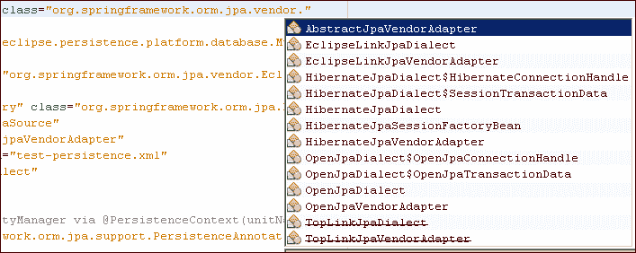

辅助 bean 用于定义特定于实现的属性。非常容易为不同的企业环境切换实现策略。例如，开发人员可以在本地环境中使用运行在自己环境上的 MySQL 数据库进行开发。生产企业服务器可能使用在不同物理服务器上运行的 Oracle 数据库。只需要对 Spring XML 配置文件进行非常小的更改，就可以为应用程序环境实现这些差异。

### 定义 EntityManagerFactory 类

这个 Spring bean 定义了`EntityManagerFactory`类，用于创建和注入`EntityManager`实例到`GenericDaoImpl`类中：

```java
<bean id="entityManagerFactory" 
  class="org.springframework.orm.jpa.LocalContainerEntityManagerFactoryBean"
  p:dataSource-ref="tttDataSource"
  p:jpaVendorAdapter-ref="jpaVendorAdapter"
  p:persistenceXmlLocation="test-persistence.xml"
/>
```

这个定义引用了已经配置的`tttDataSource`和`jpaVendorAdapter` bean，以及`test-persistence.xml`持久化上下文定义文件。再一次，Spring 在后台做了大量工作，创建和配置`EntityManager`实例，并使其可以在我们的代码中使用。

### 配置事务管理器

用于管理事务的 Spring bean 定义如下：

```java
<bean id="transactionManager" 
  class="org.springframework.orm.jpa.JpaTransactionManager"
  p:dataSource-ref="tttDataSource" 
  p:entityManagerFactory-ref="entityManagerFactory"/>
```

这个 bean 将`tttDataSource`和`entityManagerFactory`实例连接在一起，以启用我们应用程序中的事务行为。这种行为适用于所有带有`@Transactional`注解的类；在我们目前的情况下，这适用于所有的 DAO 对象。当在配置文件中包含以下行时，Spring 会扫描这个注解并为每个带有注解的方法应用事务包装：

```java
<tx:annotation-driven />
```

哪些类被扫描以寻找`@Transactional`注解？以下行定义了 Spring 应该扫描`com.gieman.tttracker.dao`包：

```java
<context:component-scan base-package="com.gieman.tttracker.dao"/>
```

### 自动装配 bean

自动装配是 Spring 术语，用于自动将资源注入托管的 bean 中。以下行使能了拥有`@Autowired`注解的 bean 的自动装配：

```java
<context:annotation-config/>
```

我们的代码中还没有任何自动装配的注解；下一节将介绍如何使用这个注解。

### 感谢管道！

当 Spring 容器加载 Spring 配置文件时，将在后台进行大量工作，配置和连接我们应用程序所需的许多支持类。这些繁琐且常常容易出错的“管道”代码已经为我们完成。我们再也不需要提交事务、打开数据库连接或关闭 JDBC 资源。这些低级操作将由 Spring 框架非常优雅地处理。

### 注意

作为企业应用程序开发人员，我们可以并且应该将大部分时间和精力集中在核心应用程序关注点上：业务逻辑、用户界面、需求、测试，当然还有我们的客户。Spring 确保我们可以专注于这些任务。

## 为测试启用 Maven 环境

Maven 构建过程包括执行测试套件的功能。现在我们需要将这个功能添加到`pom.xml`文件中。现有文件的所需更改在以下代码片段中突出显示：

```java
<?xml version="1.0" encoding="UTF-8"?>
<project   xsi:schemaLocation="http://maven.apache.org/POM/4.0.0 http://maven.apache.org/xsd/maven-4.0.0.xsd">
    <modelVersion>4.0.0</modelVersion>

    <groupId>com.gieman</groupId>
    <artifactId>task-time-tracker</artifactId>
    <version>1.0</version>
    <packaging>war</packaging>

    <name>task-time-tracker</name>

    <properties>
        <endorsed.dir>${project.build.directory}/endorsed</endorsed.dir>
        <project.build.sourceEncoding>UTF-8</project.build.sourceEncoding>
        <spring.version>3.2.4.RELEASE</spring.version>
        <logback.version>1.0.13</logback.version>
    </properties>

    <dependencies>
        <dependency>
            <groupId>org.eclipse.persistence</groupId>
            <artifactId>javax.persistence</artifactId>
            <version>2.1.0-SNAPSHOT</version>
            <scope>provided</scope>
        </dependency>
        <dependency>
            <groupId>org.eclipse.persistence</groupId>
            <artifactId>eclipselink</artifactId>
            <version>2.5.0-SNAPSHOT</version>
            <scope>provided</scope>
        </dependency>        
        <dependency>
            <groupId>org.eclipse.persistence</groupId>
            <artifactId>org.eclipse.persistence.jpa.modelgen.processor</artifactId>
            <version>2.5.0-SNAPSHOT</version>
            <scope>provided</scope>
        </dependency>
        <dependency>
            <groupId>javax</groupId>
            <artifactId>javaee-web-api</artifactId>
            <version>7.0</version>
            <scope>provided</scope>
        </dependency>
        <dependency>
            <groupId>ch.qos.logback</groupId>
            <artifactId>logback-classic</artifactId>
            <version>${logback.version}</version>
        </dependency>    
 <dependency>
 <groupId>junit</groupId>
 <artifactId>junit</artifactId>
 <version>4.11</version>
 <scope>test</scope>
 </dependency> 
 <dependency>
 <groupId>mysql</groupId>
 <artifactId>mysql-connector-java</artifactId>
 <version>5.1.26</version>
 <scope>provided</scope>
 </dependency> 
        <dependency>
            <groupId>org.springframework</groupId>
            <artifactId>spring-context</artifactId>
            <version>${spring.version}</version>
        </dependency>
        <dependency>
            <groupId>org.springframework</groupId>
            <artifactId>spring-context-support</artifactId>
            <version>${spring.version}</version>
        </dependency>
        <dependency>
            <groupId>org.springframework</groupId>
            <artifactId>spring-tx</artifactId>
            <version>${spring.version}</version>
        </dependency>
        <dependency>
            <groupId>org.springframework</groupId>
            <artifactId>spring-jdbc</artifactId>
            <version>${spring.version}</version>
        </dependency>
        <dependency>
            <groupId>org.springframework</groupId>
            <artifactId>spring-orm</artifactId>
            <version>${spring.version}</version>
        </dependency>
        <dependency>
            <groupId>org.springframework</groupId>
            <artifactId>spring-instrument</artifactId>
            <version>${spring.version}</version>
        </dependency>
        <dependency>
            <groupId>org.springframework</groupId>
            <artifactId>spring-webmvc</artifactId>
            <version>${spring.version}</version>
        </dependency>
        <dependency>
            <groupId>org.springframework</groupId>
            <artifactId>spring-test</artifactId>
            <version>${spring.version}</version>
   <scope>test</scope>
        </dependency>

    </dependencies>

    <build>
        <plugins>
            <plugin>
                <groupId>org.apache.maven.plugins</groupId>
                <artifactId>maven-compiler-plugin</artifactId>
                <version>3.1</version>
                <configuration>
                    <source>1.7</source>
                    <target>1.7</target>
                    <compilerArguments>
                        <endorseddirs>${endorsed.dir}</endorseddirs>
                    </compilerArguments>
                </configuration>
            </plugin>
            <plugin>
                <groupId>org.apache.maven.plugins</groupId>
                <artifactId>maven-war-plugin</artifactId>
                <version>2.3</version>
                <configuration>
                    <warName>${project.build.finalName}</warName>
                    <failOnMissingWebXml>false</failOnMissingWebXml>
                </configuration>
            </plugin>
            <plugin>
                <groupId>org.apache.maven.plugins</groupId>
                <artifactId>maven-dependency-plugin</artifactId>
                <version>2.6</version>
                <executions>
                    <execution>
                        <id>copy-endorsed</id>
                        <phase>validate</phase>
                        <goals>
                            <goal>copy</goal>
                        </goals>
                        <configuration>
                            <outputDirectory>${endorsed.dir}</outputDirectory>
                            <silent>true</silent>
                            <artifactItems>
                                <artifactItem>
                                    <groupId>javax</groupId>
                                    <artifactId>javaee-endorsed-api</artifactId>
                                    <version>7.0</version>
                                    <type>jar</type>
                                </artifactItem>
                            </artifactItems>
                        </configuration>
                    </execution>
                    <execution>
                        <id>copy-all-dependencies</id>
                        <phase>compile</phase>
                        <goals>
                            <goal>copy-dependencies</goal>
                        </goals>
                        <configuration>
                            <outputDirectory>${project.build.directory}/lib</outputDirectory>
                            <includeScope>compile</includeScope>
                        </configuration>                        
                    </execution>                                                           

                </executions>
            </plugin>
 <plugin>
 <groupId>org.apache.maven.plugins</groupId>
 <artifactId>maven-surefire-plugin</artifactId>
 <version>2.14.1</version>
 <configuration>
 <skipTests>false</skipTests>
 <includes>
 <include>**/dao/*Test.java</include>
 </includes>
 <argLine>-javaagent:target/lib/spring-instrument-${spring.version}.jar</argLine>
 </configuration>
 </plugin> 

        </plugins>
    </build>
    <repositories>
        <repository>
            <url>http://download.eclipse.org/rt/eclipselink/maven.repo/</url>
            <id>eclipselink</id>
            <layout>default</layout>
            <name>Repository for library EclipseLink (JPA 2.1)</name>
        </repository>
    </repositories>
</project>
```

前两个更改添加了`mysql-connector-java`和`junit`依赖项。没有这些依赖项，我们将无法连接到数据库或编写测试用例。这些依赖项将下载适当的 Java 库，以包含到我们的项目中。

最重要的设置在执行实际工作的 Maven 插件中。添加`maven-surefire-plugin`将允许基于`main/src/test`目录结构的测试用例执行。这清楚地将测试类与我们的应用程序类分开。这个插件的主要配置属性包括：

+   `<skipTests>`：此属性可以是`true`（禁用测试）或`false`（启用测试）。

+   `<includes>`：此属性在测试期间包含文件集的列表。设置`<include>**/dao/*Test.java</include>`指定应加载并包含在测试过程中以`Test.java`结尾的任何`dao`子目录中的所有类。您可以指定任意数量的文件集。

+   `<argLine>-javaagent:target/lib/spring-instrument-${spring.version}.jar</argLine>`：此属性用于配置测试 JVM 的 Java 代理，并且 Spring 需要它来进行类的加载时编织，这超出了本文的讨论范围。

现在我们已经配置了 Spring 和 Maven 测试环境，可以开始编写测试用例了。

# 定义测试用例超类

第一步是创建一个所有 DAO 测试用例都将继承的超类。这个抽象类看起来像下面的代码片段：

```java
package com.gieman.tttracker.dao;

import org.slf4j.Logger;
import org.slf4j.LoggerFactory;

import org.springframework.beans.factory.annotation.Autowired;
import org.springframework.test.context.ContextConfiguration;
import org.springframework.test.context.junit4.AbstractTransactionalJUnit4SpringContextTests;

@ContextConfiguration("/testingContext.xml")
public abstract class AbstractDaoForTesting extends AbstractTransactionalJUnit4SpringContextTests {

    protected final Logger logger = LoggerFactory.getLogger(this.getClass());
    @Autowired(required = true)
    protected CompanyDao companyDao;
    @Autowired(required = true)
    protected ProjectDao projectDao;
    @Autowired(required = true)
    protected TaskDao taskDao;
    @Autowired(required = true)
    protected UserDao userDao;
    @Autowired(required = true)
    protected TaskLogDao taskLogDao;
}
```

`AbstractDaoForTesting`类被标记为抽象类，因此不能直接实例化。它提供了对所有子类可访问的成员变量，从而消除了在子类中复制代码的需要。因此，每个子类都将可以访问 DAO 实例以及 SLF4J `logger`。有两个新的 Spring 注解：

+   `@ContextConfiguration`：此注解定义了用于加载 bean 容器的 Spring 应用程序上下文。`testingContext.xml`文件在前几节中已经详细介绍过。

+   `@Autowired`：这个注解告诉 Spring 容器应该将匹配类型的受管 bean 注入到类中。例如，`CompanyDao companyDao`的定义将导致 Spring 查询容器中类型为`CompanyDao`的对象。这种类型只有一个对象：在扫描`com.gieman.tttracker.dao`包时 Spring 发现并配置的`CompanyDaoImpl`类，通过`testingContext.xml`文件中的`<context:component-scan base-package="com.gieman.tttracker.dao"/>`条目。

最后一个重要的事情是`AbstractDaoForTesting`类扩展了 Spring 的`AbstractTransactionalJUnit4SpringContextTests`类。除了类名很长之外，这个类在每个测试方法结束时提供透明的事务回滚。这意味着任何 DAO 测试操作（包括插入、更新或删除）结束时数据库状态将与测试开始时相同。如果不需要这种行为，应该扩展`AbstractJUnit4SpringContextTests`。在这种情况下，测试数据库操作可以在测试运行后进行检查和确认。还可以在使用`AbstractTransactionalJUnit4SpringContextTests`时标记单个方法为`@Rollback(false)`以提交更改。

现在让我们为`CompanyDao`操作编写我们的第一个测试用例。

# 定义 CompanyDao 测试用例

每个`CompanyDao`方法应该至少有一个测试方法。我们将为每个实现的`CompanyDao`方法包含一个测试方法。在企业应用程序中，我们期望覆盖的场景要比下面代码片段中识别的要多得多。

我们还包括了最少的日志记录，足以在运行测试用例时拆分输出。您可能希望添加更多日志以帮助分析结果。测试代码假定`ttt_company`表具有适当的数据。在第二章中，*任务时间跟踪器数据库*，我们添加了三行数据，以便知道有可用数据。如果没有具有一致测试数据的数据库，需要进行额外的检查。文件列表如下：

```java
package com.gieman.tttracker.dao;

import com.gieman.tttracker.domain.Company;
import java.util.List;
import static org.junit.Assert.assertTrue;
import org.junit.Test;

public class CompanyDaoTest extends AbstractDaoForTesting {

    public CompanyDaoTest(){}

    @Test
    public void testFind() throws Exception {

        logger.debug("\nSTARTED testFind()\n");
        List<Company> allItems = companyDao.findAll();

        assertTrue(allItems.size() > 0);

        // get the first item in the list
        Company c1 = allItems.get(0);

        int id = c1.getId();

        Company c2 = companyDao.find(id);

        assertTrue(c1.equals(c2));
        logger.debug("\nFINISHED testFind()\n");
    }

    @Test
    public void testFindAll() throws Exception {

        logger.debug("\nSTARTED testFindAll()\n");
        int rowCount = countRowsInTable("ttt_company");

        if(rowCount > 0){

            List<Company> allItems = companyDao.findAll();
            assertTrue("Company.findAll list not equal to row count of table ttt_company", rowCount == allItems.size());

        } else {
            throw new IllegalStateException("INVALID TESTING SCENARIO: Company table is empty");
        }
        logger.debug("\nFINISHED testFindAll()\n");
    }

    @Test
    public void testPersist() throws Exception {

        logger.debug("\nSTARTED testPersist()\n");
        Company c = new Company();
        final String NEW_NAME = "Persist Test Company name";
        c.setCompanyName(NEW_NAME);

        companyDao.persist(c);

        assertTrue(c.getId() != null);
        assertTrue(c.getCompanyName().equals(NEW_NAME));

        logger.debug("\nFINISHED testPersist()\n");
    }

    @Test
    public void testMerge() throws Exception {

        logger.debug("\nSTARTED testMerge()\n");
        final String NEW_NAME = "Merge Test Company New Name";

        Company c = companyDao.findAll().get(0);
        c.setCompanyName(NEW_NAME);

        c = companyDao.merge(c);

        assertTrue(c.getCompanyName().equals(NEW_NAME));

        logger.debug("\nFINISHED testMerge()\n");

    }

    @Test
    public void testRemove() throws Exception {

        logger.debug("\nSTARTED testRemove()\n");
        Company c = companyDao.findAll().get(0);

        companyDao.remove(c);

        List<Company> allItems = companyDao.findAll();

        assertTrue("Deleted company may not be in findAll List", !allItems.contains(c) );

        logger.debug("\nFINISHED testRemove()\n");
    }
}
```

# 使用 Maven 运行 JUnit 测试用例

通过单击工具栏上的**Clean and Build Project (task-time-tracker)**图标，`pom.xml`配置文件将自动使用`<skipTests>false</skipTests>`运行测试用例：

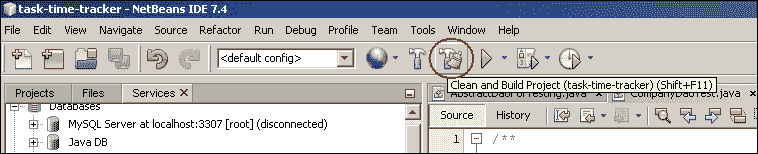

还可以通过导航到**Run** | **Test Project (task-time-tracker)**来仅运行项目的测试阶段：

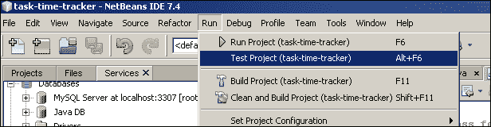

现在可以在**Output - task-time-tracker**面板中检查测试过程的结果。请注意，如果最小化了输出面板，则可能需要将输出面板停靠到 IDE 底部，如下面的屏幕截图所示（最小化面板通常位于 NetBeans IDE 的左下角）。在测试过程开始时，会显示`[surefire:test]`插件输出。有许多行输出用于配置 Spring，连接到数据库和加载持久化上下文：

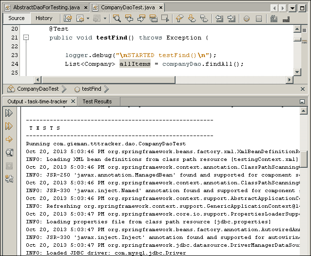

我们将很快详细检查关键的测试输出。滚动输出，直到到达测试部分的末尾：

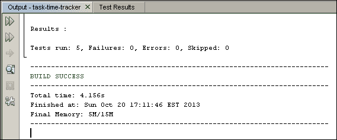

总共执行了五个测试，没有错误，非常好的开始！

## 运行 CompanyDaoTest.java 文件

您可以通过右键单击编辑器中显示的文件并选择**Test File**选项来执行单个测试用例文件：

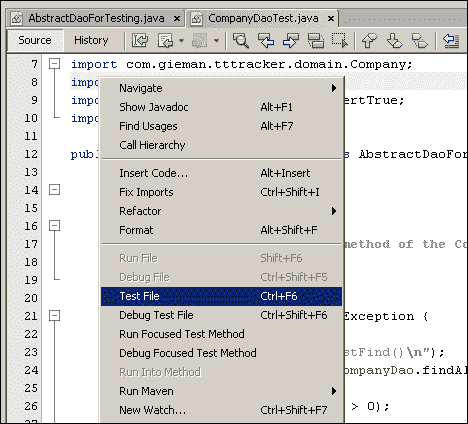

这将执行文件的测试用例，产生与之前相同的测试输出，并在**Test Results**面板中呈现结果。该面板应该出现在文件编辑器下方，但可能没有停靠（可能在 NetBeans IDE 底部漂浮；您可以根据需要更改位置和停靠）。然后可以检查单个文件的测试结果：

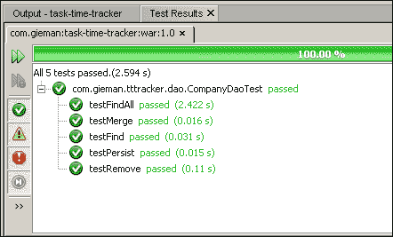

单个测试文件的执行是调试和开发代码的实用快速方式。在本章的其余部分，我们将继续执行和检查单个文件。

现在让我们详细检查每个测试用例的结果。

### 注意

在以下所有测试输出中，已删除了 SLF4J 特定的消息。这将包括时间戳，线程和会话信息。我们只关注生成的 SQL。

## CompanyDaoTests.testMerge 测试用例的结果

这个测试用例的输出是：

```java
STARTED testMerge()
SELECT id_company, company_name FROM ttt_company ORDER BY company_name ASC
FINISHED testMerge()
```

`merge`调用用于更新持久实体。`testMerge`方法非常简单：

```java
final String NEW_NAME = "Merge Test Company New Name";
Company c = companyDao.findAll().get(0);
c.setCompanyName(NEW_NAME);
c = companyDao.merge(c);
assertTrue(c.getCompanyName().equals(NEW_NAME));
```

我们找到第一个`Company`实体（`findAll`返回的列表中的第一项），然后将公司的名称更新为`NEW_NAME`值。然后，`companyDao.merge`调用会更新持久化上下文中的`Company`实体状态。这是使用`assertTrue()`测试来测试的。

请注意，测试输出只有**一个**SQL 语句：

```java
SELECT id_company, company_name FROM ttt_company ORDER BY company_name ASC
```

这个输出对应于`findAll`方法的调用。请注意，没有执行 SQL 更新语句！这可能看起来很奇怪，因为实体管理器的`merge`调用应该导致针对数据库执行更新语句。但是，JPA 实现**不**要求立即执行这样的语句，并且可能在可能的情况下缓存语句，以进行性能和优化。缓存的（或排队的）语句只有在调用显式的`commit`时才会执行。在我们的例子中，Spring 在`testMerge`方法返回后立即执行`rollback`（请记住，由于我们的`AbstractTransactionalJUnit4SpringContextTests`扩展，我们正在运行事务性测试用例），因此持久化上下文永远不需要执行更新语句。

我们可以通过对`GenericDaoImpl`类进行轻微更改来强制刷新到数据库。

```java
@Override
@Transactional(readOnly = false, propagation = Propagation.REQUIRED)
public T merge(T o) {
  o = em.merge(o);
  em.flush();
  return o;
}
```

`em.flush()`方法导致**立即**执行更新语句；实体管理器被刷新以处理所有挂起的更改。更改`GenericDaoImpl`类中的此代码并再次执行测试用例将产生以下测试输出：

```java
SELECT id_company, company_name FROM ttt_company ORDER BY company_name ASC
UPDATE ttt_company SET company_name = ? WHERE (id_company = ?)
  bind => [Merge Test Company New Name, 2]
```

现在更新语句出现了。如果我们现在在执行测试用例后直接检查数据库，我们会发现：

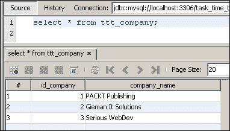

正如预期的那样，Spring 在`testMerge`方法调用结束时回滚了数据库，并且第一条记录的公司名称没有改变。

### 注意

在企业应用程序中，建议不要显式调用`em.flush()`，并允许 JPA 实现根据其事务行为优化语句。然而，可能存在需要立即刷新的情况，但这些情况很少见。

## CompanyDaoTests.testFindAll 测试用例的结果

这个测试用例的输出是：

```java
STARTED testFindAll()
SELECT id_company, company_name FROM ttt_company ORDER BY company_name ASC
FINISHED testFindAll()
```

即使`testMerge`方法使用`findAll`方法检索列表中的第一项，我们应该始终包括一个单独的`findAll`测试方法，以将结果集的大小与数据库表进行比较。使用 Spring 辅助方法`countRowsInTable`时很容易实现这一点：

```java
int rowCount = countRowsInTable("ttt_company");
```

然后我们可以使用`assertTrue`语句将`findAll`结果列表的大小与`rowCount`进行比较：

```java
assertTrue("Company.findAll list not equal to row count of table ttt_company", rowCount == allItems.size());
```

注意`assertTrue`语句的使用；如果断言为`false`，则显示消息。我们可以通过稍微修改断言来测试语句，使其失败：

```java
assertTrue("Company.findAll list not equal to row count of table ttt_company", rowCount+1 == allItems.size());
```

现在它将失败，并在执行测试用例时产生以下输出：

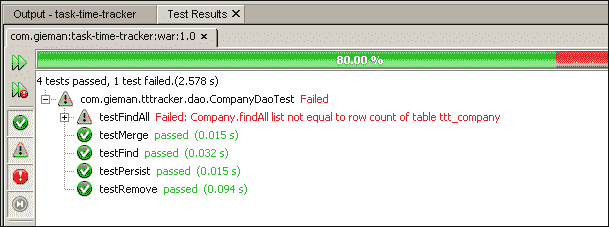

## CompanyDaoTests.testFind 测试用例的结果

这个测试用例的输出是：

```java
STARTED testFind()
SELECT id_company, company_name FROM ttt_company ORDER BY company_name ASC
FINISHED testFind()
```

这对于新接触 JPA 的人来说可能有点令人惊讶。`SELECT`语句是从代码中执行的：

```java
List<Company> allItems = companyDao.findAll();
```

但是在使用`id`属性调用`find`方法时，预期的`SELECT`语句在哪里呢？

```java
int id = c1.getId(); // find ID of first item in list
Company c2 = companyDao.find(id);
```

JPA 不需要使用主键语句在数据库上执行`SELECT`语句，因为具有所需 ID 的实体已经在持久化上下文中加载。由于`findAll`方法的结果，将加载三个具有 ID 为 1、2 和 3 的实体。当要求使用列表中第一项的 ID 查找实体时，JPA 将返回已在持久化上下文中加载的具有匹配 ID 的实体，避免执行数据库选择语句的需要。

这通常是理解 JPA 管理应用程序行为的一个陷阱。当实体加载到持久化上下文中时，它将一直保留在那里，直到过期。构成“过期”的定义将取决于实现和缓存属性。可能小数据集永远不会过期；在我们的 Company 示例中，只有少量记录，这很可能是这种情况。例如，直接在底层表上执行更新语句，例如更改第一条记录的公司名称，可能永远不会在 JPA 持久化上下文中反映出来，因为持久化上下文实体永远不会被刷新。

### 注意

如果企业应用程序期望从多个来源进行数据修改（例如，通过存储过程或通过不同实体管理器的 web 服务调用），则需要一种缓存策略来使过期的实体失效。JPA 不会自动从数据库刷新实体状态，并且会假定持久化上下文是管理持久化数据的唯一机制。EclipseLink 提供了几个缓存注解来解决这个问题。可以在这里找到一个很好的指南：[`wiki.eclipse.org/EclipseLink/Examples/JPA/Caching`](http://wiki.eclipse.org/EclipseLink/Examples/JPA/Caching)。

## CompanyDaoTests.testPersist 测试用例的结果

由于上一章的练习，我们对`GenericDaoImpl.persist`方法进行了一些小的更改。`GenericDaoImpl`实现中修改后的`persist`方法是：

```java
em.persist(o);

em.flush(); 

if (o instanceof EntityItem) {
  EntityItem<ID> item = (EntityItem<ID>) o;
  ID id = item.getId();
  logger.info("The " + o.getClass().getName() + " record with ID=" + id + " has been inserted");
}
```

在`em.persist()`方法之后，您会注意到`GenericDaoImpl`中的`em.flush()`方法。如果没有将此刷新到数据库，我们无法保证新的`Company`实体上已设置有效的主键。这个测试案例的输出是：

```java
STARTED testPersist()
INSERT INTO ttt_company (company_name) VALUES (?)
  bind => [Persist Test Company name]
SELECT LAST_INSERT_ID()
The com.gieman.tttracker.domain.Company record with ID=4 has been inserted
FINISHED testPersist()
```

请注意，日志输出了新生成的主键值`4`。当 JPA 使用`SELECT LAST_INSERT_ID()`语句查询 MySQL 时，会检索到这个值。事实上，从`GenericDaoImpl`中删除`em.flush()`方法并执行测试案例将导致以下输出：

```java
STARTED testPersist()
The com.gieman.tttracker.domain.Company record with ID=null has been inserted
```

断言`assertTrue(c.getId() != null)`将失败，我们甚至不会显示`FINISHED testPersist()`消息。我们的测试案例在调试消息到达之前失败。

我们再次看到 JPA 优化的作用。没有`em.flush()`方法，JPA 将等到事务提交后才执行数据库中的任何更改。结果是，主键可能不会按预期设置为同一事务中新创建的实体对象的任何后续代码。这是对不谨慎开发人员的另一个陷阱，`persist`方法确定了实体管理器`flush()`到数据库可能需要的唯一情况。

## CompanyDaoTests.testRemove 测试案例的结果

这可能是迄今为止最有趣的测试案例。输出是：

```java
STARTED testRemove()

SELECT id_company, company_name FROM ttt_company ORDER BY company_name ASC
SELECT id_project, project_name, id_company FROM ttt_project WHERE (id_company = ?)
  bind => [2]
SELECT id_task, task_name, id_project FROM ttt_task WHERE (id_project = ?)
  bind => [4]
SELECT id_task, task_name, id_project FROM ttt_task WHERE (id_project = ?)
  bind => [5]
SELECT id_task, task_name, id_project FROM ttt_task WHERE (id_project = ?)
  bind => [6]
The com.gieman.tttracker.domain.Company record with ID=2 has been deleted
DELETE FROM ttt_task WHERE (id_task = ?)
  bind => [10]
DELETE FROM ttt_task WHERE (id_task = ?)
  bind => [12]
DELETE FROM ttt_task WHERE (id_task = ?)
  bind => [11]
DELETE FROM ttt_task WHERE (id_task = ?)
  bind => [13]
DELETE FROM ttt_project WHERE (id_project = ?)
  bind => [4]
DELETE FROM ttt_project WHERE (id_project = ?)
  bind => [6]
DELETE FROM ttt_project WHERE (id_project = ?)
  bind => [5]
DELETE FROM ttt_company WHERE (id_company = ?)
  bind => [2]
SELECT id_company, company_name FROM ttt_company ORDER BY company_name ASC

FINISHED testRemove()
```

第一个`SELECT`语句是为了找到列表中的第一个公司而执行的。

```java
Company c = companyDao.findAll().get(0);
```

第二个`SELECT`语句可能不那么明显：

```java
SELECT id_project, project_name, id_company FROM ttt_project WHERE (id_company = ?)
  bind => [2]
```

为什么删除公司会导致对`ttt_project`表的`SELECT`语句？原因是每个`Company`实体可能有一个或多个相关的`Projects`实体，如`Company`类定义中所定义的：

```java
    @OneToMany(cascade = CascadeType.ALL, mappedBy = "company")
    private List<Project> projects;
```

JPA 了解到删除公司需要检查`ttt_project`表，以查看是否有任何依赖的 Projects。在`@OneToMany`注释中，`cascade = CascadeType.ALL`属性定义了删除公司时的行为；更改应该级联到任何依赖实体。在这个例子中，删除公司记录将需要删除所有相关的项目记录。每个`Project`实体依次拥有`Task`实体的集合，如`Project`类定义中所定义的：

```java
    @OneToMany(cascade = CascadeType.ALL, mappedBy = "project")
    private List<Task> tasks;
```

删除`Company`实体的结果具有深远的影响，因为所有相关的 Projects 及其相关的 Tasks 都从底层表中删除。在测试输出中级联的`DELETE`语句的结果是最终删除公司本身。这可能不适合企业应用程序的行为；事实上，通常**永远**不会在没有广泛检查以确保数据完整性的情况下实施这样的级联删除。在`Company`类中级联注释的简单更改将确保不会传播删除：

```java
@OneToMany(cascade = {CascadeType.MERGE, CascadeType.PERSIST}, mappedBy ="company")
private List<Project> projects;
```

现在，只有对`Company`实体的`MERGE`和`PERSIST`操作将级联到相关的`Project`实体。在进行此更改后再次运行测试案例将导致：

```java
Internal Exception: com.mysql.jdbc.exceptions.jdbc4.MySQLIntegrityConstraintViolationException: Cannot delete or update a parent row: a foreign key constraint fails (`task_time_tracker`.`ttt_project`, CONSTRAINT `ttt_project_ibfk_1` FOREIGN KEY (`id_company`) REFERENCES `ttt_company` (`id_company`))
```

由于未包括`REMOVE`的级联类型，JPA 不会检查`ttt_project`表中的相关行，并尝试在`ttt_company`表上执行`DELETE`语句。这将失败，因为`ttt_project`表上有相关记录。现在只有在没有相关的`Project`实体时（`projects`字段是空列表）才能删除`Company`实体。

### 注意

按照本节中概述的更改`CascadeType`会向 DAO 层添加**业务逻辑**。您将不再能够通过持久性上下文执行某些操作。然而，可能存在一种合法情况，您**确实**希望对`Company`实体进行级联删除，这将不再可能。`CascadeType.ALL`是最灵活的选项，允许所有可能的情况。删除策略等业务逻辑应该在服务层中实现，这是下一章的主题。

我们将继续使用`cascade = CascadeType.ALL`属性，并允许 JPA 管理的删除进行传播。限制这些操作的业务逻辑将在服务层中实现。

# JPA 陷阱

有一些值得特别研究的 JPA 陷阱。我们将从创建以下测试用例开始：

```java
package com.gieman.tttracker.dao;

import com.gieman.tttracker.domain.Company;
import com.gieman.tttracker.domain.Project;
import com.gieman.tttracker.domain.User;
import static org.junit.Assert.assertTrue;
import org.junit.Test;

public class JpaTrapTest extends AbstractDaoForTesting {

    @Test
    public void testManyToOne() throws Exception {

        logger.debug("\nSTARTED testManyToOne()\n");

        Company c = companyDao.findAll().get(0);
        Company c2 = companyDao.findAll().get(1);

        Project p = c.getProjects().get(0);

        p.setCompany(c2);
        p = projectDao.merge(p);

        assertTrue("Original company still has project in its collection!",
                !c.getProjects().contains(p));
        assertTrue("Newly assigned company does not have project in its collection",
                c2.getProjects().contains(p));

        logger.debug("\nFINISHED testManyToOne()\n");

    }

    @Test
    public void testFindByUsernamePassword() throws Exception {

        logger.debug("\nSTARTED testFindByUsernamePassword()\n");

        // find by username/password combination
        User user = userDao.findByUsernamePassword("bjones", "admin");

        assertTrue("Unable to find valid user with correct username/password combination", 
                user != null);

        user = userDao.findByUsernamePassword("bjones", "ADMIN");

        assertTrue("User found with invalid password", 
                user == null); 

        logger.debug("\nFINISHED testFindByUsernamePassword()\n");
    }
}
```

运行此测试用例可能会让您感到惊讶：

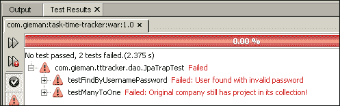

第一个失败来自`userDao.findByUsernamePassword`语句，该语句使用大写密码：

```java
user = userDao.findByUsernamePassword("bjones", "ADMIN");
```

为什么会找到具有明显不正确密码的用户？原因非常简单，对于不谨慎的开发人员来说是一个陷阱。大多数数据库在匹配文本字段时默认是不区分大小写的。在这种情况下，大写的`ADMIN`将与密码字段中的小写`admin`匹配。这并不是我们在检查密码时想要的！描述此行为的数据库术语是排序规则；我们需要修改密码列以使用区分大小写的排序规则。这可以通过以下 SQL 命令在 MySQL 中实现：

```java
ALTER TABLE ttt_user MODIFY
    password VARCHAR(100)
      COLLATE latin1_general_cs;
```

其他数据库将具有类似的语义。这将使密码字段的排序规则变为区分大小写（请注意在`latin1_general_cs`中附加的`_cs`）。运行测试用例现在将导致对区分大小写密码检查的预期行为：

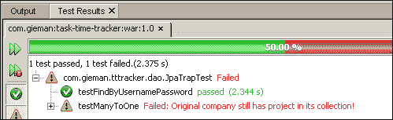

`testManyToOne`失败是另一个有趣的案例。在这个测试用例中，我们正在将项目重新分配给另一家公司。`p.setCompany(c2);`行将分配的公司更改为列表中的第二家公司。我们期望在对项目调用`merge`方法后，`c2`公司的项目集合将包含新分配的项目。换句话说，以下代码行应该等于`true`：

```java
c2.getProjects().contains(p)
```

同样，旧公司不应再包含新分配的项目，因此应为`false`：

```java
c.getProjects().contains(p)
```

这显然不是这种情况，并且识别了对 JPA 新手的陷阱。

尽管持久性上下文使用`@OneToMany`和`@ManyToOne`理解实体之间的关系，但在涉及集合时，Java 表示关系需要由开发人员处理。所需的简单更改如下：

```java
p.setCompany(c2);
p = projectDao.merge(p);

c.getProjects().remove(p);
c2.getProjects().add(p);

```

当执行`projectDao.merge(p)`行时，持久性上下文无法知道**原始**父公司（如果有的话；这可能是一个新插入的项目）。持久性上下文中的原始`Company`实体仍然有一组分配的项目。在持久性上下文中，`Company`实体的生命周期内，此集合永远不会被更新。额外的两行代码用于从原始公司的项目列表中删除项目（使用`remove`），并且我们添加（使用`add`）项目到新公司，以确保持久性上下文实体更新到正确的状态。

# 练习

1. 为`CompanyDaoTest.find()`方法添加测试断言，以测试以下情况：

+   尝试查找具有空主键的公司

+   尝试查找具有负主键的公司

您认为预期结果是什么？

2. 为`ProjectDao`、`TaskDao`、`UserDao`和`TaskLogDao`实现创建缺失的测试用例文件。

3. 创建一个测试用例，以确定删除项目是否会自动从所属公司的项目集合中删除项目。

# 摘要

我们再次涵盖了很多领域。单元测试是企业应用程序开发的关键部分，NetBeans、Maven、JUnit 和 Spring 的组合为我们提供了一个坚实的平台，可以启动自动化和单文件测试用例。撰写全面的测试用例是一种艺术形式，在任何高质量的开发团队中都受到赞赏和重视；永远不要低估与经过充分测试的代码一起工作所获得的信心，以及一套坚实的测试用例套件！

在下一章中，我们将探讨服务层在企业应用程序开发中的作用。然后，我们将使用**数据传输对象**（**DTO**）设计模式来实现我们的 3T 业务逻辑。
