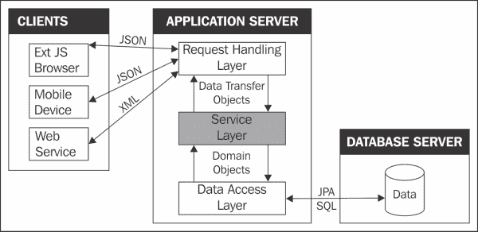
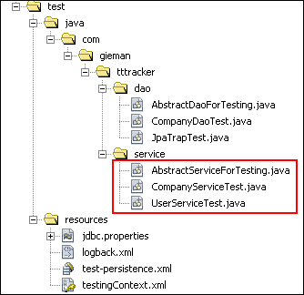
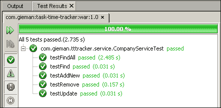
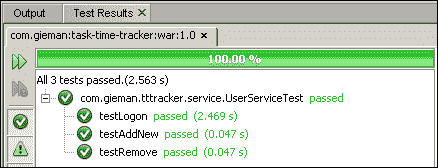
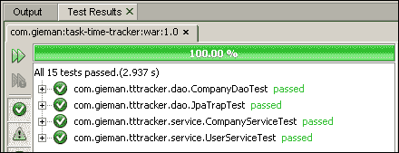

# 第六章：回到业务 - 服务层

服务层是应用程序的核心；这是业务逻辑所在的地方。业务逻辑封装了定义工作应用程序的规则，这是开发时间的重要部分。增强功能、变更需求和持续维护通常需要对服务层进行修改。业务规则可能包括限制对特定角色的访问、安全约束、计算、验证、合规性检查和日志记录等操作。

一些典型的业务逻辑示例可能包括以下内容：

+   只有管理员才能更改分配给用户的国家

+   管理员只能将用户更改为其所在地理区域的国家

+   如果支付的货币不是美元，必须添加 5%的汇率溢价

+   澳大利亚邮政编码必须正好是四位数字

+   将发票重新分配给加拿大分支只能在东海岸工作时间内进行

+   每张新发票必须记录在单独的文件中，如果不是来自五个最大的商业客户之一

我们将在本章实施的核心业务规则要简单得多：

+   用户必须在访问任何资源之前进行身份验证

+   只有 3T 管理员才能维护 3T 配置

+   用户只能更新和添加自己的任务日志

# 服务层考虑

对于服务层操作，有清晰定义的入口点是很重要的。这将通过定义服务层公开的操作的 Java 接口再次实现。服务层的客户端将通过这些接口与业务逻辑进行交互，而不是实现类。

出于类似的原因，服务层本身与底层 DAO 实现解耦是很重要的。我们已经通过确保我们的 DAO 层通过接口公开其持久性操作来实现了这一点。服务层不应该知道持久层是如何实现的，服务层类中也不应该编写任何持久性操作。

企业应用程序客户端有许多不同的形式，最常见的是 Web 浏览器和 Web 服务。但是，可能还有其他类型的客户端；例如，使用 RMI 的独立服务器。在所有情况下，服务层必须尽可能独立于客户端实现。因此，服务层不应该包含呈现逻辑，也不应该知道数据的使用方式。以下图示说明了服务层在整体应用程序结构中的位置：



服务层通过领域对象与数据访问层进行交互。这种设计有明确的角色划分。DAO 层负责与数据库交互，服务层不知道这是如何完成的。同样，DAO 层对领域对象的使用不感兴趣。这是业务逻辑控制领域对象可以和应该做什么的服务层的角色。

一个良好架构的服务层应该有一个简单的接口，允许任何类型的请求处理层与底层应用业务逻辑一起工作。如果从服务层请求 Company 实体的列表，则提供此功能的公开接口方法不需要知道列表是用于呈现网页，执行 Web 服务调用还是发送带有附加 Excel 电子表格的电子邮件。请求处理层将在下一章中详细讨论。

# 构建服务层

服务层类和接口将遵循与我们的 DAO 层相同的命名约定，其中`Service`只是替换了`Dao`等效名称：


我们的第一个定义将是`Result`类。

## 结果数据传输对象

服务层将通过返回`Result`**数据传输对象**（**DTO**）的接口与请求处理层通信。DTO 设计模式通常用于企业应用程序编程，用于在不同层或子系统之间传输数据。我们的`Result`DTO 将具有以下三个属性：

+   `boolean success`：如果操作成功并且有适当的数据有效负载可用，则使用此属性

+   `String msg`：这是一个可能被客户端用于日志记录或信息目的的消息

+   `<T> data`：这是一个通用类型的数据有效负载，将被请求处理层消耗

`Result`类也是**值对象**（**VO**），一个在创建后状态不能被改变的不可变对象。每个实例变量都标记为`final`，我们将使用适当的`ResultFactory`方法来创建值对象实例。值对象是领域驱动设计中用来表示没有概念身份的数据的概念。您可以在[`en.wikipedia.org/wiki/Domain-driven_design`](http://en.wikipedia.org/wiki/Domain-driven_design)找到更多关于领域驱动设计的信息。`Result`类的定义如下：

```java
package com.gieman.tttracker.vo;

import java.io.Serializable;
import java.util.List;
import java.util.Objects;

public class Result<T> implements Serializable {

    final private boolean success;
    final private T data;
    final private String msg;

    Result(boolean success, T data) {
        this.success = success;
        this.data = data;
        this.msg = null;
    }

    Result(boolean success, String msg) {
        this.success = success;
        this.data = null;
        this.msg = msg;
    }

    public boolean isSuccess() {
        return success;
    }

    public T getData() {
        return data;
    }

    public String getMsg() {
        return msg;
    }

    @Override
    public String toString() {

        StringBuilder sb = new StringBuilder("\"Result{\"");
        sb.append("success=").append(success);
        sb.append(", msg=").append(msg);

        sb.append(", data=");

        if(data == null){

            sb.append("null");

        } else if(data instanceof List){

            List castList = (List) data;
            if(castList.isEmpty()){

                sb.append("empty list");

            } else {
                Object firstItem = castList.get(0);

                sb.append("List of ").append(firstItem.getClass());
            }

        } else {
            sb.append(data.toString());
        }

        sb.append("}");

        return sb.toString();

    }

    @Override
    public int hashCode() {
        int hash = 7;
        hash = 89 * hash + (this.success ? 1 : 0);
        hash = 89 * hash + Objects.hashCode(this.data);
        return hash;
    }

    @Override
    public boolean equals(Object obj) {
        if (obj == null) {
            return false;
        }
        if (getClass() != obj.getClass()) {
            return false;
        }
        final Result<?> other = (Result<?>) obj;
        if (this.success != other.success) {
            return false;
        }
        return Objects.deepEquals(this.data, other.data);
    }
}
```

您会注意到`Result`构造函数是包私有的（不能被包外的类创建）。`Result`值对象的实例化将由`ResultFactory`类管理：

```java
package com.gieman.tttracker.vo;

public class ResultFactory {

    public static <T> Result<T> getSuccessResult(T data) {
        return new Result(true, data);
    }
    public static <T> Result<T> getSuccessResult(T data, String msg) {
        return new Result(true, msg);
    }

    public static <T> Result<T> getSuccessResultMsg(String msg) {
        return new Result(true, msg);
    }

    public static <T> Result<T> getFailResult(String msg) {
        return new Result(false, msg);
    }
}
```

静态实用方法将创建并返回配置为我们服务层适当目的的`Result`实例。

在我们的设计中，失败被认为是应用程序的可恢复状态。尝试使用无效的用户名/密码组合登录将是一个失败的操作示例。没有权限执行删除操作也可能是另一个可能的失败操作。服务层的客户端可以通过检查`Result`的`msg`来从这些操作中恢复并向用户呈现优雅的消息。处理失败的另一种设计模式是通过 Java 检查异常；当遇到失败时会抛出异常。实施这样的设计模式会强制客户端捕获异常，确定异常的原因，并相应地处理处理。我们更喜欢我们的设计来处理失败，并建议您不要使用检查异常，除非真正发生了异常情况。结果代码更易于阅读，我们可以避免处理异常的开销。

## AbstractService.java 类

所有服务层实现将扩展`AbstractService`类以提供通用功能。我们将简单地定义一个`logger`，`@Autowire`，`UserDao`实现，并添加一个方便的方法来检查用户是否有效。

```java
package com.gieman.tttracker.service;

import com.gieman.tttracker.dao.UserDao;
import com.gieman.tttracker.domain.User;
import org.slf4j.Logger;
import org.slf4j.LoggerFactory;
import org.springframework.beans.factory.annotation.Autowired;

public abstract class AbstractService {

    final protected Logger logger = LoggerFactory.getLogger(this.getClass());

    @Autowired
    protected UserDao userDao;

    protected  final String USER_INVALID = "Not a valid user";
    protected  final String USER_NOT_ADMIN = "Not an admin user";

    protected boolean isValidUser(String username){

        User user = userDao.findByUsername(username);
        return user != null;
    }
}
```

如前一章所述，Spring 会为每个`@Autowired`注释的字段注入与匹配类型的容器管理的 bean。因此，每个扩展`AbstractService`类的服务层实现将可以访问`UserDao`实例。

我们的服务层将实现非常基本的安全性，以区分普通用户和管理员用户。`ttt_user`表中的`admin_role`列用于标识用户是否具有管理员特权。企业应用程序很可能会有 LDAP 领域，为不同的用户组配置适当的角色，但原则是相同的；我们需要能够确定用户是否被允许执行操作。管理员角色将是我们 3T 应用程序上唯一的角色，我们现在将向`User`类添加一个辅助方法来确定用户是否是管理员：

```java
  public boolean isAdmin(){
    return adminRole == null ? false : adminRole.equals('Y');
  }
```

服务层实现将使用这个新方法来测试用户是否是管理员。

# 服务层接口

服务层接口定义了将向客户端公开的方法。这些方法定义了我们 3T 应用程序所需的核心操作。每个方法都有一个`String actionUsername`参数，用于标识执行此请求的用户。`actionUsername`可以用于实现日志记录或确保请求数据的用户是有效的。有效的定义将取决于正在执行的操作。每个接口将使用通用类型来定义返回的`Result`值对象。

`CompanyService`接口将返回一个数据有效载荷，要么是一个公司对象（`Result<Company>`），要么是一个公司对象列表（`Result<List<Company>>`）。该接口的定义如下：

```java
package com.gieman.tttracker.service;

import java.util.List;
import com.gieman.tttracker.domain.Company;
import com.gieman.tttracker.vo.Result;

public interface CompanyService {

    public Result<Company> store(
        Integer idCompany,
        String companyName,
        String actionUsername);

    public Result<Company> remove(Integer idCompany, String actionUsername);
    public Result<Company> find(Integer idCompany, String actionUsername);
    public Result<List<Company>> findAll(String actionUsername);

}
```

请注意，我们已经定义了一个`store`方法，用于将数据保存到持久存储中。实现方法将决定是否需要`persist`或`merge`。类似地，我们可以定义其余的接口（包和导入定义已被删除）。

```java
public interface ProjectService {

    public Result<Project> store(
        Integer idProject,
        Integer idCompany,
        String projectName,
        String actionUsername);

    public Result<Project> remove(Integer idProject, String actionUsername);
    public Result<Project> find(Integer idProject, String actionUsername);
    public Result<List<Project>> findAll(String actionUsername);

}
public interface TaskService {

    public Result<Task> store(
        Integer idTask,
        Integer idProject,
        String taskName,
        String actionUsername);

    public Result<Task> remove(Integer idTask, String actionUsername);
    public Result<Task> find(Integer idTask, String actionUsername);
    public Result<List<Task>> findAll(String actionUsername);
}
public interface TaskLogService {

    public Result<TaskLog> store(
        Integer idTaskLog,
        Integer idTask,
        String username,
        String taskDescription,
        Date taskLogDate,
        int taskMinutes,
        String actionUsername);

    public Result<TaskLog> remove(Integer idTaskLog, String actionUsername);
    public Result<TaskLog> find(Integer idTaskLog, String actionUsername);
    public Result<List<TaskLog>> findByUser(String username, Date startDate, Date endDate, String actionUsername);
}
public interface UserService {
    public Result<User> store(
        String username,
        String firstName,
        String lastName,
        String email,
        String password,
        Character adminRole,
        String actionUsername);

    public Result<User> remove(String username, String actionUsername);
    public Result<User> find(String username, String 
      actionUsername);
    public Result<List<User>> findAll(String actionUsername);
    public Result<User> findByUsernamePassword(String username, String password);
}
```

# 实现服务层

先前定义的每个接口都将有一个适当的实现。实现类将遵循我们的 DAO 命名约定，将`Impl`添加到接口名称中，结果为`CompanyServiceImpl`、`ProjectServiceImpl`、`TaskServiceImpl`、`TaskLogServiceImpl`和`UserServiceImpl`。我们将定义`CompanyServiceImpl`、`TaskServiceImpl`和`TaskLogServiceImpl`类，并将`ProjectServiceImpl`和`UserServiceImpl`留作练习。

服务层实现将使用一个或多个调用 DAO 层来处理业务逻辑，验证参数，并根据需要确认用户授权。如下列表所述，3T 应用程序安全性非常简单：

+   对于所有操作都需要一个有效的用户。`actionUsername`必须代表数据库中的有效用户。

+   只有管理员可以修改`Company`、`Project`或`Task`数据。

+   只有管理员可以修改或添加用户。

我们的服务层实现将使用`AbstractService`类中的`isValidUser`方法来检查用户是否有效。

## 身份验证、授权和安全

应用程序安全是企业应用程序开发的关键部分，重要的是要理解身份验证和授权之间的区别。

+   身份验证验证你是谁。它涉及验证用户名/密码组合，并在 3T 应用程序的初始登录期间执行一次。

+   授权验证您被允许做什么。3T 管理员可以执行比普通用户更多的操作。

3T 用户必须在`ttt_user`表中有一个有效的记录；服务层将简单地测试提供的用户名是否代表一个有效的用户。用户的实际授权将在下一章中进行介绍，当我们开发请求处理层时。

保护企业应用程序超出了本书的范围，但在讨论这个主题时，没有提到 Spring Security 是不完整的。Spring Security 已成为保护基于 Spring 的应用程序的事实标准，可以在[`static.springframework.org/spring-security/site/index.html`](http://static.springframework.org/spring-security/site/index.html)找到概述。Spring Security 已成为保护基于 Spring 的应用程序的事实标准，可以在[`www.springsecuritybook.com`](http://www.springsecuritybook.com)找到一本名为《Spring Security 3》的优秀书籍，涵盖了所有概念。我们建议您了解更多关于 Spring Security 的信息，以了解您可以对用户进行身份验证和保护服务层的许多不同方式。

## 公司服务实现

`CompanyServiceImpl`类定义如下：

```java
package com.gieman.tttracker.service;

import com.gieman.tttracker.dao.CompanyDao;
import java.util.List;
import com.gieman.tttracker.domain.*;
import org.springframework.stereotype.Service;
import org.springframework.transaction.annotation.Propagation;
import org.springframework.transaction.annotation.Transactional;
import com.gieman.tttracker.vo.Result;
import com.gieman.tttracker.vo.ResultFactory;
import org.springframework.beans.factory.annotation.Autowired;

@Transactional
@Service("companyService")
public class CompanyServiceImpl extends AbstractService implements CompanyService {

    @Autowired
    protected CompanyDao companyDao;

    public CompanyServiceImpl() {
        super();
    }

    @Transactional(readOnly = true, propagation = Propagation.SUPPORTS)
    @Override
    public Result<Company> find(Integer idCompany, String actionUsername) {

        if (isValidUser(actionUsername)) {
            Company company = companyDao.find(idCompany);
            return ResultFactory.getSuccessResult(company);

        } else {          
            return ResultFactory.getFailResult(USER_INVALID);
        }
    }

    @Transactional(readOnly = false, propagation = Propagation.REQUIRED)
    @Override
    public Result<Company> store(
            Integer idCompany,
            String companyName,
            String actionUsername) {

        User actionUser = userDao.find(actionUsername);

        if (!actionUser.isAdmin()) {
            return ResultFactory.getFailResult(USER_NOT_ADMIN);
        }

        Company company;

        if (idCompany == null) {
            company = new Company();
        } else {

            company = companyDao.find(idCompany);

            if (company == null) {
                return ResultFactory.getFailResult("Unable to find company instance with ID=" + idCompany);
            }
        }

        company.setCompanyName(companyName);

        if (company.getId() == null) {
            companyDao.persist(company);
        } else {
            company = companyDao.merge(company);
        }

        return ResultFactory.getSuccessResult(company);

    }

    @Transactional(readOnly = false, propagation = Propagation.REQUIRED)
    @Override
    public Result<Company> remove(Integer idCompany, String actionUsername) {

        User actionUser = userDao.find(actionUsername);

        if (!actionUser.isAdmin()) {
            return ResultFactory.getFailResult(USER_NOT_ADMIN);
        }

        if (idCompany == null) {
            return ResultFactory.getFailResult("Unable to remove Company [null idCompany]");
        } 

        Company company = companyDao.find(idCompany);

        if (company == null) {
            return ResultFactory.getFailResult("Unable to load Company for removal with idCompany=" + idCompany);
        } else {

            if (company.getProjects() == null || company.getProjects().isEmpty()) {

                companyDao.remove(company);

                String msg = "Company " + company.getCompanyName() + " was deleted by " + actionUsername;
                logger.info(msg);
                return ResultFactory.getSuccessResultMsg(msg);
            } else {
                return ResultFactory.getFailResult("Company has projects assigned and could not be deleted");
            }
        }

    }

    @Transactional(readOnly = true, propagation = Propagation.SUPPORTS)
    @Override
    public Result<List<Company>> findAll(String actionUsername) {

        if (isValidUser(actionUsername)) {
            return ResultFactory.getSuccessResult(companyDao.findAll());
        } else {
            return ResultFactory.getFailResult(USER_INVALID);
        }
    }
}
```

每个方法都返回一个由适当的`ResultFactory`静态方法创建的`Result`对象。每个方法都确认`actionUsername`方法，该方法标识了一个有效的用户进行操作。修改`Company`实体的方法需要一个管理用户（`store`和`remove`方法）。其他检索数据的方法（`find*`方法）只需要一个有效的用户；存在于`ttt_user`表中的用户。

请注意，在每个方法中重复使用`if(isValidUser(actionUsername))`和`if(!actionUser.isAdmin())`代码块。这不被认为是一个好的做法，因为这种逻辑应该是安全框架的一部分，而不是在每个方法中复制。例如，使用 Spring Security，可以通过使用注解将安全应用到服务层 bean。

```java
@Secured("ROLE_USER")
public Result<List<Company>> findAll(String actionUsername) {
// application specific code here

@Secured("ROLE_ADMIN")
public Result<Company> remove(Integer idCompany, String actionUsername) {
// application specific code here
```

`@Secured`注解用于定义适用于业务方法的安全配置属性列表。然后，用户将通过安全框架与一个或多个角色关联。这种设计模式不会过于侵入，更容易维护和增强。

### 注意

我们再次建议您了解更多关于 Spring Security 在实际企业应用中的使用。

任何无法按预期执行的操作都被视为“失败”。在这种情况下，将调用`ResultFactory.getFailResult`方法来创建失败的`Result`对象。

需要注意的几点：

+   每个服务层类都使用`@Service`注解来标识这是一个 Spring 管理的 bean。Spring 框架将配置为使用应用程序上下文配置文件中的`<context:component-scan base-package="com.gieman.tttracker.service"/>`扫描此注解。然后，Spring 将`CompanyServiceImpl`类加载到`companyService`名称下的 bean 容器中。

+   `store`方法用于`persist`和`merge`公司实体。服务层客户端不需要知道这将是一个`insert`语句还是一个`update`语句。根据主键的存在，在`store`方法中选择适当的操作。

+   `remove`方法检查公司是否分配了项目。实现的业务规则只允许在没有分配项目的情况下删除公司，然后检查`company.getProjects().isEmpty()`是否为 true。如果分配了项目，则`remove`方法失败。

+   事务属性取决于正在实现的操作。如果正在修改数据，我们使用`@Transactional(readOnly = false, propagation = Propagation.REQUIRED)`来确保如果尚未可用，则创建事务。如果方法中没有修改数据，我们使用`@Transactional(readOnly = true, propagation = Propagation.SUPPORTS)`。

所有服务层实现都将遵循类似的模式。

## TaskService 实现

`TaskServiceImpl`类定义如下：

```java
package com.gieman.tttracker.service;

import com.gieman.tttracker.dao.ProjectDao;
import com.gieman.tttracker.dao.TaskDao;
import com.gieman.tttracker.dao.TaskLogDao;
import java.util.List;
import com.gieman.tttracker.domain.*;
import org.springframework.stereotype.Service;
import org.springframework.transaction.annotation.Propagation;
import org.springframework.transaction.annotation.Transactional;
import com.gieman.tttracker.vo.Result;
import com.gieman.tttracker.vo.ResultFactory;
import org.springframework.beans.factory.annotation.Autowired;

@Transactional
@Service("taskService")
public class TaskServiceImpl extends AbstractService implements TaskService {

    @Autowired
    protected TaskDao taskDao;
    @Autowired
    protected TaskLogDao taskLogDao;     
    @Autowired
    protected ProjectDao projectDao;    

    public TaskServiceImpl() {
        super();
    }

    @Transactional(readOnly = true, propagation = Propagation.SUPPORTS)
    @Override
    public Result<Task> find(Integer idTask, String actionUsername) {

        if(isValidUser(actionUsername)) {
            return ResultFactory.getSuccessResult(taskDao.find(idTask));
        } else {
            return ResultFactory.getFailResult(USER_INVALID);
        }

    }

    @Transactional(readOnly = false, propagation = Propagation.REQUIRED)
    @Override
    public Result<Task> store(
        Integer idTask,
        Integer idProject,
        String taskName,
        String actionUsername) {

        User actionUser = userDao.find(actionUsername);

        if (!actionUser.isAdmin()) {
            return ResultFactory.getFailResult(USER_NOT_ADMIN);
        }

        Project project = projectDao.find(idProject);

        if(project == null){
            return ResultFactory.getFailResult("Unable to store task without a valid project [idProject=" + idProject + "]");
        }

        Task task;

        if (idTask == null) {

            task = new Task();
            task.setProject(project);
            project.getTasks().add(task);

        } else {

            task = taskDao.find(idTask);

            if(task == null) {

                return ResultFactory.getFailResult("Unable to find task instance with idTask=" + idTask);

            } else {

                if(! task.getProject().equals(project)){

                    Project currentProject = task.getProject();
                    // reassign to new project
                    task.setProject(project);
                    project.getTasks().add(task);
                    // remove from previous project
                    currentProject.getTasks().remove(task);
                }
            }
        }

        task.setTaskName(taskName);

        if(task.getId() == null) {
            taskDao.persist(task);
        } else {
            task = taskDao.merge(task);
        }

        return ResultFactory.getSuccessResult(task);
    }

    @Transactional(readOnly = false, propagation = Propagation.REQUIRED)
    @Override
    public Result<Task> remove(Integer idTask, String actionUsername){
        User actionUser = userDao.find(actionUsername);

        if (!actionUser.isAdmin()) {
            return ResultFactory.getFailResult(USER_NOT_ADMIN);
        }

        if(idTask == null){

            return ResultFactory.getFailResult("Unable to remove Task [null idTask]");

        } else {

            Task task = taskDao.find(idTask);
            long taskLogCount = taskLogDao.findTaskLogCountByTask(task);

            if(task == null) {

                return ResultFactory.getFailResult("Unable to load Task for removal with idTask=" + idTask);

            } else if(taskLogCount > 0) {

                return ResultFactory.getFailResult("Unable to remove Task with idTask=" + idTask + " as valid task logs are assigned");

            } else {

                Project project = task.getProject();

                taskDao.remove(task);

                project.getTasks().remove(task);

                String msg = "Task " + task.getTaskName() + " was deleted by " + actionUsername;
                logger.info(msg);
                return ResultFactory.getSuccessResultMsg(msg);
            }
        }
    }

    @Transactional(readOnly = true, propagation = Propagation.SUPPORTS)
    @Override
    public Result<List<Task>> findAll(String actionUsername){

        if(isValidUser(actionUsername)){
            return ResultFactory.getSuccessResult(taskDao.findAll());
        } else {
            return ResultFactory.getFailResult(USER_INVALID);
        }
    }
}
```

该类实现以下业务规则：

+   如果分配了任务日志，则不允许删除任务

+   只有管理员可以修改任务

请注意，在`remove`方法中，我们使用以下代码检查是否为任务分配了任务日志：

```java
long taskLogCount = taskLogDao.findTaskLogCountByTask (task);
```

`taskLogDao.findTaskLogCountByTask`方法使用`Query`接口上的`getSingleResult()`方法返回在`TaskLogDaoImpl`中定义的`long`值。可以编写一个方法来查找`taskLogCount`：

```java
List<TaskLog> allTasks = taskLogDao.findByTask(task);
long taskLogCount = allTasks.size();
```

然而，这种选择会导致 JPA 将分配给任务的所有`TaskLog`实体加载到内存中。这不是资源的有效使用，因为在大型系统中可能有数百万条`TaskLog`记录。

## TaskLogService 实现

`TaskLogService`实现将是我们将详细介绍的最终类。

```java
package com.gieman.tttracker.service;

import com.gieman.tttracker.dao.TaskDao;
import com.gieman.tttracker.dao.TaskLogDao;
import java.util.List;
import com.gieman.tttracker.domain.*;
import java.util.Date;
import org.springframework.stereotype.Service;
import org.springframework.transaction.annotation.Propagation;
import org.springframework.transaction.annotation.Transactional;
import com.gieman.tttracker.vo.Result;
import com.gieman.tttracker.vo.ResultFactory;
import org.springframework.beans.factory.annotation.Autowired;

@Transactional
@Service("taskLogService")
public class TaskLogServiceImpl extends AbstractService implements TaskLogService {

    @Autowired
    protected TaskLogDao taskLogDao;    
    @Autowired
    protected TaskDao taskDao;   

    public TaskLogServiceImpl() {
        super();
    }

    @Transactional(readOnly = true, propagation = Propagation.SUPPORTS)
    @Override
    public Result<TaskLog> find(Integer idTaskLog, String actionUsername) {

        User actionUser = userDao.find(actionUsername);

        if(actionUser == null) {
            return ResultFactory.getFailResult(USER_INVALID);
        }

        TaskLog taskLog = taskLogDao.find(idTaskLog);

        if(taskLog == null){
            return ResultFactory.getFailResult("Task log not found with idTaskLog=" + idTaskLog);
        } else if( actionUser.isAdmin() || taskLog.getUser().equals(actionUser)){
            return ResultFactory.getSuccessResult(taskLog);
        } else {
            return ResultFactory.getFailResult("User does not have permission to view this task log");
        }
    }

    @Transactional(readOnly = false, propagation = Propagation.REQUIRED)
    @Override
    public Result<TaskLog> store(
        Integer idTaskLog,
        Integer idTask,
        String username,
        String taskDescription,
        Date taskLogDate,
        int taskMinutes,
        String actionUsername) {

        User actionUser = userDao.find(actionUsername);
        User taskUser = userDao.find(username);

        if(actionUser == null || taskUser == null) {
            return ResultFactory.getFailResult(USER_INVALID);
        }

        Task task = taskDao.find(idTask);

        if(task == null) {
            return ResultFactory.getFailResult("Unable to store task log with null task");
        }

        if( !actionUser.isAdmin() && ! taskUser.equals(actionUser) ){
            return ResultFactory.getFailResult("User performing save must be an admin user or saving their own record");
        }

        TaskLog taskLog;

        if (idTaskLog == null) {
            taskLog = new TaskLog();
        } else {
            taskLog = taskLogDao.find(idTaskLog);
            if(taskLog == null) {
                return ResultFactory.getFailResult("Unable to find taskLog instance with ID=" + idTaskLog);
            }
        }

        taskLog.setTaskDescription(taskDescription);
        taskLog.setTaskLogDate(taskLogDate);
        taskLog.setTaskMinutes(taskMinutes);
        taskLog.setTask(task);
        taskLog.setUser(taskUser);

        if(taskLog.getId() == null) {
            taskLogDao.persist(taskLog);
        } else {
            taskLog = taskLogDao.merge(taskLog);
        }

        return ResultFactory.getSuccessResult(taskLog);

    }

    @Transactional(readOnly = false, propagation = Propagation.REQUIRED)
    @Override
    public Result<TaskLog> remove(Integer idTaskLog, String actionUsername){

        User actionUser = userDao.find(actionUsername);

        if(actionUser == null) {
            return ResultFactory.getFailResult(USER_INVALID);
        }

        if(idTaskLog == null){
            return ResultFactory.getFailResult("Unable to remove TaskLog [null idTaskLog]");
        } 

        TaskLog taskLog = taskLogDao.find(idTaskLog);

        if(taskLog == null) {
            return ResultFactory.getFailResult("Unable to load TaskLog for removal with idTaskLog=" + idTaskLog);
        } 

        // only the user that owns the task log may remove it
        // OR an admin user
        if(actionUser.isAdmin() || taskLog.getUser().equals(actionUser)){
            taskLogDao.remove(taskLog);
            return ResultFactory.getSuccessResultMsg("taskLog removed successfully");
        } else {
            return ResultFactory.getFailResult("Only an admin user or task log owner can delete a task log");
        }
    }

    @Transactional(readOnly = true, propagation = Propagation.SUPPORTS)
    @Override
    public Result<List<TaskLog>> findByUser(String username, Date startDate, Date endDate, String actionUsername){

        User taskUser = userDao.findByUsername(username);
        User actionUser = userDao.find(actionUsername);

        if(taskUser == null || actionUser == null) {
            return ResultFactory.getFailResult(USER_INVALID);
        }

        if(startDate == null || endDate == null){
            return ResultFactory.getFailResult("Start and end date are required for findByUser ");
        }

        if(actionUser.isAdmin() || taskUser.equals(actionUser)){
            return ResultFactory.getSuccessResult(taskLogDao.findByUser(taskUser, startDate, endDate));
        } else {
            return ResultFactory.getFailResult("Unable to find task logs. User does not have permission with username=" + username);
        }
    }
}
```

再次强调，这个类中有很多业务逻辑。实现的主要业务规则是：

+   只有`TaskLog`的所有者或管理员才能找到任务日志

+   管理员可以为任何其他用户添加任务日志

+   普通用户只能为自己添加任务日志

+   只有任务日志的所有者或管理员才能删除任务日志

+   普通用户只能检索自己的任务日志

+   管理员可以检索任何人的任务日志

+   `findByUser`方法需要有效的开始和结束日期

我们留下剩下的服务层类（`UserServiceImpl`和`ProjectServiceImpl`）供您作为练习实现。

现在是时候为我们的服务层配置测试环境了。

# 测试服务层

服务层测试是企业应用程序开发的关键部分。如前所述，服务层封装了定义工作应用程序的业务规则，并且在这里花费了大量的开发时间。随着应用程序的增强、新模块的添加和业务规则的改变，业务逻辑会发展。因此，服务层的测试用例将代表应用程序的发展。良好记录的测试用例将增强应用程序生命周期的知识库，定义变化，并解释变化的目的。服务层测试用例将成为所有参与项目开发的开发人员所赞赏的信息库。

启用服务层测试的唯一更改是将以下内容添加到前一章中定义的`testingContext.xml`文件中：

```java
<context:component-scan base-package="com.gieman.tttracker.service" />
```

添加到目录`src/test/java/com/gieman/tttracker/service`的测试用例类将可供测试。我们将向服务包添加以下类：



`AbstractServiceForTesting`超类将再次扩展`AbstractTransactionalJUnit4SpringContextTests`，定义`@ContextConfiguration`配置文件，并使用`slf4j`记录器覆盖默认的 Spring 记录器。

```java
package com.gieman.tttracker.service;

import org.slf4j.Logger;
import org.slf4j.LoggerFactory;

import org.springframework.test.context.ContextConfiguration;
import org.springframework.test.context.junit4.AbstractTransactionalJUnit4SpringContextTests;

@ContextConfiguration("/testingContext.xml")
public abstract class AbstractServiceForTesting extends AbstractTransactionalJUnit4SpringContextTests {

    final protected Logger logger = LoggerFactory.getLogger(this.getClass());

}
The CompanyServiceTest class is defined as:
package com.gieman.tttracker.service;

import com.gieman.tttracker.dao.ProjectDao;
import com.gieman.tttracker.domain.Company;
import com.gieman.tttracker.domain.Project;
import com.gieman.tttracker.vo.Result;
import java.util.List;
import static org.junit.Assert.assertTrue;
import org.junit.Test;
import org.springframework.beans.factory.annotation.Autowired;

public class CompanyServiceTest extends AbstractServiceForTesting {

    protected final String TEST_USERNAME = "bjones";
    @Autowired
    protected CompanyService companyService;    
    @Autowired
    protected ProjectDao projectDao; 

    @Test
    public void testFind() throws Exception {

        logger.debug("\nSTARTED testFind()\n");
        Result<List<Company>> allItems = companyService.findAll(TEST_USERNAME);

        assertTrue(allItems.getData().size() > 0);

        // get the first item in the list
        Company c1 = allItems.getData().get(0);

        int id = c1.getId();

        Result<Company> c2= companyService.find(id, TEST_USERNAME);

        assertTrue(c1.equals(c2.getData()));
        logger.debug("\nFINISHED testFind()\n");
    }    

    @Test
    public void testFindAll() throws Exception {

        logger.debug("\nSTARTED testFindAll()\n");
        int rowCount = countRowsInTable("ttt_company");

        if(rowCount > 0){                       

            Result<List<Company>> allItems = companyService.findAll(TEST_USERNAME);
            assertTrue("Company.findAll list not equal to row count of table ttt_company", rowCount == allItems.getData().size());

        } else {
            throw new IllegalStateException("INVALID TESTING SCENARIO: Company table is empty");
        }
        logger.debug("\nFINISHED testFindAll()\n");
    }    

    @Test
    public void testAddNew() throws Exception {

        logger.debug("\nSTARTED testAddNew()\n");
        //Company c = new Company();
        final String NEW_NAME = "New Test Company name";
        //c.setCompanyName(NEW_NAME);

        Result<Company> c2 = companyService.store(null, NEW_NAME, TEST_USERNAME);

        assertTrue(c2.getData().getId() != null);
        assertTrue(c2.getData().getCompanyName().equals(NEW_NAME));

        logger.debug("\nFINISHED testAddNew()\n");
    }

    @Test
    public void testUpdate() throws Exception {

        logger.debug("\nSTARTED testUpdate()\n");
        final String NEW_NAME = "Update Test Company New Name";

        Result<List<Company>> ar1 = companyService.findAll(TEST_USERNAME);
        Company c = ar1.getData().get(0);

        companyService.store(c.getIdCompany(), NEW_NAME, TEST_USERNAME);

        Result<Company> ar2 = companyService.find(c.getIdCompany(), TEST_USERNAME);

        assertTrue(ar2.getData().getCompanyName().equals(NEW_NAME));

        logger.debug("\nFINISHED testMerge()\n");

    }    

    @Test
    public void testRemove() throws Exception {

        logger.debug("\nSTARTED testRemove()\n");
        Result<List<Company>> ar1 = companyService.findAll(TEST_USERNAME);
        Company c = ar1.getData().get(0);

        Result<Company> ar = companyService.remove(c.getIdCompany(), TEST_USERNAME);        
        Result<Company> ar2 = companyService.find(c.getIdCompany(), TEST_USERNAME);

        // should fail as projects are assigned
        assertTrue(! ar.isSuccess());
        // finder still works
        assertTrue(ar2.getData() != null);

        logger.debug("\ntestRemove() - UNABLE TO DELETE TESTS PASSED\n");
        // remove all the projects
        c = ar2.getData();

        for(Project p : c.getProjects()){
            projectDao.remove(p);

        }
        c.getProjects().clear();

        logger.debug("\ntestRemove() - removed all projects\n");

        ar = companyService.remove(c.getIdCompany(), TEST_USERNAME);
        // remove should have succeeded
        assertTrue(ar.isSuccess());

        ar2 = companyService.find(c.getIdCompany(), TEST_USERNAME);
        // should not have been found
        assertTrue(ar2.getData() == null);
        assertTrue(ar2.isSuccess());

        logger.debug("\nFINISHED testRemove()\n");
    }     
}
```

通过在编辑器中右键单击文件并选择**Test File**选项来运行此测试用例应该会产生以下输出：



`UserServiceTest`类定义如下：

```java
package com.gieman.tttracker.service;

import com.gieman.tttracker.dao.TaskLogDao;
import com.gieman.tttracker.dao.UserDao;
import com.gieman.tttracker.domain.TaskLog;
import com.gieman.tttracker.domain.User;
import com.gieman.tttracker.vo.Result;
import java.util.Calendar;
import java.util.List;
import static org.junit.Assert.assertTrue;
import org.junit.Test;
import org.springframework.beans.factory.annotation.Autowired;

public class UserServiceTest extends AbstractServiceForTesting {

    @Autowired
    protected UserService userService;
    @Autowired
    protected TaskLogDao taskLogDao;
    @Autowired
    protected UserDao userDao;
    private final String TEST_USERNAME = "jsmith";

    @Test
    public void testAddNew() throws Exception {

        String ADMIN_USERNAME = "bjones";

        logger.debug("\nSTARTED testAddNew()\n");

        Result<User> ar = userService.store("nusername", "David", "Francis", "df@tttracker.com", "admpwd", 'N', ADMIN_USERNAME);

        // should succeed
        logger.debug(ar.getMsg());
        assertTrue(ar.isSuccess());

        ar = userService.store(this.TEST_USERNAME, "David", "Francis", "df@tttracker.com", "admpwd", 'Y', ADMIN_USERNAME);
        logger.debug(ar.getMsg());
        assertTrue("Cannot assign email that is currently assigned to other user", !ar.isSuccess());

        ar = userService.store("user100", "David", "Francis", "user100@tttracker.com", "", 'Y', ADMIN_USERNAME);

        logger.debug(ar.getMsg());
        assertTrue("Cannot set empty password for user", !ar.isSuccess());

        ar = userService.store("user101", "David", "Francis", "  ", "validpwd", 'Y', ADMIN_USERNAME);

        logger.debug(ar.getMsg());
        assertTrue("Cannot set empty email for user", !ar.isSuccess());

        ar = userService.store(this.TEST_USERNAME, "David", "Francis", "diff@email.com", "validpwd", 'Y', ADMIN_USERNAME);

        logger.debug(ar.getMsg());
        assertTrue("Assigning new email to user is allowed", ar.isSuccess());

        logger.debug("\nFINISHED testAddNew()\n");
    }

    @Test
    public void testRemove() throws Exception {

        String ADMIN_USERNAME = "bjones";
        Calendar DEFAULT_START_DATE = Calendar.getInstance();
        Calendar DEFAULT_END_DATE = Calendar.getInstance();
        DEFAULT_START_DATE.set(Calendar.YEAR, 1900);
        DEFAULT_END_DATE.set(Calendar.YEAR, 3000);

        logger.debug("\nSTARTED testRemove()\n");

        User user1 = userDao.find(TEST_USERNAME);

        List<TaskLog> logs = taskLogDao.findByUser(user1, DEFAULT_START_DATE.getTime(), DEFAULT_END_DATE.getTime());
        Result<User> ar;

        if (logs.isEmpty()) {

            ar = userService.remove(TEST_USERNAME, ADMIN_USERNAME);
            logger.debug(ar.getMsg());
            assertTrue("Delete of user should be allowed as no task logs assigned!", ar.isSuccess());

        } else {

            // this user has task log assigned
            ar = userService.remove(TEST_USERNAME, ADMIN_USERNAME);
            logger.debug(ar.getMsg());
            assertTrue("Cascading delete of user to task logs not allowed!", !ar.isSuccess());

        }

        logs = taskLogDao.findByUser(user1, DEFAULT_START_DATE.getTime(), DEFAULT_END_DATE.getTime());
        if (logs.isEmpty()) {

            ar = userService.remove(TEST_USERNAME, ADMIN_USERNAME);
            logger.debug(ar.getMsg());
            assertTrue("Delete of user should be allowed as empty task log list!", ar.isSuccess());

        } else {

            // this user has task log assigned
            ar = userService.remove(TEST_USERNAME, ADMIN_USERNAME);
            logger.debug(ar.getMsg());
            assertTrue("Cascading delete of user to task logs not allowed!", !ar.isSuccess());

        }

        ar = userService.remove(ADMIN_USERNAME, ADMIN_USERNAME);
        logger.debug(ar.getMsg());
        assertTrue("Should not be able to delete yourself", !ar.isSuccess());

        logger.debug("\nFINISHED testRemove()\n");
    }

    @Test
    public void testLogon() {

        Result<User> ar = userService.findByUsernamePassword("jsmith", "admin");

        assertTrue("Valid user could not be found for valid user/pwd", ar.getData() != null);
        assertTrue(ar.isSuccess());

        ar = userService.findByUsernamePassword("jsmith", "ADMIN");

        assertTrue("Invalid logic - valid user found with UPPERCASE password", ar.getData() == null);
        assertTrue(!ar.isSuccess());

        ar = userService.findByUsernamePassword("JS@tttracker.com", "admin");

        assertTrue("Valid user could not be found for valid email/pwd", ar.getData() != null);
        assertTrue(ar.isSuccess());

        ar = userService.findByUsernamePassword("jsmith", "invalidadmin");
        assertTrue("Invalid user verified with wrong password", ar.getData() == null);
        assertTrue(!ar.isSuccess());

        ar = userService.findByUsernamePassword("blah", "blah");
        assertTrue("Invalid user verified with wrong username and password", ar.getData() == null);
        assertTrue(!ar.isSuccess());
    }
}
```

请注意，我们尚未定义`UserService`接口的实现，但我们已经编写了测试用例。由于使用了 Java 接口，我们能够在实现编码之前定义测试用例。这是**测试驱动开发**（**TDD**）的关键概念之一，开发人员在编写通过测试的实际代码之前编写定义所需行为的测试用例。这种策略也是极限编程（[`en.wikipedia.org/wiki/Extreme_programming`](http://en.wikipedia.org/wiki/Extreme_programming)）的测试优先编程概念的一部分，在实现编码开始之前编写测试用例。

在编写`UserServiceImpl`后执行`UserServiceTest`测试文件应该会产生以下输出：



# 自动化服务层测试

按照以下方式更新`pom.xml`将在 Maven 构建过程中包含服务层测试用例：

```java
<plugin>
  <groupId>org.apache.maven.plugins</groupId>
  <artifactId>maven-surefire-plugin</artifactId>
    <version>2.14.1</version>
  <configuration>
    <skipTests>false</skipTests>
    <includes>
      <include>**/dao/*Test.java</include>
      <include>**/service/*Test.java</include>
    </includes>
    <argLine>-javaagent:target/lib/spring-instrument-${spring.version}.jar</argLine>
  </configuration>
</plugin>
```

从**NetBeans**菜单中选择**Run** | **Test Project**将执行`dao`和`service`包中的所有测试用例，产生以下输出：



我们留给你添加剩余服务层实现的测试用例。

# 练习

根据接口定义实现`ProjectServiceImpl`和`UserServiceImpl`接口。在实现`UserServiceImpl`时要考虑的业务逻辑如下：

+   只有管理员用户可以修改数据

+   `email`地址不能为空

+   `password`不能为空

+   `adminRole`标志必须是`Y`或`N`

+   不允许用户删除自己

+   如果有任务日志分配给用户，则用户不能被删除

通过执行`UserServiceTest`测试用例来确认您的`UserServiceImpl`实现。

# 总结

服务层是企业应用程序拥有的最有价值的资产。它是所有业务逻辑处理的核心，是包含最详细代码的层。我们的服务层与 DAO 实现没有耦合，并且独立于数据的使用方式。它纯粹专注于业务逻辑操作，通过数据传输对象设计模式以简单的通用类型值对象传递数据。

我们的服务层实现为业务逻辑操作明确定义了入口点。这是通过定义所有公开可访问方法的 Java 接口实现的。接口的使用还使我们能够在编写实现之前编写测试用例——这是测试驱动开发和极限编程的核心原则。在接下来的章节中，我们将使用这些接口来为 Web 客户端定义请求处理层。
