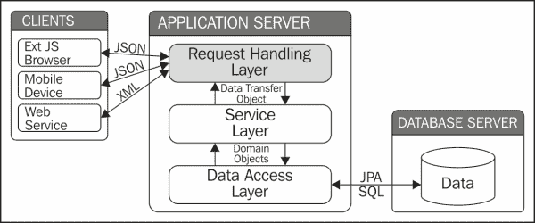
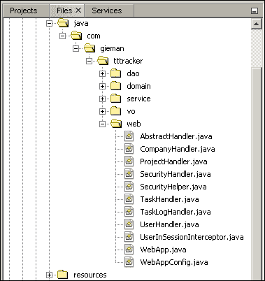

# 第七章：网络请求处理层

请求处理层是将 HTTP 客户端与应用程序提供的服务粘合在一起的胶水。这一层的领域是请求的解释和数据的传输。我们的重点将放在 Ext JS 4 客户端消耗和提交的数据上。这些数据是以 JSON 格式存在，因此我们将讨论使用 Java JSON 处理 API 进行 JSON 解析和生成。然而，需要注意的是，任何类型的数据都可以通过适当的请求处理实现来暴露。如果需要的话，实现 RMI 或 RESTful 接口同样容易。

# Web MVC 的简要历史

在历史背景下讨论**模型-视图-控制器**（MVC）范式可能看起来有些奇怪，因为大多数 Web 应用程序今天仍在使用这项技术。MVC 设计模式最早在 2000 年初就开始在开源的 Struts 框架中引起关注。这个框架鼓励使用 MVC 架构来促进处理和提供请求时的责任清晰划分。服务器端 Java 开发的 MVC 范式一直存在，以各种形式存在，最终演变成了设计良好且功能强大的 Spring MVC 框架。

使用 MVC 方法的理由非常简单。实现客户端和应用程序之间交互的 Web 层可以分为以下三种不同类型的对象：

+   代表数据的模型对象

+   负责显示数据的视图对象

+   响应操作并为视图对象提供模型数据的控制器对象

每个 MVC 对象都会独立行事，耦合度低。例如，视图技术对控制器来说并不重要。视图是由 FreeMarker 模板、XSLT 转换或 Tiles 和 JSP 的组合生成并不重要。控制器只是将处理模型数据的责任传递给视图对象。

在这个历史讨论中需要注意的一个重要点是，所有的 MVC 处理都是在服务器上进行的。随着 JavaScript 框架数量的增加，特别是 Ext JS 4，MVC 范式已经从服务器转移到客户端浏览器。这是 Web 应用程序开发方式的根本变化，也是你正在阅读本书的原因！

# 企业 Web 应用程序的请求处理

以下图表清楚地标识了请求处理层在整体应用架构中的位置：



请求处理层接受客户端请求，并将相应的操作转发给适当的服务层方法。返回的 DTO（或者在领域驱动设计中也称为值对象）被检查，然后适当的响应被发送给客户端。与历史上的服务器端 MVC 编程不同，请求处理层不了解展示，只是作为应用程序的请求处理接口。

# 构建请求处理层

Ext JS 4 客户端的网络请求处理层是服务层接口的 JSON 生成代理。在这一层内，领域实体被转换为 JSON 表示；因此我们的第一步是创建一些辅助代码来简化这个任务。

有几个优秀的开源 JSON 生成项目可以帮助完成这项任务，包括 Jackson（[`jackson.codehaus.org`](http://jackson.codehaus.org)）和 Google Gson（[`code.google.com/p/google-gson/`](http://code.google.com/p/google-gson/)）。这些库通过它们声明的字段将 POJO 解析为适当的 JSON 表示。随着 Java EE 7 的发布，我们不再需要第三方库。Java API for JSON Processing (JSR-353)在所有 Java EE 7 兼容的应用服务器中都可用，包括 GlassFish 4。我们将利用这个 API 来生成和解析 JSON 数据。

### 注意

如果您无法使用 Java EE 7 应用服务器，您将需要选择替代的 JSON 生成策略，例如 Jackson 或 Google Gson。

## 为 JSON 生成做准备

我们的第一个添加是一个新的领域接口：

```java
package com.gieman.tttracker.domain;

import javax.json.JsonObject;
import javax.json.JsonObjectBuilder;

public interface JsonItem{

    public JsonObject toJson();
    public void addJson(JsonObjectBuilder builder);

}
```

这个非常简单的接口定义了两个方法来帮助生成 JSON。`toJson`方法创建一个代表实体的`JsonObject`。`addJson`方法将实体属性添加到`JsonObjectBuilder`接口。我们很快就会看到这两种方法是如何使用的。

我们的每个领域实体都需要实现`JsonItem`接口，这可以通过简单地将接口添加到所有领域实体的抽象超类中来实现：

```java
package com.gieman.tttracker.domain;

import java.io.Serializable;
import java.text.SimpleDateFormat;
import javax.json.Json;
import javax.json.JsonObject;
import javax.json.JsonObjectBuilder;
public abstract class AbstractEntity implements JsonItem, Serializable{

    @Override
 public JsonObject toJson() {

 JsonObjectBuilder builder = Json.createObjectBuilder();
 addJson(builder);
 return builder.build();
 }

}
```

`JsonObjectBuilder`接口定义了一组方法，用于向与构建器关联的 JSON 对象添加名称/值对。`builder`实例添加了实现`addJson`方法的后代类中定义的字段。我们将从`Company`对象开始。

### 实现 Company addJson 方法

需要添加到`Company`类的`addJson`方法如下：

```java
@Override
public void addJson(JsonObjectBuilder builder) {
  builder.add("idCompany", idCompany)
     .add("companyName", companyName);
}
```

`Company`实例的`JsonObject`表示是通过在超类中调用`builder.build()`方法创建的。然后，生成的`JsonObject`可以由`JsonWriter`实例写入输出源。

### 实现 Project addJson 方法

需要添加到`Project`类的`addJson`方法如下：

```java
@Override
public void addJson(JsonObjectBuilder builder) {

  builder.add("idProject", idProject)
     .add("projectName", projectName);

  if(company != null){
     company.addJson(builder);
  }
}   
```

请注意，在访问对象方法之前执行`null`对象测试始终是一个良好的做法。可以创建一个没有`company`实例的`project`对象，因此我们在向项目`builder`实例添加`company` JSON 属性之前执行`company != null`测试。我们可以直接使用以下代码将`company`属性添加到项目`builder`实例中：

```java
builder.add("idProject", idProject)
     .add("projectName", projectName)
.add("idCompany", company.getIdCompany() )
     .add("companyName", company.getCompanyName() );
```

然而，我们现在已经在两个类（`Company.addJson`和`Project.addJson`）中复制了`builder.add("idCompany"…)`的代码，这样未来的维护容易出现错误。例如，将 JSON 属性名称从`idCompany`更改为`companyId`将需要扫描代码以检查可能在所有类中使用，而不仅仅是`Company`类。`Company` JSON 的创建应该属于`Company`类，因为我们已经实现了。

### 实现 Task addJson 方法

这个`Task`类将实现如下的`addJson`方法：

```java
@Override
public void addJson(JsonObjectBuilder builder) {

  builder .add("idTask", idTask)
     .add("taskName", taskName);

  if(project != null){
     project.addJson(builder);

     Company company = project.getCompany();
     company.addJson(builder);
  }        
}
```

再次注意，我们如何将`project`和`company`类的`addJson`调用链接到任务的`builder`实例，以添加它们的 JSON 属性。

### 实现 User addJson 方法

`User.addJson`方法定义如下：

```java
@Override
public void addJson(JsonObjectBuilder builder) {

  builder.add("username", username)
      .add("firstName", firstName)
      .add("lastName", lastName)
      .add("email", email)
      .add("adminRole", adminRole + "")
      .add("fullName", firstName + " " + lastName);
}
```

`fullName`属性仅供方便使用；我们可以在我们的 Ext JS 代码中轻松地创建一个`fullName`字段，它连接`firstName`和`lastName`字段。然而，将这段代码保留在 JSON 生成的源头可以更容易地进行维护。考虑业务变更请求“向`User`实体添加`middleName`字段”。然后，`fullName`包含新的`middleName`字段就变得非常简单，并且可以在不进行任何进一步更改的情况下提供给 Ext JS 客户端。

### 实现 TaskLog addJson 方法

`addJson`方法将所有`TaskLog`字段添加到`builder`实例中。`DATE_FORMAT_yyyyMMdd`常量用于将`taskLogDate`格式化为年/月/日的 8 位表示，并添加到`TaskLog`类中，如下所示：

```java
static final SimpleDateFormat DATE_FORMAT_yyyyMMdd = new SimpleDateFormat("yyyyMMdd");
```

`addJson`方法将使用`SimpleDateFormat`实例来格式化`taskLogDate`字段：

```java
public void addJson(JsonObjectBuilder builder) {

  builder.add("idTaskLog", idTaskLog)
    .add("taskDescription", taskDescription)
    .add("taskLogDate", taskLogDate == null ? "" : DATE_FORMAT_yyyyMMdd.format(taskLogDate))
    .add("taskMinutes", taskMinutes);

  if (user != null) {
    user.addJson(builder);
  }
  if (task != null) {
    task.addJson(builder);            
  }
}
```

`taskLogDate`字段的格式化方式在转换为 Ext JS 客户端的 JavaScript `Date`对象时不会被误解。如果没有使用`SimpleDateFormat`实例，`builder`实例将调用`taskLogDate`对象的默认`toString`方法来检索字符串表示，结果类似于以下内容：

```java
Wed Aug 14 00:00:00 EST 2013
```

使用配置为`yyyyMMdd`日期模式的`SimpleDateFormat`实例将确保这样的日期格式为`20130814`。

### 注意

在企业应用程序中，日期格式化可能会导致许多问题，如果没有采用标准策略。当我们开发应用程序供全球使用，涉及多个时区和不同语言时，这一点更加适用。日期应始终以一种可以在不同语言、时区和用户偏好设置下被解释的方式进行格式化。

## 关于 JSON 的说明

我们将使用 JSON 在 GlassFish 服务器和 Ext JS 客户端之间传输数据。传输是双向的；服务器将向 Ext JS 客户端发送 JSON 数据，而 Ext JS 客户端将以 JSON 格式将数据发送回服务器。服务器和客户端都将消耗*和*生成 JSON 数据。

只要符合规范（[`tools.ietf.org/html/rfc4627`](http://tools.ietf.org/html/rfc4627)），对于构造 JSON 数据没有规则。Ext JS 4 模型允许通过关联使用任何形式的有效 JSON 结构；我们的方法将 JSON 结构保持在其最简单的形式。先前定义的`addJson`方法返回简单的、扁平的数据结构，没有嵌套或数组。例如，`task`实例可以序列化为以下 JSON 对象（包含格式化以便阅读）：

```java
{
    success: true,
    data: {
        "idTask": 1,
        "taskName": "Write Chapter 7",
        "idProject": 1,
        "projectName": "My Book Project",
        "idCompany": 1,
        "companyName": "PACKT Publishing"
    }
}
```

`data`负载表示将被 Ext JS 4 客户端消耗的`task`对象。我们可以定义`task`对象的 JSON 表示如下：

```java
{
    success: true,
    data: {
        "idTask": 1,
        "taskName": "Write Chapter 7",
        "project": {
            "idProject": 1,
            "projectName": "My Book Project ",
            "company": {
                "idCompany": 1,
                "companyName": "PACKT Publishing"
            }
        }
    }
}
```

在这个结构中，我们看到`task`实例属于一个`project`，而`project`又属于一个`company`。这两种 JSON 表示都是合法的；它们都包含相同的`task`数据，以有效的 JSON 格式。然而，这两者中哪一个更容易解析？哪一个更容易调试？作为企业应用程序开发人员，我们应该始终牢记 KISS 原则。**保持简单，愚蠢**（KISS）原则指出，大多数系统如果保持简单，并避免不必要的复杂性，将能够发挥最佳作用。

### 注意

保持你的 JSON 简单！我们知道复杂的结构是可能的；这只是通过在定义 Ext JS 4 模型以及读取或写入 JSON 数据时附加复杂性来实现的。简单的 JSON 结构更容易理解和维护。

# 创建请求处理程序

我们现在将构建用于为我们的 Ext JS 客户端提供 HTTP 请求的处理程序。这些处理程序将被添加到一个新的`web`目录中，如下截图所示：



每个处理程序都将使用 Spring Framework 的`@Controller`注解来指示该类充当“控制器”的角色。严格来说，我们将要定义的处理程序在传统意义上并不是 Spring MVC 应用程序的控制器。我们只会使用非常小部分可用的 Spring 控制器功能来处理请求。这将确保我们的请求处理层非常轻量且易于维护。和往常一样，我们将首先创建一个所有处理程序都将实现的基类。

## 定义 AbstractHandler 超类

`AbstractHandler`超类定义了几个重要的方法，用于简化 JSON 生成。由于我们正在与 Ext JS 4 客户端集成，我们处理程序生成的 JSON 对象的结构特定于 Ext JS 4 组件期望的数据结构。我们将始终生成一个具有`success`属性的 JSON 对象，该属性包含一个布尔值`true`或`false`。同样，我们将始终生成一个名为`data`的有效负载属性的 JSON 对象。这个`data`属性将具有一个有效的 JSON 对象作为其值，可以是一个简单的 JSON 对象，也可以是一个 JSON 数组。

### 注意

请记住，所有生成的 JSON 对象都将以一种格式呈现，可以被 Ext JS 4 组件消费，而无需额外的配置。

`AbstractHandler`类的定义如下：

```java
package com.gieman.tttracker.web;

import com.gieman.tttracker.domain.JsonItem;
import java.io.StringReader;
import java.io.StringWriter;
import java.util.List;
import javax.json.Json;
import javax.json.JsonArrayBuilder;
import javax.json.JsonNumber;
import javax.json.JsonObject;
import javax.json.JsonObjectBuilder;
import javax.json.JsonReader;
import javax.json.JsonValue;
import javax.json.JsonWriter;
import org.slf4j.Logger;
import org.slf4j.LoggerFactory;

public abstract class AbstractHandler {

    protected final Logger logger = LoggerFactory.getLogger(this.getClass());

    public static String getJsonSuccessData(List<? extends JsonItem> results) {

        final JsonObjectBuilder builder = Json.createObjectBuilder();
        builder.add("success", true);
        final JsonArrayBuilder arrayBuilder = Json.createArrayBuilder();

        for (JsonItem ji : results) {

            arrayBuilder.add(ji.toJson());
        }

        builder.add("data", arrayBuilder);

        return toJsonString(builder.build());
    }

    public static String getJsonSuccessData(JsonItem jsonItem) {

        final JsonObjectBuilder builder = Json.createObjectBuilder();
        builder.add("success", true);
        builder.add("data", jsonItem.toJson());

        return toJsonString(builder.build());

    }

    public static String getJsonSuccessData(JsonItem jsonItem, int totalCount) {

        final JsonObjectBuilder builder = Json.createObjectBuilder();
        builder.add("success", true);
        builder.add("total", totalCount);
        builder.add("data", jsonItem.toJson());

        return toJsonString(builder.build());
    }

    public static String getJsonErrorMsg(String theErrorMessage) {

        return getJsonMsg(theErrorMessage, false);

    }

    public static String getJsonSuccessMsg(String msg) {

        return getJsonMsg(msg, true);
    }
    public static String getJsonMsg(String msg, boolean success) {

        final JsonObjectBuilder builder = Json.createObjectBuilder();
        builder.add("success", success);
        builder.add("msg", msg);

        return toJsonString(builder.build());

    }

    public static String toJsonString(JsonObject model) {

        final StringWriter stWriter = new StringWriter();

        try (JsonWriter jsonWriter = Json.createWriter(stWriter)) {
            jsonWriter.writeObject(model);
        }

        return stWriter.toString();
    }

    protected JsonObject parseJsonObject(String jsonString) {

        JsonReader reader = Json.createReader(new StringReader(jsonString));
        return reader.readObject();

    }
    protected Integer getIntegerValue(JsonValue jsonValue) {

        Integer value = null;

        switch (jsonValue.getValueType()) {

            case NUMBER:
                JsonNumber num = (JsonNumber) jsonValue;
                value = num.intValue();
                break;
            case NULL:
                break;
        }

        return value;
    }
}
```

重载的`getJsonSuccessData`方法将分别生成一个 JSON 字符串，其中`success`属性设置为`true`，并且包含适当的`data` JSON 有效负载。`getJsonXXXMsg`变体也将生成一个 JSON 字符串，其中包含适当的`success`属性（对于成功的操作为`true`，对于失败的操作为`false`），以及一个包含适当消息的`msg`属性，供 Ext JS 组件使用。

`parseJsonObject`方法将使用`JsonReader`实例将 JSON 字符串解析为`JsonObject`。`toJsonString`方法将使用`JsonWriter`实例将`JsonObject`写入其 JSON 字符串表示。这些类是 Java EE 7 `javax.json`包的一部分，它们使得使用 JSON 非常容易。

`getIntegerValue`方法用于将`JsonValue`对象解析为`Integer`类型。`JsonValue`对象可以是由`javax.json.jsonValue.ValueType`常量定义的几种不同类型，对值进行适当检查后，才尝试将`JsonValue`对象解析为`Integer`。这将允许我们以以下形式从 Ext JS 客户端发送 JSON 数据：

```java
{
    success: true,
    data: {
        "idCompany":null,
        "companyName": "New Company"
    }
}
```

请注意，`idCompany`属性的值为`null`。`getIntegerValue`方法允许我们解析可能为`null`的整数，这是使用默认的`JsonObject.getInt(key)`方法时不可能的（如果遇到`null`值，它会抛出异常）。

现在让我们定义我们的第一个处理程序类，用于处理用户身份验证。

## 定义 SecurityHandler 类

我们首先定义一个简单的辅助类，用于验证用户会话是否处于活动状态：

```java
package com.gieman.tttracker.web;

import com.gieman.tttracker.domain.User;
import javax.servlet.http.HttpServletRequest;
import javax.servlet.http.HttpSession;

public class SecurityHelper {
    static final String SESSION_ATTRIB_USER = "sessionuser";

    public static User getSessionUser(HttpServletRequest request) {
        User user = null;
        HttpSession session = request.getSession(true);
        Object obj = session.getAttribute(SESSION_ATTRIB_USER);

        if (obj != null && obj instanceof User) {
            user = (User) obj;
        }
        return user;
    }
}
```

静态常量`SESSION_ATTRIB_USER`将被用作保存经过身份验证的用户的会话属性的名称。所有处理程序类将调用`SecurityHelper.getSessionUser`方法从会话中检索经过身份验证的用户。用户会话可能因为不活动而超时，然后 HTTP 会话将被应用服务器移除。当这种情况发生时，`SecurityHelper.getSessionUser`方法将返回`null`，3T 应用程序必须优雅地处理这种情况。

`SecurityHandler`类用于验证用户凭据。如果用户成功验证，`user`对象将使用`SESSION_ATTRIB_USER`属性存储在 HTTP 会话中。用户也可以通过单击**注销**按钮从 3T 应用程序注销。在这种情况下，用户将从会话中移除。

验证和注销功能的实现如下：

```java
package com.gieman.tttracker.web;

import com.gieman.tttracker.domain.User;
import com.gieman.tttracker.service.UserService;
import com.gieman.tttracker.vo.Result;
import static com.gieman.tttracker.web.AbstractHandler.getJsonErrorMsg;
import static com.gieman.tttracker.web.SecurityHelper.SESSION_ATTRIB_USER;
import javax.servlet.http.HttpServletRequest;
import javax.servlet.http.HttpSession;
import org.springframework.beans.factory.annotation.Autowired;
import org.springframework.stereotype.Controller;
import org.springframework.web.bind.annotation.RequestMapping;
import org.springframework.web.bind.annotation.RequestMethod;
import org.springframework.web.bind.annotation.RequestParam;
import org.springframework.web.bind.annotation.ResponseBody;

@Controller
@RequestMapping("/security")
public class SecurityHandler extends AbstractHandler {

    @Autowired
    protected UserService userService;

    @RequestMapping(value = "/logon", method = RequestMethod.POST, produces = {"application/json"})
    @ResponseBody
    public String logon(
            @RequestParam(value = "username", required = true) String username,
            @RequestParam(value = "password", required = true) String password,
            HttpServletRequest request) {

        Result<User> ar = userService.findByUsernamePassword(username, password);

        if (ar.isSuccess()) {
            User user = ar.getData();
            HttpSession session = request.getSession(true);
            session.setAttribute(SESSION_ATTRIB_USER, user);            
            return getJsonSuccessData(user);
        } else {
            return getJsonErrorMsg(ar.getMsg());
        }
    }

    @RequestMapping(value = "/logout", produces = {"application/json"})
    @ResponseBody
    public String logout(HttpServletRequest request) {

        HttpSession session = request.getSession(true);
        session.removeAttribute(SESSION_ATTRIB_USER);
        return getJsonSuccessMsg("User logged out...");
    }
}
```

`SecurityHandler`类引入了许多新的 Spring 注解和概念，需要详细解释。

### @Controller 和@RequestMapping 注解

`@Controller`注解表示这个类充当 Spring 控制器的角色。由`@Controller`注释的类将被 Spring 组件扫描自动检测到，其配置在本章后面定义。但是控制器到底是什么？

Spring 控制器是 Spring MVC 框架的一部分，通常与模型和视图一起处理请求。我们既不需要模型也不需要视图；事实上，我们的处理生命周期完全由控制器本身管理。每个控制器负责一个 URL 映射，如类级`@RequestMapping`注释中定义的。这个映射将 URL 路径映射到控制器。在我们的 3T 应用程序中，任何以`/security/`开头的 URL 将被定向到`SecurityHandler`类进行进一步处理。然后将使用任何子路径来匹配方法级`@RequestMapping`注释。我们定义了两种方法，每种方法都有自己独特的映射。这导致以下 URL 路径到方法的映射：

+   `/security/logon`将映射到`logon`方法

+   `/security/logout`将映射到`logout`方法

任何其他以`/security/`开头的 URL 都不会匹配已定义的方法，并且会产生`404`错误。

方法的名称并不重要；重要的是`@RequestMapping`注释定义了用于处理请求的方法。

在`logon`的`@RequestMapping`注释中定义了两个额外的属性。`method=RequestMethod.POST`属性指定了`/security/logon`登录请求 URL 必须以`POST`请求提交。如果对`/security/logon`提交使用了其他请求类型，将返回`404`错误。Ext JS 4 使用 AJAX 存储和模型默认提交`POST`请求。然而，读取数据的操作将使用`GET`请求提交，除非另有配置。在 RESTful web 服务中使用的其他可能方法包括`PUT`和`DELETE`，但我们只会在我们的应用程序中定义`GET`和`POST`请求。

### 注意

确保每个`@RequestMapping`方法都有适当的`RequestMethod`定义被认为是最佳实践。修改数据的操作应始终使用`POST`请求提交。持有敏感数据（例如密码）的操作也应使用`POST`请求提交，以确保数据不以 URL 编码格式发送。根据您的应用程序需求，读取操作可以作为`GET`或`POST`请求发送。

`produces = {"application/json"}`属性定义了映射请求的可生产媒体类型。我们所有的请求都将生成具有`application/json`媒体类型的 JSON 数据。每个由浏览器提交的 HTTP 请求都有一个`Accept`头，例如：

```java
text/html,application/xhtml+xml,application/xml;q=0.9,*/*;q=0.8
```

如果`Accept`请求不包括`produces`属性媒体类型，则 GlassFish 4 服务器将返回以下`406 Not Acceptable`错误：

```java
The resource identified by this request is only capable of generating responses with characteristics not acceptable according to the request "accept" headers.
```

所有现代浏览器都将接受`application/json`内容类型。

### @ResponseBody 注释

Spring 使用此注释来标识应直接将内容返回到 HTTP 响应输出流的方法（不放置在模型中或解释为视图名称，这是默认的 Spring MVC 行为）。实现这一点将取决于方法的返回类型。我们所有的请求处理方法都将返回 Java 字符串，Spring 将在内部使用`StringHttpMessageConverter`实例将字符串写入 HTTP 响应输出流，并使用值为`text/plain`的`Content-Type`。这是将 JSON 数据对象字符串返回给 HTTP 客户端的一种非常简单的方法，因此使得请求处理成为一个微不足道的过程。

### @RequestParam 注释

此方法参数上的注释将请求参数映射到参数本身。在`logon`方法中，我们有以下定义：

```java
@RequestParam(value = "username", required = true) String username,
@RequestParam(value = "password", required = true) String password,
```

假设`logon`方法是`GET`类型（在`SecurityHandler`类中设置为`POST`，因此以下 URL 编码将无法工作），例如以下 URL 将调用具有`username`值为`bjones`和`password`值为`admin`的方法：

`/security/logon.json?username=bjones&password=admin`

我们也可以用以下定义来编写这个方法：

```java
@RequestParam(value = "user", required = true) String username,
@RequestParam(value = "pwd", required = true) String password,
```

然后将映射以下形式的 URL：

`/security/logon.json?user=bjones&pwd=admin`

请注意，`@RequestParam`注解的`value`属性映射到请求参数名称。

`@RequestParam`注解的`required`属性定义了该参数是否为必填字段。以下 URL 将导致异常：

`/security/logon.json?username=bjones`

显然缺少密码参数，这不符合`required=true`的定义。

请注意，`required=true`属性仅检查是否存在与`@RequestParam`注解的`value`匹配的请求参数。请求参数为空是完全有效的。以下 URL 不会引发异常：

`/security/logon.json?username=bjones&password=`

可选参数可以通过使用`required=false`属性进行定义，也可以包括`defaultValue`。考虑以下方法参数：

```java
@RequestParam(value = "address", required = false, defaultValue = "Unknown address") String address
```

还考虑以下三个 URL：

+   `/user/address.json?address=Melbourne`

+   `/user/address.json?address=`

+   `/user/address.json?`

第一个 URL 将导致地址值为`墨尔本`，第二个 URL 将具有空地址，第三个 URL 将具有“未知地址”。请注意，仅当请求没有有效的地址参数时，`defaultValue`才会被使用，而不是地址参数为空时。

### 认证用户

我们的`SecurityHandler`类中的`logon`方法非常简单，这要归功于我们对服务层业务逻辑的实现。我们调用`userService.findByUsernamePassword(username, password)`方法并检查返回的`Result`。如果`Result`成功，`SecurityHandler.logon`方法将返回经过身份验证的用户的 JSON 表示。这是通过`getJsonSuccessData(user)`这一行实现的，它将导致以下输出被写入 HTTP 响应：

```java
{
    "success": true,
    "data": {
        "username": "bjones",
        "firstName": "Betty",
        "lastName": "Jones",
        "email": "bj@tttracker.com",
        "adminRole": "Y",
        "fullName": "Betty Jones"
    }
}
```

请注意，上述格式仅用于可读性。实际响应将是一系列字符。然后将经过身份验证的用户添加到具有属性`SESSION_ATTRIB_USER`的 HTTP 会话中。然后，我们可以通过在我们的请求处理程序中调用`SecurityHelper.getSessionUser(request)`来识别经过身份验证的用户。

失败的`Result`实例将调用`getJsonErrorMsg(ar.getMsg())`方法，这将导致在 HTTP 响应中返回以下 JSON 对象：

```java
{
    "success": false,
    "msg": "Unable to verify user/password combination!"
}
```

`msg`文本在`UserServiceImpl.findByUsernamePassword`方法中设置在`Result`实例上。根据`success`属性，Ext JS 前端将以不同方式处理每个结果。

### 登出

此方法中的逻辑非常简单：从会话中删除用户并返回成功的 JSON 消息。由于没有在`@RequestMapping`注解中定义`RequestMethod`，因此可以使用任何`RequestMethod`来映射此 URL（`GET`，`POST`等）。从此方法返回的 JSON 对象如下：

```java
{
    "success": true,
    "msg": "User logged out..."
}
```

## 定义 CompanyHandler 类

此处理程序处理公司操作，并映射到`/company/` URL 模式。

```java
package com.gieman.tttracker.web;

import com.gieman.tttracker.domain.*;
import com.gieman.tttracker.service.CompanyService;
import com.gieman.tttracker.service.ProjectService;

import com.gieman.tttracker.vo.Result;
import static com.gieman.tttracker.web.SecurityHelper.getSessionUser;

import java.util.List;
import javax.json.JsonObject;
import javax.servlet.http.HttpServletRequest;
import org.springframework.beans.factory.annotation.Autowired;

import org.springframework.stereotype.Controller;
import org.springframework.web.bind.annotation.RequestMapping;
import org.springframework.web.bind.annotation.RequestMethod;
import org.springframework.web.bind.annotation.ResponseBody;
import org.springframework.web.bind.annotation.RequestParam;

@Controller
@RequestMapping("/company")
public class CompanyHandler extends AbstractHandler {

    @Autowired
    protected CompanyService companyService;
    @Autowired
    protected ProjectService projectService;
    @RequestMapping(value = "/find", method = RequestMethod.GET, produces = {"application/json"})
    @ResponseBody
    public String find(
            @RequestParam(value = "idCompany", required = true) Integer idCompany,
            HttpServletRequest request) {

        User sessionUser = getSessionUser(request);
        if (sessionUser == null) {
            return getJsonErrorMsg("User is not logged on");
        }

        Result<Company> ar = companyService.find(idCompany, sessionUser.getUsername());

        if (ar.isSuccess()) {

            return getJsonSuccessData(ar.getData());

        } else {

            return getJsonErrorMsg(ar.getMsg());

        }
    }

    @RequestMapping(value = "/store", method = RequestMethod.POST, produces = {"application/json"})
    @ResponseBody
    public String store(
            @RequestParam(value = "data", required = true) String jsonData,
            HttpServletRequest request) {

        User sessionUser = getSessionUser(request);
        if (sessionUser == null) {
            return getJsonErrorMsg("User is not logged on");
        }

        JsonObject jsonObj = parseJsonObject(jsonData);

        Result<Company> ar = companyService.store(
                getIntegerValue(jsonObj.get("idCompany")), 
                jsonObj.getString("companyName"), 
                sessionUser.getUsername());

        if (ar.isSuccess()) {

            return getJsonSuccessData(ar.getData());

        } else {

            return getJsonErrorMsg(ar.getMsg());

        }
    }

    @RequestMapping(value = "/findAll", method = RequestMethod.GET, produces = {"application/json"})
    @ResponseBody
    public String findAll(HttpServletRequest request) {

        User sessionUser = getSessionUser(request);
        if (sessionUser == null) {
            return getJsonErrorMsg("User is not logged on");
        }

        Result<List<Company>> ar = companyService.findAll(sessionUser.getUsername());

        if (ar.isSuccess()) {

            return getJsonSuccessData(ar.getData());

        } else {

            return getJsonErrorMsg(ar.getMsg());

        }
    }

    @RequestMapping(value = "/remove", method = RequestMethod.POST, produces = {"application/json"})
    @ResponseBody
    public String remove(
            @RequestParam(value = "data", required = true) String jsonData,
            HttpServletRequest request) {
        User sessionUser = getSessionUser(request);
        if (sessionUser == null) {
            return getJsonErrorMsg("User is not logged on");
        }

        JsonObject jsonObj = parseJsonObject(jsonData);

        Result<Company> ar = companyService.remove(
                getIntegerValue(jsonObj.get("idCompany")), 
                sessionUser.getUsername());

        if (ar.isSuccess()) {

            return getJsonSuccessMsg(ar.getMsg());

        } else {

            return getJsonErrorMsg(ar.getMsg());

        }
    }
}
```

每个方法都根据方法级`@RequestMapping`注解定义的不同子 URL 进行映射。因此，`CompanyHandler`类将映射到以下 URL：

+   `/company/find`将使用`GET`请求将其映射到`find`方法

+   `/company/store`将使用`POST`请求将其映射到`store`方法

+   `/company/findAll`将使用`GET`请求将其映射到`findAll`方法

+   `/company/remove`将使用`POST`请求将其映射到`remove`方法

以下是一些需要注意的事项：

+   每个处理程序方法都使用`RequestMethod.POST`或`RequestMethod.GET`进行定义。`GET`方法用于查找方法，`POST`方法用于修改数据的方法。这些方法类型是 Ext JS 用于每个操作的默认值。

+   每个方法通过调用`getSessionUser(request)`从 HTTP 会话中检索用户，然后测试`user`值是否为`null`。如果用户不在会话中，则在 JSON 编码的 HTTP 响应中返回消息"`用户未登录`"。

+   `POST`方法具有一个保存 Ext JS 客户端提交的 JSON 数据的请求参数。然后在使用所需参数调用适当的服务层方法之前，将此 JSON 字符串解析为`JsonObject`。

添加新公司的典型 JSON 数据有效负载如下：

```java
{"idCompany":null,"companyName":"New Company"}
```

请注意，`idCompany`值为`null`。如果要修改现有公司记录，则 JSON 数据有效负载必须包含有效的`idCompany`值：

```java
{"idCompany":5,"companyName":"Existing Company"}
```

还要注意，JSON 数据仅包含一个公司记录。可以配置 Ext JS 客户端通过提交类似以下数组的 JSON 数组来提交每个请求的多个记录：

```java
[
  {"idCompany":5,"companyName":"Existing Company"},
  {"idCompany":4,"companyName":"Another Existing Company"}
]
```

但是，我们将限制我们的逻辑以处理每个请求的单个记录。

## 定义 ProjectHandler 类

`ProjectHandler`类处理项目操作，并将其映射到`/project/` URL 模式如下：

```java
package com.gieman.tttracker.web;

import com.gieman.tttracker.domain.*;
import com.gieman.tttracker.service.ProjectService;
import com.gieman.tttracker.vo.Result;
import static com.gieman.tttracker.web.SecurityHelper.getSessionUser;

import java.util.List;
import javax.json.JsonObject;
import javax.servlet.http.HttpServletRequest;
import org.springframework.beans.factory.annotation.Autowired;

import org.springframework.stereotype.Controller;
import org.springframework.web.bind.annotation.RequestMapping;
import org.springframework.web.bind.annotation.RequestMethod;
import org.springframework.web.bind.annotation.ResponseBody;
import org.springframework.web.bind.annotation.RequestParam;

@Controller
@RequestMapping("/project")
public class ProjectHandler extends AbstractHandler {

    @Autowired
    protected ProjectService projectService;

    @RequestMapping(value = "/find", method = RequestMethod.GET, produces = {"application/json"})
    @ResponseBody
    public String find(
            @RequestParam(value = "idProject", required = true) Integer idProject,
            HttpServletRequest request) {

        User sessionUser = getSessionUser(request);
        if (sessionUser == null) {
            return getJsonErrorMsg("User is not logged on");
        }

        Result<Project> ar = projectService.find(idProject, sessionUser.getUsername());

        if (ar.isSuccess()) {
            return getJsonSuccessData(ar.getData());
        } else {
            return getJsonErrorMsg(ar.getMsg());
        }
    }

    @RequestMapping(value = "/store", method = RequestMethod.POST, produces = {"application/json"})
    @ResponseBody
    public String store(
            @RequestParam(value = "data", required = true) String jsonData,
            HttpServletRequest request) {

        User sessionUser = getSessionUser(request);
        if (sessionUser == null) {
            return getJsonErrorMsg("User is not logged on");
        }
        JsonObject jsonObj = parseJsonObject(jsonData);

        Result<Project> ar = projectService.store(
                getIntegerValue(jsonObj.get("idProject")),
                getIntegerValue(jsonObj.get("idCompany")),
                jsonObj.getString("projectName"),
                sessionUser.getUsername());

        if (ar.isSuccess()) {
            return getJsonSuccessData(ar.getData());
        } else {
            return getJsonErrorMsg(ar.getMsg());
        }
    }

    @RequestMapping(value = "/remove", method = RequestMethod.POST, produces = {"application/json"})
    @ResponseBody
    public String remove(
            @RequestParam(value = "data", required = true) String jsonData,
            HttpServletRequest request) {

        User sessionUser = getSessionUser(request);
        if (sessionUser == null) {
            return getJsonErrorMsg("User is not logged on");
        }

        JsonObject jsonObj = parseJsonObject(jsonData);

        Result<Project> ar = projectService.remove(
                getIntegerValue(jsonObj.get("idProject")), 
                sessionUser.getUsername());

        if (ar.isSuccess()) {
            return getJsonSuccessMsg(ar.getMsg());
        } else {
            return getJsonErrorMsg(ar.getMsg());
        }
    }

    @RequestMapping(value = "/findAll", method = RequestMethod.GET, produces = {"application/json"})
    @ResponseBody
    public String findAll(
            HttpServletRequest request) {

        User sessionUser = getSessionUser(request);
        if (sessionUser == null) {
            return getJsonErrorMsg("User is not logged on");
        }

        Result<List<Project>> ar = projectService.findAll(sessionUser.getUsername());

        if (ar.isSuccess()) {
            return getJsonSuccessData(ar.getData());
        } else {
            return getJsonErrorMsg(ar.getMsg());
        }
    }
}
```

`ProjectHandler`类将被映射到以下 URL：

+   `/project/find`将使用`GET`请求映射到`find`方法

+   `/project/store`将使用`POST`请求映射到`store`方法

+   `/project/findAll`将使用`GET`请求映射到`findAll`方法

+   `/project/remove`将使用`POST`请求映射到`remove`方法

请注意，在`store`方法中，我们再次从解析的`JsonObject`中检索所需的数据。添加新项目时，JSON`data`有效负载的结构如下：

```java
{"idProject":null,"projectName":"New Project","idCompany":1}
```

更新现有项目时，JSON 结构如下：

```java
{"idProject":7,"projectName":"Existing Project with ID=7","idCompany":1}
```

您还会注意到，我们在每个方法中再次复制了相同的代码块，就像在`CompanyHandler`类中一样：

```java
if (sessionUser == null) {
  return getJsonErrorMsg("User is not logged on");
}
```

每个剩余处理程序中的每个方法也将需要相同的检查；用户*必须*在会话中才能执行操作。这正是为什么我们将通过引入 Spring 请求处理程序拦截器的概念来简化我们的代码。

# Spring HandlerInterceptor 接口

Spring 的请求处理映射机制包括使用处理程序拦截器拦截请求的能力。这些拦截器用于对请求应用某种功能，例如我们的示例中检查用户是否在会话中。拦截器必须实现`org.springframework.web.servlet`包中的`HandlerInterceptor`接口，可以通过以下三种方式应用功能：

+   在实现`preHandle`方法之前执行处理程序方法

+   通过实现`postHandle`方法执行处理程序方法后

+   通过实现`afterCompletion`方法执行完整请求后

通常使用`HandlerInterceptorAdapter`抽象类以及每个方法的预定义空实现来实现自定义处理程序。我们的`UserInSessionInterceptor`类定义如下：

```java
package com.gieman.tttracker.web;

import com.gieman.tttracker.domain.User;
import static com.gieman.tttracker.web.SecurityHelper.getSessionUser;
import javax.servlet.http.HttpServletRequest;
import javax.servlet.http.HttpServletResponse;
import org.slf4j.Logger;
import org.slf4j.LoggerFactory;
import org.springframework.web.servlet.handler.HandlerInterceptorAdapter;

public class UserInSessionInterceptor extends HandlerInterceptorAdapter {

    private final Logger logger = LoggerFactory.getLogger(this.getClass());

    @Override
    public boolean preHandle(HttpServletRequest request, HttpServletResponse response, Object handler)
            throws Exception {

        logger.info("calling preHandle with url=" + request.getRequestURI());

        User sessionUser = getSessionUser(request);

        if (sessionUser == null) {
            String json = "{\"success\":false,\"msg\":\"A valid user is not logged on!\"}";
            response.getOutputStream().write(json.getBytes());
            return false;
        } else {
            return true;
        }
    }
}
```

当使用`UserInSessionInterceptor`拦截请求时，`preHandle`方法中的代码检查是否有用户在会话中。如果找到`sessionUser`，处理程序将返回`true`，表示应继续正常处理。正常处理可能导致调用其他处理程序拦截器（如果已配置），最终到达映射的处理程序方法之前。

如果未找到`sessionUser`，则立即向响应输出流发送一个简单的 JSON 字符串。然后，`preHandle`方法返回`false`，表示拦截器已经处理了响应，不需要进一步处理。

通过将`UserInSessionInterceptor`应用于需要用户会话测试的每个请求，我们可以从每个处理程序方法中删除以下代码：

```java
if (sessionUser == null) {
  return getJsonErrorMsg("User is not logged on");
}
```

我们如何将拦截器应用于适当的处理程序方法？这是在我们自定义 Spring MVC 配置时完成的。

# Spring MVC 配置

Spring MVC 框架可以使用 XML 文件或 Java 配置类进行配置。我们将使用 Spring MVC 配置类来配置我们的应用程序，首先是`WebAppConfig`类：

```java
package com.gieman.tttracker.web;

import org.springframework.context.annotation.ComponentScan;
import org.springframework.context.annotation.Configuration;
import org.springframework.web.servlet.config.annotation.EnableWebMvc;
import org.springframework.web.servlet.config.annotation.InterceptorRegistry;
import org.springframework.web.servlet.config.annotation.WebMvcConfigurerAdapter;

@EnableWebMvc
@Configuration
@ComponentScan("com.gieman.tttracker.web")
public class WebAppConfig extends WebMvcConfigurerAdapter {

    @Override
    public void addInterceptors(InterceptorRegistry registry) {
        registry.addInterceptor(new UserInSessionInterceptor())
                .addPathPatterns(new String[]{
                    "/**"
                }).excludePathPatterns("/security/**");
    }
}
```

`WebAppConfig`类扩展了`WebMvcConfigurerAdapter`，这是一个方便的基类，为`WebMvcConfigurer`接口的每个方法提供了空实现。我们重写`addInterceptors`方法来注册我们的`UserInSessionInterceptor`并定义将用于应用拦截器的处理程序映射。路径模式`/**`将拦截*所有*映射，我们从中*排除*`/security/**`映射。安全映射*不*应包含用户会话检查，因为用户尚未经过身份验证并且不会在会话中。

`@ComponentScan("com.gieman.tttracker.web")`注解将触发对`com.gieman.tttracker.web`包中`@Controller`注释类的扫描。然后，Spring 将识别和加载我们的处理程序类。`@EnableWebMvc`注解将此类标识为 Spring Web MVC 配置类。此注释导致 Spring 加载所需的`WebMvcConfigurationSupport`配置属性。剩下的`@Configuration`注解在 Spring 应用程序启动期间将此类标识为组件扫描的候选类。然后，`WebAppConfig`类将自动加载以在 Spring MVC 容器中使用。

`WebAppConfig`类配置了 MVC 环境；`WebApp`类配置了`servlet`容器：

```java
package com.gieman.tttracker.web;

import org.springframework.web.servlet.support.AbstractAnnotationConfigDispatcherServletInitializer;

public class WebApp extends AbstractAnnotationConfigDispatcherServletInitializer {

    @Override 
    protected String[] getServletMappings() {
        return new String[]{
            "/ttt/*"
        };
    }

    @Override
    protected Class<?>[] getRootConfigClasses() {
        return new Class<?>[0];
    }

    @Override
    protected Class<?>[] getServletConfigClasses() {
        return new Class<?>[]{WebAppConfig.class};
    }
}
```

`AbstractAnnotationConfigDispatcherServletInitializer`类在 Spring 3.2 中作为`WebApplicationInitializer`实现的基类引入。这些实现注册使用`WebAppConfig`类中定义的注释类配置的`DispatcherServlet`（请注意，此类在`getServletConfigClasses`方法中返回）。

感兴趣的最终配置项是`getServletMappings`方法，它将传入的请求映射到通过`@ComponentScan`注解发现的`WebAppConfig`处理程序集。我们应用程序中以`/ttt/`开头的每个 URL 都将被定向到适当的请求处理程序进行处理。从 Ext JS 4 客户端提交的一些示例 URL 可能包括以下内容：

+   `/ttt/company/findAll.json`将映射到`CompanyHandler.findAll`方法

+   `/ttt/project/find.json?idProject=5`将映射到`ProjectHandler.find`方法

请注意，URL 中的`/ttt/`前缀定义了我们 Spring MVC 组件的*入口点*。不以`/ttt/`开头的 URL 将*不*由 Spring MVC 容器处理。

我们现在将实现一个处理程序来介绍 Spring 控制器中的数据绑定。

# 定义`TaskLogHandler`类

`TaskLogHandler`类处理任务日志操作，并映射到`/taskLog/` URL 模式：

```java
package com.gieman.tttracker.web;

import com.gieman.tttracker.domain.*;
import com.gieman.tttracker.service.TaskLogService;
import com.gieman.tttracker.vo.Result;
import static com.gieman.tttracker.web.SecurityHelper.getSessionUser;
import java.text.ParseException;
import java.text.SimpleDateFormat;

import java.util.Date;
import java.util.List;
import javax.json.JsonObject;
import javax.servlet.http.HttpServletRequest;
import org.springframework.beans.factory.annotation.Autowired;
import org.springframework.beans.propertyeditors.CustomDateEditor;
import org.springframework.stereotype.Controller;
import org.springframework.web.bind.WebDataBinder;
import org.springframework.web.bind.annotation.InitBinder;
import org.springframework.web.bind.annotation.RequestMapping;
import org.springframework.web.bind.annotation.RequestMethod;
import org.springframework.web.bind.annotation.ResponseBody;
import org.springframework.web.bind.annotation.RequestParam;

@Controller
@RequestMapping("/taskLog")
public class TaskLogHandler extends AbstractHandler {

    static final SimpleDateFormat DATE_FORMAT_yyyyMMdd = new SimpleDateFormat("yyyyMMdd");

    @Autowired
    protected TaskLogService taskLogService;
    @InitBinder
    public void initBinder(WebDataBinder binder) {

        binder.registerCustomEditor(Date.class, new CustomDateEditor(DATE_FORMAT_yyyyMMdd, true));

    }

    @RequestMapping(value="/find", method = RequestMethod.GET, produces = {"application/json"})
    @ResponseBody
    public String find(
            @RequestParam(value = "idTaskLog", required = true) Integer idTaskLog,
            HttpServletRequest request) {

        User sessionUser = getSessionUser(request);

        Result<TaskLog> ar = taskLogService.find(idTaskLog, sessionUser.getUsername());

        if (ar.isSuccess()) {
            return getJsonSuccessData(ar.getData());
        } else {
            return getJsonErrorMsg(ar.getMsg());
        }
    }
    @RequestMapping(value = "/store", method = RequestMethod.POST, produces = {"application/json"})
    @ResponseBody
    public String store(
            @RequestParam(value = "data", required = true) String jsonData,
            HttpServletRequest request) throws ParseException {

        User sessionUser = getSessionUser(request);

        JsonObject jsonObj = parseJsonObject(jsonData);

        String dateVal = jsonObj.getString("taskLogDate");

        Result<TaskLog> ar = taskLogService.store(
                getIntegerValue(jsonObj.get("idTaskLog")),
                getIntegerValue(jsonObj.get("idTask")),
                jsonObj.getString("username"),
                jsonObj.getString("taskDescription"),
                DATE_FORMAT_yyyyMMdd.parse(dateVal),
                jsonObj.getInt("taskMinutes"),
                sessionUser.getUsername());

        if (ar.isSuccess()) {
            return getJsonSuccessData(ar.getData());
        } else {
            return getJsonErrorMsg(ar.getMsg());
        }
    }

    @RequestMapping(value = "/remove", method = RequestMethod.POST, produces = {"application/json"})
    @ResponseBody
    public String remove(
            @RequestParam(value = "data", required = true) String jsonData,
            HttpServletRequest request) {

        User sessionUser = getSessionUser(request);

        JsonObject jsonObj = parseJsonObject(jsonData);

        Result<TaskLog> ar = taskLogService.remove(
                getIntegerValue(jsonObj.get("idTaskLog")), 
                sessionUser.getUsername());
        if (ar.isSuccess()) {
            return getJsonSuccessMsg(ar.getMsg());
        } else {
            return getJsonErrorMsg(ar.getMsg());
        }
    }

    @RequestMapping(value = "/findByUser", method = RequestMethod.GET, produces = {"application/json"})
    @ResponseBody
    public String findByUser(
            @RequestParam(value = "username", required = true) String username,
            @RequestParam(value = "startDate", required = true) Date startDate,
            @RequestParam(value = "endDate", required = true) Date endDate,
            HttpServletRequest request) {

        User sessionUser = getSessionUser(request);

        Result<List<TaskLog>> ar = taskLogService.findByUser(
                username,
                startDate,
                endDate,
                sessionUser.getUsername());

        if (ar.isSuccess()) {
            return getJsonSuccessData(ar.getData());
        } else {
            return getJsonErrorMsg(ar.getMsg());
        }
    }
 }
```

因此，`TaskLogHandler`类将映射到以下 URL：

+   `/taskLog/find`将使用`GET`请求映射到`find`方法

+   `/taskLog/store`将使用`POST`请求映射到`store`方法

+   `/taskLog/findByUser`将使用`GET`请求映射到`findByUser`方法

+   `/taskLog/remove`将使用`POST`请求映射到`remove`方法

我们还引入了一个新的注解：`@InitBinder`注解。

## `@InitBinder`注解

`@InitBinder`注解用于将方法标记为“数据绑定感知”。该方法使用编辑器初始化`WebDataBinder`对象，这些编辑器用于将 String 参数转换为它们的 Java 等效形式。这种转换最常见的需求是日期的情况。

日期可以用许多不同的方式表示。以下所有日期都是等效的：

+   06-Dec-2013

+   2013 年 12 月 6 日

+   06-12-2013（英国日期，简写形式）

+   12-06-2013（美国日期，简写形式）

+   06-Dez-2013（德国日期）

+   2013 年 12 月 6 日

通过 HTTP 请求发送日期表示可能会令人困惑！我们都了解这些日期大部分代表什么，但是如何将这些日期转换为 `java.util.Date` 对象呢？这就是 `@InitBinder` 方法的用途。指定所需日期格式的代码涉及为 `Date` 类注册 `CustomDateEditor` 构造函数：

```java
binder.registerCustomEditor(Date.class, new CustomDateEditor(DATE_FORMAT_yyyyMMdd, true));
```

这将允许 Spring 使用 `DATE_FORMAT_yyyyMMdd` 实例来解析客户端以 `yyyyMMdd` 格式发送的日期。以下 URL 现在将正确转换为 `findByUser` 方法所需的参数：

`/taskLog/findByUser?username=bjones&startDate=20130719&endDate=20130812`

`CustomDateEditor` 构造函数中的 `true` 参数确保空日期被赋予值 `null`。

# 更多关于 Spring MVC

我们的处理程序方法和 Spring MVC 实现仅使用了 Spring MVC 框架的一小部分。在这一章节中未涵盖到的真实应用程序可能遇到的情景包括以下要求：

+   URI 模板模式用于通过路径变量访问 URL 的部分。它们特别有用于简化 RESTful 处理，并允许处理程序方法访问 URL 模式中的变量。公司 `find` 方法可以映射到诸如 `/company/find/5/` 的 URL，其中 `5` 代表 `idCompany` 的值。这是通过使用 `@PathVariable` 注解和形式为 `/company/find/{idCompany}` 的映射来实现的。

+   使用 `@SessionAttrribute` 注解在请求之间在 HTTP 会话中存储数据。

+   使用 `@CookieValue` 注解将 cookie 值映射到方法参数，以便将其绑定到 HTTP cookie 的值。

+   使用 `@RequestHeader` 注解将请求头属性映射到方法参数，以便将其绑定到请求头。

+   异步请求处理允许释放主 Servlet 容器线程并允许处理其他请求。

+   将 Spring MVC 与 Spring Security 集成（强烈推荐企业应用程序）。

+   解析多部分请求以允许用户从 HTML 表单上传文件。

应该考虑使用 Spring MVC 测试框架测试处理程序类。有关更多信息，请参阅[`docs.spring.io/spring/docs/3.2.x/spring-framework-reference/html/testing.html#spring-mvc-test-framework`](http://docs.spring.io/spring/docs/3.2.x/spring-framework-reference/html/testing.html#spring-mvc-test-framework)的全面指南。该框架提供了用于测试客户端和服务器端 Spring MVC 应用程序的 JUnit 支持。

Spring MVC 框架远不止一个章节能够涵盖的内容。我们建议用户从[`docs.spring.io/spring/docs/3.2.x/spring-framework-reference/html/mvc.html`](http://docs.spring.io/spring/docs/3.2.x/spring-framework-reference/html/mvc.html)这个在线资源中了解更多关于 Spring MVC 功能的信息。

# 练习

实现 `UserHandler` 和 `TaskHandler` 类，将请求映射到以下方法：

+   `/task/find` 将使用 `GET` 请求映射到 `TaskHandler.find` 方法

+   `/task/store` 将使用 `POST` 请求映射到 `TaskHandler.store` 方法

+   `/task/findAll` 将使用 `GET` 请求映射到 `TaskHandler.findAll` 方法

+   `/task/remove` 将使用 `POST` 请求映射到 `TaskHandler.remove` 方法

+   `/user/find` 将使用 `GET` 请求映射到 `UserHandler.find` 方法

+   `/user/store` 将使用 `POST` 请求映射到 `UserHandler.store` 方法

+   `/user/findAll` 将使用 `GET` 请求映射到 `UserHandler.findAll` 方法

+   `/user/remove` 将使用 `POST` 请求映射到 `UserHandler.remove` 方法

# 总结

我们的 Java Web 界面现在已经完成 - 我们已经创建了一个针对 Ext JS 4 客户端进行了优化的完全功能的请求处理层。HTTP 客户端可访问的 URL 通过类和方法级别的`@RequestMapping`注解映射到请求处理类。每个处理程序方法通过明确定义的接口与服务层交互，并在返回 HTTP 响应中的 JSON 数据之前处理`Result`数据传输对象。我们已经使用 Java 配置类配置了 Spring Web MVC 容器，并实现了一个 Spring 拦截器来检查用户是否已经经过身份验证。

在第八章中，“在 GlassFish 上运行 3T”，我们将完成我们的 Spring 配置，并在 GlassFish 4 服务器上部署 3T 应用程序。然后，我们应用程序堆栈中的每个层将准备好在为 Ext JS 4 客户端请求提供服务时发挥其作用。
