# 第八章：在 GlassFish 上运行 3T

在本章中，我们将在 GlassFish 4 服务器上部署我们的 3T 应用程序。成功的部署将需要几个新的配置文件，以及对现有文件的更新。您可能已经熟悉一些来自第五章中定义的测试配置文件，但还会介绍一些特定于 GlassFish 的新文件。

我们还将配置 GlassFish 服务器，使其能够独立于 NetBeans IDE 运行。企业环境通常会有许多在不同主机上运行的 GlassFish 服务器实例。了解基本的 GlassFish 配置是一项重要的技能，我们将详细介绍连接池配置。

在本章的结尾，您将能够看到基于您在《第七章》中精心映射的 URL 的动态 HTTP 响应，*Web 请求处理层*。

# 配置 3T Web 应用程序

Web 应用程序配置需要几个新文件，需要将这些文件添加到`WEB-INF`目录中，如下截图所示。现在创建这些文件：

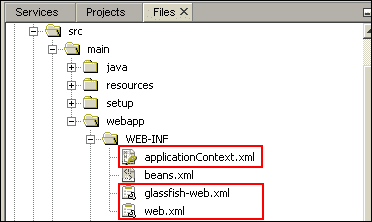

请注意，`beans.xml`文件是由 NetBeans 创建的，但不是我们配置所必需的。现在让我们详细查看这些文件。

## Spring applicationContext.xml 文件

`applicationContext.xml`文件配置 Spring 容器，与我们在第五章中创建的`testingContext.xml`文件非常相似。文件的内容如下：

```java
<?xml version="1.0" encoding="UTF-8"?>
<beans 

  xsi:schemaLocation="
      http://www.springframework.org/schema/beans
      http://www.springframework.org/schema/beans/spring-beans-3.2.xsd
  http://www.springframework.org/schema/context
  http://www.springframework.org/schema/context/spring-context-3.2.xsd
  http://www.springframework.org/schema/tx
  http://www.springframework.org/schema/tx/spring-tx-3.2.xsd">
    <bean id="loadTimeWeaver" 
class="org.springframework.instrument.classloading.glassfish.GlassFishLoadTimeWeaver" />
    <bean id="entityManagerFactory" 
        p:persistenceUnitName="tttPU"
class="org.springframework.orm.jpa.LocalContainerEntityManagerFactoryBean" 
    />

    <!-- Transaction manager for JTA  -->
    <tx:jta-transaction-manager />
    <!-- enable the configuration of transactional behavior based on annotations -->
    <tx:annotation-driven />

    <!-- checks for @Autowired beans -->
    <context:annotation-config/>    

    <!-- Scan for Repository/Service annotations -->
    <context:component-scan base-package="com.gieman.tttracker.dao"/>
    <context:component-scan base-package="com.gieman.tttracker.service"/>
</beans>
```

此文件用于 Spring 初始化和配置 JPA `EntityManagerFactory`和`TransactionManager` DAO 和 Service 层对象。将`applicationContext.xml`文件与`testingContext.xml`文件进行比较，可以确定简单 Java 容器和企业应用服务器提供的 Java EE 容器之间的关键差异：

+   数据源通过**JNDI**（**Java 命名和目录接口**）从 GlassFish 应用服务器中检索，并且不是由 Spring 在`applicationContext.xml`文件中创建或管理。`persistence.xml`文件中的 JNDI 配置设置在本章后面定义。

+   加载时间织入器是特定于 GlassFish 的。

+   事务管理器是基于**JTA**（**Java 事务 API**）的，并由 GlassFish 服务器提供。它不是由 Spring 创建或管理的。`<tx:jta-transaction-manager />`和`<tx:annotation-driven />`定义是配置 Spring 容器内的事务行为所需的全部内容。

### 注意

您应该熟悉剩余的配置属性。请注意，组件扫描针对`dao`和`service`包执行，以确保在这些类中自动装配 Spring bean。

当 Spring 容器加载`applicationContext.xml`文件时，第七章中定义的 MVC 配置类会通过类路径扫描自动发现，并加载以配置 Web 应用程序组件。

## web.xml 文件

`web.xml` Web 应用程序部署描述符文件代表 Java Web 应用程序的配置。它用于配置 Servlet 容器并将 URL 映射到每个配置的 Servlet。每个 Java Web 应用程序在 Web 应用程序根目录的`WEB-INF`目录中必须有一个`web.xml`。

3T Web 应用程序需要以下`web.xml`定义：

```java
<?xml version="1.0" encoding="UTF-8"?>
<web-app version="3.0"   xsi:schemaLocation="http://java.sun.com/xml/ns/javaee http://java.sun.com/xml/ns/javaee/web-app_3_0.xsd">
    <context-param>
        <param-name>contextConfigLocation</param-name>
        <param-value>/WEB-INF/applicationContext.xml</param-value>
    </context-param>
    <listener>
        <listener-class>
            org.springframework.web.context.ContextLoaderListener
        </listener-class>
    </listener>
    <session-config>
        <session-timeout>30</session-timeout>
        <cookie-config>
            <name>JSESSIONID_3T</name>
        </cookie-config>
    </session-config>
    <welcome-file-list>
        <welcome-file>index.html</welcome-file>
    </welcome-file-list>
</web-app>
```

以下是一些关键点：

+   定义`contextConfigLocation`值的`context-param`元素是可选的，如果 Spring 配置文件命名为`applicationContext.xml`（如果未提供，则这是预期的默认文件名）。但是，为了完整起见，我们总是包括此属性。它定义了主 Spring 配置文件的位置。

+   使用类`org.springframework.web.context.ContextLoaderListener`的监听器由 Spring 用于初始化加载应用程序上下文。这是启动 Spring 容器的入口点，并尝试加载`contextConfigLocation`文件。如果无法解析或无效，则会抛出异常。

+   `session-config`属性定义会话超时（30 分钟的不活动时间）和会话 cookie 名称。

+   `welcome-file-list`标识 GlassFish 将提供的文件，如果在 URL 中未明确指定。

## glassfish-web.xml 文件

`glassfish-web.xml`文件配置 GlassFish 与 GlassFish 服务器特定的其他 Web 应用程序属性：

```java
<?xml version="1.0" encoding="UTF-8"?>
<!DOCTYPE glassfish-web-app PUBLIC "-//GlassFish.org//DTD GlassFish Application Server 3.1 Servlet 3.0//EN" "http://glassfish.org/dtds/glassfish-web-app_3_0-1.dtd">
<glassfish-web-app>
<context-root>/</context-root>
</glassfish-web-app>
```

`context-root`属性标识部署的 Web 应用程序的服务器路径。我们将 3T 应用程序部署到服务器的上下文根。这意味着 3T 请求处理程序可以直接从 Web 应用程序的根目录访问，如下例所示：

`/ttt/company/findAll.json`

将`context-root`属性更改为`/mylocation`，例如，将需要以下格式的 URL：

`/mylocation/ttt/company/findAll.json`

# 配置 Maven 的 pom.xml 文件

在前几章中尝试依赖项和插件时，可能已更改了各种`pom.xml`设置。现在重访此文件并确认构建和部署项目的属性是否正确非常重要。您应该具有以下基本的`pom.xml`配置：

```java
<?xml version="1.0" encoding="UTF-8"?>
<project   xsi:schemaLocation="http://maven.apache.org/POM/4.0.0 http://maven.apache.org/xsd/maven-4.0.0.xsd">
    <modelVersion>4.0.0</modelVersion>

    <groupId>com.gieman</groupId>
    <artifactId>task-time-tracker</artifactId>
    <version>1.0</version>
    <packaging>war</packaging>
    <name>task-time-tracker</name>
    <properties>
        <endorsed.dir>
            ${project.build.directory}/endorsed
        </endorsed.dir>
        <project.build.sourceEncoding>
            UTF-8
        </project.build.sourceEncoding>
        <spring.version>3.2.4.RELEASE</spring.version>
        <logback.version>1.0.13</logback.version>
    </properties>
    <dependencies>
        <dependency>
            <groupId>org.eclipse.persistence</groupId>
            <artifactId>javax.persistence</artifactId>
            <version>2.1.0-SNAPSHOT</version>
            <scope>provided</scope>
        </dependency>
        <dependency>
            <groupId>org.eclipse.persistence</groupId>
            <artifactId>eclipselink</artifactId>
            <version>2.5.0-SNAPSHOT</version>
            <scope>provided</scope>
        </dependency>        
        <dependency>
            <groupId>org.eclipse.persistence</groupId>
            <artifactId>
                org.eclipse.persistence.jpa.modelgen.processor
            </artifactId>
            <version>2.5.0-SNAPSHOT</version>
            <scope>provided</scope>
        </dependency>
        <dependency>
            <groupId>javax</groupId>
            <artifactId>javaee-web-api</artifactId>
            <version>7.0</version>
            <scope>provided</scope>
        </dependency>
        <dependency>
            <groupId>ch.qos.logback</groupId>
            <artifactId>logback-classic</artifactId>
            <version>${logback.version}</version>
        </dependency>    
        <dependency>
            <groupId>junit</groupId>
            <artifactId>junit</artifactId>
            <version>4.11</version>
            <scope>test</scope>
        </dependency>        
        <dependency>
            <groupId>mysql</groupId>
            <artifactId>mysql-connector-java</artifactId>
            <version>5.1.26</version>
            <scope>provided</scope>
        </dependency>            
        <dependency>
            <groupId>org.springframework</groupId>
            <artifactId>spring-context</artifactId>
            <version>${spring.version}</version>
        </dependency>
        <dependency>
            <groupId>org.springframework</groupId>
            <artifactId>spring-context-support</artifactId>
            <version>${spring.version}</version>
        </dependency>
        <dependency>
            <groupId>org.springframework</groupId>
            <artifactId>spring-tx</artifactId>
            <version>${spring.version}</version>
        </dependency>
        <dependency>
            <groupId>org.springframework</groupId>
            <artifactId>spring-jdbc</artifactId>
            <version>${spring.version}</version>
        </dependency>
        <dependency>
            <groupId>org.springframework</groupId>
            <artifactId>spring-orm</artifactId>
            <version>${spring.version}</version>
        </dependency>
        <dependency>
            <groupId>org.springframework</groupId>
            <artifactId>spring-instrument</artifactId>
            <version>${spring.version}</version>
        </dependency>
        <dependency>
            <groupId>org.springframework</groupId>
            <artifactId>spring-webmvc</artifactId>
            <version>${spring.version}</version>
        </dependency>
        <dependency>
            <groupId>org.springframework</groupId>
            <artifactId>spring-test</artifactId>
            <version>${spring.version}</version>
            <scope>test</scope>
        </dependency>

    </dependencies>

    <build>
        <plugins>
            <plugin>
                <groupId>org.apache.maven.plugins</groupId>
                <artifactId>maven-compiler-plugin</artifactId>
                <version>3.1</version>
                <configuration>
                    <source>1.7</source>
                    <target>1.7</target>
                    <compilerArguments>
                        <endorseddirs>
                            ${endorsed.dir}
                        </endorseddirs>
                    </compilerArguments>
                </configuration>
            </plugin>
            <plugin>
                <groupId>org.apache.maven.plugins</groupId>
                <artifactId>maven-war-plugin</artifactId>
                <version>2.3</version>
                <configuration>
                  <warName>${project.build.finalName}</warName>
                  <failOnMissingWebXml>false</failOnMissingWebXml>
                </configuration>
            </plugin>
            <plugin>
                <groupId>org.apache.maven.plugins</groupId>
                <artifactId>maven-dependency-plugin</artifactId>
                <version>2.6</version>
                <executions>
                    <execution>
                        <id>copy-endorsed</id>
                        <phase>validate</phase>
                        <goals>
                            <goal>copy</goal>
                        </goals>
                        <configuration>
                            <outputDirectory>
                                ${endorsed.dir}
                            </outputDirectory>
                            <silent>true</silent>
                            <artifactItems>
                                <artifactItem>
                                    <groupId>javax</groupId>
                                    <artifactId>
                                        javaee-endorsed-api
                                    </artifactId>
                                    <version>7.0</version>
                                    <type>jar</type>
                                </artifactItem>
                            </artifactItems>
                        </configuration>
                    </execution>
                    <execution>
                        <id>copy-all-dependencies</id>
                        <phase>compile</phase>
                        <goals>
                            <goal>copy-dependencies</goal>
                        </goals>
                        <configuration>
                            <outputDirectory>
                                ${project.build.directory}/lib
                            </outputDirectory>
                            <includeScope>compile</includeScope>
                        </configuration>                        
                    </execution>                  
                </executions>
            </plugin>
            <plugin>
                <groupId>org.apache.maven.plugins</groupId>
                <artifactId>maven-surefire-plugin</artifactId>
                <version>2.14.1</version>
                <configuration>
                    <skipTests>true</skipTests>
                    <includes>
                        <include>**/dao/*Test.java</include>
                        <include>**/service/*Test.java</include>
                    </includes>
                    <argLine>
-javaagent:target/lib/spring-instrument-${spring.version}.jar
                    </argLine>
                </configuration>
            </plugin>            

        </plugins>
    </build>
    <repositories>
        <repository>
          <url>
            http://download.eclipse.org/rt/eclipselink/maven.repo/
          </url>
          <id>eclipselink</id>
          <layout>default</layout>
          <name>
            Repository for library EclipseLink (JPA 2.1)
          </name>
        </repository>
    </repositories>
</project>
```

在反向工程过程中添加了几个依赖项，还添加了 EclipseLink 的`<repository>`定义。只需要进行一些更改：

+   **添加 MySQL 连接器**：应使用最新版本的`mysql-connector-java`依赖项。GlassFish 不提供 MySQL 连接器，并且将在本章后面的某个部分中将其复制到应用程序服务器中。范围设置为`provided`，以便在构建 WAR 文件时不包括此 JAR。

+   **关闭 Surefire 测试插件**：如果在构建过程中关闭测试，您的部署速度将会更快。将`maven-surefire-plugin`条目的`skipTests`更改为`true`。这将在本地构建和部署项目时跳过测试阶段。

### 注意

构建企业应用程序通常在专用的构建服务器上执行，该服务器执行测试用例并报告构建过程的成功或失败。禁用测试阶段应该只在开发人员的机器上进行，以加快构建和部署过程。开发人员不希望在每次更改类时等待 30 分钟来执行测试套件。测试阶段不应该在构建服务器上被禁用执行。

# 将 eclipselink.target-server 添加到 persistence.xml 文件

`persistence.xml`文件需要包含`eclipselink.target-server`属性才能完全启用事务行为。位于`src/main/resources/META-INF`的`persistence.xml`文件应如下所示：

```java
<?xml version="1.0" encoding="UTF-8"?>
<persistence version="2.1" 

  xsi:schemaLocation="http://xmlns.jcp.org/xml/ns/persistence
  http://xmlns.jcp.org/xml/ns/persistence/persistence_2_1.xsd">

  <persistence-unit name="tttPU" transaction-type="JTA">
    <provider>
        org.eclipse.persistence.jpa.PersistenceProvider
    </provider>
    <jta-data-source>jdbc/tasktimetracker</jta-data-source>
    <exclude-unlisted-classes>false</exclude-unlisted-classes>
    <properties>
        <property name="eclipselink.target-server"
            value="SunAS9"/>
        <property name="eclipselink.logging.level" 
            value="INFO"/>
    </properties>
  </persistence-unit>
</persistence>
```

如果没有此添加，您的应用程序将无法使用事务。`eclipselink.logging.level`也可以更改以根据需要增加或减少日志输出。

# 将 logback.xml 文件添加到资源目录

`logback.xml`文件应该添加到`src/main/resources/`中，以便启用应用程序的日志记录。该文件的内容与测试`logback.xml`文件相同，如下所示：

```java
<?xml version="1.0" encoding="UTF-8"?>
<configuration scan="true" scanPeriod="30 seconds" >
    <contextName>TaskTimeTracker</contextName>
    <appender name="STDOUT"
        class="ch.qos.logback.core.ConsoleAppender">
        <encoder>
          <pattern>
           %d{HH:mm:ss.SSS} [%thread] %-5level %logger{5} - %msg%n
          </pattern>
        </encoder>
    </appender>
    <logger name="com.gieman.tttracker"
        level="DEBUG" additivity="false">
        <appender-ref ref="STDOUT" />
    </logger>
    <logger name="com.gieman.tttracker.dao"
        level="DEBUG" additivity="false">
        <appender-ref ref="STDOUT" />
    </logger>
    <logger name="com.gieman.tttracker.domain"
        level="DEBUG" additivity="false">
        <appender-ref ref="STDOUT" />
    </logger>
    <logger name="com.gieman.tttracker.service"
        level="DEBUG" additivity="false">
        <appender-ref ref="STDOUT" />
    </logger>
    <logger name="com.gieman.tttracker.web"
        level="DEBUG" additivity="false">
        <appender-ref ref="STDOUT" />
    </logger>
    <root level="INFO">
        <appender-ref ref="STDOUT" />
    </root>
</configuration>
```

# 配置 GlassFish 服务器

NetBeans 捆绑的 GlassFish 4 服务器在首次运行项目时会自动配置。这意味着根据项目的当前状态动态设置所需的任何资源。所有这些属性都会被复制到`setup`目录中的`glassfish-resources.xml`文件中，如下截图所示：

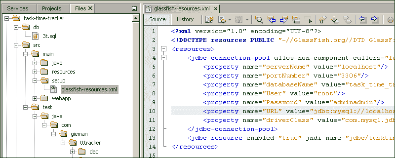

在数据库反向工程过程中，`glassfish-resources.xml`文件被修改以包括 JPA 所需的数据库连接池和 JDBC 资源。因此，该文件的内容定义了所需的 GlassFish 连接池详细信息。

重要的是要了解，此文件由 NetBeans 用于动态配置分配给项目的 GlassFish 服务器。在现实世界的情况下，GlassFish 服务器是由管理员配置的，并且部署 Web 应用程序是通过命令行或通过 GlassFish 管理控制台完成的。在正常的企业环境中，您不会通过 NetBeans 部署应用程序，因此非常有必要对 GlassFish 从最基本的原则进行配置有一个基本的了解。本节专门用于配置用于 3T 的 GlassFish 服务器连接池。虽然在 NetBeans 上运行 3T 并不严格要求这样做，但我们强烈建议您花时间通过以下步骤完全配置您的 GlassFish 服务器。

这将确保您了解在不同物理服务器上为运行 3T 应用程序配置 GlassFish 服务器所需的内容。

1.  配置 GlassFish 服务器的第一步是执行**清理和构建**：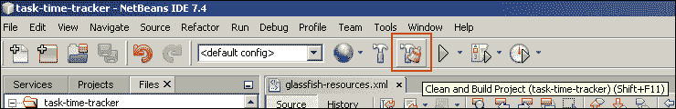

1.  构建完成后，导航到`target/lib`，如下截图所示，以查看项目所需的 JAR 文件：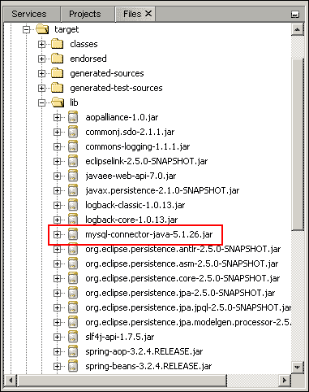

1.  打开文件资源管理器窗口（Windows 资源管理器或 OS X Finder），导航到此目录，并将`mysql-connector-java-5.1.26.jar`文件复制到您的 GlassFish 域`libs`目录，如下截图所示：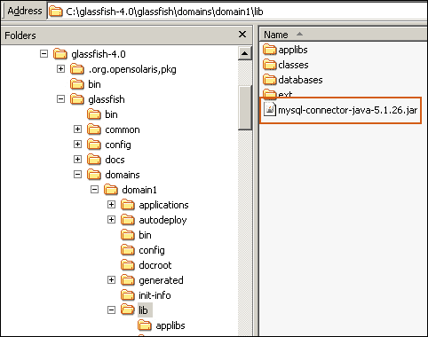

## 重命名 setup 目录

`src/main/`目录中的`setup`目录包含`glassfish-resources.xml`文件，应将其重命名以确保 NetBeans 不会动态配置 GlassFish 的这些属性。我们建议将目录重命名为`setup-original`。

## 在 NetBeans 中启动 GlassFish 服务器

导航到**服务**选项卡；通过右键单击**GlassFish Server 4.0**节点，选择如下截图所示的**启动**：

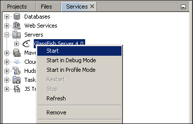

您应该在 NetBeans IDE 底部看到服务器输出，并重新加载 GlassFish Server 4.0 节点。现在，您可以右键单击**GlassFish Server 4.0**节点，并选择**查看域管理控制台**：

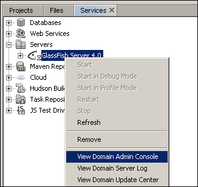

这将启动您的默认浏览器并加载**域管理控制台**。

## 配置 JDBC 连接池

本节将使用 GlassFish 管理控制台来配置 3T 应用程序所需的 JDBC 连接池和 JDBC 资源。

1.  打开**资源**节点，并导航到**JDBC 连接池**选项卡：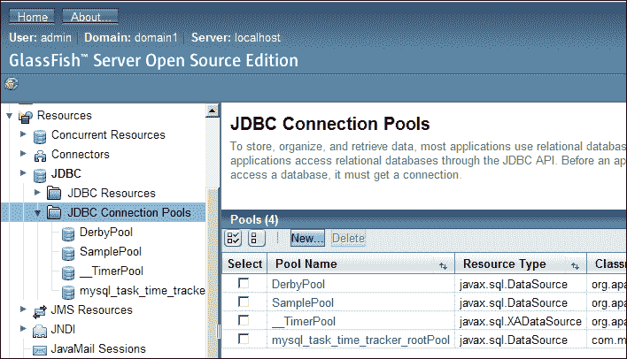

### 注意

您可能会看到一个名为`mysql_task_time_tracker_rootPool`或类似的连接池，如前面的截图所示。这是由 NetBeans 在以前的运行中使用`glassfish-resources.xml`文件中指定的属性创建的。如果您希望继续使用此连接池，则可以跳过剩余部分。我们建议您删除此条目，并继续遵循以下步骤，以了解如何配置 GlassFish 连接池。

1.  单击**新建**按钮，然后在单击**下一步**按钮之前输入以下详细信息：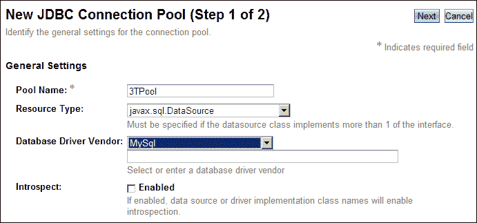

1.  下一个屏幕看起来令人生畏，但只需要输入一些条目。一直向下滚动，直到您可以查看**附加属性**部分：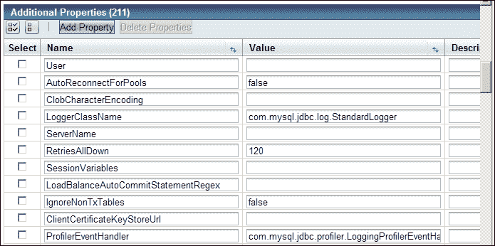

1.  这里有很多属性！幸运的是，除非您熟悉 MySQL 数据库管理，否则只需要一些属性。您可以安全地删除所有列出的属性，以保持配置简单，然后输入与原始`glassfish-resources.xml`文件对应的以下属性：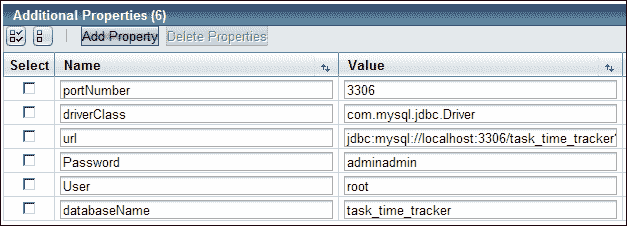

1.  所需的基本字段是**URL**、**用户**和**密码**。保存这些设置将返回到**JDBC 连接池**屏幕：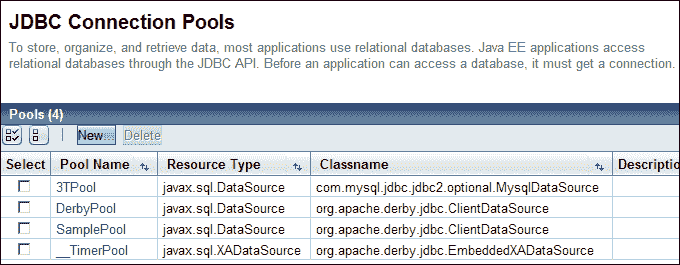

1.  单击**3TPool**名称以再次打开设置，然后单击**Ping**按钮以测试连接。您现在应该看到以下结果：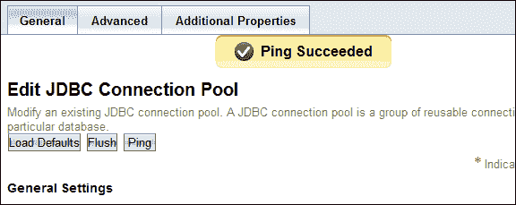

## 配置 JDBC 资源

最后一步是创建**JDBC 资源**。单击此节点以显示配置的资源：

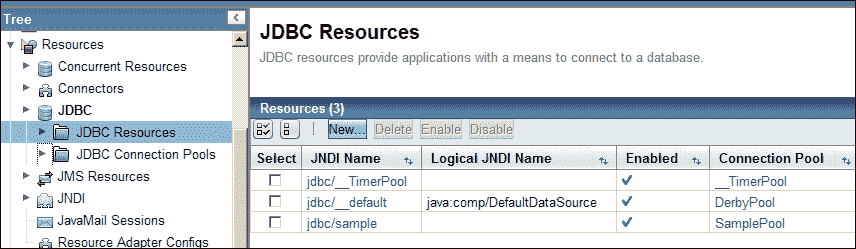

单击**新建…**按钮，然后输入以下详细信息：

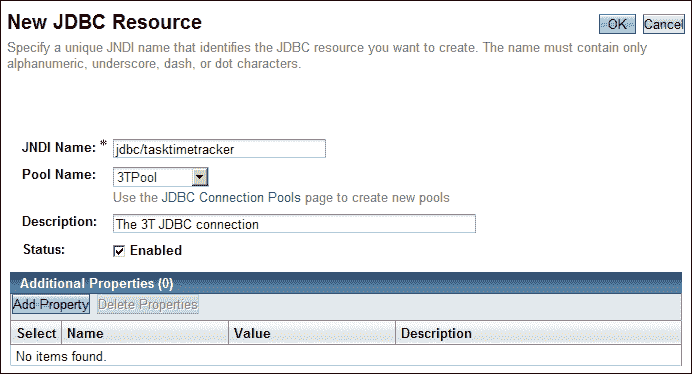

**JNDI 名称**必须与`persistence.xml`文件中定义的`<jta-data-source>`属性相同，因此设置为`jdbc/tasktimetracker`。单击**确定**按钮以保存资源配置。刷新后的节点现在应该显示新创建的资源。

您现在已经完成了 GlassFish JDBC 设置的配置。

# 运行 3T

现在我们建议您停止 GlassFish 并重新启动 NetBeans，以确保之前所做的所有更改在 IDE 中是最新的。最后一步是运行 3T 应用程序：

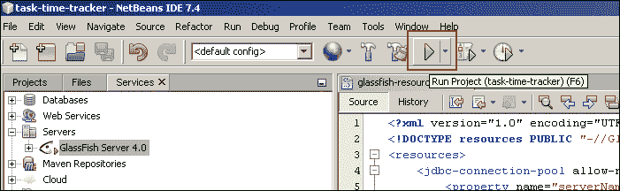

这应该导致大量输出，最终将 3T 应用程序部署到 GlassFish 服务器：

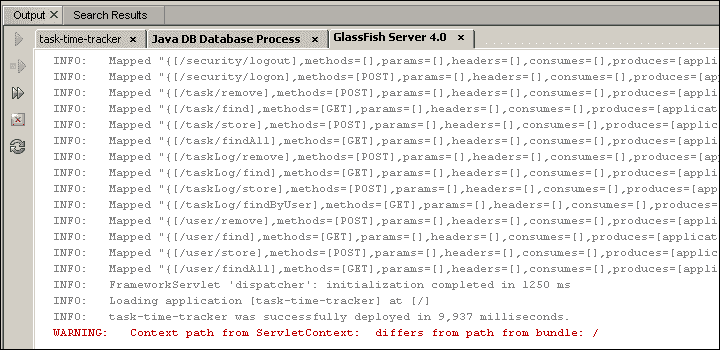

请注意，**GlassFish Server 4.0**输出中的最终**警告**可以忽略；这是在 NetBeans 中从根上下文部署应用程序时的已知问题。

NetBeans 的最后一个操作将是打开您的默认浏览器，显示第一章中显示的欢迎页面，*准备开发环境*。您应该注意浏览器中的 URL 现在是：

`http://localhost:8080/`

而不是原始的：

`http://localhost:8080/task-time-tracker`

这是由`glassfish-web.xml`中的`<context-root>/</context-root>`属性引起的，它定义了 Web 应用程序路径的根。3T Web 应用程序现在部署到上下文根，不需要前缀即可访问已部署的 3T 应用程序。

您现在可以尝试加载一个映射的 URL，例如`/ttt/company/findAll.json`。按照所示在浏览器中输入并按下*Enter*键。您应该看到以下结果：

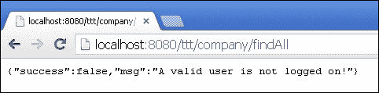

这条消息来自我们在上一章实现的`UserInSessionInterceptor`。会话检查失败，因为我们当前没有登录，将前面的 JSON 消息返回给浏览器。该类中的`logger.info`消息也应该在 GlassFish 输出中可见：

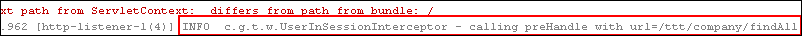

您现在可以尝试使用以下截图中显示的参数进行登录操作：

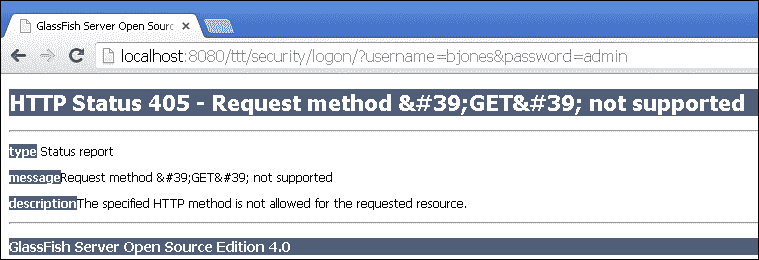

这个结果可能会让你感到惊讶。请求 URL 被映射到`SecurityHandler.logon`方法，该方法在`@RequestMapping`注解中被定义为`method = RequestMethod.POST`。这将限制对该方法的访问仅限于`POST`请求，而浏览器提交的 URL 编码参数是一个`GET`请求。这导致了 GlassFish 返回 405 HTTP 状态消息。在第十章中，*登录和维护用户*，我们将使用适当的`POST`请求来实现登录过程。

您应该注意，所有处理程序 URL 将通过后续章节中开发的 Ext JS 4 应用程序的 AJAX 调用访问。您将不会像之前显示的那样在浏览器中看到这些 URL。

# 在没有 NetBeans 的情况下管理 GlassFish

在 NetBeans 中启动和停止 GlassFish 很容易和方便。然而，在企业环境中，停止/启动过程将由包装`asadmin`实用程序的脚本管理。您可以在*GlassFish 用户管理指南*中找到该实用程序的完整描述，网址为[`glassfish.java.net/docs/4.0/administration-guide.pdf`](https://glassfish.java.net/docs/4.0/administration-guide.pdf)。

`asadmin`实用程序用于从命令行或脚本执行 GlassFish 服务器的管理任务。您可以使用此实用程序代替本章前面使用的 GlassFish 管理控制台界面。几乎可以在管理控制台中执行的每个操作都有一个相应的命令可以使用`asadmin`执行。

`asadmin`实用程序位于`{as-install}/bin`目录中。如果没有提供`asadmin`的完整路径，则应该从该目录中运行命令。要启动域，可以执行以下命令：

```java
asadmin start-domain domain1

```

`domain1`参数表示要启动的域的名称。从 Windows 命令提示符中执行此命令将导致以下输出：

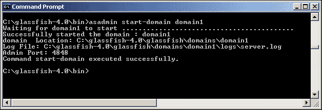

停止运行中的 GlassFish 域同样简单。使用以下命令：

```java
asadmin stop-domain domain1

```

这将导致以下输出：

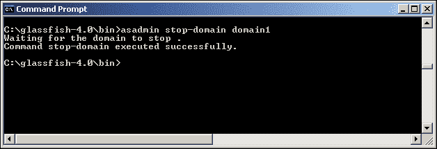

我们将继续在 NetBeans 中启动和停止 GlassFish，但将在第十三章中重新讨论`asadmin`，*将您的应用程序移至生产环境*。

# 总结

本章重点介绍了配置 3T Web 应用程序以部署到 GlassFish 4 服务器所需的步骤。定义了 Spring 配置文件，并配置了`web.xml`文件以在启动时加载 Spring 容器。您将被引导完成 GlassFish 连接池配置过程，并将 3T Web 应用程序部署到 GlassFish 4 服务器的上下文根。

这是我们企业应用程序开发过程中的关键点。我们现在已经完全涵盖了 Java 开发人员的领域，构建了一个功能齐全的后端系统，可以为任何 JSON 客户端提供动态请求。第九章，*开始使用 Ext JS 4*，将介绍强大的 Ext JS 4 框架，并开始我们的前端开发之旅。
