# 第九章：开始使用 Ext JS 4

**Ext JS 4**是迄今为止最复杂的 JavaScript 库，并为几乎所有实际设计问题提供了惊人的小部件集。它可以满足我们开发需要的一切，以开发需要高度用户交互的复杂、跨浏览器兼容的应用程序。在本章中，我们将：

+   了解核心的 Ext JS 4 MVC 概念

+   探索实际项目设计和开发惯例

+   安装 Ext JS 4 开发框架并引入 Sencha Cmd

+   为 3T 应用程序生成一个 Ext JS 4 应用程序骨架

Ext JS 自从作为**Yahoo 用户界面**（**YUI**）库的扩展开始以来已经走过了很长的路。每个新版本都是对上一个版本的重大改进，Ext JS 4 也不例外。对于 Ext JS 的新手来说，他们会欣赏到优雅的框架设计和一致的 API，而那些从 Ext JS 3 过渡过来的人则会欣赏到许多方面的改进，包括 MVC 设计模式的引入。无论你的背景如何，本章都将帮助你在 Ext JS 4 上提高工作效率。

值得注意的是，Ext JS 4 并不是当今唯一可用的 JavaScript MVC 框架。例如，`Angular.js`和`Backbone.js`都是非常有能力的开发框架，具有类似于 Ext JS 4 的 MVC 功能。然而，它们没有 Ext JS 4 那样广泛的文档、构建工具和商业支持，这使得 Ext JS 4 非常适合企业应用程序开发。

# 应用程序设计的重要性

在开发企业应用程序时，除了技术之外，深思熟虑和一致的应用程序设计对于应用程序的可维护性、可扩展性和整体成本至关重要。良好设计的应用程序的好处包括以下几点：

+   应用程序将更容易理解。如果有一致的做事方式，新团队成员将很快上手。

+   应用程序将更容易维护。如果你有一致的应用程序设计准则，增强和新功能的实现将会更简单。

+   代码一致性。一个设计良好的应用程序将有良好的命名约定、目录结构和编码标准。

+   应用程序将更适合多开发人员。在大型项目中，许多人将参与其中，一致的设计策略将确保每个人都在同一页面上。

当你开始一个新项目并兴奋地为概念验证演示制作第一个原型时，往往会忽视一些无形的好处。能够从简单的开始重构和扩展项目往往是企业应用开发的关键因素。无论项目在最初阶段看起来多么小，你可以肯定，一旦业务用户熟悉应用程序，他们就会想要改变工作流程和布局。新功能将被请求，旧功能将被弃用。组件将随着应用程序的演变而移动和重新设计。一个一致和深思熟虑的应用程序设计将使这些项目生命周期过程变得不那么可怕。值得庆幸的是，Ext JS 4 应用程序架构本身鼓励正式和结构良好的应用程序设计。

# Ext JS 4 MVC 概念

当 MVC 设计模式首次在 Ext JS 4 中引入时，它彻底改变了 Ext JS 框架。虽然 MVC 作为一种设计模式是众所周知的，但这是第一次一个复杂的 JavaScript 框架实现了这种策略。以下是一些关键的好处：

+   MVC 设计模式将代码组织成逻辑领域或组件类型，使代码更易于理解

+   MVC 模块化可以简化组件测试和重构，因为每个对象都有明确定义的目的

+   MVC 设计模式架构鼓励更清晰的代码，明确分离数据访问、呈现和业务逻辑。

这些是前一版 Ext JS 3 的巨大优势，那里唯一真正的 MVC 组件是**V**（**视图**）。留给 Ext JS 3 开发人员去构建**M**（**模型**）和**C**（**控制器**）的工作，通常导致混乱和不一致的代码。现在让我们看看 Ext JS 4 如何定义 MVC 设计模式。

## 模型

Ext JS 4 模型是表示领域实体的属性集合。也许不足为奇的是，我们的 3T 应用程序将需要一个`Company`、`Project`、`Task`、`User`和`TaskLog`模型定义，就像它们在我们的 Java 领域层中所表示的那样。与我们的 Java 领域对象的主要区别是，Ext JS 4 模型等效物将具有持久性意识。由于 Ext JS 4 的`data`包，每个模型实例将知道如何持久化和管理其状态。

## 视图

Ext JS 4 视图代表一个逻辑视觉组件块，可能包括面板、工具栏、网格、表单、树和图表。Ext JS 4 视图始终驻留在自己的文件中，并且应尽可能“愚蠢”。这意味着视图中不应该有 JavaScript 业务逻辑；它的目的是呈现数据并为用户提供交互能力。

## 控制器

Ext JS 4 控制器可以被宽泛地描述为将应用程序逻辑粘合在一起的粘合剂。控制器在处理事件处理和跨视图交互方面起着核心作用，并定义应用程序工作流程。绝大多数 JavaScript 业务逻辑代码将驻留在控制器中。

## Ext JS 4 的灵活性

虽然我们对不同的 MVC 组件有清晰的定义，但在 Ext JS 4 框架本身中有相当大的实现灵活性。我们不需要使用控制器或模型；事实上，我们可以轻松地使用在 Ext JS 3 中遵循的相同策略构建一个完全可用的 Ext JS 4 应用程序。然而，这将是一个错误，应该尽量避免。利用 MVC 架构进行企业应用程序开发的好处是显著的，包括但不限于更简单和更健壮的代码库。

# Ext JS 4 设计约定和概念

Sencha Ext JS 4 团队在定义约定方面做了大量工作，您应该考虑遵循这些约定来构建企业应用程序。这些包括标准的目录结构、命名约定和详细的设计最佳实践。我们强烈建议您浏览*Sencha Ext JS 4 文档*网站上的许多教程和指南，以熟悉他们的应用程序设计建议。

本书将遵循 Ext JS 4 团队概述的常见设计策略，对于其相关部分中引入的细微差异进行注释和解释。本书的范围不包括基本的 Ext JS 4 概念，您可能需要参考*Sencha Ext JS 4 文档*来进一步理解。

# 实用约定

一个结构良好的 Ext JS 4 项目，具有一致的命名约定，将是一个令人愉快的工作。拥有数百个文件的企业应用程序应该以易于学习和维护的方式进行结构化。当你问同事，“显示 xyz 小部件的编辑工具栏的文件在哪里？”时，这应该是一个罕见的情况。

## 项目结构

Ext JS 4 的目录结构，包括顶级应用程序和名为`controller`、`model`、`store`和`view`的子目录，应始终使用。这是任何 Ext JS 4 应用程序的默认目录结构，并允许与 Sencha Cmd 构建工具的即插即用集成。

大型项目有数百个 JavaScript 文件，因此拥有一致的项目结构非常重要。实际的命名空间，特别是在`view`目录中，可以简化项目结构，使其更容易找到组件。例如，在第十章 *登录和维护用户*，第十一章 *构建任务日志用户界面*和第十二章 *3T 管理简单*中，我们将创建一个包含以下屏幕截图中显示的文件的`view`结构（在左侧）：

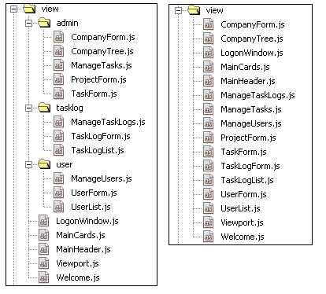

前面的屏幕截图显示了同一目录中的所有视图（在其右侧）。哪种方式更好？这取决于项目的性质和文件数量。企业项目通常在模块级别进行命名空间划分，有许多子目录逻辑地分组相关组件。较小的项目也可以很容易地具有所有文件都在同一目录中的平面结构。无论选择哪种结构，都要保持一致！任何新开发人员都应该很容易找到组件，而不必搜索大量文件和目录。

## 命名约定

我们建议定义一个易于理解和遵循的一致的命名约定。应该很容易在文件系统和您正在使用的 IDE 中找到文件。

### 命名存储和模型

每个模型应该以它所代表的实体的单数形式命名（例如，`Company`、`Project`、`Task`、`TaskLog`和`User`）。每个存储应该以类似的单数方式命名。我们曾在 Ext JS 3 中看到存储名称后缀为`Store`（例如，`ProjectStore`），但这在 Ext JS 4 中不推荐。控制器会自动为每个存储创建一个`get`函数，通过在存储名称后添加`Store`。将存储命名为`ProjectStore`将导致在引用存储的每个控制器中生成一个名为`getProjectStoreStore`的函数。因此，我们建议您在不使用`Store`后缀的情况下使用存储名称。

存储名称通常以其单数形式替换为复数形式。例如，项目存储通常被命名为`Projects`。一致性再次是关键。如果决定使用复数形式，那么每个存储名称都应该使用复数形式。在我们的应用程序中，这将导致`Companies`、`Projects`、`Tasks`、`TaskLogs`和`Users`存储。这有时会导致拼写混淆；我们曾看到`Companies`和`Companys`都用于复数形式的`Company`。当英语不是您的第一语言时，可能很难知道实体的正确复数名称，例如领土、国家、公司、货币和状态。因此，我们更喜欢在命名存储时使用单数形式。

### 命名视图

考虑以下情况，我们一直在研究 Sencha Docs 网站上的面板：

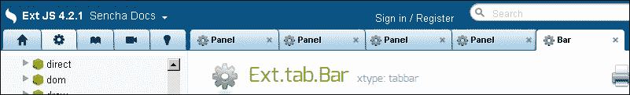

有四个不同的**Panel**文件打开（`Ext.grid.Panel`、`Ext.tab.Panel`、`Ext.form.Panel`和`Ext.panel.Panel`）。在这种情况下，尝试定位`Ext.grid.Panel`文件是令人沮丧的；在最坏的情况下，您将需要点击四个不同的选项卡项。在大型项目中，可能会有许多值得称为`Panel`的面板容器。我们建议为每个文件赋予一个唯一的名称，无论其命名空间如何。与模型和存储不同，模型和存储命名空间使用相同的文件名，我们不建议在视图类之间使用相同的文件名。例如，文件`app.view.user.List`和`app.view.tasklog.List`在 IDE 选项卡栏中很难区分。使这些文件名唯一要容易得多，即使它们可能存在于不同的命名空间中。

后缀类类型的使用是另一个值得讨论的问题。Ext JS 3 在类名后使用了类型后缀。这导致了`GridPanel`、`FormPanel`、`TabPanel`和`Panel`文件名。它们都是面板。通过检查文件名很容易确定类是什么。Ext JS 4 采用了命名空间方法，并放弃了描述性名称。前面的例子变成了`Ext.grid.Panel`、`Ext.tab.Panel`、`Ext.form.Panel`和`Ext.panel.Panel`。每个文件都被命名为`Panel`，如果不知道它所在的目录，这并不是很有帮助。

无论您实施何种命名约定，保持一致是很重要的。我们将使用以下命名约定：

+   所有命名空间文件夹名称都将是小写。

+   用于表示项目列表的任何类都将以`List`结尾。`List`的实现并不重要；我们不在乎列表是使用网格、简单模板还是数据视图创建的。

+   任何表单类都将以`Form`结尾。

+   任何树类都将以`Tree`结尾。

+   任何窗口类都将以`Window`结尾。

+   任何管理一组相关组件的定位和布局的组件都将以`Manage`为前缀。这样的类通常包含适当布局的工具栏、列表、表单和选项卡面板。

您可能希望引入适合您的开发环境的其他约定。这很好；重要的是要保持一致，并确保每个人都理解并遵守您的约定。

### 命名控制器

我们建议所有控制器类的名称都以`Controller`结尾。这样它们在任何 IDE 中都很容易识别。例如，负责用户维护的控制器将被命名为`UserController`。

### 命名 xtype

我们建议对每个类使用小写类名作为`xtype`。这是确保每个视图类的文件名唯一的另一个很好的理由。`UserList`的`xtype`是`userlist`，`UserForm`的`xtype`是`userform`，`ManageUsers`的`xtype`是`manageusers`。不会有混淆。

# Ext JS 4 开发环境

Ext JS 4 开发所需的两个核心组件如下：

+   **Sencha Cmd 工具**：这是一个跨平台的基于 Java 的命令行工具，提供许多选项来帮助管理应用程序的生命周期

+   **Ext JS 4 SDK（软件开发工具包）**：包含所有应用程序开发所需的源文件、示例、资源和压缩脚本

我们现在将检查并安装这些组件。

## 安装 Sencha Cmd

Sencha Cmd 工具可从[`www.sencha.com/products/sencha-cmd/download`](http://www.sencha.com/products/sencha-cmd/download)下载。该文件大小约为 46MB，需要在运行安装过程之前解压缩。

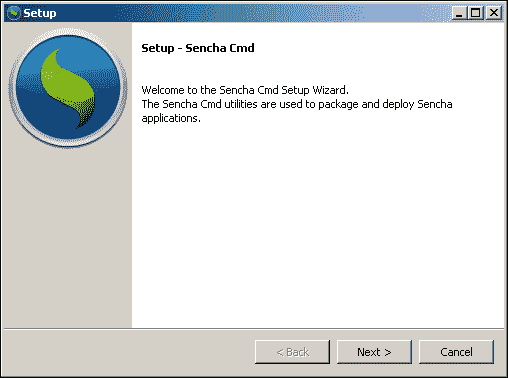

点击“下一步”查看“许可协议”部分。您需要接受协议后才能点击“下一步”按钮：

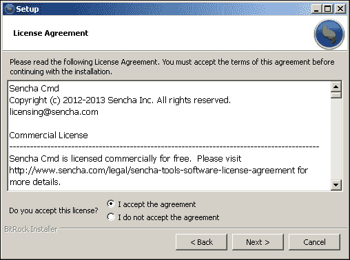

在下面的截图中显示的屏幕提示输入“安装目录”。我们建议您将 Sencha Cmd 工具安装在易于访问的目录中（Mac 用户为`/Users/Shared/`，Windows 用户为`C:\`）：

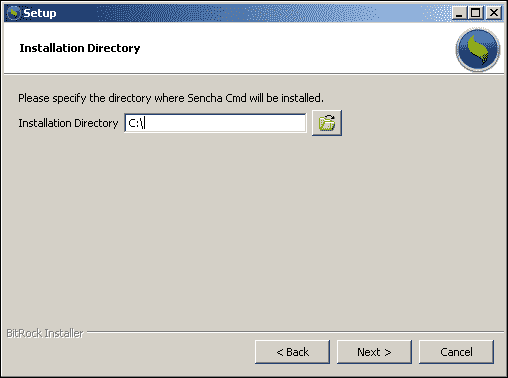

点击“下一步”继续。这将显示一个提示，指示安装程序现在准备开始在您的计算机上安装 Sencha Cmd。再次点击“下一步”继续安装。最后的提示将确认安装 Sencha Cmd：

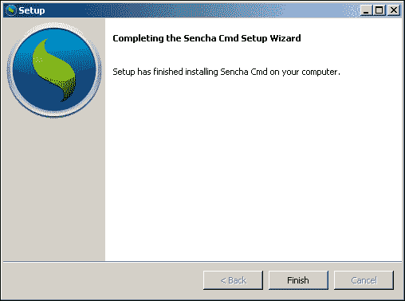

您现在可以查看已安装的文件，如下面的截图所示：

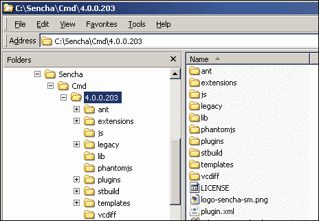

要确认安装，打开命令提示符（Windows）或终端（Mac），输入`sencha`，然后按*Enter*键。这将确认 Sencha Cmd 已添加到系统路径，并应产生类似于以下截图所示的输出：

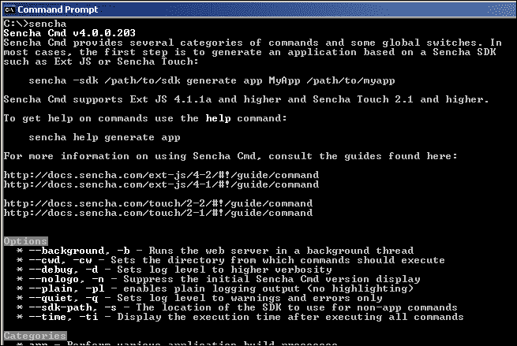

请注意，任何当前打开的控制台/终端窗口都需要关闭并重新打开，以确保重新加载安装路径更改。最后一步是通过输入来检查是否有可用的升级：

```java
sencha upgrade –-check

```

这个命令应该显示一个适当的消息，如下截图所示：

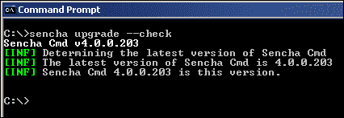

可以通过省略`––check`参数来升级 Sencha Cmd 的版本。有关 Sencha 命令行选项的完整列表，请参阅[`docs.sencha.com/extjs/4.2.2/#!/guide/command`](http://docs.sencha.com/extjs/4.2.2/#!/guide/command)。此页面还包含许多有用的故障排除提示和解释。此外，您还可以通过执行`sencha help`来使用命令行帮助。执行`sencha help`命令将显示详细的帮助选项：

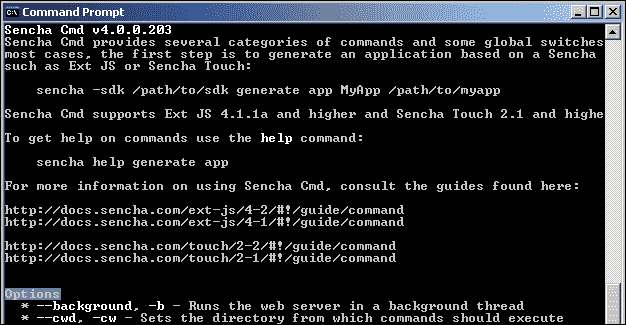

## 安装 Ext JS 4 SDK

SDK 可以从[`www.sencha.com/products/extjs`](http://www.sencha.com/products/extjs)下载。上一步将在以下位置创建一个 Sencha 目录：

+   对于 Windows 用户，`C:\Sencha`

+   对于 Mac 用户，`/Users/Shared/Sencha`

下载 SDK 后，您应该在这个 Sencha 目录中创建一个`ext-xxx`目录，其中`xxx`代表 Ext JS 4 框架的版本。然后，您可以将 SDK 解压缩到此目录中，从而得到以下截图中显示的结构：

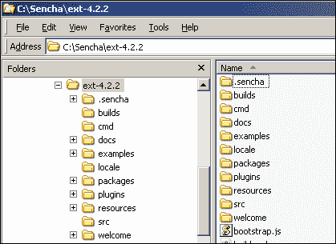

现在，您可以初始化 Ext JS 4 3T 应用程序骨架。

# 生成 3T Ext JS 4 应用程序骨架

骨架生成命令的格式是：

```java
sencha -sdk /path/to/sdk generate app MyApp /path/to/MyApp

```

运行此命令将所有必需的 SDK 文件复制到`/path/to/MyApp`目录，并创建资源的骨架，准备进行开发。您必须为`SDK`和`MyApp`目录使用完整路径。

重要的是要记住 3T 应用程序是一个 Maven 项目，Web 内容根目录是 Maven 目录结构中的`webapp`目录。在第一章中创建的项目文件夹*准备开发环境*和`webapp`目录（在 Windows 上）可以在`C:\projects\task-time-tracker\src\main\webapp`找到。

在 Mac 上，它可以在`/Users/{username}/projects/task-time-tracker/src/main/webapp`找到。

现在可以通过执行以下命令（适用于 Windows 平台）生成 3T 应用程序骨架：

```java
sencha –sdk C:\Sencha\ext-4.2.2 generate app TTT C:\projects\task-time-tracker\src\main\webapp

```

请注意，此命令必须在一行上。`TTT`参数代表应用程序名称，并将用于生成应用程序命名空间。我们可以使用`TaskTimeTracker`，但缩写形式更容易书写！

从终端执行该命令应该会产生大量输出，最后显示一些红色错误：

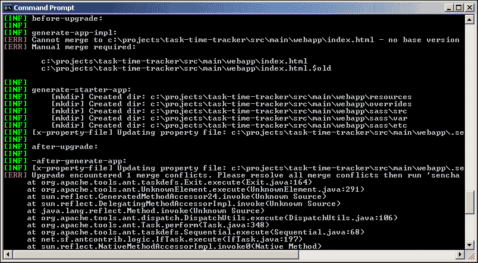

不要太担心**[ERR]**警告；Sencha Cmd 已经识别出`index.html`文件的存在，并用 Sencha Cmd 版本替换了它。原始文件被复制到`index.html.$old`。我们不需要备份文件（它是在 NetBeans 项目创建过程中创建的）；可以安全地删除它。

打开 NetBeans IDE 现在将在 3T 项目的`webapp`目录中显示许多新文件和目录：

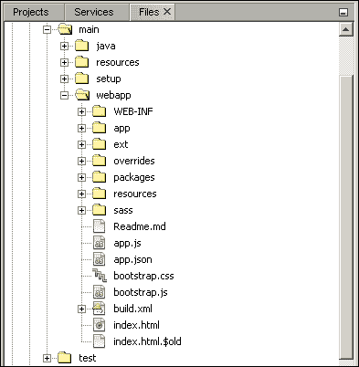

现在，您可以运行项目以在浏览器中查看输出：

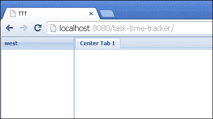

这是由`generate app`命令在构建项目骨架时在`index.html`页面中创建的默认 Ext JS 4 应用程序内容。现在让我们看看已生成的关键文件。

## index.html 文件

`index.html`文件包括以下列表：

```java
<!DOCTYPE HTML>
<html>
<head>
  <meta charset="UTF-8">
  <title>TTT</title>
  <!-- <x-compile> -->
    <!-- <x-bootstrap> -->
      <link rel="stylesheet" href="bootstrap.css">
      <script src="img/ext-dev.js"></script>
      <script src="img/bootstrap.js"></script>
    <!-- </x-bootstrap> -->
    <script src="img/app.js"></script>
  <!-- </x-compile> -->
</head>
<body></body>
</html>
```

请注意页面内容中的`x-compile`和`x-bootstrap`标记。这些标记由 Sencha Cmd 工具使用，并允许编译器识别应用程序根目录中的脚本（默认文件始终为`app.js`）。编译器还会忽略仅在开发过程中使用的框架的引导部分。在生成生产应用程序时，所有所需的文件都将在构建过程中被拉取。这将在第十三章中详细介绍，*将您的应用程序移至生产环境*。

您应该注意，`ext-dev.js`文件是唯一需要的 Ext JS 4 框架资源。该文件用于在开发阶段进行动态 JavaScript 类加载。然后框架将动态检索应用程序所需的任何 JavaScript 资源。

## app.js 和 Application.js 文件

`app.js`文件是应用程序的入口点。文件的内容，包括生成的注释，如下所示：

```java
/*
    This file is generated and updated by Sencha Cmd. You can edit this file as needed for your application, but these edits will have to be merged by Sencha Cmd when upgrading.
*/
Ext.application({
  name: 'TTT',
  extend: 'TTT.Application',
  autoCreateViewport: true
});
```

`Ext.application`扩展了`TTT.Application`类，该类在`app/Application.js`文件中定义如下：

```java
Ext.define('TTT.Application', {
  name: 'TTT',
  extend: 'Ext.app.Application',
  views: [
    // TODO: add views here
  ],
  controllers: [
    // TODO: add controllers here
  ],
  stores: [
    // TODO: add stores here
  ]
});
```

`Application.js`文件将包含我们 3T 应用程序特定的代码。

### 注意

您应该注意，这与之前的 Ext JS 4 教程中描述的设置不同，其中`app.js`文件包含特定于应用程序的属性（视图、控制器、存储和应用程序函数）。之前概述的方法将所有特定于应用程序的代码保留在`app`目录中。

我们对自动生成的`Application.js`文件的第一个更改是添加`launch`函数：

```java
Ext.define('TTT.Application', {
    name: 'TTT',
    extend: 'Ext.app.Application',
    views: [
        // TODO: add views here
    ],
    controllers: [
        // TODO: add controllers here
    ],
    stores: [
        // TODO: add stores here
    ],
    launch: function() {
 Ext.create('TTT.view.Viewport');
 }
});
```

现在我们可以从`app.js`文件中删除`autoCreateViewport:true`，因为创建视图的逻辑现在在`launch`函数中。`launch`函数本身将在下一章中进行增强，以实现用户登录，所以还有很多代码要写！更新后的`app.js`文件如下：

```java
Ext.application({
    name: 'TTT',
    extend: 'TTT.Application'    
});
```

## bootstrap.js 和 bootstrap.css 文件

`bootstrap.js`和`bootstrap.css`文件是由 Sencha Cmd 生成的，不应该被编辑。它们在内部用于初始化和配置开发环境。

## app/Viewport.js 和 app/view/Main.js 文件

Ext JS 4 视图端口是一个容器，它会调整自身大小以使用整个浏览器窗口。`Viewport.js`的定义如下：

```java
Ext.define('TTT.view.Viewport', {
    extend: 'Ext.container.Viewport',
    requires:[
        'Ext.layout.container.Fit',
        'TTT.view.Main'
    ],
    layout: {
        type: 'fit'
    },
    items: [{
        xtype: 'app-main'
    }]
});
```

`items`数组中只添加了一个视图；`TTT.view.Main`函数，其中有一个名为`app-main`的`xtype`函数：

```java
Ext.define('TTT.view.Main', {
    extend: 'Ext.container.Container',
    requires:[
        'Ext.tab.Panel',
        'Ext.layout.container.Border'
    ],
    xtype: 'app-main',
    layout: {
        type: 'border'
    },
    items: [{
        region: 'west',
        xtype: 'panel',
        title: 'west',
        width: 150
    },{
        region: 'center',
        xtype: 'tabpanel',
        items:[{
            title: 'Center Tab 1'
        }]
    }]
});
```

前面的文件定义了在浏览器中显示的两个区域的边框布局和文本内容。

### 注意

对于 Ext JS 视图、xtypes、视图端口、边框布局或面板不太自信？我们建议浏览和审查[`docs.sencha.com/extjs/4.2.2/#!/guide/components`](http://docs.sencha.com/extjs/4.2.2/#!/guide/components)中的基本 Ext JS 4 组件概念。

## app/controller/Main.js 文件

我们将要检查的最终生成的文件是`Main.js`控制器：

```java
Ext.define('TTT.controller.Main', {
    extend: 'Ext.app.Controller'
});
```

这个类中没有功能，因为还没有要控制的东西。

# 使用 Sencha Cmd 创建组件

可以使用 Sencha Cmd 生成骨架组件。其中最有用的命令是用于生成基本模型的命令。

## 生成模型骨架

使用 Sencha Cmd 工具可以非常容易地生成模型骨架。语法如下：

```java
sencha generate model ModelName [field1:fieldType,field2:fieldType…]

```

此命令必须在应用程序根目录（即`app.js`文件所在的目录）中执行。请注意，逗号分隔的字段列表中不得有任何空格。可以通过执行以下命令生成公司模型骨架：

```java
sencha generate model Company idCompany:int,companyName:string

```

对于`companyName`字段，最终的`string`并不是严格要求的，因为默认属性类型是`string`，如果未指定。此命令的输出如下截图所示：

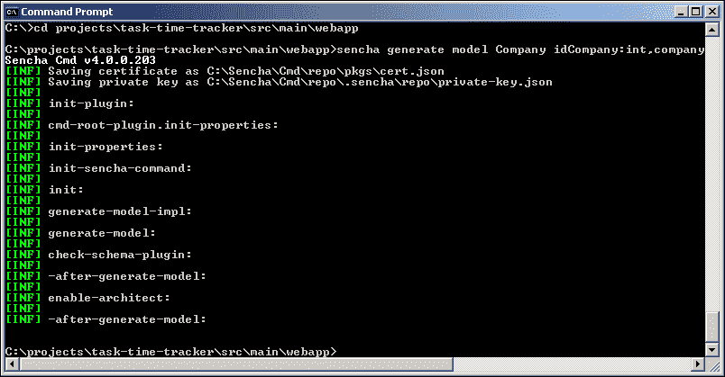

生成的`Company.js`文件写入`app/model`目录，并具有以下内容：

```java
Ext.define('TTT.model.Company', {
    extend: 'Ext.data.Model',
    fields: [
        { name: 'idCompany', type: 'int' },
        { name: 'companyName', type: 'string'}
    ]
});
```

这是一个非常简单的模型，符合预期的有两个字段。我们也可以使用不同的数据类型生成更复杂的模型：

```java
sencha generate model TaskLog idTaskLog:int,taskDescription:string,taskLogDate:date,taskMinutes:int,hours:float,username:string,userFullName:string,idTask:int,taskName:string,idProject:int,projectName:string,idCompany:int,companyName:string

```

上述命令将生成带有`int`、`string`、`date`和`float`类型字段的`TaskLog`模型。

```java
Ext.define('TTT.model.TaskLog', {
    extend: 'Ext.data.Model',    
    fields: [
        { name: 'idTaskLog', type: 'int' },
        { name: 'taskDescription', type: 'string' },
        { name: 'taskLogDate', type: 'date' },
        { name: 'taskMinutes', type: 'int' },
        { name: 'hours', type: 'float' },
        { name: 'username', type: 'string' },
        { name: 'userFullName', type: 'string' },
        { name: 'idTask', type: 'int' },
        { name: 'taskName', type: 'string' },
        { name: 'idProject', type: 'int' },
        { name: 'projectName', type: 'string' },
        { name: 'idCompany', type: 'int' },
        { name: 'companyName', type: 'string' }
    ]
});
```

剩下的三个实体的模型骨架可以通过执行以下命令创建：

```java
sencha generate model Project idProject:int,projectName:string, idCompany:int,companyName:string
sencha generate model Task idTask:int,taskName:string,idProject:int,projectName:string, idCompany:int,companyName:string
sencha generate model User username:string,firstName:string,lastName:string,fullName:string,email:string,password:string,adminRole:string

```

请注意，每个模型都与相应的 Java 域类中`addJson`（`JsonObjectBuilder`）方法生成的 JSON 结构匹配。现在，您应该在`app/model`目录中看到以下截图中显示的文件：

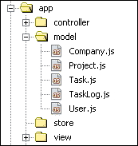

虽然我们使用 Sencha Cmd 工具生成了这些模型骨架，但在 NetBeans IDE 中创建适当的文件和定义同样容易。

## 使用 Sencha Cmd 生成视图和控制器

也可以生成基本的视图和控制器骨架，但这些文件的内容非常有限。以下命令将创建名为`ManageUsers`的视图：

```java
sencha generate view ManageUsers

```

`ManageUsers.js`文件将写入`app/view`目录，并具有以下内容：

```java
Ext.define("TTT.view.ManageUsers", {
    extend: 'Ext.Component',
    html: 'Hello, World!!'
});
```

类似地，您可以为`UserController`创建一个控制器骨架：

```java
sencha generate controller UserController

```

`UserController.js`文件将写入`app/controller`目录，并具有以下内容：

```java
Ext.define('TTT.controller.UserController', {
    extend: 'Ext.app.Controller'
});
```

我们相信在 NetBeans IDE 中创建视图和控制器更简单，因此不会使用 Sencha Cmd 来实现这一目的。

# 摘要

本章已配置了 Ext JS 4 开发环境，并介绍了实用的设计约定和概念。我们已安装了 Sencha Cmd 并生成了 3T 应用程序骨架，检查核心生成的文件以了解推荐的应用程序结构。我们的模型实体已使用 Sencha Cmd 生成，并准备在接下来的章节中进行增强。我们已经为构建 3T 应用程序的前端做好了准备。

在第十章*登录和维护用户*中，我们将开发 Ext JS 4 组件，用于登录 3T 应用程序并维护用户。我们在**用户界面**（**UI**）设计方面的创意之旅刚刚开始！
