# 第十章：登录和维护用户

企业应用程序生命周期中最有创意的部分围绕用户界面设计。作为企业应用程序开发人员，您的目标是创建一个直观、一致且易于使用的用户界面。用户界面设计需要对您可用的工具有深入的了解。幸运的是，Ext JS 4 具有全面的小部件范围，涵盖了任何企业应用程序所需的核心功能。如果您还没有访问示例页面，请立即花些时间熟悉[`docs.sencha.com/extjs/4.2.2/#!/example`](http://docs.sencha.com/extjs/4.2.2/#!/example)上的 Ext JS 4 组件的全部范围。

本章将重点介绍构建登录和用户管理界面。我们将开发一组视图组件，并使用控制器将它们连接起来，以执行以下操作：

+   登录到应用程序

+   显示主应用程序视口

+   提供用户维护界面

用户维护界面将引入用于 CRUD 操作的模型持久性和验证属性。我们有很多工作要做，所以让我们从检查应用程序布局和工作流程开始。

# 布局、屏幕和工作流程

应用程序从显示登录窗口开始。如果登录不成功，您将无法到达主应用程序视口。登录窗口的设计非常简单，如下截图所示：


成功的登录将显示在欢迎屏幕上，如下截图所示：

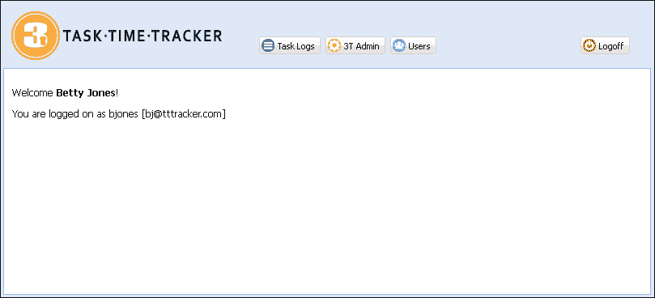

欢迎屏幕在标题中有许多按钮，取决于您的权限。普通用户只会看到**任务日志**按钮和**注销**按钮。管理员用户将看到额外的**3T 管理员**和**用户**按钮。我们将把**3T 管理员**和**任务日志**模块留到后续章节。

用户管理界面基于现代企业应用程序中最常见的设计模式。此布局在左侧面板中显示用户列表，右侧面板显示用户详细信息：

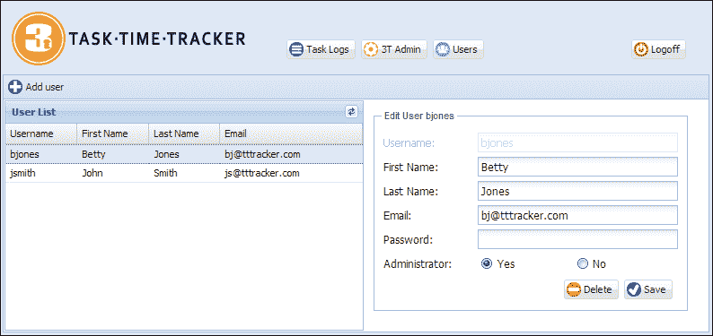

这些屏幕设计中的每个都有图标和标志，这些都不是 Ext JS 框架的一部分。以下各节中的代码将定义适当的样式，但您需要包含所需的资源以实现相同的外观和感觉。包括资源在内的完整源代码可以从本书的网站下载。

## 定义视图组件

在实施线框和 UI 模型时，最难的决定之一是如何分割视图。考虑下面截图中显示的用户维护屏幕：

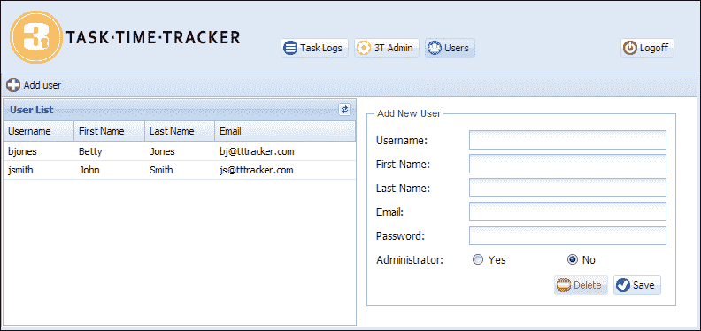

我们应该创建多少个单独的视图？如果创建太多视图，它们将变得难以管理。如果视图太少，我们将失去灵活性。只有通过经验才能找到正确的平衡。我们倾向于鼓励基于布局本身的逻辑区域的中间路线方法。例如，先前的设计可以分成以下视图组件：

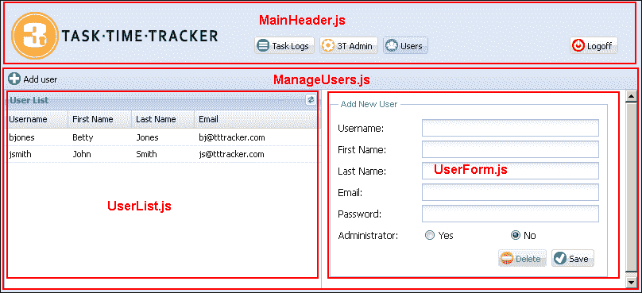

这是我们将要实施的结构。然而，我们可以轻松地实现以下设计：

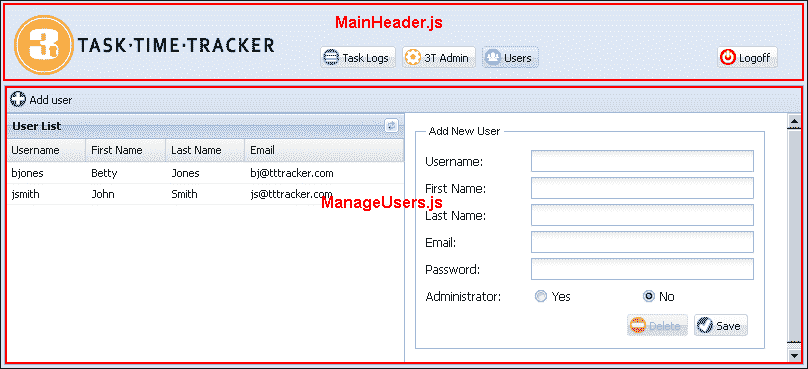

第二个版本将使用单个视图来封装用户网格、表单和工具栏。生成的`ManageUsers.js`文件将大约有 200 行长；从功能角度来看，两种设计之间没有区别。然而，第一种方法给了我们更多的灵活性。我们可以轻松地重新排列页面上的视图或重构界面而不费吹灰之力（例如，将`UserForm`移动到弹出窗口，并允许用户列表填满整个屏幕宽度）。这在第二种设计版本中不会那么容易。

如果有疑问，应该偏向简单。应尽量避免具有数百甚至数千行代码的复杂视图。将视图视为具有特定目的的离散对象，并保持它们简单。

# 构建我们的视图

现在我们有了一些构建视图的实用指南，是时候创建我们的应用程序界面了。用户必须能够成功登录以使用应用程序，因此让我们从登录窗口开始。

## 定义登录窗口

**任务时间跟踪登录**窗口是用户将看到的第一件事，如下截图所示：


登录窗口定义如下所示的代码：

```java
Ext.define('TTT.view.LogonWindow', {
    extend: 'Ext.window.Window',
    xtype: 'logonwindow',
    closable: false,
    iconCls: 'logo-small',
    width: 300,
    bodyPadding: 10,
    title: 'Task Time Tracker Logon',
    requires: ['Ext.form.field.Text'],
    initComponent: function() {
        var me = this;
        Ext.applyIf(me, {
            items: [{
                xtype: 'textfield',
                fieldLabel: 'User Name',
                name: 'username',
                allowBlank: false,
                validateOnBlur: true,
                emptyText: 'Enter a Username'
            }, {
                xtype: 'textfield',
                name: 'password',
                fieldLabel: 'Password',
                inputType: 'password',
                validateOnBlur: true,
                allowBlank: false
            }, {
                xtype: 'toolbar',
                ui: 'footer',
                layout: {
                    pack: 'end',
                    type: 'hbox'
                },
                items: [{
                    xtype: 'button',
                    text: 'Logon'
                }]
            }]
        });
        me.callParent(arguments);
    }
});
```

这个窗口定义扩展了`Ext.window.Window`，并添加了两个文本字段和登录按钮。`LogonWindow`类被命名空间为`view`，因此将驻留在`app/view`目录中。定义的`xtype`属性是类名的小写版本，并将在控制器中用于引用`LogonWindow`实例。

### 注意

`xtype`属性是一个类的符号名称（别名或快捷方式）。`xtype`属性是 Ext JS 中一个强大的概念，允许组件被配置，但不渲染，直到拥有容器认为有必要。可以在这里找到关于组件通过`xtype`进行延迟初始化的完整解释：[`docs.sencha.com/extjs/4.2.2/#!/guide/components`](http://docs.sencha.com/extjs/4.2.2/#!/guide/components)。

MVC 设计模式鼓励 Ext JS 4 开发人员在控制器层实现业务逻辑，将视图作为哑对象。我们在这个窗口中应用的唯一元逻辑是`allowBlank:false`属性与`validateOnBlur:true`的组合。这将在用户在不输入文本的情况下移开字段时给出视觉提示。

### 使用`initComponent()`函数

`initComponent`函数是在对象创建期间由构造函数调用的模板函数。模板设计模式允许子类定义特定行为，而不改变基类处理算法的语义。关于这种模式的详细解释可以在这里找到：[`en.wikipedia.org/wiki/Template_method_design_pattern`](http://en.wikipedia.org/wiki/Template_method_design_pattern)。Ext JS 使用模板设计模式允许开发人员在组件生命周期的某些明确定义的阶段指定逻辑。`initComponent`函数可能是最常用的，但还有许多其他模板钩子可以实现。可以在这里找到组件模板函数的完整列表：[`docs.sencha.com/extjs/4.2.2/#!/guide/components`](http://docs.sencha.com/extjs/4.2.2/#!/guide/components)。

`initComponent`函数用于初始化数据、设置配置，并将事件处理程序附加到组件上。对于这个函数（或任何模板函数）的推荐使用模式包括：

+   使用`var me = this`将当前作用域引用为本地闭包变量。在函数中引用对象实例时，到处使用`me`引用。这将有助于通过确保`me`和`this`引用正确的对象作用域来正确处理复杂对象的 JavaScript 闭包。

+   使用`Ext.applyIf`向配置添加特定于类的属性。请注意，我们没有使用`Ext.apply`，它将覆盖已定义的属性；只会复制`me`中不存在的新属性。这确保了基于 xtype 的配置属性优先。

+   通过使用`me.callParent(arguments)`调用父函数来完成`initComponent`函数。

这三点概述了一些高级概念，可能对中级读者来说有点超出范围。如果其中有些内容还不太清楚，不要绝望；遵循设计模式，随着经验的积累，事情会变得更清晰！

## 定义视口

`Viewport`视图使用`vbox`布局将视图分为两个区域，标题和主要内容区域，如下面的屏幕截图所示：

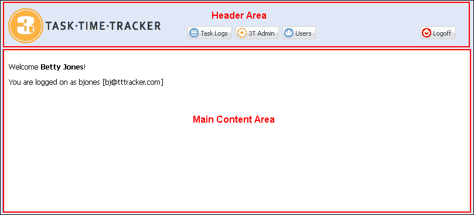

我们可以使用`border`布局来实现相同的视觉效果，但`vbox`布局是一个更轻量级的组件。只有在应用程序需要额外功能，如可展开/可折叠区域或可调整大小的分割视图时才使用`border`布局。

`Viewport`定义如下：

```java
Ext.define('TTT.view.Viewport', {
    extend: 'Ext.container.Viewport',
    cls: 'x-border-layout-ct',
    requires: ['TTT.view.MainHeader', 'TTT.view.MainCards', 'Ext.layout.container.VBox'],
    padding: 5,
    layout: {
        type: 'vbox',
        align: 'stretch'
    },
    items: [{
        xtype: 'mainheader',
        height: 80
    }, {
        xtype: 'maincards',
        flex: 1
    }]
});
```

现在需要定义两个视图：一个用于主标题，另一个用于主区域卡片布局。

### MainHeader.js 视图

`MainHeader`定义并定位了 3T 标志和按钮，如下面的代码所示：

```java
Ext.define('TTT.view.MainHeader', {
    extend: 'Ext.container.Container',
    xtype: 'mainheader',
    requires: ['Ext.toolbar.Toolbar'],
    layout: {
        align: 'stretch',
        type: 'hbox'
    },
    initComponent: function() {
        var me = this;
        Ext.applyIf(me, {
            items: [{
                xtype: 'container',
                cls: 'logo',
                width: 300
            }, {
                xtype: 'toolbar',
                flex: 1,
                ui: 'footer',
                layout: {
                    pack: 'end',
                    padding: '20 20 0 0',
                    type: 'hbox'
                },
                items: [{
                    xtype: 'button',
                    itemId: 'taskLogsBtn',
                    iconCls: 'tasklog',
                    text: 'Task Logs'
                }, {
                    xtype: 'button',
                    itemId: 'taskAdminBtn',
                    iconCls: 'admin',
                    hidden: !TTT.getApplication().isAdmin(),
                    text: '3T Admin'
                }, {
                    xtype: 'button',
                    itemId: 'userAdminBtn',
                    hidden: !TTT.getApplication().isAdmin(),
                    iconCls: 'users',
                    text: 'Users'
                }, '->',
                {
                    xtype: 'button',
                    itemId: 'logoffBtn',
                    iconCls: 'logoff',
                    text: 'Logoff'
                }]
            }]
        });
        me.callParent(arguments);
    }
});
```

每个按钮都定义了一个`itemId`属性，以帮助在控制器中使用选择器唯一标识按钮。两个管理按钮使用`hidden`属性来隐藏按钮，如果用户不是管理员，则使用`TTT.getApplication().isAdmin()`函数。该函数尚未定义，但将在后面的部分中添加到`Application.js`函数中。

### MainCards.js 文件

`MainCards`组件是一个卡片布局容器，包含将在主内容区域中呈现的所有组件，如下面的代码所示：

```java
Ext.define('TTT.view.MainCards', {
    extend: 'Ext.container.Container',
    xtype: 'maincards',
    requires: ['Ext.layout.container.Card', 'TTT.view.Welcome', 'TTT.view.user.ManageUsers'],
    layout: 'card',
    initComponent: function() {
        var me = this;
        Ext.applyIf(me, {
            items: [{
                xtype: 'welcome',
                itemId: 'welcomCard'
            }, {
                xtype: 'manageusers',
                itemId: 'manageUsersCard'
            }]
        });
        me.callParent(arguments);
    }
});
```

随着我们构建功能，我们将向`MainCards`添加项目。在本章中，我们将专注于`Welcome`和`ManageUsers`组件。

## 定义欢迎面板

`Welcome`面板使用`XTemplate`根据已登录用户呈现简单的欢迎消息。用户数据是使用`TTT.getApplication().getUser()`函数从应用程序中检索的，该函数将在成功登录后添加到`Application.js`函数中。

```java
Ext.define('TTT.view.Welcome', {
    extend: 'Ext.panel.Panel',
    xtype: 'welcome',
    requires: ['Ext.XTemplate'],
    initComponent: function() {
        var me = this;
        var tpl = new Ext.XTemplate('<tpl for=".">', '<p>Welcome <b>{fullName}</b>!</p>', '<p>You are logged on as {username} [{email}]</p>', '</tpl>');
        var welcomeHtml = tpl.apply(TTT.getApplication().getUser());
        Ext.applyIf(me, {
            items: [{
                xtype: 'container',
                padding: 10,
                html: welcomeHtml
            }]
        });
        me.callParent(arguments);
    }
});
```

## 定义用户管理组件

用户管理界面由三个视图文件组成，如下面的屏幕截图所示：

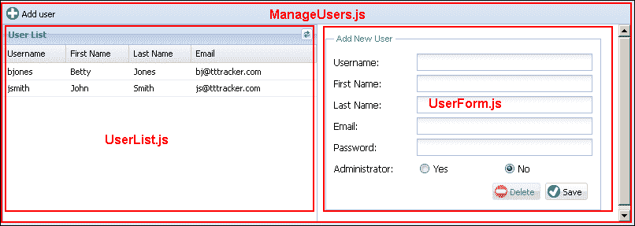

除了视图之外，我们还需要定义一个用户存储，用于管理用户列表中显示的数据。

### ManageUsers.js 文件

`ManageUsers`文件是一个简单的`hbox`布局，显示`UserList`和`UserForm`。工具栏包含单个**添加用户**按钮。该文件有一个非常简单的定义，如下所示：

```java
Ext.define('TTT.view.user.ManageUsers', {
    extend: 'Ext.panel.Panel',
    xtype: 'manageusers',
    requires: ['Ext.toolbar.Toolbar', 'TTT.view.user.UserList', 'TTT.view.user.UserForm'],
    layout: {
        type: 'hbox',
        align: 'stretch'
    },
    initComponent: function() {
        var me = this;
        Ext.applyIf(me, {
            dockedItems: [{
                xtype: 'toolbar',
                dock: 'top',
                items: [{
                    xtype: 'button',
                    itemId: 'addUserBtn',
                    iconCls: 'addnew',
                    text: 'Add user'
                }]
            }],
            items: [{
                xtype: 'userlist',
                width: 400,
                margin: 1
            }, {
                xtype: 'userform',
                flex: 1
            }]
        });
        me.callParent(arguments);
    }
});
```

### UserForm.js 文件

`UserForm.js`文件显示了用户详细信息，如下面的代码所示：

```java
Ext.define('TTT.view.user.UserForm', {
    extend: 'Ext.form.Panel',
    xtype: 'userform',
    requires: ['Ext.form.FieldSet', 'Ext.form.field.Radio', 'Ext.form.RadioGroup', 'Ext.toolbar.Toolbar'],
    layout: {
        type: 'anchor'
    },
    bodyPadding: 10,
    border: false,
    autoScroll: true,
    initComponent: function() {
        var me = this;
        Ext.applyIf(me, {
            items: [{
                xtype: 'fieldset',
                padding: 10,
                width: 350,
                fieldDefaults: {
                    anchor: '100%'
                },
                title: 'User',
                items: [{
                    xtype: 'textfield',
                    name: 'username',
                    fieldLabel: 'Username'
                }, {
                    xtype: 'textfield',
                    name: 'firstName',
                    fieldLabel: 'First Name'
                }, {
                    xtype: 'textfield',
                    name: 'lastName',
                    fieldLabel: 'Last Name'
                }, {
                    xtype: 'textfield',
                    name: 'email',
                    fieldLabel: 'Email'
                }, {
                    xtype: 'textfield',
                    name: 'password',
                    inputType: 'password',
                    fieldLabel: 'Password'
                }, {
                    xtype: 'radiogroup',
                    fieldLabel: 'Administrator',
                    items: [{
                        boxLabel: 'Yes',
                        name: 'adminRole',
                        inputValue: 'Y'
                    }, {
                        boxLabel: 'No',
                        name: 'adminRole',
                        inputValue: 'N'
                    }]
                }, {
                    xtype: 'toolbar',
                    ui: 'footer',
                    layout: {
                        pack: 'end',
                        type: 'hbox'
                    },
                    items: [{
                        xtype: 'button',
                        itemId: 'deleteBtn',
                        iconCls: 'delete',
                        text: 'Delete'
                    }, {
                        xtype: 'button',
                        itemId: 'saveBtn',
                        iconCls: 'save',
                        text: 'Save'
                    }]
                }]
            }]
        });
        me.callParent(arguments);
    }
});
```

每个按钮都有一个`itemId`属性，用于在控制器中唯一标识它们。表单中的每个字段名称与前一章中定义的`User`模型中的字段名称完全匹配。这将允许我们轻松地将用户模型实例加载到表单中。

### UserList.js 文件

`UserList`文件是一个带有以下定义的网格面板：

```java
Ext.define('TTT.view.user.UserList', {
    extend: 'Ext.grid.Panel',
    xtype: 'userlist',
    store: 'User',
    title: 'User List',
    viewConfig: {
        markDirty: false,
        stripeRows: false
    },
    initComponent: function() {
        var me = this;
        Ext.applyIf(me, {
            tools: [{
                type: 'refresh',
                tooltip: 'Refresh user list'
            }],
            columns: [{
                xtype: 'gridcolumn',
                dataIndex: 'username',
                flex: 1,
                text: 'Username'
            }, {
                xtype: 'gridcolumn',
                dataIndex: 'firstName',
                flex: 1,
                text: 'First Name'
            }, {
                xtype: 'gridcolumn',
                flex: 1,
                dataIndex: 'lastName',
                text: 'Last Name'
            }, {
                xtype: 'gridcolumn',
                flex: 2,
                dataIndex: 'email',
                text: 'Email'
            }]
        });
        me.callParent(arguments);
    }
});
```

网格列使用`flex`配置属性来定义每列的相对宽度。因此，`email`列的宽度将是其他列的两倍。

在`viewConfig`中的`markDirty:false`用于在修改单元格值时移除脏单元格指示器。如果没有此属性，即使记录已成功保存，网格也会呈现已更改的单元格值，如下所示：

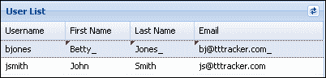

`User`存储尚未定义，所以让我们现在添加它。

### 用户存储

`User` 存储从 `ttt/user/findAll.json` URL 加载用户。这与 `UserHandler.findAll` 方法相对应。读者应该记得，`ttt/前缀` URL 对应于 第七章 中的 `com.gieman.tttracker.web.WebApp.getServletMappings()` 方法中指定的 servlet 映射，*Web 请求处理层*。JSON 数组中的每个用户记录将导致创建一个 `TTT.model.User` 模型实例。存储定义在以下代码中：

```java
Ext.define('TTT.store.User', {
    extend: 'Ext.data.Store',
    requires: ['TTT.model.User'],
    model: 'TTT.model.User',
    proxy: {
        type: 'ajax',
        url: 'ttt/user/findAll.json',
        reader: {
            type: 'json',
            root: 'data'
        }
    }
});
```

`User` 模型在上一章中被定义，目前看起来如下：

```java
Ext.define('TTT.model.User', {
    extend: 'Ext.data.Model',

    fields: [
        { name: 'username', type: 'string' },
        { name: 'firstName', type: 'string' },
        { name: 'lastName', type: 'string' },
        { name: 'fullName', type: 'string' },
        { name: 'email', type: 'string' },
        { name: 'password', type: 'string' },
        { name: 'adminRole', type: 'string' }
    ]
});
```

Ext JS 4 模型是 MVC 框架的关键部分，现在我们将花一些时间学习这些重要的对象。

# 模型和持久性

Ext JS 4 模型类似于 JPA 实体，因为它们定义了表示基础数据库表中列的数据字段。每个模型实例代表表中的一行。使用模型的 `idProperty` 定义主键字段，它必须与字段名称之一匹配。`User` 模型现在可以更新如下：

```java
Ext.define('TTT.model.User', {
    extend: 'Ext.data.Model',

    fields: [
        { name: 'username', type: 'string' },
        { name: 'firstName', type: 'string' },
        { name: 'lastName', type: 'string' },
        { name: 'fullName', type: 'string' },
        { name: 'email', type: 'string' },
        { name: 'password', type: 'string' },
        { name: 'adminRole', type: 'string' }
    ],
  idProperty: 'username'
});
```

## 定义代理

通过配置适当的代理，每个模型都可以被设置为持久感知。然后，当调用模型的 `load`、`save` 或 `destroy` 方法时，所有数据的加载和保存都由代理处理。有几种不同类型的代理，但最常用的是 `Ext.data.ajax.Proxy`（另一个名称是 `Ext.data.AjaxProxy`）。`AjaxProxy` 使用 AJAX 请求从服务器读取和写入数据。请求根据操作以 `GET` 或 `POST` 方法发送。

第二个有用的代理是 `Ajax.data.RestProxy`。`RestProxy` 是 `AjaxProxy` 的一个特例，它将四个 `CRUD` 操作映射到适当的 RESTful HTTP 方法（`GET`、`POST`、`PUT` 和 `DELETE`）。当连接到 RESTful web 服务时，将使用 `RestProxy`。我们的应用程序将使用 `AjaxProxy`。

包括代理在内的 `User` 模型定义如下：

```java
Ext.define('TTT.model.User', {
    extend: 'Ext.data.Model',

    fields: [
        { name: 'username', type: 'string' },
        { name: 'firstName', type: 'string' },
        { name: 'lastName', type: 'string' },
        { name: 'fullName', type: 'string', persist:false },
        { name: 'email', type: 'string' },
        { name: 'password', type: 'string' },
        { name: 'adminRole', type: 'string' }
    ],
    idProperty: 'username',
    proxy: {
        type: 'ajax',
        idParam:'username',
        api:{
            create:'ttt/user/store.json',
            read:'ttt/user/find.json',
            update:'ttt/user/store.json',
            destroy:'ttt/user/remove.json'
        },
        reader: {
            type: 'json',            
            root: 'data'
        },
        writer: {
            type: 'json',
            allowSingle:true,
            encode:true,
            root:'data',
            writeAllFields: true
        }
    }
});
```

代理被定义为类型 `ajax`，并使用 `idParam` 属性指定模型中的主键字段。在生成 `read` 操作的 URL 时使用 `idParam`。例如，如果尝试加载用户名为 `bjones` 的用户记录，则代理将生成以下 URL：

`ttt/user/find.json?username=bjones`

如果省略了 `idParam` 属性，则生成的 URL 将如下所示：

`ttt/user/find.json?id=bjones`

`api` 属性定义了在 CRUD 操作方法上调用的 URL。每个 URL 映射到 `UserHandler` 中的适当处理程序方法。请注意，`update` 和 `create` URL 是相同的，因为这两个操作都由 `UserHandler.store` 方法处理。

重要的是要注意，`AjaxProxy` 的读取操作使用 `GET` 请求，而所有其他操作使用 `POST` 请求。这与 `RestProxy` 方法不同，后者对每个操作使用不同的请求方法。

## 比较 AJAX 和 REST 代理

我们的请求处理层已经设计为以 Ext JS 4 客户端提交的格式消耗 AJAX 请求。处理更新操作的每个处理程序都配置为 `RequestMethod.POST`，并期望包含适用于操作的 JSON 对象的 `data` 参数。

我们可以将请求处理层实现为 RESTful API，其中每个方法都映射到适当的请求方法类型（`GET`、`POST`、`PUT` 或 `DELETE`）。然后，实现删除操作将在 `DELETE` 提交的请求的 URL 中编码项目的 `id`。例如，通过提交以下方式的 DELETE 请求方法 URL，可以删除 `bjones` 用户：

`user/bjones`

然后可以将 `UserHandler.remove` 方法定义为：

```java
@RequestMapping(value = "/user/{username}", 
method=RequestMethod.DELETE)
@ResponseBody
public String remove(final @PathVariable String username, final HttpServletRequest request) {
// code continues…
```

`@PathVariable`从 URL 中提取`username`（在我们的示例 URL 中为`bjones`），然后在调用`userService.remove`方法时使用。`RequestMethod.DELETE`的`@RequestMapping`方法确保只有在提交匹配 URL 路径`/user/{username}`的 DELETE 请求时才执行该方法。

RESTful API 是一种特定的使用 HTTP 的风格，它在 URL 本身中对要检索或操作的项目进行编码（通过其 ID），并在所使用的 HTTP 方法中对要执行的操作进行编码（`GET`用于检索，`POST`用于更改，`PUT`用于创建，`DELETE`用于删除）。Ext JS 中的`Rest`代理是`AjaxProxy`的一个特例，它简单地将四个 CRUD 操作映射到它们的 RESTful HTTP 等效方法。

在 Ext JS 4 中，实现 AJAX 或 REST 替代方案没有显著的差异。配置代理为`type:'ajax'`或`type:'rest'`就足够了。然而，请求处理层需要以非常不同的方式实现来处理`@PathVariable`参数。出于以下原因，我们更喜欢 AJAX 实现：

+   REST 传统上用于服务器间通信，尤其是在 Web 服务中，而不是用于浏览器与服务器的交互。

+   CRUD AJAX 请求的 URL 是唯一的，并且变得自我描述。

+   3T 应用程序不是 Web 服务，而是基于 HTML 5。

+   HTML 5 规范不再支持`PUT`和`DELETE`作为`form`元素的 HTTP 方法（参见[`www.w3.org/TR/2010/WD-html5-diff-20101019/#changes-2010-06-24`](http://www.w3.org/TR/2010/WD-html5-diff-20101019/#changes-2010-06-24)）。

+   REST 不是一种灵活的解决方案，通常基于原子操作（每个请求处理一个项目）。AJAX 和 Ext JS 结合起来允许更复杂的交互，可以进行批量更新（可以对所有创建、更新和销毁 URL 进行多个更新的单个请求）。这将在*定义 writer*部分中进行解释。

+   `PUT`和`DELETE`请求通常被认为是安全风险（除了`OPTIONS`、`TRACE`和`CONNECT`方法），并且通常在企业 Web 应用环境中被禁用。通常需要这些方法的应用程序（例如 Web 服务）通常在安全条件下向有限数量的受信任用户公开这些 URL（通常使用 SSL 证书）。

没有明确或令人信服的理由来使用 AJAX 或 REST。事实上，关于何时使用 REST 而不是 AJAX 的在线讨论非常广泛，而且经常令人困惑。我们选择了我们认为是最简单和最灵活的实现，即使用 AJAX 而不需要 REST。

## 定义 reader

具有类型`json`的`reader`实例化了一个`Ext.data.reader.Json`实例，以解码服务器对操作的响应。它读取 JSON `data`节点（由 reader 的`root`属性标识）并填充模型中的字段值。使用`ttt/user/find.json?username=bjones`对`User`模型执行读取操作将返回：

```java
{
    success: true,
    data: {
        "username": "bjones",
        "firstName": "Betty",
        "lastName": "Jones",
        "fullName": "Betty Jones",
        "email": "bj@tttracker.com",
        "adminRole": "Y"
    }
}
```

然后，reader 将解析 JSON 文件并在模型上设置相应的字段值。

## 定义 writer

具有类型`json`的`writer`实例化了一个`Ext.data.writer.Json`实例，以将发送到服务器的任何请求编码为 JSON 格式。`encode:true`属性与`root`属性结合，定义了保存 JSON 数据的 HTTP 请求参数。这种组合确保一个名为`data`的单个请求参数将保存模型的 JSON 表示。例如，保存先前的`bjones`用户记录将导致提交一个名为`data`的参数，其中包含以下字符串：

```java
{
    "username": "bjones",
    "firstName": "Betty",
    "lastName": "Jones",
    "email": "bj@tttracker.com",
    "password": "thepassword",
    "adminRole": "Y"
}
```

应该注意，此表示已格式化以便阅读；实际数据将是一行字符的字符串。然后将此表示解析为`UserHandler.store`方法中的`JsonObject`：

```java
JsonObject jsonObj = parseJsonObject(jsonData);
```

然后根据需要提取适当的`jsonObject`值。

`writeAllFields`属性将确保在请求中发送模型中的所有字段，而不仅仅是修改过的字段。我们的处理程序方法要求所有模型字段都存在。但是，请注意，我们已将`persist:false`属性添加到`fullName`字段。由于`fullName`字段不是`User`域对象中的持久字段，因此不需要该字段。

需要解释的最终`writer`属性是`allowSingle:true`。这是默认值，确保发送单个记录而不是包装数组。如果您的应用程序执行批量更新（在同一请求中发送多个记录），那么您需要将此属性设置为`false`。这将导致单个记录被发送到数组中，如下面的代码所示：

```java
[{  
    "username": "bjones",
    "firstName": "Betty",
    "lastName": "Jones",
    "email": "bj@tttracker.com",
    "password": "thepassword",
    "adminRole": "Y"
}]
```

3T 应用程序不实现批量更新，并且始终期望每个请求中发送一个单个的 JSON 记录。

## 定义验证

每个模型都内置了验证字段数据的支持。核心验证函数包括`presence`、`length`、`inclusion`、`exclusion`、`format`（使用正则表达式）和`email`的检查。可以通过调用`validate`函数来验证模型实例，该函数返回一个`Ext.data.Errors`对象。然后可以测试`errors`对象以查看是否存在任何验证错误。

`User`模型的验证如下：

```java
validations: [
  {type: 'presence',  field: 'username'},
  {type: 'length', field: 'username', min: 4},
  {type: 'presence',  field: 'firstName'},
  {type: 'length', field: 'firstName', min: 2},
  {type: 'presence',  field: 'lastName'},
  {type: 'length', field: 'lastName', min: 2},
  {type: 'presence',  field: 'email'},
  {type: 'email',  field: 'email'},
  {type: 'presence',  field: 'password'},
  {type: 'length', field: 'password', min: 6},
  {type: 'inclusion', field: 'adminRole', list:['Y','N']}
]
```

`presence`验证确保字段的值存在。`length`验证检查字段大小。我们的验证要求`password`的最小长度为六个字符，`username`的最小长度为四个字符。名字和姓氏的最小长度为两个字符。`inclusion`验证测试以确保字段值是定义列表中的条目之一。因此，我们的`adminRole`值必须是`Y`或`N`中的一个。`email`验证确保电子邮件字段具有有效的电子邮件格式。

现在我们的`User`模型的最终代码清单可以定义为：

```java
Ext.define('TTT.model.User', {
    extend: 'Ext.data.Model',

    fields: [
        { name: 'username', type: 'string' },
        { name: 'firstName', type: 'string' },
        { name: 'lastName', type: 'string' },
        { name: 'fullName', type: 'string', persist:false },
        { name: 'email', type: 'string' },
        { name: 'password', type: 'string' },
        { name: 'adminRole', type: 'string' }
    ],
    idProperty: 'username',
    proxy: {
        type: 'ajax',
        idParam:'username',
        api:{
            create:'ttt/user/store.json',
            read:'ttt/user/find.json',
            update:'ttt/user/store.json',
            destroy:'ttt/user/remove.json'
        },
        reader: {
            type: 'json',            
            root: 'data'
        },
        writer: {
            type: 'json',
            allowSingle:true,
            encode:true,
            root:'data',
            writeAllFields: true
        }
    },
    validations: [
        {type: 'presence',  field: 'username'},
        {type: 'length', field: 'username', min: 4},
        {type: 'presence',  field: 'firstName'},
        {type: 'length', field: 'firstName', min: 2},
        {type: 'presence',  field: 'lastName'},
        {type: 'length', field: 'lastName', min: 2},
        {type: 'presence',  field: 'email'},
        {type: 'email',  field: 'email'},
        {type: 'presence',  field: 'password'},
        {type: 'length', field: 'password', min: 6},
        {type: 'inclusion', field: 'adminRole', list:['Y','N']}
    ]        
});
```

# 控制登录和视口操作

现在我们准备定义将用于处理核心应用程序操作的`MainController`。这些操作包括登录、注销和单击标题按钮以在主内容区域中显示不同的管理面板。

## MainController.js 文件

`MainController.js`的定义如下代码：

```java
Ext.define('TTT.controller.MainController', {
    extend: 'Ext.app.Controller',
    requires: ['Ext.window.MessageBox'],
    views: ['TTT.view.MainHeader', 'TTT.view.MainCards', 'TTT.view.LogonWindow'],
    refs: [{
        ref: 'mainCards',
        selector: 'maincards'
    }, {
        ref: 'usernameField',
        selector: 'logonwindow textfield[name=username]'
    }, {
        ref: 'passwordField',
        selector: 'logonwindow textfield[name=password]'
    }],
    init: function(application) {
        this.control({
            'mainheader button': {
                click: this.doHeaderButtonClick
            },
            'logonwindow button': {
                click: this.doLogon
            }
        });
    },
    doHeaderButtonClick: function(button, e, options) {
        var me = this;
        if (button.itemId === 'userAdminBtn') {
            me.getMainCards().getLayout().setActiveItem('manageUsersCard');
        } else if (button.itemId === 'taskAdminBtn') {
            me.getMainCards().getLayout().setActiveItem('manageTasksCard');
        } else if (button.itemId === 'taskLogsBtn') {
            me.getMainCards().getLayout().setActiveItem('taskLogCard');
        } else if (button.itemId === 'logoffBtn') {
            me.doLogoff();
        }
    },
    doLogon: function() {
        var me = this;
        if (me.getUsernameField().validate() && me.getPasswordField().validate()) {
            Ext.Ajax.request({
                url: 'ttt/security/logon.json',
                params: {
                    username: me.getUsernameField().getValue(),
                    password: me.getPasswordField().getValue()
                },
                success: function(response) {
                    var obj = Ext.JSON.decode(response.responseText);
                    if (obj.success) {
                        TTT.getApplication().doAfterLogon(obj.data);
                    } else {
                        Ext.Msg.alert('Invalid Logon', 'Please enter a valid username and password');
                    }
                }
            });
        } else {
            Ext.Msg.alert('Invalid Logon', 'Please enter a valid username and password');
        }
    },
    doLogoff: function() {
        Ext.Msg.confirm('Confirm Logout', 'Are you sure you want to log out of 3T?', function(button) {
            if (button === 'yes') {
                Ext.Ajax.request({
                    url: 'ttt/security/logout.json',
                    success: function() {
                        window.location.reload();
                    }
                });
            }
        });
    }
});
```

`MainController`负责管理视图配置数组中定义的三个视图：`MainHeader`、`MainCards`和`LogonWindow`。每个`ref`定义了控制器执行操作所需的组件。在控制器初始化期间，`ref`值用于自动创建一个`getter`函数，该函数可用于访问组件。在我们的`MainController`中，`mainCards`的`ref`值将导致创建一个`getMainCards`函数。此函数在`doHeaderButtonClick`函数中用于访问`MainCards`组件。

### 注意

函数的名称应该标识代码定义的核心目的。我们将所有执行操作的函数前缀为`do`。在我们的示例中，任何开发人员都应该清楚`doHeaderButtonClick`函数的目的是什么。

`MainController.init()`函数调用`control()`函数来配置视图中的事件处理。`control()`函数是一种方便的方法，可以在一个操作中分配一组事件侦听器。`mainheader`按钮选择器配置`MainHeader`中所有按钮对象的`click`事件。每当标题中的按钮被点击时，将调用`doHeaderButtonClick`函数。然后，该函数将通过检查`button`参数的`itemId`来确定已单击哪个按钮。然后激活`MainCards`中的适当卡。

### 注意

请注意，我们已经添加了代码来显示`manageTasksCard`和`taskLogCard`，即使它们目前还不可用。这些用户界面将在接下来的章节中开发。

`logonwindow`按钮选择器配置了`LogonWindow`上**登录**按钮的`click`事件。当单击按钮以触发登录过程时，将调用`doLogon`函数。此函数验证`username`和`password`字段，如果两者都有效，则提交 AJAX 请求以验证用户。成功登录将调用`TTT.getApplication().doAfterLogon()`函数，将用户 JSON 数据作为参数传递。

当用户在页眉中单击**注销**按钮时，将触发`doLogoff`函数。系统会向用户提示，如果确认，则会处理`logout`操作。这将在重新加载浏览器窗口之前清除后端的会话，并再次呈现用户`LogonWindow`。

# 控制我们的用户视图

将三个用户视图联系在一起的粘合剂是`UserController`。在这里，我们放置了所有管理用户维护的逻辑。您已经看到，之前定义的每个视图都是愚蠢的，因为只定义了表示逻辑。操作、验证和选择都在`UserController`中处理，并在下面的代码中进行了解释：

```java
Ext.define('TTT.controller.UserController', {
    extend: 'Ext.app.Controller',
    views: ['user.ManageUsers'],
    refs: [{
        ref: 'userList',
        selector: 'manageusers userlist'
    }, {
        ref: 'userForm',
        selector: 'manageusers userform'
    }, {
        ref: 'addUserButton',
        selector: 'manageusers #addUserBtn'
    }, {
        ref: 'saveUserButton',
        selector: 'manageusers userform #saveBtn'
    }, {
        ref: 'deleteUserButton',
        selector: 'manageusers userform #deleteBtn'
    }, {
        ref: 'userFormFieldset',
        selector: 'manageusers userform fieldset'
    }, {
        ref: 'usernameField',
        selector: 'manageusers userform textfield[name=username]'
    }],
    init: function(application) {
        this.control({
            'manageusers #addUserBtn': {
                click: this.doAddUser
            },
            'userlist': {
                itemclick: this.doSelectUser,
                viewready: this.doInitStore
            },
            'manageusers userform #saveBtn': {
                click: this.doSaveUser
            },
            'manageusers userform #deleteBtn': {
                click: this.doDeleteUser
            },
            'manageusers userform': {
                afterrender: this.doAddUser
            },
            'userlist header tool[type="refresh"]': {
                click: this.doRefreshUserList
            }
        });
    },
    doInitStore: function() {
        this.getUserList().getStore().load();
    },
    doAddUser: function() {
        var me = this;
        me.getUserFormFieldset().setTitle('Add New User');
        me.getUsernameField().enable();
        var newUserRec = Ext.create('TTT.model.User', {
            adminRole: 'N'
        });
        me.getUserForm().loadRecord(newUserRec);
        me.getDeleteUserButton().disable();
    },
    doSelectUser: function(grid, record) {
        var me = this;
        me.getUserForm().loadRecord(record);
        me.getUserFormFieldset().setTitle('Edit User ' + record.get('username'));
        me.getUsernameField().disable();
        me.getDeleteUserButton().enable();
    },
    doSaveUser: function() {
        var me = this;
        var rec = me.getUserForm().getRecord();
        if (rec !== null) {
            me.getUserForm().updateRecord();
            var errs = rec.validate();
            if (errs.isValid()) {
                rec.save({
                    success: function(record, operation) {
                        if (typeof record.store === 'undefined') {
                            // the record is not yet in a store 
                            me.getUserList().getStore().add(record);
                        }
                        me.getUserFormFieldset().setTitle('Edit User ' + record.get('username'));
                        me.getUsernameField().disable();
                        me.getDeleteUserButton().enable();
                    },
                    failure: function(rec, operation) {
                        Ext.Msg.alert('Save Failure', operation.request.scope.reader.jsonData.msg);
                    }
                });
            } else {
                me.getUserForm().getForm().markInvalid(errs);
                Ext.Msg.alert('Invalid Fields', 'Please fix the invalid entries!');
            }
        }
    },
    doDeleteUser: function() {
        var me = this;
        var rec = me.getUserForm().getRecord();
        Ext.Msg.confirm('Confirm Delete User', 'Are you sure you want to delete user ' + rec.get('fullName') + '?', function(btn) {
            if (btn === 'yes') {
                rec.destroy({
                    failure: function(rec, operation) {
                        Ext.Msg.alert('Delete Failure', operation.request.scope.reader.jsonData.msg);
                    }
                });
                me.doAddUser();
            }
        });
    },
    doRefreshUserList: function() {
        this.getUserList().getStore().load();
    }
});
```

`UserController`被定义为一个单一视图，用于管理用户，如下面的代码所示：

```java
views: [
  'user.ManageUsers'
]
```

这允许我们使用组件查询语言来定义一组引用，从`manageusers`根选择器开始。因此，我们可以通过选择器引用`UserForm`上的保存按钮：

```java
'manageusers userform #saveBtn'
```

`#saveBtn`指的是`manageusers`组件内`userform`上带有`itemId saveBtn`的组件。

### 注意

只定义控制器用于处理业务逻辑的引用。不要为代码中从未访问的组件创建引用。保持代码简单和清晰！

`init`函数定义了应在界面中处理的监听器。每次按钮点击都与适当的`handler`函数匹配。用户列表`itemclick`事件由`doSelectUser`函数处理。`userlist`上的`viewready`事件触发了网格存储的初始加载。每个监听器事件都由一个具有明确目的的单个函数处理。现在让我们详细检查核心函数。

## doAddUser 函数

当单击**添加用户**按钮时，将调用`doAddUser`函数。我们将表单`fieldset`的标题设置为显示**添加新用户**，然后如下所示启用`username`字段：

```java
me.getUserFormFieldset().setTitle('Add New User');
me.getUsernameField().enable();
```

只有在添加新用户时才启用`username`字段；对于现有用户，`username`字段不可编辑，因为它代表主键。然后，我们创建一个新的 User 模型并将记录加载到用户表单中：

```java
var newUserRec = Ext.create('TTT.model.User', {
    adminRole: 'N'
});
me.getUserForm().loadRecord(newUserRec);
```

此时，用户表单将如下截图所示：

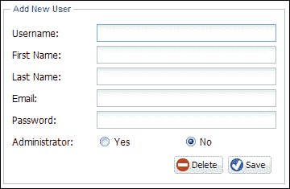

**删除**按钮对于添加新用户没有任何有用的目的，因此我们将其禁用，如下所示：

```java
me.getDeleteUserButton().disable();
```

这给我们带来了以下**添加新用户**界面，如下截图所示：

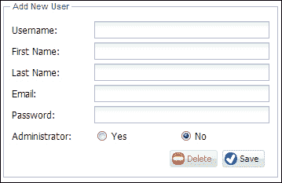

我们也可以选择隐藏删除按钮而不是禁用它；您的方法将取决于客户端的规格。

现在表单已准备好输入新用户。

## doSelectUser 函数

`doSelectUser`函数处理`userlist`网格面板上的`itemclick`事件。此函数的参数是网格本身和所选记录。这使得使用所选用户记录加载表单变得简单：

```java
var me = this;
me.getUserForm().loadRecord(record);
me.getUserFormFieldset().setTitle('Edit User ' + record.data.username);
me.getUsernameField().disable();
me.getDeleteUserButton().enable();
```

`fieldset`标题更改以反映正在编辑的用户，并且`username`字段被禁用。我们还确保**删除**按钮被启用，因为我们需要删除现有记录的选项。点击用户列表中的**Betty Jones**记录将显示以下截图：


### 注意

读者会注意到**密码**字段是空的。这意味着通过表单保存用户记录将需要设置密码。当保存用户时，后端处理程序和服务层也需要有效的密码。在现实世界中，情况并非如此；您不希望管理员每次保存用户详细信息时都更改密码！**更改密码**表单，也许在弹出窗口中，通常会触发单独的 AJAX 请求来更改用户的密码。

现在是时候编写**保存**按钮的操作了。

## doSaveUser 函数

`doSaveUser`函数处理保存用户记录的过程。在大多数应用程序中，`save`函数将包含大部分代码，因为验证和用户反馈是流程中重要的步骤。

第一步是检索在表单中加载的用户记录实例，如下面的代码所示：

```java
var rec = me.getUserForm().getRecord();
```

如果有效，记录将使用表单文本字段中输入的值进行更新，如下面的代码所示：

```java
me.getUserForm().updateRecord();
```

在这个阶段，用户记录将与表单中输入的字段同步。这意味着表单中的所有字段都已复制到模型实例中。现在我们可以验证用户记录，如下面的代码所示：

```java
var errs = rec.validate();
```

如果没有验证错误，记录将使用记录本身的`save()`函数保存。根据返回的 JSON 响应，有两种可能的回调。成功保存将触发成功处理程序，如下面的代码所示：

```java
success: function(record, operation) {
    if (typeof record.store === 'undefined') {
        // the record is not yet in a store 
        me.getUserList().getStore().add(record);
       // select the user in the grid
       me.getUserList().getSelectionModel().select(record,true);
    }
    me.getUserFormFieldset().setTitle('Edit User ' + record.data.username);
    me.getUsernameField().disable();
    me.getDeleteUserButton().enable();
}
```

`success`回调将检查记录是否存在于存储中。如果不存在，记录将被添加到`User`存储并在用户列表中选择。**删除**按钮将被启用，并且`fieldset`标题将被适当设置。

`failure`操作将简单地通知用户原因，如下面的代码所示：

```java
failure: function(rec, operation) {
    Ext.Msg.alert('Save Failure', operation.request.scope.reader.jsonData.msg);
}
```

如果在验证过程中遇到错误，我们会标记无效字段并显示通用错误消息，如下面的代码所示：

```java
me.getUserForm().getForm().markInvalid(errs);
Ext.Msg.alert('Invalid Fields', 'Please fix the invalid entries!');
```

尝试保存一个没有有效电子邮件或密码的用户记录将显示如下消息：

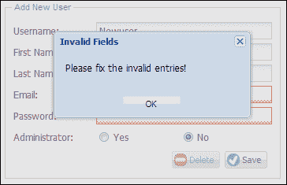

## doDeleteUser 函数

最终处理程序处理删除操作。`doDeleteUser`函数在触发`destroy`函数之前提示用户确认是否需要删除记录：

```java
Ext.Msg.confirm('Confirm Delete User', 'Are you sure you want to delete user ' + rec.data.fullName + '?', function(btn) {
    if (btn === 'yes') {
  rec.destroy({
      failure: function(rec, operation) {
    Ext.Msg.alert('Delete Failure', operation.request.scope.reader.jsonData.msg);
      }
  });
  me.doAddUser();
    }
});
```

`User`存储将自动从存储中删除成功销毁的用户模型。任何失败都会告知用户原因。尝试删除**John Smith**的记录将导致以下代码中显示的消息：

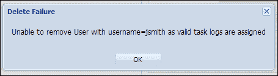

这条消息是从哪里来的？它是在实现删除操作的业务逻辑时编写的服务层`UserServiceImpl.remove`方法生成的。那么试试删除当前登录的用户呢？这将导致以下消息：

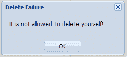

再次强调，这是来自服务层业务逻辑。

# 让我们登录！

现在是时候启用我们的控制器并测试功能了。按照下面的代码更新`Application.js`文件：

```java
Ext.define('TTT.Application', {
    name: 'TTT',
    extend: 'Ext.app.Application',
    requires: ['TTT.view.Viewport', 'TTT.view.LogonWindow'],
    models: ['User'],
    controllers: ['MainController', 'UserController'],
    stores: ['User'],
    init: function(application){
        TTT.URL_PREFIX = 'ttt/';
        Ext.Ajax.on('beforerequest', function(conn, options, eOpts){
            options.url = TTT.URL_PREFIX + options.url;
        });        
    },
    launch: function() {
        var me = this;
        TTT.console = function(output) {
            if (typeof console !== 'undefined') {
                console.info(output);
            }
        };
        me.logonWindow = Ext.create('TTT.view.LogonWindow');
        me.logonWindow.show();
    },
    doAfterLogon: function(userObj) {
        TTT.console(userObj);
        var me = this;
        me.getUser = function() {
            return userObj;
        };
        me.isAdmin = function() {
            return userObj.adminRole === 'Y';
        };
        Ext.create('TTT.view.Viewport');
        me.logonWindow.hide();
    }
});
```

`Application.js`代表整个应用程序，并定义了应用程序中捆绑的所有组件（模型、存储和控制器）。请注意，视图在此处未列出，因为它们由控制器直接管理。

我们已经定义了一个`requires`数组，其中包含`TTT.view.LogonWindow`和`TTT.view.Viewport`类。虽然这并非必不可少，因为这些定义也驻留在适当的控制器中，但通常最好的做法是始终为类中的所有`Ext.create()`函数调用包括`requires`条目。我们使用`Ext.create()`创建了`TTT.view.LogonWindow`和`TTT.view.Viewport`，因此已将它们包含在`requires`列表中。

我们的`controllers`数组包含了`MainController`和`UserController`，这是预期的。我们还添加了`User`模型，因为这是我们目前唯一需要的模型。同样，`User`存储已添加到`stores`数组中。

`init`函数是应用程序启动时调用的模板方法。我们已经在`Ext.Ajax beforerequest`事件中添加了代码，以在`com.gieman.tttracker.web.WebApp.getServletMappings()`方法中配置的 servlet 路径前缀所有 URL；如下所示：

```java
protected String[] getServletMappings() {
  return new String[]{
    "/ttt/*"
  };
}
```

`ttt/`前缀被添加到每个`Ext.Ajax`请求 URL 中，以确保正确映射到请求处理层。如果没有这个`beforerequest`事件代码，每个 URL 都需要以`ttt`为前缀，就像我们已经在`User`模型`api`中编码的那样，`User`存储 URL 以及`MainController`中的登录操作的`Ajax.request` URL。现在我们可以在访问 servlet 资源的所有 URL 中省略`ttt/`前缀。`User`模型`api`现在可以更改为以下代码：

```java
api:{
  create: 'user/store.json',
  read: 'user/find.json',
  update: 'user/store.json',
  destroy: 'user/remove.json'
}
```

类似地，我们现在可以从`User`存储和`MainController.doLogon/Logoff`的 URL 中删除`ttt/`前缀。

### 注意

使用`beforerequest`事件为所有 Ajax URL 添加前缀的技术只能用于从单个映射的 servlet 消耗资源的简单项目。如果使用了多个映射，则需要实现不同的策略。

`launch`函数是另一个模板方法，在页面准备就绪并且所有 JavaScript 已加载时调用。`TTT.console`函数定义了一个轻量级的记录器，如果可用，它会将输出发送到浏览器控制台。它并不是`Ext.log()`函数的替代品，但使用起来更简单。我们鼓励您大量使用`TTT.console`函数来分析您的代码和调试处理过程。

`launch`函数的最后一步是创建并将`LogonWindow`实例分配给应用程序范围的变量`logonWindow`。这将在应用程序加载时显示登录窗口。

`doAfterLogon`函数用于后处理成功登录并初始化应用程序环境。`doAfterLogon`参数是成功登录后返回的 JSON 数据对象，具有以下结构：

```java
{
    "username": "bjones",
    "firstName": "Betty",
    "lastName": "Jones",
    "fullName": "Betty Jones",
    "email": "bj@tttracker.com",
    "adminRole": "Y"
}
```

此函数将创建两个辅助函数，可以由任何组件调用以检索用户详细信息并测试用户是否为管理员。在`MainHeader.js`中已经展示了在代码中调用这些函数的示例。`TTT`命名空间用于通过`TTT.getApplication().isAdmin()`和`TTT.getApplication().getUser()`访问应用程序函数。

`doAfterLogon`过程的最后一步是创建应用视图并隐藏登录窗口。奇怪的是，我们将在成功登录后调用`doAfterLogon`函数！

运行应用程序，并使用用户名`bjones`和密码`admin`测试登录屏幕。您应该会看到界面上所有标题按钮都是可用的，因为**Betty Jones**是管理员用户。


使用用户名`jsmith`和密码`admin`测试登录屏幕。您应该会看到界面上没有管理员按钮，因为**John Smith**是普通用户：

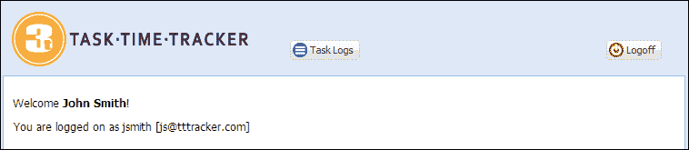

尝试点击**注销**按钮。您应该会看到一个确认窗口，如下所示：

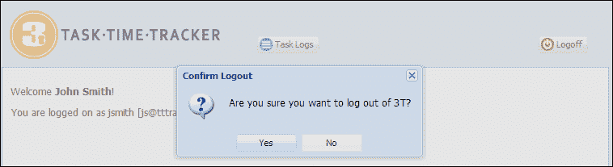

选择**是**选项将触发`MainController.doLogoff`函数，注销用户并重新加载浏览器以再次显示`LogonWindow`。

# 让我们维护用户

以**bjones**用户身份登录，然后单击**用户**按钮。将显示以下屏幕：


在所有字段中输入字母`A`，然后单击**保存**按钮。然后将显示**无效字段**消息：

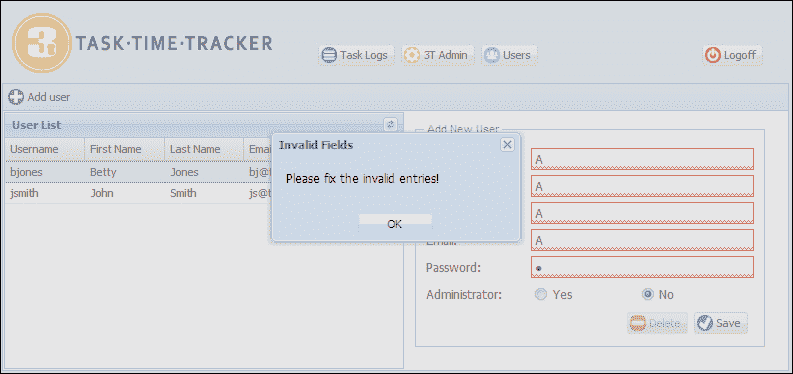

输入有效条目（记住验证规则！）并单击**保存**按钮。然后新用户记录应该被添加到用户列表中：

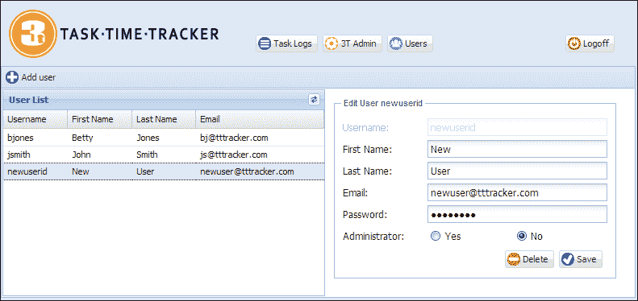

现在，您可以尝试删除和更新用户，以测试您编写的不同功能。在执行此类测试时，有很多隐藏的活动。您可以打开适合您的浏览器的 JavaScript 控制台（Safari Web Inspector，Firefox Firebug，Chrome Developer Tools 或通用的 Fiddler [`fiddler2.com/get-fiddler`](http://fiddler2.com/get-fiddler)）来检查发送的请求。尝试以`bjones`身份再次登录，单击**用户**按钮，添加新用户，然后删除此新用户。您将看到以下请求被发送到服务器：

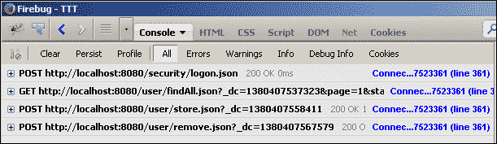

在您的函数中大量使用`TTT.console()`也有助于调试属性和应用程序状态。将语句`TTT.console(userObj);`添加到`Application.js doAfterLogon(userObj)`函数的第一行后，成功登录后将在控制台中输出以下内容：

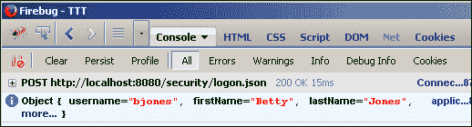

花时间测试和尝试你编写的不同功能。在本章中，我们涵盖了许多概念！

# 摘要

本章介绍了 Ext JS 4 视图和控制器概念，构建登录窗口和用户维护界面。我们还介绍了包括持久性和验证在内的关键模型概念。拼图的各个部分终于落入了位，我们的前端操作与后端业务逻辑进行了交互。第十一章*构建任务日志用户界面*，将继续增强我们对 Ext JS 4 组件的理解，因为我们实现任务日志用户界面。
