# 第十二章：3T 管理简化

3T 管理界面允许用户维护公司、项目和任务之间的关系。由于关系是分层的，我们将使用 Ext JS 中最通用的组件之一：`Ext.tree.Panel`。

我们将构建的界面如下截图所示：

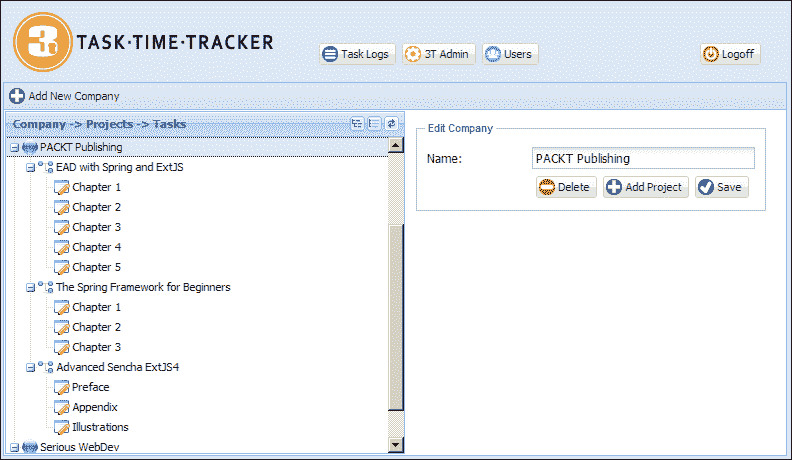

在树中选择一个项目将在右侧面板上显示相应的记录，而**添加新公司**按钮将允许用户输入新公司的名称。现在让我们详细研究这些操作。

# 管理工作流程和布局

有三种不同的实体可以进行编辑（公司、项目和任务），前面的截图显示了公司。在树中选择一个项目将显示**编辑项目**表单：

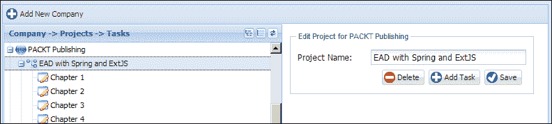

选择一个任务将显示**编辑任务**表单：

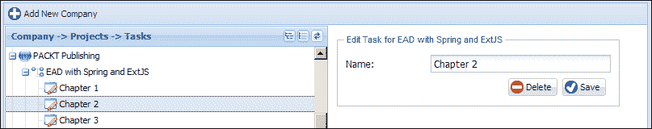

选择**添加新公司**按钮将显示一个空的公司表单：

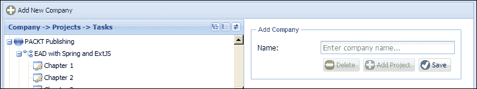

请注意，**删除**和**添加项目**按钮是禁用的。当某个操作不被允许时，适当的按钮将在所有屏幕上被禁用。在这种情况下，您不能向尚未保存的公司添加项目。

树工具将允许用户展开、折叠和刷新树：

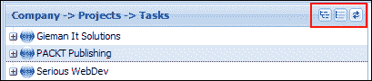

当用户首次显示管理界面时，将显示**添加新公司**屏幕。当删除任何项目时，将显示**请从树中选择一个项目...**消息：

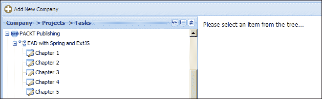

现在我们已经定义了界面及其行为，是时候定义我们的视图了。

# 构建 3T 管理界面

3T 管理界面将要求我们构建以下截图中显示的组件。`ProjectForm`和`TaskForm`视图不可见，将在需要时以卡片布局显示：

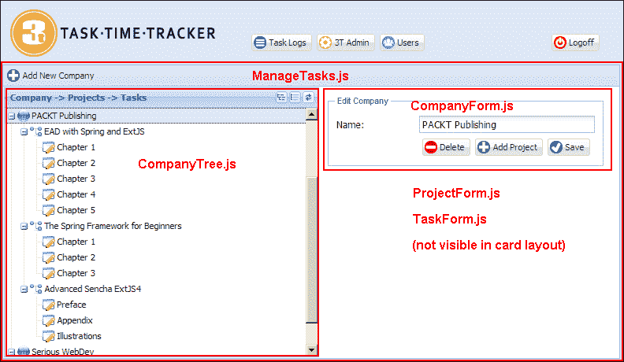

`ManageTasks`视图是一个`hbox`布局，平均分割屏幕的左右两部分。工具栏包含一个按钮用于添加新公司，右侧区域是包含`CompanyForm`、`ProjectForm`和`TaskForm`视图的卡片布局。现在让我们详细看看每个组件。

## ManageTasks.js 文件

`ManageTasks`视图定义了带有**添加新公司**按钮的工具栏，并将视图分割为`hbox`布局。由`xtype`配置的`companytree`面板和使用卡片布局定义的`container`。卡片布局容器包含`CompanyForm`、`ProjectForm`和`TaskForm`。`ManageTasks`视图定义如下：

```java
Ext.define('TTT.view.admin.ManageTasks', {
    extend: 'Ext.panel.Panel',
    xtype: 'managetasks',
    requires: ['TTT.view.admin.CompanyTree', 'TTT.view.admin.TaskForm', 'TTT.view.admin.ProjectForm', 'TTT.view.admin.CompanyForm', 'Ext.toolbar.Toolbar', 
        'Ext.layout.container.Card'],
    layout: {
        type: 'hbox',
        align: 'stretch'
    },
    initComponent: function() {
        var me = this;
        Ext.applyIf(me, {
            dockedItems: [{
                xtype: 'toolbar',
                dock: 'top',
                items: [{
                    xtype: 'button',
                    itemId: 'addCompanyBtn',
                    iconCls: 'addnew',
                    text: 'Add New Company'
                }]
            }],
            items: [{
                xtype: 'companytree',
                flex: 1,
                margin: 1
            }, {
                xtype: 'container',
                itemId: 'adminCards',
                activeItem: 0,
                flex: 1,
                layout: {
                    type: 'card'
                },
                items: [{
                    xtype: 'container',
                    padding: 10,
                    html: 'Please select an item from the tree...'
                }, {
                    xtype: 'companyform'
                }, {
                    xtype: 'projectform'
                }, {
                    xtype: 'taskform'
                }]
            }]
        });
        me.callParent(arguments);
    }
});
```

请注意，使用简单容器作为卡片布局的第一项，以显示**请从树中选择一个项目...**消息。

## ProjectForm.js 文件

`CompanyForm`视图具有非常简单的界面，只有一个数据输入字段：`companyName`。这可以在以下代码行中看到：

```java
Ext.define('TTT.view.admin.CompanyForm', {
    extend: 'Ext.form.Panel',
    xtype: 'companyform',
    requires: ['Ext.form.FieldSet', 'Ext.form.field.Text', 'Ext.toolbar.Toolbar'],
    layout: {
        type: 'anchor'
    },
    bodyPadding: 10,
    border: false,
    autoScroll: true,
    initComponent: function() {
        var me = this;
        Ext.applyIf(me, {
            items: [{
                xtype: 'fieldset',
                hidden: false,
                padding: 10,
                width: 350,
                fieldDefaults: {
                    anchor: '100%'
                },
                title: 'Company Entry',
                items: [{
                    xtype: 'textfield',
                    name: 'companyName',
                    fieldLabel: 'Name',
                    emptyText: 'Enter company name...'
                }, {
                    xtype: 'toolbar',
                    ui: 'footer',
                    layout: {
                        pack: 'end',
                        type: 'hbox'
                    },
                    items: [{
                        xtype: 'button',
                        iconCls: 'delete',
                        itemId: 'deleteBtn',
                        disabled: true,
                        text: 'Delete'
                    }, {
                        xtype: 'button',
                        iconCls: 'addnew',
                        itemId: 'addProjectBtn',
                        disabled: true,
                        text: 'Add Project'
                    }, {
                        xtype: 'button',
                        iconCls: 'save',
                        itemId: 'saveBtn',
                        text: 'Save'
                    }]
                }]
            }]
        });
        me.callParent(arguments);
    }
});
```

请注意，**删除**和**添加项目**按钮的初始状态是禁用的，直到加载有效的公司为止。

## ProjectForm.js 文件

`ProjectForm`视图的布局和结构与我们刚刚定义的公司表单非常相似：

```java
Ext.define('TTT.view.admin.ProjectForm', {
    extend: 'Ext.form.Panel',
    xtype: 'projectform',
    requires: ['Ext.form.FieldSet', 'Ext.form.field.Text', 'Ext.toolbar.Toolbar'],
    layout: {
        type: 'anchor'
    },
    bodyPadding: 10,
    border: false,
    autoScroll: true,
    initComponent: function() {
        var me = this;
        Ext.applyIf(me, {
            items: [{
                xtype: 'fieldset',
                hidden: false,
                padding: 10,
                width: 350,
                fieldDefaults: {
                    anchor: '100%'
                },
                title: 'Project Entry',
                items: [{
                    xtype: 'textfield',
                    name: 'projectName',
                    fieldLabel: 'Project Name',
                    emptyText: 'Enter project name...'
                }, {
                    xtype: 'toolbar',
                    ui: 'footer',
                    layout: {
                        pack: 'end',
                        type: 'hbox'
                    },
                    items: [{
                        xtype: 'button',
                        iconCls: 'delete',
                        itemId: 'deleteBtn',
                        disabled: true,
                        text: 'Delete'
                    }, {
                        xtype: 'button',
                        iconCls: 'addnew',
                        itemId: 'addTaskBtn',
                        disabled: true,
                        text: 'Add Task'
                    }, {
                        xtype: 'button',
                        iconCls: 'save',
                        itemId: 'saveBtn',
                        text: 'Save'
                    }]
                }]
            }]
        });
        me.callParent(arguments);
    }
});
```

再次，**删除**和**添加任务**按钮的初始状态是`禁用`，直到加载有效项目为止。

## TaskForm.js 文件

`TaskForm`视图与之前的表单类似，但只需要两个按钮，定义如下：

```java
Ext.define('TTT.view.admin.TaskForm', {
    extend: 'Ext.form.Panel',
    xtype: 'taskform',
    requires: ['Ext.form.FieldSet', 'Ext.form.field.Text', 'Ext.toolbar.Toolbar'],
    layout: {
        type: 'anchor'
    },
    bodyPadding: 10,
    border: false,
    autoScroll: true,
    initComponent: function() {
        var me = this;
        Ext.applyIf(me, {
            items: [{
                xtype: 'fieldset',
                hidden: false,
                padding: 10,
                width: 350,
                fieldDefaults: {
                    anchor: '100%'
                },
                title: 'Task Entry',
                items: [{
                    xtype: 'textfield',
                    name: 'taskName',
                    fieldLabel: 'Name',
                    emptyText: 'Enter task name...'
                }, {
                    xtype: 'toolbar',
                    ui: 'footer',
                    layout: {
                        pack: 'end',
                        type: 'hbox'
                    },
                    items: [{
                        xtype: 'button',
                        iconCls: 'delete',
                        itemId: 'deleteBtn',
                        disabled: true,
                        text: 'Delete'
                    }, {
                        xtype: 'button',
                        iconCls: 'save',
                        itemId: 'saveBtn',
                        text: 'Save'
                    }]
                }]
            }]
        });
        me.callParent(arguments);
    }
});
```

再次，**删除**按钮的初始状态是禁用的，直到加载有效任务为止。

## CompanyTree.js 文件

最终视图是`CompanyTree`视图，表示公司、项目和任务之间的关系。

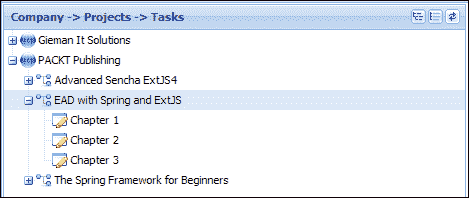

这个视图定义如下：

```java
Ext.define('TTT.view.admin.CompanyTree', {
    extend: 'Ext.tree.Panel',
    xtype: 'companytree',
    title: 'Company -> Projects -> Tasks',
    requires: ['TTT.store.CompanyTree'],
    store: 'CompanyTree',
    lines: true,
    rootVisible: false,
    hideHeaders: true,
    viewConfig: {
        preserveScrollOnRefresh: true
    },
    initComponent: function() {
        var me = this;
        Ext.applyIf(me, {
            tools: [{
                type: 'expand',
                qtip: 'Expand All'
            }, {
                type: 'collapse',
                qtip: 'Collapse All'
            }, {
                type: 'refresh',
                qtip: 'Refresh Tree'
            }],
            columns: [{
                xtype: 'treecolumn',
                dataIndex: 'text',
                flex: 1
            }]
        });
        me.callParent(arguments);
    }
}); 
```

`CompanyTree`视图扩展了`Ext.tree.Panel`，需要一个专门的`Ext.data.TreeStore`实现来管理树节点和项之间的关系。Ext JS 4 树是一个非常灵活的组件，我们建议您熟悉核心树概念，网址为[`docs.sencha.com/extjs/4.2.2/#!/guide/tree`](http://docs.sencha.com/extjs/4.2.2/#!/guide/tree)。

## 介绍`Ext.data.TreeStore`类

`Ext.data.TreeStore`类是`Ext.tree.Panel`默认使用的存储实现。`TreeStore`函数提供了许多方便的函数来加载和管理分层数据。`TreeStore`函数可以使用模型来定义，但这不是必需的。如果提供了模型，它将使用`Ext.data.NodeInterface`的字段、方法和属性来装饰模型，这些属性是树中使用所需的。这个额外的功能被应用到模型的原型上，以允许树维护模型之间的状态和关系。

如果没有提供模型，存储将以一种实现`Ext.data.NodeInterface`类的方式创建一个这样的模型。我们建议您浏览`NodeInterface` API 文档，以查看节点上可用的全部字段、方法和属性。

我们用于树的`CompanyTree`存储定义如下：

```java
Ext.define('TTT.store.CompanyTree', {
    extend: 'Ext.data.TreeStore',
    proxy: {
        type: 'ajax',
        url: 'company/tree.json'
    }
});
```

所有树存储都使用分层结构的数据，可以是 JSON 或 XML 格式。我们将在请求处理层生成以下结构的 JSON 数据：

```java
{
    "success": true,
    "children": [
        {
            "id": "C_1",
            "text": "PACKT Publishing",
            "leaf": false,
            "expanded": true,
            "children": [
                {
                    "id": "P_1",
                    "text": "EAD with Spring and ExtJS",
                    "leaf": false,
                    "expanded": true,
                    "children": [
                        {
                            "id": "T_1",
                            "text": "Chapter 1",
                            "leaf": true
                        },
                        {
                            "id": "T_2",
                            "text": "Chapter 2",
                            "leaf": true
                        },
                        {
                            "id": "T_3",
                            "text": "Chapter 3",
                            "leaf": true
                        }
                    ]
                },
                {
                    "id": "P_2",
                    "text": "The Spring Framework for Beginners",
                    "leaf": false,
                    "expanded": true,
                    "children": [
                        {
                            "id": "T_4",
                            "text": "Chapter 1",
                            "leaf": true
                        },
                        {
                            "id": "T_5",
                            "text": "Chapter 2",
                            "leaf": true
                        },
                        {
                            "id": "T_6",
                            "text": "Chapter 3",
                            "leaf": true
                        }
                    ]
                }
            ]
        }
    ]
}
```

这个结构定义了任何树使用的核心属性，包括`id`、`children`、`text`、`leaf`和`expanded`。

`children`属性定义了存在于同一级别并属于同一父级的节点数组。结构中的顶级子节点属于根节点，并将添加到树的根级别。树面板属性`rootVisible:false`将隐藏视图中的根级别，仅显示子节点。通过将属性设置为`rootVisible:true`来启用根级别的可见性，将显示`TreeStore`类中定义的根节点。例如，将以下定义添加到树存储中将导致`Companies`节点显示如下截图所示：

```java
root: {
    text: 'Companies',
    expanded: true
}
```

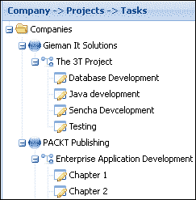

我们希望在树的顶层显示每个公司，因此将隐藏根节点。

`id`属性在内部用于唯一标识每个节点。在树结构内，此属性不能重复，因此我们将`id`值前缀为节点类型。表示公司的节点将以`C_`为前缀，项目节点以`P_`为前缀，任务节点以`T_`为前缀。这种`id`格式将允许我们确定节点类型和节点的主键。如果没有提供 ID，存储将为我们生成一个 ID。

ID 还可以用于动态分配`iconCls`类给节点。我们通过存储的`append`监听器来定义这一点，稍后在控制器中定义。请注意，我们也可以在 JSON 本身中轻松定义`iconCls`属性：

```java
{
    "success": true,
    "children": 
        {
            "id": "C_1",
            "iconCls": "company",
            "text": "PACKT Publishing",
            "leaf": false,
            "expanded": true,
            "children": [
                {
                    "id": "P_1",
                    "iconCls": "project",
                    "text": "EAD with Spring and ExtJS",
                    "leaf": false,
                    "expanded": true,
                    "children": [ etc…
```

然而，我们现在正在将数据与呈现结合在一起，生成 JSON 的 Java 方法不应该关心数据如何显示。

JSON 树的`text`字段用于显示节点的文本。对于没有多列的简单树，如果没有使用列定义显式设置字段名，这是默认字段名（树列将在本章后面讨论）。

`leaf`属性标识此节点是否可以有子节点。所有任务节点都具有`"leaf":true`设置。`leaf`属性定义了是否在节点旁边显示展开图标。

感兴趣的最后一个属性是`expanded`属性，它指示节点是否应以展开状态显示。如果一次加载整个树，这个属性必须设置为`true`，以便在每个具有子节点的节点上设置; 否则，代理将在展开这些节点时动态尝试加载子节点。我们的 JSON 数据将包含整个树，因此我们为每个父节点将`expanded`属性设置为`true`。

# 在 CompanyHandler 类中生成 JSON 树

现在是时候增强`CompanyHandler`类以生成所需的 JSON 来加载树存储并显示公司树了。我们将创建两个新方法来实现这个功能。

## CompanyHandler.getTreeNodeId()方法

`CompanyHandler.getTreeNodeId()`辅助方法基于`EntityItem`类的 ID 生成唯一 ID。它将用于为每个节点生成特定类型的 ID。

```java
private String getTreeNodeId(EntityItem obj){
  String id = null;

  if(obj instanceof Company){
    id = "C_" + obj.getId();
  } else if(obj instanceof Project){
    id = "P_" + obj.getId();
  } else if(obj instanceof Task){
    id = "T_" + obj.getId();
  }
  return id;
}
```

## CompanyHandler.getCompanyTreeJson()方法

`CompanyHandler getCompanyTreeJson()`方法映射到`company/tree.json` URL，并具有以下定义：

```java
@RequestMapping(value="/tree", method=RequestMethod.GET, produces={"application/json"})
@ResponseBody
public String getCompanyTreeJson(HttpServletRequest request) {

  User sessionUser = getSessionUser(request);

  Result<List<Company>> ar = companyService.findAll(sessionUser.getUsername());
  if (ar.isSuccess()) {

    JsonObjectBuilder builder = Json.createObjectBuilder();
    builder.add("success", true);
    JsonArrayBuilder companyChildrenArrayBuilder =
      Json.createArrayBuilder();

    for(Company company : ar.getData()){

      List<Project> projects = company.getProjects();

      JsonArrayBuilder projectChildrenArrayBuilder = Json.createArrayBuilder();

      for(Project project : projects){

        List<Task> tasks = project.getTasks();

        JsonArrayBuilder taskChildrenArrayBuilder = Json.createArrayBuilder();

        for(Task task : tasks){

          taskChildrenArrayBuilder.add(
            Json.createObjectBuilder()
            .add("id", getTreeNodeId(task))
            .add("text", task.getTaskName())
            .add("leaf", true)
          );                        
        }

        projectChildrenArrayBuilder.add(
          Json.createObjectBuilder()
            .add("id", getTreeNodeId(project))
            .add("text", project.getProjectName())
            .add("leaf", tasks.isEmpty())
            .add("expanded", tasks.size() > 0)
            .add("children", taskChildrenArrayBuilder)
        );                    

      }

      companyChildrenArrayBuilder.add(
        Json.createObjectBuilder()
          .add("id", getTreeNodeId(company))
          .add("text", company.getCompanyName())
          .add("leaf", projects.isEmpty())
          .add("expanded", projects.size() > 0)
          .add("children", projectChildrenArrayBuilder)
      );
    }

    builder.add("children", companyChildrenArrayBuilder);

    return toJsonString(builder.build());

  } else {

    return getJsonErrorMsg(ar.getMsg());

  }
}
```

这个方法执行以下任务：

+   它创建一个名为`companyChildrenArrayBuilder`的`JsonArrayBuilder`对象，用于保存在主`for`循环中通过公司列表进行迭代时将创建的公司`JsonObjectBuilder`实例集。

+   它循环遍历分配给每个公司的每个项目，将每个项目的`JsonObjectBuilder`树节点表示添加到`projectChildrenArrayBuilder JsonArrayBuilder`实例中。然后将`projectChildrenArrayBuilder`实例作为拥有公司`JsonObjectBuilder`实例的`children`属性添加。

+   它循环遍历分配给每个项目的每个任务，将每个任务的`JsonObjectBuilder`树节点表示添加到`taskChildrenArrayBuilder JsonArrayBuilder`实例中。然后将`taskChildrenArrayBuilder`实例作为拥有项目的`JsonObjectBuilder`实例的`children`属性添加。

+   它将`companyChildrenArrayBuilder`作为将用于从具有`success`属性`true`的方法构建和返回 JSON 的`builder`实例的`children`属性添加。

`getCompanyTreeJson`方法返回一个分层的 JSON 结构，封装了公司、项目和任务之间的关系，以一种可以被`CompanyTree`存储消费的格式。

# 控制 3T 管理

`TTT.controller.AdminController`将视图联系在一起，并实现此用户界面中可能的许多操作。您必须下载源代码才能看到此控制器的完整定义，因为它在以下文本中没有完全重现。

`AdminController`引用了处理操作所需的四个存储。在`update`或`delete`操作后重新加载每个存储，以确保存储与数据库同步。对于多用户应用程序，这是一个重要的考虑点；在会话的生命周期内，视图数据是否可以被不同用户更改？与任务日志界面不同，其中数据属于会话中的用户，3T 管理模块可能会同时被不同用户积极使用。

### 注意

本书的范围不包括讨论多用户环境中数据完整性的策略。这通常是通过使用每个记录的时间戳来实现的，该时间戳指示最后更新时间。服务层中的适当逻辑将测试提交的记录时间戳与数据库中的时间戳，然后相应地处理操作。

还有一个尚未完全定义的存储和模型；我们现在将这样做。

## 定义公司模型和存储

`Company`模型首先是在[第九章中使用 Sencha Cmd 定义的，但现在我们需要添加适当的代理和验证。完整的定义如下：

```java
Ext.define('TTT.model.Company', {
    extend: 'Ext.data.Model',
    fields: [
        { name: 'idCompany', type: 'int', useNull:true },
        { name: 'companyName', type: 'string'}
    ],
    idProperty: 'idCompany',
    proxy: {
        type: 'ajax',
        idParam:'idCompany',
        api:{
            create:'company/store.json',
            read:'company/find.json',
            update:'company/store.json',
            destroy:'company/remove.json'
        },
        reader: {
            type: 'json',
            root: 'data'
        },
        writer: {
            type: 'json',
            allowSingle:true,
            encode:true,
            root:'data',
            writeAllFields: true
        }
    },
    validations: [
        {type: 'presence',  field: 'companyName'},
        {type: 'length', field: 'companyName', min: 2}
    ]
});
```

`Company`存储将通过`company/findAll.json` URL 加载所有公司记录，如下所示：

```java
Ext.define('TTT.store.Company', {
    extend: 'Ext.data.Store',
    requires: [
        'TTT.model.Company'
    ],
    model: 'TTT.model.Company',
    proxy: {
        type: 'ajax',
        url: 'company/findAll.json',
        reader: {
            type: 'json',
            root: 'data'
        }
    }    
});
```

`Company`模型和存储是迄今为止我们最简单的定义。现在我们将检查`AdminController`中的核心操作。

## doAfterActivate 函数

当激活`ManageTasks`面板时，将加载 3T 管理所需的三个存储。这将确保在树中选择项目时，每个存储中都有有效的记录。`doAfterActivate`函数可用于初始化属于`AdminController`的任何组件的状态。在本章末尾配置拖放操作时，这将特别有用。

请注意，我们正在向树存储视图添加**append**监听器，并分配`doSetTreeIcon`函数。在`init`函数控制配置中无法在此时进行此操作，因为视图在此时尚未配置和准备就绪。在激活后将`doSetTreeIcon`函数分配给监听器可以确保组件完全配置。`doSetTreeIcon`函数根据节点类型动态分配`iconCls`类。

`doAfterActivate`函数的最后一步是加载树存储以显示树中的数据。

## doSelectTreeItem 函数

当用户在树中选择项目时，将调用`doSelectTreeItem`函数。检索节点 ID 并拆分以允许我们确定节点类型：

```java
var recIdSplit = record.getId().split('_');
```

对于每个节点，将确定主键值并用于从适当的存储中检索记录。然后将记录加载到表单中，并将其设置为管理员卡片布局中的活动项目。

## doSave 函数

每个保存函数都会从表单中检索记录，并使用表单数值更新记录。如果验证成功，则保存记录，并更新表单以反映按钮状态的变化。然后重新加载拥有记录的存储以与数据库同步。

## doDelete 函数

每个删除函数在调用模型的`destroy`方法之前都会确认用户操作。如果成功，管理员卡片布局中的活动项目将设置为显示默认消息：**请从树中选择一个项目**。如果删除不成功，将显示适当的消息通知用户。

## doAdd 函数

**添加**按钮位于作为`Add`操作父级的表单上。您只能将项目添加到公司或将任务添加到项目。每个`doAdd`函数都会检索父级并创建子级的实例，然后加载适当的表单。根据需要禁用子表单上的按钮。

# 测试 3T 管理界面

现在我们需要将新的组件添加到我们的`Application.js`文件中：

```java
models:[
  'Company',
  'Project',
  'Task',
  'User',
  'TaskLog'
],    
controllers: [
  'MainController',
  'UserController',
  'AdminController',
  'TaskLogController'
],    
stores: [
  'Company',
  'CompanyTree',
  'Project',
  'Task',
  'User',
  'TaskLog'
]
```

我们还需要将`ManageTasks`视图添加到我们的`MainCards`中：

```java
Ext.define('TTT.view.MainCards', {
    extend: 'Ext.container.Container',
    xtype: 'maincards',
    requires: ['Ext.layout.container.Card', 'TTT.view.Welcome', 'TTT.view.user.ManageUsers', 'TTT.view.tasklog.ManageTaskLogs', 'TTT.view.admin.ManageTasks'],
    layout: 'card',
    initComponent: function() {
        var me = this;
        Ext.applyIf(me, {
            items: [{
                xtype: 'welcome',
                itemId: 'welcomCard'
            }, {
                xtype: 'manageusers',
                itemId: 'manageUsersCard'
            }, {
                xtype: 'managetasklogs',
                itemId: 'taskLogCard'
            }, {
 xtype: 'managetasks',
 itemId: 'manageTasksCard'
 }]
        });
        me.callParent(arguments);
    }
});
```

您现在可以在 GlassFish 服务器上运行应用程序，并通过以`bjones`用户（或任何其他具有管理员权限的用户）登录来测试 3T 管理界面。

# 动态加载树节点

企业应用程序通常具有数据集，禁止通过单个 JSON 请求加载完整的树。可以通过按需展开级别来配置大树以按节点加载子级。对我们的代码进行一些小的更改就可以实现这种动态加载节点子级。

当节点展开时，树存储代理会提交一个包含正在展开的节点的`node`参数的请求。提交的 URL 是在代理中配置的。我们将按以下方式更改我们的树存储代理：

```java
proxy: {
  type: 'ajax',
  url: 'company/treenode.json'
}
```

请注意，代理的 URL 已更改为`treenode`。当在`CompanyHandler`中实现此映射时，将一次加载一级。代理提交给加载树顶级的第一个请求将具有以下格式：

```java
company/treenode.json?node=root
```

这将返回根节点的公司列表：

```java
{
    success: true,
    "children": [{
        "id": "C_2",
        "text": "Gieman It Solutions",
        "leaf": false
    }, {
        "id": "C_1",
        "text": "PACKT Publishing",
        "leaf": false
    }]
}
```

请注意，每个公司都没有定义`children`数组，并且`leaf`属性设置为`false`。如果没有定义子节点并且节点不是叶子节点，Ext JS 树将在节点旁显示一个展开图标。点击展开图标将提交一个请求，该请求的`node`参数设置为正在展开的节点的`id`值。因此，展开`"PACKT Publishing"`节点将提交一个请求通过`company/treenode.json?node=C_1`来加载子节点。

JSON 响应将包含一个`children`数组，该数组将作为`PACKT Publishing`节点的子节点附加到树上。在我们的示例中，响应将包括分配给公司的项目：

```java
{
    success: true,
    "children": [{
        "id": "P_3",
        "text": "Advanced Sencha ExtJS4 ",
        "leaf": false
    }, {
        "id": "P_1",
        "text": "EAD with Spring and ExtJS",
        "leaf": false
    }, {
        "id": "P_2",
        "text": "The Spring Framework for Beginners",
        "leaf": false
    }]
}
```

再次，每个项目都不会定义一个`children`数组，即使有任务分配。每个项目都将被定义为`"leaf":false`，以渲染一个展开图标，如果有任务分配的话。展开`P_1`节点将导致代理提交一个请求来加载下一级：`company/treenode.json?node=P_1`。

这将导致返回以下 JSON：

```java
{
    success: true,
    "children": [{
        "id": "T_1",
        "text": "Chapter 1",
        "leaf": true
    }, {
        "id": "T_2",
        "text": "Chapter 2",
        "leaf": true
    }, {
        "id": "T_3",
        "text": "Chapter 3",
        "leaf": true
    }]
}
```

这次我们将这些节点定义为`"leaf":true`，以确保不显示展开图标，并且用户无法尝试加载树的第四级。

现在可以定义负责此逻辑的`CompanyHandler`方法，并将其映射到`company/treenode.json` URL：

```java
@RequestMapping(value = "/treenode", method = RequestMethod.GET, produces = {"application/json"})
@ResponseBody
public String getCompanyTreeNode(
    @RequestParam(value = "node", required = true) String node,
    HttpServletRequest request) {

  User sessionUser = getSessionUser(request);

  logger.info(node);

  JsonObjectBuilder builder = Json.createObjectBuilder();
  builder.add("success", true);
  JsonArrayBuilder childrenArrayBuilder =Json.createArrayBuilder();

  if(node.equals("root")){

    Result<List<Company>> ar =companyService.findAll(sessionUser.getUsername());
    if (ar.isSuccess()) {                                

      for(Company company : ar.getData()){                   
        childrenArrayBuilder.add(
          Json.createObjectBuilder()
            .add("id", getTreeNodeId(company))
            .add("text", company.getCompanyName())
            .add("leaf", company.getProjects().isEmpty())
        );
      }
    } else {

      return getJsonErrorMsg(ar.getMsg());
    }
  } else if (node.startsWith("C")){

    String[] idSplit = node.split("_");
    int idCompany = Integer.parseInt(idSplit[1]);
    Result<Company> ar = companyService.find(idCompany,sessionUser.getUsername());

    for(Project project : ar.getData().getProjects()){

      childrenArrayBuilder.add(
        Json.createObjectBuilder()
          .add("id", getTreeNodeId(project))
          .add("text", project.getProjectName())
          .add("leaf", project.getTasks().isEmpty())
      );
    }

  } else if (node.startsWith("P")){

    String[] idSplit = node.split("_");
    int idProject = Integer.parseInt(idSplit[1]);
    Result<Project> ar = projectService.find(idProject,sessionUser.getUsername());
    for(Task task : ar.getData().getTasks()){

      childrenArrayBuilder.add(
        Json.createObjectBuilder()
          .add("id", getTreeNodeId(task))
          .add("text", task.getTaskName())
          .add("leaf", true)
      );
    }
  }

  builder.add("children", childrenArrayBuilder);

  return toJsonString(builder.build());
}
```

`getCompanyTreeNode`方法确定正在展开的节点类型，并从服务层加载适当的记录。然后存储返回的 JSON 并在树中显示。

现在我们可以在 GlassFish 中运行项目并显示**3T Admin**界面。树的第一级如预期加载：

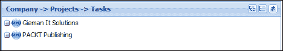

当点击展开图标时，树的下一级将被动态加载：

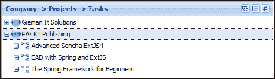

然后可以展开第三级来显示任务：


我们将让您增强`AdminController`以用于动态树。在每次成功保存或删除后重新加载树将不太用户友好；更改逻辑以仅重新加载父节点将是一个更好的解决方案。

# 显示多列树

Ext JS 4 树可以配置为显示多列以可视化高级数据结构。我们将进行一些小的更改以显示树中每个节点的 ID。只需向树定义中添加一个新列即可实现此目的：

```java
Ext.define('TTT.view.admin.CompanyTree', {
    extend: 'Ext.tree.Panel',
    xtype: 'companytree',
    title: 'Company -> Projects -> Tasks',
    requires: ['TTT.store.CompanyTree'],
    store: 'CompanyTree',
    lines: true,
    rootVisible: false,
    hideHeaders: false,
    viewConfig: {
        preserveScrollOnRefresh: true
    },
    initComponent: function() {
        var me = this;
        Ext.applyIf(me, {
            tools: [{
                type: 'expand',
                qtip: 'Expand All'
            }, {
                type: 'collapse',
                qtip: 'Collapse All'
            }, {
                type: 'refresh',
                qtip: 'Refresh Tree'
            }],
            columns: [{
                xtype: 'treecolumn',
                text:'Node',
                dataIndex: 'text',
                flex: 1
            },
 {
 dataIndex: 'id',
 text : 'ID',
 width:60
 }]
        });
        me.callParent(arguments);
    }
});
```

我们还向每列添加了`text`属性，该属性显示在标题行中，并启用了`hideHeaders:false`的标题。这些小的更改将导致完全展开时显示以下树：

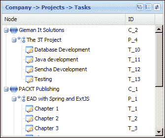

# 轻松实现拖放

在 Ext JS 4 中，树内拖放节点非常容易。要允许树内的拖放动作，我们需要添加`TreeViewDragDrop`插件如下：

```java
Ext.define('TTT.view.admin.CompanyTree', {
    extend: 'Ext.tree.Panel',
    xtype: 'companytree',
    title: 'Company -> Projects -> Tasks',
    requires: ['TTT.store.CompanyTree','Ext.tree.plugin.TreeViewDragDrop'],
    store: 'CompanyTree',
    lines: true,
    rootVisible: false,
    hideHeaders: true,
    viewConfig: {
        preserveScrollOnRefresh: true,
        plugins: {
 ptype: 'treeviewdragdrop'
 }
    }, etc
```

这个简单的包含将使您的树支持拖放。现在您可以拖放任何节点到一个新的父节点。不幸的是，这并不是我们需要的。任务节点只应允许放置在项目节点上，而项目节点只应允许放置在公司节点上。我们如何限制拖放动作遵循这些规则？

有两个事件可用于配置此功能。这些事件是从`TreeViewDragDrop`插件触发的，并且可以在`AdminController`的`doAfterActivate`函数中以以下方式配置：

```java
doAfterActivate:function(){
  var me = this;
  me.getCompanyStore().load();
  me.getProjectStore().load();
  me.getTaskStore().load();
  me.getCompanyTreeStore().on('append' , me.doSetTreeIcon, me);
  me.getCompanyTree().getView().on('beforedrop', me.isDropAllowed,me);
 me.getCompanyTree().getView().on('drop', me.doChangeParent, me);
  me.getCompanyTreeStore().load();
}
```

`beforedrop`事件可用于测试`拖动`和`放置`动作是否有效。返回`false`将阻止`放置`动作发生，并将节点动画回到动作的原点。`drop`事件可用于处理`放置`动作，很可能是将更改持久化到底层存储。

`isDropAllowed`函数根据放置目标是否对节点有效返回`true`或`false`。

```java
isDropAllowed: function(node, data, overModel, dropPosition) {
    var dragNode = data.records[0];
    if (!Ext.isEmpty(dragNode) && !Ext.isEmpty(overModel)) {
        var dragIdSplit = dragNode.getId().split('_');
        var dropIdSplit = overModel.getId().split('_');
        if (dragIdSplit[0] === 'T' && dropIdSplit[0] === 'P') {
            return true;
        } else if (dragIdSplit[0] === 'P' 
                     && dropIdSplit[0] === 'C') {
            return true;
        }
    }
    return false;
}
```

此功能将限制`拖动`和`放置`操作到两种有效的情况：将项目拖到新公司和将任务拖到新项目。不允许所有其他`拖动`和`放置`操作。

仅仅拖放是不够的；我们现在需要在成功放置后保存新的父节点。这个操作在`doChangeParent`函数中处理。

```java
doChangeParent: function(node, data, overModel, dropPosition, eOpts) {
    var me = this;
    var dragNode = data.records[0];
    if (!Ext.isEmpty(dragNode) && !Ext.isEmpty(overModel)) {
        var dragIdSplit = dragNode.getId().split('_');
        var dropIdSplit = overModel.getId().split('_');
        if (dragIdSplit[0] === 'T' && dropIdSplit[0] === 'P') {
            var idTask = Ext.Number.from(dragIdSplit[1]);
            var idProject = Ext.Number.from(dropIdSplit[1]);
            var rec = me.getTaskStore().getById(idTask);
            if (!Ext.isEmpty(rec)) {
                rec.set('idProject', idProject);
                rec.save();
            }
        } else if (dragIdSplit[0] === 'P' 
                    && dropIdSplit[0] === 'C') {
            var idProject = Ext.Number.from(dragIdSplit[1]);
            var idCompany = Ext.Number.from(dropIdSplit[1]);
            var rec = me.getProjectStore().getById(idProject);
            if (!Ext.isEmpty(rec)) {
                rec.set('idCompany', idCompany);
                rec.save();
            }
        }
    }
}
```

将有效节点拖动到新父节点现在在记录保存时是持久的。您现在可以在有效树节点之间进行拖放，并自动保存更改。

Ext JS 4 树提供的动画将指导您的`拖动`和`放置`操作。拖动**数据库开发**节点将如下截图所示执行动画操作：

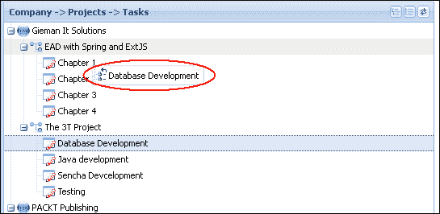

如果不允许放置操作，节点将动画返回到原始位置，为用户提供即时的视觉反馈。

Ext JS 4 树是非常灵活的组件，如果您想充分利用应用程序中的树，还有很多东西需要学习。我们建议您在*Sencha Docs*网站上探索许多树示例，包括树之间的`拖动`和`放置`操作以及持久化基于模型的数据节点的更复杂的示例。

# 总结

**3T Admin**界面引入了树组件来显示分层数据。公司、项目和任务关系通过单个 JSON 请求加载到树中，并允许用户维护和添加新实体。

然后解释和实现了树节点的动态加载。这种策略最适合具有潜在复杂数据结构的非常大的树。逐个节点的动态加载在 Ext JS 4 客户端和 Java 后端中需要最少的更改即可轻松实现。

还探讨并实现了显示多个树列和基本的拖放功能，以展示 Ext JS 4 树的灵活性。

我们在使用 Ext JS 和 Spring 进行企业应用程序开发的最后一步是为生产部署构建我们的 3T 项目。幸运的是，Maven 和 Sencha Cmd 可以帮助您轻松完成这项任务，您将在我们的最后一章中了解到，第十三章, *将您的应用程序移至生产环境*。
