# 第十三章：将您的应用程序移至生产环境

开发工作已经结束，现在是将应用程序部署到生产服务器的时候了。如果只是这么简单！企业应用程序需要遵循正式流程，需要客户或业务所有者的签署，内部测试，用户验收测试（UAT）等许多障碍，才能准备好进行生产部署。本章将探讨以下两个关键领域：

+   使用 Maven 构建和编译 Ext JS 4 应用程序以供生产使用

+   GlassFish 4 部署和配置概念

我们将首先检查 Sencha Cmd 编译器。

# 使用 Sencha Cmd 进行编译

在第九章中，*开始使用 Ext JS 4*，我们通过使用 Sencha Cmd 生成 Ext JS 4 应用程序骨架并创建基本组件的过程。本节将重点介绍使用 Sencha Cmd 编译我们的 Ext JS 4 应用程序，以便部署到 Web Archive（WAR）文件中。编译过程的目标是创建一个包含应用程序所需的所有代码的单个 JavaScript 文件，包括所有 Ext JS 4 依赖项。

应用程序骨架生成期间创建的`index.html`文件结构如下：

```java
<!DOCTYPE HTML>
<html>
  <head>
    <meta charset="UTF-8">
    <title>TTT</title>
    <!-- <x-compile> -->
        <!-- <x-bootstrap> -->
            <link rel="stylesheet" href="bootstrap.css">
            <script src="img/ext-dev.js"></script>
            <script src="img/bootstrap.js"></script>
        <!-- </x-bootstrap> -->
        <script src="img/app.js"></script>
    <!-- </x-compile> -->
  </head>
<body></body>
</html>
```

`x-compile`指令的开放和关闭标签将包围`index.html`文件中 Sencha Cmd 编译器将操作的部分。此块中应包含的唯一声明是脚本标签。编译器将处理`x-compile`指令中的所有脚本，根据`Ext.define`、`requires`或`uses`指令搜索依赖项。

`ext-dev.js`文件是一个例外。该文件被视为框架的“引导”文件，并且不会以相同的方式进行处理。编译器会忽略`x-bootstrap`块中的文件，并且声明将从最终由编译器生成的页面中删除。

编译过程的第一步是检查和解析所有 JavaScript 源代码并分析任何依赖关系。为此，编译器需要识别应用程序中的所有源文件夹。我们的应用程序有两个源文件夹：`webapp/ext/src`中的 Ext JS 4 源文件和`webapp/app`中的 3T 应用程序源文件。这些文件夹位置在`compile`命令中使用`-sdk`和`-classpath`参数指定：

```java
sencha –sdk {path-to-sdk} compile -classpath={app-sources-folder} page -yui -in {index-page-to-compile}-out {output-file-location}

```

对于我们的 3T 应用程序，`compile`命令如下：

```java
sencha –sdk ext compile -classpath=app page -yui -in index.html -out build/index.html

```

此命令执行以下操作：

+   Sencha Cmd 编译器检查由`-classpath`参数指定的所有文件夹。`-sdk`目录会自动包含在扫描中。

+   `page`命令然后包括`index.html`中包含在`x-compile`块中的所有脚本标签。

+   在识别`app`目录和`index.html`页面的内容后，编译器会分析 JavaScript 代码，并确定最终需要包含在表示应用程序的单个 JavaScript 文件中的内容。

+   修改后的原始`index.html`文件被写入`build/index.html`。

+   新的`index.html`文件所需的所有 JavaScript 文件都将被连接并使用 YUI Compressor 进行压缩，并写入`build/all-classes.js`文件。

`sencha compile`命令必须从`webapp`目录内执行，该目录是应用程序的根目录，也是包含`index.html`文件的目录。然后，提供给`sencha compile`命令的所有参数都可以相对于`webapp`目录。

打开命令提示符（或 Mac 中的终端窗口）并导航到 3T 项目的`webapp`目录。执行本节中早期显示的`sencha compile`命令将导致以下输出：

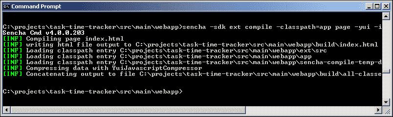

在 NetBeans 中打开`webapp/build`文件夹现在应该显示两个新生成的文件：`index.html`和`all-classes.js`。`all-classes.js`文件将包含所有必需的 Ext JS 4 类，以及所有 3T 应用程序类。尝试在 NetBeans 中打开此文件将会出现以下警告：“**文件似乎太大而无法安全打开...**”，但您可以在文本编辑器中打开文件以查看以下连接和压缩的内容：

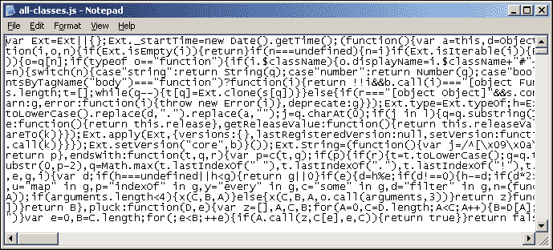

在 NetBeans 中打开`build/index.html`页面将显示以下屏幕截图：

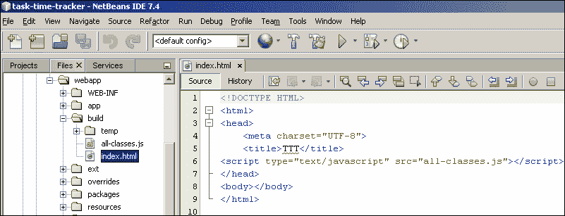

在运行应用程序后，您现在可以在浏览器中打开`build/index.html`文件，但结果可能会让您感到惊讶：

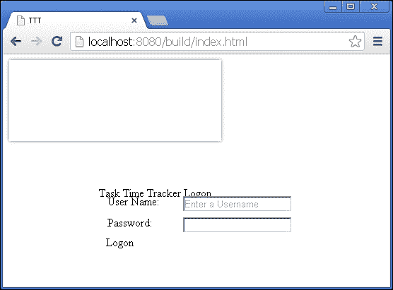

呈现的布局将取决于浏览器，但无论如何，您会发现 CSS 样式丢失了。我们应用程序需要的 CSS 文件需要移出`<!-- <x-compile> -->`指令。但样式是从哪里来的？现在是时候简要地深入了解 Ext JS 4 主题和`bootstrap.css`文件了。

# Ext JS 4 主题

Ext JS 4 主题利用**Syntactically Awesome StyleSheets**（**SASS**）和 Compass（[`compass-style.org/`](http://compass-style.org/)）来使用变量和混合样式表。几乎所有 Ext JS 4 组件的样式都可以定制，包括颜色、字体、边框和背景，只需简单地更改 SASS 变量即可。SASS 是 CSS 的扩展，允许您保持大型样式表的良好组织；您可以在[`sass-lang.com/documentation/file.SASS_REFERENCE.html`](http://sass-lang.com/documentation/file.SASS_REFERENCE.html)找到非常好的概述和参考。

使用 Compass 和 SASS 对 Ext JS 4 应用程序进行主题设置超出了本书的范围。Sencha Cmd 允许轻松集成这些技术来构建 SASS 项目；然而，SASS 语言和语法本身就是一个陡峭的学习曲线。Ext JS 4 主题非常强大，对现有主题进行微小更改可以快速改变应用程序的外观。您可以在[`docs.sencha.com/extjs/4.2.2/#!/guide/theming`](http://docs.sencha.com/extjs/4.2.2/#!/guide/theming)找到更多关于 Ext JS 4 主题的信息。

在生成应用程序骨架时，`bootstrap.css`文件是使用默认主题定义的。`bootstrap.css`文件的内容如下：

```java
@import 'ext/packages/ext-theme-classic/build/resources/ext-theme-classic-all.css';

```

此文件导入了`ext-theme-classic-all.css`样式表，这是默认的“classic”Ext JS 主题。所有可用的主题都可以在 Ext JS 4 SDK 的`ext/packages`目录中找到：

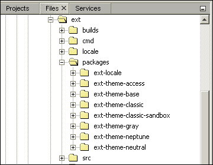

切换到不同的主题就像改变`bootstrap.css`导入一样简单。切换到**neptune**主题需要以下`bootstrap.css`定义：

```java
@import 'ext/packages/ext-theme-neptune/build/resources/ext-theme-neptune-all.css';

```

这个修改将改变应用程序的外观为 Ext JS 的“neptune”主题，如下面的屏幕截图所示：

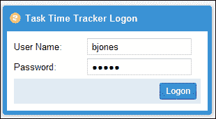

我们将更改`bootstrap.css`文件的定义以使用`gray`主题：

```java
@import 'ext
/packages/ext-theme-gray/build/resources/ext-theme-gray-all.css';

```

这将导致以下外观：

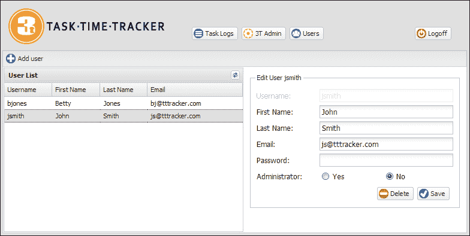

您可以尝试不同的主题，但应注意并非所有主题都像`classic`主题那样完整；一些组件可能需要进行微小的更改才能充分利用样式。

我们将保留`gray`主题用于我们的`index.html`页面。这将使我们能够区分（原始的）`index.html`页面和接下来将使用`classic`主题创建的新页面。

# 用于生产的编译

到目前为止，我们只使用了 Sencha Cmd 生成的`index.html`文件。现在我们将为开发环境创建一个新的`index-dev.html`文件。开发文件将是`index.html`文件的副本，不包含`bootstrap.css`文件。我们将在`index-dev.html`文件中引用默认的`classic`主题，如下所示：

```java
<!DOCTYPE HTML>
<html>
  <head>
    <meta charset="UTF-8">
    <title>TTT</title>
 <link rel="stylesheet" href="ext/packages/ext-theme-classic/build/resources/ext-theme-classic-all.css">
 <link rel="stylesheet" href="resources/styles.css"> 
    <!-- <x-compile> -->
        <!-- <x-bootstrap> -->
            <script src="img/ext-dev.js"></script>
            <script src="img/bootstrap.js"></script>
        <!-- </x-bootstrap> -->
        <script src="img/app.js"></script>
    <!-- </x-compile> -->
  </head>
<body></body>
</html>
```

请注意，我们已将`stylesheet`定义移出了`<!-- <x-compile> -->`指令。

### 注意

如果您使用的是本书的下载源代码，您将拥有`resources/styles.css`文件和`resources`目录结构。`resources`目录中的样式表和相关图像包含了 3T 的标志和图标。我们建议您现在下载完整的源代码以便完整性。

现在我们可以修改 Sencha Cmd 的`compile`命令，使用`index-dev.html`文件，并将生成的编译文件输出到`webapp`目录中的`index-prod.html`：

```java
sencha –sdk ext compile -classpath=app page -yui -in index-dev.html -out index-prod.html

```

该命令将在`webapp`目录中生成`index-prod.html`文件和`all-classes.js`文件，如下面的屏幕截图所示：

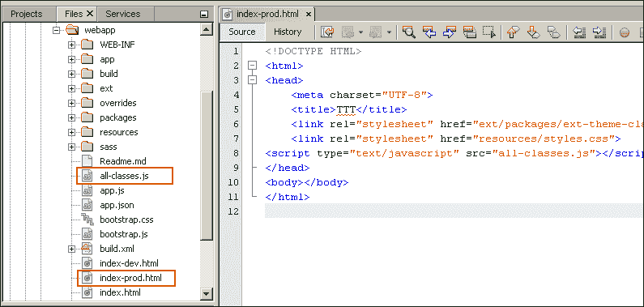

`index-prod.html`文件直接引用样式表，并使用单个编译和压缩的`all-classes.js`文件。您现在可以运行应用程序，并浏览`index-prod.html`文件，如下面的屏幕截图所示：

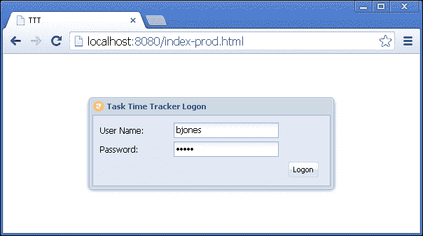

您应该注意到登录窗口显示的速度**显著**增加，因为所有 JavaScript 类都是从单个`all-classes.js`文件加载的。

`index-prod.html`文件将被开发人员用于测试编译的`all-classes.js`文件。

现在访问各个页面将允许我们区分环境：

| 在浏览器中显示的登录窗口 | 页面描述 |
| --- | --- |
| 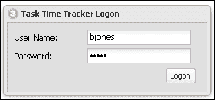 | `index.html`页面是由 Sencha Cmd 生成的，并已配置为使用`bootstrap.css`中的`gray`主题。此页面对于开发不再需要；请改用`index-dev.html`。您可以在`http://localhost:8080/index.html`访问此页面 |
| 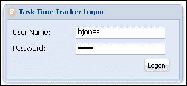 | `index-dev.html`页面使用了在`<!-- <x-compile> -->`指令之外包含的`classic`主题样式表。用于应用程序开发的文件。Ext JS 4 将根据需要动态加载源文件。您可以在`http://localhost:8080/index-dev.html`访问此页面 |
|  | `index-prod.html`文件是由 Sencha Cmd 的`compile`命令动态生成的。此页面使用了`classic`主题样式表的`all-classes.js`全合一编译 JavaScript 文件。您可以在`http://localhost:8080/index-prod.html`访问此页面 |

# 将 Sencha Cmd 编译集成到 Maven 中

到目前为止，我们一直是从终端执行 Sencha Cmd 的`compile`命令。在 Maven 构建过程中执行该命令会更好。`index-prod.html`和编译的`all-classes.js`文件可以在每次构建时自动生成。将以下`plugin`添加到 Maven 的`pom.xml`文件中将执行以下操作：

```java
<plugin>
  <groupId>org.codehaus.mojo</groupId>
  <artifactId>exec-maven-plugin</artifactId>
  <version>1.2.1</version>                    
  <executions>
    <execution>
      <id>sencha-compile</id>
      <phase>compile</phase>
      <goals>
        <goal>exec</goal>
      </goals>
      <configuration>
        <executable>C:\Sencha\Cmd\4.0.0.203\sencha.exe</executable>
        <arguments>
          <argument>-sdk</argument>
          <argument>${basedir}/src/main/webapp/ext</argument>                                
          <argument>compile</argument>
          <argument>-classpath</argument>
          <argument>${basedir}/src/main/webapp/app</argument>
          <argument>page</argument>
          <argument>-yui</argument>
          <argument>-in</argument>
          <argument>${basedir}/src/main/webapp/index-dev.html</argument>
          <argument>-out</argument>
          <argument>${basedir}/src/main/webapp/index-prod.html</argument>
          </arguments>
      </configuration>
    </execution>
  </executions>
</plugin>
```

以下是一些需要注意的要点：

+   该插件在 Maven 构建过程的`compile`阶段执行。

+   Sencha Cmd 可执行文件是使用完整的文件系统路径定义的。只有这样，才能在需要时使用不同版本的 Sencha 构建不同的项目。

+   `${basedir}`属性表示 Maven 项目根目录的完整路径。由于我们不是在`webapp`目录中执行 Sencha Cmd 的`compile`命令，因此每个参数都需要完整路径。

`index-prod.html`和`all-classes.js`文件现在将在每次构建时更新。此插件的输出可以在以下 Maven 构建日志中看到：

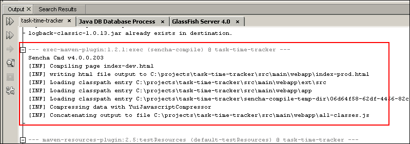

# 添加构建版本和时间戳

能够识别不同的构建是非常重要的，不仅仅是构建版本，还有构建编译的时间。项目版本是在`pom.xml`文件中使用`version`属性定义的：

```java
<groupId>com.gieman</groupId>
<artifactId>task-time-tracker</artifactId>
<version>1.0</version>
<packaging>war</packaging>
```

执行 Maven 构建将生成一个名为`task-time-tracker-1.0.war`的 WAR 文件；它是`artifactId`和`version`字段与`.war`扩展名的组合。

在企业环境中，新版本可以是从次要更改（例如，版本 1.3.2）到主要版本（例如，版本 4.0）的任何内容。`version`值的确切命名约定将取决于企业组织。无论命名约定如何，重要的是要确定**构建**是何时进行的。检查 WAR 文件的时间戳时很明显，但对于只能访问前端的应用程序测试人员来说，这并不那么明显。我们建议在 Ext JS 应用程序中添加发布版本和构建时间戳，以便用户可以确定他们正在使用的版本。登录窗口是显示此信息的明显位置，我们将添加构建版本和时间戳，如下面的屏幕截图所示：

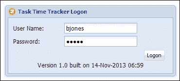

我们将进行的第一个更改是在`init`函数中的`Application.js`文件中添加两个常量：

```java
init : function(application){
  TTT.URL_PREFIX = 'ttt/';
  Ext.Ajax.on('beforerequest', function(conn, options, eOpts){
    options.url = TTT.URL_PREFIX + options.url;
  });
  TTT.BUILD_DATE = '$BUILD_DATE$';
  TTT.BUILD_VERSION = '$BUILD_VERSION$';
}
```

`TTT.BUILD_DATE`和`TTT.BUILD_VERSION`字段定义了在 Maven 构建期间将在`all-classes.js`文件中动态替换的标记（或占位符）。这些标记**不**会填充到`index-dev.html`文件中，开发环境的登录窗口将如下屏幕截图所示：

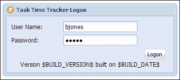

正确的构建和时间戳的标记替换在`pom.xml`文件中定义，并需要进行一些添加，首先是`maven.build.timestamp.format`属性：

```java
<properties>
  <endorsed.dir>${project.build.directory}/endorsed</endorsed.dir>
  <project.build.sourceEncoding>UTF-8</project.build.sourceEncoding>
  <maven.build.timestamp.format>dd-MMM-yyyy HH:mm</maven.build.timestamp.format>
  <spring.version>3.2.4.RELEASE</spring.version>
  <logback.version>1.0.13</logback.version>
</properties>
```

`maven.build.timestamp.format`属性定义了`LogonWindow.js`文件中时间戳的格式。第二个更改是添加`maven-replacer-plugin`：

```java
<plugin>
  <groupId>com.google.code.maven-replacer-plugin</groupId>
  <artifactId>maven-replacer-plugin</artifactId>
  <version>1.3</version>
  <executions>
    <execution>
      <phase>prepare-package</phase>
      <goals>
        <goal>replace</goal>
      </goals>
      <configuration>
        <ignoreMissingFile>false</ignoreMissingFile>
        <file>src/main/webapp/all-classes.js</file>
        <regex>false</regex>
           <replacements>
           <replacement>
             <token>$BUILD_DATE$</token>
             <value>${maven.build.timestamp}</value>
           </replacement>
           <replacement>
             <token>$BUILD_VERSION$</token>
             <value>${project.version}</value>
           </replacement>
         </replacements>
      </configuration>
    </execution>
  </executions>
</plugin>
```

该插件检查`src/main/webapp/all-classes.js`文件，并用 Maven 属性`${maven.build.timestamp}`定义的构建时间戳替换`$BUILD_DATE$`标记。`$BUILD_VERSION$`标记也将被 Maven 属性`${project.version}`定义的项目版本替换。

所需的最后一个更改是在登录窗口中显示这些属性。我们将在`LogonWindow.js`文件的`item`数组中的工具栏下方简单添加一个`container`：

```java
{
  xtype:'container',   
  style:{
    textAlign:'center'
  },
  html:' Version ' + TTT.BUILD_VERSION + ' built on ' + TTT.BUILD_DATE
}
```

现在运行项目将在`index-prod.html`页面的应用程序登录窗口中显示构建版本和时间戳：


# 构建更轻巧的 WAR 文件

生成的 WAR 文件`task-time-tracker-1.0.war`目前非常大；实际上，它大约为 32MB！`maven-war-plugin`的默认行为是将`webapp`文件夹中的所有目录添加到 WAR 文件中。对于生产部署，我们不需要大量这些文件，并且最佳做法是通过排除不需要的内容来精简 WAR 文件。我们将排除整个 Ext JS 4 SDK 以及`webapp`目录下由 Sencha Cmd 生成的所有文件夹。我们还将排除所有不适用于生产使用的资源，包括开发过程中使用的`index*.html`文件。GlassFish 提供的唯一文件将是尚未创建的`index.jsp`：

```java
<!DOCTYPE HTML>
<html>
  <head>
    <meta charset="UTF-8">
    <title>TTT</title>
    <link rel="stylesheet" href="resources/ext-theme-classic-all.css">
    <link rel="stylesheet" href="resources/styles.css">    
<script type="text/javascript" src="img/all-classes.js"></script>
  </head>
<body></body>
</html>
```

您会注意到`ext-theme-classic-all.css`文件的位置在`resources`目录中，而不是在 HTML 页面中使用的深层嵌套的`ext/packages/ext-theme-classic/build/resources`位置。WAR 文件生成过程将从 Ext JS 4 SDK 位置复制适当的内容到`resources`目录。这样就不需要在 WAR 文件中包含 SDK 目录结构。

`index.jsp`文件的生成现在将成为我们默认的`welcome-file`，我们将相应地调整`WEB-INF/web.xml`文件：

```java
<welcome-file-list>
  <welcome-file>index.jsp</welcome-file>
</welcome-file-list>
```

在`web.xml`文件中进行此更改后运行应用程序将确保在 URL 中*未*指定资源时，`index.jsp`文件由 GlassFish 提供。

构建更轻量级的生产 WAR 文件所需的`maven-war-plugin`中的更改在以下代码片段中突出显示：

```java
<plugin>
  <groupId>org.apache.maven.plugins</groupId>
  <artifactId>maven-war-plugin</artifactId>
  <version>2.3</version>
  <configuration>
    <warName>${project.build.finalName}</warName>
    <failOnMissingWebXml>false</failOnMissingWebXml>
 <webResources>
 <resource>
 <directory>src/main/webapp/ext/packages/ext-theme-classic/build/resources</directory>
 <targetPath>resources</targetPath>
 <excludes>
 <exclude>ext-theme-classic-all-*</exclude>
 </excludes> 
 </resource> 
 </webResources> 
 <packagingExcludes>.sencha/**,app/**,sass/**,overrides/**,build/**,ext/**,app.json,bootstrap.css,bootstrap.js,build.xml, index.html,index-dev.html,index-prod.html,app.js</packagingExcludes> 
  </configuration>
</plugin>
```

`webResources`定义将 Ext JS 4 `classic` CSS 主题的内容复制到`resources`目录。`targetPath`属性始终相对于`webapp`目录；因此，我们不需要`resources`目录的完整路径。`directory`属性始终相对于 Maven 项目的根目录；因此，它需要完整路径。

`packagingExcludes`属性列出了不应包含在 WAR 文件中的所有目录和文件。`**`符号表示应排除所有子目录。这将确保所有不需要的 Sencha Cmd 生成的文件夹都将被排除在我们的生产 WAR 文件之外。

执行 Maven 构建现在将生成一个大约 6.6 MB 的 WAR 文件，其中只包含生产应用程序所需的文件。

# 将 WAR 文件部署到 GlassFish

到目前为止，我们一直通过 NetBeans 使用**Run Project**命令将 3T 应用程序部署到 GlassFish。在生产环境中，我们通过 GlassFish 管理控制台或使用`asadmin`命令行部署应用程序。现在我们将学习如何使用管理控制台将`task-time-tracker-1.0.war`文件部署到 GlassFish。

## 打开 GlassFish 管理控制台

在 NetBeans 中或使用`asadmin`命令在控制台窗口中启动 GlassFish。我们建议使用`asadmin`，因为这通常是企业环境中管理 GlassFish 的方式。

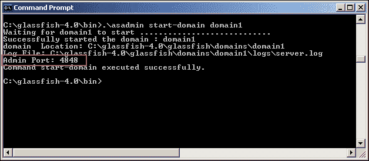

如前面的屏幕截图所示，默认的 GlassFish`Admin port`值为`4848`，但如果配置了多个 GlassFish 域，它将不同。在浏览器中打开此位置以显示 GlassFish 管理控制台：

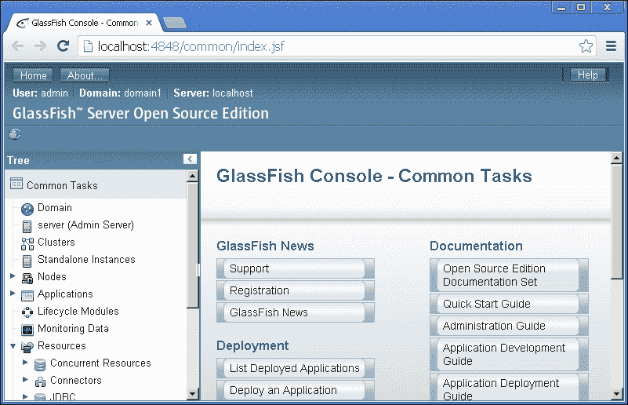

## GlassFish 安全基础

在使用 NetBeans 提供的默认 GlassFish 安装时，通常在`localhost`上工作时不会提示您输入密码。如果提示您，默认用户名是`admin`，密码为空。以前的 GlassFish 版本的默认密码是`adminadmin`；在撰写本文时，情况已经不再是这样。您应该意识到这可能会在将来再次更改。

在 GlassFish 运行在浏览器之外的远程主机上工作时，当您尝试访问管理控制台时，系统将始终提示您输入用户名和密码。这是企业环境中的情况，不同的服务器通常运行多个 GlassFish 实例。在这种环境中，默认情况下将禁用对管理控制台的远程访问，您只能从`localhost`访问管理控制台。可以通过在运行 GlassFish 服务器的主机上执行以下命令来允许从不同客户端进行远程访问：

```java
asadmin --host localhost --port 4848 enable-secure-admin
asadmin restart-domain domain1

```

在启用安全管理时，您可能会收到一条消息，提示“**您的管理员密码为空**”（默认情况）。要解决此问题，您需要首先使用以下命令将管理员密码从默认（空）密码更改为其他密码：

```java
asadmin --host localhost --port 4848 change-admin-password

```

然后将提示您输入新密码。然后将可以启用安全管理。

### 注意

深入研究 GlassFish 服务器管理的范围超出了本书的范围。我们建议您浏览[`glassfish.java.net/`](https://glassfish.java.net/)上的优秀文档和用户指南。

## 使用管理控制台部署 WAR 文件

通过 GlassFish 管理控制台部署 Web 应用程序是一个简单的过程。登录到 GlassFish 管理控制台后，单击并打开如下屏幕截图中显示的**应用程序**节点：

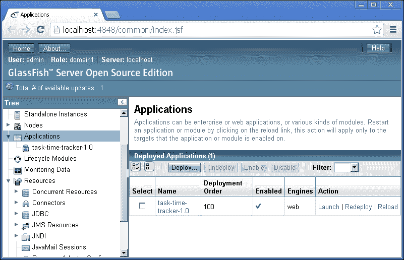

可能已经部署了一个**task-time-tracker**应用程序，这是由于之前 NetBeans 部署的结果（如前面的屏幕截图所示）。如果是这种情况，请选择应用程序名称旁边的复选框，然后单击**取消部署**。

单击**部署...**按钮，输入以下详细信息：

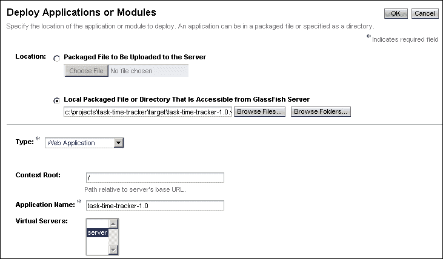

**可从 GlassFish 服务器访问的本地打包文件或目录**字段将定义本地文件系统上`task-time-tracker-1.0.war`文件的位置。如果部署到远程服务器，您将需要使用**要上传到服务器的包文件**选项。

**上下文根**字段定义了部署应用程序的 URL 路径。我们将 3T 应用程序部署到上下文根。

**应用程序名称**字段定义了 GlassFish 服务器中应用程序的名称，并显示在应用程序列表中。

**虚拟服务器**下拉菜单定义了将用于托管应用程序的虚拟服务器。虚拟服务器，有时称为虚拟主机，是一个允许同一物理服务器托管部署到不同监听器的多个 Internet 域名的对象。可以从此列表中选择多个虚拟服务器（如果已配置）。

单击**确定**按钮部署`task-time-tracker-1.0.war`文件。此操作将返回到已部署应用程序列表：

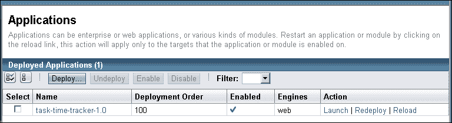

**task-time-tracker-1.0**应用程序部署到默认的**虚拟服务器**，名称为`server`，可通过以下两个监听器访问：

+   `http://localhost:8080/`

+   `https://localhost:8181/`

这是安装 GlassFish 后的默认虚拟服务器/HTTP 服务配置。请注意，在允许用户登录的生产企业环境中，只有 HTTPS 版本会被启用，以确保与服务器的加密 SSL 连接。现在可以访问这些 URL 来测试部署。打开`https://localhost:8181/`链接将会出现警告，因为证书无效，如下屏幕截图所示：

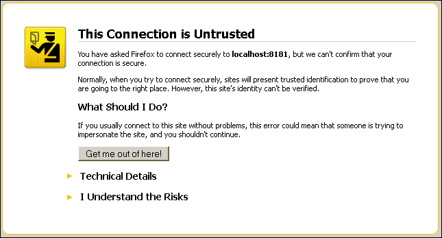

可以忽略此项，然后可以通过单击**我了解风险**并确认异常（显示的确切消息将取决于浏览器）继续访问链接。右键单击登录页面，选择**查看页面源代码**将确认您正在使用生产 WAR 文件；如下屏幕截图所示：

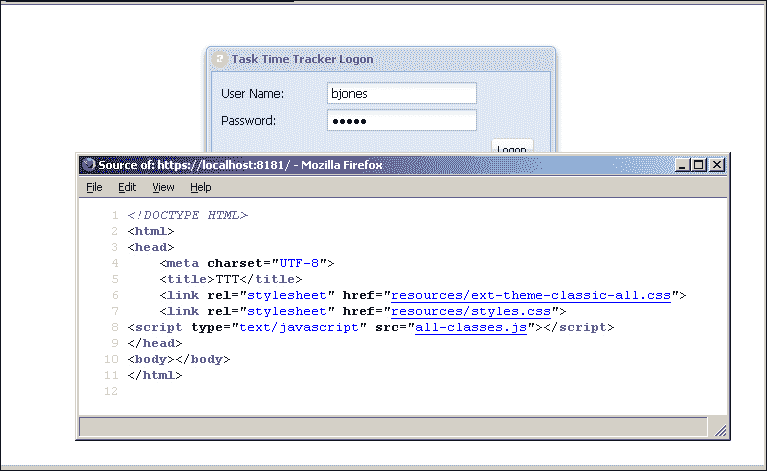

### 注意

再次配置 HTTP 监听器和虚拟服务器超出了本书的范围。我们建议您浏览[`glassfish.java.net/documentation.html`](https://glassfish.java.net/documentation.html)上的适当文档。

## 使用 asadmin 部署 WAR 文件

也可以使用`asadmin`命令部署`task-time-tracker-1.0.war`文件。这在企业组织中是常见情况，因为出于安全原因，GlassFish 管理控制台未启用。`asadmin deploy`命令的语法是：

```java
asadmin deploy --user $ADMINUSER --passwordfile $ADMINPWDFILE 
--host localhost --port $ADMINPORT --virtualservers $VIRTUAL_SERVER 
--contextroot --force --name $WEB_APPLICATION_NAME $ARCHIVE_FILE

```

这个命令必须在一行上执行，并且以`$`为前缀的每个大写变量名必须替换为正确的值。确切的语法和参数可能取决于环境，我们不会进一步讨论这个命令的结构。如果您有兴趣了解更多关于这个命令的信息，可以浏览[`docs.oracle.com/cd/E18930_01/html/821-2433/deploy-1.html`](http://docs.oracle.com/cd/E18930_01/html/821-2433/deploy-1.html)上的详细文档；请注意，该文档是针对 GlassFish 3.1 参考手册的。

## 更多部署信息和阅读材料

[`glassfish.java.net/docs/4.0/application-deployment-guide.pdf`](https://glassfish.java.net/docs/4.0/application-deployment-guide.pdf)中包含了将应用程序部署到 GlassFish 4 服务器的广泛和详细的解释。这份文档超过 200 页，应该在本章未涵盖的任何部署相关问题上进行咨询。

# GlassFish 性能调优和优化

性能调优和 GlassFish 服务器优化的权威指南可以在这里找到

[`glassfish.java.net/docs/4.0/performance-tuning-guide.pdf`](https://glassfish.java.net/docs/4.0/performance-tuning-guide.pdf)。

本指南包括调整应用程序以及调整 GlassFish 服务器本身的部分。涵盖了配置线程池、Web 容器设置、连接池、垃圾收集、服务器内存设置等方面。我们建议您查阅本文档，尽可能多地了解企业开发和部署的重要方面。

# 摘要

我们的最后一章涵盖了关键的生产企业部署概念。我们将我们的 Ext JS 4 应用程序编译成一个名为`all-classes.js`的文件以供生产使用，并将构建版本和时间戳添加到`LogonWindow.js`文件中。然后，我们通过删除所有不需要的资源，减小了由 Maven 生成的`task-time-tracker.war`文件的大小，以便用于生产部署。这个生产 WAR 文件只包含应用程序在运行时所需的资源，不包括所有不需要的 Ext JS 4 SDK 资源和目录。然后，我们检查了 GlassFish 的部署过程，并通过 GlassFish 管理控制台部署了`task-time-tracker-1.0.war`文件。关于 GlassFish 服务器，您还有很多东西可以学习，但主菜已上！

我们的 Ext JS 和 Spring 开发之旅现在结束了。本书涵盖了大量领域，并为使用这些关键技术进行企业应用程序开发提供了坚实的基础。我们真诚地希望通过阅读本书，您的开发之旅将更加轻松和有益。
