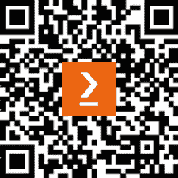

# 前言

如果您是一位希望成为全栈开发者或学习另一个前端框架的现有 Java 开发者，这本书是您简洁的 React 入门指南。在这个三部分的建设过程中，您将创建一个健壮的 Spring Boot 后端、一个 React 前端，然后将它们一起部署。

这本新版本已更新至 Spring Boot 3，并增加了关于安全和测试的扩展内容。首次，它还涵盖了使用热门的 TypeScript 进行 React 开发。

您将探索创建 REST API、测试、安全性和部署应用程序所需的元素。您将了解自定义 Hooks、第三方组件和 MUI。

在本书结束时，您将能够使用最新的工具和现代最佳实践构建全栈应用程序。

# 适合阅读本书的对象

这本书是为那些对 Spring Boot 有基本了解但不知道从何开始构建全栈应用程序的 Java 开发者而写的。基本的 JavaScript 和 HTML 知识将帮助您跟上进度。

如果您是一位了解 JavaScript 基础的前端开发者，希望学习全栈开发，或者是一位在其他技术栈中经验丰富的全栈开发者，希望学习新的技术栈，这本书将非常有用。

# 本书涵盖内容

## 第一部分：使用 Spring Boot 进行后端编程

*第一章*，*设置环境和工具 – 后端*，解释了如何安装本书中用于后端开发的软件以及如何创建您的第一个 Spring Boot 应用程序。

*第二章*，*理解依赖注入*，解释了依赖注入的基础知识以及如何在 Spring Boot 中实现它。

*第三章*，*使用 JPA 创建和访问数据库*，介绍了 JPA 并解释了如何使用 Spring Boot 创建和访问数据库。

*第四章*，*使用 Spring Boot 创建 RESTful Web 服务*，解释了如何使用 Spring Data REST 创建 RESTful Web 服务。

*第五章*，*保护您的后端*，解释了如何使用 Spring Security 和 JWTs 来保护您的后端。

*第六章*，*测试您的后端*，涵盖了 Spring Boot 中的测试。我们将为我们的后端创建一些单元和集成测试，并了解测试驱动开发。

## 第二部分：使用 React 进行前端编程

*第七章*，*设置环境和工具 – 前端*，解释了如何安装本书中用于前端开发的软件。

*第八章*，*React 入门*，介绍了 React 库的基础知识。

*第九章*，*TypeScript 简介*，涵盖了 TypeScript 的基础知识以及如何使用它来创建 React 应用程序。

*第十章*，*使用 React 消费 REST API*，展示了如何使用 Fetch API 通过 React 使用 REST API。

*第十一章*，*React 的前端开发中的一些有用的第三方组件*，展示了我们将使用的一些有用的组件。

## 第三部分：全栈开发

*第十二章*，*为我们的 Spring Boot RESTful Web 服务设置前端*，解释了如何为前端开发设置 React 应用程序和 Spring Boot 后端。

*第十三章*，*添加 CRUD 功能*，展示了如何将 CRUD 功能实现到 React 前端。

*第十四章*，*使用 MUI 美化前端*，展示了如何使用 React MUI 组件库来美化用户界面。

*第十五章*，*测试您的前端*，解释了 React 前端测试的基础知识。

*第十六章*，*保护您的应用程序*，解释了如何使用 JWT 保护前端。

*第十七章*，*部署您的应用程序*，演示了如何使用 AWS 和 Netlify 部署应用程序，以及如何使用 Docker 容器。

# 要充分利用本书

在本书中，您需要使用 Spring Boot 3.x 版本。所有代码示例都是在 Windows 上使用 Spring Boot 3.1 和 React 18 进行测试的。在安装任何 React 库时，您应该检查其文档中的最新安装命令，并查看是否有与本书中使用版本相关的重大变化。

每章的技术要求都在章节开头说明。

如果您使用的是本书的数字版，我们建议您亲自输入代码或从本书的 GitHub 仓库[`github.com/PacktPublishing/Full-Stack-Development-with-Spring-Boot-3-and-React-Fourth-Edition`](https://github.com/PacktPublishing/Full-Stack-Development-with-Spring-Boot-3-and-React-Fourth-Edition)获取代码。这样做将帮助您避免与代码复制粘贴相关的任何潜在错误。

## 下载示例代码文件

您可以从 GitHub 在[`github.com/PacktPublishing/Full-Stack-Development-with-Spring-Boot-3-and-React-Fourth-Edition`](https://github.com/PacktPublishing/Full-Stack-Development-with-Spring-Boot-3-and-React-Fourth-Edition)下载本书的示例代码文件。如果代码有更新，它将在 GitHub 仓库中更新。

我们还有其他来自我们丰富的图书和视频目录的代码包，可在[`github.com/PacktPublishing/`](https://github.com/PacktPublishing/)找到。查看它们！

## 下载彩色图像

我们还提供了一份包含本书中使用的截图和图表彩色图像的 PDF 文件。您可以从这里下载：[`packt.link/gbp/9781805122463`](https://packt.link/gbp/9781805122463)

## 使用的约定

本书使用了多种文本约定。

`文本中的代码`：表示文本中的代码单词、数据库表名、文件夹名、文件名、文件扩展名、路径名、虚拟 URL、用户输入和 Twitter 昵称。以下是一个示例：“将`Button`导入到`AddCar.js`文件中。”

代码块按照以下方式设置：

```java
<dependency>
     <groupId>org.springframework.boot</groupId>
     <artifactId>spring-boot-starter-web</artifactId>
</dependency> 
```

当我们希望您注意代码块中的特定部分时，相关的行或项目将以粗体显示：

```java
public class Car {
    @Id
    **@GeneratedValue(strategy=GenerationType.AUTO)**
    private long id;
    private String brand, model, color, registerNumber;
    private int year, price;
} 
```

任何命令行输入或输出都按照以下方式编写：

```java
npm install component_name 
```

**粗体**：表示新术语、重要单词或您在屏幕上看到的单词。例如，菜单或对话框中的单词以**粗体**显示。以下是一个示例：“您可以选中**运行**菜单并按**运行 | Java 应用程序**。”

**重要提示**

它看起来像这样。

TIPS

它看起来像这样。

# 联系我们

我们始终欢迎读者的反馈。

**一般反馈**：如果您对本书的任何方面有疑问，请通过 customercare@packtpub.com 给我们发邮件，并在邮件主题中提及书名。

**勘误表**：尽管我们已经尽一切努力确保内容的准确性，但错误仍然可能发生。如果您在这本书中发现了错误，我们将不胜感激，如果您能向我们报告这一点。请访问[www.packtpub.com/support/errata](http://www.packtpub.com/support/errata)并填写表格。

**盗版**：如果您在互联网上以任何形式遇到我们作品的非法副本，如果您能提供位置地址或网站名称，我们将不胜感激。请通过版权@packt.com 与我们联系，并提供材料的链接。

**如果您有兴趣成为作者**：如果您在某个领域有专业知识，并且您有兴趣撰写或为书籍做出贡献，请访问[authors.packtpub.com](http://authors.packtpub.com)。

# 分享您的想法

读完 *Full Stack Development with Spring Boot 3 and React, Fourth Edition* 后，我们非常乐意听到您的想法！请[点击此处直接进入此书的亚马逊评论页面](https://packt.link/r/1805122460)并分享您的反馈。

您的评论对我们和科技社区都很重要，并将帮助我们确保我们提供高质量的内容。

# 下载此书的免费 PDF 复印本

感谢您购买此书！

您喜欢在路上阅读，但无法携带您的印刷书籍到处走吗？

您的电子书购买是否与您选择的设备不兼容？

不要担心，现在，每购买一本 Packt 书，您都可以免费获得该书的 DRM-free PDF 版本。

在任何地方、任何设备上阅读。直接从您最喜欢的技术书籍中搜索、复制和粘贴代码到您的应用程序中。

好处不止于此，您还可以获得独家折扣、时事通讯和每日免费内容的每日电子邮件。

按照以下简单步骤获取好处：

1.  扫描下面的二维码或访问以下链接



[`packt.link/free-ebook/9781805122463`](https://packt.link/free-ebook/9781805122463)

1.  提交您的购买证明

1.  就这样！我们将直接将您的免费 PDF 和其他好处发送到您的电子邮件
