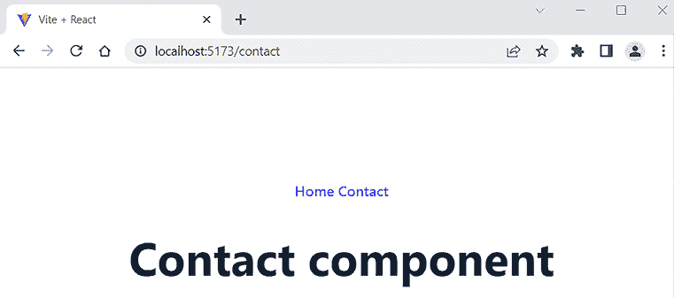

# 第十一章：React 有用的第三方组件

React 是基于组件的，我们可以找到很多有用的第三方组件，我们可以在我们的应用中使用。在本章中，我们将查看我们将要在前端使用的几个组件。我们将探讨如何找到合适的组件，以及你如何在你的应用中使用它们。

在本章中，我们将涵盖以下主题：

+   安装第三方 React 组件

+   使用 AG Grid

+   使用 Material UI 组件库

+   使用 React Router 管理路由

# 技术要求

必须安装 Node.js。本章所需的 GitHub 链接也将被要求：[`github.com/PacktPublishing/Full-Stack-Development-with-Spring-Boot-3-and-React-Fourth-Edition/tree/main/Chapter11`](https://github.com/PacktPublishing/Full-Stack-Development-with-Spring-Boot-3-and-React-Fourth-Edition/tree/main/Chapter11).

# 安装第三方 React 组件

有很多不同目的的 React 组件可供使用。你可以通过不从头开始做来节省时间。知名第三方组件也得到了良好的测试，并且有良好的社区支持。

我们的首要任务是找到适合我们需求的组件。一个很好的搜索组件的网站是 **JS.coach** ([`js.coach/`](https://js.coach/))。你只需要输入一个关键词，搜索，并从库列表中选择 **React**。

在下面的屏幕截图中，你可以看到 React 的表格组件搜索结果：


图 11.1：JS.coach

另一个优秀的 React 组件资源是 `awesome-react-components`：[`github.com/brillout/awesome-react-components`](https://github.com/brillout/awesome-react-components).

组件通常有良好的文档，可以帮助你在自己的 React 应用中使用它们。让我们看看我们如何在应用中安装第三方组件并开始使用它：

1.  导航到 **JS.coach** 网站，在搜索输入字段中输入 `date`，并通过 **React** 进行筛选。

1.  在搜索结果中，你会看到一个名为 `react-date-picker` 的列表组件（带有两个连字符）。点击组件链接以查看有关组件的更多详细信息。

1.  你应该在信息页面上找到安装说明，以及一些如何使用组件的简单示例。你还应该检查组件的开发是否仍然活跃。信息页面通常会提供组件的网站地址或 GitHub 仓库，在那里你可以找到完整的文档。以下屏幕截图显示了 `react-date-picker` 的信息页面：


图 11.2：react-date-picker 信息页面

1.  如你所见，组件是通过 `npm` 包安装的。安装组件的命令语法看起来像这样：

    ```java
    npm install component_name 
    ```

    或者，如果你使用 `yarn`，它看起来像这样：

    ```java
    yarn add component_name 
    ```

    `npm` 的 `install` 和 `yarn` 的 `add` 命令将组件的依赖项保存到您的 React 应用根文件夹中的 `package.json` 文件中。

    现在，我们将安装 `react-date-picker` 组件到我们在 *第七章*，*设置环境和工具 – 前端* 中创建的 `myapp` React 应用中。移动到您的应用根文件夹，并输入以下命令：

    ```java
    npm install react-date-picker 
    ```

1.  如果您从应用的根文件夹打开 `package.json` 文件，您会看到组件现在已被添加到 `dependencies` 部分，如下面的代码片段所示：

    ```java
    "dependencies": {
      "react": "¹⁸.2.0",
      "react-dom": "¹⁸.2.0"
      **"react-date-picker"****:****"¹⁰.0.3"****,**
    }, 
    ```

    如上图所示，您可以从 `package.json` 文件中找到已安装的版本号。

    如果您想安装特定版本的组件，可以使用以下命令：

    ```java
    npm install component_name@version 
    ```

    如果您想从 React 应用中移除已安装的组件，可以使用以下命令：

    ```java
    npm uninstall component_name 
    ```

    或者，如果您使用 `yarn`：

    ```java
    yarn remove component_name 
    ```

    您可以通过在项目根目录下使用以下命令来查看过时的组件。如果输出为空，则所有组件都是最新版本：

    ```java
    npm outdated 
    ```

    您可以通过在项目根目录下使用以下命令来更新所有过时的组件：

    ```java
    npm update 
    ```

    您首先应该确保没有可能破坏现有代码的更改。适当的组件有变更日志或发布说明可用，您可以在其中查看新版本中有什么变化。

1.  已安装的组件将保存在您应用的 `node_modules` 文件夹中。如果您打开该文件夹，应该会找到 `react-date-picker` 文件夹，如下面的截图所示！

    图 11.3：node_modules

    您可以通过以下 `npm` 命令获取您项目的依赖列表：

    ```java
    npm list 
    ```

    如果您将 React 应用的源代码推送到 GitHub，您不应该包含 `node_modules` 文件夹，因为它包含大量的文件。Vite 项目包含一个 `.gitignore` 文件，该文件将 `node_modules` 文件夹排除在仓库之外。`.gitignore` 文件的一部分如下所示，您可以看到 `node_modules` 出现在文件中：

    ```java
    # Logs
    logs
    *.log
    npm-debug.log*
    yarn-debug.log*
    yarn-error.log*
    pnpm-debug.log*
    lerna-debug.log*
    node_modules
    dist
    dist-ssr
    *.local 
    ```

    策略是这样的，当您从 GitHub 仓库克隆 React 应用时，您会输入 `npm install` 命令，该命令从 `package.json` 文件中读取依赖项并将其下载到您的应用中。

1.  要开始使用您已安装的组件，将其导入到您想要使用它的文件中。实现此目的的代码如下所示：

    ```java
    import DatePicker from 'react-date-picker'; 
    ```

您现在已经学会了如何在 React 应用中安装 React 组件。接下来，我们将开始在 React 应用中使用第三方组件。

# 使用 AG Grid

**AG Grid** ([`www.ag-grid.com/`](https://www.ag-grid.com/)) 是一个灵活的数据网格组件，适用于 React 应用。它就像一个电子表格，您可以使用它来展示您的数据，并且它可以包含交互性。它具有许多有用的功能，如过滤、排序和透视。我们将使用免费（MIT 许可证下）的社区版。

让我们修改我们在第十章 *使用 React 消费 REST API* 中创建的 GitHub **REST API** 应用。按照以下步骤操作：

1.  要安装 `ag-grid` 社区组件，打开命令行或终端，并切换到 `restgithub` 文件夹，这是应用的根文件夹。通过输入以下命令来安装组件：

    ```java
    npm install ag-grid-community ag-grid-react 
    ```

1.  使用 **Visual Studio Code** （**VS Code**） 打开 `App.tsx` 文件，并从 `return` 语句中删除 `table` 元素。现在，`App.tsx` 文件应该看起来像这样：

    ```java
    import { useState } from 'react';
    import axios from 'axios';
    import './App.css';
    type Repository = {
      id: number;
      full_name: string;
      html_url: string;
    };
    function App() {
      const [keyword, setKeyword] = useState('');
      const [repodata, setRepodata] = useState<Repository[]>([]);
      const handleClick = () => {
        axios.get<{ items: Repository[]
          }>(`https ://api.github .com/search/repositories?q=${keyword}`)
        .then(response => setRepodata(response.data.items))
        .catch(err => console.error(err));
      }

      return (
        <>
          <input
            value={keyword}
            onChange={e => setKeyword(e.target.value)} />
          <button onClick={handleClick}>Fetch</button>
        </>
      );
    export default App; 
    ```

1.  在 `App.tsx` 文件的开始处添加以下代码行以导入 `ag-grid` 组件和样式表：

    ```java
    import { AgGridReact } from 'ag-grid-react';
    import 'ag-grid-community/styles/ag-grid.css';
    import 'ag-grid-community/styles/ag-theme-material.css'; 
    ```

    `ag-grid` 提供了不同的预定义样式。我们正在使用 Material Design 风格。

1.  接下来，我们将把导入的 `AgGridReact` 组件添加到 `return` 语句中。为了填充 `ag-grid` 组件中的数据，您必须将 `rowData` 属性传递给组件。数据可以是一个对象数组，因此我们可以使用我们的状态 `repodata`。`ag-grid` 组件应该被包裹在定义样式的 `div` 元素中。代码如下所示：

    ```java
    return (
        <div className="App">
          <input value={keyword}
            onChange={e => setKeyword(e.target.value)} />
          <button onClick={fetchData}>Fetch</button>
          **<****div****className****=****"ag-theme-material"**
            **style****=****{{height:****500****,** **width:****850****}}>**
            **<****AgGridReact**
              **rowData****=****{repodata}**
            **/>**
          **</****div****>**
        </div>
      ); 
    ```

1.  接下来，我们将为 `ag-grid` 定义列。我们将定义一个名为 `columnDefs` 的状态，它是一个列定义对象的数组。`ag-grid` 提供了一个 `ColDef` 类型，我们可以在其中使用。在列对象中，您必须使用必需的 `field` 属性来定义数据访问器。`field` 的值是列应显示的 REST API 响应数据中的属性名：

    ```java
    // Import ColDef type
    import { ColDef } from 'ag-grid-community';
    // Define columns
    const [columnDefs] = useState<ColDef[]>([
        {field: 'id'},
        {field: 'full_name'},
        {field: 'html_url'},
    ]); 
    ```

1.  最后，我们将使用 AG Grid 的 `columnDefs` 属性来定义这些列，如下所示：

    ```java
    <AgGridReact
      rowData={data}
      **columnDefs****=****{columnDefs}**
    /> 
    ```

1.  运行应用并在网页浏览器中打开它。默认情况下，表格看起来相当不错，如下面的截图所示：


图 11.4：ag-grid 组件

1.  默认情况下，排序和筛选是禁用的，但您可以使用 `ag-grid` 列中的 `sortable` 和 `filter` 属性来启用它们，如下所示：

    ```java
    const [columnDefs] = useState<ColDef[]>([
      {field: 'id'**,** **sortable****:** **true****,** **filter****:** **true**},
      {field: 'full_name'**,** **sortable****:** **true****,** **filter****:** **true**},
      {field: 'html_url'**,** **sortable****:** **true****,** **filter****:** **true**}
    ]); 
    ```

    现在，您可以通过点击列标题来对网格中的任何列进行排序和筛选，如下面的截图所示：

    

    图 11.5：ag-grid 筛选和排序

1.  您还可以通过使用 `pagination` 和 `paginationPageSize` 属性来在 `ag-grid` 中启用分页并设置页面大小，如下所示：

    ```java
    <AgGridReact
      rowData={data}
      columnDefs={columnDefs}
      **pagination****=****{true}**
      **paginationPageSize****=****{****8}**
    /> 
    ```

    现在，您应该能在表格中看到分页，如下面的截图所示：

    

    图 11.6：ag-grid 分页

    您可以从 AG Grid 网站找到有关不同网格和列属性的文档：[`www.ag-grid.com/react-data-grid/column-properties/`](https://www.ag-grid.com/react-data-grid/column-properties/)。

1.  可以使用 `cellRenderer` 属性来自定义表格单元格的内容。以下示例展示了如何在网格单元格中渲染一个按钮：

    ```java
    // Import ICellRendererParams
    import { ICellRendererParams } from 'ag-grid-community';
    // Modify columnDefs
    const columnDefs = useState<ColDef[]>([
      {field: 'id', sortable: true, filter: true},
      {field: 'full_name', sortable: true, filter: true},
      {field: 'html_url', sortable: true, filter: true},
      **{**
        **field****:** **'full_name'****,**
        **cellRenderer****:** **(****params: ICellRendererParams****) =>** **(**
          **<****button**
            **onClick****=****{()** **=>** **alert(params.value)}>**
            **Press me**
          **</****button****>**
        **),**
      **},**
    ]); 
    ```

    单元渲染器中的函数接受 `params` 作为参数。`params` 的类型是 `ICellRendererParams`，我们必须导入它。`params.value` 将是 `full_name` 单元的值，该值定义在列定义的 `field` 属性中。如果您需要访问行中的所有值，可以使用 `params.row`，它是一个完整的行对象。这在您需要将整行数据传递给其他组件时非常有用。当按钮被按下时，它将打开一个弹窗，显示 `full_name` 单元的值。

    这是带有按钮的表格截图：

    

    图 11.7：带有按钮的网格

    如果您按下任何按钮，您应该会看到一个弹窗，显示 `full_name` 单元的值。

1.  按钮列的标题为 `Full_name`，因为默认情况下，字段名称用作标题名称。如果您想使用其他名称，可以在列定义中使用 `headerName` 属性，如下面的代码所示：

    ```java
    const columnDefs: ColDef[] = [
      { field: 'id', sortable: true, filter: true },
      { field: 'full_name', sortable: true, filter: true },
      { field: 'html_url', sortable: true, filter: true },
      {
        **headerName****:** **'Actions'**,
        field: 'full_name',
        cellRenderer: (params: ICellRendererParams) => (
          <button
            onClick={() => alert(params.value)}>
            Press me
          </button>
        ),
      },
    ]; 
    ```

在下一节中，我们将开始使用 Material UI 组件库，这是最受欢迎的 React 组件库之一。

# 使用 Material UI 组件库

**Material UI** ([`mui.com/`](https://mui.com/))，或 **MUI**，是一个实现谷歌的 Material Design 语言的 React 组件库 ([`m2.material.io/design`](https://m2.material.io/design))。Material Design 是当今最受欢迎的设计系统之一。MUI 包含了许多不同的组件——如按钮、列表、表格和卡片——您可以使用它们来实现一个美观且统一的 **用户界面**（**UI**）。

在本书中，我们将使用 MUI 版本 5。如果您想使用其他版本，应遵循官方文档（[`mui.com/material-ui/getting-started/`](https://mui.com/material-ui/getting-started/)）。MUI 版本 5 支持 Material Design 版本 2。

在本节中，我们将创建一个小型购物清单应用程序，并使用 MUI 组件来设计用户界面。在我们的应用程序中，用户可以输入包含两个字段的购物项目：*产品* 和 *数量*。输入的购物项目将以列表形式显示在应用程序中。最终的 UI 界面如下截图所示。**添加项目**按钮会打开一个模态表单，用户可以在其中输入新的购物项目：


图 11.8：购物清单 UI

现在，我们已经准备好开始实施：

1.  创建一个新的名为 `shoppinglist` 的 React 应用程序（选择 **React** 框架和 **TypeScript** 变体），并通过运行以下命令安装依赖项：

    ```java
    npm create vite@latest
    cd shoppinglist
    npm install 
    ```

1.  使用 VS Code 打开购物清单应用程序。在 PowerShell 或任何合适的终端中，在项目根目录下输入以下命令来安装 MUI：

    ```java
    npm install @mui/material @emotion/react @emotion/styled 
    ```

1.  MUI 默认使用 *Roboto* 字体，但该字体并非直接提供。安装 Roboto 字体的最简单方法是使用 Google Fonts。要使用 Roboto 字体，请将以下行添加到您的 `index.html` 文件的 `head` 元素内部：

    ```java
    <link
      rel="stylesheet"
      href="https://fonts.googleapis.com/css?family=\
            Roboto:300,400,500,700&display=swap"
    /> 
    ```

1.  打开 `App.tsx` 文件并移除片段（`<></>`）内的所有代码。同时，移除未使用的代码和导入。现在，你的 `App.tsx` 文件应该看起来像这样：

    ```java
    // App.tsx
    import './App.css';
    function App() {
      return (
        <>
        </>
      );
    }
    export default App; 
    ```

    你也应该在浏览器中看到一个空页面。

1.  MUI 提供了不同的布局组件，基本的布局组件是 `Container`。这个组件用于水平居中你的内容。你可以使用 `maxWidth` 属性指定容器的最大宽度；默认值是 `lg`（大），这对于我们来说很合适。让我们在 `App.tsx` 文件中使用 `Container` 组件，如下所示：

    ```java
    **import****Container****from****'@mui/material/Container'****;**
    import './App.css';
    function App() {
      return (
        **<****Container****>**
        **</****Container****>**
      );
    }
    export default App; 
    ```

1.  从 `main.tsx` 文件中移除 `index.css` 文件导入，以便我们的应用获得全屏。我们也不希望使用 Vite 的预定义样式：

    ```java
    // main.tsx
    import React from 'react'
    import ReactDOM from 'react-dom/client'
    import App from './App.jsx'
    **import****'./index.css'****// REMOVE THIS LINE**
    ReactDOM.createRoot(document.getElementById('root')).render(
      <React.StrictMode>
        <App />
      </React.StrictMode>,
    ) 
    ```

1.  接下来，我们将使用 MUI 的 `AppBar` 组件在我们的应用中创建工具栏。将 `AppBar`、`ToolBar` 和 `Typography` 组件导入到你的 `App.tsx` 文件中。同时，导入 React 的 `useState`，我们稍后会用到。代码如下所示：

    ```java
    **import** **{ useState }** **from****'react'****;**
    import Container from '@mui/material/Container';
    **import****AppBar****from****'@mui/material/AppBar'****;**
    **import****Toolbar****from****'@mui/material/Toolbar'****;**
    **import****Typography****from****'@mui/material/Typography'****;**
    import './App.css' 
    ```

1.  通过向 `App` 组件的 `return` 语句中添加以下代码来渲染 `AppBar`。`Typography` 组件提供了预定义的文本大小，我们将在工具栏文本中使用它。`variant` 属性可以用来定义文本大小：

    ```java
    function App() {
      return (
        <Container>
          **<****AppBar****position****=****"static"****>**
            **<****Toolbar****>**
              **<****Typography****variant****=****"h6"****>**
                **Shopping List**
              **</****Typography****>**
            **</****Toolbar****>**
          **</****AppBar****>**
        </Container>
      );
    } 
    ```

1.  启动你的应用。现在它应该看起来像这样：


图 11.9：AppBar 组件

1.  在 `App` 组件中，我们需要一个数组状态来保存购物清单项目。一个购物清单项目包含两个字段：`product` 和 `amount`。我们必须为购物项目创建一个类型 `Item`，我们还将导出它，因为我们稍后需要在其他组件中使用它：

    ```java
    // App.tsx
    export type Item = {
      product: string;
      amount: string;
    } 
    ```

1.  接下来，我们将创建一个状态来保存我们的购物项目。创建一个名为 `items` 的状态，其类型是 `Item` 类型的数组：

    ```java
    const [items, setItems] = useState<Item[]>([]); 
    ```

1.  然后，创建一个函数来向 `items` 状态中添加新项目。在 `addItem` 函数中，我们将使用扩展运算符（`...`）在现有数组的开头添加一个新项目：

    ```java
    const addItem = (item: Item) => {
      setItems([item, ...items]);
    } 
    ```

1.  我们需要添加一个新的组件来添加购物项目。在应用的根目录中创建一个名为 `AddItem.tsx` 的新文件，并将以下代码添加到你的 `AddItem.tsx` 文件中。`AddItem` 组件函数从其父组件接收 `props`。代码如下所示。我们稍后会定义 props 类型：

    ```java
    function AddItem(props) {
      return(
        <></>
      );
    }
    export default AddItem; 
    ```

    `AddItem` 组件将使用 MUI 模态对话框来收集数据。在表单中，我们将添加两个输入字段 `product` 和 `amount`，以及一个调用 `App` 组件的 `addItem` 函数的按钮。为了能够调用位于 `App` 组件中的 `addItem` 函数，我们必须在渲染 `AddItem` 组件时通过 `props` 传递它。在模态 `Dialog` 组件外部，我们将添加一个按钮，该按钮打开用户可以输入新购物项目的表单。当组件最初渲染时，这是唯一的可见元素。

    以下步骤描述了模态形式的实现。

1.  我们必须导入以下 MUI 组件用于模态表单：`Dialog`、`DialogActions`、`DialogContent` 和 `DialogTitle`。对于模态表单的 UI，我们需要以下组件：`Button` 和 `TextField`。将以下导入添加到你的 `AddItem.tsx` 文件中：

    ```java
    import Button from '@mui/material/Button';
    import TextField from '@mui/material/TextField';
    import Dialog from '@mui/material/Dialog';
    import DialogActions from '@mui/material/DialogActions';
    import DialogContent from '@mui/material/DialogContent';
    import DialogTitle from '@mui/material/DialogTitle'; 
    ```

1.  `Dialog` 组件有一个名为 `open` 的 prop，如果其值为 `true`，则对话框可见。`open` prop 的默认值是 `false`，对话框是隐藏的。我们将声明一个名为 `open` 的状态和两个打开和关闭模态对话框的函数。`open` 状态的默认值是 `false`。`handleOpen` 函数将 `open` 状态设置为 `true`，而 `handleClose` 函数将其设置为 `false`。以下代码片段展示了这一过程：

    ```java
    // AddItem.tsx
    // Import useState
    import { useState } from 'react';
    // Add state, handleOpen and handleClose functions
    const [open, setOpen] = useState(false);
    const handleOpen = () => {
      setOpen(true);
    }

    const handleClose = () => {
      setOpen(false);
    } 
    ```

1.  我们将在 `return` 语句中添加 `Dialog` 和 `Button` 组件。当组件首次渲染时，我们将有一个按钮在外面可见。当按钮被按下时，它将调用 `handleOpen` 函数，这将打开对话框。在对话框内部，我们有两个按钮：一个用于取消，一个用于添加新项目。**添加**按钮将调用我们稍后将要实现的 `addItem` 函数。以下代码片段展示了这一过程：

    ```java
    return(
        <>
          <Button onClick={handleOpen}>
            Add Item
          </Button>
          <Dialog open={open} onClose={handleClose}>
            <DialogTitle>New Item</DialogTitle>
            <DialogContent>
            </DialogContent>
            <DialogActions>
              <Button onClick={handleClose}>
                Cancel
              </Button>
              <Button onClick={addItem}>
                Add
              </Button>
            </DialogActions>
          </Dialog>
        </>
    ); 
    ```

1.  为了收集用户数据，我们必须声明一个额外的状态。该状态用于存储用户输入的购物项目，其类型为 `Item`。我们可以从 `App` 组件导入 `Item` 类型：

    ```java
    // Add the following import to AddItem.tsx
    import { Item } from './App'; 
    ```

1.  将以下状态添加到 `AddItem` 组件中。该状态类型为 `Item`，我们将其初始化为一个空的 `item` 对象：

    ```java
    // item state
    const [item, setItem] = useState<Item>({
      product: '',
      amount: '',
    }); 
    ```

1.  在 `DialogContent` 组件内部，我们将添加两个输入框以收集用户数据。在那里，我们将使用已经导入的 `TextField` MUI 组件。`margin` 属性用于设置文本框的垂直间距，而 `fullwidth` 属性用于使输入框占据其容器全部宽度。你可以在 MUI 文档中找到所有属性。文本框的 `value` 属性必须与我们想要保存输入值的 `item` 状态相同。当用户在文本框中输入内容时，`onChange` 事件监听器会将输入值保存到 `item` 状态中。在 `product` 字段中，值保存到 `item.product` 属性中，在 `amount` 字段中，值保存到 `item.amount` 属性中。以下代码片段展示了这一过程：

    ```java
    <DialogContent>
      <TextField value={item.product} margin="dense"
        onChange={ e => setItem({...item,
          product: e.target.value}) } 
        label="Product" fullWidth />
      <TextField value={item.amount} margin="dense"
        onChange={ e => setItem({...item,
          amount: e.target.value}) }
        label="Amount" fullWidth />
    </DialogContent> 
    ```

1.  最后，我们必须创建一个函数来调用我们通过 props 接收到的 `addItem` 函数。该函数接受一个新的购物项目作为参数。首先，我们定义 props 的类型。从 `App` 组件传递的 `addItem` 函数接受一个类型为 `Item` 的参数，并且该函数不返回任何内容。类型定义和 prop 类型如下所示：

    ```java
    // AddItem.tsx
    type AddItemProps = {
      addItem: (item: Item) => void;
    }
    function AddItem(props: AddItemProps) {
      const [open, setOpen] = useState(false);
      // Continues... 
    ```

1.  新的购物项目现在存储在 `item` 状态中，并包含用户输入的值。因为我们从 props 中获取了 `addItem` 函数，所以我们可以使用 `props` 关键字调用它。我们还将调用 `handleClose` 函数，该函数关闭模态对话框。代码如下所示：

    ```java
    // Calls addItem function and passes item state into it
    const addItem = () => {
      props.addItem(item);
      // Clear text fields and close modal dialog
      setItem({ product: '', amount: '' }); 
      handleClose();
    } 
    ```

1.  我们的 `AddItem` 组件现在已准备就绪，我们必须将其导入到 `App.tsx` 文件中并在那里渲染它。在您的 `App.tsx` 文件中添加以下 `import` 语句：

    ```java
    import AddItem from './AddItem'; 
    ```

1.  将 `AddItem` 组件添加到 `App.tsx` 文件中的 `return` 语句中。将 `addItem` 函数作为 prop 传递给 `AddItem` 组件，如下所示：

    ```java
    // App.tsx
    return (
      <Container>
        <AppBar position="static">
          <Toolbar>
            <Typography variant="h6">
              Shopping List
            </Typography>
          </Toolbar>
        </AppBar>
        **<****AddItem****addItem****=****{addItem}/****>**
      </Container>
    ); 
    ```

1.  现在，在浏览器中打开您的应用程序并按下 **添加项目** 按钮。您将看到模态表单打开，您可以输入一个新的项目，如图所示。当您按下 **添加** 按钮时，模态表单将关闭：


图 11.10：模态对话框

1.  接下来，我们将向 `App` 组件添加一个列表，显示我们的购物项目。为此，我们将使用 MUI 的 `List`、`ListItem` 和 `ListItemText` 组件。将组件导入到 `App.tsx` 文件中：

    ```java
    // App.tsx
    import List from '@mui/material/List';
    import ListItem from '@mui/material/ListItem';
    import ListItemText from '@mui/material/ListItemText'; 
    ```

1.  然后，我们将渲染 `List` 组件。在内部，我们将使用 `map` 函数生成 `ListItem` 组件。每个 `ListItem` 组件都应该有一个唯一的 `key` 属性，我们使用 `divider` 属性在每个列表项的末尾获取分隔符。我们将在 `ListItemText` 组件的主要文本中显示 `product`，在次要文本中显示 `amount`。代码如下所示：

    ```java
    // App.tsx
    return (
        <Container>
          <AppBar position="static">
            <Toolbar>
              <Typography variant="h6">
                Shopping List
              </Typography>
            </Toolbar>
          </AppBar>
          <AddItem addItem={addItem} />
          **<****List****>**
            **{**
              **items.map((item, index) =>**
                **<****ListItem****key****=****{index}****divider****>**
                  **<****ListItemText**
                    **primary****=****{item.product}**
                    **secondary****=****{item.amount}/****>**
                **</****ListItem****>**
              **)**
            **}**
          **</****List****>**
        </Container>
      ); 
    ```

1.  现在，UI 界面看起来是这样的：


图 11.11：购物列表

MUI 的 `Button` 组件有三个变体：`text`、`contained` 和 `outlined`。`text` 变体是默认的，您可以使用 `variant` 属性来更改它。例如，如果我们想要一个轮廓的 **添加项目** 按钮，我们可以在 `AddItem.ts` 文件中更改按钮的 `variant` 属性，如下所示：

```java
<Button **variant=****"outlined"** onClick={handleOpen}>
    Add Item
</Button> 
```

在本节中，我们学习了如何通过使用 Material UI 库在我们的 React 应用程序中获得一致的设计。您可以使用 MUI 轻松地为您的应用程序获得光鲜亮丽和专业的外观。接下来，我们将学习如何使用流行的路由库 React Router。

# 使用 React Router 管理路由

在 React 中，有几个用于路由的好库可用。例如，Next.js 和 Remix 这样的 React 框架提供了内置的路由解决方案。我们使用最流行的库是 **React Router** ([`github.com/ReactTraining/react-router`](https://github.com/ReactTraining/react-router))。对于 Web 应用程序，React Router 提供了一个名为 `react-router-dom` 的包。React Router 使用 **基于 URL 的路由**，这意味着我们可以根据 URL 定义要渲染哪个组件。

要开始使用 React Router，我们必须使用以下命令安装依赖项。在本书中，我们将使用 React Router 版本 6：

```java
npm install react-router-dom@6 
```

`react-router-dom`库提供了用于实现路由的组件。`BrowserRouter`是基于 Web 的应用程序的路由器。如果给定的位置匹配，`Route`组件会渲染定义的组件。

```java
 provides an example of the Route component. The element prop defines a rendered component when the user navigates to the contact endpoint that is defined in the path prop. The path is relative to the current location:
```

```java
<Route path="contact" element={<Contact />} /> 
```

你可以在`path`属性的末尾使用一个`*`通配符，如下所示：

```java
<Route path="/contact/*" element={<Contact />} /> 
```

现在，它将匹配所有在联系下的端点——例如，`contact/mike`、`contact/john`等等。

`Routes`组件包裹多个`Route`组件。`Link`组件提供应用内的导航。以下示例显示了`Contact`链接，并在点击链接时导航到`/contact`端点：

```java
<Link to="/contact">Contact</Link> 
```

让我们看看我们如何在实践中使用这些组件：

1.  使用 Vite 创建一个名为`routerapp`的新 React 应用，选择**React**框架和**TypeScript**变体。移动到你的项目文件夹并安装依赖项。还要安装`react-router-dom`库：

    ```java
    npm create vite@latest
    cd routerapp
    npm install
    npm install react-router-dom@6 
    ```

1.  使用 VS Code 打开`src`文件夹，并在编辑视图中打开`App.tsx`文件。从`react-router-dom`包中导入组件，并从`return`语句中删除额外的代码以及未使用的导入。经过这些修改后，你的`App.tsx`源代码应该看起来像这样：

    ```java
    import { BrowserRouter, Routes, Route, Link } from 'react-
      router-dom';
    import './App.css';
    function App() {
      return (
        <>
        </>
      );
    }
    export default App; 
    ```

1.  让我们首先创建两个简单的组件，我们可以在路由中使用它们。在应用的`src`文件夹中创建两个新文件，`Home.tsx`和`Contact.tsx`。然后，在`return`语句中添加标题以显示组件的名称。组件的代码如下所示：

    ```java
    // Home.tsx
    function Home() {
      return <h3>Home component</h3>;
    }
    export default Home;
    // Contact.tsx
    function Contact() {
      return <h3>Contact component</h3>;
    }
    export default Contact; 
    ```

1.  打开`App.tsx`文件，然后添加一个允许我们在组件之间导航的路由器，如下所示：

    ```java
    import { BrowserRouter, Routes, Route, Link } from 'react-
      router-dom’;
    **import****Home****from****'./Home'****;**
    **import****Contact****from****'./Contact'****;**
    import './App.css';
    function App() {
      return (
        <>
          **<****BrowserRouter****>**
            **<****nav****>**
              **<****Link****to****=****"/"****>****Home****</****Link****>****{' | '}**
              **<****Link****to****=****"/contact"****>****Contact****</****Link****>**
            **</****nav****>**
            **<****Routes****>**
              **<****Route****path****=****"/"****element****=****{****<****Home** **/>****} />**
              **<****Route****path****=****"contact"****element****=****{****<****Contact** **/>****} />**
           **</****Routes****>**
          **</****BrowserRouter****>**
        </>
      );
    }
    export default App; 
    ```

1.  现在，当你启动应用时，你会看到链接和`Home`组件，它显示在根端点（`localhost:5173`），这是在第一个`Route`组件中定义的。你可以在下面的屏幕截图中看到这个表示：


图 11.12：React Router

1.  当你点击**联系**链接时，`Contact`组件会被渲染，如下所示：



图 11.13：React Router（继续）

1.  你可以通过在`path`属性中使用`*`通配符来创建一个`PageNotFound`路由。在以下示例中，如果任何其他路由不匹配，则使用最后一个路由。首先，创建一个组件来显示页面未找到的情况：

    ```java
    // Create PageNotFound component
    function PageNotFound() {
      return <h1>Page not found</h1>;
    }
    export default PageNotFound; 
    ```

1.  然后，将`PageNotFound`组件导入到`App`组件中，并创建一个新的路由：

    ```java
    // Import PageNotFound component into App.tsx
    import PageNotFound from './PageNotFound';
    // Add new page not found route 
    <Routes>
      <Route path="/" element={<Home />} />
      <Route path="contact" element={<Contact />} />
      **<****Route****path****=****"*"****element****=****{****<****PageNotFound** **/>****} />**
    </Routes> 
    ```

1.  你也可以有嵌套路由，如下一个示例所示。嵌套路由意味着应用的不同部分可以有自己的路由配置。在以下示例中，`Contact`是父路由，它有两个子路由：

    ```java
    <Routes>
      <Route path="contact" element={<Contact />}>
          <Route path="london" element={<ContactLondon />} />
          <Route path="paris" element={<ContactParis />} />
      </Route>
    </Routes> 
    ```

你可以使用`useRoutes()`钩子使用 JavaScript 对象而不是 React 元素来声明路由，但本书不会涉及这一点。你可以在 React Router 文档中找到有关钩子的更多信息：[`reactrouter.com/en/main/start/overview`](https://reactrouter.com/en/main/start/overview)。

到目前为止，你已经学会了如何使用 React 安装和使用各种第三方组件。当我们开始构建前端时，这些技能将在接下来的章节中是必需的。

# 摘要

在本章中，我们学习了如何使用第三方 React 组件。我们熟悉了几个将在我们的前端项目中使用的组件。`ag-grid`是一个具有内置功能如排序、分页和过滤的数据网格组件。MUI 是一个提供多个实现谷歌 Material Design 语言的 UI 组件的组件库。我们还学习了如何使用 React Router 在 React 应用程序中进行路由。

在下一章中，我们将创建一个用于开发现有汽车后端前端的环境。

# 问题

1.  你如何找到 React 的组件？

1.  你应该如何安装组件？

1.  你如何使用`ag-grid`组件？

1.  你如何使用 MUI 组件库？

1.  你如何在 React 应用程序中实现路由？

# 进一步阅读

下面是一些关于学习 React 的资源：

+   *Awesome React*，一个寻找 React 库和组件的绝佳资源 ([`github.com/enaqx/awesome-react`](https://github.com/enaqx/awesome-react))

+   *值得尝试的顶级 React 组件库*，由 Technostacks 提供 ([`technostacks.com/blog/react-component-libraries/`](https://technostacks.com/blog/react-component-libraries/))

# 在 Discord 上了解更多

要加入这本书的 Discord 社区——在那里你可以分享反馈、向作者提问，并了解新版本——请扫描下面的二维码：

`packt.link/FullStackSpringBootReact4e`


