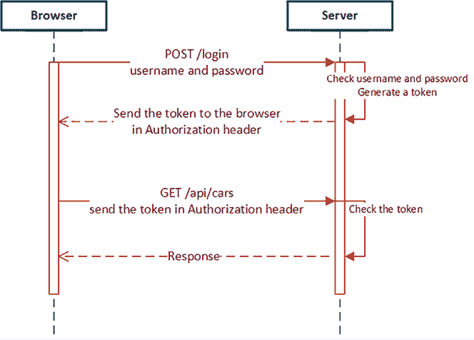
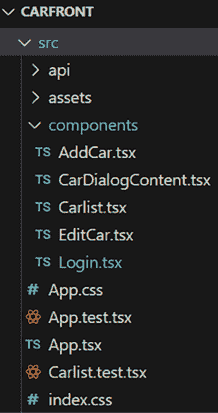
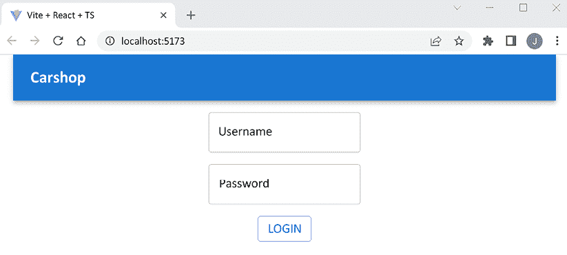
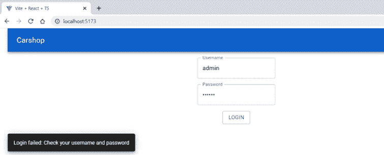
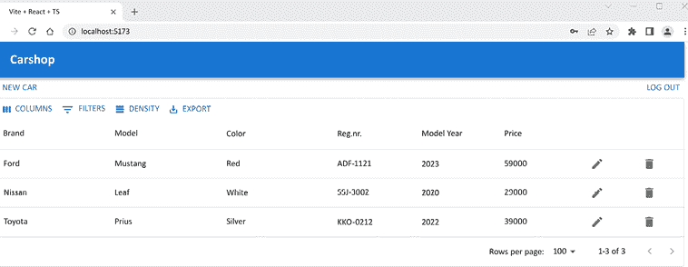

# 第十六章：保护你的应用程序

我们将在本章学习如何确保我们的应用程序的安全性。本章将解释在我们后端使用**JSON Web Token**（JWT）认证时，如何在我们的前端实现认证。首先，我们将开启后端的安全性以启用 JWT 认证。然后，我们将创建一个用于登录功能的组件。最后，我们将修改我们的 CRUD 功能，以便在请求的授权头中发送令牌到后端，并实现注销功能。

本章将涵盖以下主题：

+   保护后端

+   保护前端

# 技术要求

我们在*第五章*，“保护你的后端”中创建的 Spring Boot 应用程序是必需的（[`github.com/PacktPublishing/Full-Stack-Development-with-Spring-Boot-3-and-React-Fourth-Edition/tree/main/Chapter05`](https://github.com/PacktPublishing/Full-Stack-Development-with-Spring-Boot-3-and-React-Fourth-Edition/tree/main/Chapter05)），以及我们在*第十四章*，“使用 React MUI 美化前端”中使用的 React 应用程序（[`github.com/PacktPublishing/Full-Stack-Development-with-Spring-Boot-3-and-React-Fourth-Edition/tree/main/Chapter14`](https://github.com/PacktPublishing/Full-Stack-Development-with-Spring-Boot-3-and-React-Fourth-Edition/tree/main/Chapter14)）。

本章的以下 GitHub 链接也将很有用：[`github.com/PacktPublishing/Full-Stack-Development-with-Spring-Boot-3-and-React-Fourth-Edition/tree/main/Chapter16`](https://github.com/PacktPublishing/Full-Stack-Development-with-Spring-Boot-3-and-React-Fourth-Edition/tree/main/Chapter16)。

# 保护后端

在*第十三章*中，我们使用未加密的后端在我们的前端实现了 CRUD 功能。现在，是时候为我们的后端开启安全性，回到我们在*第五章*，“保护你的后端”中创建的版本：

1.  使用 Eclipse IDE 打开你的后端项目，并在编辑器视图中打开`SecurityConfig.java`文件。我们已取消注释安全设置并允许所有人访问所有端点。现在，我们可以删除那行，并也从原始版本中删除注释。现在，你的`SecurityConfig.java`文件的`filterChain()`方法应该看起来像以下这样：

    ```java
    @Bean
    public SecurityFilterChain filterChain(HttpSecurity http) throws Exception {
      http.csrf((csrf) -> csrf.disable()) .cors(withDefaults())
        .sessionManagement((sessionManagement) ->
          sessionManagement.sessionCreationPolicy(
          SessionCreationPolicy.STATELESS))
        .authorizeHttpRequests( (authorizeHttpRequests) ->
          authorizeHttpRequests.requestMatchers(HttpMethod.POST, "/
          login").permitAll().anyRequest().authenticated())
        .addFilterBefore(authenticationFilter,
          UsernamePasswordAuthenticationFilter.class)
        .exceptionHandling((exceptionHandling) ->
          exceptionHandling.authenticationEntryPoint(exceptionHandler));
      return http.build();
    } 
    ```

1.  让我们测试当后端再次被保护时会发生什么。通过在 Eclipse 中按**运行**按钮来运行后端，并从控制台视图检查应用程序是否正确启动。通过在终端中输入`npm run dev`命令来运行前端，浏览器应该会打开到地址`localhost:5173`。

1.  现在，你应该会看到列表页面和汽车列表正在加载。如果你打开开发者工具并切换到**网络**标签，你会注意到响应状态是**401 未授权**。这实际上是我们想要的，因为我们还没有针对前端执行认证：


图 16.1：401 未授权

现在，我们已经准备好开始处理前端工作了。

# 保护前端

在*第五章*，*保护后端*中，我们创建了 JWT 认证，并允许所有人无需认证即可访问`/login`端点。现在，在前端登录页面上，我们必须使用用户凭证向`/login`端点发送`POST`请求以获取令牌。之后，该令牌将包含在我们发送到后端的全部请求中，如下图所示：



图 16.2：安全应用

基于这些知识，我们将开始在前端实现登录功能。我们将实现用户输入凭证的登录页面，然后我们将发送登录请求以从服务器获取令牌。我们将使用存储的令牌来发送到服务器的请求。

## 创建登录组件

让我们先创建一个登录组件，该组件会要求用户输入凭证以从后端获取令牌：

1.  在`components`文件夹中创建一个名为`Login.tsx`的新文件。现在，前端文件结构应该是以下这样：



图 16.3：项目结构

1.  在 VS Code 编辑器视图中打开文件，并将以下基本代码添加到`Login`组件中。我们需要`axios`来向`/login`端点发送`POST`请求：

    ```java
    import { useState } from 'react';
    import axios from 'axios';
    function Login() {
      return(
        <></>
      );
    }
    export default Login; 
    ```

1.  我们需要两个状态来处理认证：一个用于凭证（用户名和密码），一个布尔值用于指示认证状态。我们还创建了一个用户状态类型。认证状态状态的初始值是`false`：

    ```java
    import { useState } from 'react';
    import axios from 'axios';
    **type** **User** **= {**
      **username****: string;**
      **password****: string;**
    **}**
    function Login() {
      **const** **[user, setUser] = useState<****User****>({**
        **username****:** **''****,**
        **password****:** **''**
      **});**
      **const** **[isAuthenticated, setAuth] =** **useState****(****false****);**

      return(
        <></>
      );
    }
    export default Login; 
    ```

1.  在用户界面中，我们将使用**Material UI**（**MUI**）组件库，就像我们处理其他用户界面一样。我们需要`TextField`组件来输入凭证，`Button`组件来调用登录函数，以及`Stack`组件来进行布局。将组件导入添加到`Login.tsx`文件中：

    ```java
    import Button from '@mui/material/Button';
    import TextField from '@mui/material/TextField';
    import Stack from '@mui/material/Stack'; 
    ```

    我们已经在*第十四章*，*使用 MUI 美化前端*中使用了这三种组件类型来美化我们的 UI。

1.  将导入的组件添加到`return`语句中。我们需要两个`TextField`组件：一个用于用户名，一个用于密码。需要一个`Button`组件来调用我们将在本节后面实现的登录函数。我们使用`Stack`组件来使我们的`TextField`组件居中并对齐它们之间的间距：

    ```java
    return(
        <Stack spacing={2} alignItems="center" mt={2}>
          <TextField
            name="username"
            label="Username"
            onChange={handleChange} />
          <TextField
            type="password"
            name="password"
            label="Password"
            onChange={handleChange}/>
          <Button
            variant="outlined"
            color="primary"
            onClick={handleLogin}>
              Login
          </Button>
        </Stack>
    ); 
    ```

1.  实现用于`TextField`组件的更改处理函数，以便将输入的值保存到状态中。你必须使用扩展语法，因为它确保你保留了`user`对象中未修改的所有其他属性：

    ```java
    const handleChange = (event: React.ChangeEvent<HTMLInputElement>) =>
      {
      setUser({...user,
         [event.target.name] : event.target.value
      });
    } 
    ```

1.  如*第五章*，*保护后端*所示，登录是通过调用`/login`端点并使用`POST`方法在正文中发送`user`对象来完成的。如果身份验证成功，我们将在响应的`Authorization`头中获取令牌。然后我们将令牌保存到会话存储中，并将`isAuthenticated`状态值设置为`true`。

    **会话存储**与本地存储类似，但在页面会话结束时（当页面关闭时）会被清除。`localStorage`和`sessionStorage`是`Window`接口的属性。

    当`isAuthenticated`状态值改变时，用户界面会重新渲染：

    ```java
    const handleLogin = () => {
      axios.post(import.meta.env.VITE_API_URL + "/login", user, {
        headers: { 'Content-Type': 'application/json' }
      })
      .then(res => {
        const jwtToken = res.headers.authorization;
        if (jwtToken !== null) {
          sessionStorage.setItem("jwt", jwtToken);
          setAuth(true);
        }
      })
      .catch(err => console.error(err));
    } 
    ```

1.  我们将实现一些条件渲染，如果`isAuthenticated`状态值为`false`，则渲染`Login`组件；如果`isAuthenticated`状态值为`true`，则渲染`Carlist`组件。首先，将`Carlist`组件导入到`Login.tsx`文件中：

    ```java
    import Carlist from './Carlist'; 
    ```

    然后，对`return`语句实现以下更改：

    ```java
    **if** **(isAuthenticated) {**
      **return****<****Carlist** **/>****;**
    **}**
    **else** **{**
      return(
        <Stack spacing={2} alignItems="center" mt={2} >
          <TextField
            name="username"
            label="Username"
            onChange={handleChange} />
          <TextField
            type="password"
            name="password"
            label="Password"
            onChange={handleChange}/>
          <Button
            variant="outlined"
            color="primary"
            onClick={handleLogin}>
              Login
          </Button>
        </Stack>
      );
    **}** 
    ```

1.  要显示登录表单，我们必须在`App.tsx`文件中将`Login`组件而不是`Carlist`组件渲染出来。导入并渲染`Login`组件，并删除未使用的`Carlist`导入：

    ```java
    // App.tsx
    import AppBar from '@mui/material/AppBar';
    import Toolbar from '@mui/material/Toolbar';
    import Typography from '@mui/material/Typography';
    import Container from '@mui/material/Container';
    import CssBaseline from '@mui/material/CssBaseline';
    **import****Login****from****'./components/Login'****;**
    import { QueryClient, QueryClientProvider } from '@tanstack/react-
      query';
    const queryClient = new QueryClient();
    function App() {
      return (
        <Container maxWidth="xl">
          <CssBaseline />
          <AppBar position="static">
            <Toolbar>
              <Typography variant="h6">
                Carshop
              </Typography>
            </Toolbar>
          </AppBar>
          <QueryClientProvider client={queryClient}>
            **<****Login** **/>**
          </QueryClientProvider>
        </Container>
      )
    }
    export default App; 
    ```

现在，当你的前端和后端都在运行时，你的前端应该看起来像以下截图：



图 16.4：登录页面

如果你使用我们已插入数据库的`user`/*用户*或`admin`/*管理员*凭据登录，你应该看到汽车列表页面。如果你打开开发者工具的**应用程序**选项卡，你可以看到令牌现在已保存到会话存储中：


图 16.5：会话存储

## 实现 REST API 调用

在上一节结束时，汽车列表仍在加载，我们无法获取汽车。这是正确的行为，因为我们还没有在任何请求中包含令牌。这是 JWT 身份验证所必需的，我们将在下一阶段实现：

1.  在 VS Code 编辑器视图中打开`carapi.ts`文件。要获取汽车，我们首先必须从会话存储中读取令牌，然后将带有令牌值的`Authorization`头添加到`GET`请求中。你可以在这里看到`getCars`函数的源代码：

    ```java
    // carapi.ts
    export const getCars = async (): Promise<CarResponse[]> => {
      **const** **token =** **sessionStorage****.****getItem****(****"jwt"****);**
      const response = await axios.get(`${import.meta.env.VITE_API_URL}/
                       api/cars`, **{**
        **headers****: {** **'Authorization'** **: token }**
      **}**);
      return response.data._embedded.cars;
    } 
    ```

1.  如果你登录到你的前端，你应该看到数据库中的汽车已填充到汽车列表中。

1.  检查开发者工具中的请求内容；你可以看到它包含带有令牌值的`Authorization`头：


图 16.6：请求头

1.  以相同的方式修改其他 CRUD 功能，以确保它们能正确工作。在修改后，`deleteCar`函数的源代码如下所示：

    ```java
    // carapi.ts
    export const deleteCar = async (link: string): Promise<CarResponse> =>
    {
      **const** **token =** **sessionStorage****.****getItem****(****"jwt"****);**
      const response = await axios.delete(link, **{**
        **headers****: {** **'****Authorization'****: token }**
      **}**)
      return response.data
    } 
    ```

在修改后，`addCar`和`editCar`函数的源代码如下所示：

```java
// carapi.ts
export const addCar = async (car: Car): Promise<CarResponse> => {
  **const** **token =** **sessionStorage****.****getItem****(****"jwt"****);**
  const response = await axios.post(`${import.meta.env.VITE_API_
                   URL}/api/cars`, car, {
    headers: {
      'Content-Type': 'application/json',
      **'Authorization'****: token**
    },
  });
  return response.data;
}
export const updateCar = async (carEntry: CarEntry): Promise<CarResponse> => {
  **const** **token =** **sessionStorage****.****getItem****(****"jwt"****);**
  const response = await axios.put(carEntry.url, carEntry.car, {
    headers: {
      'Content-Type': 'application/json',
      **'Authorization'****: token**
    },
  });

  return response.data;
} 
```

## 重构重复代码

现在，登录到应用程序后，所有 CRUD 功能都将正常工作。但是，如你所见，我们有很多重复的代码，例如我们从会话存储中检索令牌的行。我们可以进行一些重构，以避免重复相同的代码并使我们的代码更容易维护：

1.  首先，我们将创建一个函数，从会话存储中检索令牌并为 Axios 请求创建一个包含带有令牌的头的配置对象。Axios 提供了`AxiosRequestConfig`接口，可用于配置我们使用 Axios 发送的请求。我们还设置了`content-type`头的值为`application/json`：

    ```java
    // carapi.ts
    import axios, { **AxiosRequestConfig** } from 'axios';
    import { CarResponse, Car, CarEntry } from '../types';
    **const** **getAxiosConfig = ():** **AxiosRequestConfig** **=>** **{**
      **const** **token =** **sessionStorage****.****getItem****(****"jwt"****);**
      **return** **{**
        **headers****: {**
          **'Authorization'****: token,**
          **'Content-Type'****:** **'application/json'****,**
        **},**
      **};**
    **};** 
    ```

1.  然后，我们可以通过移除配置对象并调用`getAxiosConfig()`函数，而不在每个函数中检索令牌来使用`getAxiosConfig()`函数，如下面的代码所示：

    ```java
    // carapi.ts
    export const getCars = async (): Promise<CarResponse[]> => {
      const response = await axios.get(`${import.meta.env.VITE_API_URL}/
                       api/cars`, **getAxiosConfig****()**);
      return response.data._embedded.cars;
    }
    export const deleteCar = async (link: string): Promise<CarResponse> =>
    {
      const response = await axios.delete(link, **getAxiosConfig****()**)
      return response.data
    }
    export const addCar = async (car: Car): Promise<CarResponse> => {
      const response = await axios.post(`${import.meta.env.VITE_API_
                       URL}/api/cars`, car, **getAxiosConfig****()**);
      return response.data;
    }
    export const updateCar = async (carEntry: CarEntry):
      Promise<CarResponse> => {
      const response = await axios.put(carEntry.url, carEntry.car,
                                       **getAxiosConfig****()**);
    return response.data;
    } 
    ```

Axios 还提供了**拦截器**，可以在请求和响应被`then`或`catch`处理之前拦截和修改它们。你可以在 Axios 文档中了解更多关于拦截器的信息：[`axios-http.com/docs/interceptors`](https://axios-http.com/docs/interceptors)。

## 显示错误消息

在这个阶段，我们将实现一个错误消息，如果认证失败，将显示给用户。我们将使用`Snackbar` MUI 组件来显示消息：

1.  将以下导入添加到`Login.tsx`文件中：

    ```java
    import Snackbar from '@mui/material/Snackbar'; 
    ```

1.  添加一个新的状态`open`来控制`Snackbar`的可见性：

    ```java
    const [open, setOpen] = useState(false); 
    ```

1.  将`Snackbar`组件添加到`return`语句中，位于`Button`组件下面的堆栈中。`Snackbar`组件用于显示吐司消息。如果`open`属性值为`true`，则显示该组件。`autoHideDuration`定义了在调用`onClose`函数之前等待的毫秒数：

    ```java
    <Snackbar
      open={open}
      autoHideDuration={3000}
      onClose={() => setOpen(false)}
      message="Login failed: Check your username and password"
    /> 
    ```

1.  如果认证失败，通过将`open`状态值设置为`true`来打开`Snackbar`组件：

    ```java
    const login = () => {
      axios.post(import.meta.env.VITE_API_URL + "/login", user, {
        headers: { 'Content-Type': 'application/json' }
      })
      .then(res => {
        const jwtToken = res.headers.authorization;
        if (jwtToken !== null) {
          sessionStorage.setItem("jwt", jwtToken);
          setAuth(true);
        }
      })
      .catch(**() =>****setOpen****(****true****)**);
    } 
    ```

1.  如果你现在尝试使用错误的凭据登录，你将在屏幕的左下角看到以下消息：



图 16.7：登录失败

## 登出

在本节的最后，我们将在`Login`组件中实现登出功能。登出按钮渲染在车辆列表页面上。`Carlist`组件是`Login`组件的子组件；因此，我们可以通过属性将登出函数传递给车辆列表。让我们这样做：

1.  首先，我们为`Login`组件创建一个`handleLogout()`函数，该函数将`isAuthenticated`状态更新为`false`，并从会话存储中清除令牌：

    ```java
    // Login.tsx
    const handleLogout = () => {
      setAuth(false);
      sessionStorage.setItem("jwt", "");
    } 
    ```

1.  接下来，我们使用属性将`handleLogout`函数传递给`Carlist`组件，如高亮代码所示：

    ```java
    // Login.tsx
    if (isAuthenticated) {
      return <Carlist **logOut****=****{handleLogout}**/>;
    }
    else {  
      return(
      ... 
    ```

1.  我们必须为在 `Carlist` 组件中接收的 props 创建一个新的类型。prop 名称是 `logOut`，它是一个不接受任何参数的函数，我们将此 prop 标记为可选。将以下类型添加到 `Carlist` 组件中，并在函数参数中接收 `logOut` prop：

    ```java
    //Carlist.tsx
    **type** **CarlistProps** **= {**
      **logOut?****:** **() =>****void****;**
    **}**
    function Carlist(**{ logOut }: CarlistProps**) {
      const [open, setOpen] = useState(false);
      ... 
    ```

1.  现在，我们可以调用注销函数并添加注销按钮。我们使用 Material UI 的 `Stack` 组件来对齐按钮，使得 **NEW CAR** 按钮位于屏幕左侧，而 **LOG OUT** 按钮位于右侧：

    ```java
    // Carlist.tsx
    // Add the following imports
    import Button from '@mui/material/Button';
    import Stack from '@mui/material/Stack';
    // Render the Stack and Button  
    if (!isSuccess) {
        return <span>Loading...</span>
    }
    else if (error) {
      return <span>Error when fetching cars...</span>
    }
    else {
      return ( 
        <>
          **<****Stack****direction****=****"row"****alignItems****=****"center"**
           **justifyContent****=****"space-between"****>**
            **<****AddCar** **/>**
            **<****Button****onClick****=****{logOut}****>****Log out****</****Button****>**
          **</****Stack****>**
          <DataGrid
            rows={data}
            columns={columns}
            disableRowSelectionOnClick={true}
            slots={{ toolbar: GridToolbar }}
            getRowId={row => row._links.self.href} /> 
          <Snackbar
            open={open}
            autoHideDuration={2000}
            onClose={() => setOpen(false)}
            message="Car deleted" />
        </>
      );
    } 
    ```

1.  现在，如果你登录到你的前端，你可以在汽车列表页面上看到 **LOG OUT** 按钮，如下面的截图所示。当你点击按钮时，会渲染登录页面，因为 `isAuthenticated` 状态被设置为 `false`，并且令牌已从会话存储中清除：



图 16.8：注销

如果你有一个更复杂的具有多个页面的前端，明智的做法是在应用栏中渲染注销按钮，这样它就会显示在每个页面上。然后，你可以使用状态管理技术来与你的整个组件树共享状态。一个解决方案是使用我们在 *第八章* 中介绍的 **React Context API**。在这种情况下，你可以使用上下文来在应用组件树中共享 `isAuthenticated` 状态。

随着你的应用复杂性增长，管理状态变得至关重要，以确保你的组件可以高效地访问和更新数据。还有其他替代 React Context API 的状态管理方法，你可以研究。最常见的状态管理库是 **React Redux**（[`react-redux.js.org`](https://react-redux.js.org)）和 MobX（[`github.com/mobxjs/mobx`](https://github.com/mobxjs/mobx)）。

在上一章中，我们为 `CarList` 组件创建了测试用例，当时应用是不安全的。在这个阶段，我们的 `CarList` 组件测试用例将会失败，你应该对它们进行重构。为了创建一个模拟登录过程并测试是否从后端 REST API 获取数据的 React 测试，你也可以使用像 `axios-mock-adapter` 这样的库（[`github.com/ctimmerm/axios-mock-adapter`](https://github.com/ctimmerm/axios-mock-adapter)）。Mocking Axios 允许你在不进行实际网络请求的情况下模拟登录过程和数据获取。我们这里不深入细节，但建议你进一步探索。

现在，我们的汽车应用已经准备好了。

# 摘要

在本章中，我们学习了如何在使用 JWT 认证时为我们的前端实现登录和注销功能。在认证成功后，我们使用会话存储来保存从后端接收到的令牌。然后，我们在发送到后端的全部请求中使用该令牌；因此，我们必须修改我们的 CRUD 功能以正确地与认证一起工作。

在下一章和最后一章中，我们将部署我们的后端和前端，并演示如何创建 Docker 容器。

# 问题

1.  您应该如何创建一个登录表单？

1.  您应该如何使用 JWT 登录后端？

1.  会话存储是什么？

1.  在 CRUD 函数中，您应该如何向后端发送令牌？

# 进一步阅读

这里有一些其他关于学习 React 和状态管理的资源：

+   *《使用 React Query 进行状态管理》*，作者 Daniel Afonso ([`www.packtpub.com/product/state-management-with-react-query/9781803231341`](https://www.packtpub.com/product/state-management-with-react-query/9781803231341))

+   *《MobX 快速入门指南》*，作者 Pavan Podila 和 Michel Weststrate ([`www.packtpub.com/product/mobx-quick-start-guide/9781789344837`](https://www.packtpub.com/product/mobx-quick-start-guide/9781789344837))

# 在 Discord 上了解更多

要加入这本书的 Discord 社区——在那里您可以分享反馈、向作者提问，并了解新书发布——请扫描下面的二维码：

[`packt.link/FullStackSpringBootReact4e`](https://packt.link/FullStackSpringBootReact4e)


