# 第十七章：部署您的应用程序

本章将解释如何将您的后端和前端部署到服务器上。成功的部署是软件开发过程中的关键部分，了解现代部署过程的工作方式非常重要。有多种云服务器或 **PaaS**（代表 **平台即服务**）提供商可供选择，例如 **Amazon Web Services**（**AWS**）、DigitalOcean、Microsoft Azure、Railway 和 Heroku。

在这本书中，我们使用 AWS 和 Netlify，它们支持在 Web 开发中使用的多种编程语言。我们还将向您展示如何在部署中使用 Docker 容器。

在本章中，我们将涵盖以下主题：

+   使用 AWS 部署后端

+   使用 Netlify 部署前端

+   使用 Docker 容器

# 技术要求

我们在 *第五章*，*保护您的后端* 中创建的 Spring Boot 应用程序是必需的 ([`github.com/PacktPublishing/Full-Stack-Development-with-Spring-Boot-3-and-React-Fourth-Edition/tree/main/Chapter05`](https://github.com/PacktPublishing/Full-Stack-Development-with-Spring-Boot-3-and-React-Fourth-Edition/tree/main/Chapter05))，同样，我们在 *第十六章*，*保护您的应用程序* 中使用的 React 应用程序也是必需的 ([`github.com/PacktPublishing/Full-Stack-Development-with-Spring-Boot-3-and-React-Fourth-Edition/tree/main/Chapter16`](https://github.com/PacktPublishing/Full-Stack-Development-with-Spring-Boot-3-and-React-Fourth-Edition/tree/main/Chapter16))。

本章的最后部分需要安装 Docker。

# 使用 AWS 部署后端

如果您打算使用自己的服务器，部署 Spring Boot 应用程序最简单的方法是使用可执行的 **Java ARchive**（**JAR**）文件。使用 Gradle，可以使用 Spring Boot Gradle 包装器创建可执行 JAR 文件。您可以使用以下 Gradle 包装器命令在项目文件夹中构建项目：

```java
./gradlew build 
```

或者，您也可以通过在项目资源管理器中右键单击 **项目**，导航到 **窗口 | 显示视图 | 其他**，然后从列表中选择 **Gradle | Gradle 任务**，在 Eclipse 中运行一个 Gradle 任务。这会打开一个 Gradle 任务的列表，您可以通过双击 **build** 任务来启动构建过程，如下面的截图所示。如果 Gradle 任务窗口为空，请点击 Eclipse 中的项目根目录：

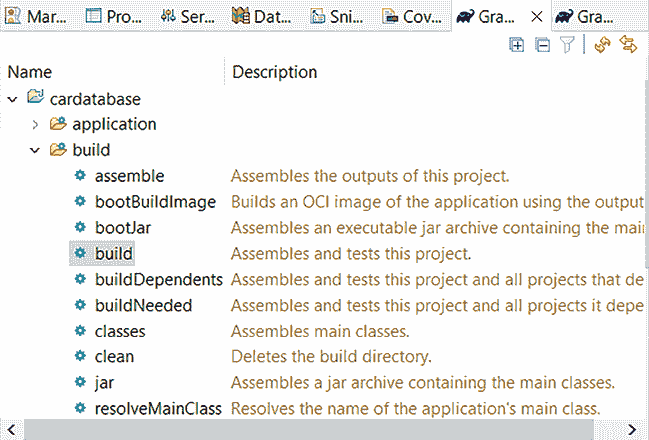

图 17.1：Gradle 任务

这将在您的项目中创建一个新的 `build/libs` 文件夹，其中将包含 JAR 文件。默认情况下，创建了两个 JAR 文件：

+   扩展名为 `.plain.jar` 的文件包含 Java 字节码和其他资源，但它不包含任何应用程序框架或依赖项。

+   另一个 `.jar` 文件是一个完全可执行的存档，您可以使用 `java -jar your_appfile.jar` Java 命令来运行它，如下面的截图所示：

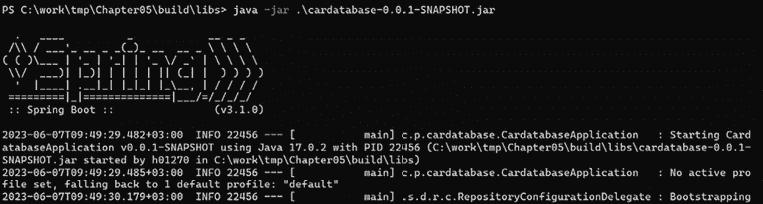

图 17.2：运行可执行 JAR 文件

现在，云服务器是向最终用户提供应用程序的主要手段。我们将把我们的后端部署到 **Amazon Web Services**（**AWS**）（[`aws.amazon.com/`](https://aws.amazon.com/)）。AWS 免费层为用户提供免费探索产品的机会。

创建免费层账户并登录 AWS。您必须输入您的联系信息，包括一个有效的手机号码。AWS 将发送一条短信确认消息以验证您的账户。您必须为 AWS 免费层下的账户添加有效的信用卡、借记卡或其他支付方式。

您可以在 [`repost.aws/knowledge-center/free-tier-payment-method`](https://repost.aws/knowledge-center/free-tier-payment-method) 阅读关于为什么需要支付方式的原因。

## 部署我们的 MariaDB 数据库

在本节中，我们将把我们的 MariaDB 数据库部署到 AWS。**Amazon 关系数据库服务**（**RDS**）可用于设置和运行关系数据库。Amazon RDS 支持包括 MariaDB 在内的几个流行的数据库。以下步骤将指导您完成在 RDS 中创建数据库的过程：

1.  在您使用 AWS 创建了免费层账户后，登录 AWS 网站。AWS 仪表板包含一个搜索栏，您可以使用它来查找不同的服务。在搜索栏中输入 `RDS` 并找到 RDS，如图下所示。在 **服务** 列表中点击 **RDS**：

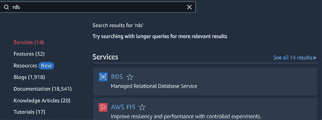

图 17.3：RDS

1.  点击 **创建数据库** 按钮开始数据库创建过程：

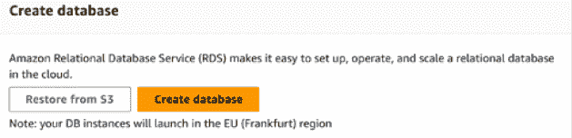

图 17.4：创建数据库

1.  从数据库引擎选项中选择 **MariaDB**：

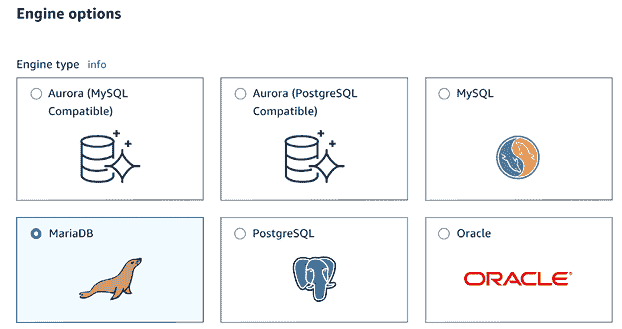

图 17.5：引擎选项

1.  从模板中选择 **免费层**。

1.  为您的数据库实例输入名称和数据库主用户的密码。您可以使用默认用户名（*admin*）：

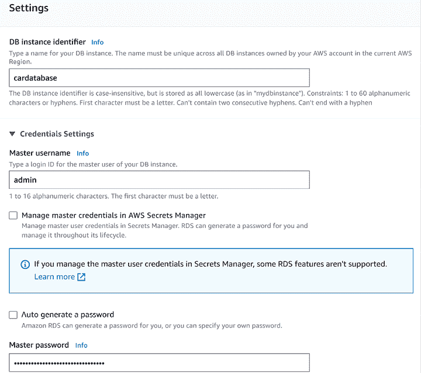

图 17.6：数据库实例名称

1.  在 **公共访问** 部分下选择 **是** 以允许公共访问您的数据库：

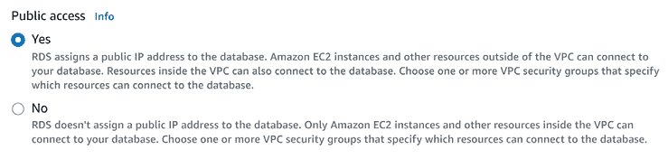

图 17.7：公共访问

1.  在页面底部的 **附加配置** 部分中，为您的数据库命名 `cardb:`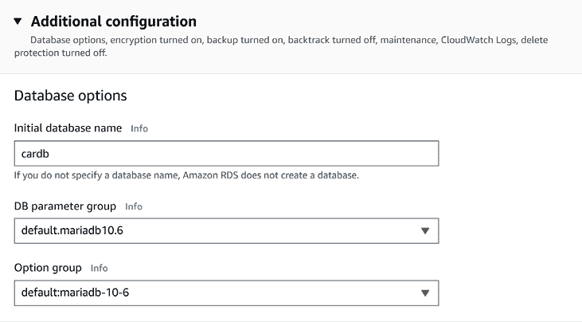

    图 17.8：附加配置

    注意！如果名称留空，则不会创建数据库。

1.  最后，点击 **创建数据库** 按钮。RDS 将开始创建您的数据库实例，这可能需要几分钟。

1.  您的数据库成功创建后，您可以点击 **查看连接详情** 按钮打开一个窗口，显示您的数据库连接详情。**端点** 是您数据库的地址。复制连接详情以备后用：

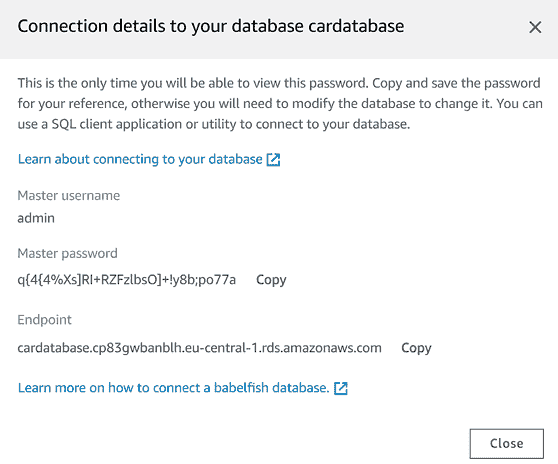

图 17.9：连接详情

1.  现在，我们已经准备好测试我们的数据库。在这个阶段，我们将使用我们的本地 Spring Boot 应用程序。为此，我们必须允许从外部访问我们的数据库。要更改此设置，请在 RDS 数据库列表中点击您的数据库。然后，点击**VPC 安全组**，如下截图所示：

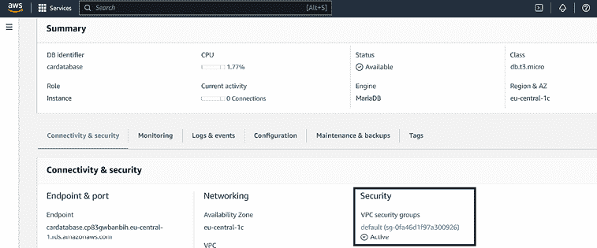

图 17.10：连接性与安全性

1.  在首页上，从**入站规则**选项卡中点击**编辑入站规则**按钮。点击**添加规则**按钮添加新规则。对于新规则，在**源**列下选择**MySQL/Aurora**类型和**我的 IP**目标。**我的 IP**目标会自动将您本地计算机的当前 IP 地址添加为允许的目标：

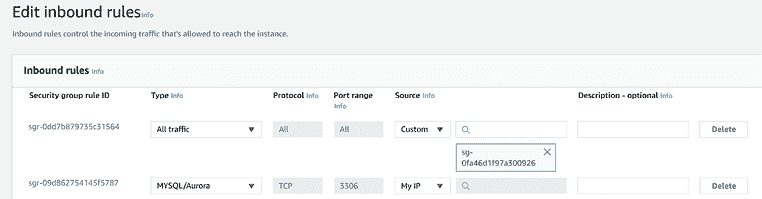

图 17.11：入站规则

1.  在您添加了新规则后，按**保存规则**按钮。

1.  打开我们在*第五章*，*保护后端*中创建的 Spring Boot 应用程序。将`application.properties`文件中的`url`、`username`和`password`数据库设置更改为与您的 Amazon RDS 数据库匹配。`spring.datasource.url`属性值的格式为`jdbc:mariadb://your_rds_db_domain:3306/your_db_name`，如下截图所示：

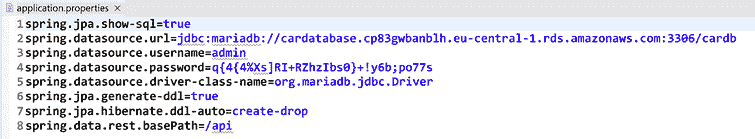

图 17.12：application.properties 文件

1.  现在，如果您运行应用程序，您可以从控制台看到数据库表已创建，并且示例数据已插入到我们的 Amazon RDS 数据库中：

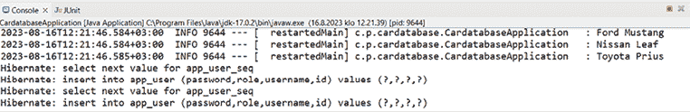

图 17.13：控制台

1.  在这个阶段，您应该构建您的 Spring Boot 应用程序。在 Eclipse 中通过在项目资源管理器中右键单击**项目**，导航到**窗口 | 显示视图 | 其他**，并从列表中选择**Gradle | Gradle 任务**来运行 Gradle 构建任务。这将打开一个 Gradle 任务列表，您可以通过双击**build**任务来开始构建过程。它将在`build/libs`文件夹中创建一个新的 JAR 文件。

我们现在有了适当的数据库设置，并且在我们将应用程序部署到 AWS 时可以使用我们新构建的应用程序。

## 部署我们的 Spring Boot 应用程序

在我们将数据库部署到 Amazon RDS 之后，我们可以开始部署我们的 Spring Boot 应用程序。我们正在使用的 Amazon 服务是**Elastic Beanstalk**，它可以用于在 AWS 中运行和管理 Web 应用程序。还有其他替代方案，例如 AWS Amplify，也可以使用。Elastic Beanstalk 适用于免费层，并且它还支持广泛的编程语言（例如 Java、Python、Node.js 和 PHP）。

以下步骤将指导您将我们的 Spring Boot 应用程序部署到 Elastic Beanstalk 的过程：

1.  首先，我们必须为我们的应用程序部署创建一个新的 **角色**。该角色是允许 Elastic Beanstalk 创建和管理您的环境所必需的。您可以使用 Amazon **IAM**（**身份和访问管理**）服务创建角色。使用 AWS 搜索栏导航到 IAM 服务。在 IAM 服务中，选择 **角色** 并点击 **创建角色** 按钮。选择 **AWS 服务** 和 **EC2**，如图所示，然后点击 **下一步** 按钮：

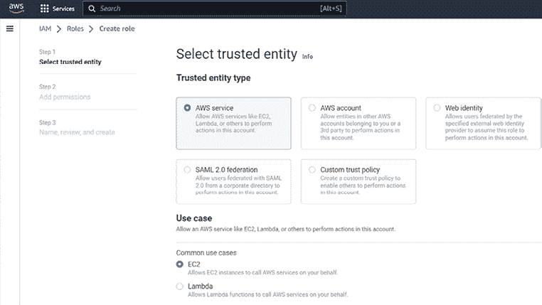

图 17.14：创建角色

1.  在 **添加权限** 步骤中，选择以下权限策略：**AWSElasticBeanstalkWorkerTier**、**AWSElasticBeanstalkWebTier** 和 **AWSElasticBeanstalkMulticontainerDocker**，然后点击 **下一步** 按钮。您可以使用搜索栏查找正确的策略：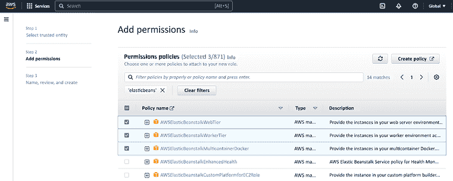

    图 17.15：添加权限

    您可以在 [`docs.aws.amazon.com/elasticbeanstalk/latest/dg/iam-instanceprofile.html`](https://docs.aws.amazon.com/elasticbeanstalk/latest/dg/iam-instanceprofile.html) 阅读更多关于管理 Elastic Beanstalk 实例配置文件和策略的信息。

1.  按照下一张截图所示，为您的角色输入名称，并最终点击 **创建角色** 按钮：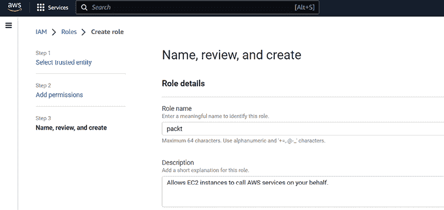

    图 17.16：角色名称

    我们刚刚创建的新角色允许 Elastic Beanstalk 创建和管理我们的环境。现在，我们可以开始部署我们的 Spring Boot 应用程序。

1.  使用 AWS 仪表板搜索栏查找 **Elastic Beanstalk** 服务。点击服务以导航到 Elastic Beanstalk 页面：

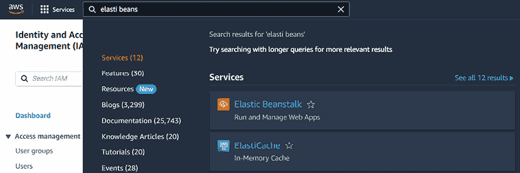

图 17.17：Elastic Beanstalk 服务

1.  在左侧菜单中点击 **应用程序**，然后点击 **创建应用程序** 按钮以创建一个新的应用程序。按照以下截图所示，为您的应用程序输入名称，然后点击 **创建** 按钮：

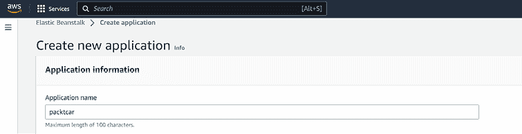

图 17.18：创建应用程序

1.  接下来，我们必须为我们的应用程序创建一个 **环境**。环境是运行应用程序版本的 AWS 资源集合。您可以为一个应用程序拥有多个环境：例如，开发、生产和测试环境。点击 **创建新环境** 按钮以配置新环境：

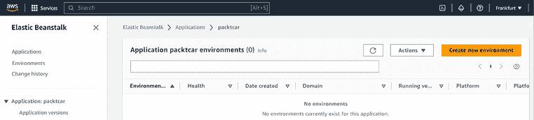

图 17.19：创建新环境

1.  在环境配置中，您首先必须设置平台。在 **平台类型** 部分，选择 **Java** 和分支的第一个版本 **17**，如图所示。**平台版本** 是操作系统、运行时、Web 服务器、应用程序服务器和 Elastic Beanstalk 组件的特定版本的组合。您可以使用推荐的 **平台** **版本**：

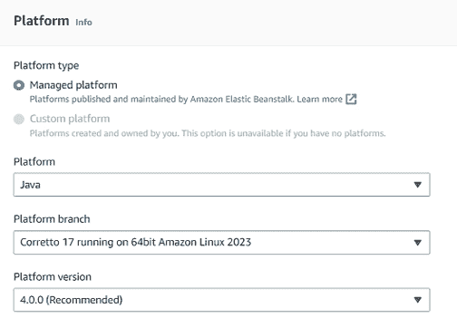

图 17.20：平台类型

1.  接下来，转到配置页面中的**应用程序代码**部分。选择**上传你的代码**和**本地文件**。点击**选择文件**按钮并选择我们之前构建的 Spring Boot `.jar`文件。你还需要输入一个唯一的**版本标签**。最后，点击**下一步**按钮：

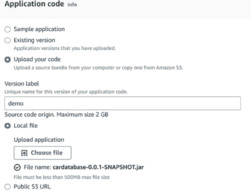

图 17.21：创建新环境

1.  在**配置服务访问**步骤中，从**EC2 实例配置文件**下拉列表中选择你之前创建的角色，如图所示。然后，点击**下一步**按钮：

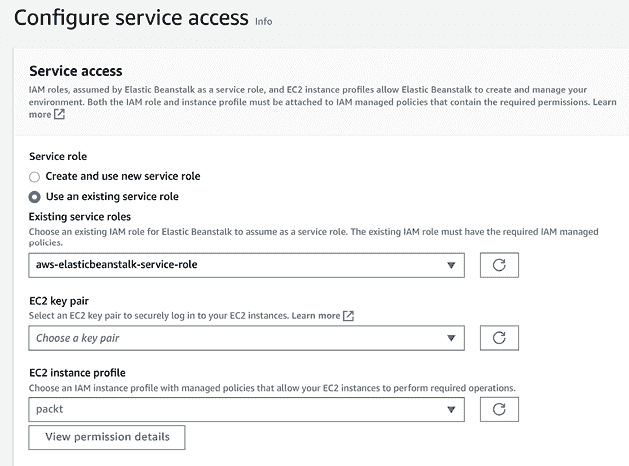

图 17.22：服务访问

1.  你可以跳过可选的**设置网络、数据库和标签**和**配置实例流量和扩展**步骤。

1.  接下来，转到**配置更新、监控和日志**步骤。在**环境属性**部分，我们必须添加以下环境属性。你可以在页面底部点击**添加环境属性**按钮来添加新属性。已经有了一些预定义的属性，你不需要修改它们（`GRADLE_HOME`、`M2`和`M2_HOME`）：

    +   `SERVER_PORT`: `5000`（弹性豆有 Nginx 反向代理，它将把传入的请求转发到内部端口`5000`）。

    +   `SPRING_DATASOURCE_URL`: 这里需要使用的数据库 URL 与我们之前在测试 AWS 数据库集成时在`'application.properties'`文件中配置的数据库 URL 值相同。

    +   `SPRING_DATASOURCE_USERNAME`: 你的数据库用户名。

    +   `SPRING_DATASOURCE_PASSWORD`: 你的数据库密码。

    下一个屏幕截图显示了新的属性：

    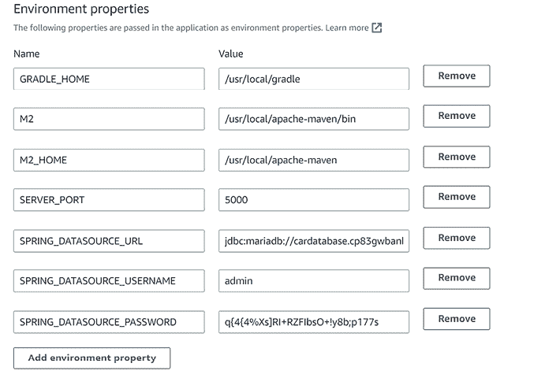

    图 17.23：环境属性

1.  最后，在**审查**步骤中，点击**提交**按钮，你的部署将开始。你必须等待直到你的环境成功启动，如图所示的下个屏幕截图。**环境概述**中的**域名**是你部署的 REST API 的 URL：

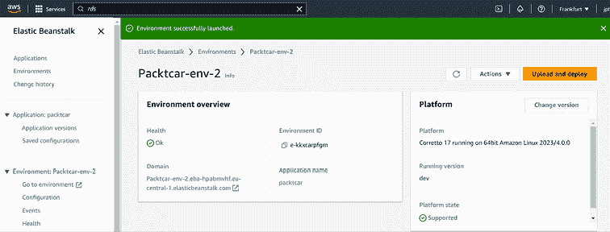

图 17.24：环境成功启动

1.  现在，我们已经部署了我们的 Spring Boot 应用程序，但应用程序还不能访问 AWS 数据库。为此，我们必须允许从部署的应用程序访问我们的数据库。要做到这一点，导航到 Amazon RDS 并从 RDS 数据库列表中选择你的数据库。然后，点击**VPC 安全组**并点击**编辑入站规则**按钮，就像我们之前做的那样。删除允许从你的本地 IP 地址访问的规则。

1.  添加一个**类型**为**MySQL/Aurora**的新规则。在**目标**字段中，输入`sg`。这将打开一个环境列表，如图所示。选择你的 Spring Boot 应用程序运行的环境（以“awseb”文本开头，副标题显示你的环境名称）并点击**保存规则**按钮：

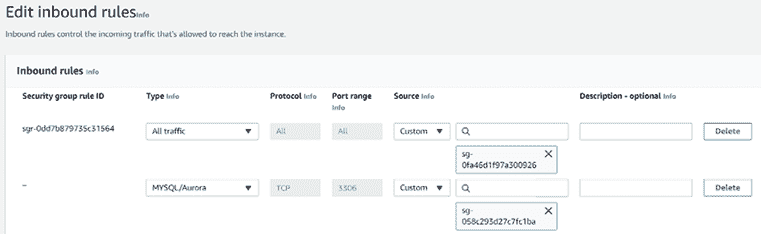

图 17.25：入站规则

1.  现在，您的应用程序已正确部署，您可以使用从域名中获得的 URL 使用 Postman 登录到您的已部署 REST API。以下截图显示了发送到 `aws_domain_url/login` 端点的 POST 请求：

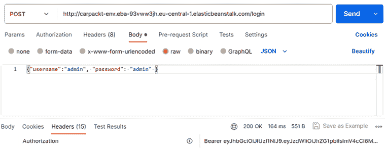

图 17.26：邮递员身份验证

您还可以为您的 Elastic Beanstalk 环境配置一个自定义域名，然后您可以使用 HTTPS 允许用户安全地连接到您的网站。如果您没有域名，您仍然可以使用自签名证书进行开发和测试。您可以在 AWS 文档中找到配置说明：[`docs.aws.amazon.com/elasticbeanstalk/latest/dg/configuring-https.html`](https://docs.aws.amazon.com/elasticbeanstalk/latest/dg/configuring-https.html)。

注意！您应该删除您创建的 AWS 资源，以避免意外收费。在您的免费试用期结束时，AWS 会提醒您删除资源。

现在，我们已经准备好部署我们的前端。

# 使用 Netlify 部署前端

在我们使用 Netlify 部署之前，我们将学习如何在本地构建您的 React 项目。移动到您的前端项目文件夹并执行以下 `npm` 命令：

```java
npm run build 
```

默认情况下，您的项目在 `/dist` 文件夹中构建。您可以通过在 Vite 配置文件中使用 `build.outDir` 属性来更改文件夹。

首先，构建过程会编译您的 TypeScript 代码；因此，如果您有任何 TypeScript 错误或警告，您必须修复它们。一个常见的错误是忘记删除未使用的导入，如下面的示例错误所示：

```java
src/components/AddCar.tsx:10:1 - error TS6133: 'Snackbar' is declared but its value is never read.
10 import Snackbar from '@mui/material/Snackbar'; 
```

这表示 `AddCar.tsx` 文件导入了 `Snackbar` 组件，但实际上并没有使用该组件。因此，您应该删除这个未使用的导入。一旦所有错误都已被解决，您就可以继续重新构建您的项目。

Vite 使用 **Rollup** ([`rollupjs.org/`](https://rollupjs.org/)) 来打包您的代码。测试文件和开发工具不包括在生产构建中。构建完您的应用程序后，您可以使用以下 `npm` 命令测试您的本地构建：

```java
npm run preview 
```

该命令启动一个本地静态 Web 服务器，用于提供您的构建应用程序。您可以通过在终端中显示的 URL 使用浏览器测试您的应用程序。

您也可以将前端部署到 AWS，但我们将使用 **Netlify** ([`www.netlify.com/`](https://www.netlify.com/)) 进行前端部署。Netlify 是一个易于使用的现代网络开发平台。您可以使用 Netlify 的 **命令行界面**（**CLI**）或 GitHub 部署您的项目。在本节中，我们将使用 Netlify 的 GitHub 集成来部署我们的前端：

1.  首先，我们必须更改我们的 REST API URL。使用 VS Code 打开你的前端项目，并在编辑器中打开 `.env` 文件。将 `VITE_API_URL` 变量更改为匹配你的后端 URL，如下所示，并保存更改：

    ```java
    VITE_API_URL=https:// carpackt-env.eba-whufxac5.eu-central-2.
      elasticbeanstalk.com 
    ```

1.  为你的前端项目创建一个 GitHub 代码库。在你的项目文件夹中使用命令行执行以下 Git 命令。这些 Git 命令创建一个新的 Git 代码库，进行初始提交，在 GitHub 上设置远程代码库，并将代码推送到你的远程代码库：

    ```java
    git init
    git add .
    git commit -m "first commit"
    git branch -M main
    git remote add origin <YOUR_GITHUB_REPO_URL>
    git push -u origin main 
    ```

1.  在 Netlify 上注册并登录。我们将使用具有有限功能的免费 **Starter** 账户。使用此账户，你可以免费构建一个并发构建，并且在带宽方面有一些限制。

    你可以在 [`www.netlify.com/pricing/`](https://www.netlify.com/pricing/) 上了解更多关于 Netlify 免费账户功能的信息。

1.  从左侧菜单打开 **站点**，你应该会看到 **导入现有项目** 面板，如下截图所示：

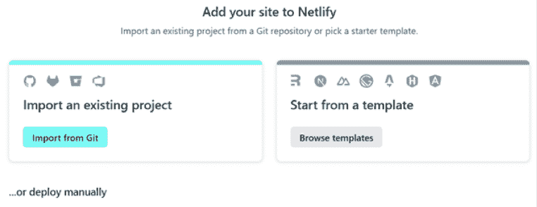

图 17.27：导入现有项目

1.  点击 **从 Git 导入** 按钮，并选择 **使用 GitHub 部署**。在这个阶段，你必须授权 GitHub 以访问你的代码库。成功授权后，你应该会看到你的 GitHub 用户名和代码库搜索字段，如下截图所示：

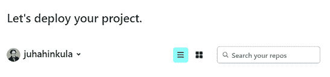

图 17.28：GitHub 代码库

1.  搜索你的前端代码库并点击它。

1.  接下来，你将看到部署设置。通过按下 **部署 <你的代码库名称>** 按钮继续使用默认设置：

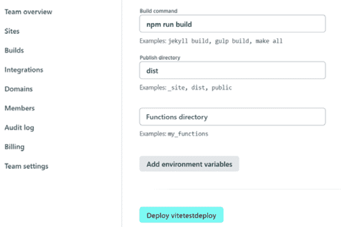

图 17.29：部署设置

1.  部署完成后，你会看到以下对话框。按下如下图中所示的 **查看站点部署** 按钮，你将被重定向到 **部署** 页面。Netlify 为你生成一个随机的站点名称，但你也可以使用自己的域名：

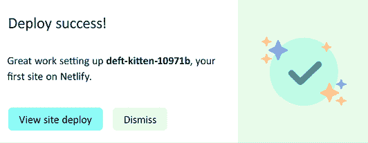

图 17.30：部署成功

1.  在 **部署** 页面上，你会看到你的部署网站，你可以通过点击 **打开生产部署** 按钮访问你的前端：


图 17.31：部署

1.  现在，你应该会看到登录表单，如下所示：

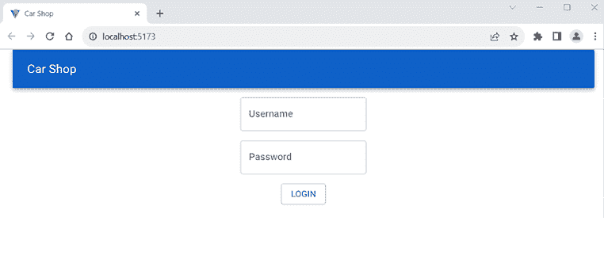

图 17.32：登录屏幕

你可以从左侧菜单的 **站点配置** 中删除你的 Netlify 部署。

我们现在已部署了我们的前端，接下来我们可以继续学习容器。

# 使用 Docker 容器

**Docker** ([`www.docker.com/`](https://www.docker.com/)) 是一个容器平台，它使软件开发、部署和分发变得更加容易。容器是轻量级的可执行软件包，包含运行软件所需的一切。容器可以部署到云服务，如 AWS、Azure 和 Netlify，并且为部署应用程序提供了许多好处：

+   容器是隔离的，这意味着每个容器都独立于主机系统和其它容器运行。

+   容器之所以可移植，是因为它们包含了应用程序运行所需的一切。

+   容器还可以用来确保开发和生产环境之间的一致性。

注意！要在 Windows 上运行 Docker 容器，你需要 Windows 10 或 11 的专业版或企业版。你可以在 Docker 安装文档中了解更多信息：[`docs.docker.com/desktop/install/windows-install/`](https://docs.docker.com/desktop/install/windows-install/)。

在本节中，我们将创建一个用于我们的 MariaDB 数据库和 Spring Boot 应用程序的容器，如下所示：

1.  在你的工作站上安装 Docker。你可以在[`www.docker.com/get-docker`](https://www.docker.com/get-docker)找到多个平台的安装包。如果你使用的是 Windows 操作系统，你可以使用默认设置通过安装向导进行安装。

    如果你遇到安装问题，你可以阅读 Docker 故障排除文档，网址为[`docs.docker.com/desktop/troubleshoot/topics`](https://docs.docker.com/desktop/troubleshoot/topics)。

    安装完成后，你可以在终端中输入以下命令来检查当前版本。注意！当你运行 Docker 命令时，如果 Docker Engine 没有运行（在 Windows 和 macOS 上，你启动 Docker Desktop）：

    ```java
    docker --version 
    ```

1.  首先，我们为我们的 MariaDB 数据库创建一个容器。你可以使用以下命令从 Docker Hub 拉取最新的 MariaDB 数据库镜像版本：

    ```java
    docker pull mariadb:latest 
    ```

1.  在`pull`命令完成后，你可以通过输入`docker image ls`命令来检查是否已存在一个新的`mariadb`镜像，输出应该如下所示。**Docker 镜像**是一个包含创建容器指令的模板：

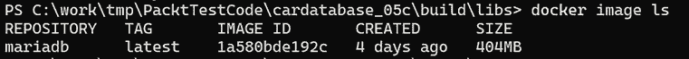

图 17.33：Docker 镜像

1.  接下来，我们将运行`mariadb`容器。`docker run`命令基于给定的镜像创建并运行一个容器。以下命令设置了 root 用户的密码并创建了一个名为`cardb`的新数据库，这是我们 Spring Boot 应用程序所需的（注意！请使用你在 Spring Boot 应用程序中使用的自己的 MariaDB root 用户密码）：

    ```java
    docker run --name cardb -e MYSQL_ROOT_PASSWORD=your_pwd -e MYSQL_
      DATABASE=cardb mariadb 
    ```

1.  现在，我们已经创建了我们的数据库容器，我们可以开始创建 Spring Boot 应用程序的容器。首先，我们必须更改 Spring Boot 应用程序的数据源 URL。打开应用程序的`application.properties`文件，将`spring.datasource.url`的值更改为以下内容：

    ```java
    spring.datasource.url=jdbc:mariadb://mariadb:3306/cardb 
    ```

    这是因为我们的数据库现在正在`cardb`容器中运行，端口为`3306`。

1.  然后，我们必须从我们的 Spring Boot 应用程序创建一个可执行的 JAR 文件，就像我们在本章开头所做的那样。你还可以通过在项目资源管理器中右键单击 **Project**，选择 **Window | Show View | Gradle**，然后从列表中选择 **Gradle Tasks**，在 Eclipse 中运行一个 Gradle 任务。这会打开一个 Gradle 任务列表，你可以通过双击 **build** 任务来启动构建过程。一旦构建完成，你可以在项目文件夹内的 `build/libs` 文件夹中找到可执行的 JAR 文件。

1.  容器是通过使用 **Dockerfile** 定义的。在项目的 `root` 文件夹（`cardatabase`）中使用 Eclipse 创建一个新的 Dockerfile，并将其命名为 `Dockerfile`。以下代码行显示了 Dockerfile 的内容：

    ```java
    FROM eclipse-temurin:17-jdk-alpine
    VOLUME /tmp
    EXPOSE 8080
    COPY build/libs/cardatabase-0.0.1-SNAPSHOT.jar app.jar
    ENTRYPOINT ["java","-jar","/app.jar"] 
    ```

    让我们逐行检查：

    +   `FROM` 定义了 **Java 开发工具包**（**JDK**）版本，你应该使用与构建你的 JAR 文件相同的版本。我们使用 Eclipse Temurin，这是一个开源 JDK，版本为 17，这是我们开发 Spring Boot 应用程序时使用的版本。

    +   体积用于存储 Docker 容器生成和使用的持久数据。

    +   `EXPOSE` 定义了应该发布到容器外部的端口。

    +   `COPY` 将 JAR 文件复制到容器的文件系统，并将其重命名为 `app.jar`。

    +   最后，`ENTRYPOINT` 定义了 Docker 容器运行的命令行参数。

    你可以在 [`docs.docker.com/engine/reference/builder/`](https://docs.docker.com/engine/reference/builder/) 上阅读更多关于 Dockerfile 语法的信息。

1.  在你的 Dockerfile 所在的文件夹中，使用以下命令构建一个镜像。使用 `-t` 参数，我们可以为我们的容器提供一个友好的名称：

    ```java
    docker build -t carbackend . 
    ```

1.  在构建结束时，你应该会看到一条 **Building** [...] **FINISHED** 消息，如下面的截图所示：

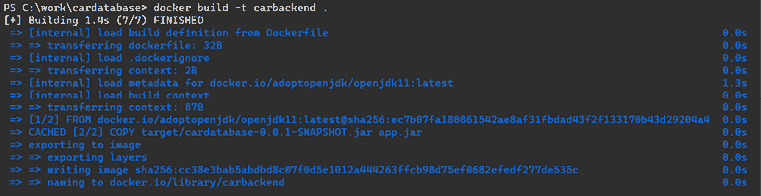

图 17.34：Docker 构建

1.  使用 `docker image ls` 命令检查镜像列表。现在你应该看到两个镜像，如下面的截图所示：


图 17.35：Docker 镜像

1.  现在，我们可以运行我们的 Spring Boot 容器，并使用以下命令将其与 MariaDB 容器链接起来。此命令指定我们的 Spring Boot 容器可以使用 `mariadb` 名称访问 MariaDB 容器：

    ```java
    docker run -p 8080:8080 --name carapp --link cardb:mariadb -d
      carbackend 
    ```

1.  当我们的应用程序和数据库正在运行时，我们可以使用以下命令访问 Spring Boot 应用程序日志：

    ```java
    docker logs carapp 
    ```

我们可以看到，我们的应用程序正在运行：

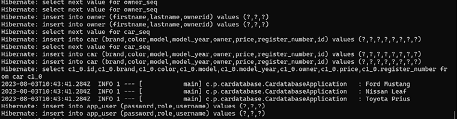

图 17.36：应用程序日志

我们的应用程序已成功启动，演示数据已插入到 MariaDB 容器中存在的数据库中。现在，你可以使用你的后端，如下面的截图所示：

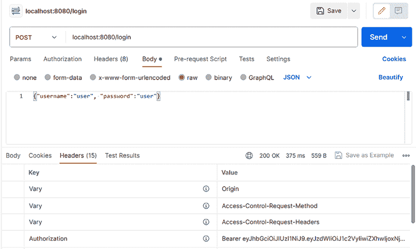

图 17.37：应用程序登录

我们已经学习了多种部署全栈应用程序的方法以及如何容器化 Spring Boot 应用程序。作为下一步，你可以研究如何部署 Docker 容器。例如，AWS 提供了在 Amazon ECS 上部署容器的指南：[`aws.amazon.com/getting-started/hands-on/deploy-docker-containers/`](https://aws.amazon.com/getting-started/hands-on/deploy-docker-containers/)。

# 摘要

在本章中，你学习了如何部署我们的应用程序。我们将 Spring Boot 应用程序部署到了 AWS Elastic Beanstalk。接下来，我们使用 Netlify 部署了我们的 React 前端。最后，我们使用 Docker 为 Spring Boot 应用程序和 MariaDB 数据库创建了容器。

当我们翻到这本书的最后一页时，我希望你在使用 Spring Boot 和 React 进行全栈开发的世界之旅中度过了一段激动人心的旅程。在你继续全栈开发之旅的过程中，请记住，技术总是在不断演变。对于开发者来说，生活就是持续的学习和创新——所以保持好奇心并继续构建。

# 问题

1.  你应该如何创建一个 Spring Boot 可执行 JAR 文件？

1.  你可以使用哪些 AWS 服务将数据库和 Spring Boot 应用程序部署到 AWS？

1.  你可以使用什么命令来构建你的 Vite React 项目？

1.  Docker 是什么？

1.  你应该如何创建一个 Spring Boot 应用程序容器？

1.  你应该如何创建一个 MariaDB 容器？

# 进一步阅读

Packt Publishing 提供其他资源，用于学习 React、Spring Boot 和 Docker。其中一些列在这里：

+   *Docker 基础知识入门 [视频]*，由 Coding Gears | Train Your Brain 提供 ([`www.packtpub.com/product/docker-fundamentals-for-beginners-video/9781803237428`](https://www.packtpub.com/product/docker-fundamentals-for-beginners-video/9781803237428))

+   *Docker 开发者指南*，由 Richard Bullington-McGuire、Andrew K. Dennis 和 Michael Schwartz 著 ([`www.packtpub.com/product/docker-for-developers/9781789536058`](https://www.packtpub.com/product/docker-for-developers/9781789536058))

+   *AWS、JavaScript、React - 在云端部署 Web 应用 [视频]*，由 YouAccel Training 提供 ([`www.packtpub.com/product/aws-javascript-react-deploy-web-apps-on-the-cloud-video/9781837635801`](https://www.packtpub.com/product/aws-javascript-react-deploy-web-apps-on-the-cloud-video/9781837635801))

# 在 Discord 上了解更多

要加入这本书的 Discord 社区——在那里你可以分享反馈、向作者提问，并了解新版本——请扫描下面的二维码：

[`packt.link/FullStackSpringBootReact4e`](https://packt.link/FullStackSpringBootReact4e)


