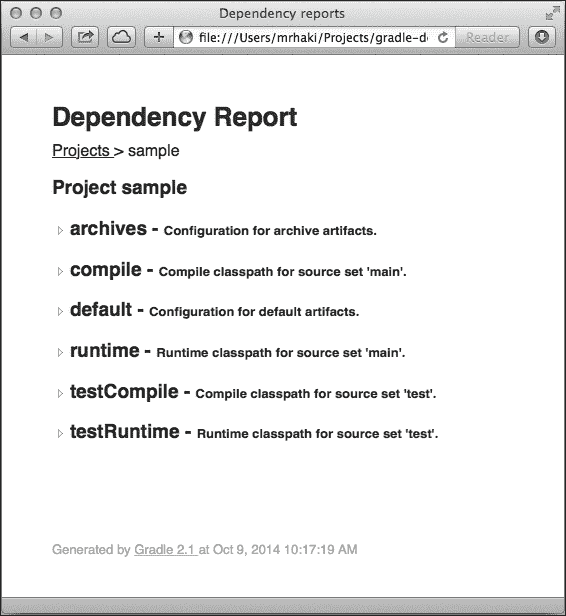
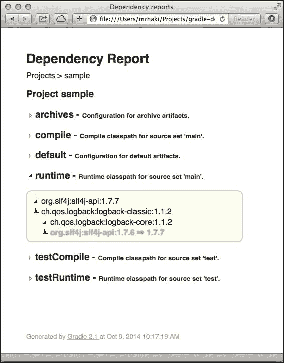
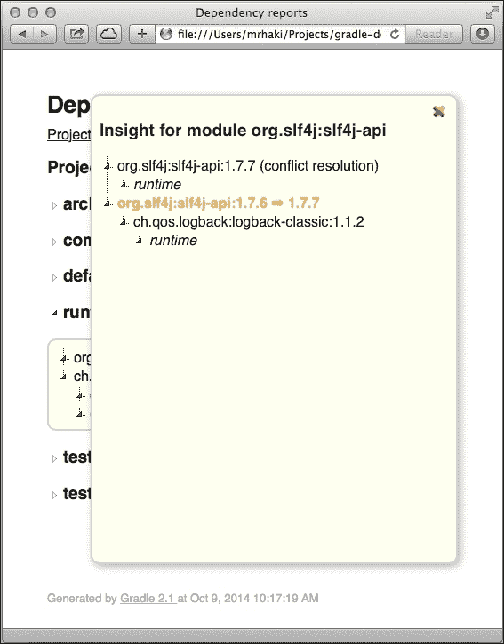

# 第三章 解析依赖项

在第一章中，*定义依赖项*，你学习了如何将依赖项添加到你的项目中。我们看到了指定依赖项的不同方法，例如模块或项目依赖项。在前一章中，我们探讨了如何定义托管我们依赖项的仓库。Gradle 将使用这些信息来进行实际的依赖项解析。在本章中，我们将看到 Gradle 是如何解析依赖项的。

Gradle 在解决版本冲突方面与其他构建工具不同，因此我们将仔细观察依赖项解析时发生的情况。我们将看到如何在 Gradle 中自定义解析过程，以便我们可以获得我们想要的精确依赖项，并实现可靠和可重复的构建。

# 理解依赖解析

Gradle 将使用`repositories`和`dependencies`配置块中的信息来收集和下载所有依赖项。这个过程也被称为**依赖解析**。Gradle 在解析依赖项时采取以下步骤：

1.  在定义的仓库中搜索依赖项的模块描述符文件。使用仓库定义的顺序进行搜索。因此，先于其他仓库定义的仓库首先被搜索，依此类推。如果找到了 POM 或 Ivy 描述符文件，则使用它。如果没有找到描述符文件，则搜索依赖项的工件文件。如果找到了描述符文件或工件文件，那么 Gradle 就知道这个仓库可以用来下载依赖项。

    +   如果找到一个带有父 POM 描述符文件的 POM 描述符文件，则 Gradle 将解析父 POM。

    +   动态版本，如*4.1.+*，解析为仓库中可用的最高静态版本。例如，如果仓库包含版本*4.1.0*和*4.1.1*，则使用*4.1.1*版本。

1.  Gradle 将根据以下标准确定哪个仓库最适合使用：

    +   模块描述符文件，如 POM 和 Ivy 描述符文件，比仅包含工件文件的文件更受欢迎。

    +   优先考虑在早期仓库中找到的依赖项，而不是在后期仓库中找到的依赖项。

    +   如果使用了类似*2.+*的动态版本，则更倾向于使用比它低的静态版本。

1.  模块依赖项的工件是从 Gradle 选择的仓库下载的。这意味着工件不是从与定义的依赖项的描述符文件或工件文件不同的仓库下载的。

如果一个依赖项使用静态版本定义，并且 Gradle 在仓库中找到了这个依赖项的模块描述符文件，那么对这个依赖项的搜索就完成了，其他仓库将不会用于搜索。这个过程无法找到更好的仓库候选者，因此对于这个依赖项的依赖项解析就完成了。

## 配置传递依赖项

大多数情况下，我们项目中的依赖项也依赖于其他库。因此，这些依赖项有自己的依赖项。这些被称为传递依赖项。Gradle 必须能够解析传递依赖项。

在以下示例构建文件中，我们使用版本 `1.1.2` 和组名 `ch.qos.logback` 定义了 `logback-classic` 模块依赖项：

```java
apply plugin: 'java'

repositories.jcenter()

dependencies {
  // Dependency definition for Logback classic
  // library, used as implementation for SLF4J API.
  compile 'ch.qos.logback:logback-classic:1.1.2'
}
```

当我们运行 Gradle 的 `dependencies` 任务时，我们可以看到我们定义的 `logback-classic` 依赖项依赖于 `ch.qos.logback:logback-core:1.1.2` 和 `org.slf4j:slf4j-api:1.7.6`。以下代码显示了这一点：

```java
$ gradle -q dependencies --configuration compile
------------------------------------------------------------
Root project
------------------------------------------------------------

compile - Compile classpath for source set 'main'.
\--- ch.qos.logback:logback-classic:1.1.2
 +--- ch.qos.logback:logback-core:1.1.2
 \--- org.slf4j:slf4j-api:1.
7.6

```

## 禁用传递依赖项

如果我们不想在我们的项目中包含传递依赖项，我们必须重新配置依赖项或配置。使用 Gradle，我们有不同的方法来禁用依赖项的传递行为。首先，我们可以在依赖定义中添加一个配置闭包，使用 `transitive` 属性，并将其值设置为 `false`。默认情况下，所有依赖项都被视为传递依赖项，正如我们在示例构建文件中看到的那样。

在以下示例构建文件中，我们指定我们想要将 `logback-classic` 依赖项视为非传递依赖项：

```java
apply plugin: 'java'

repositories.jcenter()

dependencies {
  // Dependency definition for Logback classic.
  compile 'ch.qos.logback:logback-classic:1.1.2', {
    // We don't want to have the transitive dependencies.
    transitive = false
  }
}
```

如果我们再次运行 `dependencies` 任务，我们可以在输出中看到传递依赖项不再被解析：

```java
$ gradle -q dependencies --configuration compile

------------------------------------------------------------
Root project
------------------------------------------------------------

compile - Compile classpath for source set 'main'.
\--- ch.qos.logback:logback-classic:1.1.2

```

我们还可以完全禁用依赖项配置中的传递依赖项。这意味着使用该配置定义的任何依赖项都不会有传递依赖项。配置中的单个依赖项可以在配置闭包中使用 `transitive` 属性来再次启用该依赖项的传递行为。要完成此操作，请执行以下步骤：

1.  首先，我们将在下一个示例构建文件中禁用 `compile` 配置的传递依赖项：

    ```java
    apply plugin: 'java'

    repositories.jcenter()

    configurations {
      // Disable transitive dependencies for
      // all dependencies defined in this
      // configuration.
      // Configurations extended
      // from the compile configuration will not
      // inherit this transitive property value.
      compile.transitive = false
    }

    dependencies {
      // Dependency definition for Logback classic
      compile 'ch.qos.logback:logback-classic:1.1.2'
    }
    ```

1.  接下来，我们将执行 `dependencies` 任务，并看到传递依赖项不再被解析：

    ```java
    $ gradle -q dependencies --configuration compile

    ------------------------------------------------------------
    Root project
    ------------------------------------------------------------

    compile - Compile classpath for source set 'main'.
    \--- ch.qos.logback:logback-classic:1.1.2
    ```

## 排除传递依赖项

我们还可以对传递依赖项有更精细的控制。我们可以在依赖定义中排除某些传递依赖项。这样，我们可以选择只使用某些传递依赖项，而排除其他依赖项。要定义我们想要排除的传递依赖项，我们使用依赖项配置闭包中的 `exclude` 方法。

让我们看看我们如何包含 `logback-core` 传递依赖项，但移除 `slf4j-api` 依赖项。我们在配置闭包中使用 `exclude` 方法。`exclude` 方法接受一个 `Map` 作为参数，其中包含一个或两个键：`module` 和 `group`。在以下构建文件中，我们包含 `logback-core` 传递依赖项：

```java
apply plugin: 'java'

repositories.jcenter()

dependencies {
  // Dependency definition for Logback classic
  compile('ch.qos.logback:logback-classic:1.1.2') {
    // Exclude slf4j-api transitive dependency.
    exclude module: 'slf4j-api'
    // Alternative syntax:
    // Exclude all modules in the group org.slf4j:
    // exclude group: 'org.slf4j'
    // Or specify both group and module name:
    // exclude group: 'org.slf4j', module: 'slf4j-api'
  }
}
```

我们执行 `dependencies` 任务以查看我们的配置定义是否具有预期的效果：

```java
$ gradle -q dependencies --configuration compile

------------------------------------------------------------
Root project
------------------------------------------------------------

compile - Compile classpath for source set 'main'.
\--- ch.qos.logback:logback-classic:1.1.2
 \--- ch.qos.logback:logback-core:1.1.2

```

注意，在输出中，传递依赖项 `org.slf4j:slf4j-api:1.7.6` 已不再是我们的传递依赖项的一部分。

我们还可以在单个依赖项之外对配置设置排除规则。配置上的排除规则将用于配置中定义的所有依赖项。在下一个示例 Gradle 构建文件中，我们将从 `compile` 配置中排除 `slf4j-api` 模块：

```java
apply plugin: 'java'

repositories.jcenter()

configurations {
  compile {
    // Exclude slf4j-api transitive dependency.
    exclude module: 'slf4j-api'
    // Alternative syntax:
    // Exclude all modules in the group org.slf4j:
    // exclude group: 'org.slf4j'
    // Or specify both group and module name:
    // exclude group: 'org.slf4j', module: 'slf4j-api'
  }

  // To exclude a module and/or group from all configurations
  // we can use the all method:
  // all { exclude module: 'slf4j-api' }
}

dependencies {
  // Dependency definition for Logback classic.
  compile('ch.qos.logback:logback-classic:1.1.2')
}
```

我们添加到配置或依赖项中的任何排除规则都可以通过相应对象的 `excludeRules` 属性再次访问。我们可以使用此属性来找出负责排除特定依赖项的配置或依赖项。在以下示例构建文件中，我们创建了一个新的任务 `showExcludeRules`，其中我们遍历所有配置和依赖项并收集排除规则。在任务的末尾，我们将所有信息打印到标准输出。以下代码显示了这一点：

```java
apply plugin: 'java'

repositories.jcenter()

configurations {
  compile {
    exclude module: 'slf4j-api'
  }
}

dependencies {
  compile('ch.qos.logback:logback-classic:1.1.2') {
    exclude group: 'ch.qos.logback', module: 'logback-core'
  }
}

task showExcludeRules {
  description 'Show exclude rules for configurations and dependencies'

  doFirst {
    // Store found exclude rules.
    def excludes = []

    // Go through all configurations to find exclude rules
    // defined at configuration level and at
    // dependency level for dependencies in the configuration.
    configurations.all.each { configuration ->
      def configurationExcludes = configuration.excludeRules
      configurationExcludes.findAll().each { rule ->
        // Add found excludeRule to excludes collection.
        excludes << [type: 'container',
              id: configuration.name,
              excludes: rule]
      }

      def dependencies = configuration.allDependencies
      dependencies.all { dependency ->
        def excludeRules = dependency.excludeRules

        excludeRules.findAll().each { rule ->
          def dep = dependency
          def id = "${dep.group}:${dep.name}:${dep.version}"
          // Add found excludeRule to excludes collection.
          excludes << [type: 'dependency', id: id, excludes: rule]
        }
      }
    }

    // Printing exclude rule information for output.
    def printExcludeRule = {
      def rule = "${it.excludes.group ?: '*'}:${it.excludes.module ?: '*'}"
      println "$it.id >> $rule"
    }

    // Print formatted header for output.
    def printHeader = { header ->
      println()
      println '-' * 60
      println header
      println '-' * 60
    }

    // Group rules by organisation or dependency.
    def excludeRules = excludes.groupBy { it.type }

    printHeader 'Configurations'
    excludeRules.container.toSet().each(printExcludeRule)

    printHeader 'Dependencies'
    excludeRules.dependency.toSet().each(printExcludeRule)
  }
}
```

当我们运行任务时，我们得到以下输出：

```java
$ gradle -q showExcludeRules

------------------------------------------------------------
Configurations
------------------------------------------------------------
compile >> *:slf4j-api

------------------------------------------------------------
Dependencies
------------------------------------------------------------
ch.qos.logback:logback-classic:1.1.2 >> ch.qos.log
back:logback-core

```

## 使用仅软件包依赖项

最后，如果我们知道我们只想包含依赖项中的一个软件包，我们可以使用 `ext` 属性来为外部模块依赖项。使用此属性，不会解决传递依赖项，因为我们指定了我们特别想要由 `ext` 属性指定的软件包。

在我们的示例中，我们可以使用具有 `jar` 值的 `ext` 属性来仅解决 `logback-classic` 依赖项的 JAR 软件包。在下一个示例构建文件中，我们将使用 `ext` 属性为我们的 `logback-classic` 依赖项：

```java
apply plugin: 'java'

repositories.jcenter()

dependencies {
  // Dependency definition for Logback classic library
  compile 'ch.qos.logback:logback-classic:1.1.2@jar'

  // Alternative syntax:
  //compile group: 'ch.qos.logback',
  //        name: 'logback-classic',
  //        version: '1.1.2',
  //        ext: 'jar'
}
```

# 解决版本冲突

我们之前的示例很简单，只包含一个依赖项和一些传递依赖项。当我们向我们的项目添加更多依赖项，或者有一个多模块项目，其中每个项目都有很多依赖项时，可能会发生相同或传递依赖项被多次包含的情况。Gradle 会检测到这一点，并确保依赖项只下载一次。我们将在 Gradle 中稍后看到关于高级依赖项缓存管理的更多内容。

当同一个依赖被多次包含但版本不同时，问题就开始了。应该使用哪个版本的依赖？这正是 Gradle 的解析策略发挥作用的地方。下表显示了 Gradle 具有的解析策略：

| 名称 | 描述 |
| --- | --- |
| 最新版 | 使用冲突依赖项的最新版本。这是 Gradle 使用的默认策略。如果冲突依赖项的版本向后兼容，则此策略有效。 |
| 失败 | 当依赖项存在版本冲突时，构建过程会失败。我们必须明确地在我们的构建文件中添加代码来解决版本冲突。我们将在本章后面看到如何自定义解析策略来显式解决版本冲突。 |

## 使用最新版本

让我们看看如果我们有一个版本冲突并使用 Gradle 的默认解决策略会发生什么。Gradle 将使用具有版本冲突的依赖项的最新版本。为了完成此操作，请执行以下步骤：

1.  在下一个构建文件中，我们在`compile`配置中定义了对`slf4j-api`的依赖，在`runtime`配置中定义了对`logback-classic`的依赖：

    ```java
    apply plugin: 'java'

    repositories.jcenter()

    dependencies {
      // Define dependency on SLF4J API for
      // compiling source files.
      compile 'org.slf4j:slf4j-api:1.7.7'

      // Define implementation Logback classic
      // of SLF4J API in runtime configuration.
      // This has a transitive dependency on
      // org.slf4j:slf4j-api:1.7.6, which is a version
      // conflict with org.slf4j:slf4j-api:1.7.7
      runtime 'ch.qos.logback:logback-classic:1.1.2'
    }
    ```

1.  我们运行`dependencies`任务以查看使用了哪些依赖项的版本。以下输出显示，`logback-classic`的传递依赖项`org.slf4j:slf4j-api:1.7.6`已更改，因此使用了定义在`compile`配置中的版本`1.7.7`。

    ```java
    $ gradle -q dependencies --configuration runtime

    ------------------------------------------------------------
    Root project
    ------------------------------------------------------------

    runtime - Runtime classpath for source set 'main'.
    +--- org.slf4j:slf4j-api:1.7.7
    \--- ch.qos.logback:logback-classic:1.1.2
     +--- ch.qos.logback:logback-core:1.1.2
     \--- org.slf4j:slf4j-api:1.7.6 -> 1.7.7

    (*) - dependencies omitted (listed previously)

    ```

    注意到行`org.slf4j:slf4j-api:1.7.6 → 1.7.7`，它直观地显示了该依赖项的版本已从`1.7.6`增加到`1.7.7`。

1.  `dependencies`任务显示了依赖项和传递依赖项的层次树视图。要从一个特定的依赖项获取视图，并查看它是如何进入依赖项图的，我们使用`dependencyInsight`任务。使用此任务，我们可以看到依赖项是如何解决的，以及是否发生了任何冲突解决。

1.  当我们从命令行调用`dependencyInsight`任务时，我们必须使用以下两个选项：

    1.  我们使用`--configuration`选项指定依赖项的配置。

    1.  然后，我们使用`--dependency`选项来指定依赖项的名称。

1.  依赖项的名称不必是全名；我们甚至可以使用名称的一部分。例如，我们可以使用`org.slf4j:slf4j-api`、`slf4j-api`和`slf4j`来深入了解一个依赖项。

1.  我们执行`dependencyInsight`任务以查看示例构建文件中`slf4j-api`依赖项的更多信息：

    ```java
    $ gradle -q dependencyInsight --configuration runtime --dependency slf4j-api
    org.slf4j:slf4j-api:1.7.7 (conflict resolution)
    \--- runtime

    org.slf4j:slf4j-api:1.7.6 -> 1.7.7
    \--- ch.qos.logback:logback-classic:1.1.2
     \--- runtime

    ```

    在输出中，我们看到`org.slf4j:slf4j-api:1.7.7`依赖项已为`runtime`配置解决，并且已对该依赖项进行了冲突解决。在下一行中，我们将看到`org.slf4j:slf4j-api:1.7.6`的传递依赖项版本已从`1.7.6`增加到`1.7.7`。`dependencyInsight`任务已经告诉我们更多关于应用的依赖项解决信息。我们可能会从使用`dependencies`任务进行的大致概述开始，如果我们想获取有关特定依赖项的更多信息，我们将使用`dependencyInsight`任务。

1.  我们还可以使用另一个任务，该任务将`dependencies`和`dependencyInsight`任务结合起来。`htmlDependencyReport`任务是`project-report`插件的一部分。使用此任务，我们可以获得一个 HTML 报告，显示所有依赖项，并且我们可以点击依赖项以获取更多信息。要使用此任务，我们首先将`project-report`插件添加到我们的示例项目文件中。以下代码显示了这一点：

    ```java
    apply plugin: 'java'
    apply plugin: 'project-report'

    repositories.jcenter()

    dependencies {
      compile 'org.slf4j:slf4j-api:1.7.7'

      runtime 'ch.qos.logback:logback-classic:1.1.2'
    }
    ```

1.  我们为这个构建文件执行`htmlDependencyReport`任务。以下代码显示了这一点：

    ```java
    $ gradle htmlDependencyReport
    :htmlDependencyReport

    BUILD SUCCESSFUL

    Total time: 1.645 secs
    $

    ```

1.  在任务执行后，`build/reports/project/dependencies/`目录中会创建新的文件。

1.  当我们在网页浏览器中打开 `index.html` 文件时，我们可以看到我们项目的名称。如果我们有一个多模块项目，我们在这里会看到所有项目的名称。我们可以点击名称并获取所有配置的概述。在下一张截图中，我们看到我们项目中所有配置的概述：

1.  当我们点击 `runtime` 配置链接时，所有依赖项都会显示出来。我们可以看到存在版本冲突，因为 `org.sfl4j:slf4j-api:1.7.6` 依赖项的颜色是橙色。这个视图就是我们通过命令行调用依赖项任务时看到的：

1.  要获取依赖项洞察视图，我们点击 `org.sfl4j:slf4j-api:1.7.6 → 1.7.7` 链接。在我们的网页浏览器中打开一个弹出窗口，我们看到以下截图：

现在，我们看到如果我们从命令行运行 `dependencyInsight` 任务时通常会看到的内容。

`htmlDependencyReport` 非常有用，可以获取我们项目中依赖项的图形化和交互式视图。通过在生成的 HTML 报告中点击它，我们也可以轻松地获取更多关于依赖项的详细信息。

## 在版本冲突时失败

如果默认的 Gradle 解析策略（使用（传递性）依赖项的最新版本）不能解决问题，我们可以选择在版本冲突时让构建失败。为了再次成功运行构建，我们必须明确在我们的构建文件中解决版本冲突。

在以下示例构建文件中，我们为 `runtime` 配置配置了解决策略，如果存在版本冲突则失败。`resolutionStrategy` 方法接受一个配置闭包，在其中我们调用 `failOnVersionConflict` 方法。以下代码展示了这一点：

```java
apply plugin: 'java'

repositories.jcenter()

configurations {
  runtime {
    resolutionStrategy {
      // If there is a version conflict,
      // then the build must fail.
      failOnVersionConflict()
    }
  }

  // Alternatively we could apply
  // this to all configurations:
  // all {
  //     resolutionStrategy {
  //         failOnVersionConflict()
  //     }
  // }
}

dependencies {
  compile 'org.slf4j:slf4j-api:1.7.7'

  runtime 'ch.qos.logback:logback-classic:1.1.2'
}
```

构建现在配置为在版本冲突时失败。我们知道在本章前面的示例中，`slf4j-api` 上存在版本冲突。我们现在执行 `dependencies` 任务来看看会发生什么：

```java
$ gradle -q dependencies

------------------------------------------------------------
Root project
------------------------------------------------------------

runtime - Runtime classpath for source set 'main'.

FAILURE: Build failed with an exception.

* What went wrong:
Execution failed for task ':dependencies'.
> Could not resolve all dependencies for configuration ':runtime'.
 > A conflict was found between the following modules:
 - org.slf4j:slf4j-api:1.7.7
 - org.slf4j:slf4j-api:1.7.6

* Try:
Run with --stacktrace option to get the stack trace. Run with --info or --debug option to get more log output.

```

我们看到这次构建失败了。在输出中，我们看到原因。`org.slf4j:slf4j-api:1.7.7` 和 `org.slf4j:slf4j-api:1.7.6` 模块之间存在冲突。

## 强制版本

我们可以强制 Gradle 在我们的项目中使用特定版本的依赖项。这个依赖项也可以是传递性的。我们使用依赖项的配置闭包，并将 `force` 属性设置为 `true`。这指示 Gradle 依赖项解析过程始终使用指定的版本，即使依赖项是依赖图中的传递性依赖项。

在我们的示例构建文件中，我们有一个版本冲突。我们可以通过强制 Gradle 使用 `org.slf4j:slf4j-api` 依赖项的版本 `1.7.7` 来修复这个问题。以下示例构建文件应用了 `force` 属性：

```java
apply plugin: 'java'

repositories.jcenter()

configurations {
  runtime {
    resolutionStrategy {
      failOnVersionConflict()
    }
  }
}

dependencies {
  compile 'org.slf4j:slf4j-api:1.7.7', {
    // Force Gradle to use this version
    // for this dependency (even transtive).
    force = true
  }

  runtime 'ch.qos.logback:logback-classic:1.1.2'
}
```

让我们运行 `dependencies` 任务来看看版本冲突是否已经解决：

```java
$ gradle -q dependencies --configuration runtime

------------------------------------------------------------
Root project
------------------------------------------------------------

runtime - Runtime classpath for source set 'main'.
+--- org.slf4j:slf4j-api:1.7.7
\--- ch.qos.logback:logback-classic:1.1.2
 +--- ch.qos.logback:logback-core:1.1.2
 \--- org.slf4j:slf4j-api:1.7.6 -> 1.7.7

(*) - dependencies omitted (listed previously)

```

我们已经解决了版本冲突，构建现在再次成功。我们还可以在输出中看到，对于 `org.slf4j:slf4j-api:1.7.6` 传递依赖项，版本现在是 `1.7.7`。

除了在依赖项配置中设置 `force` 属性外，我们还可以在 `configurations` 配置块的 `resolutionStrategy` 方法中作为依赖项的一部分强制设置版本。我们使用 `force` 方法添加具有强制版本的依赖项。或者，我们可以使用 `forcedModules` 属性来定义所有强制依赖项。这可能是一个更好的解决方案，因为我们可以在 `resolutionStrategy` 配置闭包中将具有强制版本的多个依赖项放在一起，从而使构建文件更易于阅读和维护。

在下一个示例构建文件中，我们将强制 `org.slf4j:slf4j-api` 依赖项的版本为 `1.7.7`，但这次作为 `resolutionStrategy` 配置的一部分：

```java
apply plugin: 'java'

repositories.jcenter()

configurations {
  runtime {
    resolutionStrategy {
      failOnVersionConflict()

      // Make sure version 1.7.7 is used for
      // (transitive) dependency org.slf4j:slf4j-api.
      force 'org.slf4j:slf4j-api:1.7.7'

      // Alternate syntax is to define the
      // forced module collection.
      // forcedModules = ['org.slf4j:slf4j-api:1.7.7']
    }
  }
}

dependencies {
  compile 'org.slf4j:slf4j-api:1.7.7'

  runtime 'ch.qos.logback:logback-classic:1.1.2'
}
```

当我们从命令行执行 `dependencies` 任务时，我们看到所有 `org.slf4j:slf4j-api` 依赖项都使用了版本 `1.7.7`：

```java
$ gradle -q dependencies --configuration runtime

------------------------------------------------------------
Root project
------------------------------------------------------------

runtime - Runtime classpath for source set 'main'.
+--- org.slf4j:slf4j-api:1.7.7
\--- ch.qos.logback:logback-classic:1.1.2
 +--- ch.qos.logback:logback-core:1.1.2
 \--- org.slf4j:slf4j-api:1.7.6 -> 1.7.7

(*) - dependencies omitted (listed previously)

```

# 自定义依赖项解析规则

对于我们在构建文件中定义的每个依赖项，都有一个依赖项解析规则。当需要解析依赖项时，将执行此规则。我们可以在构建文件中自定义此规则，因此我们可以在依赖项实际解析之前更改规则的某些部分。Gradle 允许我们通过自定义解析规则来更改依赖项组、名称和版本。这样，我们甚至可以用其他依赖项完全替换依赖项或强制使用特定版本。

依赖项解析规则细节在 `org.gradle.api.artifacts.DependencyResolveDetails` 类中实现。在 `resolutionStrategy` 配置块内部，我们使用 `eachDependency` 方法来自定义解析规则。此方法接受一个闭包，闭包参数是 `DependencyResolveDetails` 的一个实例。我们使用 `DependencyResolveDetails` 的 `useVersion` 和 `useTarget` 方法来更改请求的依赖项的版本或完整的组、名称和版本。

让我们更改之前的示例构建文件，并为 `org.slf4j:slf4j-api` 依赖项定义一个自定义解析规则，以便始终使用版本 `1.7.7`。在下一个示例构建文件中，我们将看到如何实现这一点：

```java
apply plugin: 'java'

repositories.jcenter()

configurations {
  runtime {
    resolutionStrategy {
      failOnVersionConflict()

      // Customize dependency resolve rules.
      eachDependency { DependencyResolveDetails details ->
        def requestedModule = details.requested

        // Force version for 
        // org.slf4j:slf4j-api dependency.
        if (requestedModule.group == 'org.slf4j'
          && requestedModule.name == 'slf4j-api') {

          // Force version 1.7.7.
          details.useVersion '1.7.7'
        }
      }
    }
  }
}

dependencies {
  compile 'org.slf4j:slf4j-api:1.7.7'

  runtime 'ch.qos.logback:logback-classic:1.1.2'
}
```

这种机制非常强大。除了强制指定特定版本外，我们还可以使用依赖项解析规则将完整的依赖项替换为另一个依赖项。假设我们项目中的一个依赖项有一个对 Log4j 日志框架的传递依赖。我们不希望这个依赖项，而是想使用 log4j-over-slf4j 桥接。这个桥接包含 Log4j 类的替代实现，因此我们可以使用 SLF4J API 实现。log4j-over-slf4j 桥接由`org.slf4j:log4j-over-slf4j:1.7.7`依赖项定义。我们使用解析规则细节的`useTarget`方法设置新的目标。该方法接受依赖项的字符串表示法和映射表示法。

以下示例构建文件包含替换`Log4j`依赖项到`log4j-over-slf4j`桥接的依赖项解析规则：

```java
apply plugin: 'java'

repositories.jcenter()

configurations {
  runtime {
    resolutionStrategy {
      eachDependency { DependencyResolveDetails details ->
        def requestedModule = details.requested

        // Change resolve rule for log4j:log4j
        // (transitive) dependency.
        if (requestedModule.group == 'log4j'
          && requestedModule.name == 'log4j') {

          // Replace log4j:log4j:<version> with
          // org.slf4j:log4j-over-slf4j:1.7.7.
          details.useTarget group: 'org.slf4j',
                  name: 'log4j-over-slf4j',
                  version: '1.7.7'
          // Alternative syntax:
          // useTarget 'org.slf4j:log4j-over-slf4j:1.7.7'
        }
      }
    }
  }
}

dependencies {
  compile 'org.slf4j:slf4j-api:1.7.7'

  // In real life this is probably a transitive
  // dependency from a dependency we need in our project.
  // We put it here as an example to show we
  // can completely replace a dependency with
  // another.
  runtime 'log4j:log4j:1.2.17'

  runtime 'ch.qos.logback:logback-classic:1.1.2'
}
```

我们可以通过命令行验证 Log4j 依赖项是否被`dependencies`任务替换。以下代码显示了这一点：

```java
$ gradle -q dependencies --configuration runtime

------------------------------------------------------------
Root project
------------------------------------------------------------

runtime - Runtime classpath for source set 'main'.
+--- org.slf4j:slf4j-api:1.7.7
+--- log4j:log4j:1.2.17 -> org.slf4j:log4j-over-slf4j:1.7.7
|    \--- org.slf4j:slf4j-api:1.7.7
\--- ch.qos.logback:logback-classic:1.1.2
 +--- ch.qos.logback:logback-core:1.1.2
 \--- org.slf4j:slf4j-api:1.7.6 -> 1.7.7

(*) - dependencies omitted (listed previously)

```

注意到`log4j:log4j:1.2.17 → org.slf4j:log4j-over-slf4j:1.7.7`这一行，它直观地显示了依赖项被新的依赖项替换。

自定义依赖项解析规则还允许我们定义自定义版本方案。例如，在我们的组织中，我们可以定义如果依赖项的版本设置为`fixed`值，则实际版本将从企业内部网络的中央位置获取。这样，组织中的所有项目都可以共享依赖项的相同版本。

在下一个示例构建文件中，我们将实现自定义版本方案。如果省略了`version`属性或具有`fixed`值，则版本信息将从预定义的版本列表中获取。以下代码显示了这一点：

```java
apply plugin: 'java'

repositories.jcenter()

configurations {
  runtime {
    resolutionStrategy {
      eachDependency { DependencyResolveDetails details ->
        def requestedModule = details.requested

        // If version is not set or version 
        // has value 'fixed' set
        // version based on external definition.
        if (!requestedModule.version
          || requestedModule.version == 'fixed') {
          def moduleVersion = findModuleVersion(requestedModule.name)
          details.useVersion moduleVersion
        }
      }
    }
  }
}

dependencies {
  // Version is not defined for this dependency,
  // is resolved via custom dependency resolve rule.
  compile 'org.slf4j:slf4j-api'

  // Version is set to 'fixed', so version can
  // be resolved via custom dependency resolve rule.
  runtime 'ch.qos.logback:logback-classic:fixed'
}

/**
* Find version for given module name. In real life
* this could be part of a company Gradle plugin
* or intranet resource with version information.
*
* @param name Module descriptor name
* @return Version for given module name
*/
def findModuleVersion(String name) {
  ['slf4j-api': '1.7.7', 'logback-classic': '1.1.2']
  .find { it.key == name}
  .value
}
```

当我们从命令行运行`dependencies`任务时，看到其输出是很有趣的：

```java
$ gradle -q dependencies --configuration runtime

------------------------------------------------------------
Root project
------------------------------------------------------------

runtime - Runtime classpath for source set 'main'.
+--- org.slf4j:slf4j-api: -> 1.7.7
\--- ch.qos.logback:logback-classic: -> 1.1.2
 +--- ch.qos.logback:logback-core:1.1.2
 \--- org.slf4j:slf4j-api:1.7.6 -> 1.7.7

(*) - dependencies omitted (listed previously)

```

在输出中，我们可以清楚地看到没有版本号的`org.slf4j:slf4j-api`依赖项现在使用的是版本`1.7.7`。`ch.qos.logback:logback-classic`依赖项的`fixed`版本解析为版本`1.1.2`。

## 使用客户端模块

我们可以不在存储库中找到的模块描述符上依赖外部模块依赖项，而是在我们的构建文件中将模块的元数据定义为客户端模块。记得从第一章，*定义依赖项*，中提到的，使用客户端模块，我们在构建文件中定义模块描述符，并仍然从存储库获取工件。

让我们在以下示例构建文件中使用客户端模块。我们重新定义了`logback-classic`依赖项的传递依赖，并使用`slf4j-api`依赖项的版本`1.7.7`。以下代码显示了这一点：

```java
apply plugin: 'java'

repositories.jcenter()

configurations {
  runtime {
    resolutionStrategy {
      failOnVersionConflict()
    }
  }
}

dependencies {
  compile 'org.slf4j:slf4j-api:1.7.7'

  // Use a client module to redefine the transitive
  // dependencies for the logback-classic.
  runtime module('ch.qos.logback:logback-classic:1.1.2') {
    dependency 'ch.qos.logback:logback-core:1.1.2'

    // Force the correct version of
    // the slf4j-api dependency/
    dependency 'org.slf4j:slf4j-api:1.7.7'
  }
}
```

我们从命令行调用`dependencies`任务来检查是否使用了正确的依赖项：

```java
$ gradle -q dependencies --configuration runtime

------------------------------------------------------------
Root project
------------------------------------------------------------

runtime - Runtime classpath for source set 'main'.
+--- org.slf4j:slf4j-api:1.7.7
\--- ch.qos.logback:logback-classic:1.1.2
 +--- org.slf4j:slf4j-api:1.7.7
 \--- ch.qos.logback:logback-core:1.1.2

(*) - dependencies omitted (listed previously)

```

我们在输出中看到，对`org.slf4j:slf4j-api`的依赖现在为`1.7.7`，并且我们不再有版本冲突。

# 使用动态版本和变更模块

在第一章 *定义依赖* 中，我们已经学习了动态版本的概念。例如，我们可以使用一系列版本，如 `[4.0.1.RELEASE,4.0.4.RELEASE[`。当依赖项通过 Gradle 解析时，会选取该范围内可用的最新静态版本。

变更模块与动态版本不同。变更模块引用具有相同版本但具有变更 artifacts 的依赖项。例如，在一个 Maven 仓库中，变更模块是由`version`属性中的`-SNAPSHOT`指示的快照模块。Gradle 可以解析变更模块依赖项并获取给定版本的最新 artifacts。然而，下次可能会下载新的 artifacts，因为内容已更改。

Gradle 会缓存动态版本和变更模块 24 小时。我们将看到如何在我们的 Gradle 构建文件和命令行中自定义此行为。然而，在我们查看选项之前，我们首先会了解 Gradle 缓存的工作原理。

# 理解依赖项缓存

Gradle 的依赖项缓存试图最小化远程请求和下载的数量，以便构建可以快速且可靠。缓存有两个部分来执行适当的依赖项缓存：

+   首先，它有一个用于依赖项元数据（POM 或 Ivy 描述文件）的缓存，包括依赖项组、名称和版本。Gradle 为每个仓库保留一个单独的缓存。因此，如果相同的依赖项在多个仓库中找到，则元数据信息将缓存在多个依赖项元数据缓存中。

+   依赖项缓存也有一个用于存储依赖项下载的 artifacts 的单个缓存。多个元数据缓存共享下载 artifacts 的相同缓存。artifacts 通过其内容的 SHA1 哈希码存储，而不是通过元数据，如组、名称或版本。

根据仓库和 artifacts 缓存分离的元数据缓存提供了足够的灵活性，以执行可重复和可靠的依赖项解析。如果 Gradle 无法解析依赖项元数据，则依赖项解析将停止，即使本地缓存有从不同仓库（未定义在我们的构建中）下载的 artifacts 副本。这种仓库独立性将构建彼此隔离，并防止依赖项 artifacts 的问题。

Gradle 首先尝试确定一个工件文件的 SHA1 校验和，然后再下载该工件。如果可以确定校验和，并且缓存中已经存在具有相同校验和的文件，则不会下载该文件。Gradle 还尝试重用本地 Maven 仓库中的工件。如果本地 Maven 仓库中某个工件的校验和与远程仓库中工件的校验和匹配，则不需要下载该工件，可以直接从本地 Maven 仓库复制。

由于 Gradle 使用 SHA1 校验和来验证工件内容，因此可以存储同一工件的多个版本。例如，当一个工件是变化模块的一部分，或者工件的 内容在仓库中发生变化，而版本号没有变化时。

元数据缓存和工件缓存都存储在由 `GRADLE_USER_HOME` 环境变量定义的目录中，默认情况下是用户主目录中的 `.gradle/caches` 目录。Gradle 使用复杂的锁定机制来管理缓存，因此多个项目可以同时使用缓存目录和文件。在下一个示例构建文件中，我们创建 `artifactsLocation` 任务以打印下载的工件存储位置：

```java
apply plugin: 'java'

repositories.jcenter()

dependencies {
  compile 'org.slf4j:slf4j-api:1.7.7'
  runtime 'ch.qos.logback:logback-classic:1.1.2'
}

task artifactsLocation {
  description 'Show location of artifact on disk'

  doFirst {
    configurations.runtime.each { println it }
  }
}
```

当我们执行 `artifactsLocation` 任务时，在输出中可以看到文件存储在用户主目录（`/Users/mrhaki`）中的 `.gradle/caches` 目录中。我们还可以看到用于目录名的 SHA1 校验和。以下代码展示了这一点：

```java
$ gradle -q artifactsLocation
/Users/mrhaki/.gradle/caches/modules-2/files-2.1/org.slf4j/slf4j-api/1.7.7/2b8019b6249bb05d81d3a3094e468753e2b21311/slf4j-api-1.7.7.jar
/Users/mrhaki/.gradle/caches/modules-2/files-2.1/ch.qos.logback/logback-classic/1.1.2/b316e9737eea25e9ddd6d88eaeee76878045c6b2/logback-classic-1.1.2.jar
/Users/mrhaki/.gradle/caches/modules-2/files-2.1/ch.qos.logback/logback-core/1.1.2/2d23694879c2c12f125dac5076bdfd5d771cc4cb/logback-core-1.1.2.jar

```

## 缓存命令行选项

我们可以使用 `--offline` 命令行选项来跳过任何网络请求。因此，使用此选项时，Gradle 从不尝试访问远程仓库，所有信息都从 Gradle 依赖缓存中获取。如果缓存中的信息不足以进行构建，则构建失败。

使用 `--refresh-dependencies` 选项，我们可以刷新元数据缓存。如果由于某种原因，我们预期元数据不再正确，可以使用此选项。Gradle 将刷新每个仓库中的元数据缓存中的所有信息。只有当 SHA1 校验和与工件缓存中工件的校验和不同时，才会下载工件。

## 更改缓存过期时间

具有静态版本的依赖关系可以轻松缓存。工件的内容有一个校验和，这可以用来决定是使用缓存还是下载工件（并将其放置在工件缓存中）。具有动态版本或变化模块的依赖关系可能具有变化的工件，因此我们需要能够自定义缓存设置。我们可以更改具有动态版本和变化模块的缓存依赖关系的过期时间。默认过期时间是 24 小时。在过期时间之后，Gradle 将使缓存失效并确定是否需要再次下载工件。

我们使用`resolutionStrategy`配置闭包中的`cacheDynamicVersionsFor`方法更改具有动态版本的依赖项的过期时间。此方法接受一个数字和时间单位来设置缓存过期时间的值。时间单位可以是`java.util.concurrent.TimeUnit`类型或转换为`TimeUnit`的字符串。

要更改模块，我们使用`cacheChangingModulesFor`方法来更改过期时间。此方法也接受一个数字和时间单位，就像`cacheDynamicVersionsFor`方法一样。

在下一个示例构建文件中，我们更改了`runtime`配置中动态版本和更改模块的缓存过期时间。我们也可以使用`all`方法和配置块将其设置为所有配置。以下代码展示了这一点：

```java
// Import needed for cache methods time unit.
import java.util.concurrent.TimeUnit

apply plugin: 'java'

repositories.jcenter()

configurations {
  runtime {
    resolutionStrategy {
      // Change expiration time for caching
      // dynamic version to 30 minutes.
      cacheDynamicVersionsFor 30, 'minutes'

      // Alternative syntax is using TimeUnit:
      // cacheDynamicVersionsFor 1, TimeUnit.HOURS

      // Change expiration time for cached
      // changing modules to 5 minutes using
      // java.util.concurrent.TimeUnit.
      cacheChangingModulesFor 5, TimeUnit.MINUTES

      // Or we could use string notation.
      // cacheChangingModulesFor 1, 'minutes'
    }
  }

  // Alternatively we could apply
  // this to all configurations:
  // all {
  //     resolutionStrategy {
  //         cacheDynamicVersionsFor 4, 'hours'
  //         cacheChangingModulesFor 10, 'minutes'
  //     }
  // }
}

dependencies {
  compile 'org.slf4j:slf4j-api:1.7.7'

  runtime 'ch.qos.logback:logback-classic:1.1.2'
}
```

Gradle 了解存储在 Maven 仓库中的工件，并且如果版本属性以`-SNAPSHOT`结尾，则模块是更改模块。我们也可以在我们的构建脚本中定义一个依赖项是否是更改模块，例如，如果无法从版本属性中推导出来。我们必须在依赖项的配置闭包中将`changing`属性设置为`true`。

在以下示例构建文件中，我们有`com.vehicles:cars`依赖项，这是一个更改模块，但我们使用静态版本`1.0`：

```java
apply plugin: 'java'

repositories {
  maven {
    url 'http://ourcompany.com/maven'
  }
}

dependencies {
  compile('com.vehicles:cars:1.0') {
    // Instruct Gradle this a changing
    // module, although it cannot
    // be derived from the version attribute.
    changing = true
  }

  // Other syntax using the map notation:
  // compile group: 'com.vehicles', name: 'cars',
  //         version: '1.0', changing: true
}
```

# 摘要

在本章中，你学习了 Gradle 如何解析依赖项以及如何自定义它。你看到了如何重新配置你的构建脚本以处理传递依赖，以及如何解决构建中依赖项之间的版本冲突。Gradle 提供了对我们如何定义依赖项的精细控制，并允许非常明确的依赖项定义。

对于传递依赖，我们有几种方法来重新定义哪些依赖需要使用，可以通过禁用或排除传递依赖来实现。

当我们的构建中的依赖项出现版本冲突时，我们可以依赖使用最新版本的默认策略，或者实现一个自定义策略。Gradle 有几种方法可以通过重新定义解析策略来自定义依赖项解析规则。例如，我们可以覆盖依赖项的版本属性，甚至完全用兼容但不同的依赖项替换它。

最后，你看到了 Gradle 的依赖项缓存是如何工作的。它是为了减少网络请求，提供具有依赖项的可靠和可重复的构建。你学习了如何自定义更改或定义为动态版本的依赖项模块的过期时间。

到目前为止，我们看到了如何在项目中包含依赖项，但在下一章中，我们将看到如何发布我们为其他项目创建的依赖项的工件。
