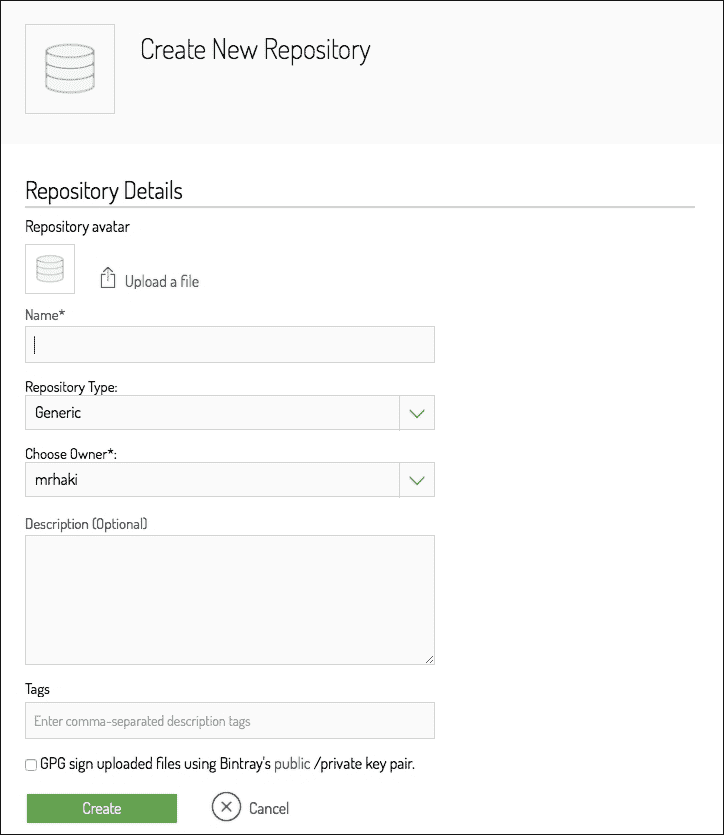
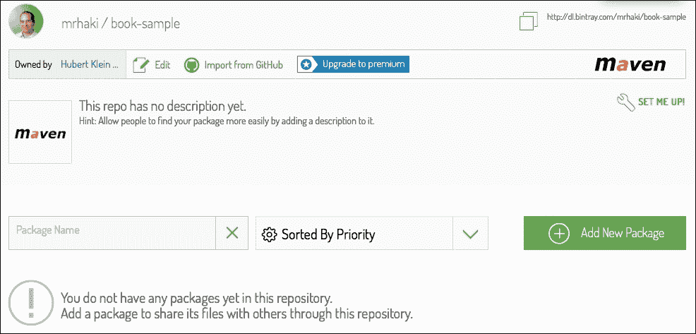
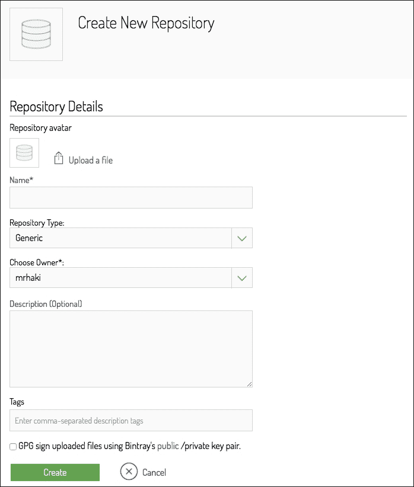
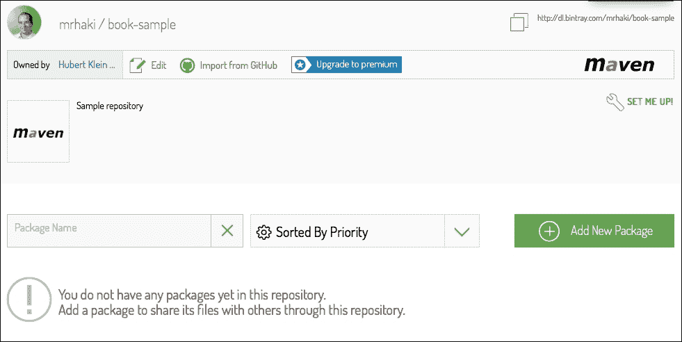
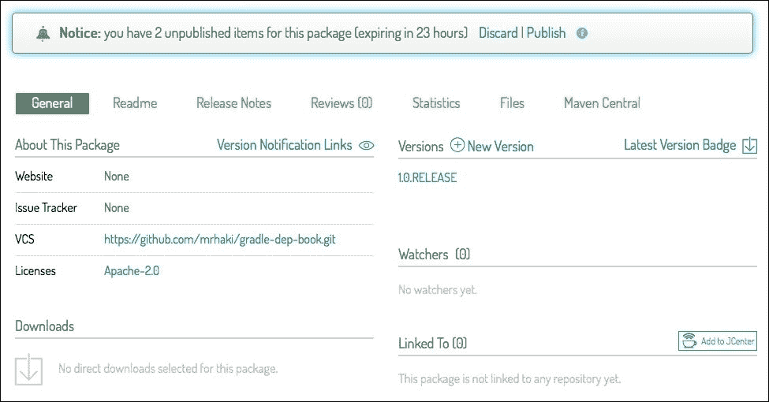
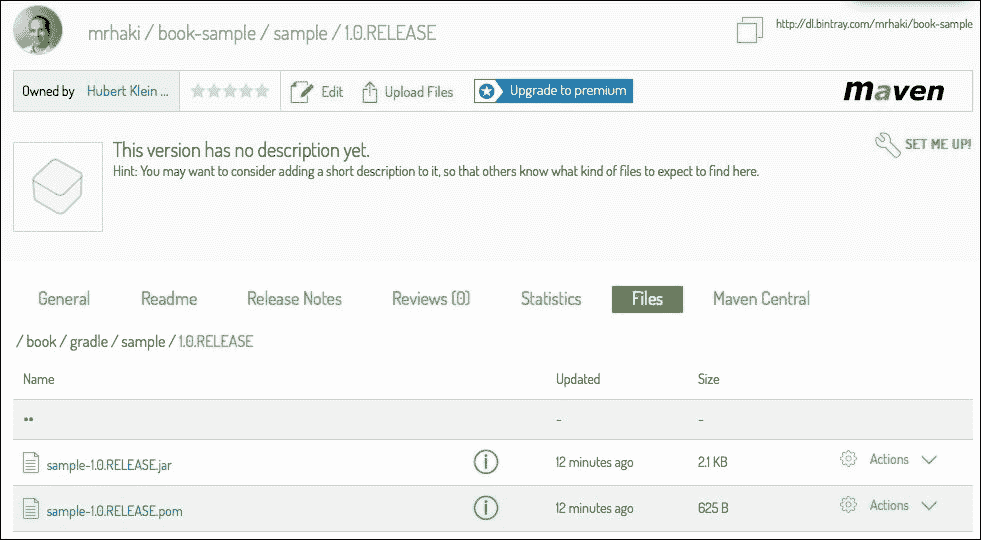

# 第六章：发布到 Bintray

在上一章中，我们学习了如何将我们的工件部署到 Maven 仓库。在这一章中，你将学习我们如何将工件部署到 Bintray 作为 Maven 仓库。我们将了解 Bintray 是什么以及它如何帮助我们发布项目。

我们将了解如何配置 Gradle Bintray 插件来部署我们的工件。

# 什么是 Bintray？

Bintray 将自己宣传为“服务即分发”。这意味着当我们有想要分发的物品时，例如我们的项目工件，我们可以使用 Bintray。Bintray 提供了一个平台来存储我们想要共享的软件，并使其对其他人可下载。围绕这一点，有许多工具可以提供关于包如何分发和使用的见解。Bintray 还提供了一个 REST API，使其与平台协同工作变得容易。运行 Bintray 的公司是 JFrog，该公司因其仓库产品 Artifactory 而非常知名。

Bintray 的一部分称为 JCenter。JCenter 在 Bintray 平台上托管 Java 依赖项。我们已经了解了 JCenter 作为依赖项的仓库主机。然而，我们也可以使用 JCenter 作为我们自己的依赖项的分发仓库。在这一章中，我们将使用 JCenter 来部署我们的工件。

## 定义新的仓库

在我们能够使用 Bintray 的 JCenter 之前，我们必须在[`bintray.com`](https://bintray.com)上创建一个 Bintray 账户。其中一种最简单的方法是使用现有的 GitHub 账户登录。

接下来，我们将创建一个新的仓库，我们将在此存储我们的工件。因此，首先我们登录到 Bintray。从我们的用户页面，我们将选择**新建仓库**选项。在我们的浏览器窗口中，我们可以看到一些需要填写的字段，如下面的屏幕截图所示：



我们需要为我们的仓库提供一个名称和可选的描述。我们选择**Maven**作为仓库类型。Bintray 也可以用于其他类型的依赖项，但对我们来说，Java 代码我们想要使用 Maven。在填写完所有字段后，我们点击**创建**按钮，Bintray 就会创建一个新的空仓库。在下一个屏幕截图中，我们将看到我们新创建的仓库：



# 定义 Bintray 插件

为了将我们的工件部署到 JCenter，我们使用 Bintray Gradle 插件。此插件为我们项目添加了额外的功能，以便发布我们的工件。

让我们继续使用之前项目的示例构建文件。这个构建文件是为一个包含一些代码的 Java 项目准备的。我们将使用发布插件来定义项目的发布或工件。现在，我们将通过使用`buildscript`配置块将 Gradle 插件添加到项目中。在下一个示例构建文件中，我们将应用 Bintray 插件到我们的项目中。以下代码展示了这一点：

```java
// Define Bintray plugin.
buildscript {
  repositories {
    jcenter()
  }

  dependencies {
    classpath 'com.jfrog.bintray.gradle:gradle-bintray-plugin:1.1
  }
}

// Apply plugin to project.
apply plugin: 'com.jfrog.bintray'

apply plugin: 'maven-publish'
apply plugin: 'java'

version = '1.0.RELEASE'
group = 'book.gradle'

repositories {
  jcenter()
}

dependencies {
  compile 'org.springframework:spring-context:4.1.4.RELEASE'
}

publishing {
  publications {
    sample(MavenPublication) {
      from components.java
    }
  }
}
```

由于 Gradle 2.1 的发布，我们使用了一种替代语法来在我们的构建脚本中包含外部插件。新的语法适用于部署到 Gradle 插件门户的插件。这个特性是孵化中的，这意味着它将来可能会改变。另外，一个重要的限制是，新的语法在`subprojects`和`allprojects`配置块中不受支持。在下面的示例构建文件中，使用了添加插件的新语法：

```java
// Define and apply Bintray plugin.
plugins {
  id 'com.jfrog.bintray' version '1.0'
}
```

在我们的项目中添加了新的插件后，我们可以运行`tasks`命令来查看插件添加了哪些任务：

```java
$ gradle tasks
...
Publishing tasks
----------------
bintrayUpload - Publishes artifacts to bintray.com.
...

```

我们注意到插件为我们项目添加了`bintrayUpload`任务。

# 将发布部署到 Bintray

在我们能够运行`bintrayUpload`任务之前，我们必须在我们的 Gradle 构建文件中添加一些配置。Bintray 插件可以通过`bintray`配置块进行配置。在这个配置块内部，我们可以看到部署我们的项目发布到 Bintray 所需的所有属性。

首先，我们需要设置用于部署的 Bintray 账户的用户名和 API 密钥。要获取 API 密钥，我们必须首先在我们的网页浏览器中登录到 Bintray。从我们的账户页面，我们点击**编辑**按钮。接下来，我们将选择**API**菜单选项以获取我们的 API 密钥。然后，我们可以将密钥复制到剪贴板，以便我们可以在构建脚本中使用它。`bintray`配置块中的`user`和`key`属性包含我们不希望分享的信息。最好将这些属性的值从我们的 Gradle 构建文件外部化。我们可以在项目目录中添加一个`gradle.properties`文件，包含属性的值。`gradle.properties`文件也可以添加到我们的 Gradle 用户主目录中，默认情况下是`<user_home>/.gradle`。或者，我们可以使用命令行选项`-P`和`--project-prop`来设置值。

需要`user`和`key`属性。此外，我们必须设置`pkg.repo`属性，使用我们在 Bintray 中的仓库名称，并将`pkg.name`设置为部署的组名。最后，我们需要定义我们需要发布的内容。幸运的是，Bintray 插件支持 Gradle 发布插件，因此我们可以重用我们在构建文件中配置的发布。

在下面的示例构建文件中，我们在`bintray`配置块中配置了 Bintray 插件：

```java
// Define Bintray plugin.
buildscript {
  repositories {
    jcenter()
  }

  dependencies {
    classpath 'com.jfrog.bintray.gradle:gradle-bintray-plugin:1.0'
  }
}

// Apply plugin to project.
apply plugin: 'com.jfrog.bintray'

apply plugin: 'maven-publish'
apply plugin: 'java'

version = '1.0.RELEASE'
group = 'book.gradle'

repositories {
  jcenter()
}

dependencies {
  compile 'org.springframework:spring-context:4.1.4.RELEASE'
}

publishing {
  publications {
    sample(MavenPublication) {
      from components.java
    }
  }
}

bintray {

  // Use externalized project property bintrayUsername.
  user = bintrayUsername

  // Use externalized project property bintrayApiKey.
  key = bintrayApiKey

  // Define publication that needs to be published
  // to Bintray.
  publications = ['sample']

  pkg {
    // Name of repository in Bintray
    repo = 'book-sample'

    // Name for package.
    name = 'sample'
  }

}
```

在我们能够上传我们的工件之前，我们必须首先使用 Bintray 的网页界面通过`sample`包创建一个名为`book-sample`的仓库。我们需要使用我们的账户登录，然后选择**新建仓库**链接。在下面的截图中，我们可以看到需要填写的字段：



在我们创建了一个新的仓库之后，我们可以看到仓库的概览，如下面的截图所示：



从这个屏幕，我们点击**新建软件包**按钮。一个仓库可以包含多个软件包。下一个截图显示了我们需要填写以创建新软件包的字段。我们必须设置**名称**、**许可证**字段和一个**版本控制**链接。


一旦我们在我们的仓库中创建了软件包，我们就可以为我们的项目调用`bintrayUpload`任务。让我们看看调用任务时的输出：

```java
$ gradle bintrayUpload
:generatePomFileForSamplePublication
:compileJava
:processResources UP-TO-DATE
:classes
:jar
:publishSamplePublicationToMavenLocal
:bintrayUpload

BUILD SUCCESSFUL

Total time: 9.125 secs

```

我们注意到`bintrayUpload`任务依赖于在文件上传之前必须首先编译和构建我们的工件的任务。我们不必自己定义这个任务依赖。

一切构建成功，我们现在可以打开我们的网络浏览器并转到仓库和软件包页面。在以下截图中，我们看到我们的更新后的软件包网页：



Bintray 首先将上传的文件放入未发布状态。这样，我们有时间决定我们是否真的想要发布这个版本。我们可以在屏幕上看到消息。我们确信我们想要发布这个版本，所以我们将点击**发布**链接。现在，文件已发布，以便其他人也可以看到文件。如果我们点击发布版本，我们甚至可以在我们的网络浏览器中看到实际的文件。以下截图显示了我们的已发布工件 JAR 文件和相应的 POM 文件：



# 配置 Bintray 插件

我们已经配置了必要的配置属性，以便将我们的项目发布到 Bintray。然而，插件允许更多的配置。我们可以在以下表中看到配置属性：

| 名称 | 描述 |
| --- | --- |
| `user` | 这设置了 Bintray 用户名。 |
| `key` | 这设置了 API 密钥。 |
| `configurations` | 这定义了具有可部署文件的配置列表。 |
| `publications` | 这定义了要部署的出版物列表。 |
| `filesSpec` | 使用`CopySpec`来定义要发布的任意文件，这些文件不是出版物或配置的一部分。 |
| `dryRun` | 这允许您执行所有任务而不部署它们。 |
| `publish` | 在上传后是否应该发布版本，而不是通过网络浏览器发布。 |
| `pkg.repo` | 这是仓库的名称。 |
| `pkg.name` | 这是软件包的名称。 |
| `pkg.userOrg` | 当仓库属于组织时，这是可选的组织名称。 |
| `pkg.desc` | 这是对软件包的描述。 |
| `pkg.websiteUrl` | 这是属于项目的网站 URL。 |
| `pkg.issueTrackerUrl` | 这是用于项目的缺陷跟踪系统的 URL。 |
| `pkg.vcsUrl` | 这是使用的版本控制系统的 URL。 |
| `pkg.licenses` | 这是此项目的有效许可证列表。 |
| `pkg.labels` | 这是描述项目内容的标签列表。 |
| `pkg.publicDownloadNumbers` | 这显示了已发布文件被下载的次数。 |
| `pkg.attributes` | 这是包的定制属性映射。 |
| `pkg.version.name` | 这是自定义的 Bintray 版本。 |
| `pkg.version.desc` | 这是针对此版本的具体描述。 |
| `pkg.version.released` | 这是发布日期。 |
| `pkg.version.vcsTag` | 这是版本控制系统中此版本的标签。 |
| `pkg.version.attributes` | 这些是此版本包的定制属性。 |
| `pkg.version.gpg.sign` | 将此设置为 `true` 以使用 GPG 签名。 |
| `pkg.version.gpg.passphrase` | 这是 GPG 签名的密码。 |
| `pkg.version.mavenCentralSync.sync` | 将此设置为 `true` 以与 Maven Central 同步。 |
| `pkg.version.mavenCentralSync.user` | 这是与 Maven Central 同步的用户令牌。 |
| `pkg.version.mavenCentralSync.password` | 这是与 Maven Central 同步用户的密码。 |
| `pkg.version.mavenCentralSync.close` | 默认情况下，暂存库是关闭的，并且工件被发布到 Maven Central。您可以选择性地关闭此行为（通过将值设置为 `0`）并手动发布版本。 |

在下面的示例构建文件中，我们将使用一些这些配置属性：

```java
// Define Bintray plugin.
buildscript {
  repositories {
    jcenter()
  }

  dependencies {
    classpath 'com.jfrog.bintray.gradle:gradle-bintray-plugin:1.0'
  }
}

// Apply plugin to project.
apply plugin: 'com.jfrog.bintray'

apply plugin: 'maven-publish'
apply plugin: 'java'

version = '1.0.2.RELEASE'
group = 'book.gradle'

repositories {
  jcenter()
}

dependencies {
  compile 'org.springframework:spring-context:4.1.4.RELEASE'
}

publishing {
  publications {
    sample(MavenPublication) {
      from components.java
    }
  }
}

bintray {
  user = bintrayUsername
  key = bintrayApiKey
  publications = ['sample']

  publish = true

  pkg {
    repo = 'book-sample'
    name = 'full-sample'

    desc = 'Sample package for Gradle book.'

    websiteUrl = 'https://github.com/mrhaki/gradle-dep-book/'
    issueTrackerUrl = 'https://github.com/mrhaki/gradle-dep-book/issues'
    vcsUrl = 'https://github.com/mrhaki/gradle-dep-book.git'

    licenses = ['Apache-2.0']

    labels = ['book', 'sample', 'Gradle']

    publicDownloadNumbers = true

    version {
      desc = 'Fixed some issues.'
      released = new Date()
    }

  }

}
```

如果我们定义了 `vcsUrl` 和 `licenses` 配置属性，那么插件将自动在我们的仓库中创建包，这是很好的。因此，我们不必使用网络浏览器来创建新的包。相反，我们可以使用构建脚本中的配置来自动创建包。此外，请注意，包是自动发布的，与第一个例子中的未发布状态不同。

# 摘要

在本章中，你学习了如何使用第三方 Bintray 插件。我们了解了 Bintray 和 JCenter。我们看到了如何在 Bintray 上创建仓库，并使用它将我们的项目作为包部署到该仓库。

你学习了可以为 Bintray 部署设置的不同的配置属性。

在下一章中，我们将看到如何上传到 Ivy 仓库。
