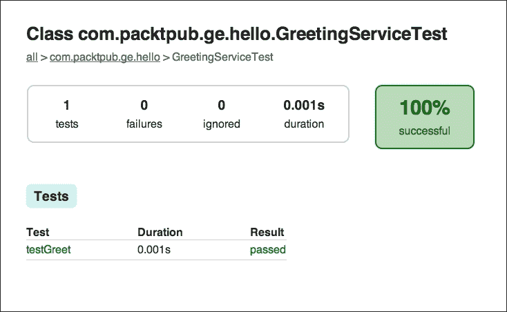

# 第二章。构建 Java 项目

在上一章中，我们看到了一个非常基础的构建脚本，它只是在控制台上打印了传统的`Hello World`。现在我们已经熟悉了 Gradle 命令行界面，这正是我们开始简单 Java 项目的完美时机。

在本章中，我们将看到如何使用 Gradle 构建、测试简单的 Java 项目，如何将外部依赖项添加到类路径中，以及如何构建可分发二进制文件。

我们将尽量使 Java 代码尽可能简洁，以便我们能够更多地关注项目的构建。在这个过程中，我们将学习一些基于 Gradle 的项目应该遵循的最佳实践。如果我们无法完全理解本章中所有构建脚本语法，那也是可以的，因为我们将详细地在第四章*揭秘构建脚本*中看到。

# 构建 Java 项目

为了展示使用 Gradle 构建 Java 项目的示例，让我们创建一个非常简单的 Java 应用程序，它将问候用户。在应用程序逻辑方面，这比简单的`hello world`要稍微复杂一点。

首先，创建一个名为`hello-java`的目录。这是我们项目目录。对于以下步骤，请随意选择您喜欢的 IDE/文本编辑器来编辑文件。

## 创建构建文件

在项目目录的根目录下，让我们创建`build.gradle`文件，并将其中的以下代码行添加到其中：

```java
apply plugin: 'java'
```

是的，这就是目前构建文件中所有需要的内容，只有一行。我们很快就会看到它的含义。

## 添加源文件

默认情况下，就像 Maven 一样，Java 源文件是从项目的`src/main/java`目录中读取的。当然，我们可以配置它，但让我们留到以后再说。让我们在我们的项目中创建这个目录结构。

现在，我们需要创建一个 Java 类来生成问候信息。同时，我们还会创建一个包含`main`方法的`Main`类，以便可以从命令行运行应用程序。Java 文件应该保存在一个源根目录下的适当包结构中。我们将使用`com.packtpub.ge.hello`包作为此示例：

```java
hello-java
├── build.gradle               // build file
└── src
 └── main
 └── java               // source root
 └── com
 └── packtpub
 └── ge
 └── hello
 ├── GreetingService.java
 └── Main.java 

```

正如我们可以从前面的结构中看到的那样，我们在`src/main/java`源根下创建了包结构。

让我们创建`GreetingService.java`文件：

```java
package com.packtpub.ge.hello;

public class GreetingService {
    public String greet(String user) {
        return "Hello " + user;
    }
}
```

这个类仅公开一个名为`greet`的方法，我们可以使用它来生成问候信息。

这就是我们的`Main.java`文件看起来像这样：

```java
package com.packtpub.ge.hello;

public class Main {
    public static void main(String[] args) {
        GreetingService service = new GreetingService();
        System.out.println(service.greet(args[0]));
    }
}
```

这个类有一个`main`方法，当程序运行时将被调用。它实例化`GreetingService`并打印`greet`方法在控制台上的输出。

## 构建项目

在添加 Java 文件后，我们现在想要编译项目并生成类文件。这可以通过从命令行调用以下任务来完成：

```java
$ gradle compileJava

```

编译后的类文件会存放在项目根目录下的`build/classes/main`。你可以通过再次检查项目树来确认。现在我们将忽略其他文件和目录：

```java
hello-java
...
├── build
│   ├── classes
│   │   └── main
│   │       └── com
│   │           └── packtpub
│   │               └── ge
│   │                   └── hello
│   │                       ├── GreetingService.class
│   │                       └── Main.class
...

```

到目前为止，我们可以直接运行这个类，但让我们要求更多，并为我们的应用程序生成`.jar`文件。让我们运行以下任务：

```java
$ gradle build

```

它在`build/libs`目录下为我们的项目生成一个 Jar 文件：

```java
hello-java
...
├── build
│   ...
│   ├── libs
│   │   └── hello-java.jar
...

```

让我们测试 Jar 是否按预期工作。要运行 Jar，请发出以下命令：

```java
$ java -cp build/libs/hello-java.jar \ com.packtpub.ge.hello.Main Reader

```

我们将`Reader`作为参数传递给我们的 java `Main`类的`main`方法。这将产生以下输出：

```java
Hello Reader

```

### 注意

当我们运行`build`任务时，Gradle 也会在执行构建任务之前调用`compileJava`和其他依赖任务。因此，我们在这里不需要显式调用`compileJava`来编译类。

`.jar`文件的名称与项目名称相同。这可以通过在`build.gradle`文件中设置`archivesBaseName`属性来配置。例如，要生成名为`my-app.jar`的 Jar 文件，请将以下代码行添加到构建文件中：

```java
archivesBaseName = "my-app"
```

现在，让我们启动：

```java
$ gradle clean

```

此外，再次检查目录树。不出所料，它已经清理完毕，源文件保持完整。

从我们使用 Ant 的经验来看，即使是这个规模的项目，我们也必须定义至少几个目标，这将需要很多行 XML。虽然 Maven 可以通过约定工作，但 Maven 的`pom.xml`文件在成为有效的`pom.xml`文件之前仍需要一些仪式。因此，一个最小的`pom.xml`文件仍然看起来像五到六行 XML。

与 Gradle 精心选择和默认的简单性相比。

这是一个很好的地方，我们应该看看`java`插件为我们构建引入了哪些所有任务：

```java
$ gradle –q tasks
------------------------------------------------------------
All tasks runnable from root project
------------------------------------------------------------

Build tasks
-----------
assemble - Assembles the outputs of this project.
build - Assembles and tests this project.
buildDependents - Assembles and tests this project and all projects that depend on it.
buildNeeded - Assembles and tests this project and all projects it depends on.
classes - Assembles main classes.
clean - Deletes the build directory.
jar - Assembles a jar archive containing the main classes.
testClasses - Assembles test classes.

Build Setup tasks
-----------------
init - Initializes a new Gradle build. [incubating]
wrapper - Generates Gradle wrapper files. [incubating]

Documentation tasks
-------------------
javadoc - Generates Javadoc API documentation for the main source code.
Help tasks
----------
components - Displays the components produced by root project 'hello-java'. [incubating]
dependencies - Displays all dependencies declared in root project 'hello-java'.
dependencyInsight - Displays the insight into a specific dependency in root project 'hello-java'.
help - Displays a help message.
model - Displays the configuration model of root project 'hello-java'. [incubating]
projects - Displays the sub-projects of root project 'hello-java'.
properties - Displays the properties of root project 'hello-java'.
tasks - Displays the tasks runnable from root project 'hello-java'.

Verification tasks
------------------
check - Runs all checks.
test - Runs the unit tests.
...

```

看到我们的构建中通过仅应用`java`插件就有这么多有用的任务，这很有趣。显然，Gradle 使用了一个非常强大的插件机制，可以利用它来在构建逻辑上应用**不要重复自己**（**DRY**）原则。

## 插件简介

Gradle 本身不过是一个任务运行器。它不知道如何编译 Java 文件或在哪里读取源文件。这意味着这些任务不是默认存在的。正如我们在上一章中看到的，没有应用任何插件的 Gradle 构建文件包含非常少的任务。

插件为 Gradle 构建添加相关的任务和约定。在我们的当前示例中，所有如`compileJava`、`build`、`clean`等任务实际上都是由我们应用于构建的`java`插件引入的。

这意味着 Gradle 不会强迫我们使用特定的方式来编译 Java 项目。完全取决于我们选择为构建使用`java`插件。我们可以根据需要配置它。如果我们仍然不喜欢它的工作方式，我们可以自由地直接在构建中添加自己的任务，或者通过一个自定义插件来实现我们想要的方式。

Gradle 自带了许多插件。`java`插件就是其中之一。在本书的整个过程中，我们将看到许多这样的插件，它们将为我们的构建带来许多有趣的功能。

# 单元测试

单元测试是软件开发不可或缺的方面。测试让我们对我们的代码正常工作充满信心，并在重构时提供安全网。幸运的是，Gradle 的 Java 插件使得单元测试代码变得简单且容易。

我们将为上面创建的相同示例应用程序编写一个简单的测试。我们现在将使用 JUnit（v4.12）库创建我们的第一个单元测试。

### 注意

更多关于 JUnit 的信息可以在[`junit.org`](http://junit.org)找到。

## 添加单元测试源

再次，像 Maven 一样，Java 测试源代码保存在项目根目录相对的`src/test/java`目录中。我们将创建这个目录，并且作为一个好的实践，测试包结构将反映与源包相同的层次结构。

```java
...
src
└── test
 └── java        // test source root
 └── com
 └── packtpub
 └── ge
 └── hello
 └── GreetingServiceTest.java
...

```

我们将为`GreetingService`添加测试。按照惯例，测试的名称将是`GreetingServiceTest.java`。以下是这个文件的代码：

```java
package com.packtpub.ge.hello;

import org.junit.Before;
import org.junit.Test;
import static org.junit.Assert.assertEquals;

public class GreetingServiceTest {

    GreetingService service;

    @Before
    public void setup() {
        service = new GreetingService();
    }

    @Test
    public void testGreet() {
        assertEquals("Hello Test", service.greet("Test"));
    }
}
```

测试设置了一个**系统测试对象**（**SUT**）的实例，即`GreetingService`，`testGreet`方法检查 SUT 的`greet`方法输出与预期消息的相等性。

现在，花点时间尝试使用`compileTestJava`任务编译测试，它与`compileJava`完全相同，但编译测试源文件。它编译得很好吗？如果不是，我们能猜测一下可能出了什么问题吗？

任务应该因为 JUnit（一个外部库）不在类路径上编译文件而失败，并出现大量编译错误。

## 将 JUnit 添加到类路径

要编译和运行这个测试用例，我们需要 JUnit 库在类路径上。重要的是要记住，这个依赖项仅在编译和运行测试时需要。我们的应用程序在编译或运行时不需要 JUnit。我们还需要告诉 Gradle 在哪里搜索这个工件，以便在需要时下载它。为此，我们需要更新`build.gradle`文件，如下所示：

```java
apply plugin: 'java'

repositories {
    mavenCentral()
}

dependencies {
    testCompile 'junit:junit:4.12'
}
```

从我们已知的内容来看，这个构建文件有两个新增内容。

在`dependencies`部分，我们列出了项目的所有依赖项及其作用域。我们声明 JUnit 在`testCompile`作用域内可用。

在`repositories`部分，我们配置了外部依赖项将找到的仓库的类型和位置。在这个例子中，我们告诉 Gradle 从 Maven 中央仓库获取依赖项。由于 Maven 中央是一个非常常用的仓库，Gradle 提供了一个通过`mavenCentral()`方法调用来配置它的快捷方式。

我们将在下一章更深入地介绍这两个部分。

## 运行测试

我们对运行测试以检查一切是否按预期工作感兴趣。让我们运行`test`任务，这将按顺序运行`test`任务依赖的所有任务。我们也可以通过查看列出作为此构建一部分运行的所有任务的输出来验证这一点：

```java
$ gradle test
:compileJava
:processResources UP-TO-DATE
:classes
:compileTestJava
:processTestResources UP-TO-DATE
:testClasses
:test

BUILD SUCCESSFUL

Total time: 1.662 secs

```

看起来测试通过了。为了了解 Gradle 如何告诉我们测试失败，让我们故意将断言中的预期值更改为`Test Hello`，以便断言失败：

```java
@Test
public void testGreet() {
    assertEquals("Test Hello", service.greet("Guest"));
}
```

然后再次运行命令，以查看测试失败的结果：

```java
$ gradle test
:compileJava
:processResources UP-TO-DATE
:classes
:compileTestJava
:processTestResources UP-TO-DATE
:testClasses
:test

com.packtpub.ge.hello.GreetingServiceTest > testGreet FAILEDorg.junit.ComparisonFailure at GreetingServiceTest.java:18
1 test completed, 1 failed
:test FAILED

FAILURE: Build failed with an exception.

......

```

是的，所以测试失败了，输出告诉你关于文件和行号的信息。此外，它还指向包含测试失败更多详细信息的报告文件。

## 查看测试报告

无论测试是否通过，都会创建一个包含所有运行测试详细信息的漂亮的 HTML 报告。默认情况下，此报告位于项目根目录相对于`build/reports/tests/index.html`。您可以在浏览器中打开此文件。

对于上述失败，报告看起来大致如此：


如果我们点击失败的测试，我们可以看到失败的详细信息：


我们可以在堆栈跟踪的第一行看到`org.junit.ComparisonFailure: expected:<[Test Hello]> but was:<[Hello Test]>`。

## 工作流程中的拟合测试

现在我们已经有了测试，只有在测试通过的情况下，才合理地构建我们的项目二进制文件（`.jar`）。为此，我们需要在任务之间定义某种类型的流程，以便如果任务失败，管道将在那里中断，后续的任务将不会执行。因此，在我们的示例中，构建的执行应取决于测试的成功。

猜猜看，这已经由我们的`java`插件为我们处理了。我们只需要调用流程中的最后一个任务，并且如果任何任务失败，构建将不会成功，所有依赖的任务将按顺序调用。

```java
$ gradle build

```

此外，我们不需要明确调用构建所依赖的所有任务，因为它们无论如何都会被调用。

现在让我们修复测试，看看 Jar 文件是否再次被创建：

```java
$gradle build
:compileJava UP-TO-DATE
:processResources UP-TO-DATE
:classes UP-TO-DATE
:jar UP-TO-DATE
:assemble UP-TO-DATE
:compileTestJava
:processTestResources UP-TO-DATE
:testClasses
:test
:check
:build

BUILD SUCCESSFUL

Total time: 1.617 secs

```

哈哈！所以测试通过了，我们再次可以构建我们应用程序的二进制文件。

注意 Gradle 如何智能地确定，如果只有测试被更改，它只编译了测试。在前面的输出中，`compileJava`显示`UP-TO-DATE`，这意味着没有变化，因此 Gradle 没有必要再次编译源文件。

### 小贴士

如果我们需要强制运行任务操作，即使两次运行之间没有任何变化，我们可以在命令行上传递`--rerun-tasks`标志，以便所有任务操作都可以运行。

如果我们再次查看测试报告，它们将看起来如下：



**测试摘要**将看起来大致如此：


# 打包应用程序可分发文件

在第一个例子中，我们直接从命令行使用`java`命令运行我们的应用程序。通常，这样的命令行应用程序会附带脚本以运行应用程序，这样最终用户就不必总是手动编写整个命令。此外，在开发过程中，我们反复需要运行应用程序。如果我们可以在我们的构建文件中编写一个任务，以便在单个 Gradle 调用中运行应用程序，那就更好了。

好消息是，已经存在一个名为`application`的插件，它是与 Gradle 一起提供的，可以为我们完成这两项任务。在这个例子中，我们将`hello-test`项目复制为`hello-app`。让我们对我们的`build.gradle`文件进行以下简单修改：

```java
apply plugin: 'java'
apply plugin: 'application'

mainClassName = "com.packtpub.ge.hello.Main"
run.args = ["Reader"]

repositories {
    mavenCentral()
}

dependencies {
    testCompile 'junit:junit:4.11'
}
```

第二行将`application`插件应用于我们的构建。为了使此插件正常工作，我们需要配置 Gradle 以使用我们的`Main`入口点类，该类具有需要在应用程序运行时运行的静态`main`方法。我们在第`#4`行通过设置由`application`插件添加到构建的`mainClassName`属性来指定这一点。最后，当我们想要使用 Gradle（即在开发过程中）运行应用程序时，我们需要向我们的应用程序提供一些命令行参数。`application`插件将`run`任务添加到我们的构建中。正如我们之前所说的，任务就像任何常规对象一样，是对象，并且具有属性和方法。在第`#5`行，我们将`run`任务的`args`属性设置为包含一个元素`Reader`的列表，因此每次我们执行运行任务时，`Reader`都将作为命令行参数传递给我们的主方法。那些使用 IDE 设置**运行配置**的人可以很容易地理解这一点。文件的其他部分与上一个例子相同。

### 注意

在前面的例子中，由于我们正在应用`application`插件，因此没有必要显式地应用`java`插件，因为`application`插件隐式地将`java`插件应用于我们的构建。

它还隐式地应用了`distribution`插件，因此我们得到了将应用程序打包为 ZIP 或 TAR 存档的任务，同时也得到了安装应用程序分发的本地任务。

更多关于`application`插件的信息可以在[`docs.gradle.org/current/userguide/distribution_plugin.html`](https://docs.gradle.org/current/userguide/distribution_plugin.html)找到。

现在，如果我们检查我们的构建中可用的任务，我们会在`Application tasks`和`Distribution tasks`组下看到一些新增的任务：

```java
$ gradle tasks
...
Application tasks
-----------------
installApp - Installs the project as a JVM application along with libs and OS specific scripts.
run - Runs this project as a JVM application
...

Distribution tasks
------------------
assembleDist - Assembles the main distributions
distTar - Bundles the project as a distribution.
distZip - Bundles the project as a distribution.
installDist - Installs the project as a distribution as-is.
...

```

## 使用 Gradle 运行应用程序

让我们首先看看`run`任务。我们将使用`–q`标志调用此任务以抑制 Gradle 的其他消息：

```java
$ gradle -q run
Hello Reader

```

如预期的那样，我们在控制台上看到了输出。当我们需要更改并可以一键运行我们的应用程序时，这项任务表现得尤为出色：

```java
    public String greet(String user) {
        return "Hola " + user;
    }
```

我们暂时将`GreetingService`更改回返回"`Hola`"而不是"`Hello`"，看看运行任务是否反映了这些更改：

```java
$ gradle -q run
Hola Reader

```

是的，它确实如此。

### 小贴士

有些人可能会想知道如何从命令行本身传递命令行参数来运行任务，而不是从构建文件中，这就像以下这样：

```java
$ gradle –q run Reader

```

然而，这种方式并不奏效。因为 Gradle 可以从命令行接受多个任务名称，所以 Gradle 无法知道`Reader`是传递给运行任务需要传递的参数，还是它本身就是一个任务名称。例如，以下命令调用了两个任务：

```java
$ gradle –q clean build

```

如果你确实需要在每次运行任务时将命令行传递给程序，当然也有一些解决方案。其中一种方法是通过使用`–Pproperty=value`命令行选项，然后在`run`任务中提取属性值，将其作为`args`传递给程序。`–P`将属性添加到 Gradle `Project`中。

要实现这一点，请按照以下方式更新`build.gradle`中的`run.args`：

```java
run.args = [project.runArgs]
```

此外，还可以从命令行通过调用以下方式提供属性值：

```java
$ gradle -q run -PrunArgs=world

```

在前面的示例中，我们在调用`gradle`命令时提供了属性的值。

或者，我们可以在项目根目录中与`build.gradle`文件平行的位置创建一个`gradle.properties`文件。在这种情况下，对于这个例子，它将只包含`runArgs=world`。但它可以声明更多的属性，这些属性将在构建中作为项目对象上的属性可用。

当然，还有其他声明属性的方法，可以在[`docs.gradle.org/current/userguide/build_environment.html`](https://docs.gradle.org/current/userguide/build_environment.html)中找到。

## 构建分发存档

另一个有趣的任务是`distZip`，它将应用程序与特定于操作系统的启动脚本一起打包：

```java
$ gradle distZip
:compileJava
:processResources UP-TO-DATE
:classes
:jar
:startScripts
:distZip

BUILD SUCCESSFUL

Total time: 1.29 secs

```

它会在项目根目录的`build/distributions`中生成 ZIP 格式的应用程序分发。ZIP 的名称默认为项目名称。在这种情况下，它将是`hello-app.zip`。如果需要，可以使用以下属性在`build.gradle`中更改它：

```java
distributions.main.baseName = 'someName'
```

让我们解压缩存档以查看其内容：

```java
hello-app
├── bin
│   ├── hello-app
│   └── hello-app.bat
└── lib
 └── hello-app.jar

```

我们在 ZIP 文件内部看到了一个非常标准的目录结构。它包含一个 shell 脚本和一个 Windows 批处理脚本，用于运行我们的应用程序。它还包含我们的应用程序的 JAR 文件。`lib`目录也包含应用程序的运行时依赖项。我们可以配置`distribution`插件，在我们的分发中添加更多文件，如 Javadoc、README 等。

我们可以运行脚本以验证它是否工作。使用命令提示符，我们可以在 Windows 上执行此命令。为此，使用`cd`命令，并将目录更改为解压缩 ZIP 文件的`bin`目录。

```java
$ hello-app Reader
Hello Reader

```

在 Mac OS X/Linux 上，执行以下命令：

```java
$ ./hello-app Reader
Hello Reader

```

# 生成 IDE 项目文件

IDE 是 Java 开发者工具链和工作流程的一个基本组成部分。然而，手动设置 IDE 以正确识别任何中等规模项目的项目结构和依赖关系并不是一件容易的事情。

检入特定于 IDE 的文件或目录，如`.classpath`、`.project`、`.ipr`、`.iws`、`.nbproject`、`.idea`、`.settings`、`.iml`不是一个好主意。我们知道有些人仍然这样做，因为每次有人从版本控制系统中检出项目时，手动生成 IDE 文件都很困难。然而，检入此类文件会引发问题，因为它们最终会与主构建文件不同步。此外，这迫使整个团队使用相同的 IDE，并在构建有变化时手动更新 IDE 文件。

如果我们只需检入那些使项目能够独立于 IDE 构建所必需的文件，让我们的构建系统生成针对我们最喜欢的 IDE 的特定文件，那会多么美好？我们的愿望实现了。而且，这里还有最好的部分。你需要在 Gradle 构建文件中修改的行数只有一行。Gradle 自带了许多有趣的插件，可以生成特定于 IDE 的项目文件。IntelliJ IDEA 和 Eclipse 都由它们各自的插件支持。根据你想要支持哪个 IDE，你将包含`apply plugin: 'idea'`或`apply plugin: 'eclipse'`。

实际上，包含两者都没有害处。

现在，从命令行分别执行以下操作以使用 Eclipse 和 IntelliJ IDEA：

```java
$ gradle eclipse
$ gradle idea

```

它应该为你生成特定于 IDE 的文件，现在你可以直接在任何 IDE 中打开项目。

### 小贴士

确保你在版本控制中忽略特定于 IDE 的文件。例如，如果你使用 Git，考虑在你的`.gitignore`文件中添加以下条目，以防止意外提交特定于 IDE 的文件：

```java
.idea/
*.iml
*.ipr
*.iws
.classpath
.project
.settings/
```

# 摘要

我们本章开始时构建了一个非常简单的 Java 项目。我们看到了`java`插件的智能约定如何帮助我们使构建文件简洁。然后，我们向该项目添加了单元测试，并从 Maven 中央仓库中包含了 JUnit 库。我们使测试失败，并检查报告以查看解释。然后，我们看到了如何使用`application`插件创建应用程序的发行版。最后，我们看到了`idea`和`eclipse`插件，它们帮助我们为项目生成特定于 IDE 的文件。

总体来说，我们意识到 Gradle 的插件系统是多么强大。Gradle 自带了许多有趣的插件，但我们并不被迫使用它们。我们将在下一章构建一个 Web 应用程序，并学习配置和依赖管理是如何工作的。
