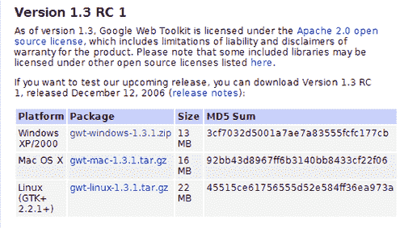
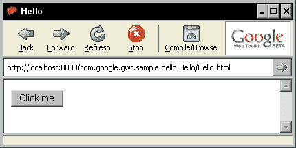
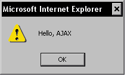
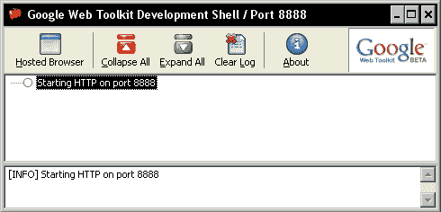
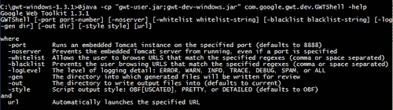
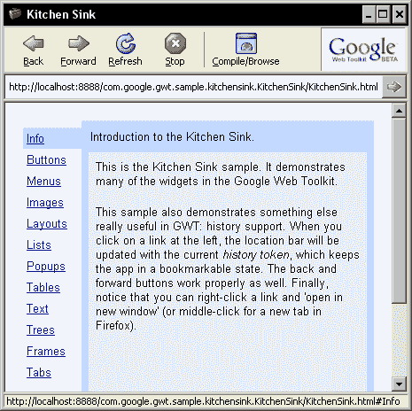
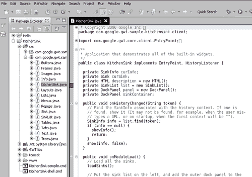

# 第一章：入门

**Google Web Toolkit**（**GWT**）是一种革命性的构建**异步 JavaScript 和 XML**（**AJAX**）应用程序的方式，其响应速度和外观与桌面应用程序相媲美。

在本章中，我们将看到：

+   GWT 简介

+   下载 GWT

+   探索 GWT 示例

+   GWT 许可证

# GWT 简介

**AJAX**应用程序非常适合创建高度交互且提供出色用户体验的 Web 应用程序，同时在功能上与桌面应用程序相媲美，而无需下载或安装任何内容。

AJAX 应用程序将 XML 数据交换与 HTML 和 CSS 相结合，用于为界面设置样式，`XMLHttpRequest`对象用于与服务器应用程序进行异步通信，JavaScript 用于与提供的数据进行动态交互。这使得我们能够构建 Web 2.0 革命的一部分-与桌面应用程序相媲美的应用程序。我们可以使用 AJAX 构建与服务器在后台通信的 Web 页面，而无需重新加载页面。我们甚至可以在不刷新页面的情况下替换显示的网页的不同部分。最后，AJAX 使我们能够将传统的面向桌面的应用程序（如文字处理器、电子表格和绘图程序）通过 Web 提供给用户。

GWT 提供了一个基于 Java 的开发环境，使您能够使用 Java 语言构建 AJAX 应用程序。它封装了`XMLHttpRequest`对象 API，并最小化了跨浏览器问题。因此，您可以快速高效地构建 AJAX 应用程序，而无需过多担心调整代码以在各种浏览器中运行。它允许您利用**标准小部件工具包**（**SWT**）或 Swing 样式编程，通过提供一个使您能够将小部件组合成用户界面的框架来提高生产力并缩短开发时间。这是一种通过利用您对 Java 编程语言的了解和对基于事件的接口开发框架的熟悉来提高生产力并缩短开发时间的好方法。

GWT 提供了一组可立即使用的用户界面小部件，您可以立即利用它们来创建新的应用程序。它还提供了一种通过组合现有小部件来创建创新小部件的简单方法。您可以使用 Eclipse IDE 来创建、调试和单元测试您的 AJAX 应用程序。您可以构建 RPC 服务，以提供可以从您的 Web 应用程序异步访问的某些功能，使用 GWT RPC 框架非常容易。GWT 使您能够轻松地与其他语言编写的服务器集成，因此您可以通过利用 AJAX 框架快速增强您的应用程序，从而提供更好的用户体验。

到本书结束时，您将：

+   了解 GWT 的工作原理

+   快速创建有效的 AJAX 应用程序

+   为您的应用程序创建自定义可重用小部件

+   创建易于从 AJAX 应用程序中使用的后端 RPC 服务

# 基本下载

我们将下载 GWT 及其先决条件，将它们安装到硬盘上，然后运行 GWT 分发的一个示例应用程序，以确保它能正常工作。

## 行动时间-下载 GWT

为了使用 GWT，您需要安装 Java SDK。如果您还没有安装 Java SDK，可以从[`java.sun.com/javase/downloads/`](http://java.sun.com/javase/downloads/)下载最新版本。按照下载提供的说明在您的平台上安装 SDK。

### 注意

Java 1.4.2 是与 GWT 一起使用的最安全的 Java 版本，因为它与该版本完全兼容，您可以确保您的应用程序代码将正确编译。GWT 还适用于 Java 平台的两个较新版本-1.5 和 1.6；但是，您将无法在 GWT 应用程序代码中使用这些版本中引入的任何新功能。

现在，您已经准备好下载 GWT：

1.  GWT 可从 GWT 下载页面（[`code.google.com/webtoolkit/download.html`](http://code.google.com/webtoolkit/download.html)）下载，适用于 Windows XP/2000、Linux 和 Mac OS X 平台。此下载包括 GWT 编译器、托管 Web 浏览器、GWT 类库和几个示例应用程序。

请在下载之前阅读使用条款和条件。最新版本是 1.3 RC 1，发布于 2006 年 12 月 12 日。选择适合您平台的文件。以下是显示 GWT 可用版本的示例窗口：



1.  将下载的 GWT 分发文件解压到硬盘上。它将在 Windows 上创建一个名为`gwt-windows-xxx`的目录，在 Linux 上创建一个名为`gwt-linux-xxx`的目录，其中`xxx`是下载分发的版本号。我们将把包含解压分发的目录称为`GWT_HOME`。`GWT_HOME`目录包含一个包含七个应用程序的`samples`文件夹。

1.  为了确保 GWT 已正确安装，请通过执行平台的启动脚本（Windows 的可执行脚本扩展名为`.cmd`，Linux 的为`.sh`）来运行平台的`Hello`示例应用程序。

为您的平台执行`Hello-shell`脚本。以下是托管 GWT 浏览器中成功运行`Hello`应用程序的屏幕截图：



单击**点击我**按钮，您将会得到一个对话框，如下所示：



### 刚刚发生了什么？

`GWT_HOME`目录包含 GWT 开发所需的所有脚本、文件和库，如下所示：

+   `doc：`该目录包含各种 GWT 类的 API 文档。API 文档以两种格式提供——Google 自定义格式和熟悉的`javadoc`格式。

+   `samples：`包含示例应用程序的目录。

+   `gwt-*.jar：`这些是包含 GWT 类的 Java 库。

+   `index.html：`该文件用作 GWT 的自述文件。它还提供了 GWT 文档的起点，以及指向其他信息来源的指针。

+   `gwt-ll.dll`和`swt-win32-3235.dll：`这些是 Windows 的共享库（仅限 Windows）。

+   `libgwt-11.so, libswt-gtk-3235.so, libswt-mozilla17-profile-gcc3-gtk-3235.so, libswt-mozilla17-profile-gtk-3235.so, libswt-mozilla-gcc3-gtk-3235.so, libswt-mozilla-gtk-3235.so`和`libswt-pi-gtk-3235.so：`这些是 Linux 共享库（仅限 Linux）。

+   `applicationCreator：`这是一个用于创建新应用程序的脚本文件。

+   `junitCreator：`这是一个用于创建新的 JUnit 测试的脚本文件。

+   `projectCreator：`这是一个用于创建新项目的脚本文件。

+   `i18nCreator：`这是一个用于创建国际化脚本的脚本文件。

当您执行`Hello-shell.cmd`时，您启动了 GWT 开发 shell，并将`Hello.html`文件作为其参数提供。开发 shell 然后启动了一个特殊的托管 Web 浏览器，并在其中显示了`Hello.html`文件。托管 Web 浏览器是一个嵌入式 SWT Web 浏览器，它与 Java 虚拟机（JVM）有关联。这使得可以使用 Java 开发环境（如 Eclipse）来调试应用程序的 Java 代码。

这是启动的开发 shell 的屏幕截图：



### 还有更多！

您可以在启动时自定义 GWT 开发 shell 提供的几个选项。从命令提示符中在`GWT_HOME`目录下运行开发 shell，以查看各种可用选项：

```java
@java -cp "gwt-user.jar;gwt-dev-windows.jar" com.google.gwt.dev. GWTShell help 

```

您将看到类似于这样的屏幕：



如果您想尝试不同的设置，比如不同的端口号，您可以修改`Hello-shell.cmd`文件以使用这些选项。

GWT 的 Linux 版本包含了用于托管 Web 浏览器的 32 位 SWT 库绑定。为了在 AMD64 等 64 位平台上运行示例或使用 GWT 托管的浏览器，您需要执行以下操作：

+   使用启用了 32 位二进制兼容性的 32 位 JDK。

+   在启动 GWT shell 之前，将环境变量 `LD_LIBRARY_PATH` 设置为您的 GWT 发行版中的 Mozilla 目录。

# 探索 GWT 示例

Google 提供了一组示例应用程序，演示了 GWT 的几个功能。本任务将解释如何运行这些示例之一——`KitchenSink` 应用程序。

## 行动时间——进入 KitchenSink

GWT 发行版提供了七个示例应用程序——`Hello, DynaTable, I18N, JSON, KitchenSink, SimpleXML` 和 `Mail`，每个应用程序都演示了一组 GWT 功能。在这个任务中，我们将探索 `KitchenSink` 示例应用程序，因为它演示了 GWT 提供的所有用户界面小部件。所以，让我们进入 `KitchenSink`：

1.  通过在 `GWT_HOME/samples/KitchenSink` 目录中执行 `KitchenSink-shell` 脚本来为您的平台运行 `KitchenSink` 应用程序。这是 `KitchenSink` 应用程序：

1.  点击**编译/浏览**按钮。`KitchenSink` 应用程序将自动编译，并且系统浏览器将启动并显示 `KitchenSink` 应用程序。

1.  通过单击左侧导航树中的每个小部件名称来探索应用程序。右侧的框架将显示所选小部件及其变体。我们将在以后的任务中使用大多数这些小部件来构建 AJAX 应用程序。

1.  您可以将 `KitchenSink` 示例作为 Eclipse 项目添加到您的工作区，并浏览最终由 GWT 编译成 HTML 和 JavaScript 的 Java 源代码。我们可以使用 GWT 提供的 `projectCreator` 文件辅助脚本来生成 `KitchenSink` 应用程序的 Eclipse 项目文件。

1.  导航到您的 `GWT_HOME` 目录，并在命令提示符中运行以下命令。

```java
projectCreator.cmd -eclipse -ignore -out samples\KitchenSink 

```

这将创建 Eclipse 平台项目文件，可以导入到您的 Eclipse 工作区中。在下一章中，当我们从头开始创建一个新应用程序时，我们将更多地了解这个脚本。

1.  将 `samples/KitchenSink/.project` 文件导入到您的 Eclipse 工作区中。您可以按照上述步骤为每个示例项目生成其 Eclipse 项目文件，然后将其导入到您的工作区。这是一个显示 `KitchenSink.java` 文件的 Eclipse 工作区：

如果您知道如何使用 Java 编程，您可以使用 GWT 构建 AJAX 应用程序，而不需要了解 `XMLHttpRequest` 对象 API 的复杂性，也不需要了解 `XMLHttpRequest` 对象 API 在各种浏览器中的差异。

### 刚刚发生了什么？

GWT 开发 shell 启动，并在其中运行托管 Web 浏览器，其中运行着 `KitchenSink` 应用程序。该 shell 包含一个嵌入式版本的 Tomcat servlet 容器，监听在端口 8888 上。当您在 Web 模式下运行时，应用程序将从 Java 编译为 HTML 和 JavaScript。编译后的应用程序存储在 `KitchenSink/www` 目录中，并且该目录本身被注册为 Tomcat 的 Web 应用程序。这就是 Tomcat 能够为请求的 Web 浏览器提供应用程序的原因。

只要开发 shell 在运行，您甚至可以使用其他外部 Web 浏览器通过 URL `http://localhost:8888/com.google.gwt.sample.kitchensink.KitchenSink/KitchenSink.html` 连接到 `KitchenSink` 应用程序。

然而，当我们使用外部浏览器连接到开发 shell 时，我们无法使用断点，因此失去了在使用托管浏览器运行应用程序时提供的调试功能。为了从另一台计算机访问应用程序，请确保您使用可解析 DNS 的机器名称或机器的 IP 地址，而不是 localhost。

GWT 由四个主要组件组成，这些组件层叠在一起，为使用工具包编写 AJAX 应用程序提供了框架：

+   **GWT Java-to-JavaScript 编译器：**您可以使用 GWT 编译器将 GWT 应用程序编译为 JavaScript。然后可以将应用程序部署到 Web 容器。这被称为在 Web 模式下运行。当您单击**编译/浏览**按钮时，`KitchenSink`项目的 Java 代码将被 Java-to-JavaScript 编译器编译为纯 HTML 和 JavaScript。生成的构件会自动复制到`KitchenSink/www`文件夹中。

+   **GWT 托管 Web 浏览器：**这使您可以在 Java 虚拟机（JVM）中运行和执行 GWT 应用程序，而无需首先编译为 JavaScript。这被称为在托管模式下运行。GWT 通过嵌入一个特殊的 SWT 浏览器控件来实现这一点，该控件包含对 JVM 的钩子。这个特殊的浏览器在 Windows 上使用 Internet Explorer 控件，在 Linux 上使用 Mozilla 控件。当您运行`KitchenSink`示例时，嵌入的 SWT 浏览器就是您看到显示应用程序的内容。

+   **JRE 仿真库：**这包含了`java.lang`和`java.util`包中大多数常用类的 JavaScript 实现，来自 Java 标准类库。这两个包中的一些常用类得到了支持。JDK 中的其他 Java 包目前不包括在此仿真库中。这些是您可以在 AJAX 应用程序的客户端使用的唯一类。当然，您可以自由地在服务器端实现中使用整个 Java 类库。`KitchenSink`项目中的 Java 代码使用此仿真库编译为 JavaScript。

+   **GWT Web UI 类库：**这提供了一组自定义接口和类，使您能够创建各种小部件，如按钮、文本框、图像和文本。GWT 附带了大多数在 Web 应用程序中常用的小部件。这是提供了`KitchenSink`应用程序中使用的 Java 小部件的类库。

# GWT 许可证

检查 GWT 许可证是否适合您。这些是您需要牢记的主要功能：

+   GWT 是开源的，并在 Apache 开源许可证 2.0 下提供- [`www.apache.org/licenses/`](http://www.apache.org/licenses/)。

+   与 GWT 分发捆绑在一起的第三方库和产品是根据此页面上详细说明的许可证提供的- [`code.google.com/webtoolkit/terms.html#licenses`](http://code.google.com/webtoolkit/terms.html#licenses)。

+   您可以使用 GWT 构建任何类型的应用程序（商业或非商业）。

+   应用程序和应用程序的代码属于应用程序的开发人员，Google 对此没有任何权利。

您可以使用 GWT 构建任何应用程序，并在任何许可下分发该应用程序。您还可以分发由 GWT 生成的 Java、HTML、JavaScript 和任何其他内容，以及用于生成该内容的 GWT 工具，只要您遵循 Apache 许可证的条款。

# 摘要

在本章中，我们了解了 GWT 的基本组件。我们看到了如何下载和安装 GWT，并探索了 GWT 示例应用程序。最后，我们讨论了 GWT 的许可条款。

在下一章中，我们将学习如何从头开始创建一个新的 GWT 应用程序。
