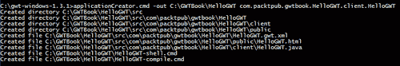
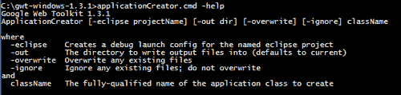
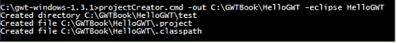
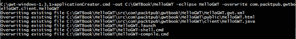
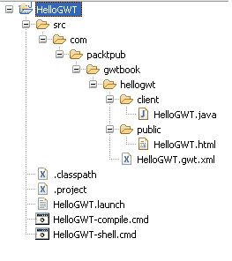
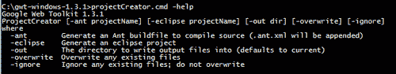
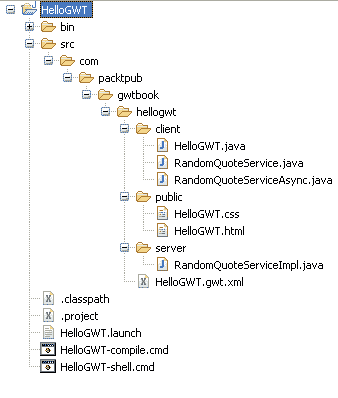
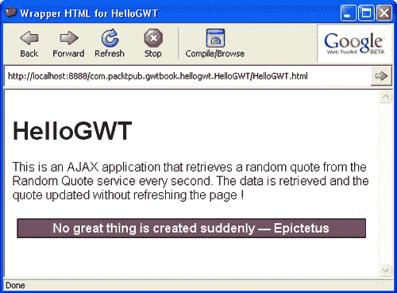
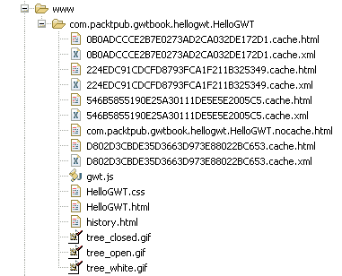

# 第二章：创建一个新的 GWT 应用程序

在本章中，我们将使用 GWT 工具生成一个骨架项目结构和文件，有时还会使用 Eclipse 支持。然后，我们将通过修改生成的应用程序来添加功能，最终在托管模式和 Web 模式下运行应用程序。

我们将要处理的任务是：

+   生成一个新应用程序

+   使用 Eclipse 支持生成一个新应用程序

+   创建一个随机引用 AJAX 应用程序

+   在托管模式下运行应用程序

+   在 Web 模式下运行应用程序

# 生成一个新应用程序

我们将使用 GWT 脚本之一生成一个新的 GWT 应用程序。GWT 提供的这些辅助脚本创建了一个带有基本文件夹结构和初始项目文件的 GWT 项目的骨架，以便我们可以尽快开始创建我们的新应用程序。

## 行动时间-使用 ApplicationCreator

GWT 分发包含一个名为`applicationCreator`的命令行脚本，可用于创建一个带有所有必要脚手架的骨架 GWT 项目。要创建一个新应用程序，请按照以下步骤进行：

1.  创建一个名为`GWTBook`的新目录。我们将把这个目录位置称为`GWT_EXAMPLES_DIR`。这个文件夹将包含在本书中执行各种任务时创建的所有项目。

1.  现在创建一个子目录并将其命名为`HelloGWT`。这个目录将包含我们将在本章中创建的新项目的代码和文件。

1.  在命令提示符中提供以下参数运行`GWT_HOME\applicationCreator`：

```java
applicationCreator.cmd -out <directory location>\GWTBook\HelloGWT com.packtpub.gwtbook.HelloGWT.client.HelloGWT 

```

`-out`参数指定所有工件生成在名为`HelloGWT`的目录中。作为最后一个参数提供的完全限定的类名被用作`applicationCreator`脚本生成的类的名称，并标记为此应用程序的`EntryPoint`类（我们将在下一节中介绍`EntryPoint`类）。

上述步骤将在`GWT_EXAMPLES_DIR\HelloGWT`目录中创建文件夹结构并生成多个文件，如下面的屏幕截图所示：



### 刚刚发生了什么？

`applicationCreator`脚本调用`gwt‑dev‑xxx.jar`中的`ApplicationCreator`类，后者又创建了文件夹结构并生成了应用程序文件。这使得在新项目上开始变得非常容易，因为整个项目的结构都会自动为您创建。您所需要做的就是开始用您的代码填写应用程序，以提供所需的功能。统一的项目创建方式还确保遵守标准的目录结构，这在您处理不同的 GWT 项目时会更加方便。

当我们运行`applicationCreator`命令时，在`GWT_EXAMPLES_DIR\HelloGWT`目录下自动创建的所有文件和文件夹如下：

+   `src`

+   `HelloGWT-compile.cmd`

+   `HelloGWT-shell.cmd`

**src:** 这个文件夹包含了所有为应用程序生成的源代码和配置文件，以熟悉的 Java 包结构进行组织，根包为`com.packtpub.gwtbook.hellogwt`。这个包名是由`applicationCreator`根据我们提供的完全限定的类名推断出来的。在这个目录下生成的文件有：

+   `com\packtpub\gwtbook\hellogwt\HelloGWT.gwt.xml:` 这是项目模块——一个 XML 文件，包含了 GWT 项目所需的全部配置。`inherits`标签指定了该模块继承的模块。在这个简单的例子中，我们只继承了 GWT 内置的`User`模块提供的功能。在更复杂的项目中，模块继承提供了一种很好的重用功能的方式。`EntryPoint`指的是当模块加载时 GWT 框架将实例化的类。这是在创建项目时提供给`applicationCreator`命令的类名。以下代码可以在这个文件中找到：

```java
<module>
<!-- Inherit the core Web Toolkit stuff.-->
<inherits name="com.google.gwt.user.User"/>
<!-- Specify the app entry point class. -->
<entry-point class=
"com.packtpub.gwtbook.hellogwt.client.HelloGWT"/>
</module>

```

+   `com\packtpub\gwtbook\hellogwt\client\HelloGWT.java:` 这是我们应用程序的入口点。它扩展了`EntryPoint`类，当 GWT 框架加载`HelloGWT`模块时，这个类被实例化，并且它的`onModuleLoad()`方法会被自动调用。在这个生成的类中，`onModuleLoad()`方法创建了一个按钮和一个标签，然后将它们添加到页面上。它还为按钮添加了一个点击监听器。我们将在本章后面修改`HellowGWT.java`中的代码来创建一个新的应用程序。这个文件中的当前代码如下：

```java
package com.packtpub.gwtbook.hellogwt.client;
import com.google.gwt.core.client.EntryPoint;
import com.google.gwt.user.client.ui.Button;
import com.google.gwt.user.client.ui.ClickListener;
import com.google.gwt.user.client.ui.Label;
import com.google.gwt.user.client.ui.RootPanel;
import com.google.gwt.user.client.ui.Widget;
/** Entry point classes define <code>onModuleLoad()</code>. */
public class HelloGWT implements EntryPoint
{
/** This is the entry point method. */
public void onModuleLoad()
{
final Button button = new Button("Click me");
final Label label = new Label();
button.addClickListener(new ClickListener()
{
public void onClick(Widget sender)
{
if (label.getText().equals(""))
label.setText("Hello World!");
else
label.setText("");
}
}
//Assume that the host HTML has elements defined whose
//IDs are "slot1", "slot2". In a real app, you probably
//would not want to hard-code IDs. Instead, you could,
//for example, search for all elements with a
//particular CSS class and replace them with widgets.
RootPanel.get("slot1").add(button);
RootPanel.get("slot2").add(label);
}

```

+   `com\packtpub\gwtbook\hellogwt\public\HelloGWT.html:` 这是一个生成的 HTML 页面，加载了`HelloGWT`应用程序，并被称为**主机页面**，因为这是托管`HelloGWT`应用程序的网页。尽管这个 HTML 文件看起来非常简单，但有一些需要注意的地方：

+   首先，它包含一个指向`HelloGWT`模块目录的元标记。这个标记是 HTML 页面和`HelloGWT`应用程序之间的连接。以下代码表示了这个连接：

```java
<meta name='gwt:module'
content='com.packtpub.gwtbook.hellogwt.HelloGWT'>

```

+   其次，`script`标签导入了来自`gwt.js`文件的代码。这个文件包含了引导 GWT 框架所需的代码（如下所示）。它使用`HelloGWT.gwt.xml`文件中的配置，然后动态加载通过编译`HelloGWT.java`文件生成的 JavaScript 来呈现应用程序。当我们生成骨架项目时，`gwt.js`文件并不存在。它是在我们在托管模式下运行应用程序或者编译应用程序时由 GWT 框架生成的。

```java
<script language="JavaScript" src="img/gwt.js"></script>

```

+   `HelloGWT-compile.cmd:` 这个文件包含了一个用于将应用程序编译成 HTML 和 JavaScript 的命令脚本。

+   `HelloGWT-shell.cmd:` 这个文件包含了一个用于在托管模式下运行应用程序的命令脚本。

这些生成的文件之间有着明确定义的关系。`HelloGWT.html`文件是加载`gwt.js`文件的主机页面。

### 还有更多！

`applicationCreator`提供了控制新应用程序的几个参数的选项。您可以通过从以下命令行执行它来查看这些选项：

```java
applicationCreator.cmd -help 

```



`className`是`applicationCreator`的唯一必需参数。所有其他参数都是可选的。以下是运行`applicationCreator`的一些不同方式：

+   不使用 Eclipse 调试支持创建一个新的应用程序：

```java
applicationCreator.cmd -out C:\GWTBook\Test1 com.packtpub.gwtbook.Test1.client.Test1 

```

+   使用 Eclipse 调试支持创建一个新的应用程序：

```java
applicationCreator.cmd -eclipse -out C:\GWTBook\Test1 com.packtpub.gwtbook.Test1.client.Test1 

```

+   使用 Eclipse 调试支持创建一个新的应用程序，覆盖任何先前生成的同名类：

```java
applicationCreator.cmd -eclipse -overwrite -out C:\GWTBook\Test1 com.packtpub.gwtbook.Test1.client.Test1 

```

Google 建议为 GWT 应用程序的源代码使用以下包命名约定。这将根据其功能将项目代码分离。

+   `client:` 这个包含了所有与客户端相关的应用程序代码。这些代码只能使用 GWT 的`JRE Emulation`库提供的`java.util`和`java.lang`包中的 Java 类。

+   `public：`这包含应用程序所需的所有静态 web 资源，如 HTML 文件、样式表和图像文件。此目录包括主机页面，即包含 AJAX 应用程序的 HTML 文件（在上面的情况下为`HelloGWT.html`）。

+   `server：`这包含服务器端代码。这些类可以使用任何 Java 类和任何 Java 库来提供功能。

应用程序的模块，如`HelloGWT.gwt.xml`必须放在根包目录中，作为客户端、公共和服务器包的同级目录。

# 使用 Eclipse 支持生成新应用程序

GWT 默认支持在 Eclipse IDE 中调试 GWT 应用程序。这是一个非常有用和节省时间的功能。在本节中，我们将学习如何使用 Eclipse IDE 支持创建新应用程序。

## 行动时间-修改 HelloGWT

我们在上一个任务中创建的`HelloGWT`应用程序运行良好，我们可以对其进行修改，并且很容易地运行它。但是，我们没有充分利用 GWT 的最大优势之一-增强整个开发体验的 Eclipse IDE 支持。现在，我们将重新创建相同的`HelloGWT`应用程序，这次作为一个 Eclipse 项目。如果我们可以将上一个任务中创建的项目添加 Eclipse 支持就好了。但是，目前 GWT 不支持这样做。要做到这一点，请按照下一页上给出的步骤进行操作：

1.  GWT 提供了一个`projectCreator`脚本，用于创建 Eclipse 项目文件。使用参数运行脚本，您将看到如下所示的屏幕：

```java
projectCreator.cmd -out E:\GWTBook\HelloGWT -eclipse HelloGWT 

```



1.  现在，使用下面给出的参数再次运行`applicationCreator`，以将 HelloGWT 项目创建为 Eclipse 项目：

```java
applicationCreator.cmd -out E:\GWTBook\HelloGWT -eclipse HelloGWT -overwrite com.packtpub.gwtbook.hellogwt.client.HelloGWT 

```

`-overwrite`参数将覆盖`HelloGWT`目录中的文件和文件夹。因此，如果您进行了任何想要保留的更改，请确保将其复制到其他目录。您将看到如下所示的屏幕：



1.  将新创建的`HelloGWT`项目导入 Eclipse。通过 Eclipse 的**文件|导入**菜单导航到**现有项目到工作区**屏幕。选择**HelloGWT**目录作为根目录，并单击**完成**按钮将项目导入到您的 Eclipse 工作区。现在，您可以在 Eclipse IDE 中编辑、调试和运行应用程序！

1.  完成此任务后创建的所有文件夹和文件如下：

### 刚刚发生了什么？

`projectCreator`脚本调用`gwt‑dev‑xxx.jar`中的`ProjectCreator`类，该类又创建 Eclipse 项目文件。然后，`applicationCreator`修改这些文件，添加项目名称和项目的类路径信息。

通过运行`projectCreator`命令创建的特定于 Eclipse 的文件如下：

+   `.classpath：`Eclipse 文件，用于设置项目类路径信息

+   `.project：`Eclipse 项目文件，带有项目名称和构建器信息

+   `HelloGWT.launch：`Eclipse 配置，用于从**运行**和**调试** Eclipse 菜单启动项目

### 还有更多！

以下是从命令行运行`projectCreator`时显示的各种选项的屏幕截图，带有`-help`选项：

```java
projectCreator.cmd -help 

```



# 创建一个随机引用的 AJAX 应用程序

在本节中，我们将创建我们的第一个 AJAX 应用程序，在网页上显示一个随机引用。这个示例应用程序将使我们熟悉 GWT 应用程序中的各种部件和模块，并为本书的其余部分奠定基础。

## 行动时间-修改自动生成的应用程序

我们将通过修改上一个任务中自动生成的应用程序来创建上述应用程序。自动生成的项目结构为我们提供了一个快速入门，并演示了我们可以多快地使用 GWT 框架和工具提高生产力。

随机引用是从服务器上存储的引用列表中选择的。我们的应用程序每秒钟将检索服务器提供的随机引用，并以真正的 AJAX 样式在网页上显示它——无需刷新页面。

1.  在`com.packtpub.gwtbook.hellogwt.client`包中创建一个名为`RandomQuoteService.java`的新的 Java 文件。定义一个`RandomQuoteService`接口，其中包含一个检索引用的方法：

```java
public interface RandomQuoteService extends RemoteService
{
public String getQuote();
}

```

1.  在`com.packtpub.gwtbook.hellogwt.client`包中创建一个名为`RandomQuoteServiceAsync.java`的新的 Java 文件。定义一个`RandomQuoteServiceAsync`接口：

```java
public interface RandomQuoteServiceAsync
{
public void getQuote(AsyncCallback callback);
}

```

1.  在`com.packtpub.gwtbook.hellogwt.server`包中创建一个名为`RandomQuoteServiceImpl.java`的新的 Java 文件。定义一个`RandomQuoteServiceImpl`类，它继承`RemoteService`并实现先前创建的`RandomQuoteService`接口。为这个类添加功能，以便在客户端调用`getQuote()`方法时返回一个随机引用。

```java
public class RandomQuoteServiceImpl extends RemoteServiceServlet implements RandomQuoteService
{
private Random randomizer = new Random();
private static final long serialVersionUID=
-1502084255979334403L;
private static List quotes = new ArrayList();
static
{
quotes.add("No great thing is created suddenly — Epictetus");
quotes.add("Well done is better than well said
— Ben Franklin");
quotes.add("No wind favors he who has no destined port
—Montaigne");
quotes.add("Sometimes even to live is an act of courage
— Seneca");
quotes.add("Know thyself — Socrates");
}
public String getQuote()
return (String) quotes.get(randomizer.nextInt(4));
}

```

这就是我们在服务器上实现功能所要做的全部。现在，我们将修改客户端以访问我们添加到服务器的功能。

1.  修改`HelloGWT.java`以删除现有的标签和按钮，并添加一个用于显示检索到的引用的标签。在`onModuleload()`中添加功能，创建一个定时器，每秒触发一次，并调用`RandomQuoteService`来检索引用，并在上一步中创建的标签中显示它。

```java
public void onModuleLoad()
{
final Label quoteText = new Label();
//create the service
final RandomQuoteServiceAsync quoteService =
(RandomQuoteServiceAsync)GWT.create (RandomQuoteService.class);
//Specify the URL at which our service implementation is //running.
ServiceDefTarget endpoint = (ServiceDefTarget)quoteService; endpoint.setServiceEntryPoint("/");
Timer timer = new Timer()
{
public void run()
{
//create an async callback to handle the result.
AsyncCallback callback = new AsyncCallback()
{
public void onSuccess(Object result)
{
//display the retrieved quote in the label
quoteText.setText((String) result);
}
public void onFailure(Throwable caught)
{
//display the error text if we cant get quote
quoteText.setText("Failed to get a quote.");
}
};
//Make the call.
quoteService.getQuote(callback);
}
};
//Schedule the timer to run once every second
timer.scheduleRepeating(1000);
RootPanel.get().add(quoteText);
}

```

我们现在有客户端应用程序访问服务器来检索引用。

1.  修改`HelloGWT.html`以添加描述我们的 AJAX 应用程序的段落。

```java
<p>
This is an AJAX application that retrieves a random quote from the Random Quote service every second. The data is retrieved and the quote updated without refreshing the page !
application, GWTgenerating, AJAX used</p>

```

1.  通过为标签添加 CSS 使标签看起来更漂亮。在`com.packtpub.gwtbook.hellogwt.public`包中创建一个名为`HelloGWT.css`的新文件，并向其中添加以下样式类声明：

```java
quoteLabel
{
color: white;
display: block;
width: 450px;
padding: 2px 4px;
text-decoration: none;
text-align: center;
font-family: Arial, Helvetica, sans-serif;
font-weight: bold;
border: 1px solid;
border-color: black;
background-color: #704968;
text-decoration: none;
}

```

1.  在`HelloGWT.java`文件中修改标签以使用这种样式：

```java
quoteText.setStyleName("quoteLabel");

```

1.  在`HelloGWT.html`中添加对这个样式表的引用，以便页面可以找到样式表中定义的样式。

```java
<link rel="stylesheet" href="HelloGWT.css">

```

1.  我们要做的最后一件事是在`HelloGWT`模块中注册我们的`RandomQuoteServiceImpl` servlet 类，以便客户端可以找到它。在`HelloGWT.gwt.xml`中添加以下行：

```java
<servlet path="/" class="com.packtpub.gwtbook.hellogwt.server. RandomQuoteServiceImpl"/>

```

这个 servlet 引用将由 GWT 框架在嵌入式 Tomcat servlet 容器中注册，因此当您在托管模式下运行它时，上下文路径`/`被映射，以便所有对它的请求都由`RandomQuoteServiceImpl` servlet 提供。

在完成所有上述修改后，`HelloGWT`项目中的文件夹和文件如下：



我们的第一个 AJAX 应用程序现在已经准备就绪，我们能够完全使用 Java 创建它，而不需要编写任何 HTML 代码！

### 刚刚发生了什么？

我们创建的`RandomQuoteService`接口是我们服务的客户端定义。我们还定义了`RandomQuoteServiceAsync`，它是我们服务的异步版本的客户端定义。它提供了一个回调对象，使服务器和客户端之间可以进行异步通信。`RandomQuoteServiceImpl`是一个实现了这个接口并提供通过 RPC 检索随机引用功能的 servlet。我们将在第三章中详细讨论创建服务。

`HelloGWT.java`创建用户界面——在这种情况下只是一个标签——实例化`RandomQuote`服务，并启动一个计时器，计划每秒触发一次。每次计时器触发时，我们都会异步与`RandomQuoteService`通信以检索引言，并使用引言更新标签。`RootPanel`是 HTML 页面主体的 GWT 包装器。我们将标签附加到它上面，以便显示。

我们通过使用级联样式表修改了标签的外观和感觉，并在`HelloGWT.java`中为标签分配了样式的名称。我们将在第六章中学习如何使用样式表和样式来美化 GWT。

该应用程序中的用户界面非常简单。因此，我们直接将标签添加到`RootPanel`。然而，在几乎任何非平凡的用户界面中，我们都需要更准确地定位小部件并布局它们。我们可以通过利用 GWT UI 框架中的各种布局和面板类轻松实现这一点。我们将在第四章和第五章学习如何使用这些类。

# 在托管模式下运行应用程序

GWT 提供了一种很好的方法来测试应用程序，而无需部署它，而是在托管模式下运行应用程序。在本节中，我们将学习如何在托管模式下运行`HelloGWT`应用程序。

## 执行 HelloGWT-Shell 脚本的操作时间

您可以通过执行`HelloGWT-shell`脚本在托管模式下运行`HelloGWT`应用程序。您可以通过以下三种不同的方式来执行此操作：

+   从 shell 中执行命令脚本：

打开命令提示符并导航到`HelloGWT`目录。运行`HelloGWT-shell.cmd`以在托管模式下启动`HelloGWT`应用程序。

+   从 Eclipse 内部执行命令脚本：

在 Eclipse 的**Package Explorer**或**navigator**视图中双击`HelloGWT-shell.cmd`文件。这将执行该文件并启动托管模式下的`HelloGWT`应用程序。

+   从 Eclipse 中运行`HelloGWT.launcher`：

在 Eclipse 中，通过单击**Run | Run**链接导航到**Run**屏幕。展开**Java Application**节点。选择`HelloGWT`目录。单击**Run**链接以在托管模式下启动`HelloGWT`应用程序。

如果应用程序正常运行，您将看到以下屏幕：



### 刚刚发生了什么？

命令脚本通过提供应用程序类名作为参数来执行 GWT 开发 shell。Eclipse 启动器通过创建一个启动配置来模仿命令脚本，该启动配置从 Eclipse 环境中执行 GWT 开发 shell。启动的 GWT 开发 shell 在嵌入式浏览器窗口中加载指定的应用程序，显示应用程序。在托管模式下，项目中的 Java 代码不会被编译为 JavaScript。应用程序代码作为已编译的字节码在 Java 虚拟机中运行。

# 在 Web 模式下运行应用程序

在上一节中，我们学习了如何在托管模式下运行 GWT 应用程序而无需部署它们。这是测试和调试应用程序的好方法。然而，当您的应用程序在生产环境中运行时，它将部署到诸如 Tomcat 之类的 Servlet 容器中。本任务解释了如何编译`HelloGWT`应用程序，以便随后可以部署到任何 Servlet 容器中。在 GWT 术语中，这称为在 Web 模式下运行。

## 执行编译应用程序的操作时间

为了在 Web 模式下运行`HelloGWT`应用程序，我们需要执行以下操作：

1.  首先通过运行`HelloGWT‑compile`脚本编译`HelloGWT`应用程序。

```java
HelloGWT-compile.cmd 

```

1.  上述步骤将在`HelloGWT`目录中创建一个`www`文件夹。导航到`www/com.packtpub.gwt.HelloGWT.HelloGWT`目录。

1.  在 Web 浏览器中打开`HelloGWT.html`文件。

运行`HelloGWT`客户端应用程序所需的一切都包含在`www`文件夹中。您可以将文件夹的内容部署到任何 Servlet 容器，并提供`HelloGWT`应用程序。完成上述步骤后，以下是文件夹的内容：



### 刚刚发生了什么？

`HelloGWT-compile`脚本调用 GWT 编译器，并将`com.packtpub.gwt.hellogwt.client`包中的所有 Java 源代码编译成 HTML 和 JavaScript，并将其复制到`www\com.packtpub.gwt.hellogwt.HelloGWT`目录中。这个目录名是由 GWT 自动创建的，之前提供给`applicationCreator`的完全限定类名中去掉`client`部分。这个文件夹包含了`HelloGWT`客户端应用程序的一个准备部署的版本。它包括：

+   `HelloGWT.html：`作为`HelloGWT`应用程序的主 HTML 页面的主机页面。

+   `gwt.js：`包含用于加载和初始化 GWT 框架的引导代码的生成的 JavaScript 文件。

+   `History.html：`提供历史管理支持的 HTML 文件。

+   `xxx-cache.html`和`xxx-cache.xml：`每个受支持的浏览器生成一个 HTML 和 XML 文件。这些文件包含通过编译`com.packtpub.gwtbook.hellogwt.client`和`com.packtpub.gwtbook.hellogwt.server`包中的源 Java 文件生成的 JavaScript 代码。例如，在这种情况下，在 Windows 上，编译产生了这些文件：

```java
0B0ADCCCE2B7E0273AD2CA032DE172D1.cache.html
0B0ADCCCE2B7E0273AD2CA032DE172D1.cache.xml
224EDC91CDCFD8793FCA1F211B325349.cache.html
224EDC91CDCFD8793FCA1F211B325349.cache.xml
546B5855190E25A30111DE5E5E2005C5.cache.html
546B5855190E25A30111DE5E5E2005C5.cache.xml
D802D3CBDE35D3663D973E88022BC653.cache.html
D802D3CBDE35D3663D973E88022BC653.cache.xml

```

每组 HTML 和 XML 文件代表一个受支持的浏览器：

```java
0B0ADCCCE2B7E0273AD2CA032DE172D1 - Safari
224EDC91CDCFD8793FCA1F211B325349 Mozilla or Firefox
546B5855190E25A30111DE5E5E2005C5 Internet Explorer
D802D3CBDE35D3663D973E88022BC653 - Opera

```

文件名是通过生成**全局唯一标识符**（**GUIDs**）并将 GUID 作为名称的一部分来创建的。这些文件名在不同的计算机上会有所不同，并且每次在您的计算机上进行干净的重新编译时也会有所不同。还有一个生成的主 HTML 文件（`com.packtpub.gwtbook.hellogwt.HelloGWT.nocache.html`），它从上面的文件中选择正确的 HTML 文件并加载它，具体取决于运行应用程序的浏览器。

`www`文件夹不包含`com.packtpub.gwtbook.hellogwt.server`包中的代码。这个服务器代码需要被编译并部署到一个 Servlet 容器中，以便客户端应用程序可以与随机引用服务进行通信。我们将在第十章中学习如何部署到外部 Servlet 容器。在正常的开发模式下，我们将使用托管模式进行测试，该模式在 GWT 开发外壳中的嵌入式 Tomcat Servlet 容器中运行服务器代码。这使得从同一个 Eclipse 环境中运行和调试服务器代码变得非常容易，就像客户端应用程序代码一样。这是 GWT 的另一个特性，使其成为开发 AJAX 应用程序的极其高效的环境。

在 Web 模式下，我们的客户端 Java 代码已经编译成 JavaScript，不同于托管模式。此外，您会注意到`HelloGWT.gwt.xml`不在这个目录中。此模块的配置细节包含在上面生成的 HTML 和 XML 文件中。

在 Web 模式下，我们的客户端 Java 代码已经编译成 JavaScript，不同于托管模式。此外，您会注意到`HelloGWT.gwt.xml`不在这个目录中。此模块的配置细节包含在上面生成的 HTML 和 XML 文件中。

值得庆幸的是，当我们运行`HelloGWT-compile`脚本时，所有这些工作都会被 GWT 框架自动完成。我们可以专注于我们的 AJAX 应用程序提供的功能，并将与浏览器无关的代码生成和较低级别的 XmlHttpRequest API 留给 GWT。

我们将在第十章中学习如何将 GWT 应用程序部署到 Web 服务器和 Servlet 容器。

### 还有更多！

您还可以在托管模式下从 GWT 开发 shell 中编译`HelloGWT`应用程序。运行`HelloGWT-shell`命令脚本以在托管模式下运行应用程序。单击 GWT 开发 shell 窗口中的**编译/浏览**按钮。这将编译应用程序并在单独的 Web 浏览器窗口中启动应用程序。

所有这些动态的 JavaScript 魔法意味着当您尝试从 Web 浏览器查看应用程序的源代码时，您总是会看到来自主机页面的 HTML。当您试图调试问题时，这可能令人不安。但是 GWT 中的出色 Eclipse 支持意味着您可以通过设置断点并逐行浏览整个应用程序来从图形调试器的舒适环境中调试问题！我们将在第八章中了解更多关于 GWT 应用程序的调试。

# 摘要

在本章中，我们使用提供的辅助脚本如`applicationCreator`生成了一个新的 GWT 应用程序。然后为项目生成了 Eclipse 支持文件。我们还创建了一个新的随机引用 AJAX 应用程序。我们看到如何在托管模式和 Web 模式下运行这个新应用程序。

在下一章中，我们将学习如何创建 GWT 服务，这将使我们能够提供可以通过 GWT 应用程序网页通过 AJAX 访问的异步功能。
