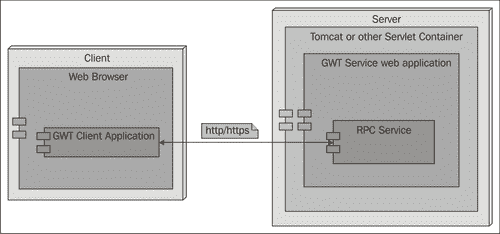
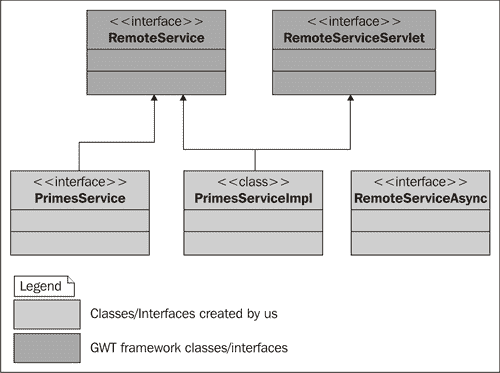
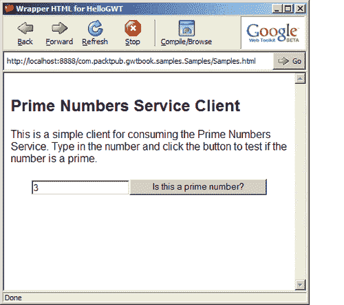
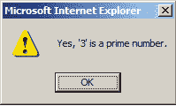

# 第三章：创建服务

在本章中，我们将学习如何创建服务，这是 GWT 术语用于提供服务器端功能的术语。在 GWT 上下文中使用的术语**服务**与 Web 服务没有任何关系。它指的是客户端在服务器端调用的代码，以便访问服务器提供的功能。我们开发的大多数应用程序都需要访问服务器以检索一些数据或信息，然后使用 AJAX 以直观和非侵入性的方式将其显示给用户。在 GWT 应用程序中实现这一点的最佳方式是通过服务。

在本章中，我们将介绍创建服务所需的必要步骤。我们将首先创建创建一个简单的`素数`服务所需的各种工件，该服务验证提供的数字是否为素数。该应用程序很简单，但是其中的概念适用于您将创建的任何 GWT 服务。我们还将创建一个简单的客户端，用于消费`素数`服务。

我们将要解决的任务是：

+   创建服务定义接口

+   创建异步服务定义接口

+   创建服务实现

+   消费服务

前三个任务需要为您创建的每个 GWT 服务完成。

# 创建服务定义接口

服务定义接口充当客户端和服务器之间的合同。这个接口将由我们稍后在本章中构建的实际服务来实现。它定义了服务应提供的功能，并为希望消费此服务提供的功能的客户端制定了基本规则。

## 行动时间-创建素数服务

我们将为我们的素数服务创建定义。我们还将创建一个名为`Samples`的新项目，以包含本章和本书中创建的代码。

1.  使用`projectCreator`和`applicationCreator`创建一个名为`Samples`的新 Eclipse GWT 项目。将应用程序类的名称指定为`com.packtpub.gwtbook.samples.client.Samples`。

1.  将新创建的项目导入 Eclipse IDE。

1.  在`com.packtpub.gwtbook.samples.client`包中创建一个名为`PrimesService.java`的新 Java 文件。定义一个`PrimesService`接口，其中包含一个验证数字是否为素数的方法。它以整数作为参数，并在验证后返回一个布尔值：

```java
public interface PrimesService extends RemoteService
{
public boolean isPrimeNumber(int numberToVerify);
}

```

### 刚刚发生了什么？

`PrimesService`是一个服务定义接口。它指定了支持的方法以及应该传递给它的参数，以便服务返回响应。在 GWT 上下文中，RPC 这个术语指的是一种通过 HTTP 协议在客户端和服务器之间轻松传递 Java 对象的机制。只要我们的方法参数和返回值使用了支持的类型，GWT 框架就会自动为我们执行此操作。目前，GWT 支持以下 Java 类型和对象：

+   原始类型-字符、字节、短整型、整型、长整型、布尔型、浮点型和双精度型

+   原始类型包装类-字符、字节、短整型、整型、长整型、布尔型、浮点型和双精度型

+   字符串

+   日期

+   任何这些`可序列化`类型的数组

+   实现实现`isSerializable`接口的自定义类，其非瞬态字段是上述支持的类型之一

您还可以使用支持的对象类型的集合作为方法参数和返回类型。但是，为了使用它们，您需要通过使用特殊的`Javadoc`注释`@gwt.typeArgs`明确提到它们预期包含的对象类型。例如，这是我们如何定义一个服务方法，它以整数列表作为输入参数，并返回一个字符串列表：

```java
public interface MyRPCService extends RemoteService
{
/*
* @gwt.typeArgs numbers <java.lang.Integer>
* @gwt.typeArgs <java.lang.String>
*/
List myServiceMethod(List numbers);
}

```

第一个注解表示这个方法只接受一个整数对象列表作为参数，第二个注解表示这个方法的返回参数是一个字符串对象列表。

# 创建一个异步服务定义接口

在上一个任务中创建的接口是同步的。为了利用 GWT 中的 AJAX 支持，我们需要创建这个接口的异步版本，用于在后台向服务器进行远程调用。

## 行动时间-利用 AJAX 支持

在本节中，我们将创建服务定义接口的异步版本。

在`com.packtpub.gwtbook.samples.client`包中创建一个名为`PrimesServiceAsync.java`的新的 Java 文件。定义一个`PrimesServiceAsync`接口：

```java
public interface PrimesServiceAsync
{
public void isPrimeNumber(inr numberToVerify, AsyncCallbackcallback);
}

```

### 刚刚发生了什么？

我们的服务定义接口的异步版本必须具有与同步接口相同的方法，除了所有方法都必须将`AsyncCallback`对象作为参数，并且方法可能不返回任何内容。回调对象充当客户端和服务器之间的绑定。一旦客户端发起异步调用，当服务器端完成处理时，通过此回调对象进行通知。基本上，这就是 AJAX 的魔法发生的地方！你不必为所有这些魔法做任何特殊的事情，只需确保为服务定义提供这个异步接口即可。GWT 框架将自动处理客户端和服务器之间的所有通信。使用此服务的客户端应用程序将通过此方法调用服务，传递一个回调对象，并将自动通过回调到客户端应用程序中的`onSuccess()`方法或`onFailure()`方法来通知成功或失败。当前版本的 GWT 只支持异步回调到服务器。即使服务定义接口是同步的，也不能使用它来对服务器进行同步调用。因此，目前只能通过 AJAX 异步访问使用 GWT 构建的任何服务。

# 创建服务实现

到目前为止，我们已经创建了定义质数服务功能的接口。在本节中，我们将开始实现和填充服务类，并创建质数服务的实际实现。

## 行动时间-实现我们的服务

我们将创建质数服务的实现。它通过确保提供的数字只能被 1 和它自己整除来检查提供的数字是否是质数。验证结果以布尔值返回。

在`com.packtpub.gwtbook.samples.server`包中创建一个名为`PrimesServiceImpl.java`的新的 Java 文件。定义一个`PrimesServiceImpl`类，它扩展`RemoteServiceServlet`并实现先前创建的`PrimesService`接口。为这个类添加功能，以验证提供的数字是否是质数。

```java
public class PrimesServiceImpl extends RemoteServiceServlet
implements PrimesService
{
private static final long serialVersionUID = -8620968747002510678L;
public boolean isPrimeNumber(int numberToVerify)
{
boolean isPrime = true;
int limit = (int) Math.sqrt ( numberToVerify );
for ( int i = 2; i <= limit; i++ )
{
if(numberToVerify % i == 0 )
{
isPrime = false;
break;
}
}
return isPrime;
}
}

```

### 刚刚发生了什么？

由于这是素数服务的实现，这个类需要实现服务定义接口，并为实现的方法添加功能。这个任务和之前的任务勾画出了创建 GWT 服务时总是需要的步骤。创建和使用 RPC 服务是解锁 GWT 强大功能并有效使用它的关键步骤。GWT 应用的基本架构包括在 Web 浏览器中呈现的客户端用户界面，并与作为 RPC 服务实现的服务器端功能进行交互，以异步地检索数据和信息而不刷新页面。在 GWT 应用中，服务包装了应用的服务器端模型，因此通常映射到 MVC 架构中的模型角色。



让我们来看看我们为一个服务创建的各种类和接口之间的关系。每次我们创建一个 RPC 服务，我们都会利用一些 GWT 框架类，并创建一些新的类和接口。完成上述任务后创建的类和接口如下：

+   `PrimesService：` 我们的服务定义接口。它定义了我们服务中的方法，并扩展了`RemoteService`标记接口，表示这是一个 GWT RPC 服务。这是同步定义，服务器端实现必须实现这个接口。

+   `PrimesServiceAsync：` 我们接口的异步定义。它必须具有与同步接口相同的方法，除了所有方法都必须以`AsyncCallback`对象作为参数，并且方法可能不返回任何内容。建议为这个接口使用的命名约定是在我们的同步接口名称后缀加上`Async`这个词。

+   `PrimesServiceImpl：` 这是我们服务的服务器端实现。它必须扩展`RemoteServiceServlet`并实现我们的同步接口——`PrimesService`。

我们使用的 GWT 框架类来创建`PrimesService：`

+   `RemoteService：` 所有 RPC 服务都应该实现的标记接口。

+   `RemoteServiceServlet：` `PrimesServiceImpl`服务实现类扩展了这个类并添加了所需的功能。这个类支持序列化和反序列化请求，并确保请求调用`PrimesServiceImpl`类中的正确方法。

这里有一个图表，描述了在创建素数服务时涉及的各种类和接口之间的关系。



我们的服务实现扩展了`RemoteServiceServlet`，它继承自`HttpServlet`类。`RemoteServiceServlet`负责自动反序列化传入的请求和序列化传出的响应。GWT 可能选择使用基于 servlet 的方法，因为它简单，并且在 Java 社区中被广泛认可和使用。它还使得我们的服务实现在任何 servlet 容器之间移动变得容易，并为 GWT 与其他框架之间的各种集成可能性打开了大门。GWT 社区的几位成员已经使用它来实现 GWT 与其他框架（如 Struts 和 Spring）之间的集成。GWT 使用的 RPC wire 格式基本上是基于 JavaScript 对象表示法（JSON）的。这个协议是 GWT 专有的，目前没有文档记录。然而，`RemoteServiceServlet`提供了两个方法——`onAfterResponseSerialized()`和`onBeforeRequestDeserialized()`，你可以重写这些方法来检查和打印序列化的请求和响应。

创建任何 GWT 服务的基本模式和架构总是相同的，包括以下基本步骤：

1.  创建服务定义接口。

1.  创建服务定义接口的异步版本。

1.  创建服务实现类。在服务实现类中，我们访问外部服务提供的功能，并将结果转换为符合我们要求的结果。

在下一节中，我们将创建一个简单的客户端来消费这个新服务。我们将学习如何将此服务部署到外部 servlet 容器，如 Tomcat，在第十章。这个例子中的概念适用于我们创建的每个 GWT 服务。我们将至少为我们创建的每个服务创建这两个接口和一个实现类。这将帮助我们提供可以通过 GWT 客户端以异步方式访问的服务器功能。我们上面创建的服务独立于 GWT 客户端应用程序，并且可以被多个应用程序使用。我们只需要确保在 servlet 容器中正确注册服务，以便我们的客户端应用程序可以访问它。

# 消费服务

我们已经完成了 Prime Number 服务的实现。现在我们将创建一个简单的客户端，可以消费`PrimesService`。这将帮助我们测试服务的功能，以确保它能够完成它应该完成的任务。

## 行动时间-创建客户端

我们将创建一个简单的客户端，连接到 Prime Number 服务，并检查给定的数字是否是质数。我们将添加一个文本框用于输入要检查的数字，以及一个按钮，当点击时将调用服务。它将在警报对话框中显示调用的结果。

1.  在`com.packtpub.gwtbook.samples.client`包中创建一个名为`PrimesClient.java`的新文件，该文件扩展了`EntryPoint`类。

```java
public class PrimesClient implements EntryPoint
{
}

```

1.  在这个新类中添加一个`onModuleLoad()`方法，并创建一个文本框。

```java
public void onModuleLoad()
{
final TextBox primeNumber = new TextBox();
}

```

1.  在`onModuleLoad()`方法中实例化`PrimesService`并将其存储在变量中。

```java
final PrimesServiceAsync primesService =
(PrimesServiceAsync) GWT
GWT.create(PrimesService.class);
ServiceDefTarget endpoint = (ServiceDefTarget) primesService;
endpoint.setServiceEntryPoint(GWT.getModuleBaseURL()+"primes");

```

1.  创建一个新按钮，并添加一个事件处理程序来监听按钮的点击。在处理程序中，使用文本框中输入的文本作为服务的输入参数来调用`PrimesService`。在警报对话框中显示结果。

```java
final Button checkPrime=new Button("Is this a prime number?",
new ClickListener())
{
public void onClick(Widget sender)
{
AsyncCallback callback = new AsyncCallback()
{
public void onSuccess(Object result)
{
if(((Boolean) result).booleanValue())
{
Window.alert("Yes, "+ primeNumber.getText()
+ "' is a prime number.");
}
else
{
Window.alert("No, "+ primeNumber.getText()
+ "' is not a prime number.");
}
}
public void onFailure(Throwable caught)
{
Window.alert("Error while calling the Primes
Service.");
}
};
primesService.isPrimeNumber(Integer
parseInt(primeNumber.getText()), callback);
}
});

```

1.  在应用程序的`module.xml`文件中添加以下条目，以便客户端找到此服务。

```java
<servlet path="/primes" class=
"com.packtpub.gwtbook.samples.server.PrimesServiceImpl"/>

```

这是客户端。输入一个数字，然后点击按钮检查这个数字是否是质数。



响应如下显示在警报对话框中：



### 刚刚发生了什么？

`Prime Number`服务客户端通过向`PrimesService`传递所需的参数来调用服务。我们在`module.xml`文件中为服务做了一个条目，以便 GWT 框架可以正确初始化并且客户端可以找到服务。我们遵循了创建简单客户端消费 GWT 服务的常见模式：

1.  创建一个实现`EntryPoint`类的类。

1.  重写`onModuleLoad()`方法以添加所需的用户界面小部件。

1.  向用户界面小部件之一添加事件处理程序，以在触发处理程序时调用服务。

1.  在事件处理程序中，处理对服务方法调用的成功和失败的`callbacks`，并对调用结果采取一些操作。

1.  在 GWT 应用程序`module.xml`中添加一个条目以便消费服务。

我们将在本书中创建示例应用程序时使用这种常见模式以及一些变化。

# 总结

在本章中，我们看了一下创建新的 Prime Number GWT 服务所需的各种类和接口。我们还创建了一个可以使用质数服务的客户端。

在下一章中，我们将使用 GWT 创建交互式网络用户界面。
