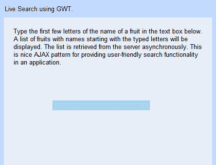
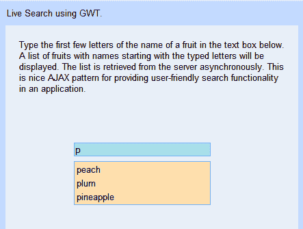
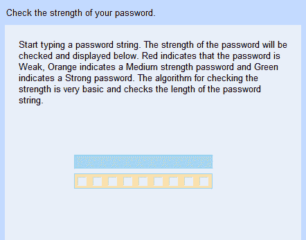
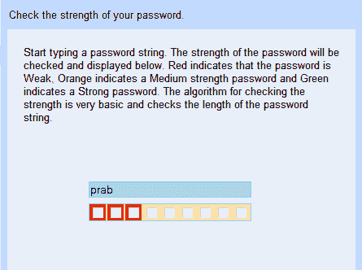
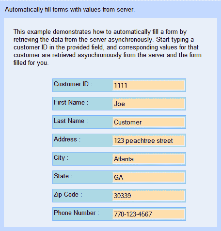
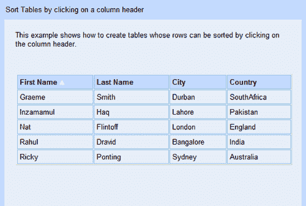
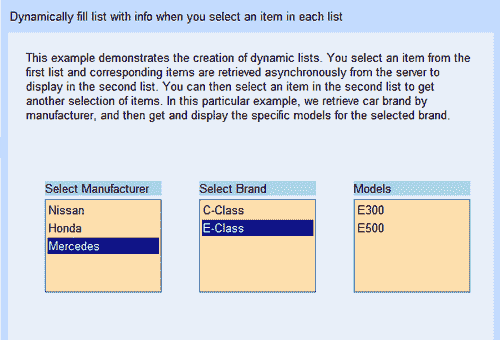
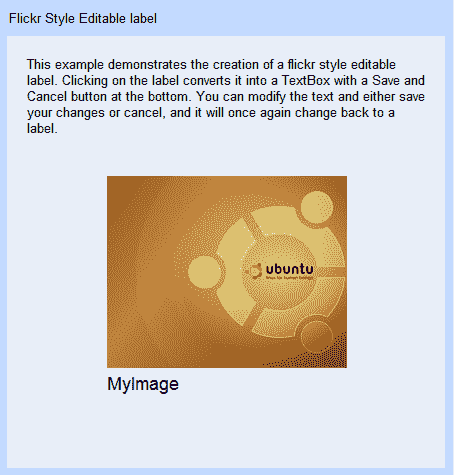
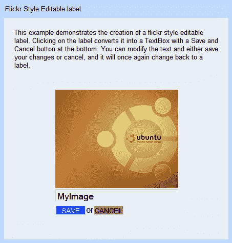

# 第四章：交互式表单

在本章中，我们将学习创建交互式表单的不同方式，这些方式利用 GWT 和 AJAX 在使用基于 Web 的用户界面时提供更加流畅的用户体验。本章以及接下来的两章将为我们探索 GWT 提供基础。

我们将要解决的任务包括：

1.  实时搜索

1.  密码强度检查器

1.  自动填充表单

1.  可排序的表格

1.  动态列表

1.  类似 Flickr 的可编辑标签

# 示例应用程序

我们将把本书中创建的所有示例应用程序都整合到上一章中创建的 Samples GWT 应用程序中。我们将以与我们在第一章中探讨的`KitchenSink`应用程序类似的方式进行。为了做到这一点，我们将按照以下步骤进行：

+   应用程序的用户界面将在一个类中创建，该类扩展了`com.packtpub.gwtbook.samples.client`包中的`SamplePanel`类。

+   然后，该类将被初始化并添加到`com.packtpub.gwtbook.samples.client`包中的`Samples`类的应用程序列表中。由于`Samples`类被设置为入口点类，当 GWT 启动时，它将加载这个类并显示所有示例应用程序，就像`KitchenSink`一样。

所有示例的源代码都可以从本书的下载站点获取。请参阅附录以获取有关下载和运行示例的说明。

# 实时搜索

“实时搜索”是一种用户界面，它会根据用户输入的搜索条件实时提供与之匹配的选择。这是一种非常流行的 AJAX 模式，用于在用户细化搜索查询时持续显示所有有效结果。由于用户的查询不断与显示的结果同步，为用户创造了非常流畅的搜索体验。它还使用户能够以高度互动的方式快速轻松地尝试不同的搜索查询。搜索结果是异步从服务器检索的，无需任何页面刷新或重新提交搜索条件。Google 搜索页面（[`google.com/`](http://google.com/)）就是一个很好的例子。它甚至在您输入时告诉您与您的查询匹配的搜索结果数量！

“实时搜索”AJAX 模式提供的即时反馈也可以用于预先从服务器获取结果并用于预测用户的操作。这种即时响应可以使应用程序的用户体验更加流畅，并显著提高应用程序的延迟。Google 地图（[`maps.google.com/`](http://maps.google.com/)）是使用这种模式预先获取地图数据的很好的例子。

## 行动时间-搜索即时输入！

在这个“实时搜索”示例中，我们将创建一个应用程序，该应用程序检索以您在搜索文本中输入的字母开头的水果名称列表。您可以通过减少或增加输入的字母数量来细化查询条件，用户界面将实时显示匹配的结果集。

1.  在`com.packtpub.gwtbook.samples.client`包中创建一个名为`LiveSearchService.java`的新的 Java 文件。定义一个`LiveSearchService`接口，其中包含一个方法，用于检索与提供的字符串匹配的搜索结果。

```java
public interface LiveSearchService extends RemoteService
{
public List getCompletionItems(String itemToMatch);
}

```

1.  在`com.packtpub.gwtbook.samples.client`包中的一个新的 Java 文件中创建此服务定义接口的异步版本，命名为`LiveSearchServiceAsync.java`：

```java
public interface LiveSearchServiceAsync
{
public void getCompletionItems
(String itemToMatch, AsyncCallback callback);
}

```

1.  在`com.packtpub.gwtbook.samples.server`包中创建一个名为`LiveSearchServiceImpl.java`的新的 Java 文件，实现我们的实时搜索服务。我们将创建一个字符串数组，其中包含水果列表，当调用服务方法时，我们将返回该数组中以参数提供的字符串开头的水果的子列表。

```java
public class LiveSearchServiceImpl extends RemoteServiceServlet
implements LiveSearchService
{
private String[] items = new String[]
{"apple", "peach", "orange", "banana", "plum", "avocado",
"strawberry", "pear", "watermelon", "pineapple", "grape",
"blueberry", "cantaloupe"
};
public List getCompletionItems(String itemToMatch)
{
ArrayList completionList = new ArrayList();
for (int i = 0; i < items.length; i++)
{
if (items[i].startsWith(itemToMatch.toLowerCase()))
{
completionList.add(items[i]);
}
}
return completionList;
}
}

```

1.  我们的服务器端实现已经完成。现在我们将创建用户界面，与实时搜索服务进行交互。在`com.packtpub.gwtbook.samples.client.panels`包中创建一个名为`LiveSearchPanel.java`的新的 Java 文件，该文件扩展了`com.packtpub.gwtbook.samples.client.panels.SamplePanel`类。正如本章开头所提到的，本书中创建的每个用户界面都将被添加到一个示例应用程序中，该应用程序类似于 GWT 下载中作为示例项目之一的`KitchenSink`应用程序。这就是为什么我们将每个用户界面创建为扩展`SamplePanel`类的面板，并将创建的面板添加到示例应用程序中的示例面板列表中。添加一个文本框用于输入搜索字符串，以及一个`FlexTable`，用于显示从服务中检索到的匹配项。最后，创建一个我们将要调用的`LiveSearchService`的实例。

```java
public FlexTable liveResultsPanel = new FlexTable();
public TextBox searchText = new TextBox();
final LiveSearchServiceAsync
liveSearchService=(LiveSearchServiceAsync)
GWT.create(LiveSearchService.class);

```

1.  在`LiveSearchPanel`的构造函数中，创建服务目标并设置其入口点。还创建一个新的`VerticalPanel`，我们将使用它作为添加到用户界面的小部件的容器。设置搜索文本框的 CSS 样式。此样式在`Samples.css`文件中定义，并且是本书的源代码分发包的一部分。有关如何下载源代码包的详细信息，请参见附录。

```java
ServiceDefTarget endpoint=(ServiceDefTarget) liveSearchService;
endpoint.setServiceEntryPoint("/Samples/livesearch");
VerticalPanel workPanel = new VerticalPanel();
searchText.setStyleName("liveSearch-TextBox");

```

1.  在同一个构造函数中，为文本框添加一个监听器，该监听器将在用户在文本框中输入时异步调用`LiveSearchService`，并持续更新弹出面板，显示与文本框中当前字符串匹配的最新结果。这是通过调用服务获取完成项列表的方法。

```java
searchText.addKeyboardListener(new KeyboardListener()
{
public void onKeyPress
(Widget sender, char keyCode, int modifiers)
{
// not implemented
}
public void onKeyDown
(Widget sender, char keyCode, int modifiers)
{
for (int i = 0; i < liveResultsPanel.getRowCount(); i++)
{
liveResultsPanel.removeRow(i);
}
}
public void onKeyUp
(Widget sender, char keyCode, int modifiers)
{
for (int i = 0; i < liveResultsPanel.getRowCount(); i++)
{
liveResultsPanel.removeRow(i);
}
if (searchText.getText().length() > 0)
{
AsyncCallback callback = new AsyncCallback()
{
public void onSuccess(Object result)
{
ArrayList resultItems = (ArrayList) result;
int row = 0;
for(Iterator iter=resultItems.iterator();
iter.hasNext();)
{
liveResultsPanel.setText
(row++, 0, (String) iter.next());
}
}
public void onFailure(Throwable caught)
{
Window.alert("Live search failed because "
+ caught.getMessage());
}
};
liveSearchService.getCompletionItems
(searchText.getText(),callback);
}
}
});

```

1.  最后，在构造函数中，将搜索文本框和搜索结果面板添加到工作面板。创建一个小的信息面板，显示关于此应用程序的描述性文本，以便在我们的`Samples`应用程序中选择此示例时显示此文本。将信息面板和工作面板添加到一个停靠面板，并初始化小部件。

```java
liveResultsPanel.setStyleName("liveSearch-Results");
HorizontalPanel infoPanel = new HorizontalPanel();
infoPanel.add(new HTML
("<div class='infoProse'>Type the first few letters
of the name of a fruit in the text box below. A
list of fruits with names starting with the typed
letters will be displayed. The list is retrieved
from the server asynchronously. This is nice AJAX
pattern for providing user-friendly search
functionality in an application.</div>"));
workPanel.add(searchText);
workPanel.add(liveResultsPanel);
DockPanel workPane = new DockPanel();
workPane.add(infoPanel, DockPanel.NORTH);
workPane.add(workPanel, DockPanel.CENTER);
workPane.setCellHeight(workPanel, "100%");
workPane.setCellWidth(workPanel, "100%");
initWidget(workPane);

```

1.  将服务添加到`Samples`应用程序的模块文件`Samples.gwt.xml`中，该文件位于`com.packtpub.gwtbook.samples`包中。通过将此路径添加到模块文件中，让我们可以使用此路径创建并设置此服务的端点信息。

```java
<servlet path="/livesearch" class=
"com.packtpub.gwtbook.samples.server.LiveSearchServiceImpl"/>

```

这是应用程序的用户界面：



一旦开始输入水果名称的前几个字母，以该字符串开头的水果名称将被检索并显示在文本框下方的面板中。



### 刚刚发生了什么？

应用程序的用户界面在浏览器中加载时显示一个文本框。当您在框中输入一个字母时，文本框上将触发`onKeyUp()`事件，并在此事件处理程序中，我们异步调用`LiveSearchService`中的`getCompletionItems()`，并传入当前在文本框中的文本。我们服务中此方法的实现返回一个包含所有匹配名称的列表。在这个例子中，匹配的名称是从服务本身包含的映射中检索出来的，但根据您的应用程序需求，它也可以很容易地从数据库、另一个应用程序或 Web 服务中检索出来。我们将列表中存在的项目添加到`FlexTable`部件中，该部件就在文本框的下方。`FlexTable`允许我们创建可以动态扩展的表格。如果文本框为空，或者我们删除了框中的所有文本，那么我们就清空表中的列表。我们使用一个面板作为此应用程序中所有部件的容器。

面板是 GWT 框架中部件的容器，用于对它们进行布局。您可以将任何部件甚至其他面板添加到面板中。这使我们能够通过将它们添加到面板中来组合部件，从而构建复杂的用户界面。GWT 框架中常用的面板有：

+   停靠面板：一个通过将其停靠或定位在边缘上的子部件进行布局，并允许最后添加的部件占据剩余空间的面板。

+   单元格面板：一个将其部件布局在表格的单元格中的面板。

+   选项卡面板：一个在选项卡页集中布局子部件的面板，每个选项卡页都有一个部件。

+   水平面板：一个将其所有子部件按从左到右的单个水平列布局的面板。

+   垂直面板：一个将其所有子部件按从上到下的单个垂直列布局的面板。

+   流动面板：一个将其部件从左到右布局的面板，就像文本在一行上流动一样。

+   弹出面板：一个通过弹出或覆盖在页面上的其他部件上显示其子部件的面板。

+   堆叠面板：一个通过垂直堆叠其子部件来布局其子部件的面板。所使用的隐喻与 Microsoft Outlook 的用户界面相同。

在本章和本书的其余部分，我们将使用大多数这些面板来布局我们的用户界面。这个任务的概念可以扩展并应用于几乎任何类型的搜索，您可以为您的应用程序提供。您甚至可以增强和扩展此应用程序，以向用户提供更多的信息，例如匹配结果的数量。GWT 提供的管道和工具使得提供此功能变得非常容易。实时搜索 AJAX 模式及其使用的最佳示例之一是 Google 建议服务。当您在文本字段中键入搜索查询字符串时，它会连续检索并显示匹配结果列表。您可以在[`www.google.com/webhp?complete=1&hl=en`](http://www.google.com/webhp?complete=1&hl=en)上看到它的运行情况。

# 密码强度检查器

视觉线索是通知用户应用程序中事物状态的好方法。消息框和警报经常被用于此目的，但它们通常会让用户感到烦躁。通过微妙地向用户指示应用程序使用状态，可以提供更流畅和愉快的用户体验。在本节中，我们将创建一个应用程序，通过使用颜色和复选框来向用户指示输入密码的强度。我们将以与它们正常用法非常不同的方式使用复选框。这是使用 GWT 部件的新颖和不同方式的示例，并混合和匹配它们以提供出色的用户体验。

## 行动时间-创建检查器

在当今时代，几乎所有事情都需要密码，选择安全密码非常重要。有许多标准建议创建一个免受大多数常见密码破解攻击的安全密码。这些标准从创建包含一定数量的小写字母和数字的 15 个字母密码到使用随机密码生成器创建密码。在我们的示例应用程序中，我们将创建一个非常简单的密码强度检查器，只检查密码中的字母数量。包含少于五个字母的密码字符串将被视为弱密码，而包含五到七个字母的密码将被视为中等强度。任何包含超过七个字母的密码将被视为强密码。标准故意保持简单，以便我们可以专注于创建应用程序，而不会陷入实际密码强度标准中。这将帮助我们理解概念，然后您可以扩展它以使用您的应用程序需要的任何密码强度标准。此示例使用服务来获取密码强度，但这也可以在客户端上完成，而无需使用服务器。

1.  在`com.packtpub.gwtbook.samples.client`包中创建一个名为`PasswordStrengthService.java`的新的 Java 文件。定义一个`PasswordStrengthService`接口，其中包含一个方法，用于检索作为方法参数提供的密码字符串的强度：

```java
public interface PasswordStrengthService extends RemoteService
{
public int checkStrength(String password);
}

```

1.  在`com.packtpub.gwtbook.samples.client`包中的一个新的 Java 文件中创建这个服务定义接口的异步版本，命名为`PasswordStrengthServiceAsync.java`：

```java
public interface PasswordStrengthServiceAsync
{
public void checkStrength
(String password, AsyncCallback callback);
}

```

1.  在`com.packtpub.gwtbook.samples.server`包中创建一个名为`PasswordStrengthServiceImpl.java`的新 Java 文件，实现我们的密码强度服务。

```java
public class PasswordStrengthServiceImpl extends
RemoteServiceServlet implements PasswordStrengthService
{
private int STRONG = 9;
private int MEDIUM = 6;
private int WEAK = 3;
public int checkStrength(String password)
{
if (password.length() <= 4)
{
return WEAK;
}
else if (password.length() < 8)
{
return MEDIUM;
}else
{
return STRONG;
}
}
}

```

1.  现在让我们为这个应用程序创建用户界面。在`com.packtpub.gwtbook.samples.client.panels`包中创建一个名为`PasswordStrengthPanel.java`的新的 Java 文件，它扩展了`com.packtpub.gwtbook.samples.client.panels.SamplePanel`类。创建一个用于输入密码字符串的文本框，一个名为`strengthPanel`的`ArrayList`，用于保存我们将用于显示密码强度的复选框。还创建`PasswordStrengthService`对象。

```java
public TextBox passwordText = new TextBox();
final PasswordStrengthServiceAsync pwStrengthService =
(PasswordStrengthServiceAsync) GWT.create(PasswordStrengthService.class);
public ArrayList strength = new ArrayList();

```

1.  通过将它们的样式设置为默认样式来添加一个私有方法来清除所有复选框。

```java
private void clearStrengthPanel()
{
for (Iterator iter = strength.iterator(); iter.hasNext();)
{
((CheckBox) iter.next()).
setStyleName(getPasswordStrengthStyle(0));
}
}

```

1.  添加一个私有方法，根据密码强度返回 CSS 名称。这是一个很好的方法，可以根据强度动态设置复选框的样式。

```java
private String getPasswordStrengthStyle(int passwordStrength)
{
if (passwordStrength == 3)
{
return "pwStrength-Weak";
}
else if (passwordStrength == 6)
{
return "pwStrength-Medium";
}
else if (passwordStrength == 9)
{
return "pwStrength-Strong";
}
else
{
return "";
}
}

```

1.  在`PasswordStrengthPanel`类的构造函数中，创建一个名为`strengthPanel`的`HorizontalPanel`，向其中添加九个复选框，并设置其样式。如前所述，我们在本书的示例应用程序中使用的样式可在文件`Samples.css`中找到，该文件是本书源代码分发的一部分。我们还将这些相同的复选框添加到`strength`对象中，以便稍后可以检索它们以设置它们的状态。这些复选框将用于直观显示密码强度。创建一个新的`VerticalPanel`，我们将用作向用户界面添加的小部件的容器。最后，创建服务目标并设置其入口点。

```java
HorizontalPanel strengthPanel = new HorizontalPanel();
strengthPanel.setStyleName("pwStrength-Panel");
for (int i = 0; i < 9; i++)
{
CheckBox singleBox = new CheckBox();
strengthPanel.add(singleBox);
strength.add(singleBox);
}
VerticalPanel workPanel = new VerticalPanel();
ServiceDefTarget endpoint=(ServiceDefTarget) pwStrengthService;
endpoint.setServiceEntryPoint(GWT.getModuleBaseURL() +
"pwstrength");

```

1.  在同一个构造函数中，设置密码文本框的样式，并添加一个事件处理程序来监听密码框的更改。

```java
passwordText.setStyleName("pwStrength-Textbox");
passwordText.addKeyboardListener(new KeyboardListener()
{
public void onKeyDown
(Widget sender, char keyCode, int modifiers)
{
}
public void onKeyPress
(Widget sender, char keyCode, int modifiers)
{
}
public void onKeyUp(Widget sender, char keyCode, int modifiers)
{
if (passwordText.getText().length() > 0)
{
AsyncCallback callback = new AsyncCallback()
{
public void onSuccess(Object result)
{
clearStrengthPanel();
int checkedStrength = ((Integer) result).intValue();
for (int i = 0; i < checkedStrength; i++)
{
((CheckBox) strength.get(i)).setStyleName
(getPasswordStrengthStyle(checkedStrength));
}
}
public void onFailure(Throwable caught)
{
Window.alert("Error calling the password strength service." + caught.getMessage());
}
};
pwStrengthService.checkStrength
(passwordText.getText(), callback);
}
else
{
clearStrengthPanel();
}
}
});

```

1.  最后，在构造函数中，将密码文本框和强度面板添加到工作面板。创建一个小的信息面板，显示关于此应用程序的描述性文本，以便在我们的`Samples`应用程序的可用示例列表中选择此示例时可以显示此文本。将信息面板和工作面板添加到一个停靠面板，并初始化小部件。

```java
HorizontalPanel infoPanel = new HorizontalPanel();
infoPanel.add(new HTML(
"<div class='infoProse'>Start typing a password
string. The strength of the password will be
checked and displayed below. Red indicates that the
password is Weak, Orange indicates a Medium
strength password and Green indicates a Strong
password. The algorithm for checking the strength
is very basic and checks the length of the password
string.</div>"));
workPanel.add(passwordText);
workPanel.add(infoPanel);
workPanel.add(strengthPanel);
DockPanel workPane = new DockPanel();
workPane.add(infoPanel, DockPanel.NORTH);
workPane.add(workPanel, DockPanel.CENTER);
workPane.setCellHeight(workPanel, "100%");
workPane.setCellWidth(workPanel, "100%");
initWidget(workPane);

```

1.  将服务添加到`Samples`应用程序的模块文件中——`com.packtpub.gwtbook.samples`包中的`Samples.gwt.xml`。

```java
<servlet path="/pwstrength" class=
"com.packtpub.gwtbook.samples.server.
PasswordStrengthServiceImpl"/>

```

这是密码强度检查应用程序的用户界面：



现在开始输入密码字符串以检查其强度。当您输入少于五个字符的密码字符串时，密码强度如下：



### 刚刚发生了什么？

密码强度服务检查提供的字符串的大小，并根据其弱、中、强返回一个整数值，分别为三、六或九。它通过使用以下标准来做出这一决定：如果密码字符串长度小于五个字符，则为弱密码；如果超过五个字符但不超过七个字符，则被视为中等强度密码。超过七个字符的任何密码都被视为强密码。

用户界面由一个文本框和一个包含九个复选框的面板组成，用于以密码形式输入密码字符串，并以密码的形式显示其强度。事件处理程序被注册用于监听由密码文本框生成的键盘事件。每当密码文本发生变化时，无论是在字段中输入或更改字符，我们都会异步与密码强度服务通信，并检索给定字符串作为密码的强度。返回的强度以颜色的形式显示给用户，以象征三种不同的密码强度。

密码强度显示在一个由九个复选框添加到`HorizontalPanel`创建的复合小部件中。根据密码字符串的强度，复选框的颜色会使用 CSS 进行更改。将 GWT 提供的基本小部件组合成更复杂的小部件以构建用户界面的过程是构建 GWT 应用程序中的常见模式。通过利用 GWT 框架的强大功能，可以以这种方式构建相当复杂的用户界面。随着我们在本章后面继续探索各种 GWT 应用程序以及整本书中的其他部分，我们将看到更多的例子。

# 自动表单填充

Web 上的表单是无处不在的，广泛用于从客户资料显示到在线填写申请等各种用途。我们不喜欢每次都要通过所有这些字段并在每次都要输入信息，尤其是如果我们之前在该网站上已经这样做过。加快这个过程的一个很好的方法是在填写关键表单字段时预填充以前收集的信息。这不仅节省了客户的一些输入，还是一个极大的可用性增强，提高了整个客户体验。在本节中，我们将构建一个表单，当我们在客户 ID 字段中输入一个已识别的值时，将自动填写各种字段。

## 操作时间—创建动态表单

我们将创建一个应用程序，使得在某个字段中提供特定值时，填写表单的各种字段变得容易。这在大多数基于 Web 的业务应用程序中是非常常见的情况，例如，需要提供用户信息以注册服务。对于新用户，这些信息需要由用户填写，但对于系统的先前用户，这些信息已经可用，并且可以在用户输入唯一标识符（识别他或她的 ID）时访问和用于填写所有字段。在这个应用程序中，当用户输入我们已知的`CustomerID`时，我们将自动填写表单的各种字段。

1.  在`com.packtpub.gwtbook.samples.client`包中创建名为`AutoFormFillService.java`的新 Java 文件。定义一个`AutoFormFillService`接口，其中包含一个方法，用于在提供键时检索表单信息：

```java
public interface AutoFormFillService extends RemoteService
{
public HashMap getFormInfo(String formKey);
}

```

1.  在`com.packtpub.gwtbook.samples.client`包中创建名为`AutoFormFillServiceAsync.java`的新 Java 文件。定义一个`AutoFormFillAsync`接口：

```java
public interface AutoFormFillServiceAsync
{
public void getFormInfo
(String formKey, AsyncCallback callback);
}

```

1.  在`com.packtpub.gwtbook.samples.server`包中创建名为`AutoFormFillServiceImpl.java`的新 Java 文件。定义一个`AutoFormFillServiceImpl`类，该类扩展`RemoteServiceServlet`并实现先前创建的`AutoFormFillService`接口。首先，我们将使用一个简单的`HashMap`来存储客户信息，并添加一个方法来填充映射。在您的应用程序中，您可以从任何外部数据源（如数据库）检索此客户信息。

```java
private HashMap formInfo = new HashMap();
private void loadCustomerData()
{
HashMap customer1 = new HashMap();
customer1.put("first name", "Joe");
customer1.put("last name", "Customer");
customer1.put("address", "123 peachtree street");
customer1.put("city", "Atlanta");
customer1.put("state", "GA");
customer1.put("zip", "30339");
customer1.put("phone", "770-123-4567");
formInfo.put("1111", customer1);
HashMap customer2 = new HashMap();
customer2.put("first name", "Jane");
customer2.put("last name", "Customer");
customer2.put("address", "456 elm street");
customer2.put("city", "Miami");
customer2.put("state", "FL");
customer2.put("zip", "24156");
customer2.put("phone", "817-123-4567");
formInfo.put("2222", customer2);
HashMap customer3 = new HashMap();
customer3.put("first name", "Jeff");
customer3.put("last name", "Customer");
customer3.put("address", "789 sunset blvd");
customer3.put("city", "Los Angeles");
customer3.put("state", "CA");
customer3.put("zip", "90211");
customer3.put("phone", "714-478-9802");
formInfo.put("3333", customer3);
}

```

1.  在`getFormInfo()`中添加逻辑，以返回提供的表单键的表单信息。我们获取用户在表单中输入的提供的键，并使用它来查找用户信息，并将其异步返回给客户端应用程序。

```java
public HashMap getFormInfo(String formKey)
{
if (formInfo.containsKey(formKey))
{
return (HashMap) formInfo.get(formKey);
}
else
{
return new HashMap();
}
}

```

1.  在`com.packtpub.gwtbook.samples.client.panels`包中的新 Java 文件`AutoFormFillPanel.java`中创建此应用程序的用户界面。为每个信息字段创建一个文本框和一个标签。

```java
private TextBox custID = new TextBox();
private TextBox firstName = new TextBox();
private TextBox lastName = new TextBox();
private TextBox address = new TextBox();
private TextBox zip = new TextBox();
private TextBox phone = new TextBox();
private TextBox city = new TextBox();
private TextBox state = new TextBox();
private Label custIDLbl = new Label("Customer ID : ");
private Label firstNameLbl = new Label("First Name : ");
private Label lastNameLbl = new Label("Last Name : ");
private Label addressLbl = new Label("Address : ");
private Label zipLbl = new Label("Zip Code : ");
private Label phoneLbl = new Label("Phone Number : ");
private Label cityLbl = new Label("City : ");
private Label stateLbl = new Label("State : ");
HorizontalPanel itemPanel = new HorizontalPanel();

```

1.  创建我们要调用的服务类。

```java
final AutoFormFillServiceAsync autoFormFillService =
(AutoFormFillServiceAsync) GWT.create (AutoFormFillService.class);

```

1.  创建用于设置和清除表单字段值的私有方法。我们将从构造函数中设置的事件处理程序中使用这些方法。

```java
private void setValues(HashMap values)
{
if (values.size() > 0)
{
firstName.setText((String) values.get("first name"));
lastName.setText((String) values.get("last name"));
address.setText((String) values.get("address"));
city.setText((String) values.get("city"));
state.setText((String) values.get("state"));
zip.setText((String) values.get("zip"));
phone.setText((String) values.get("phone"));
}
else
{
clearValues();
}
}
private void clearValues()
{
firstName.setText(" ");
lastName.setText(" ");
address.setText(" ");
city.setText(" ");
state.setText(" ");
zip.setText(" ");
phone.setText(" ");
}

```

1.  创建用于检索不同标签的访问器方法。当我们从服务中检索信息时，我们将使用这些方法来获取标签并设置其值。

```java
public Label getAddressLbl()
{
return addressLbl;
}
public Label getCityLbl()
{
return cityLbl;
}
public Label getCustIDLbl()
{
return custIDLbl;
}
public Label getFirstNameLbl()
{
return firstNameLbl;
}
public Label getLastNameLbl()
{
return lastNameLbl;
}
public Label getPhoneLbl()
{
return phoneLbl;
}
public Label getStateLbl()
{
return stateLbl;
}
public Label getZipLbl()
{
return zipLbl;
}

```

1.  为检索不同的文本框创建访问器方法。当我们从服务中检索信息时，我们将使用这些方法来获取文本框并设置其值。

```java
public TextBox getAddress()
{
return address;
}
public TextBox getCity()
{
return city;
}
public TextBox getCustID()
{
return custID;
}
public TextBox getFirstName()
{
return firstName;
}
public TextBox getLastName()
{
return lastName;
}
public TextBox getPhone()
{
return phone;
}
public TextBox getState()
{
return state;
}
public TextBox getZip()
{
return zip;
}

```

1.  在`AutoFormFillPanel`的构造函数中，创建一个新的`VerticalPanel`，我们将使用它作为添加到用户界面的小部件的容器。还要创建服务目标并设置其入口点。

```java
ServiceDefTarget endpoint = (ServiceDefTarget)
autoFormFillService;
endpoint.setServiceEntryPoint("/Samples/autoformfill");

```

1.  同样在构造函数中，创建一个名为`itemPanel`的`HorizontalPanel`，并将每个表单字段的小部件添加到其中。例如，这是我们如何将`customerID`字段添加到`itemPanel`，设置其样式，并将此`itemPanel`添加到`workPanel`，这是我们之前创建的用于容纳用户界面小部件的主容器。对于每个表单字段，您将创建一个新的`HorizontalPanel`并将其添加到`workPanel`。对于我们拥有的每个表单字段，重复此操作。

```java
HorizontalPanel itemPanel = new HorizontalPanel();
itemPanel.setStyleName("autoFormItem-Panel");
custIDLbl.setStyleName("autoFormItem-Label");
itemPanel.add(custIDLbl);
custID.setStyleName("autoFormItem-Textbox");
itemPanel.add(custID);
workPanel.add(itemPanel);

```

1.  在相同的构造函数中，向`custID`文本框添加键盘监听器，并在事件处理程序中调用服务以检索键入客户 ID 的客户信息。从服务调用的返回值设置表单字段的值。

```java
custID.addKeyboardListener(new KeyboardListener()
{
public void onKeyDown(Widget sender,
char keyCode, int modifiers)
{
}
public void onKeyPress(Widget sender,
char keyCode, int modifiers)
{
}
public void onKeyUp(Widget sender, char
keyCode, int modifiers)
{
if (custID.getText().length() > 0)
{
AsyncCallback callback = new
AsyncCallback()
{
public void onSuccess
(Object result)
{
setValues((HashMap) result);
}
};
autoFormFillService.getFormInfo
(custID.getText(), callback);
}
else
{
clearValues();
}
}
public void onFailure(Throwable caught)
{
Window.alert("Error while calling the
Auto Form Fill service."
+ caught.getMessage());
}
});

```

1.  最后，在构造函数中，创建一个小的信息面板，显示关于此应用程序的描述性文本，以便在我们的`Samples`应用程序的可用示例列表中选择此示例时显示此文本。将信息面板和工作面板添加到一个停靠面板中，并初始化小部件。

```java
HorizontalPanel infoPanel = new HorizontalPanel();
infoPanel.add(new HTML(
"<div class='infoProse'>This example
demonstrates how to automatically fill a
form by retrieving the data from the server
asynchronously. Start typing a customer ID
in the provided field, and corresponding
values for that customer are retrieved
asynchronously from the server and the form
filled for you.</div>"));
DockPanel workPane = new DockPanel();
workPane.add(infoPanel, DockPanel.NORTH);
workPane.add(workPanel, DockPanel.CENTER);
workPane.setCellHeight(workPanel, "100%");
workPane.setCellWidth(workPanel, "100%");
initWidget(workPane);

```

1.  将服务添加到`Samples`应用程序的模块文件`Samples.gwt.xml`中，该文件位于`com.packtpub.gwtbook.samples`包中。

```java
<servlet path="/autoformfill" class=
"com.packtpub.gwtbook.samples.server. AutoFormFillServiceImpl"/>

```

当用户在我们的应用程序中输入已知的`CustomerID`（在本例中为 1111）时，应用程序的外观如下：



### 刚刚发生了什么？

我们创建一个包含存储在`HashMap`数据结构中的客户数据的服务。在一个真实的应用程序中，这些数据通常来自外部数据源，比如数据库。对于每个客户，我们创建一个包含客户信息字段存储为键值对的 map。然后，将这个客户 map 添加到一个主`HashMap`中，使用`customerID`作为键。这样，当我们提供键时，也就是`customerID`时，我们更容易检索到正确的客户信息。

```java
HashMap customer2 = new HashMap();
customer2.put("first name", "Jane");
customer2.put("last name", "Customer");
customer2.put("address", "456 elm street");
customer2.put("city", "Miami");
customer2.put("state", "FL");
customer2.put("zip", "24156");
customer2.put("phone", "817-123-4567");
formInfo.put("2222", customer2);

```

当用户界面在浏览器中加载时，用户将看到一个包含与客户相关的字段的页面。用户需要在提供的文本框中输入一个唯一的客户 ID。在这个示例应用程序中只有三个已知的客户 ID——1111、2222 和 3333。我们在这里使用客户 ID 作为客户信息的键，但根据应用程序的要求，您也可以使用社会安全号码或任何其他唯一 ID。当用户在文本框中输入客户 ID，例如 1111，事件处理程序`onKeyUp()`被触发。在事件处理程序中，我们调用`AutoFormFillService`中的`getFormInfo()`方法，并将输入的文本作为参数传递。`getFormInfo()`方法搜索给定客户 ID 的客户信息，并将信息作为`HashMap`返回。如果由于未知 ID 而找不到信息，我们将返回一个空的 map。从这个 map 中检索值，并通过调用`setValues()`填充相应的字段。

```java
firstName.setText((String) values.get("first name"));
lastName.setText((String) values.get("last name"));
address.setText((String) values.get("address"));
city.setText((String) values.get("city"));
state.setText((String) values.get("state"));
zip.setText((String) values.get("zip"));
phone.setText((String) values.get("phone"));

```

这是为用户与我们的系统交互提供良好体验的一种简单但非常强大和有效的方式。

# 可排序表格

表格可能是在应用程序中显示业务数据最常见的方式。它们为所有用户所熟知，并提供了一种通用的查看数据的方式。在网页上传统上很难实现这一点。GWT 为我们提供了在应用程序中轻松快速地提供这种功能的能力。我们将创建一个包含表格的应用程序，其中的行可以通过点击列标题以升序或降序排序。这为用户提供了更好的用户体验，因为用户可以修改显示的数据顺序以满足他们的需求。GWT 提供的表格小部件没有内置的方法来提供这种功能，但是 GWT 为我们提供了足够的工具来轻松地为表格添加支持。请记住，这只是使用 GWT 创建可排序的表格的一种方式。

## 行动时间——排序表格行

我们不需要为这个应用程序创建一个服务，因为数据的排序是在客户端上进行的。我们将创建一个包含表格种子数据的应用程序，然后添加支持通过点击列标题对数据进行排序。

1.  在`com.packtpub.gwtbook.samples.client.panels`包中创建一个名为`SortableTablesPanel.java`的新的 Java 文件。我们将为这个类添加支持，使包含的表格可以通过点击列标题进行排序。首先创建一个`CustomerData`类，它将代表表格中的一行，并为每个字段创建访问器。

```java
private class CustomerData
{
private String firstName;
private String lastName;
private String country;
private String city;
public CustomerData(String firstName, String lastName,
String city, String country)
{
this.firstName = firstName;
this.lastName = lastName;
this.country = country;
this.city = city;
}
public String getCountry()
{
return country;
}
public String getCity()
{
return city;
}
public String getFirstName()
{
return firstName;
}
public String getLastName()
{
return lastName;
}
}

```

1.  创建一个名为`customerData`的`ArrayList`来存储客户数据。创建变量来存储排序方向、表格中列的标题、用于排序的临时数据结构，以及用于显示客户数据的`FlexTable`。

```java
private int sortDirection = 0;
private FlexTable sortableTable = new FlexTable();
private String[] columnHeaders = new String[]
{ "First Name", "Last Name", "City", "Country" };
private ArrayList customerData = new ArrayList();
private HashMap dataBucket = new HashMap();
private ArrayList sortColumnValues = new ArrayList();

```

1.  在`SortableTablesPanel`的构造函数中，创建一个新的`VerticalPanel`，我们将使用它作为添加到用户界面的小部件的容器。设置表格的样式，并设置表格的列标题。

```java
VerticalPanel workPanel = new VerticalPanel();
sortableTable.setWidth(500 + "px");
sortableTable.setStyleName("sortableTable");
sortableTable.setBorderWidth(1);
sortableTable.setCellPadding(4);
sortableTable.setCellSpacing(1);
sortableTable.setHTML(0, 0, columnHeaders[0]
+ "&nbsp;");
sortableTable.setHTML(0, 1, columnHeaders[1]
+ "&nbsp;");
sortableTable.setHTML(0, 2, columnHeaders[2]
+ "&nbsp;");
sortableTable.setHTML(0, 3, columnHeaders[3]
+ "&nbsp;");

```

1.  同样在构造函数中，向`customerData`列表添加五个客户。将此列表中的数据添加到表格中，并在表格上设置一个监听器，以在点击第一列时对行进行排序。我们将在表格中显示这些客户的列表，然后在点击列标题时对表格进行排序。

```java
customerData.add(new CustomerData("Rahul","Dravid","Bangalore",
"India"));
customerData.add(new CustomerData("Nat", "Flintoff", "London",
"England"));
customerData.add(new CustomerData("Inzamamul", "Haq", "Lahore",
"Pakistan"));
customerData.add(new CustomerData("Graeme", "Smith", "Durban",
"SouthAfrica"));
customerData.add(new CustomerData("Ricky", "Ponting", "Sydney",
"Australia"));
int row = 1;
for (Iterator iter = customerData.iterator(); iter.hasNext();)
{
CustomerData element = (CustomerData) iter.next();
sortableTable.setText(row, 0, element.getFirstName());
sortableTable.setText(row, 1, element.getLastName());
sortableTable.setText(row, 2, element.getCity());
sortableTable.setText(row, 3, element.getCountry());
row++;
}
RowFormatter rowFormatter = sortableTable.getRowFormatter();
rowFormatter.setStyleName(0, "tableHeader");
sortableTable.addTableListener(new TableListener()
{
public void onCellClicked(SourcesTableEvents sender, int row,
int cell)
{
if (row == 0)
{
sortTable(row, cell);
}
}
});

```

1.  最后，在构造函数中，将表格添加到工作面板。创建一个小的信息面板，显示关于此应用程序的描述性文本，以便在`Samples`应用程序的可用样本列表中选择此样本时，我们可以显示此文本。将信息面板和工作面板添加到一个停靠面板，并初始化小部件。

```java
HorizontalPanel infoPanel = new HorizontalPanel();
infoPanel.add(new HTML(
"<div class='infoProse'>This example shows
how to create tables whose rows can be
sorted by clicking on the column
header.</div>"));
workPanel.setStyleName("sortableTables-Panel");
workPanel.add(sortableTable);
DockPanel workPane = new DockPanel();
workPane.add(infoPanel, DockPanel.NORTH);
workPane.add(workPanel, DockPanel.CENTER);
workPane.setCellHeight(workPanel, "100%");
workPane.setCellWidth(workPanel, "100%");
sortTable(0, 0);
initWidget(workPane);

```

1.  为表格的标题重新绘制一个私有方法。这是一个很好的方法，可以重新绘制表格列标题，以便我们可以更改标题中显示的图像，以匹配当前的排序方向。

```java
private void redrawColumnHeaders(int column)
{
if (sortDirection == 0)
{
sortableTable.setHTML(0, column, columnHeaders[column]
+ "&nbsp;");
}
else if (sortDirection == 1)
{
sortableTable.setHTML(0, column, columnHeaders[column]
+ "&nbsp;");
}
else
{
sortableTable.setHTML(0, column, columnHeaders[column]
+ "&nbsp;");
}
for (int i = 0; i < 4; i++)
{
if (i != column)
{
sortableTable.setHTML(0, i, columnHeaders[i]
+ "&nbsp;");
}
}
}

```

1.  添加一个私有方法，在更改排序顺序时重新绘制整个表格。

```java
private void redrawTable()
{
int row = 1;
for (Iterator iter = sortColumnValues.iterator();
iter.hasNext();)
{
String key = (String) iter.next();
CustomerData custData = (CustomerData) dataBucket.get(key);
sortableTable.setText(row, 0, custData.getFirstName());
sortableTable.setText(row, 1, custData.getLastName());
sortableTable.setText(row, 2, custData.getCity());
sortableTable.setText(row, 3, custData.getCountry());
row++;
}
}

```

1.  添加一个私有方法，可以按升序或降序对数据进行排序，并重新绘制带有排序行的表格。我们正在使用`Collections`类提供的 sort 方法对数据进行排序，但也可以修改为使用`Comparator`类来比较两个数据，并将其用于排序。

```java
public void sortTable(int row, int cell)
{
dataBucket.clear();
sortColumnValues.clear();
for (int i = 1; i < customerData.size() + 1; i++)
{
dataBucket.put(sortableTable.getText(i, cell), new
CustomerData(
sortableTable.getText(i, 0), sortableTable.getText(i, 1),
sortableTable.getText(i, 2), sortableTable.getText
(i, 3)));
sortColumnValues.add(sortableTable.getText(i, cell));
}
if (sortDirection == 0)
{
sortDirection = 1;
Collections.sort(sortColumnValues);
}
else
{
sortDirection = 0;
Collections.reverse(sortColumnValues);
}
redrawColumnHeader(cell);
resetColumnHeaders(cell);
redrawTable();
}

```

这是应用程序的屏幕截图。您可以点击任何列标题来对数据进行排序。



### 刚刚发生了什么？

我们创建了一个`CustomerData`类来表示`FlexTable`中的每一行。然后我们创建一些客户数据，并将其存储在`ArrayList`中。

```java
customerData.add(new CustomerData("Rahul", "Dravid", "Bangalore",
"India"));

```

将此列表中的数据添加到表格中。我们需要指定行号和列号，以便将元素添加到表格中。

```java
CustomerData element = (CustomerData) iter.next();
sortableTable.setText(row, 0, element.getFirstName());
sortableTable.setText(row, 1, element.getLastName());
sortableTable.setText(row, 2, element.getCity());
sortableTable.setText(row, 3, element.getCountry());

```

列标题包含在零行中，表格数据从第 1 行开始。我们通过设置该特定单元格的 HTML 来添加列标题，如下所示：

```java
sortableTable.setHTML(0, 0, columnHeaders[0] + "&nbsp; ");

```

这使我们能够向单元格添加一小段 HTML，而不仅仅是设置纯文本。我们添加列标题的文本以及一个带有空白图像文件的`img`标签。列标题旁边没有图像的列标题在视觉上向用户指示，该特定列没有指定排序顺序。当我们点击列标题时，我们将修改此图像以使用升序或降序图标。注册了一个事件处理程序来监听表格上的点击。GWT 不包含在某人点击特定单元格时注册处理程序的机制，因此我们使用通用表格点击监听器，并检查点击是否在零行，即包含列标题的行。如果用户确实点击了列标题，我们将继续对表格进行排序。

真正的魔法发生在`sortTable()`方法中。创建一个临时的名为`dataBucket`的`HashMap`来存储来自表格的行，每行都以被点击的列中的值为键，以及一个临时的名为`sortColumnValues`的`ArrayList`，它存储被点击的列中的列值。这意味着`sortColumnValues`列表包含作为`dataBucket`映射中键的值。

```java
for (int i = 1; i < customerData.size() + 1; i++)
{
dataBucket.put(sortableTable.getText(i, cell), new CustomerData(
sortableTable.getText(i, 0), sortableTable.getText(i, 1),
sortableTable.getText(i, 2), sortableTable.getText(i, 3)));
sortColumnValues.add(sortableTable.getText(i, cell));
}

```

我们检查`sortDirection`变量的值，并根据该值对`sortColumnValues`列表进行升序或降序排序，以包含正确顺序的列值。使用`Collections`类的内置`sort()`和`reverseSort()`方法来提供排序机制。

```java
if (sortDirection == 0)
{
sortDirection = 1;
Collections.sort(sortColumnValues);
}
else
{
sortDirection = 0;
Collections.reverse(sortColumnValues);
}

```

然后重新绘制表格列标题，以便被点击的列将具有正确的排序顺序的图标，而所有其他列标题只有纯文本和空白图像。最后，我们通过遍历`sortColumnValues`列表并从`dataBucket`中检索关联的`CustomerData`对象，将其作为表格中的一行添加，重新绘制表格。

这个应用程序展示了 GWT 框架提供的巨大能力，使您能够操纵表格以扩展其功能。GWT 提供了不同类型的表格来构建用户界面：

+   **FlexTable:** 一个按需创建单元格的表格。甚至可以有包含不同数量单元格的行。当您向其添加行和列时，此表格会根据需要扩展。

+   **Grid:** 一个可以包含文本、HTML 或子小部件的表格。但是，它必须明确地创建，指定所需的行数和列数。

我们将在本章和本书的其余部分中广泛使用这两个表小部件。

# 动态列表

我们将创建一个应用程序，使用动态列表向用户呈现一种过滤搜索条件的方式。在本节中，我们将创建动态表格，这将使我们能够在选择主表中的项目时填充子表格。我们将通过使用 GWT 的 AJAX 支持来实现这一点，并且只显示与主表中选择相关的子表中的项目。这个应用程序将使得轻松浏览和过滤搜索条件成为可能。在这个示例应用程序中，我们将使用户能够选择汽车制造商，这将自动填充第二个列表，其中包含该制造商生产的所有汽车品牌。当客户进一步在这些品牌列表中选择项目时，第三个列表将自动填充所选品牌的汽车型号。通过这种方式，用户可以交互式地选择和浏览搜索条件，以用户友好和直观的方式，而无需提交数据和刷新页面来呈现这些信息的一部分。

## 行动时间-过滤搜索条件

作为这个应用程序的一部分，我们还将创建一个服务，它将提供有关制造商、品牌和型号的信息，并创建一个用户界面，异步地从服务中检索这些信息，以显示给用户。

1.  在`com.packtpub.gwtbook.samples.client`包中创建一个名为`DynamicListsService.java`的新的 Java 文件。定义一个`DynamicListsService`接口，其中包含检索有关制造商、品牌和型号信息的方法：

```java
public interface DynamicListsService extends RemoteService
{
public List getManufacturers();
public List getBrands(String manufacturer);
public List getModels(String manufacturer, String brand);
}

```

1.  在`com.packtpub.gwtbook.samples.client`包中创建一个名为`DynamicListsServiceAsync.java`的新的 Java 文件。定义一个`DynamicListsServiceAsync`接口：

```java
public interface DynamicListsServiceAsync
{
public void getManufacturers(AsyncCallback callback);
public void getBrands(String manufacturer,
AsyncCallback callback);
public void getModels(String manufacturer, String brand,
AsyncCallback callback);
}

```

1.  在`com.packtpub.gwtbook.samples.server`包中创建一个名为`DynamicListsServiceImpl.java`的新的 Java 文件。定义一个扩展`RemoteServiceServlet`并实现先前创建的`DynamicListsService`接口的`DynamicListsServiceImpl`类。这个类将返回有关制造商、品牌和型号的信息。创建一个名为`Manufacturer`的类，封装有关每个制造商的信息，包括它们提供的汽车品牌和型号。

```java
private class Manufacturer
{
private HashMap brands = new HashMap();
public Manufacturer(HashMap brands)
{
this.brands = brands;
}
public HashMap getBrands()
{
return brands;
}
}

```

1.  创建一个私有方法，将制造商信息加载到`HashMap`中。制造商的数据将稍后加载到第一个表中。当用户界面启动时，制造商表是唯一具有数据的表，为使用应用程序提供了起点。

```java
private void loadData()
{
ArrayList brandModels = new ArrayList();
brandModels.add("EX");
brandModels.add("DX Hatchback");
brandModels.add("DX 4-Door");
HashMap manufacturerBrands = new HashMap();
manufacturerBrands.put("Civic", brandModels);
brandModels = new ArrayList();
brandModels.add("SX");
brandModels.add("Sedan");
manufacturerBrands.put("Accord", brandModels);
brandModels = new ArrayList();
brandModels.add("LX");
brandModels.add("Deluxe");
manufacturerBrands.put("Odyssey", brandModels);
Manufacturer manufacturer = new
Manufacturer(manufacturerBrands);
data.put("Honda", manufacturer);
brandModels = new ArrayList();
brandModels.add("LXE");
brandModels.add("LX");
manufacturerBrands = new HashMap();
manufacturerBrands.put("Altima", brandModels);
brandModels = new ArrayList();
brandModels.add("NX");
brandModels.add("EXE");
manufacturerBrands.put("Sentra", brandModels);
manufacturer = new Manufacturer(manufacturerBrands);
data.put("Nissan", manufacturer);
brandModels = new ArrayList();
brandModels.add("E300");
brandModels.add("E500");
manufacturerBrands = new HashMap();
manufacturerBrands.put("E-Class", brandModels);
brandModels = new ArrayList();
brandModels.add("C250");
brandModels.add("C300");
manufacturerBrands.put("C-Class", brandModels);
manufacturer = new Manufacturer(manufacturerBrands);
data.put("Mercedes", manufacturer);
}

```

1.  实现用于检索制造商列表的服务方法。

```java
public ArrayList getManufacturers()
{
ArrayList manufacturersList = new ArrayList();
for (Iterator iter=data.keySet().iterator(); iter.hasNext();)
{
manufacturersList.add((String) iter.next());
}
return manufacturersList;
}

```

1.  实现用于检索制造商提供的品牌列表的服务方法。

```java
public ArrayList getBrands(String manufacturer)
{
ArrayList brandsList = new ArrayList();
for (Iterator iter = ((Manufacturer)data.get(manufacturer))
.getBrands().keySet().iterator(); iter.hasNext();)
{
brandsList.add((String) iter.next());
}
return brandsList;
}

```

1.  实现用于检索特定品牌制造商提供的型号的服务方法。

```java
public ArrayList getModels(String manufacturer, String brand)
{
ArrayList modelsList = new ArrayList();
Manufacturer mfr = (Manufacturer) data.get(manufacturer);
HashMap mfrBrands = (HashMap) mfr.getBrands();
for (Iterator iter = ((ArrayList)
mfrBrands.get(brand)).iterator(); iter.hasNext();)
{
modelsList.add((String) iter.next());
}
return modelsList;
}

```

1.  在`com.packtpub.gwtbook.samples.client.panels`包中创建一个名为`DynamicListsPanel.java`的新的 Java 文件，为这个应用程序创建用户界面。创建三个 Grid 小部件来保存制造商、品牌和型号信息，并将它们添加到主面板中。创建我们将要调用的服务类。

```java
Grid manufacturers = new Grid(5, 1);
Grid brands = new Grid(5, 1);
Grid models = new Grid(5, 1);
final DynamicListsServiceAsync dynamicListsService =
(DynamicListsServiceAsync) GWT.create (DynamicListsService.class);

```

1.  添加一个用于清除面板的私有方法。

```java
public void clearSelections(Grid grid, boolean clearData)
{
for (int i = 0; i < grid.getRowCount(); i++)
{
if (clearData)
{
grid.setText(i, 0, " ");
}
}
}

```

1.  在`DynamicListsPanel`的构造函数中，创建一个新的`HorizontalPanel`，我们将用它作为添加到用户界面的小部件的容器。同时，创建服务目标并设置其入口点。

```java
HorizontalPanel workPanel = new HorizontalPanel();
ServiceDefTarget endpoint = (ServiceDefTarget)
dynamicListsService;
endpoint.setServiceEntryPoint("/Samples/dynamiclists");

```

1.  在同一个构造函数中，添加一个事件处理程序来监听对“选择制造商”表格的点击。

```java
manufacturers.addTableListener(new TableListener()
{
public void onCellClicked
(SourcesTableEvents sender,
int row, int cell)
{
clearSelections(manufacturers,
false);
clearSelections(brands, true);
clearSelections(models, true);
selectedManufacturer = row;
AsyncCallback callback = new
AsyncCallback()
{
public void onSuccess(Object
result)
{
brands.clear();
int row = 0;
for (Iterator iter =
((ArrayList) result).
iterator();
iter.hasNext();)
{
brands.setText(row++, 0,
(String) iter.next());
}
}
public void onFailure(Throwable
caught)
{
Window.alert("Error calling
the Dynamic Lists service to
get the brands." +
caught.getMessage());
}
};
dynamicListsService.getBrands
(manufacturers.getText(row,
cell),callback);
}
});

```

1.  在同一个构造函数中，添加一个事件处理程序来监听对“选择品牌”表格的点击。

```java
brands.addTableListener
(new TableListener()
{
public void onCellClicked
(SourcesTableEvents sender, int row, int cell)
{
clearSelections(brands, false);
clearSelections(models, true);
AsyncCallback callback = new
AsyncCallback()
{
public void onSuccess(Object result)
{
models.clear();
int row = 0;
for (Iterator iter = ((ArrayList)
result).iterator(); iter.hasNext();)
{
models.setText(row++, 0, (String)
iter.next());
}
}
public void onFailure(Throwable caught)
{
Window.alert("Error calling the Dynamic
Lists service to get the models." +
caught.getMessage());
}
};
dynamicListsService.getModels
(manufacturers.getText
(selectedManufacturer, cell),
brands.getText(row, cell), callback);
}
});

```

1.  在构造函数中，还要添加一个监听器，以便在选择车型时清除选择。在应用程序启动时，加载“选择制造商”表格的数据。

```java
models.addTableListener(new TableListener()
{
public void onCellClicked
(SourcesTableEvents sender, int row,
int cell)
{
clearSelections(models, false);
models.getCellFormatter()
.setStyleName(row, cell,
"dynamicLists-Selected");
}
});
AsyncCallback callback = new AsyncCallback()
{
public void onSuccess(Object result)
{
int row = 0;
for (Iterator iter = ((ArrayList) result).iterator(); iter.hasNext();)
{
manufacturers.setText(row++, 0, (String) iter.next());
}
}
public void onFailure(Throwable caught)
{
Window.alert("Error calling the Dynamic Lists service to
get the manufacturers." + caught.getMessage());
}
};
dynamicListsService.getManufacturers(callback);

```

1.  在构造函数中，创建一个名为`itemPanel`的`VerticalPanel`，并将每个表格及其相关的标签添加到其中。为三个表格创建一个`itemPanel`，设置样式，并将它们添加到`workPanel`中。

```java
VerticalPanel itemPanel = new VerticalPanel();
Label itemLabel = new Label("Select Manufacturer");
itemLabel.setStyleName("dynamicLists-Label");
itemPanel.add(itemLabel);
itemPanel.add(manufacturers);
workPanel.add(itemPanel);
itemPanel = new VerticalPanel();
itemLabel = new Label("Select Brand");
itemLabel.setStyleName("dynamicLists-Label");
itemPanel.add(itemLabel);
itemPanel.add(brands);
workPanel.add(itemPanel);
itemPanel = new VerticalPanel();
itemLabel = new Label("Models");
itemLabel.setStyleName("dynamicLists-Label");
itemPanel.add(itemLabel);
itemPanel.add(models);
workPanel.add(itemPanel);
manufacturers.setStyleName("dynamicLists-List");
brands.setStyleName("dynamicLists-List");
models.setStyleName("dynamicLists-List");
workPanel.setStyleName("dynamicLists-Panel");

```

1.  最后，在构造函数中，创建一个小的信息面板，显示关于这个应用程序的描述性文本，这样当我们在`Samples`应用程序的可用示例列表中选择此样本时，我们可以显示这个文本。将信息面板和工作面板添加到一个停靠面板中，并设置小部件。

```java
HorizontalPanel infoPanel = new HorizontalPanel();
infoPanel.add(new HTML(
"<div class='infoProse'>This example
demonstrates the creation of dynamic
lists. You select an item from the first
list and corresponding items are retrieved
asynchronously from the server to display
in the second list. You can then select an
item in the second list to get another
selection of items. In this particular
example, we retrieve car brand by
manufacturer, and then get and display the
specific models for the selected
brand.</div>"));
DockPanel workPane = new DockPanel();
workPane.add(infoPanel, DockPanel.NORTH);
workPane.add(workPanel, DockPanel.CENTER);
workPane.setCellHeight(workPanel, "100%");
workPane.setCellWidth(workPanel, "100%");
initWidget(workPane);

```

1.  将服务添加到`Samples`应用程序的模块文件中——`com.packtpub.gwtbook.samples`包中的`Samples.gwt.xml`。

```java
<servlet path="/dynamiclists" class=
"com.packtpub.gwtbook.samples.server.DynamicListsServiceImpl"/>

```

这是一个应用程序的截图，当我们选择了其中一个制造商——奔驰，和它的一个品牌——E 级时：



### 刚刚发生了什么？

我们创建了一个制造商对象的列表，每个制造商一个。每个制造商对象都包含一个名为品牌的`HashMap`，其中包含该特定品牌的车型的`ArrayList`。我们刚刚创建的这个数据结构包含了关于制造商提供的品牌和车型的所有信息。在实际应用中，这些数据通常会从企业数据源中检索出来。例如，这是我们如何构建奔驰制造商的数据：

```java
brandModels = new ArrayList();
brandModels.add("E300");
brandModels.add("E500");
manufacturerBrands = new HashMap();
manufacturerBrands.put("E-Class", brandModels);
brandModels = new ArrayList();
brandModels.add("C250");
brandModels.add("C300");
manufacturerBrands.put("C-Class", brandModels);
manufacturer = new Manufacturer(manufacturerBrands);
data.put("Mercedes", manufacturer);

```

然后，我们实现了接口中的三个服务方法，以返回制造商列表、给定制造商的品牌列表，最后是给定制造商和品牌的车型列表。这些方法中的每一个都导航到制造商对象，并检索并返回包含必要信息的列表。当我们请求给定品牌和制造商的车型列表时，服务方法的实现通过导航制造商列表返回列表，如下所示：

```java
Manufacturer mfr = (Manufacturer) data.get(manufacturer);
HashMap mfrBrands = (HashMap) mfr.getBrands();
for (Iterator iter = ((ArrayList) mfrBrands.get(brand)).iterator();
iter.hasNext();)
{
modelsList.add((String) iter.next());
}
return modelsList;

```

用户界面由三个网格小部件组成。网格是另一种可以在其单元格中包含文本、HTML 或子小部件的表格小部件。当应用程序初始化时，首先从`DynamicListsService`中检索制造商列表，然后用数据填充制造商网格。注册了一个事件处理程序来监听网格中的点击。当制造商网格中的项目被点击时，我们首先清除品牌网格，然后调用服务的`getBrands()`方法，并用检索到的信息加载品牌网格。当用户通过点击在品牌网格中选择一个项目时，我们首先清除车型网格，然后调用服务的`getModels()`方法，并用检索到的信息加载车型网格。每当我们在任何网格中进行选择时，我们都能够使用 GWT 检索到所有这些信息，而无需进行任何页面刷新或提交！

# Flickr 风格的可编辑标签

Flickr（[`flickr.com/`](http://flickr.com/)）是互联网上最具创新性的 Web 2.0 网站之一。其使用 AJAX 使得这个网站非常愉快。一个典型的例子是在您添加到 flickr 帐户的任何图像下方显示的标签小部件。它看起来像一个简单的标签，但当您将光标悬停在其上时，它会改变颜色，表明它不仅仅是一个标签。当您单击它时，它会转换为一个文本框，您可以在其中编辑标签中的文本！您甚至可以获得按钮来使您的更改持久化或取消以放弃更改。保存或取消后，它会再次转换为标签。试一试。这真的很棒！这是将多个 HTML 控件-标签、文本框和按钮-组合成一个复合控件的绝佳方式，可以节省网页上的宝贵空间，同时以非常用户友好的方式提供必要的功能。在本节中，我们将使用 GWT 中可用的小部件重新创建 flickr 风格的标签。

## 行动时间-自定义可编辑标签

我们将创建一个标签，当您单击它时会动态转换为可编辑的文本框。它还将为您提供保存更改或丢弃更改的能力。如果您修改文本并保存更改，则标签文本将更改，否则原始文本将保留，并且文本框将转换回标签。这是一个非常创新的用户界面，您真的需要使用它来欣赏它！

1.  在`com.packtpub.gwtbook.samples.client.panels`包中创建一个名为`FlickrEditableLabelPanel.java`的新 Java 文件。为用户界面创建一个图像、一个标签、一个文本框和两个按钮。

```java
private Label originalName;
private String originalText;
private Button saveButton;
private Button cancelButton;
private Image image = new Image("images/sample.jpg");
private Label orLabel = new Label("or");

```

1.  创建一个私有方法来显示文本框以及按钮，同时隐藏标签。这将基本上将标签转换为带有按钮的文本框！

```java
private void ShowText()
{
originalText = originalName.getText();
originalName.setVisible(false);
saveButton.setVisible(true);
orLabel.setVisible(true);
cancelButton.setVisible(true);
newName.setText(originalText);
newName.setVisible(true);
newName.setFocus(true);
newName.setStyleName("flickrPanel-textBox-edit");
}

```

1.  在`FlickrEditableLabelPanel`的构造函数中，创建一个事件处理程序，以侦听标签的单击，并调用上述方法。

```java
originalName.addClickListener(new ClickListener()
{
public void onClick(Widget sender)
{
ShowText();
}
});

```

1.  此外，在构造函数中，创建一个事件处理程序，以侦听鼠标悬停并修改标签样式，为用户提供视觉提示，以便单击标签。

```java
originalName.addMouseListener(new MouseListener()
{
public void onMouseDown
(Widget sender, int x, int y)
{
}
public void onMouseEnter
(Widget sender)
{
originalName.setStyleName
"flickrPanel-label-hover");
}
public void onMouseLeave
(Widget sender)
{
originalName.setStyleName
("flickrPanel-label");
}
public void onMouseMove
(Widget sender, int x, int y)
{
}
public void onMouseUp
(Widget sender, int x, int y)
{
}
});

```

1.  在构造函数中为输入新名称创建一个文本框，并创建一个事件处理程序，以侦听文本框中的焦点的回车键和 ESC 键，并保存更改或取消更改。

```java
newName.addKeyboardListener(new KeyboardListenerAdapter()
{
public void onKeyPress(Widget sender, char keyCode, int
modifiers)
{
switch (keyCode)
{
case KeyboardListenerAdapter. KEY_ENTER:saveChange();
break;
case KeyboardListenerAdapter. KEY_ESCAPE:cancelChange();
break;
}
}
});

```

1.  在构造函数中创建一个事件处理程序，以侦听保存按钮的单击并保存更改。

```java
saveButton.addClickListener(new ClickListener()
{
public void onClick(Widget sender)
{
saveChange();
}
});

```

1.  在构造函数中创建一个事件处理程序，以侦听取消按钮的单击并丢弃所做的任何更改。

```java
cancelButton.addClickListener(new ClickListener()
{
public void onClick(Widget sender)
{
cancelChange();
}
});

```

1.  在构造函数中，设置应用程序首次加载时小部件的可见性。当首次显示用户界面时，我们希望显示标签，而隐藏其他所有内容。

```java
originalName.setVisible(true);
newName.setVisible(false);
saveButton.setVisible(false);
orLabel.setVisible(false);
cancelButton.setVisible(false);

```

1.  最后，在构造函数中，创建一个名为`buttonPanel`的`HorizontalPanel`，并将我们创建的小部件添加到其中。创建一个名为`workPanel`的`VerticalPanel`，并将`buttonPanel`添加到其中。创建一个小信息面板，显示有关此应用程序的描述性文本，以便在我们的`Samples`应用程序的可用样本列表中选择此样本时显示此文本。将信息面板和工作面板添加到一个停靠面板，并初始化小部件。

```java
HorizontalPanel buttonPanel = new HorizontalPanel();
buttonPanel.setStyleName("flickrPanel-buttonPanel");
buttonPanel.add(saveButton);
buttonPanel.add(orLabel);
buttonPanel.add(cancelButton);
DockPanel workPane = new DockPanel();
workPane.add(infoPanel, DockPanel.NORTH);
VerticalPanel workPanel = new VerticalPanel();
workPanel.setStyleName("flickrPanel");
workPanel.add(image);
workPanel.add(originalName);
workPanel.add(newName);
workPanel.add(buttonPanel);
workPane.add(workPanel, DockPanel.CENTER);
workPane.setCellHeight(workPanel, "100%");
workPane.setCellWidth(workPanel, "100%");
initWidget(workPane);

```

1.  创建一个私有方法来显示标签并隐藏文本。现在我们正在隐藏标签，并显示我们漂亮的文本编辑界面，其中包括文本框和用于保存或放弃所做更改的按钮。

```java
private void showLabel()
{
originalName.setVisible(true);
saveButton.setVisible(false);
orLabel.setVisible(false);
cancelButton.setVisible(false);
newName.setVisible(false);
}

```

1.  创建一个私有方法来保存更改。

```java
private void saveChange()
{
originalName.setText(newName.getText());
showLabel();
// This is where you can call an RPC service to update
// a db or call some other service to propagate
// the change. In this example we just change the
// text of the label.
}

```

1.  创建一个丢弃更改的方法。

```java
public void cancelChange()
{
originalName.setText(originalText);
showLabel();
}

```

当您访问页面时，应用程序的外观如下：



如果单击图像下方的标签，它将转换为带有保存和取消按钮的文本框。您可以修改文本并保存更改，或单击取消以将其更改回标签。



### 刚刚发生了什么？

我们创建了一个用户界面，其中包括一个带有标签的图像，一个文本框，一个保存按钮，一个标签和一个取消按钮。事件处理程序被注册用来监听标签的点击。当用户点击标签时，事件处理程序被触发，我们隐藏标签，并设置文本框和按钮可见。

```java
originalText = originalName.getText();
originalName.setVisible(false);
saveButton.setVisible(true);
orLabel.setVisible(true);
cancelButton.setVisible(true);
newName.setText(originalText);
newName.setVisible(true);
newName.setFocus(true);
newName.setStyleName("flickrPanel-textBox-edit");

```

如果我们修改文本并点击保存，监听保存按钮点击的事件处理程序将保存文本作为标签的值，并再次显示标签并隐藏所有其他小部件。

```java
originalName.setText(newName.getText());
originalName.setVisible(true);
saveButton.setVisible(false);
orLabel.setVisible(false);
cancelButton.setVisible(false);
newName.setVisible(false);

```

如果我们通过点击取消按钮放弃更改，监听取消按钮点击的事件处理程序将显示标签并隐藏所有其他小部件。

```java
originalName.setText(originalText);
originalName.setVisible(true);
saveButton.setVisible(false);
orLabel.setVisible(false);
cancelButton.setVisible(false);
newName.setVisible(false);

```

在这个应用程序中，我们没有调用任何服务来传播更改到服务器端的过程，但我们可以很容易地通过添加代码来调用服务，以保存对文本所做的更改。

# 摘要

在本章中，我们看了创建一个实时搜索应用程序。然后我们看了创建一个密码强度检查器。此外，我们创建了可以从服务器自动填充信息的表单。我们还创建了对表进行排序的应用程序。然后在创建类似 flickr 风格的可编辑标签之前，我们创建了根据用户选择动态填充列表的应用程序。

在下一章中，我们将学习创建响应式复杂界面，使用 GWT 的一些更高级的功能。
