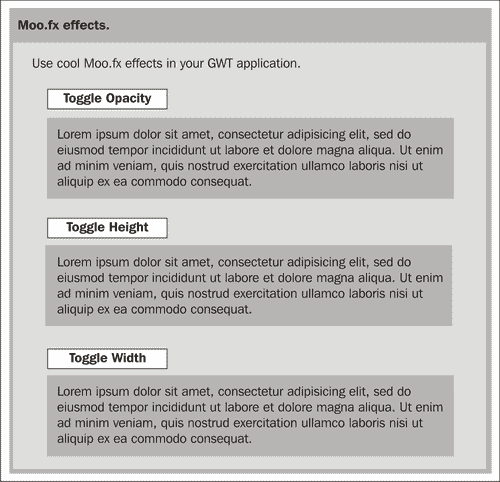
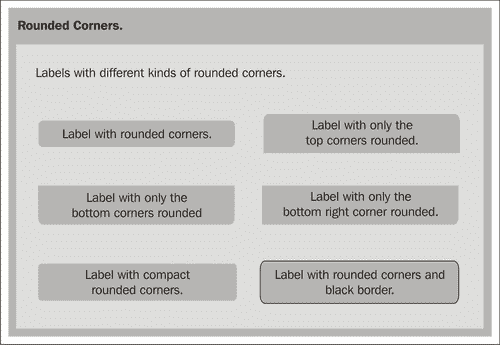
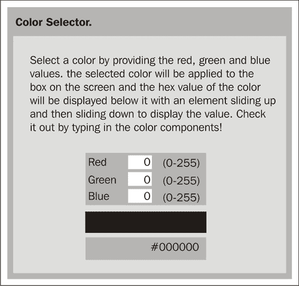
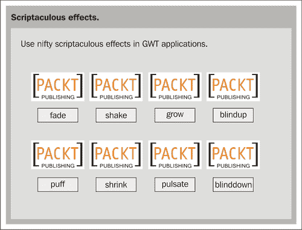

# 第六章：使用 JSNI 和 JavaScript 库的浏览器效果

在本章中，我们将学习如何创建用户界面，利用一些知名的第三方 JavaScript 库提供的酷炫浏览器效果。我们将利用 GWT 提供的 JavaScript Native Interface (JSNI)来包装这些现有的 JavaScript 库，并在我们的 GWT 应用程序中使用它们。

我们将要解决的任务是：

+   Moo.Fx

+   Rico 圆角

+   Rico 颜色选择器

+   Script.aculo.us 效果

# 什么是 JSNI？

JSNI 提供了一种将 JavaScript 代码与 Java 代码混合的方法。它在概念上类似于 Sun 的 Java 环境提供的 Java Native Interface (JNI)。JNI 使您的 Java 代码能够调用 C 和 C++方法。JSNI 使您的 Java 代码能够调用 JavaScript 方法。这是一种非常强大的技术，它让我们能够直接从 Java 代码访问低级别的 JavaScript 代码，并为下面列出的各种用途和可能性打开了大门：

+   从 Java 调用 JavaScript 代码

+   从 JavaScript 调用 Java 代码

+   跨 Java/JavaScript 边界抛出异常

+   从 JavaScript 访问 Java 字段

然而，这种强大的技术应该谨慎使用，因为 JSNI 代码可能在不同浏览器之间不具备可移植性。当前的 GWT 编译器实现也无法对 JSNI 代码进行任何优化。JSNI 方法必须始终声明为 native，并且放置在 JSNI 方法中的 JavaScript 代码必须放置在特殊格式的注释块中。因此，每个 JSNI 方法将由两部分组成——一个 native 方法声明，以及嵌入在特殊格式的代码块中的方法的 JavaScript 代码。以下是一个调用`alert()` JavaScript 方法的 JSNI 方法的示例：

```java
native void helloGWTBook()
/*-{
$wnd.alert("Hello, GWT book!");
}-*/;

```

在上面的示例中，JavaScript 代码嵌入在'/*-{'和'}-*/'块中。还要注意的一件事是使用`$wnd`和`$doc`变量。GWT 代码始终在浏览器中的嵌套框架内运行，因此无法在 JSNI 代码中以正常方式访问窗口或文档对象。您必须使用`$wnd`和`$doc`变量，这些变量由 GWT 自动初始化，用于引用主机页面的窗口和文档对象。GWT 编译器可以检查我们的 JSNI 代码。因此，如果在 Web 模式下运行并编译应用程序，编译器将标记 JSNI 代码中的任何错误。这是调试 JSNI 代码的一种好方法，因为这些错误直到运行时（在托管模式下运行时）才会显示出来。在本章中，我们将使用 JSNI 来包装一些第三方 JavaScript 库，并在我们的 GWT 用户界面中使用它们提供的酷炫浏览器效果。

### 注意

在最近的 GWT 版本中，JSNI 函数有时在托管模式下不起作用，但在部署时可以正常工作。

# Moo.Fx

`Moo.fx`是一个超轻量级和快速的 JavaScript 库，为 Web 应用程序提供了几种酷炫的效果（[`moofx.mad4milk.net`](http://moofx.mad4milk.net)）。它体积小，适用于所有主要的 Web 浏览器。我们将使用 JSNI 来包装`Moo.fx`库提供的一些效果，并在我们的 GWT 应用程序中使用这些效果。

## 行动时间—使用 JSNI

我们将使用 GWT 框架提供的 JSNI 来包装`Moo.fx`库，并在我们的 GWT 用户界面中混合 Java 和 JavaScript 来使用其功能。

1.  将原型和`Moo.fx` JavaScript 文件添加到模块的 HTML 文件—`Samples.html`。

```java
<script type="text/JavaScript"src="img/prototype.js">
</script>
<script type="text/JavaScript"src="img/moo.fx.js">
</script>

```

1.  在`com.packtpub.gwtbook.samples.client.util`包中创建一个名为`MooFx.java`的新 Java 类，用于包装`Moo.fx` JavaScript 库的效果。

1.  在`MooFx.java`中添加一个新的 JSNI 方法，用于创建一个`opacity.fx`对象。

```java
public native static Element opacity(Element element)
/*-{
$wnd._nativeExtensions = false;
return new $wnd.fx.Opacity(element);
}-*/;

```

1.  为切换不透明度效果添加一个 JSNI 方法。

```java
public native static void toggleOpacity(Element element)
/*-{
$wnd._nativeExtensions = false;
element.toggle();
}-*/;

```

1.  添加一个私有的 JSNI 方法，接受一个选项字符串参数并将其转换为 JavaScript 对象。

```java
private static native JavaScriptObject buildOptions
(String opts)
/*-{
eval("var optionObject = new Object()");
var options = opts.split(',');
for (var i =0; i < options.length; i++)
{
var opt = options[i].split(':');
eval("optionObject." + opt[0] + "=" + opt[1]);
}
return optionObject;
}-*/;

```

1.  添加一个静态的 Java 方法来创建一个高度效果，它使用上面的`buildOptions()`来构建一个 JavaScript 对象，以便将选项传递给 JSNI 方法。

```java
public static Element height(Element element, String opts)
{
return height(element, buildOptions(opts));
}

```

1.  添加一个新的 JSNI 方法，用于创建高度效果对象。

```java
private native static Element height
(Element element, JavaScriptObject opts)
/*-{
$wnd._nativeExtensions = false;
return new $wnd.fx.Height(element, opts);
}-*/;

```

1.  添加一个新的 JSNI 方法来切换高度效果。

```java
public native static void toggleHeight(Element element)
/*-{
$wnd._nativeExtensions = false;
element.toggle();
}-*/;

```

1.  添加一个静态的 Java 方法来创建一个宽度效果，它使用上面的`buildOptions()`来构建一个 JavaScript 对象，以便将选项传递给 JSNI 方法。

```java
public static Element width(Element element, String opts)
{
return width(element, buildOptions(opts));
}

```

1.  添加一个新的 JSNI 方法，用于创建宽度效果对象。

```java
private native static Element width
(Element element, JavaScriptObject opts)
/*-{
$wnd._nativeExtensions = false;
return new $wnd.fx.Width(element, opts);
}-*/;

```

1.  添加一个新的 JSNI 方法来切换宽度效果。

```java
public native static void toggleWidth(Element element)
/*-{
$wnd._nativeExtensions = false;
element.toggle();
}-*/;

```

1.  在`com.packtpub.gwtbook.samples.client.panels`包中的一个新的 Java 文件中创建此应用程序的用户界面，命名为`MooFxEffectsPanel.java`。添加一个包含外部`div`元素和包含文本段落元素的内部`div`元素的 HTML 片段。添加三个包含此片段的不同变量。还为每个效果添加一个元素。

```java
private HTML opacityBox = new HTML
("<div class='moofxBox'><div id=\"opacitybox\">
<p class=\"text\">
Lorem ipsum dolor sit amet, consectetur adipisicing elit,
sed do eiusmod tempor incididunt ut labore et dolore
magna aliqua. Ut enim ad minim veniam, quis nostrud exercitation ullamco laboris nisi ut aliquip ex ea commodo consequat.
</p></div></div>");
private HTML heightBox = new HTML
("<div class='moofxBox'><div id=\"heightbox\">
<p class=\"text\">
Lorem ipsum dolor sit amet, consectetur adipisicing elit,
sed do eiusmod tempor incididunt ut labore et dolore
magna aliqua. Ut enim ad minim veniam, quis nostrud exercitation ullamco laboris nisi ut aliquip ex ea commodo consequat.
</p></div></div>");
private HTML widthBox = new HTML
("<div class='moofxBox'><div id=\"widthbox\">
<p class=\"text\">
Lorem ipsum dolor sit amet, consectetur adipisicing elit,
sed do eiusmod tempor incididunt ut labore et dolore
magna aliqua. Ut enim ad minim veniam, quis nostrud exercitation ullamco laboris nisi ut aliquip ex ea commodo consequat.
</p></div></div>");
private Element widthBoxElement;
private Element heightBoxElement;
private Element opacityBoxElement;

```

1.  创建三个按钮，一个用于切换每个`Moo.fx`效果。

```java
Button opacityButton = new Button("Toggle Opacity");
Button heightButton = new Button("Toggle Height");
Button widthButton = new Button("Toggle Width");

```

1.  注册一个事件处理程序来监听每个按钮的点击，并调用适当的方法来切换效果。

```java
opacityButton.addClickListener(new ClickListener()
{
public void onClick(Widget sender)
{
MooFx.toggleOpacity
(opacityBoxElement);
}
});
heightButton.addClickListener(new ClickListener()
{
public void onClick(Widget sender)
{
MooFx.toggleHeight
(heightBoxElement);
}
});
widthButton.addClickListener(new ClickListener()
{
public void onClick(Widget sender)
{
MooFx.toggleWidth
(widthBoxElement);
}
});

```

1.  创建一个`DeferredCommand`，当执行时创建每个效果对象。

```java
DeferredCommand.add(new Command()
{
public void execute()
{
opacityBoxElement = MooFx.opacity
(DOM.getElementById("opacitybox"));
}
});
DeferredCommand.add(new Command()
{
public void execute()
{
heightBoxElement =
MooFx.height(DOM.getElementById
("heightbox"), "duration:2500");
}
});
DeferredCommand.add(new Command()
{
public void execute()
{
widthBoxElement =
MooFx.width(DOM.getElementById
("widthbox"), "duration:2000");
}
});

```

1.  在构造函数中，将每个效果的按钮和`divs`添加到工作面板中。

```java
opacityButton.setStyleName("moofxButton");
workPanel.add(opacityButton);
workPanel.add(opacityBox);
heightButton.setStyleName("moofxButton");
workPanel.add(heightButton);
workPanel.add(heightBox);
widthButton.setStyleName("moofxButton");
workPanel.add(widthButton);
workPanel.add(widthBox);

```

1.  最后，创建一个小的信息面板，显示关于此应用程序的描述性文本，以便在我们的`Samples`应用程序的可用示例列表中选择此示例时显示此文本。将信息面板和工作面板添加到一个停靠面板中，并初始化小部件。

```java
HorizontalPanel infoPanel = new HorizontalPanel();
infoPanel.add(new HTML("<div class='infoProse'>
Use cool Moo.fx effects in your
GWT application.</div>"));
DockPanel workPane = new DockPanel();
workPane.add(infoPanel, DockPanel.NORTH);
workPane.add(workPanel, DockPanel.CENTER);
workPane.setCellHeight(workPanel, "100%");
workPane.setCellWidth(workPanel, "100%");
initWidget(workPane);

```

这是应用程序的屏幕截图。单击每个按钮以查看效果。



### 刚刚发生了什么？

`Moo.fx`库提供的主要效果有：

+   不透明度：修改元素的不透明度或透明度。

+   高度：修改元素的高度。

+   宽度：修改元素的宽度。

在这个示例中，我们创建了一个名为`MooFx`的 Java 类，它使用 JSNI 封装了`Moo.fx` JavaScript 库。我们创建了一个名为`opacity()`的本机方法，用于实例化一个不透明度对象。在这个方法中，我们调用不透明度对象的 JavaScript 构造函数，并返回结果对象，其类型为`Element`。我们将其存储在一个变量中。

```java
return new $wnd.fx.Opacity(element);

```

然后，我们创建了一个名为`toggleOpacity()`的本机方法，用于切换元素的不透明度从一个状态到另一个状态。这个方法使用我们之前存储的变量，并调用其切换方法来改变其当前状态。

```java
element.toggle();

```

我们创建了`height()`和`width()`的 Java 方法，它们接受一个包含需要提供给`Moo.fx`高度和宽度构造函数的选项的字符串参数。这两个方法使用一个名为`buildOptions()`的本机方法来创建包含选项的 JavaScript 对象，然后将其传递给用于创建高度和宽度的本机方法。`buildOptions()`方法解析提供的字符串，并创建一个 JavaScript 对象并设置其属性和属性值。我们再次利用`eval()`函数来设置属性并返回对象。

```java
private static native JavaScriptObject buildOptions(String opts)
/*-{
eval("var optionObject = new Object()");
var options = opts.split(',');
for (var i =0; i < options.length; i++)
{
var opt = options[i].split(':');
Moo.fxworkingeval("optionObject." + opt[0] + "=" + opt[1]);
}
return optionObject;
}-*/;

```

返回的 JavaScript 选项对象被传递给本机的`height()`和`width()`方法，以创建类似于`opacity()`方法的效果对象。然后，我们添加了用于切换高度和宽度的本机方法。这就是我们将库封装成易于使用的 Java 类所需要做的全部！

在用户界面中，我们创建一个带有外部`div`的 HTML 对象，其中包含一个带有文本段落的内部`div`。HTML 小部件使我们能够创建任意 HTML 并将其添加到面板中。我们在此示例中使用了 HTML 小部件，但我们也可以使用 GWT 框架中的 DOM 对象的方法来创建相同的元素。在下一个示例中，我们将使用该功能，以便熟悉 GWT 提供的不同工具。我们还创建了三个按钮，分别用于切换每个效果。为每个按钮注册了事件处理程序，以侦听单击事件，然后调用指定效果的适当切换方法。在创建效果的方法中，我们使用 DOM 对象上的`getElementById()`来获取我们感兴趣的`div`元素。我们需要这样做，因为我们无法访问添加到面板的`div`。我们感兴趣的`div`作为 HTML 小部件的一部分添加到面板上。

```java
opacityBoxElement = MooFx.opacity(DOM.getElementById("opacitybox"));

```

然后切换元素上的必要效果。

```java
MooFx.toggleOpacity(opacityBoxElement);

```

效果本身是通过在`DeferredCommand`内调用效果的相应构造函数来构建的。我们添加的元素尚不可通过其 ID 使用，直到所有事件处理程序都已完成。`DeferredCommand`在它们全部完成后运行，这确保了我们的元素已被添加到 DOM，并且可以通过其 ID 访问。我们获取元素，创建效果，并将其与元素关联起来。

```java
DeferredCommand.add(new Command()
{
public void execute()
{
opacityBoxElement = MooFx.opacity
(DOM.getElementById("opacitybox"));
}
});

```

我们已成功从 Java 中访问了库，在我们的 GWT 应用程序中可以在任何地方重用这些效果。在本章后面的`ColorSelector`示例中，我们将使用`Moo.fx`效果之一与其他库的效果结合使用。

# Rico 圆角

网页上带有圆角的元素在视觉上比直角更有吸引力，美学上更具吸引力。这也是网络应用外观和感觉中最热门的设计趋势之一。Rico ([`openrico.org/rico/home.page`](http://openrico.org/rico/home.page))是另一个出色的 JavaScript 库，对此提供了很好的支持，并且使用起来非常容易。它还提供了大量的功能，但我们只是包装和使用 Rico 的圆角效果部分。在此示例中，我们仅使用标签来应用圆角，但您也可以将其应用于文本段落和其他几种 HTML 元素。在此示例中，我们将包装 Rico 的圆角效果，并在我们的应用程序中使用它来显示具有不同类型圆角的多个标签。

## 行动时间-支持标签

我们将包装`Rico`库，并在我们的 GWT 用户界面中为带有圆角的标签提供支持。

1.  在模块的 HTML 文件`Samples.html`中添加所需的原型和 Rico JavaScript 文件。

```java
<script type="text/JavaScript"src="img/prototype.js">
</script>
<script type="text/JavaScript"src="img/rico.fx.js">
</script>

```

1.  在`com.packtpub.gwtbook.samples.client.util`包中创建一个名为`Rico.java`的新 Java 类，该类将包装`rico` JavaScript 库效果。

1.  在`Rico.java`中添加一个新的 JSNI 方法，用于将小部件的角进行四舍五入。

```java
private native static void corner
(Element element, JavaScriptObject opts)
/*-{
$wnd._nativeExtensions = false;
$wnd.Rico.Corner.round(element, opts);
}-*/;

```

1.  添加一个私有 JSNI 方法，该方法接受一个字符串选项参数并将其转换为 JavaScript 对象。

```java
private static native JavaScriptObject buildOptions(String opts)
/*-{
eval("var optionObject = new Object()");
var options = opts.split(',');
for (var i =0; i < options.length; i++)
{
var opt = options[i].split(':');
eval("optionObject." + opt[0] + "=" + opt[1]);
}
return optionObject;
}-*/;

```

1.  添加一个静态 Java 方法，用于创建一个圆角，该方法使用上述`buildOptions()`来构建一个 JavaScript 对象，以便将选项传递给 JSNI 方法。

```java
public static void corner(Widget widget, String opts)
{
corner(widget.getElement(), buildOptions(opts));
}

```

1.  添加一个静态 Java 方法，用于创建一个不传递任何选项并使用默认值的圆角。

```java
public static void corner(Widget widget)
{
corner(widget.getElement(), null);
}

```

1.  在`com.packtpub.gwtbook.samples.client.panels`包中的一个新的 Java 文件中创建此应用程序的用户界面，命名为`RoundedCornersPanel.java`。创建一个包含三行两列的网格。我们将向此网格添加标签。

```java
private Grid grid = new Grid(3, 2);

```

1.  添加六个标签，这些标签将分别应用六种不同的圆角。

```java
private Label lbl1 = new Label("Label with rounded corners.");
private Label lbl2 = new Label
("Label with only the top corners rounded.");
private Label lbl3 = new Label("Label with only the
bottom corners rounded.");
private Label lbl4 = new Label("Label with only the
bottom right corner rounded.");
private Label lbl5 = new Label("Label with compact
rounded corners ");
private Label lbl6 = new Label("Label with rounded corners
and red border.");

```

1.  调用方法为每个标签创建圆角，并向其传递不同的选项。

```java
Rico.corner(lbl1);
Rico.corner(lbl2, "corners:\"top\"");
Rico.corner(lbl3, "corners:\"bottom\"");
Rico.corner(lbl4, "corners:\"br\"");
Rico.corner(lbl5, "compact:true");
Rico.corner(lbl6, "border: 'red'");

```

1.  将标签添加到网格中。

```java
grid.setWidget(0, 0, lbl1);
grid.setWidget(0, 1, lbl2);
grid.setWidget(1, 0, lbl3);
grid.setWidget(1, 1, lbl4);
grid.setWidget(2, 0, lbl5);
grid.setWidget(2, 1, lbl6);

```

1.  最后，创建一个小的信息面板，显示关于这个应用程序的描述性文本，这样当我们在`Samples`应用程序的可用示例列表中选择此样本时，我们可以显示这个文本。将信息面板和工作面板添加到一个停靠面板中，并初始化小部件。

```java
HorizontalPanel infoPanel =
new HorizontalPanel();infoPanel.add(new HTML
("<div class='infoProse'>Labels with different
kinds of rounded corners.</div>"));
workPanel.add(grid);
DockPanel workPane = new DockPanel();
workPane.add(infoPanel, DockPanel.NORTH);
workPane.add(workPanel, DockPanel.CENTER);
workPane.setCellHeight(workPanel, "100%");
workPane.setCellWidth(workPanel, "100%");
initWidget(workPane);

```

这里是一个显示不同类型圆角标签的屏幕截图：



### 刚刚发生了什么？

我们创建了一个 Java 类，使用 JSNI 提供对`Rico` JavaScript 库中圆角功能的访问。我们创建了一个`buildOptions()`方法，就像在前面的示例中一样，它可以接受一个包含选项字符串的参数，并将这些选项作为本机 JavaScript 对象的属性添加。然后将此选项对象传递给调用 Rico 库中提供的元素的`corner()`方法的 JSNI 方法。

```java
private native static void corner
(Element element, JavaScriptObject opts)
/*-{
$wnd._nativeExtensions = false;
$wnd.Rico.Corner.round(element, opts);
}-*/;

```

在用户界面中，我们创建一个网格，并向其添加六个标签。这些标签中的每一个都应用了不同类型的圆角。Rico 支持在四个边上或特定边上的圆角。它还可以创建紧凑形式的角，其中角比默认版本略少圆。您甚至可以使两个或三个角变圆，而将第四个角保持为方形。Rico 提供了其他方法，您可以包装并在应用程序中使用，除了圆角之外。该过程与我们迄今为止所做的非常相似，通常只是实现您感兴趣的 JavaScript 库中的所有方法。在下一个示例中，我们将包装 Rico 中的更多功能，并在颜色选择器应用程序中使用它。

# Rico 颜色选择器

我们已经成功地在上一个示例中从 Rico 中包装了圆角效果。在本节中，我们将添加支持使用 Rico 的 Color 对象访问颜色信息的功能。我们将使用 JSNI 包装这个功能，然后创建一个颜色选择器应用程序，该应用程序使用 Rico 颜色对象以及我们在本章前面创建的`Moo.fx`效果。

## 行动时间-包装颜色方法

我们将在`Rico`库中包装`color`方法，并使用它们创建一个选择颜色的应用程序。

1.  在`Rico.java`中添加一个新的 JSNI 方法，用于创建具有提供的`red, green`和`blue`值的`color`对象，并将其应用于提供的元素。

```java
public native static void color
(Element element, int red, int green,int blue)
/*-{
$wnd._nativeExtensions = false;
eval('' + element.id +' = new $wnd.Rico.Color
(' + red +',' + green +',' + blue + ')');
element.style.backgroundColor=eval
(element.id + '.asHex()');
}-*/;

```

1.  在`Rico.java`中添加一个新的 JSNI 方法，用于获取 Rico 颜色对象的十六进制值。

```java
public native static String getColorAsHex(Element element)
/*-{
$wnd._nativeExtensions = false;
return (eval(element.id + '.asHex()'));
}-*/;

```

1.  在`com.packtpub.gwtbook.samples.client.panels`包中的一个新的 Java 文件`ColorSelectorPanel.java`中为这个应用程序创建用户界面。创建一个包含三行三列的网格。创建三个文本字段用于输入值，以及工作面板和用于颜色框和颜色文本的`divs`。

```java
private HorizontalPanel workPanel = new HorizontalPanel();
private Grid grid = new Grid(3, 3);
private TextBox redText = new TextBox();
private TextBox greenText = new TextBox();
private TextBox blueText = new TextBox();
private Element outerDiv = DOM.createDiv();
private Element colorDiv = DOM.createDiv();
private Element colorText = DOM.createElement("P");
private Element colorBox = DOM.createElement("P");

```

1.  在构造函数中初始化网格，并将每个文本框中的值默认为零。

```java
grid.setText(0, 0, "Red");
grid.setText(1, 0, "Green");
grid.setText(2, 0, "Blue");
redText.setText("0");
grid.setWidget(0, 1, redText);
greenText.setText("0");
grid.setWidget(1, 1, greenText);
blueText.setText("0");
grid.setWidget(2, 1, blueText);
grid.setText(0, 2, "(0-255)");
grid.setText(1, 2, "(0-255)");
grid.setText(2, 2, "(0-255)");

```

1.  注册一个事件处理程序来监听键盘事件。

```java
redText.addKeyboardListener(this);
blueText.addKeyboardListener(this);
greenText.addKeyboardListener(this);

```

1.  创建一个段落元素来显示所选颜色。

```java
DOM.setAttribute(colorBox, "className", "ricoColorBox");
DOM.setAttribute(colorBox, "id", "colorBox");
DOM.setInnerText(colorBox, "");
Rico.color(colorBox, 0, 0, 0);

```

1.  创建用于显示所选颜色的十六进制值的元素。

```java
DOM.setAttribute(outerDiv, "className", "heightBox");
DOM.setAttribute(colorDiv, "id", "colorDiv");
DOM.setAttribute(colorText, "className", "text");
DOM.appendChild(colorDiv, colorText);
DOM.appendChild(outerDiv, colorDiv);
DOM.appendChild(workPanel.getElement(), outerDiv);

```

1.  创建一个`DeferredCommand`来初始化来自`Moo.fx`的高度效果，并将初始选定的颜色设置为(0, 0, 0)。

```java
DeferredCommand.add(new Command()
{
public void execute()
{
MooFx.height(DOM.getElementById("colorDiv"),
"duration:500");
DOM.setInnerText(colorText, Rico.getColorAsHex
(colorBox));
}
});

```

1.  添加一个`onKeyPress()`处理程序，以在用户输入新的 RGB 值时显示所选颜色，并将高度效果应用于显示所选颜色的`div`。

```java
public void onKeyPress(Widget sender, char keyCode,
int modifiers)
{
MooFx.toggleHeight(DOM.getElementById("colorDiv"));
Timer t = new Timer()
{
public void run()
{
if ((redText.getText().length() > 0)
&& (greenText.getText().length() > 0)
&& (blueText.getText().length() > 0))
{
Rico.color(colorBox,
Integer.parseInt(redText.getText()),
Integer.parseInt(greenText.getText()),
Integer.parseInt(blueText.getText()));
DOM.setInnerText(colorText, Rico.getColorAsHex
(colorBox));
MooFx.toggleHeight(DOM.getElementById("colorDiv"));
}
}
};
t.schedule(500);
}

```

1.  最后，创建一个小的信息面板，显示关于这个应用程序的描述性文本，这样当我们在`Samples`应用程序的可用示例列表中选择此样本时，我们可以显示这个文本。将信息面板和工作面板添加到一个停靠面板中，并初始化小部件。

```java
HorizontalPanel infoPanel = new HorizontalPanel();infoPanel.add
(new HTML("<div class='infoProse'>
Select a color by providing the red, green and blue values.
The selected color will be applied to the box on the screen
and the hex value of the color will be displayed below it
with an element sliding up and then sliding down to display
the value. Check it out by typing in the color
components!</div>"));
DockPanel workPane = new DockPanel();
workPane.add(infoPanel, DockPanel.NORTH);
workPane.add(workPanel, DockPanel.CENTER);
workPane.setCellHeight(workPanel, "100%");
workPane.setCellWidth(workPanel, "100%");
initWidget(workPane);

```

这就是应用程序。输入 RGB 的新值，当您停止输入时，观察所选颜色的显示，并且当前颜色的十六进制值以滑动窗口效果显示为上滑和下滑！



### 刚刚发生了什么？

我们首先从上一个示例中增强我们的 Rico 包装类，以添加对颜色功能的访问。Rico 为我们提供了使用一组红色、绿色和蓝色值创建颜色对象的能力。一旦构造了这个颜色对象，就可以将其十六进制值作为字符串检索出来。我们添加了一个 JSNI 方法来创建一个颜色对象。在这个方法内部，我们创建`Rico.Color`对象，然后将提供的元素的背景设置为新创建的颜色。颜色对象存储在一个变量中，变量的名称与元素的 ID 相同。我们使用`eval（）`方法动态创建变量并设置背景颜色。我们为元素设置`backgroundColor` DHTML 属性：

```java
eval('' + element.id +' = new $wnd.Rico.Color
(' + red +',' + green +',' + blue + ')');
element.style.backgroundColor=eval(element.id + '.asHex()');

```

我们还创建了一个 JSNI 方法，可以返回提供元素的背景颜色的十六进制值。

```java
public native static String getColorAsHex(Element element)
/*-{
return (eval(element.id + '.asHex()'));
}-*/;

```

在用户界面中，我们创建一个网格，并用三个文本框填充它，用于输入颜色值，并为每个字段添加一些标识符。在这个示例中，我们使用 DOM 对象创建各种元素，而不是使用 HTML 小部件。DOM 对象包含用于创建各种元素和操作网页文档对象模型的静态方法。我们创建两个`div`元素和一个段落元素，并将它们添加到页面的面板中。这些将用于创建将对其应用高度效果以在选择的颜色的`div`上滑动并显示十六进制值之前滑动的元素。由于`workPanel`是一个 GWT 小部件，我们调用所有小部件提供的`getElement（）`方法来访问底层 DOM 元素，然后将`div`元素附加到其中。

```java
DOM.setAttribute(outerDiv, "className", "heightBox");
DOM.setAttribute(colorDiv, "id", "colorDiv");
DOM.setAttribute(colorText, "className", "text");
DOM.appendChild(colorDiv, colorText);
DOM.appendChild(outerDiv, colorDiv);
DOM.appendChild(workPanel.getElement(), outerDiv);

```

我们再次使用`DeferredCommand`来设置当前颜色的初始十六进制值，并设置来自`Moo.fx`的高度效果对象。由于我们使用段落元素来显示带有颜色十六进制值的字符串，我们必须使用 DOM 对象来设置其内部文本。如果我们使用 GWT 小部件，我们将通过调用`setText（）`方法来设置值。

```java
MooFx.height(DOM.getElementById("colorDiv"), "duration:500");
DOM.setInnerText(colorText, Rico.getColorAsHex(colorBox));

```

最后，在`onKeyPress（）`方法中，我们首先切换`colordiv`的高度，使元素向上滑动。然后我们安排一个定时器在 500 毫秒后触发，当定时器触发时，我们使用红色、绿色和蓝色文本框中的当前值创建一个新的颜色对象，将`colorText`元素的文本设置为该颜色的十六进制值，然后切换`colordiv`的高度，使其向下滑动以显示这个值。定时器是必要的，以便稍微减慢速度，这样您可以清楚地看到过渡和效果。

```java
MooFx.toggleHeight(DOM.getElementById("colorDiv"));
Timer t = new Timer()
{
public void run()
{
if((redText.getText().length() > 0)
&& (greenText.getText().length() > 0)
&& (blueText.getText().length() > 0))
{
Rico.color(colorBox, Integer.parseInt(redText.getText()),
Integer.parseInt(greenText.getText()),
Integer.parseInt(blueText.getText()));
DOM.setInnerText(colorText, Rico.getColorAsHex(colorBox));
MooFx.toggleHeight(DOM.getElementById("colorDiv"));
}
}
};
t.schedule(500);

```

# Script.aculo.us 效果

`Script.aculo.us`（[`script.aculo.us/`](http://script.aculo.us/)）是由 Thomas Fuchs 编写的令人惊叹的 JavaScript 库，可以在网页内实现各种时髦的过渡和视觉效果。它是一个跨浏览器兼容的库，建立在原型 JavaScript 框架之上。它也是最受欢迎的 Web 2.0 库之一，在各种应用中被广泛使用，最值得注意的是它还包含在 Ruby On Rails web 框架中。`Script.aculo.us`效果是由该库的一部分`Effect`类集成和提供的。我们将使用这个类来调用和使用 GWT 应用中的各种效果。与本章的其他部分不同，我们这里不使用 JSNI，而是展示如何在应用程序中使用现有的包装库来提供一些漂亮的浏览器效果。

## 行动时间-应用效果

`gwt-widget`库是由 Robert Hanson 维护的 GWT 框架的一组扩展和增强，它提供了一个包装效果的 Java 类，我们将在我们的应用程序中使用这个类。我们将添加一个包含两行四列的网格，每个包含一个小图像文件，并对每个图像应用一个效果。

我们需要引用提供库的 Java 包装器的`gwt-widgets`模块。这是利用了 GWT 的模块继承特性。我们将在本示例的*刚刚发生了什么？*部分对这个概念进行解释。按照以下步骤添加网格：

1.  在`com.packtpub.gwtbook.samples`包中的现有`Samples.gwt.xml`文件中添加以下条目：

```java
<inherits name='org.gwtwidgets.WidgetLibrary'/>

```

1.  添加上述模块使用的原型和`Script.aculo.us` JavaScript 文件：

```java
<script type="text/JavaScript"src="img/prototype.js">
</script>
<script type="text/JavaScript src="img/Scriptaculous.js">
</script>

```

1.  在`com.packtpub.gwtbook.samples.client.panels`包中的新的 Java 文件`ScriptaculousEffectsPanel.java`中创建这个应用程序的用户界面。创建一个包含两行四列的网格。创建八个图像，八个按钮和一个工作面板。

```java
private HorizontalPanel workPanel = new HorizontalPanel();
private Grid grid = new Grid(2, 4);
private Image packtlogo1 = new Image("images/packtlogo.jpg");
private Image packtlogo2 = new Image("images/packtlogo.jpg");
private Image packtlogo3 = new Image("images/packtlogo.jpg");
private Image packtlogo4 = new Image("images/packtlogo.jpg");
private Image packtlogo5 = new Image("images/packtlogo.jpg");
private Image packtlogo6 = new Image("images/packtlogo.jpg");
private Image packtlogo7 = new Image("images/packtlogo.jpg");
private Image packtlogo8 = new Image("images/packtlogo.jpg");
private Button fadeButton = new Button("fade");
private Button puffButton = new Button("puff");
private Button shakeButton = new Button("shake");
private Button growButton = new Button("grow");
private Button shrinkButton = new Button("shrink");
private Button pulsateButton = new Button("pulsate");
private Button blindUpButton = new Button("blindup");
private Button blindDownButton = new Button("blinddown");

```

1.  将淡出效果的按钮和图像添加到`VerticalPanel`中，并将面板添加到网格中。

```java
VerticalPanel gridCellPanel = new VerticalPanel();
gridCellPanel.add(packtlogo1);
gridCellPanel.add(fadeButton);
grid.setWidget(0, 0, gridCellPanel);

```

1.  添加一个事件处理程序，监听淡出效果按钮的点击，并调用适当的`Script.aculo.us`效果。

```java
fadeButton.addClickListener(new ClickListener()
{
public void onClick(Widget sender)
{
Effect.fade(packtlogo1);
}
});

```

1.  将摇晃效果的按钮和图像添加到`VerticalPanel`中，并将面板添加到网格中。

```java
gridCellPanel = new VerticalPanel();
gridCellPanel.add(packtlogo3);
gridCellPanel.add(shakeButton);
grid.setWidget(0, 1, gridCellPanel);

```

1.  添加一个事件处理程序，监听摇晃效果按钮的点击，并调用适当的`Script.aculo.us`效果。

```java
shakeButton.addClickListener(new ClickListener()
{
public void onClick(Widget sender)
Scrip.aculo.useffects, applying{
Effect.shake(packtlogo3);
}
});

```

1.  将增长效果的按钮和图像添加到`VerticalPanel`中，并将面板添加到网格中。

```java
gridCellPanel = new VerticalPanel();
gridCellPanel.add(packtlogo4);
gridCellPanel.add(growButton);
grid.setWidget(0, 2, gridCellPanel);

```

1.  添加一个事件处理程序，监听增长效果按钮的点击，并调用适当的`Script.aculo.us`效果。

```java
growButton.addClickListener(new ClickListener()
{
public void onClick(Widget sender)
{
Effect.grow(packtlogo4);
}
});

```

1.  将盲目上升效果的按钮和图像添加到`VerticalPanel`中，并将面板添加到网格中。

```java
gridCellPanel = new VerticalPanel();
gridCellPanel.add(packtlogo8);
gridCellPanel.add(blindUpButton);
grid.setWidget(0, 3, gridCellPanel);

```

1.  添加一个事件处理程序，监听盲目上升效果按钮的点击，并调用适当的`Script.aculo.us`效果。

```java
blindUpButton.addClickListener(new ClickListener()
{
public void onClick(Widget sender)
{
Effect.blindUp(packtlogo8);
}
});

```

1.  将膨胀效果的按钮和图像添加到`VerticalPanel`中，并将面板添加到网格中。

```java
gridCellPanel = new VerticalPanel();
gridCellPanel.add(packtlogo2);
gridCellPanel.add(puffButton);
grid.setWidget(1, 0, gridCellPanel);

```

1.  添加一个事件处理程序，监听膨胀效果按钮的点击，并调用适当的`Script.aculo.us`效果。

```java
puffButton.addClickListener(new ClickListener()
{
Scrip.aculo.useffects, applyingpublic void onClick(Widget sender)
{
Effect.puff(packtlogo2);
}
});

```

1.  将收缩效果的按钮和图像添加到`VerticalPanel`中，并将面板添加到网格中。

```java
gridCellPanel = new VerticalPanel();
gridCellPanel.add(packtlogo5);
gridCellPanel.add(shrinkButton);
grid.setWidget(1, 1, gridCellPanel);

```

1.  添加一个事件处理程序，监听收缩效果按钮的点击，并调用适当的`Script.aculo.us`效果。

```java
shrinkButton.addClickListener(new ClickListener()
{
public void onClick(Widget sender)
{
Effect.shrink(packtlogo5);
}
});

```

1.  将脉动效果的按钮和图像添加到`VerticalPanel`中，并将面板添加到网格中。

```java
gridCellPanel = new VerticalPanel();
gridCellPanel.add(packtlogo6);
gridCellPanel.add(pulsateButton);
grid.setWidget(1, 2, gridCellPanel);

```

1.  添加一个事件处理程序，监听脉动效果按钮的点击，并调用适当的`Script.aculo.us`效果。

```java
pulsateButton.addClickListener(new ClickListener()
{
public void onClick(Widget sender)
{
Effect.pulsate(packtlogo6);
}
});

```

1.  最后，创建一个小的信息面板，显示关于这个应用程序的描述性文本，这样当在我们的`Samples`应用程序的可用样本列表中选择此样本时，我们就可以显示这个文本。将信息面板和工作面板添加到一个停靠面板，并初始化小部件。

```java
HorizontalPanel infoPanel =
new HorizontalPanel();infoPanel.add
(new HTML("<div class='infoProse'>
Use nifty scriptaculous effects
in GWT applications.
</div>"));
workPanel.setStyleName("scriptaculouspanel");
workPanel.add(grid);
DockPanel workPane = new DockPanel();
workPane.add(infoPanel, DockPanel.NORTH);
workPane.add(workPanel, DockPanel.CENTER);
workPane.setCellHeight(workPanel, "100%");
workPane.setCellWidth(workPanel, "100%");
initWidget(workPane);

```

1.  在 Eclipse 中的构建路径中添加`gwt-widgets.jar`，以便它可以找到引用的类。

这个应用程序中有以下各种效果：



点击每个按钮，看看应用于图像的相应效果。

### 刚刚发生了什么？

模块是包含 GWT 项目的配置设置的 XML 文件。我们已经看到并使用了我们的`Samples`项目的模块。这是我们引用了应用程序使用的外部 JavaScript 文件的文件，以及我们应用程序使用的 RPC 服务的条目等。GWT 模块还具有从其他模块继承的能力。这使得继承模块可以使用在继承模块中声明的资源。它可以防止重复资源映射的问题，并促进重用，使得很容易将 GWT 库打包为模块并在项目之间分发和重用。我们可以通过使用`inherits`标签并提供模块的完全限定名称来指定要继承的模块。所有 GWT 应用程序都必须继承自`com.google.gwt.user.User`模块，该模块提供了核心网络工具包项目。在这个例子中，我们继承自`org.gwtwidgets.WidgetLibrary`，该库提供了我们在应用程序中使用的`Script.aculo.us`效果类。以下是我们在`Samples.gwt.xml`文件中定义这种继承的方式：

```java
<inherits name='org.gwtwidgets.WidgetLibrary'/>

```

`Script.aculo.us`效果分为两种不同类型——核心效果和组合效果。核心效果是该库的基础，组合效果混合并使用核心效果来创建组合效果。该库中的核心效果包括：

+   不透明度：设置元素的透明度。

+   缩放：平滑地缩放元素。

+   移动：将元素移动给定数量的像素。

+   突出显示：通过改变其背景颜色并闪烁来吸引元素的注意力。

+   并行：多个效果同时应用于元素。

上述核心效果混合在一起，创建以下组合效果：

+   淡化：使元素淡出。

+   膨胀：使元素在烟雾中消失。

+   摇动：将元素重复向左和向右移动。

+   盲目下降：模拟窗帘在元素上下降。

+   盲目上升：模拟窗帘在元素上升。

+   脉动：使元素淡入淡出，并使其看起来像是在脉动。

+   增长：增大元素的大小。

+   收缩：减小元素的大小。

+   压缩：通过将元素收缩到其左侧来减小元素。

+   折叠：首先将元素减少到其顶部，然后到其左侧，最终使其消失。

我们在每个网格单元格内放置一个图像和一个按钮。当单击按钮时，我们会对位于按钮上方的图像元素应用效果。我们通过在`org.gwtwidgets.client.wrap.Effect`类中的所需效果方法中提供小部件对象来调用效果。该类中的所有方法都是静态的，并且该类中的每个`Script.aculo.us`效果都有一个相应命名的方法。因此，为了淡化一个元素，我们调用`Effect.fade()`方法，并提供要应用效果的图像小部件。这些过渡效果是为我们的应用程序增添光彩并提供更好的用户体验的一种非常好的方式。您还可以以不同的方式混合和匹配提供的效果，以创建和使用自定义效果。

# 总结

我们已经介绍了几个 JavaScript 库及其在 GWT 应用程序中的使用。在使用所有这些库时非常重要的一点是，包含大量 JavaScript 将增加浏览器加载的冗余，并几乎肯定会增加页面加载时间，并使运行速度变慢。因此，请谨慎使用视觉效果，不要过度使用。另一个注意事项是，在应用程序中使用 JSNI 时缺乏可移植性。这可能导致您的应用程序在不同版本的浏览器中运行方式大不相同。

在本章中，我们学习了关于 JSNI。我们利用 JSNI 来包装`Moo.fx`库并使用其效果。我们还包装了`Rico`库的不同部分，并利用它来为标签创建圆角和颜色选择器应用程序。我们使用了`gwt-widgets`库提供的`Script.aculo.us`效果。在这种情况下，我们使用了现有的库来提供效果。我们还学习了如何在 GWT 中使用模块继承。

在下一章中，我们将学习如何创建可以在项目之间共享的自定义 GWT 小部件。
