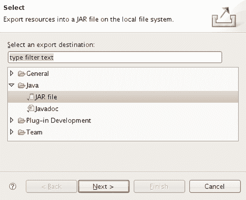
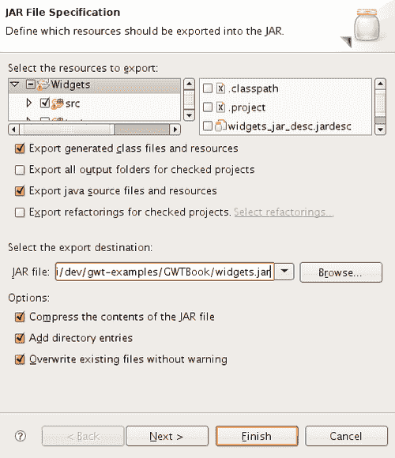
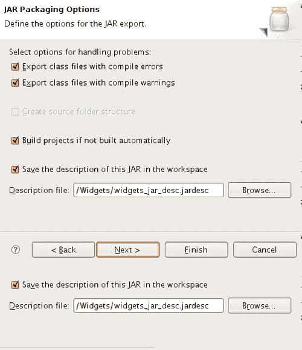
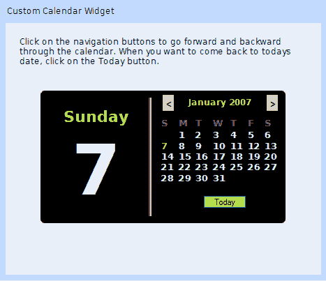
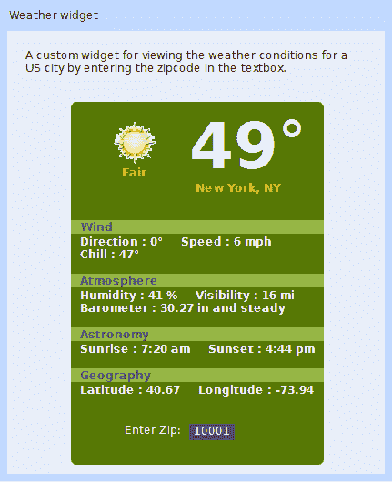

# 第七章：自定义小部件

GWT 提供了各种各样的小部件，例如标签，文本框，树等，供您在应用程序中使用。这些小部件为构建用户界面提供了一个良好的起点，但几乎总是不会提供您所需的一切。这就是通过组合现有的小部件以更新和创新的方式创建自定义小部件的概念，或者从头开始编写新的小部件变得方便的地方。在本章中，我们将解决网页中常用的两个功能——日历显示和天气状况显示。由于 GWT 当前未提供这两个功能，我们将创建这两个小部件。我们还将学习如何打包它们，以便在必要时可以在不同的 GWT 项目中重用它们。

我们将要解决的任务是：

+   日历小部件

+   天气小部件

# 日历小部件

我们将创建一个可重用的日历小部件，可以轻松地在多个 GWT 应用程序中使用。这个小部件基于 Alexei Sokolov 的简单日历小部件（[`gwt.components.googlepages.com/calendar`](http://gwt.components.googlepages.com/calendar)）。我们将对其进行调整以满足我们的要求。日历将显示当前日期以及当前月份的列表，并将允许通过日历向前或向后导航。我们还将提供一种方法，无论我们在日历中导航到哪里，都可以返回到当前日期。

## 行动时间——创建日历

现在我们将创建一个日历小部件。步骤如下：

1.  创建一个新的小部件项目，用于包含我们自定义小部件的构件。我们将在这个项目中创建我们的小部件，然后在我们原始的`Samples`项目中的应用程序中使用它。当我们创建新项目时，`Widgets.gwt.xml`文件将自动为我们创建，并且默认情况下，它将包含从`User`模块继承的以下条目。这是每个 GWT 模块都需要继承的一个模块：

```java
<inherits name='com.google.gwt.user.User'/>

```

1.  在`com.packtpub.gwtbook.widgets.client`包中创建一个名为`CalendarWidget.java`的新的 Java 文件，它扩展了`com.google.gwt.user.client.ui.Composite`类，并实现了`com.google.gwt.user.client.ui.ClickListener`接口：

```java
public class CalendarWidget extends Composite implements
ClickListener
{
}

```

1.  创建创建导航栏以在日历中前进和后退的元素，以及一个将是日历本身的容器的`DockPanel`类：

```java
private DockPanel navigationBar = new DockPanel();
private Button previousMonth = new Button("&lt;", this);
private Button nextMonth = new Button("&gt;", this);
private final DockPanel outerDockPanel = new DockPanel();

```

1.  创建字符串数组来存储一周中的工作日名称和一年中月份的名称。我们将从这些数组中检索名称以在用户界面中显示：

```java
private String[] daysInWeek = new String[] { "Sunday",
"Monday", "Tuesday","Wednesday", "Thursday", "Friday",
"Saturday"};
private String[] monthsInYear = new String[] { "January",
"February", "March", "April", "May", "June", "July",
"August", "September", "October", "November", "December"};

```

1.  创建一个变量来保存用于显示日历标题的 HTML。创建标签以显示当前日期的工作日和日期。还要创建和初始化一个包含当前日期的私有变量：

```java
private HTML calendarTitle = new HTML();
private Label dayOfWeek = new Label("");
private Label dateOfWeek = new Label("");
private Date currentDate = new Date();

```

1.  创建一个新的`Grid`对象，覆盖“clearCell（）”方法以设置列单元格的文本：

```java
private final Grid calendarGrid = new Grid(7, 7)
{
public boolean clearCell(int row, int column)
{
boolean retValue = super.clearCell(row, column);
Element td = getCellFormatter().getElement(row, column);
DOM.setInnerHTML(td, "");
return retValue;
}
};

```

1.  创建一个名为`CalendarCell`的私有静态类，它扩展了`HTML`类：

```java
private static class CalendarCell extends HTML
{
private int day;
public CalendarCell(String cellText, int day)
{
super(cellText);
this.day = day;
}
public int getDay()
{
return day;
}
}

```

这个类的一个实例将被添加到我们之前创建的`grid`对象中，以在一个单元格中显示一个日历元素。

1.  为`CalendarWidget`类添加访问器，以获取当前日期以及当前日期的日，月和年组件：

```java
public int getYear()
{
return 1900 + currentDate.getYear();
}
public int getMonth()
{
return currentDate.getMonth();
}
public int getDay()
{
return currentDate.getDate();
}
public Date getDate()
{
return currentDate;
}

```

这些方法将用于检索给定日历日期的个别数据。

1.  为`CalendarWidget`类添加修改`currentDate`变量的日，月和年组件的 mutators：

```java
private void setDate(int year, int month, int day)
{
currentDate = new Date(year - 1900, month, day);
}
private void setYear(int year)
{
currentDate.setYear(year - 1900);
}
private void setMonth(int month)
{
currentDate.setMonth(month);
}

```

1.  创建一个计算当前月份之前一个月的日历的方法：

```java
public void computeCalendarForPreviousMonth()
{
int month = getMonth() - 1;
if (month < 0)
{
setDate(getYear() - 1, 11, getDay());
}
else
{
setMonth(month);
}
renderCalendar();
}

```

当用户点击按钮导航到上一个月时，我们将使用它。

1.  创建一个计算当前月份之后一个月的日历的方法：

```java
public void computeCalendarForNextMonth()
{
int month = getMonth() + 1;
if (month > 11)
{
setDate(getYear() + 1, 0, getDay());
}
else
{
setMonth(month);
}
renderCalendar();
}

```

当用户点击按钮导航到下一个月时，我们将使用它。

1.  创建一个计算给定月份天数的方法。目前没有获取此信息的简单方法；因此我们需要计算它：

```java
private int getDaysInMonth(int year, int month)
{
switch (month)
{
case 1:
if ((year % 4 == 0 && year % 100 != 0) || year % 400 == 0)
return 29;
else
return 28;
case 3:
return 30;
case 5:
return 30;
case 8:
return 30;
case 10:
return 30;
default:
return 31;
}
}

```

1.  创建一个`renderCalendar()`方法，可以绘制日历及其所有元素。获取当前设置的`date`对象的各个组件，设置日历标题，并格式化日历网格。还要计算月份和当前日期的天数，并设置日期和工作日标签值。最后，将`grid`单元格的值设置为计算出的日历值：

```java
private void renderCalendar()
{
int year = getYear();
int month = getMonth();
int day = getDay();
calendarTitle.setText(monthsInYear[month] + " " + year);
calendarGrid.getRowFormatter().setStyleName(0, "weekheader");
for (int i = 0; i < daysInWeek.length; i++)
{
calendarGrid.getCellFormatter().setStyleName(0, i, "days");
calendarGrid.setText(0, i, daysInWeek[i].substring(0, 1));
}
Date now = new Date();
int sameDay = now.getDate();
int today = (now.getMonth() == month && now.getYear() + 1900
== year) ? sameDay : 0;
int firstDay = new Date(year - 1900, month, 1).getDay();
int numOfDays = getDaysInMonth(year, month);
int weekDay = now.getDay();
dayOfWeek.setText(daysInWeek[weekDay]);
dateOfWeek.setText("" + day);
int j = 0;
for (int i = 1; i < 6; i++)
{
for (int k = 0; k < 7; k++, j++)
{
int displayNum = (j - firstDay + 1);
if (j < firstDay || displayNum > numOfDays)
{
calendarGrid.getCellFormatter().setStyleName(i, k,
"empty");
calendarGrid.setHTML(i, k, "&nbsp;");
}
else
{
HTML html = new calendarCell("<span>"+
String.valueOf(displayNum) + "</span>",displayNum);
html.addClickListener(this);
calendarGrid.getCellFormatter().setStyleName(i, k,
"cell");
if (displayNum == today)
{
calendarGrid.getCellFormatter().addStyleName(i, k,
"today");
}
else if (displayNum == sameDay)
{
calendarGrid.getCellFormatter().addStyleName(i, k,
"day");
}
calendarGrid.setWidget(i, k, html);
}
}
}
}

```

1.  创建构造函数`CalendarWidget()`，以初始化和布局组成我们日历小部件的各种元素：

```java
HorizontalPanel hpanel = new HorizontalPanel();
navigationBar.setStyleName("navbar");
calendarTitle.setStyleName("header");
HorizontalPanel prevButtons = new HorizontalPanel();
prevButtons.add(previousMonth);
HorizontalPanel nextButtons = new HorizontalPanel();
nextButtons.add(nextMonth);
navigationBar.add(prevButtons, DockPanel.WEST);
navigationBar.setCellHorizontalAlignment(prevButtons,
DockPanel.ALIGN_LEFT);
navigationBar.add(nextButtons, DockPanel.EAST);
navigationBar.setCellHorizontalAlignment(nextButtons,
DockPanel.ALIGN_RIGHT);
navigationBar.add(calendarTitle, DockPanel.CENTER);
navigationBar.setVerticalAlignment(DockPanel.ALIGN_MIDDLE);
navigationBar.setCellHorizontalAlignment(calendarTitle,
HasAlignment.ALIGN_CENTER);
navigationBar.setCellVerticalAlignment(calendarTitle,
HasAlignment.ALIGN_MIDDLE);
navigationBar.setCellWidth(calendarTitle, "100%");

```

1.  在构造函数中，使用我们在第六章中创建的`Rico`类来包装将容器面板。正如我们在第六章中学到的，`Rico`类具有可以用于访问舍入方法的静态方法。我们直接使用了之前创建的`Rico`类来保持简单，但另一种方法是将`Rico`相关功能拆分为自己的独立模块，然后在这里使用它。使用此容器面板初始化小部件：

```java
initWidget(hpanel);
calendarGrid.setStyleName("table");
calendarGrid.setCellSpacing(0);
DOM.setAttribute(hpanel.getElement(), "id", "calDiv");
DOM.setAttribute(hpanel.getElement(), "className",
"CalendarWidgetHolder");
Rico.corner(hpanel.getElement(), null);
hpanel.add(outerDockPanel);

```

1.  此外，在构造函数中，将导航栏、日历网格和**今天**按钮添加到垂直面板中：

```java
VerticalPanel calendarPanel = new VerticalPanel();
calendarPanel.add(navigationBar);
VerticalPanel vpanel = new VerticalPanel();
calendarPanel.add(calendarGrid);
calendarPanel.add(todayButton);

```

1.  注册事件处理程序以侦听**今天**按钮的点击事件，并重新绘制到当前日期的日历：

```java
todayButton.setStyleName("todayButton");
todayButton.addClickListener(new ClickListener()
{
public void onClick(Widget sender)
{
currentDate = new Date();
renderCalendar();
}
});

```

1.  为日和工作日标签添加样式，并将小部件添加到垂直面板中：

```java
dayOfWeek.setStyleName("dayOfWeek");
dateOfWeek.setStyleName("dateOfWeek");
vpanel.add(dayOfWeek);
vpanel.add(dateOfWeek);

```

1.  将这两个面板添加到小部件的主面板中：

```java
outerDockPanel.add(vpanel, DockPanel.CENTER);
outerDockPanel.add(calendarPanel, DockPanel.EAST);

```

1.  绘制日历并注册以接收所有点击事件：

```java
renderCalendar();
setStyleName("CalendarWidget");
this.sinkEvents(Event.ONCLICK);

```

1.  创建一个包含我们创建的小部件的 JAR 文件。您可以使用 Eclipse 内置的 JAR Packager 工具导出 JAR 文件。从**文件**菜单中选择**导出**，您将看到一个类似于此的屏幕：

1.  填写下一个截图中显示的信息，以创建 JAR，并选择要包含在其中的资源：

1.  \创建 JAR 文件并另存为`widgets_jar_desc.jardesc`，以便我们在需要时可以轻松重新创建 JAR。如下截图所示：

1.  现在我们已经成功创建了名为`widgets.jar`的 JAR 文件，其中包含我们的日历小部件，让我们实际在不同的项目中使用它。将此 JAR 添加到我们的`Samples` Eclipse 项目的`buildpath`中，以便可以在项目的`classpath`上找到我们需要的类。

1.  我们还需要将`widgets.jar`文件添加到托管模式和 Web 模式的脚本中。修改`Samples-shell.cmd`文件和`Samples-compile.cmd`文件，以添加此 JAR 文件的路径。

1.  修改`Samples`项目的模块 XML 文件`Samples.gwt.xml`，以继承自小部件模块。在文件中添加以下条目：

```java
<inherits name='com.packtpub.gwtbook.widgets.Widgets'/>

```

这个条目是 GWT 框架的一个指示器，表明当前模块将使用来自`com.packtpub.gwtbook.widgets`.`Widgets`模块的资源。GWT 还提供了自动资源注入机制，自动加载模块使用的资源。这是通过创建具有对模块使用的外部 JavaScript 和 CSS 文件的引用的模块来实现的，当您创建可重用模块并希望确保模块的用户可以访问模块使用的特定样式表或 JavaScript 文件时，这将非常有用。

在我们的情况下，我们可能可以重写并拆分我们在第六章中添加的`Rico`支持为自己的模块，但为了简单起见，我们将其原样使用。

1.  在`Samples`项目的`com.packtpub.gwtbook.samples.client.panels`包中的新 Java 文件`CalendarWidgetPanel.java`中为日历小部件应用程序创建用户界面。创建一个工作面板来容纳日历示例：

```java
private VerticalPanel workPanel = new VerticalPanel();

```

1.  在构造函数中，创建一个新的`CalendarWidget`类并将其添加到面板中。创建一个小信息面板，显示关于此应用程序的描述性文本，以便在我们的`Samples`应用程序的可用示例列表中选择此示例时显示文本。将信息面板和工作面板添加到一个停靠面板，并初始化小部件：

```java
HorizontalPanel infoPanel = new HorizontalPanel();
infoPanel.add(new HTML
("<div class='infoProse'>Click on the navigation buttons to
go forward and backward through the calendar. When you
want to come back to todays date, click on the Today
button.</div>"));
CalendarWidget calendar = new CalendarWidget();
workPanel.add(calendar);
DockPanel workPane = new DockPanel();
workPane.add(infoPanel, DockPanel.NORTH);
workPane.add(workPanel, DockPanel.CENTER);
workPane.setCellHeight(workPanel, "100%");
workPane.setCellWidth(workPanel, "100%");
initWidget(workPane);

```

运行应用程序以查看日历小部件的操作：



### 刚刚发生了什么？

自定义小部件封装了功能并实现了在多个项目中的重用。创建自定义 GWT 小部件有三种方法：

+   **Composite:** `Composite`是一个特殊的 GWT 类，它本身就是一个小部件，并且可以作为其他小部件的容器。这让我们可以轻松地组合包含任意数量组件的复杂小部件。

+   **Java:** 从头开始创建一个类似于 GWT 的所有基本小部件（如`Button`）的小部件。

+   **JavaScript:** 实现一个小部件，其方法调用 JavaScript。应该谨慎选择此方法，因为代码需要仔细考虑跨浏览器的影响。

普通的 GWT 小部件只是 HTML 元素的包装器。复合小部件是由几个简单小部件组成的复杂小部件。它控制了对小部件的客户端公开访问的方法。因此，您可以仅公开您想要的事件。`Composite`是构建小部件的最简单和最快的方法。在这个例子中，我们通过扩展`Composite`类创建了一个日历小部件，并向其添加了各种组件。日历由两个主要面板组成——左侧显示工作日和实际日期，而右侧面板显示实际日历以及用于通过日历向前和向后导航的按钮。您可以使用这些按钮转到不同的日期。任何时候您想要返回到今天日期的日历，点击**今天**按钮，日历将再次呈现为当前日期。

我们创建了一个名为`HorizontalPanel`的容器，其中包含日历小部件的各种组件。通过使用我们在上一章中创建的`Rico`库，该面板被赋予了漂亮的圆角效果。

```java
DOM.setAttribute(hpanel.getElement(), "id", "calDiv");
DOM.setAttribute(hpanel.getElement(), "className",
"CalendarWidgetHolder");
Rico.corner(hpanel.getElement(), null);

```

对于日历，我们使用了一个具有七行七列的`Grid`对象。我们重写了它的`clearCell()`方法，通过将`TD`元素的文本设置为空字符串来清除单元格的内容：

```java
public boolean clearCell(int row, int column)
{
boolean retValue = super.clearCell(row, column);
Element td = getCellFormatter().getElement(row, column);
DOM.setInnerHTML(td, "");
return retValue;
}

```

这个网格是通过将每个单元格填充`CalendarCell`来创建的。这是一个我们创建的自定义类，其中每个单元格都可以采用 HTML 片段作为文本，并且让我们布局一个更好的网格。

```java
private static class calendarCell extends HTML
{
private int day;
public calendarCell(String cellText, int day)
{
super(cellText);
this.day = day;
}
public int getDay()
{
return day;
}
}

```

`renderCalendar()`方法在这个小部件中完成了大部分工作。它设置了工作日和日期的值，并绘制了日历本身。当我们创建日历网格时，我们为每个单独的单元格设置样式。如果单元格恰好是当前日期，我们将其设置为不同的样式；因此在视觉上，我们可以立即通过查看网格来辨别当前日期。当日历小部件初始化时，它会自动绘制当前日期的日历。导航栏包含两个按钮——一个用于向前导航到下一个月，另一个按钮用于向后导航到上一个月。当点击其中一个导航按钮时，我们重新绘制日历。因此，例如，当我们点击上一个按钮时，我们计算上一个月并重新绘制日历。

```java
public void computeCalendarForPreviousMonth()
{
int month = getMonth() - 1;
if (month < 0)
{
setDate(getYear() - 1, 11, getDay());
}
else
{
setMonth(month);
}
renderCalendar();
}

```

我们还在日历中添加了一个按钮，以便让我们将日历重绘到当前日期。在日历中向前或向后导航后，我们可以单击**今天**按钮，使日历呈现为当前日期：

```java
todayButton.addClickListener(new ClickListener()
{
public void onClick(Widget sender)
{
currentDate = new Date();
renderCalendar();
}
});

```

我们利用 Eclipse 中的内置功能将我们的小部件资源导出为 JAR 文件。这个 JAR 文件可以在团队或项目之间共享和重复使用。我们在`Samples`项目中使用这个导出的`widgets.jar`文件，通过创建一个简单的面板，实例化日历小部件，并将其添加到面板中。该文件还需要添加到项目的`compile`和`shell`批处理文件中；以便在运行这些命令时可以在`classpath`上找到它。我们可以通过使用 JDK 1.4+版本中提供的`Calendar`类来以更简单的方式进行一些日期操作。然而，我们无法使用`Calendar`类，因为它目前不是 GWT 框架提供的 JRE 类之一。因此，如果我们使用它，就会出现编译错误。如果将来这个类得到 GWT 的支持，那么将很容易切换到使用`Calendar`类提供的功能来执行一些日期操作。

# 天气小部件

我们将创建一个天气小部件，使用 Yahoo Weather RSS 服务来检索天气信息并显示当前的天气状况。我们将创建一个提供此功能的 RPC 服务，然后在我们的小部件中使用 RPC 来显示给定美国 ZIP 码的天气信息。此小部件的用户界面将包含当前天气状况的图像，以及通过 Yahoo 天气服务可用的所有其他与天气相关的信息。

## 行动时间-创建天气信息服务

此小部件也将在我们在上一节中用来创建日历小部件的相同小部件项目中创建。步骤如下：

1.  在`com.packtpub.gwtbook.widgets.client`包中创建一个名为`Weather.java`的新的 Java 文件。这个类将封装给定 ZIP 码的所有与天气相关的信息，并将用作我们稍后在本示例中创建的 RPC 服务的返回参数。我们还可以使用最近添加的 GWT 支持客户端 XML 解析来读取返回给客户端的 XML 字符串。我们将在第九章中学习有关 GWT 的 XML 支持。现在，我们将使用一个简单的对象来封装返回的天气信息。这将使我们能够专注于自定义小部件功能并保持简单。为每个属性创建变量：

```java
private String zipCode = "";
private String chill = "";
private String direction = "";
private String speed = "";
private String humidity = "";
private String visibility = "";
private String pressure = "";
private String rising = "";
private String sunrise = "";
private String sunset = "";
private String latitude = "";
private String longitude = "";
private String currentCondition = "";
private String currentTemp = "";
private String imageUrl = "";
private String city = "";
private String state = "";
private String error = "";

```

1.  添加获取和设置此类的各种与天气相关的属性的方法。以下是获取和设置寒意、城市、当前状况和当前温度的方法：

```java
public String getChill()
{
return chill;
}
public void setChill(String chill)
{
this.chill = chill;
}
public String getCity()
{
return city;
}
public void setCity(String city)
{
this.city = city;
}
public String getCurrentCondition()
{
return currentCondition;
}
public void setCurrentCondition(String currentCondition)
{
this.currentCondition = currentCondition;
}
public String getCurrentTemp()
{
return currentTemp;
}
public void setCurrentTemp(String currentTemp)
{
this.currentTemp = currentTemp;
}

```

1.  添加获取和设置方向、错误、湿度和图像 URL 的方法：

```java
public String getDirection()
{
return direction;
}
public void setDirection(String direction)
{
this.direction = direction;
}
public String getError()
{
return error;
}
public void setError(String error)
{
this.error = error;
}
public String getHumidity()
{
return humidity;
}
public void setHumidity(String humidity)
{
this.humidity = humidity;
}
public String getImageUrl()
{
return imageUrl;
}
public void setImageUrl(String imageUrl)
{
this.imageUrl = imageUrl;
}

```

1.  添加获取和设置纬度、经度、压力和气压升高的方法：

```java
public String getLatitude()
{
return latitude;
}
public void setLatitude(String latitude)
{
this.latitude = latitude;
}
public String getLongitude()
{
return longitude;
}
public void setLongitude(String longitude)
{
this.longitude = longitude;
}
public String getPressure()
{
return pressure;
}
public void setPressure(String pressure)
{
this.pressure = pressure;
}
public String getRising()
{
return rising;
}
public void setRising(String rising)
{
this.rising = rising;
}

```

1.  为获取和设置速度、状态、日出和日落值添加方法：

```java
public String getSpeed()
{
return speed;
}
public void setSpeed(String speed)
{
this.speed = speed;
}
public String getState()
{
return state;
}
public void setState(String state)
{
this.state = state;
}
public String getSunrise()
{
return sunrise;
}
public void setSunrise(String sunrise)
{
this.sunrise = sunrise;
}
public String getSunset()
{
return sunset;
}
public void setSunset(String sunset)
{
this.sunset = sunset;
}

```

1.  添加获取和设置可见性和 ZIP 码的方法：

```java
public String getVisibility()
{
return visibility;
}
public void setVisibility(String visibility)
{
this.visibility = visibility;
}
public String getZipCode()
{
return zipCode;
}
public void setZipCode(String zipCode)
{
this.zipCode = zipCode;
}

```

1.  创建`Weather()`构造函数来创建一个`weather`对象：

```java
public Weather(String zipCode, String chill, String direction,
String speed, String humidity, String visibility, String
pressure, String rising, String sunrise, String sunset,
String latitude, String longitude, String currentCondition,
String currentTemp, String imageUrl, String city, String
state)
{
this.zipCode = zipCode;
this.chill = chill;
this.direction = direction;
this.speed = speed;
this.humidity = humidity;
this.visibility = visibility;
this.pressure = pressure;
this.rising = rising;
this.sunrise = sunrise;
this.sunset = sunset;
this.latitude = latitude;
this.longitude = longitude;
this.currentCondition = currentCondition;
this.currentTemp = currentTemp;
this.imageUrl = imageUrl;
this.city = city;
this.state = state;
}

```

1.  在`com.packtpub.gwtbook.widgets.client`包中创建一个名为`WeatherService.java`的新的 Java 文件。这是天气服务的服务定义。定义一个方法，通过提供 ZIP 码来检索天气数据：

```java
public interface WeatherService extends RemoteService
{
public Weather getWeather(String zipCode);
}

```

1.  在`com.packtpub.gwtbook.widgets.client`包中的一个新的 Java 文件中创建此服务定义接口的异步版本，命名为`WeatherServiceAsync.java`：

```java
public interface WeatherServiceAsync
{
public void getWeather(String zipCode, AsyncCallback
callback);
}

```

1.  在`com.packtpub.gwtbook.widgets.server`包中的一个新的 Java 文件`WeatherServiceImpl.java`中创建天气服务的实现。在这个示例中，我们将使用`Dom4j`（[`www.dom4j.org/`](http://www.dom4j.org/)）和`Jaxen`（[`jaxen.codehaus.org/`](http://jaxen.codehaus.org/)）项目中的两个第三方库，以便更容易地解析 Yahoo RSS 源。下载这些库的当前版本到`lib`文件夹中。将`dom4j-xxx.jar`和`jaxen-xxx.jar`添加到 Eclipse 的`buildpath`中。添加必要的代码来通过访问 Yahoo Weather RSS 服务检索给定 ZIP 码的天气数据。

首先创建一个 SAX 解析器：

```java
public Weather getWeather(String zipCode)
{
SAXReader reader = new SAXReader();
Weather weather = new Weather();
Document document;
}

```

1.  检索所提供的 ZIP 码的 RSS 文档：

```java
try
{
document = reader.read(new URL
("http://xml.weather.yahoo.com/forecastrss?p=" + z ipCode));
}
catch (MalformedURLException e)
{
e.printStackTrace();
}
catch (DocumentException e)
{
e.printStackTrace();
}

```

1.  创建一个新的 XPath 表达式，并将我们感兴趣的命名空间添加到表达式中：

```java
XPath expression = new Dom4jXPath("/rss/channel");
expression.addNamespace("yweather",
"http://xml.weather.yahoo.com/ns/rss/1.0");
expression.addNamespace("geo",
"http://www.w3.org/2003/01/geo/wgs84_pos#");

```

我们稍后将使用这个表达式来从文档中获取我们需要的数据。

1.  选择检索到的 XML 文档中的根节点，并检查是否有任何错误。如果在 XML 中发现任何错误，则返回一个带有错误消息设置的`weather`对象：

```java
Node result = (Node) expression.selectSingleNode(document);
String error = result.valueOf("/rss/channel/description");
if (error.equals("Yahoo! Weather Error"))
{
weather.setError("Invalid zipcode "+ zipCode+
" provided. No weather information available for this
location.");
return weather;
}

```

1.  使用 XPath 选择描述部分，然后解析它以确定与返回的天气数据相关的图像的 URL。将这些信息设置在`weather`对象的`ImageUrl`属性中：

```java
String descriptionSection = result.valueOf
("/rss/channel/item/description");
weather.setImageUrl(descriptionSection.substring
(descriptionSection.indexOf("src=") + 5,
descriptionSection.indexOf(".gif") + 4));

```

1.  使用 XPath 表达式从 XML 文档中选择我们感兴趣的所有数据，并设置`weather`对象的各种属性。最后，将对象作为我们服务的返回值返回：

```java
weather.setCity(result.valueOf("//yweather:location/@city"));
weather.setState(result.valueOf
("//yweather:location/@region"));
weather.setChill(result.valueOf("//yweather:wind/@chill"));
weather.setDirection(result.valueOf
("//yweather:wind/@direction"));
weather.setSpeed(result.valueOf("//yweather:wind/@speed"));
weather.setHumidity(result.valueOf
("//yweather:atmosphere/@humidity"));
weather.setVisibility(result.valueOf
("//yweather:atmosphere/@visibility"));
weather.setPressure(result.valueOf
("//yweather:atmosphere/@pressure"));
weather.setRising(result.valueOf
("//yweather:atmosphere/@rising"));
weather.setSunrise(result.valueOf
("//yweather:astronomy/@sunrise"));
weather.setSunset(result.valueOf
("//yweather:astronomy/@sunset"));
weather.setCurrentCondition(result.valueOf
("//yweather:condition/@text"));
weather.setCurrentTemp(result.valueOf
("//yweather:condition/@temp"));
weather.setLatitude(result.valueOf("//geo:lat"));
weather.setLongitude(result.valueOf("//geo:long"));
return weather;

```

1.  我们的服务器端实现现在已经完成。在`com.packtpub.gwtbook.widgets.client`包中创建一个新的 Java 文件`WeatherWidget.java`，它扩展了`com.google.gwt.user.client.ui.Composite`类，并实现了`com.google.gwt.user.client.ui.ChangeListener`接口：

```java
public class WeatherWidget extends Composite implements
ChangeListener
{
}

```

1.  在`WeatherWidget`类中，创建用于显示当前天气图像、条件以及大气、风、天文和地理测量的面板：

```java
private VerticalPanel imagePanel = new VerticalPanel();
private HorizontalPanel tempPanel = new HorizontalPanel();
private VerticalPanel tempHolderPanel = new VerticalPanel();
private HorizontalPanel currentPanel = new HorizontalPanel();
private HorizontalPanel windPanel = new HorizontalPanel();
private HorizontalPanel windPanel2 = new HorizontalPanel();
private HorizontalPanel atmospherePanel = new
HorizontalPanel();
private HorizontalPanel atmospherePanel2 = new
HorizontalPanel();
private HorizontalPanel astronomyPanel = new HorizontalPanel();
private HorizontalPanel geoPanel = new HorizontalPanel();
private Image image = new Image();
private Label currentTemp = new Label("");
private Label currentCondition = new Label("");

```

1.  创建用于显示所有这些信息的标签，以及一个文本框，允许用户输入要在小部件中显示天气的地方的 ZIP 码：

```java
private Label windChill = new Label("");
private Label windDirection = new Label("");
private Label windSpeed = new Label("");
private Label atmHumidity = new Label("");
private Label atmVisibility = new Label("");
private Label atmpressure = new Label("");
private Label atmRising = new Label("");
private Label astSunrise = new Label("");
private Label astSunset = new Label("");
private Label latitude = new Label("");
private Label longitude = new Label("");
private Label windLabel = new Label("Wind");
private Label astLabel = new Label("Astronomy");
private Label atmLabel = new Label("Atmosphere");
private Label geoLabel = new Label("Geography");
private Label cityLabel = new Label("");
private TextBox zipCodeInput = new TextBox();

```

1.  创建和初始化`WeatherService`对象，并设置天气服务的入口 URL：

```java
final WeatherServiceAsync weatherService =
(WeatherServiceAsync) GWT.create(WeatherService.class);
ServiceDefTarget endpoint = (ServiceDefTarget) weatherService;
endpoint.setServiceEntryPoint(GWT.getModuleBaseURL() +
"weather");

```

1.  创建`WeatherWidget()`构造函数。在构造函数中，创建工作面板；用我们的主面板初始化小部件，并注册接收所有更改事件：

```java
VerticalPanel workPanel = new VerticalPanel();
initWidget(workPanel);
this.sinkEvents(Event.ONCHANGE);

```

1.  为工作面板设置`id`，并像之前的示例一样使用`Rico`库来圆角面板：

```java
DOM.setAttribute(workPanel.getElement(), "id", "weatherDiv");
DOM.setAttribute(workPanel.getElement(), "className",
"weatherHolder");
Rico.corner(workPanel.getElement(), null);

```

1.  为每个元素添加必要的样式，并将元素添加到各个面板中：

```java
image.setStyleName("weatherImage");
imagePanel.add(image);
currentCondition.setStyleName("currentCondition");
imagePanel.add(currentCondition);
currentPanel.add(imagePanel);
currentTemp.setStyleName("currentTemp");
tempPanel.add(currentTemp);
tempPanel.add(new HTML("<div class='degrees'>&deg;</div>"));
tempHolderPanel.add(tempPanel);
cityLabel.setStyleName("city");
tempHolderPanel.add(cityLabel);
currentPanel.add(tempHolderPanel);
windDirection.setStyleName("currentMeasurementsDegrees");
windChill.setStyleName("currentMeasurementsDegrees");
windSpeed.setStyleName("currentMeasurements");
windPanel.add(windDirection);
windPanel.add(new HTML
("<div class='measurementDegrees'>&deg;</div>"));
windPanel.add(windSpeed);
windPanel2.add(windChill);
windPanel2.add(new HTML
("<div class='measurementDegrees'>&deg;</div>"));
atmHumidity.setStyleName("currentMeasurements");
atmpressure.setStyleName("currentMeasurements");
atmVisibility.setStyleName("currentMeasurements");
atmRising.setStyleName("currentMeasurements");
atmospherePanel.add(atmHumidity);
atmospherePanel.add(atmVisibility);
atmospherePanel2.add(atmpressure);
astSunrise.setStyleName("currentMeasurements");
astSunset.setStyleName("currentMeasurements");
astronomyPanel.add(astSunrise);
astronomyPanel.add(astSunset);
latitude.setStyleName("currentMeasurements");
longitude.setStyleName("currentMeasurements");
geoPanel.add(latitude);
geoPanel.add(longitude);
windLabel.setStyleName("conditionPanel");
atmLabel.setStyleName("conditionPanel");
astLabel.setStyleName("conditionPanel");
geoLabel.setStyleName("conditionPanel");

```

1.  将所有面板添加到主工作面板中：

```java
workPanel.add(currentPanel);
workPanel.add(windLabel);
workPanel.add(windPanel);
workPanel.add(windPanel2);
workPanel.add(atmLabel);
workPanel.add(atmospherePanel);
workPanel.add(atmospherePanel2);
workPanel.add(astLabel);
workPanel.add(astronomyPanel);
workPanel.add(geoLabel);
workPanel.add(geoPanel);

```

1.  创建一个小面板用于输入 ZIP 码，以及一个缓冲面板将其与组成此小部件的其他面板分开。最后调用`getAndRenderWeather()`方法来获取天气信息。创建这个方法：

```java
HorizontalPanel bufferPanel = new HorizontalPanel();
bufferPanel.add(new HTML("<div>&nbsp;</div>"));
HorizontalPanel zipCodeInputPanel = new HorizontalPanel();
Label zipCodeInputLabel = new Label("Enter Zip:");
zipCodeInputLabel.setStyleName("zipCodeLabel");
zipCodeInput.setStyleName("zipCodeInput");
zipCodeInput.setText("90210");
zipCodeInput.addChangeListener(this);
zipCodeInputPanel.add(zipCodeInputLabel);
zipCodeInputPanel.add(zipCodeInput);
workPanel.add(zipCodeInputPanel);
workPanel.add(bufferPanel);
getAndRenderWeather(zipCodeInput.getText());

```

1.  创建一个名为`getAndRenderWeather()`的私有方法，用于从服务中获取天气信息并在我们的用户界面中显示它：

```java
private void getAndRenderWeather(String zipCode)
{
AsyncCallback callback = new AsyncCallback()
{
public void onSuccess(Object result)
{
Weather weather = (Weather) result;
if (weather.getError().length() > 0)
{
Window.alert(weather.getError());
return;
}
image.setUrl(weather.getImageUrl());
currentTemp.setText(weather.getCurrentTemp());
currentCondition.setText(weather.getCurrentCondition());
windDirection.setText("Direction : " +
weather.getDirection());
windChill.setText("Chill : " + weather.getChill());
windSpeed.setText("Speed : " + weather.getSpeed() +
" mph");
atmHumidity.setText("Humidity : " + weather.getHumidity()
+ " %");
atmpressure.setText("Barometer : "+ weather.getPressure()
+ " in and "+ getBarometerState(
Integer.parseInt(weather.getRising())));
atmVisibility.setText("Visibility : "+
(Integer.parseInt(weather.getVisibility()) / 100) + " mi");
astSunrise.setText("Sunrise : " + weather.getSunrise());
astSunset.setText("Sunset : " + weather.getSunset());
latitude.setText("Latitude : " + weather.getLatitude());
longitude.setText("Longitude : " +
weather.getLongitude());
cityLabel.setText(weather.getCity() + ", " +
weather.getState());
}
public void onFailure(Throwable caught)
{
Window.alert(caught.getMessage());
}
weatherService.getWeather(zipCode, callback);

```

1.  添加一个私有方法，根据上升属性的整数值返回显示文本：

```java
private String getBarometerState(int rising)
{
if (rising == 0)
{
return "steady";
}
else if (rising == 1)
{
return "rising";
}
else
{
return "falling";
}
}

```

1.  为文本框添加事件处理程序，当用户在文本框中输入新的 ZIP 码时，获取并渲染新的天气信息：

```java
public void onChange(Widget sender)
{
if (zipCodeInput.getText().length() == 5)
{
getAndRenderWeather(zipCodeInput.getText());
}
}

```

1.  重新构建`widgets.jar`文件以包含新的天气小部件。现在我们可以使用我们的新 JAR 文件来创建一个用户界面，实例化并使用这个小部件。

1.  在`Samples`项目的`com.packtpub.gwtbook.samples.client.panels`包中的一个新的 Java 文件`WeatherWidgetPanel.java`中创建天气小部件应用的用户界面。创建一个用于容纳天气小部件的工作面板：

```java
private VerticalPanel workPanel = new VerticalPanel();

```

1.  在构造函数中，创建一个新的`WeatherWidget`并将其添加到面板中。由于我们已经在`Samples.gwt.xml`文件中从 widgets 模块继承，所有必需的类应该被正确解析。创建一个小的信息面板，显示关于该应用程序的描述性文本，这样当我们在`Samples`应用程序的可用样本列表中选择该样本时，我们就可以显示文本。将信息面板和工作面板添加到一个停靠面板中，并初始化小部件：

```java
HorizontalPanel infoPanel = new HorizontalPanel();
infoPanel.add(new HTML
("<div class='infoProse'>A custom widget for viewing the
weather conditions for a US city by entering the zipcode
in the textbox.</div>"));:
WeatherWidget weather = new WeatherWidget();
workPanel.add(weather);
DockPanel workPane = new DockPanel();
workPane.add(infoPanel, DockPanel.NORTH);
workPane.add(workPanel, DockPanel.CENTER);
workPane.setCellHeight(workPanel, "100%");
workPane.setCellWidth(workPanel, "100%");
initWidget(workPane);

```

这是天气小部件的屏幕截图：



输入一个新的美国邮政编码以查看该地区的天气状况。

### 刚刚发生了什么？

Yahoo!天气通过 RSS 为提供的美国邮政编码提供天气数据和信息。**真正简单的联合**（**RSS**）是一个轻量级的 XML 格式，主要用于分发网页内容，如头条。提供的服务可以通过基于 URL 的格式访问，并通过将 ZIP 码作为 URL 的参数来提供。响应是一个可以解析和搜索所需数据的 XML 消息。

我们创建了一个 RPC`WeatherService`，它访问 Yahoo 服务，解析数据，并以简单的`weather`对象的形式提供给我们。这个`Weather`类模拟了单个 ZIP 码的天气。`Weather`类的每个实例都包含以下由我们的`WeatherService`设置的属性：

+   `邮政编码：` 需要检索天气的邮政编码。

+   `当前温度：` 当前温度。

+   `当前条件：` 反映当前天气状况的文本。

+   `寒冷：` 该位置的风寒。

+   `方向：` 风向。

+   `风速：` 该位置的当前风速。

+   `湿度：` 该位置的当前湿度。

+   `能见度：` 当前的能见度。

+   `气压：` 当前的气压。

+   `上升：` 用于通知气压是上升、下降还是稳定的指示器。

+   `日出时间：` 日出时间。

+   `日落时间：` 日落时间。

+   `纬度：` 该位置的纬度。

+   `经度：` 该位置的经度。

+   `城市：` 与该邮政编码对应的城市。

+   `州：` 与该邮政编码对应的州。

+   `图像 URL：` 代表当前天气状况的图像的 URL。

+   `错误：` 如果在检索给定 ZIP 码的天气信息时遇到任何错误，将设置此属性。这使得 UI 可以显示带有此错误的消息框。

我们在`WeatherServiceImpl`类中实现了`getWeather()`方法。在这个服务中，我们使用了`Dom4j`和`Jaxen`库中的类。这也意味着我们需要将这两个项目的两个 JAR 文件添加到 Eclipse 项目的`buildpath`中。`Dom4j`是一个快速且易于使用的 XML 解析器，支持通过 XPath 表达式搜索 XML。XPath 支持本身是由`Jaxen`项目的类提供的。我们通过使用 ZIP 码参数调用 Yahoo 天气服务 URL 来检索响应 XML 文档。使用 XPath 表达式搜索返回的 XML。我们为 XPath 表达式添加了`yweather`和`geo`的命名空间，因为响应 XML 中的一些元素位于这个不同的命名空间下：

```java
document = reader.read(new URL
("http://xml.weather.yahoo.com/forecastrss?p=" + zipCode));
XPath expression = new Dom4jXPath("/rss/channel");
expression.addNamespace
("yweather","http://xml.weather.yahoo.com/ns/rss/1.0");
expression.addNamespace
("geo","http://www.w3.org/2003/01/geo/wgs84_pos#");

```

然后，我们使用 XPath 搜索响应，获取我们感兴趣的值，并为`weather`对象设置适当的属性。例如，这是我们如何获取该位置的城市和州的值，并为`weather`对象设置这些属性的方式：

```java
weather.setCity(result.valueOf("//yweather:location/@city"));
weather.setState(result.valueOf("//yweather:location/@region"));

```

我们必须采取不同的方法来获取当前条件的图像 URL。这个 URL 嵌入在响应的 CDATA 部分中。因此，我们使用 XPath 表达式来获取此节点的文本，然后访问包含我们正在寻找的`IMG`标签的子字符串：

```java
String descriptionSection = result.valueOf
("/rss/channel/item/description");
weather.setImageUrl(descriptionSection.substring
(descriptionSection.indexOf("src=") + 5,
descriptionSection.indexOf(".gif") + 4));

```

带有所有这些属性设置的`weather`对象作为对此服务调用的响应返回。现在我们创建我们的实际小部件，它将利用并调用此服务。用户界面由一个包含以下组件的漂亮圆角面板组成：

+   用于当前条件的图像——图像 URL。

+   实际的当前条件文本——如多云、晴等。

+   当前温度。

+   一个用于显示当前风况的部分——风寒、方向和速度。

+   一个用于显示当前大气条件的部分——湿度、能见度和气压及其变化方向。

+   一个用于显示当前天文数据的部分——日出和日落。

+   一个用于显示当前地理数据的部分——该位置的纬度和经度。

+   一个用于输入新邮政编码的文本框。

温度以度数显示，并且度数符号在代码中通过实体版本`&deg;`显示。因此，我们在小部件中显示当前温度如下：

```java
tempPanel.add(new HTML("<div class='degrees'>&deg;</div>"));

```

当初始化此小部件时，服务被异步调用，当从`WeatherService`接收到响应时，相应的显示元素将被设置为它们的值。我们重新创建 JAR 文件，以包含此小部件，并在`Samples`项目中使用此小部件，通过实例化它并将其添加到面板中。由于我们已经在上一节中将`widgets.jar`文件添加到了`classpath`中，因此它应该已经可以在`Samples`项目中使用。这个示例比日历小部件更复杂，因为它除了用户界面外还包括了一个 RPC 服务。因此，当我们使用它时，我们需要在项目的模块 XML 文件中为来自该小部件的服务添加一个条目，该小部件将被使用：

```java
<servlet path="/Samples/weather" class=
weather widgetworking"com.packtpub.gwtbook.widgets.server.WeatherServiceImpl"/>

```

# 摘要

在本章中，我们学习了如何创建和重用自定义小部件。我们创建了一个日历小部件，可以在其中向前和向后导航，并返回到当前日期。

然后，我们创建了一个天气小部件，为特定地点提供了天气信息服务。

在下一章中，我们将学习如何为测试 GWT 应用程序和 RPC 服务创建和运行单元测试。
