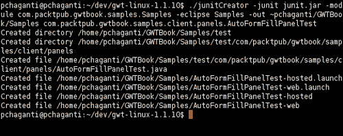
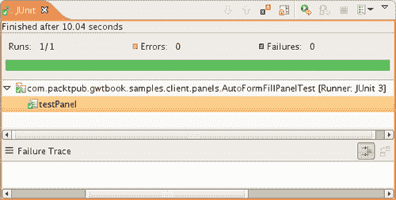
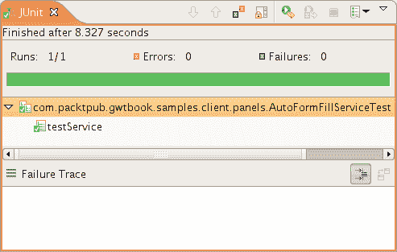
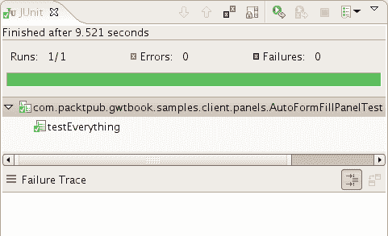
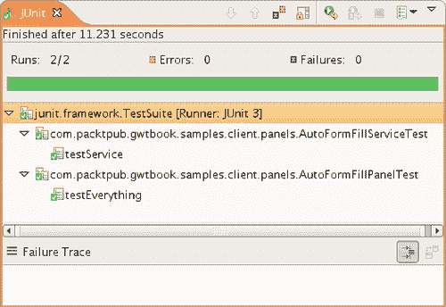

# 第八章：单元测试

JUnit 是一个广泛使用的开源 Java 单元测试框架，由 Erich Gamma 和 Kent Beck 创建（[`junit.org`](http://junit.org)）。它允许您逐步构建一套测试，作为开发工作的一个组成部分，并在很大程度上增加了您对代码稳定性的信心。JUnit 最初设计和用于测试 Java 类，但后来被模拟并用于其他几种语言，如 Ruby、Python 和 C#。GWT 利用并扩展了 JUnit 框架，以提供一种测试 AJAX 代码的方式，就像测试任何其他 Java 代码一样简单。在本章中，我们将学习如何创建和运行用于测试 GWT 应用程序和 RPC 服务的单元测试。

我们将要处理的任务是：

+   测试 GWT 页面

+   测试异步服务

+   测试具有异步服务的 GWT 页面

+   创建并运行测试套件

# 测试 GWT 页面

GWT 页面基本上由小部件组成，我们可以通过检查小部件的存在以及检查我们想要的小部件值或参数来测试页面。在本节中，我们将学习如何为 GWT 页面创建单元测试。

## 操作时间-创建单元测试

我们将使用内置在 GWT 框架中的测试支持来编写我们的单元测试，测试我们在第四章中创建的`AutoFormFillPanel`页面。

步骤如下：

1.  通过提供这些参数运行`GWT_HOME\junitCreator`命令脚本：

```java
junitCreator -junit junit.jar -module com.packtpub.gwtbook.samples. Samples -eclipse Samples -out ~pchaganti/dev/GWTBook/Samples com. packtpub.gwtbook.samples.client.panels.AutoFormFillPanelTest 

```



1.  在自动生成的 Java 文件`com.packtpub.gwtbook.samples.client.panels.AutoFormFillPanelTest.java`中打开测试目录中自动创建的测试目录中的文件：

```java
public void testPanel()
{
}

```

1.  创建表单并添加断言以检查“客户 ID”标签的名称和与之关联的样式：

```java
final AutoFormFillPanel autoFormFillPanel = new
AutoFormFillPanel();
assertEquals("Customer ID : ",
autoFormFillPanel.getCustIDLbl().getText());
assertEquals("autoFormItem-Label",
autoFormFillPanel.getCustIDLbl().getStyleName());

```

1.  添加类似的断言以测试页面上的所有其他元素：

```java
assertEquals("Address : ",
autoFormFillPanel.getAddressLbl().getText());
assertEquals("autoFormItem-Label",
autoFormFillPanel.getAddressLbl().getStyleName());
assertEquals("City : ",
autoFormFillPanel.getCityLbl().getText());
assertEquals("autoFormItem-Label",
autoFormFillPanel.getCityLbl().getStyleName());
assertEquals("First Name : ",
autoFormFillPanel.getFirstNameLbl().getText());
assertEquals("autoFormItem-Label",
autoFormFillPanel.getFirstNameLbl().getStyleName());
assertEquals("Last Name : ",
autoFormFillPanel.getLastNameLbl().getText());
assertEquals("autoFormItem-Label",
autoFormFillPanel.getLastNameLbl().getStyleName());
assertEquals("Phone Number : ",
autoFormFillPanel.getPhoneLbl().getText());
assertEquals("autoFormItem-Label",
autoFormFillPanel.getPhoneLbl().getStyleName());
assertEquals("State : ",
autoFormFillPanel.getStateLbl().getText());
assertEquals("autoFormItem-Label",
autoFormFillPanel.getStateLbl().getStyleName());
assertEquals("Zip Code : ",
autoFormFillPanel.getZipLbl().getText());
assertEquals("autoFormItem-Label",
autoFormFillPanel.getZipLbl()

```

1.  在`Samples.gwt.xml`文件中添加一个条目，以继承 JUnit 测试模块：

```java
<inherits name='com.google.gwt.junit.JUnit' />

```

1.  通过从“运行”菜单启动`AutoFormFillPanelTest-hosted`启动配置在 Eclipse 中运行测试，并获得类似于这样的屏幕：

### 刚刚发生了什么？

GWT 框架支持单元测试，提供了从 JUnit 测试库中扩展的`GWTTestCase`基类。我们通过编译和运行从`GWTTestCase`扩展的类来执行单元测试。当我们运行这个子类时，GWT 框架会启动一个不可见的 Web 浏览器，并在浏览器实例内运行测试。

我们使用 GWT 提供的`junitCreator`命令脚本生成必要的脚手架，用于创建和运行单元测试。我们将测试类的名称作为此命令的参数之一。生成一个扩展自`GWTTestCase`类的示例测试用例，以及两个启动脚本——一个用于在主机模式下运行，另一个用于在 Web 模式下运行。这些启动配置以 Eclipse 格式生成，并可以直接从 Eclipse 环境内运行。

扩展`GWTTestCase`的类必须实现`getModuleMethod()`并从该方法返回包含测试类的 GWT 模块的完全限定名称。因此，在我们的情况下，我们从这个方法返回`com.packtpub.gwtbook.samples.Samples`。这使得 GWT 能够解析依赖项并正确加载运行测试所需的类。如果我们在一个完全独立的模块中创建测试，这个方法将需要返回包含模块的名称。我们还需要在项目的模块文件中继承 GWT JUnit 模块。这就是为什么我们需要将这一行添加到`Samples.gwt.xml`文件中的原因：

```java
<inherits name='com.google.gwt.junit.JUnit' />

```

使用`junitCreator`是开始使用 GWT 中单元测试功能的最简单方法。但是，如果您决定自己创建此命令生成的各种工件，以下是创建和运行 GWT 项目中单元测试所涉及的步骤：

1.  创建一个扩展`GWTTestCase`的类。在这个类中实现`getModuleName()`方法，以返回包含此类的模块的完全限定名称。

1.  编译测试用例。为了运行您的测试，*必须*首先编译它。

1.  为了运行测试，您的`classpath`必须包括`junit-dev-linux.jar`或`gwt-dev-windows.jar`文件，以及`junit.jar`文件，除了正常的要求。

由于`GWTTestCase`只是`TestCase`的子类，因此您可以访问来自 JUnit 库的所有正常断言方法。您可以使用这些方法来断言和测试关于页面的各种事物，例如文档的结构，包括表格和其他 HTML 元素及其布局。

# 测试异步服务

在前一节中，我们学习了如何为单元测试 GWT 页面创建简单的测试。但是，大多数非平凡的 GWT 应用程序将访问和使用 AJAX 服务以异步方式检索数据。在本节中，我们将介绍测试异步服务的步骤，例如我们在本书前面创建的`AutoFormFillPanel`服务。

## 进行操作的时间-测试异步服务

我们将测试我们在第四章中创建的`AutoFormFillPanelService`：

1.  通过提供这些参数运行`GWT_HOME\junitCreator`命令脚本：

```java
junitCreator -junit junit.jar -module com.packtpub.gwtbook.samples. Samples -eclipse Samples -out ~pchaganti/dev/GWTBook/Samples com. packtpub.gwtbook.samples.client.panels.AutoFormFillServiceTest 

```

1.  在运行`junitCreator`命令时自动生成的测试目录中打开生成的 Java 文件`com.packtpub.gwtbook.samples.client.panels.AutoFormFillServiceTest.java`。在文件中添加一个名为`testService()`的新方法：

```java
public void testService()
{
}

```

1.  在`testService()`方法中，实例化`AutoFormFillService`并设置入口点信息：

```java
final AutoFormFillServiceAsync autoFormFillService =
(AutoFormFillServiceAsync) GWT.create
(AutoFormFillService.class);
ServiceDefTarget endpoint = (ServiceDefTarget)
autoFormFillService;
endpoint.setServiceEntryPoint("/Samples/autoformfill");

```

1.  创建一个新的异步回调，在`onSuccess()`方法中添加断言来测试调用服务返回的数据：

```java
AsyncCallback callback = new AsyncCallback()
{
public void onSuccess(Object result)
{
HashMap formValues = (HashMap) result;
assertEquals("Joe", formValues.get("first name"));
assertEquals("Customer", formValues.get("last name"));
assertEquals("123 peachtree street",
formValues.get("address"));
assertEquals("Atlanta", formValues.get("city"));
assertEquals("GA", formValues.get("state"));
assertEquals("30339", formValues.get("zip"));
assertEquals("770-123-4567", formValues.get("phone"));
finishTest();
}
};

```

1.  调用`delayTestFinish()`方法并调用异步服务：

```java
delayTestFinish(2000);
autoFormFillService.getFormInfo("1111", callback);

```

1.  通过在 Eclipse 中启动**Run**菜单中的`AutoFormFillPanelService-hosted`启动配置来运行测试。这是结果：

### 刚刚发生了什么？

JUnit 支持测试普通的 Java 类，但缺乏对具有任何异步行为的模块进行测试的支持。单元测试将开始执行并按顺序运行模块中的所有测试。这种方法对于测试异步事物不起作用，其中您发出请求并且响应分别返回。GWT 具有这种独特的功能，并支持对异步服务进行测试；因此，您可以调用 RPC 服务并验证来自服务的响应。

您还可以测试其他长时间运行的服务，例如计时器。为了提供此支持，`GWTTestCase`扩展了`TestCase`类并提供了两个方法-`delayTestFinish()`和`finishTest()`-它们使我们能够延迟完成单元测试，并控制测试实际完成的时间。这本质上让我们将我们的单元测试置于异步模式中，因此我们可以等待来自对远程服务器的调用的响应，并在收到响应时通过验证响应来完成测试。

在这个示例中，我们使用了 GWT 中测试长时间事件的标准模式。步骤如下：

1.  我们创建了一个异步服务的实例并设置了它的入口点。

1.  我们设置了一个异步事件处理程序，即我们的回调。在此回调中，我们通过断言返回的值与我们期望的值匹配来验证接收到的响应。然后，我们通过调用`finishTest()`完成测试，以指示 GWT 我们要离开测试中的异步模式：

```java
AsyncCallback callback = new AsyncCallback()
{
public void onSuccess(Object result)
{
HashMap formValues = (HashMap) result;
assertEquals("Joe", formValues.get("first name"));
assertEquals("Customer", formValues.get("last name"));
assertEquals("123 peachtree street",formValues.get
("address"));
assertEquals("Atlanta", formValues.get("city"));
assertEquals("GA", formValues.get("state"));
assertEquals("30339", formValues.get("zip"));
assertEquals("770-123-4567", formValues.get("phone"));
finishTest();
}
};

```

1.  我们为测试设置了一个延迟时间。这使得 GWT 测试框架等待所需的时间。在这里，我们设置了 2000 毫秒的延迟：

```java
delayTestFinish(2000);

```

这必须设置为一个比服务预计返回响应所需时间略长的时间段。

1.  最后，我们调用异步事件，将`callback`对象作为参数提供给它。在这种情况下，我们只调用`AutoFormFillService`上的必需方法：

```java
autoFormFillService.getFormInfo("1111", callback);

```

您可以使用此模式测试所有使用定时器的异步 GWT 服务和类。

# 使用异步服务测试 GWT 页面

在本节中，我们将测试调用异步服务的页面。这将使我们创建一个结合了前两个示例的测试。

## 行动时间-合并两者

我们将在最后两个部分中编写的两个测试合并为一个，并为`AutoFormFillPanel`页面创建一个全面的测试，测试页面元素和页面使用的异步服务。步骤如下：

1.  在`com.packtpub.gwtbook.samples.client.panels`包中的现有`AutoFormFillPanel`类中添加一个名为`simulateCustomerIDChanged()`的新方法：

```java
public void simulateCustIDChanged(String custIDValue)
{
if (custIDValue.length() > 0)
{
AsyncCallback callback = new AsyncCallback()
{
public void onSuccess(Object result)
{
setValues((HashMap) result);
}
};
custID.setText(custIDValue);
autoFormFillService.getFormInfo(custIDValue, callback);
}
else
{
clearValues();
}
}

```

1.  将`testPanel()`方法名称修改为`testEverything()`。在方法底部，调用`simulateCustIDChanged()`方法，并提供一个 ID 参数为 1111：

```java
autoFormFillPanel.simulateCustIDChanged("1111");

```

1.  创建一个新的`Timer`对象，并将以下内容添加到其`run()`方法中：

```java
Timer timer = new Timer()
{
public void run()
GWT pagewith asynchronous service, testing{
assertEquals("Joe",
autoFormFillPanel.getFirstName().getText());
assertEquals("Customer",
autoFormFillPanel.getLastName().getText());
assertEquals("123 peachtree street",
autoFormFillPanel.getAddress().getText());
assertEquals("Atlanta",
autoFormFillPanel.getCity().getText());
assertEquals("GA", autoFormFillPanel.getState().getText());
assertEquals("30339",
autoFormFillPanel.getZip().getText());
assertEquals("770-123-4567",
autoFormFillPanel.getPhone().getText());
finishTest();
}
};

```

1.  延迟测试完成并运行计时器：

```java
delayTestFinish(2000);
timer.schedule(100);

```

1.  通过启动`AutoFormFillPanelTest-hosted`启动配置来运行测试，并获得类似于此的结果：

### 刚刚发生了什么？

到目前为止，我们已经编写了两个单独的测试-一个用于测试`AutoFormFillPanel`页面上的各种 HTML 元素，另一个用于测试`AutoFormFillPanelService`。我们可以将这两个测试合并为一个，并创建一个用于测试面板的单个测试。`AutoFormFillPanel`在更改`CustomerID`文本框中的文本时调用异步服务。为了在测试中模拟键盘监听器，我们在`AutoFormFillPanel`类中创建了一个名为`simulateCustIDChanged()`的新公共方法，它本质上与该类中的键盘监听器事件处理程序执行相同的操作。我们将调用此方法来模拟用户在键盘上输入以更改`CustomerID`文本。

一旦我们测试了页面上的各种 HTML 元素，我们调用`simulateCustIDChanged()`方法。然后，我们使用`Timer`对象设置一个异步事件处理程序。当计时器运行时，我们验证面板中是否有正确的值，如步骤 3 中所述。

我们为测试设置延迟以完成：

```java
delayTestFinish(2000);

```

最后，我们安排计时器运行，因此当计时器在给定延迟后触发时，它将验证预期结果，然后完成测试：

```java
timer.schedule(100);

```

# 创建并运行测试套件

到目前为止，我们已经学会了如何创建和运行单独的单元测试。随着代码库的增长，逐一运行所有测试非常繁琐。JUnit 提供了测试套件的概念，它允许您将一组测试组合成一个套件并运行它们。在本节中，我们将学习如何创建和运行多个单元测试作为套件的一部分。

## 行动时间-部署测试套件

到目前为止，我们为创建的每个测试生成了一个测试启动脚本，并分别运行了创建的每个测试。在本节中，我们将把我们的测试组合成一个测试套件，并在单个启动配置中运行所有测试。步骤如下：

1.  运行`GWT_HOME\junitCreator`命令脚本，并提供以下参数：

```java
junitCreator -junit junit.jar -module com.packtpub.gwtbook.samples. Samples -eclipse Samples -out ~pchaganti/dev/GWTBook/Samplescom. packtpub.gwtbook.samples.client.SamplesTestSuite 

```

1.  修改`SamplesTestSuite`类并添加一个`suite()`方法：

```java
public static Test suite()
{
TestSuite samplesTestSuite = new TestSuite();
samplesTestSuite.addTestSuite(AutoFormFillServiceTest.class);
samplesTestSuite.addTestSuite(AutoFormFillPanelTest.class);
return samplesTestSuite;
}

```

1.  通过启动`SamplesTestSuite-hosted`启动配置来运行测试，并获得类似于此的结果：

### 刚刚发生了什么？

生成每个测试的单独启动脚本并分别运行每个测试可能会变得乏味。使用测试套件让我们可以有一个地方来收集所有的测试。然后我们可以使用套件的启动脚本来运行所有的测试。测试套件本质上是项目中所有测试的收集器。我们在项目中定义了一个名为`suite()`的静态工厂方法。在这个方法中，我们将所有的测试添加到`suite`对象中，并将`suite`对象作为返回值返回。

```java
public static Test suite()
{
TestSuite samplesTestSuite = new TestSuite();
samplesTestSuite.addTestSuite(AutoFormFillServiceTest.class);
samplesTestSuite.addTestSuite(AutoFormFillPanelTest.class);
return samplesTestSuite;
}

```

当我们通过启动脚本运行这个测试时，JUnit 框架会识别出我们正在运行一组测试，并运行套件中定义的每个测试。目前还没有支持推断出 GWT 项目中所有测试并自动生成测试套件来包含这些测试的功能。因此，您必须手动将希望成为套件一部分的每个测试添加到这个方法中。现在我们已经让测试套件工作了，我们可以从`Samples`项目中删除所有其他测试启动配置，只使用这个配置来运行所有的测试。

# 总结

在本章中，我们学习了为 GWT 页面（`AutoFormFillPanel`）和异步服务（`AutoFormFillPanelService`）创建单元测试。然后我们将这两者结合起来，为使用异步服务的 GWT 页面创建了一个单元测试。

最后，我们将所有的测试组合成一个测试套件，并在单个启动配置中运行了所有的测试。

在下一章中，我们将学习 GWT 中的国际化（I18N）和 XML 支持。
