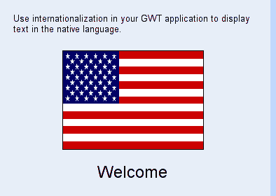
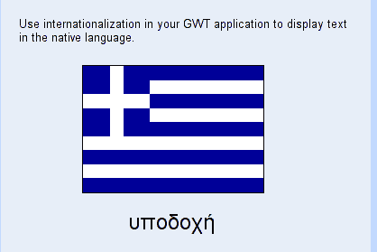
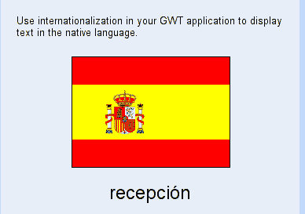
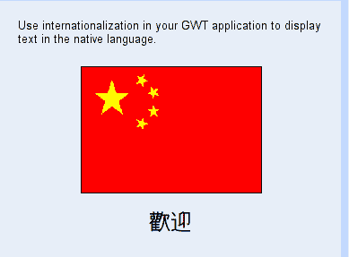
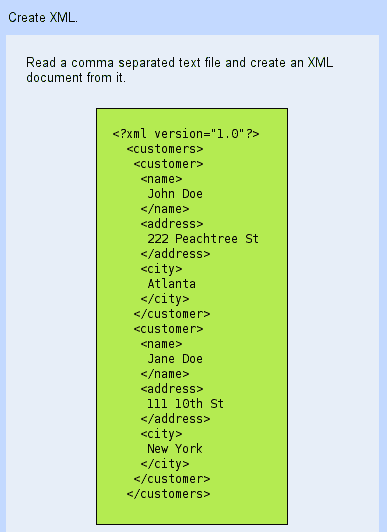
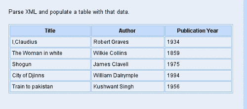

# 第九章：I18N 和 XML

在本章中，我们将学习如何在 GWT 应用程序中使用国际化。我们还将创建展示 GWT 支持客户端创建和解析 XML 文档的示例。

我们将要处理的任务是：

+   国际化

+   创建 XML 文档

+   解析 XML 文档

# 国际化（I18N）

GWT 提供了广泛的支持，可以创建能够以多种语言显示文本的应用程序。在本节中，我们将利用 GWT 创建一个页面，可以根据给定的区域设置显示适当语言的文本。

## 行动时间-使用 I18N 支持

我们将创建一个简单的 GWT 用户界面，显示指定区域设置的适当图像和文本“欢迎”。显示的图像将是对应于所选区域设置的国旗。步骤如下：

1.  在`com.packtpub.gwtbook.samples.client.util`包中创建一个名为`I18NSamplesConstants.java`的新的 Java 文件，定义一个名为`I18NSamplesConstants`的接口。向接口添加以下两个方法-一个用于检索欢迎文本，一个用于检索图像：

```java
public interface I18NSamplesConstants extends Constants
{
String welcome();
String flag_image();
}

```

1.  在`com.packtpub.gwtbook.samples.client.util`包中创建一个名为`I18NSamplesConstants.properties`的新文件。向其中添加欢迎文本和图像的属性：

```java
welcome = Welcome
flag_image = flag_en.gif

```

这个属性文件代表了默认的区域设置，即美国英语。

1.  在`com.packtpub.gwtbook.samples.client.util`包中创建一个名为`I18NSamplesConstants_el_GR.properties`的新文件。向其中添加欢迎文本和图像的属性：

```java
welcome = υποδοχή
flag_image = flag_el_GR.gif

```

这个属性文件代表了希腊的区域设置。

1.  在`com.packtpub.gwtbook.samples.client.util`包中创建一个名为`I18NSamplesConstants_es_ES.properties`的新文件。向其中添加欢迎文本和图像的属性：

```java
welcome = recepción
flag_image = flag_es_ES.gif

```

这个属性文件代表了西班牙的区域设置。

1.  在`com.packtpub.gwtbook.samples.client.util`包中创建一个名为`I18NSamplesConstants_zh_CN.properties`的新文件。向其中添加欢迎文本和图像的属性：

```java
welcome = 
flag_image = flag_zh_CN.gif

```

这个属性文件代表了中文的区域设置。

1.  在`com.packtpub.gwtbook.samples.client.panels`包中创建一个名为`I18NPanel.java`的新的 Java 文件。创建一个将包含用户界面的`VerticalPanel`。我们将把这个面板添加到`DockPanel`中，并将其添加到我们的`Samples`应用程序中，就像我们在本书中一直在做的其他应用程序一样。添加一个标签，用于以提供的区域设置的适当语言显示欢迎文本消息：

```java
private VerticalPanel workPanel = new VerticalPanel();
private Label welcome = new Label();

```

1.  在构造函数中创建`I18NSamplesConstants`的实例。添加一个图像小部件来显示国旗图像，以及一个标签来显示欢迎文本到面板上。通过使用`I18NSamplesConstants`来设置标签和图像文件的文本。最后，创建一个小的信息面板，显示关于这个应用程序的描述性文本，这样当我们在`Samples`应用程序的可用示例列表中选择此示例时，我们可以显示文本。将信息面板和工作面板添加到一个停靠面板中，并初始化小部件：

```java
public I18nPanel()
{
I18NSamplesConstants myConstants = (I18NSamplesConstants)
GWT.create(I18NSamplesConstants.class);
// Always the same problem, samples are not "sound
and complete"
welcome.setText(myConstants.welcome());
welcome.setStyleName("flagLabel");
Image flag = new Image("images/" + myConstants.flag_image());
flag.setStyleName("flag");
workPanel.add(flag);
workPanel.add(welcome);
DockPanel workPane = new DockPanel();
workPane.add(infoPanel, DockPanel.NORTH);
workPane.add(workPanel, DockPanel.CENTER);
workPane.setCellHeight(workPanel, "100%");
workPane.setCellWidth(workPanel, "100%");
initWidget(workPane);
internationalization, GWTI18N support, using}

```

1.  添加一个条目来导入 I18N 模块到`Samples.gwt.xml`文件中：

```java
<inherits name ="com.google.gwt.i18n.I18N"/>

```

1.  为我们支持的每个区域设置添加一个条目到`Samples.gwt.xml`文件中：

```java
<extend-property name="locale" values="el_GR"/>
<extend-property name="locale" values="es_ES"/>
<extend-property name="locale" values="zh_CN"/>

```

运行应用程序。这是以默认区域设置显示的默认界面-`en_US:`



修改 URL，为我们支持的每个区域设置添加一个区域查询参数，以便以适当的语言显示用户界面。这是以希腊语显示的用户界面-`el_GR:`

```java
http://localhost:8888/com.packtpub.gwtbook.samples.Samples/Samples.html?locale=el_GR#i18n

```



这是以西班牙语显示的用户界面-`es_ES:`

```java
http://localhost:8888/com.packtpub.gwtbook.samples.Samples/Samples.html?locale=es_ES#i18n

```



这是以中文显示的用户界面-`zh_CN:`

```java
http://localhost:8888/com.packtpub.gwtbook.samples.Samples/Samples.html?locale=zh_CN#i18n

```



### 刚刚发生了什么？

GWT 提供了各种工具和技术，帮助开发可以显示各种语言文本的国际化应用程序。使用 GWT 开发国际化应用程序有两种主要技术：

+   静态字符串国际化：这是一种依赖于 Java 接口和常规属性文件的类型安全技术。它从前两个组件生成代码，为应用程序提供了意识到其操作环境的区域设置的消息。这种技术推荐用于没有现有本地化属性文件的新应用程序。

+   动态字符串国际化：当您已经有现有的本地化系统时，例如您的 Web 服务器可以生成本地化字符串时，可以使用此技术。然后在 HTML 页面中打印这些翻译后的字符串。这种方法通常比静态方法慢，但由于它没有代码生成阶段，因此每次修改消息字符串或更改支持的区域设置列表时，您不需要重新编译应用程序。

在此示例中，我们使用静态国际化技术。我们创建一个接口`I18NSamplesConstants`，定义两个方法——一个方法返回欢迎消息，另一个方法返回标志图像文件名。然后为应用程序支持的每个区域设置创建一个属性文件，并将消息添加到适当语言的文件中。

`locale`是一个唯一标识特定语言和地区组合的对象。例如，`en_US`的区域设置指的是英语和美国。同样，`fr_FR`指的是法语和法国。属性文件名必须以区域标识符结尾，然后是`properties`扩展名。这是我们西班牙语区域西班牙属性文件的内容：

```java
welcome = recepción
flag_image = flag_es_ES.gif

```

我们的用户界面非常简单，由一个图像和其下的标签组成。图像将显示使用的区域设置的国旗，标签将显示欢迎文本的语言。应用程序在启动时将以您的环境的默认区域设置显示页面。您可以通过附加一个查询参数，键为`locale`，值等于任何支持的区域设置，来更改这一点。因此，为了以希腊语查看页面，您将在相应的 URL 后附加`locale=el_GR`。

如果提供的区域设置不受支持，网页将以默认区域设置显示。我们通过创建`I18NSamplesConstants`类来访问适当的文本，使用访问器获取本地化消息，并为两个小部件设置值：

```java
I18NSamplesConstants myConstants = (I18NSamplesConstants)
GWT.create(I18NSamplesConstants.class);
welcome.setText(myConstants.welcome());
Image flag = new Image("images/" + myConstants.flag_image());

```

`I18NSamplesConstants`类扩展自`Constants`类，它允许在编译时绑定到从简单属性文件获取的常量值。当我们使用`GWT.create()`方法实例化`I18NSamplesConstants`时，GWT 会自动生成使用适当区域设置的属性文件值的正确子类，并返回它。支持的区域设置本身由模块文件定义，使用 extend-property 标签。这通知 GWT 框架，我们要扩展默认属性"locale"，提供其替代方案：

```java
<extend-property name="locale" values="el_GR"/>

```

我们还在`Samples.gwt.xml`文件中继承自`com.google.gwt.i18n.I18N`，以便我们的模块可以访问 GWT 提供的 I18N 功能。

GWT 还提供了其他几种工具来增强 I18N 支持。有一个`Messages`类，当我们想要提供带有参数的本地化消息时可以使用它。我们也可以忽略本地化，使用常规的属性文件来存储配置信息。我们还有一个`i18nCreator`命令脚本，可以生成`Constants`或`Messages`接口和示例属性文件。最后，还有一个`Dictionary`类可用于动态国际化，因为它提供了一种动态查找在模块的 HTML 页面中定义的键值对字符串的方式。

GWT 中的 I18N 支持非常广泛，可以用于支持简单或复杂的国际化场景。

# 创建 XML 文档

XML 在企业中被广泛应用于各种应用程序，并且在集成不同系统时也非常常见。在本节中，我们将学习 GWT 的 XML 支持以及如何在客户端使用它来创建 XML 文档。

## 行动时间-创建 XML 文档

我们将获取存储在 CSV 文件中的客户数据，并创建一个包含客户数据的 XML 文档。步骤如下：

1.  在`com.packtpub.gwtbook.samples.public`包中创建一个简单的 CSV 文件，其中包含客户数据，文件名为`customers.csv`。向此文件添加两个客户的信息：

```java
John Doe,222 Peachtree St,Atlanta
Jane Doe,111 10th St,New York

```

1.  在`com.packtpub.gwtbook.samples.client.panels`包中的新 Java 文件`CreateXMLPanel.java`中创建用户界面。创建一个私有的`HTMLPanel`变量，用于显示我们将要创建的 XML 文档。还创建一个`VerticalPanel`类，它将是用户界面的容器：

```java
private HTMLPanel htmlPanel = new HTMLPanel("<pre></pre>");
private VerticalPanel workPanel = new VerticalPanel();

```

1.  创建一个名为`createXMLDocument()`的私有方法，它可以接受一个字符串并从中创建客户的 XML 文档。创建一个 XML 文档对象，添加 XML 版本的处理指令，并创建一个名为`customers`的根节点。循环遍历 CSV 文件中每一行的客户信息。创建适当的 XML 节点，设置它们的值，并将它们添加到根节点。最后返回创建的 XML 文档：

```java
private Document createXMLDocument(String data)
{
String[] tokens = data.split("\n");
Document customersDoc = XMLParser.createDocument();
ProcessingInstruction procInstruction = customersDoc. createProcessingInstruction("xml", "version=\"1.0\"");
customersDoc.appendChild(procInstruction);
Element rootElement =
customersDoc.createElement("customers");
customersDoc.appendChild(rootElement);
for (int i = 0; i < tokens.length; i++)
{
String[] customerInfo = tokens[i].split(",");
Element customerElement =
customersDoc.createElement("customer");
Element customerNameElement =
customersDoc.createElement("name");
customerNameElement.appendChild
(customersDoc.createTextNode(customerInfo[0]));
XML support, Element customerAddressElement =
customersDoc.createElement("address");
customerAddressElement.appendChild
(customersDoc.createTextNode(customerInfo[1]));
Element customerCityElement =
customersDoc.createElement("city");
customerCityElement.appendChild
(customersDoc.createTextNode(customerInfo[2]));
customerElement.appendChild(customerNameElement);
customerElement.appendChild(customerAddressElement);
customerElement.appendChild(customerCityElement);
rootElement.appendChild(customerElement);
}
return customersDoc;
}

```

1.  创建一个名为`createPrettyXML()`的新方法，它将通过缩进节点来格式化我们的 XML 文档，然后在`HTMLPanel`中显示：

```java
private String createPrettyXML(Document xmlDoc)
{
String xmlString = xmlDoc.toString();
xmlString = xmlString.replaceAll
("<customers", "&nbsp;&nbsp;<customers");
xmlString = xmlString.replaceAll
("</customers","&nbsp;&nbsp;</customers");
xmlString = xmlString.replaceAll
("<customer>","&nbsp;&nbsp;&nbsp;<customer>");
xmlString = xmlString.replaceAll
("</customer>","&nbsp;&nbsp;&nbsp;</customer>");
xmlString = xmlString.replaceAll("<name>",
"&nbsp;&nbsp;&nbsp;&nbsp;<name>&nbsp;&nbsp;
&nbsp;&nbsp;&nbsp;");
xmlString = xmlString.replaceAll("</name>",
"\n&nbsp;&nbsp;&nbsp;&nbsp;</name>");
xmlString = xmlString.replaceAll("<address>",
"&nbsp;&nbsp;&nbsp;&nbsp;<address>&nbsp;&nbsp;
&nbsp;&nbsp;&nbsp;");
xmlString = xmlString.replaceAll("</address>",
"\n&nbsp;&nbsp;&nbsp;&nbsp;</address>");
xmlString = xmlString.replaceAll("<city>",
"&nbsp;&nbsp;&nbsp;&nbsp;<city>&nbsp;&nbsp;
&nbsp;&nbsp;&nbsp;");
xmlString = xmlString.replaceAll("</city>",
"\n&nbsp;&nbsp;&nbsp;&nbsp;</city>");
xmlString = xmlString.replaceAll(">", ">\n");
xmlString = xmlString.replaceAll("<", "");
xmlString = xmlString.replaceAll(">", "");
return xmlString;
}

```

这只是一种快速而粗糙的格式化 XML 文档的方式，因为 GWT 目前没有提供一个很好的方法来做到这一点。

1.  在`com.packtpub.gwtbook.samples.client.panels`包中的新 Java 文件`CreateXMLPanel.java`中为此应用程序创建用户界面。在构造函数`CreateXMLPanel()`中，进行异步 HTTP 请求以获取`customers.csv`文件。成功后，从 CSV 文件中的数据创建 XML 文档，并在`HTMLPanel`中显示它。最后，创建一个小的信息面板，显示关于此应用程序的描述性文本，以便在`Samples`应用程序的可用样本列表中选择此样本时显示文本。将信息面板和工作面板添加到一个停靠面板中，并初始化小部件：

```java
public CreateXMLPanel()
{
HorizontalPanel infoPanel = new HorizontalPanel();
infoPanel.add(new HTML(
"<div class='infoProse'>Read a comma separated text file
and create an XML document from it.</div>"));
HTTPRequest.asyncGet("customers.csv",
new ResponseTextHandler()
{
public void onCompletion(String responseText)
{
Document customersDoc = createXMLDocument(responseText);
if (htmlPanel.isAttached())
{
workPanel.remove(htmlPanel);
}
htmlPanel = new HTMLPanel("<pre>" +
createPrettyXML(customersDoc) + "</pre>");
htmlPanel.setStyleName("xmlLabel");
workPanel.add(htmlPanel);
}
});
DockPanel workPane = new DockPanel();
workPane.add(infoPanel, DockPanel.NORTH);
workPane.add(workPanel, DockPanel.CENTER);
workPane.setCellHeight(workPanel, "100%");
workPane.setCellWidth(workPanel, "100%");
initWidget(workPane);
}

```

1.  在`Samples.gwt.xml`文件中添加一个条目来导入 XML 模块：

```java
<inherits name ="com.google.gwt.xml.XML"/>

```

这是显示从客户的 CSV 文件创建的 XML 文档的页面：



### 刚刚发生了什么？

GWT 在客户端提供了良好的支持，用于生成 XML 文档，并且与框架中的其他所有内容一样，它是与浏览器无关的。您可以利用`XMLParser`类来生成文档，并且可以确保在所有支持的浏览器中正确生成 XML 文档。在这个例子中，我们创建了一个包含客户数据的简单 CSV 文件。通过在`HTTPRequest`对象上使用`asyncGet()`方法检索此客户数据。由于 GWT 没有提供从文件系统中读取文件的支持，这是一种加载外部文件的解决方法，而不是使用 RPC 服务。我们将文件名和`ResponseTextHandler`作为此方法的参数。`ResponseTextHandler`提供了在同步调用完成时执行的回调。在回调中，我们读取响应的内容并使用这些值创建一个 XML 文档。通过使用`XMLParser`对象创建一个新文档：

```java
Document customersDoc = XMLParser.createDocument();

```

首先向此文档添加了一个处理指令，以便 XML 格式良好：

```java
ProcessingInstruction procInstruction =
customersDoc.createProcessingInstruction("XML", "version=\"1.0\"");
customersDoc.appendChild(procInstruction);

```

然后我们创建根节点和子节点。我们向新节点添加一个文本节点，该节点的值是我们从 CSV 文件中解析出的值：

```java
customersDoc.createElement("name");
customerNameElement.appendChild
(customersDoc.createTextNode(customerInfo[0]));

```

这个新文档是通过在`HTMLPanel`中使用预格式化块来显示的。然而，在将其显示在面板中之前，我们需要对文本进行格式化和缩进，否则整个文档将显示为一行字符串。我们有一个私有方法，通过使用正则表达式来缩进和格式化文档。这有点繁琐。希望将来 GWT 将支持在框架本身创建漂亮的 XML 文档。在这个例子中，我们通过 HTTP 请求检索 CSV 文件的内容；我们可以使用 RPC 服务以任何我们喜欢的格式提供生成 XML 的数据。

# 解析 XML 文档

在上一节中，我们使用了 GWT 支持创建 XML 文档。在本节中，我们将学习如何读取 XML 文档。我们将创建一个可以解析 XML 文件并使用文件中的数据填充表格的应用程序。

## Time for Action—Parsing XML on the Client

我们将创建一个 GWT 应用程序，该应用程序可以读取包含有关一些书籍信息的 XML 文件，并用该数据填充表格。步骤如下：

1.  在`com.packtpub.gwtbook.samples.client.public`包中创建一个名为`books.xml`的文件，其中包含书籍数据的简单 XML 文件：

```java
<?xml version="1.0" encoding="US-ASCII"?>
<books>
<book id="1">
<title>I Claudius</title>
<author>Robert Graves</author>
<year>1952</year>
</book>
<book id="2">
<title>The Woman in white</title>
<author>Wilkie Collins</author>
<year>1952</year>
</book>
<book id="3">
<title>Shogun</title>
<author>James Clavell</author>
<year>1952</year>
</book>
<book id="4">
<title>City of Djinns</title>
<author>William Dalrymple</author>
<year>2003</year>
</book>
<book id="5">
<title>Train to pakistan</title>
<author>Kushwant Singh</author>
<year>1952</year>
</book>
</books>

```

1.  在`com.packtpub.gwtbook.samples.client.panels`包中的新 Java 文件`ParseXMLPanel.java`中为此应用程序创建用户界面。创建一个包含我们用户界面的`VerticalPanel`类，以及我们将用于显示来自 XML 文件的数据的`FlexTable`类：

```java
private VerticalPanel workPanel = new VerticalPanel();
private FlexTable booksTable = new FlexTable();

```

1.  创建一个名为`getElementTextValue()`的私有方法，该方法可以接受一个父 XML 元素和一个标签名称，并返回该节点的文本值：

```java
private String getElementTextValue
(Element parent, String elementTag)
{
return parent.getElementsByTagName
(elementTag).item(0).getFirstChild().getNodeValue();
}

```

1.  在构造函数`ParseXMLPanel()`中，为 flex 表添加表头和样式：

```java
booksTable.setWidth(500 + "px");
booksTable.setStyleName("xmlParse-Table");
booksTable.setBorderWidth(1);
booksTable.setCellPadding(4);
booksTable.setCellSpacing(1);
booksTable.setText(0, 0, "Title");
booksTable.setText(0, 1, "Author");
booksTable.setText(0, 2, "Publication Year");
RowFormatter rowFormatter = booksTable.getRowFormatter();
rowFormatter.setStyleName(0, "xmlParse-TableHeader");

```

1.  在同一个构造函数中，发出异步 HTTP 请求以获取`books.xml`文件，并在完成后解析 XML 文档并用数据填充一个 flex 表。最后，创建一个小的信息面板，显示有关此应用程序的描述性文本，以便在我们的`Samples`应用程序的可用样本列表中选择此样本时显示文本。将信息面板和工作面板添加到一个停靠面板中，并初始化小部件：

```java
HTTPRequest.asyncGet("books.xml", new ResponseTextHandler()
{
public void onCompletion(String responseText)
{
Document bookDom = XMLParser.parse(responseText);
Element booksElement = bookDom.getDocumentElement();
XMLParser.removeWhitespace(booksElement);
NodeList bookElements =
booksElement.getElementsByTagName("book");
for (int i = 0; i < bookElements.getLength(); i++)
{
Element bookElement = (Element) bookElements.item(i);
booksTable.setText(i + 1, 0, getElementTextValue(
bookElement, "title"));
booksTable.setText(i + 1, 1, getElementTextValue(
bookElement, "author"));
booksTable.setText(i + 1, 2, getElementTextValue(
bookElement, "year"));
}
}
});
DockPanel workPane = new DockPanel();
workPanel.add(booksTable);
workPane.add(infoPanel, DockPanel.NORTH);
workPane.add(workPanel, DockPanel.CENTER);
workPane.setCellHeight(workPanel, "100%");
workPane.setCellWidth(workPanel, "100%");
initWidget(workPane);

```

这是包含来自`books.xml`文件的数据的表格的页面：



### 刚刚发生了什么？

我们再次使用`HTTPRequest`对象从服务器检索文件的内容，在这种情况下是`books.xml`文件，其中包含一些关于已出版图书的数据，我们希望在页面上以表格的形式显示出来。`XMLParser`对象被用来将异步响应的内容读入文档中。然后使用熟悉的 DOM API 遍历这个 XML 文档，并检索和使用适当节点的文本值来填充 flex 表中的相应列单元格。我们使用`getElementsByTagName()`方法获取包含所有图书元素的`NodeList`：

```java
NodeList bookElements = booksElement.getElementsByTagName("book");

```

一旦我们有了这个列表，我们只需遍历它的子节点，并访问我们感兴趣的值：

```java
for (int i = 0; i < bookElements.getLength(); i++)
{
Element bookElement = (Element) bookElements.item(i);
booksTable.setText(i + 1, 0, getElementTextValue(
bookElement, "title"));
booksTable.setText(i + 1, 1, getElementTextValue(
bookElement, "author"));
booksTable.setText(i + 1, 2, getElementTextValue(
bookElement, "year"));
}

```

我们在`Samples.gwt.xml`文件中继承自`com.google.gwt.xml.xml`文件，以便我们的模块可以访问 GWT 提供的 XML 功能。

# 总结

在本章中，我们学习了如何创建支持国际化（I18N）的应用程序。我们创建了一个可以根据给定区域设置显示适当语言文本的页面。然后，我们使用 GWT 的 XML 支持在客户端创建了一个 XML 文档。

最后，我们创建了一个可以解析 XML 文件并使用文件中的数据填充表格的应用程序。

在下一章中，我们将学习如何在 Tomcat 中部署我们的 GWT 应用程序。
