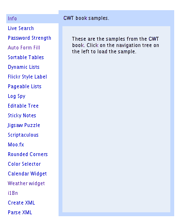
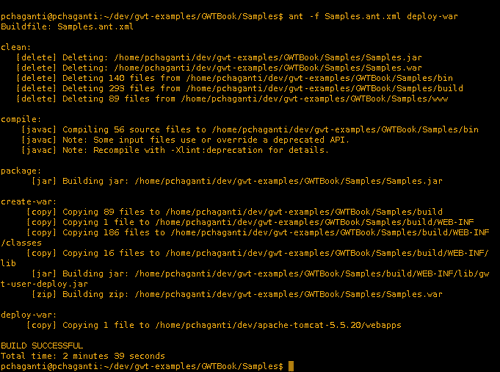
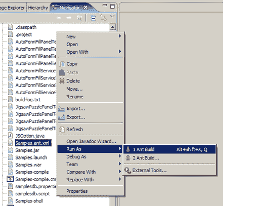
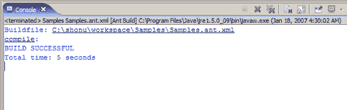
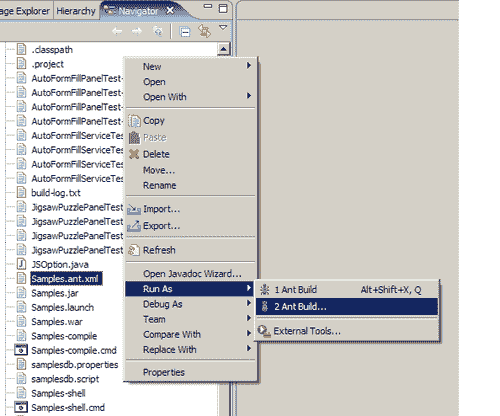
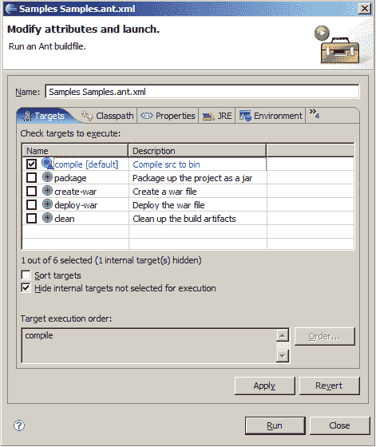
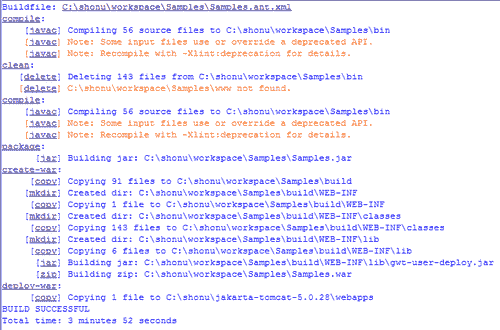

# 第十章：部署

在本章中，我们将首先学习如何手动部署 GWT 应用程序，以便熟悉部署的所有组件。然后，我们将使用 Apache Ant 自动化这个过程。

我们将要处理的任务是：

+   在 Tomcat 中手动部署

+   使用 Ant 进行自动部署

+   从 Eclipse 部署

# 在 Tomcat 中手动部署

我们将采取在本书中一直在进行的`Samples`应用程序，并逐步进行手动部署并在 Tomcat 中运行所需的各种步骤。

## 行动时间-部署 GWT 应用程序

以下是手动部署 GWT 应用程序到 Tomcat 所需的步骤：

1.  下载并安装适用于您平台的 Apache Tomcat（[`tomcat.apache.org`](http://tomcat.apache.org)）。从 5.x 系列中选择最新的稳定版本。我将把 Tomcat 安装的目录称为`$TOMCAT_DIR`，包含`Samples`项目的目录称为`$SAMPLES_DIR`。

1.  运行`$SAMPLES_DIR/Samples-compile`来编译整个应用程序。这将在`$SAMPLES_DIR`下创建一个名为`www`的新目录。

1.  在`$SAMPLES_DIR`目录中创建一个名为`web.xml`的新文件。为我们的应用程序添加一个显示名称和描述：

```java
<display-name>
GWT Book Samples
</display-name>
<description>
GWT Book Samples
</description>

```

显示名称在使用 Tomcat 管理器浏览部署应用程序列表时显示。

1.  在上一步创建的`web.xml`文件中，为我们应用程序中使用的每个 RPC 服务添加条目，并为每个条目添加相应的 servlet 映射。为实时搜索服务添加一个条目：

```java
<servlet>
<servlet-name>livesearch</servlet-name>
<servlet-class>
com.packtpub.gwtbook.samples.server.
LiveSearchServiceImpl
</servlet-class>
</servlet>
<servlet-mapping>
<servlet-name>livesearch</servlet-name>
<url-pattern>/livesearch</url-pattern>
</servlet-mapping>

```

1.  为密码强度服务添加一个条目：

```java
<servlet>
<servlet-name>pwstrength</servlet-name>
<servlet-class>
com.packtpub.gwtbook.samples.server.
PasswordStrengthServiceImpl
</servlet-class>
</servlet>
<servlet-mapping>
<servlet-name>pwstrength</servlet-name>
<url-pattern>/pwstrength</url-pattern>
</servlet-mapping>

```

1.  为自动表单填充服务添加一个条目：

```java
<servlet>
<servlet-name>autoformfill</servlet-name>
<servlet-class>
com.packtpub.gwtbook.samples.server.
AutoFormFillServiceImpl
</servlet-class>
</servlet>
<servlet-mapping>
<servlet-name>autoformfill</servlet-name>
<url-pattern>/autoformfill</url-pattern>
</servlet-mapping>

```

1.  为动态列表服务添加一个条目：

```java
<servlet>
<servlet-name>dynamiclists</servlet-name>
<servlet-class>
com.packtpub.gwtbook.samples.server.
DynamicListsServiceImpl
</servlet-class>
</servlet>
<servlet-mapping>
<servlet-name>dynamiclists</servlet-name>
<url-pattern>/dynamiclists</url-pattern>
</servlet-mapping>

```

1.  为可分页数据服务添加一个条目：

```java
<servlet>
<servlet-name>pageabledata</servlet-name>
<servlet-class>
com.packtpub.gwtbook.samples.server.
PageableDataServiceImpl
</servlet-class>
</servlet>
<servlet-mapping>
<servlet-name>pageabledata</servlet-name>
<url-pattern>/pageabledata</url-pattern>
</servlet-mapping>

```

1.  为实时数据网格服务添加一个条目：

```java
<servlet>
<servlet-name>livedatagrid</servlet-name>
<servlet-class>
com.packtpub.gwtbook.samples.server.
LiveDatagridServiceImpl
</servlet-class>
</servlet>
<servlet-mapping>
<servlet-name>livedatagrid</servlet-name>
<url-pattern>/livedatagrid</url-pattern>
</servlet-mapping>

```

1.  为日志监听服务添加一个条目：

```java
<servlet>
<servlet-name>logspy</servlet-name>
<servlet-class>
com.packtpub.gwtbook.samples.server.
LogSpyServiceImpl
</servlet-class>
</servlet>
<servlet-mapping>
<servlet-name>logspy</servlet-name>
<url-pattern>/logspy</url-pattern>
</servlet-mapping>

```

1.  为天气服务添加一个条目：

```java
<servlet>
<servlet-name>weather</servlet-name>
<servlet-class>
com.packtpub.gwtbook.widgets.server.
WeatherServiceImpl
</servlet-class>
</servlet>
<servlet-mapping>
<servlet-name>weather</servlet-name>
<url-pattern>/weather</url-pattern>
</servlet-mapping>

```

1.  为欢迎文件添加一个条目，并将欢迎文件设置为我们应用程序的主 HTML 页面`Samples.html`：

```java
<welcome-file-list>
<welcome-file>
Samples.html
</welcome-file>
</welcome-file-list>

```

1.  在`www/com.packtpub.gwtbook.samples.Samples`目录下创建一个名为`WEB-INF`的新目录。在`WEB-INF`目录下创建两个子目录`lib`和`classes`。

1.  将上述`web.xml`文件复制到`WEB-INF`目录。

1.  将`$SAMPLES_DIR/bin`目录的内容复制到`WEB-INF/classes`目录。

1.  将`$SAMPLES_DIR/lib`目录的内容复制到`WEB-INF/lib`目录。

1.  将`www/com.packtpub.gwtbook.samples.Samples`目录复制到`$TOMCAT_DIR/webapps`。

1.  启动 Tomcat。一旦它启动，转到以下 URL 以查看我们在本书中创建的`Samples`应用程序：

`http://localhost:8080/com.packtpub.gwtbook.samples.Samples/`



### 刚刚发生了什么？

编译 GWT 应用程序会在`www`目录中生成应用程序的 HTML 和 JavaScript。这包含了用户界面所需的所有组件，并且实际上可以在任何 Web 服务器上运行。但是，如果您使用了任何 RPC 服务，则需要确保服务所需的任何第三方 JAR 文件以及服务和支持类与`www`目录的内容一起部署到 Servlet 容器中。我们选择了 Tomcat，因为它是最广泛使用的 Servlet 容器之一，并且是 JSP 和 Servlet 规范的参考实现。我们也可以将我们的应用程序部署到其他容器，如 Geronimo、JBoss、WebSphere、JOnAS 或 Weblogic。

部署到诸如 Tomcat 之类的 servlet 容器意味着我们需要结构化我们的部署以模仿 WAR 格式。因此，我们需要确保我们应用程序的所有 Java 类都在`WEB-INF/classes`目录中可用，并且我们应用程序使用的所有 JAR 文件都需要在`WEB-INF/lib`目录中。因此，我们将这些工件复制到这些目录。我们还创建一个部署描述符，Tomcat 需要识别我们的部署。这个文件是`web.xml`，它需要被复制到`WEB-INF`目录中。

一旦我们在`www/com.packtpub.gwtbook.samples.Samples`目录中准备好一切，我们将`com.packtpub.gwtbook.samples.Samples`复制到 Tomcat 的 Web 应用程序目录`$TOMCAT_DIR/webapps`。然后我们启动 Tomcat，启动时将从`web.xml`文件中注册应用程序，并使其在上下文`com.packtpub.gwtbook.samples.Samples`中可用。

# 使用 Ant 进行自动部署

我们将通过使用 Apache Ant 让 Ant 处理我们的 GWT 应用程序的部署，从而使我们的工作变得更加轻松，减少繁琐的工作。我们将通过使用 Apache Ant 自动化我们在上一节中所做的一切。

## 操作时间-创建 Ant 构建文件

以下是自动部署到 Tomcat 的步骤：

1.  我们将修改在第三章中运行`applicationCreator`创建的`$SAMPLES_DIR/Samples.ant.xml`文件，以创建全局属性来引用各种目录：

```java
<property name="tmp" value="${basedir}/build" />
<property name="www" value=
"${basedir}/www/com.packtpub.gwtbook.samples.Samples" />
<property name="lib" value="${basedir}/lib" />
<property name="classes" value="${basedir}/bin" />
<property name="gwt-home" value="/gwt-windows-1.3.1" />
<property name="deploy-dir" value=
" /shonu/jakarta-tomcat-5.0.28/webapps" />

```

1.  将我们在编译时需要的 JAR 文件添加到`classpath`中：

```java
<pathelement path="${lib}/junit.jar"/>
<pathelement path="${lib}/widgets.jar"/>
<pathelement path="${lib}/gwt-widgets-0.1.3.jar"/>

```

1.  修改`clean`目标以包括其他要清除的工件：

```java
<target name="clean" description=
"Clean up the build artifacts">
<delete file="Samples.jar"/>
<delete file="Samples.war"/>
<delete>
<fileset dir="bin" includes="**/*.class"/>
<fileset dir="build" includes="**/*"/>
<fileset dir="www" includes="**/*"/>
</delete>
</target>

```

1.  创建一个名为`create-war:`的新目标。

```java
<target name="create-war" depends="package" description=
"Create a war file">
<mkdir dir="${tmp}"/>
<exec executable="${basedir}/Samples-compile.cmd"
output="build-log.txt"/>
<copy todir="${tmp}">
<fileset dir="${www}" includes="**/*.*"/>
</copy>
<mkdir dir="${tmp}/WEB-INF" />
<copy todir="${tmp}/WEB-INF">
<fileset dir="${basedir}" includes="web.xml"/>
</copy>
<mkdir dir="${tmp}/WEB-INF/classes" />
<copy todir="${tmp}/WEB-INF/classes">
<fileset dir="${basedir}/bin" includes="**/*.*"/>
</copy>
<mkdir dir="${tmp}/WEB-INF/lib" />
<copy todir="${tmp}/WEB-INF/lib">
<fileset dir="${basedir}/lib" includes="**/*.jar" excludes=
"gwt-dev-*.jar,gwt-servlet.jar,gwt-user.jar,*.so"/>
</copy>
<jar destfile="${tmp}/WEB-INF/lib/gwt-user-deploy.jar">
<zipfileset src="img/gwt-user.jar">
<exclude name="javax/**"/>
<exclude name="META-INF/**"/>
<exclude name="**/*.java"/>
</zipfileset>
</jar>
<zip destfile="Samples.war" basedir="${tmp}" />
</target>

```

1.  创建一个名为`deploy-war:`的新目标

```java
<target name="deploy-war" depends="clean,create-war"
description="Deploy the war file">
<copy todir="${deploy-dir}">
<fileset dir="${basedir}" includes="Samples.war"/>
</copy>
</target>

```

1.  如果您还没有安装 Apache Ant，请安装它（[`ant.apache.org`](http://ant.apache.org)）。确保 Ant 二进制文件在您的`path`上。

1.  使用以下参数从`$SAMPLES_DIR`运行 Ant：

```java
ant -f Samples.ant.xml deploy-war 

```

这将清除构建工件，编译整个应用程序，创建一个 WAR 文件，并将 WAR 文件部署到 Tomcat。您可以在 URL`http://localhost:8080/Samples`访问部署的应用程序。

当您运行 Ant 时，这是输出：



### 刚刚发生了什么？

Apache Ant 提供了一种很好的自动部署应用程序的方式。我们为清除旧的构建工件、创建 WAR 文件和将此 WAR 文件部署到 Tomcat 的`webapps`目录创建了目标。`applicationCreator`命令有一个选项用于生成一个简单的`build.xml`文件。我们使用此选项在第三章中为我们的`Samples`项目生成了一个骨架`build.xml`文件。我们拿到这个生成的文件并修改它以添加我们需要的所有其他目标。我们还将我们应用程序的所有`class`文件打包到`Samples.jar`中，而不是复制类本身。

# 从 Eclipse 部署

在上一节中，我们创建了与 Ant 一起使用的构建文件，以自动部署我们的应用程序到 Tomcat。但是，我们是从命令行运行 Ant 的。在本节中，我们将介绍从 Eclipse 内部运行 Ant 所需的步骤。

## 操作时间-从 Eclipse 运行 Ant

以下是从 Eclipse 内部运行我们的构建文件的步骤：

1.  在 Eclipse 的**Navigator**视图中右键单击`Samples.ant.xml`文件。这将显示运行 Ant 的选项。选择**Run As | 1 Ant Build:**

1.  这将执行 Ant 并通过在 Eclipse 的**Console**视图中运行构建来显示输出：

1.  上一张截图显示了 Ant 脚本中`compile`目标的输出，这是默认目标，如果您没有指定其他目标。现在我们将运行`deploy-war`目标。在 Eclipse 的**导航器**视图中再次右键单击`Samples.ant.xml`文件。这次选择**运行为| 2 Ant 构建...**选项，如下图所示：

1.  这将显示一个窗口，您可以在其中选择要执行的目标：

1.  选择`deploy-war`并单击**运行**以运行 Ant 构建。输出将显示在 Eclipse 的**控制台**视图中：

现在我们可以从 Eclipse 内部运行 Ant，并成功将应用程序部署到 Tomcat。

### 刚刚发生了什么？

Eclipse 为编辑和运行 Ant 构建文件提供了出色的支持。它识别`build.xml`文件，并在各个视图中添加上下文操作，以便您可以右键单击`build.xml`文件并执行 Ant 构建。它还为您提供了运行指定目标的选项，而不仅仅是运行文件中指定的默认目标。在本节中，我们学习了如何使用这种支持，以便我们可以直接从 Eclipse 环境中部署到 Tomcat。

# 总结

在本章中，我们学会了手动将 GWT 应用程序部署到 Tomcat。然后，我们看到了如何使用 Ant 自动化部署，这使我们可以从命令行部署我们的应用程序。

最后，我们利用了 Eclipse 内置的 Ant 支持，从 Eclipse 内部运行了我们的 Ant 构建文件。
