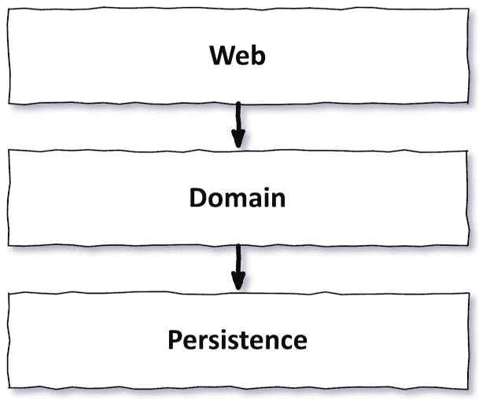
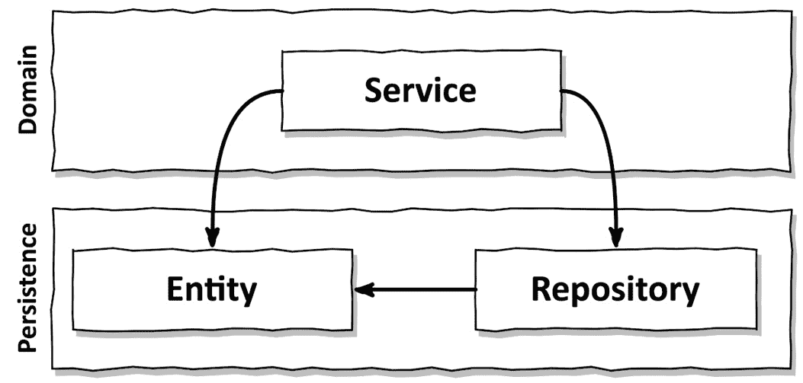
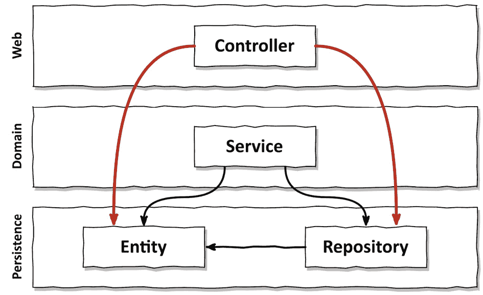
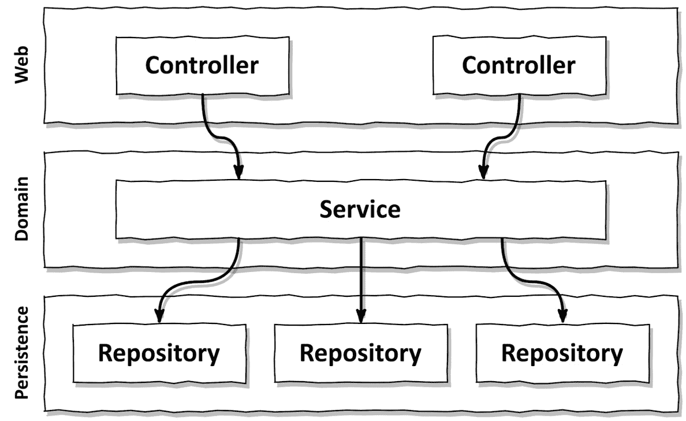

# 第二章：层的问题是什么？

很可能你过去已经开发了一个分层（网络）应用。你甚至可能正在你的当前项目中这样做。

在计算机科学课程、教程和最佳实践中，我们已经习惯了层级的思维方式。甚至在书中也有教授。1

1 作为一种模式，层在 Mark Richards 的《软件架构模式》一书中被教授，O'Reilly，2015 年。

图 2.1 – 传统 Web 应用架构由网络层、领域层和持久化层组成

*图 2.1* 展示了非常常见的三层架构的高级视图。我们有一个**网络层**，它接收请求并将它们路由到**领域层**中的服务。2 该服务执行一些业务逻辑，并从**持久化层**调用组件以查询或修改数据库中我们的领域实体的当前状态。

2 领域与业务：在这本书中，我使用“领域”和“业务”这两个词同义。领域层或业务层是代码中解决业务问题的位置，与解决技术问题的代码不同，例如在数据库中持久化事物或处理 Web 请求。

你知道吗？层是一种稳固的架构模式！如果我们做得正确，我们就能构建出独立于网络和持久化层的领域逻辑。如果需要的话，我们可以更换网络或持久化技术，而不会影响我们的领域逻辑。我们还可以在不影响现有功能的情况下添加新功能。

好的分层架构使我们保持选择余地，能够快速适应不断变化的需求和外部因素（例如我们的数据库供应商一夜之间将价格翻倍）。好的分层架构是可维护的。

那么，层有什么问题呢？

根据我的经验，分层架构非常容易受到变化的影响，这使得它难以维护。它允许不良依赖性逐渐渗透，使得软件随着时间的推移越来越难以更改。层没有提供足够的护栏来保持架构的轨迹。我们需要过度依赖人类的纪律和勤奋来保持其可维护性。

在接下来的章节中，我会告诉你原因。

# 它们促进了数据库驱动的设计

根据其定义，传统分层架构的基础是数据库。网络层依赖于领域层，领域层又依赖于持久化层和数据库。一切都是在持久化层之上构建的。这有几个问题。

让我们退一步，思考一下我们在构建几乎任何应用程序时试图实现的目标。我们通常试图创建一个模型，以反映管理业务的规则或“政策”，以便用户更容易与之互动。

我们主要试图模拟行为，而不是状态。是的，状态是任何应用程序的一个重要部分，但行为是改变状态并因此推动业务的东西！

那么，为什么我们要将数据库作为我们架构的基础，而不是领域逻辑？

想想你在任何应用程序中最近实现的使用案例。你是从实现领域逻辑还是持久层开始的？很可能是你考虑了数据库结构会是什么样子，然后才继续在它之上实现领域逻辑。

在传统的分层架构中，这是有意义的，因为我们遵循依赖关系的自然流动。但从业务角度来看，这完全没有意义！我们应该在构建其他任何东西之前先构建领域逻辑！我们想要弄清楚我们是否正确理解了业务规则。只有当我们知道我们正在构建正确的领域逻辑时，我们才应该继续构建围绕它的持久层和 Web 层。

在这种以数据库为中心的架构中，一个推动力是使用**对象关系映射**（**ORM**）框架。请别误会，我非常喜欢这些框架，并且经常使用它们。但如果我们结合 ORM 框架和分层架构，我们很容易被诱惑将业务规则与持久性方面混合在一起。

图 2.2 – 在领域层中使用数据库实体会导致与持久层的强耦合

通常，我们将在持久层中作为 ORM 管理的实体，如图*图 2.2*所示。由于一个层可能访问其下方的层，领域层被允许访问这些实体。如果允许它们使用，它们最终会使用它们。

这在领域层和持久层之间创建了一个强耦合。我们的业务服务使用持久性模型作为它们的业务模型，不仅要处理领域逻辑，还要处理 eager（急切）加载与 lazy（延迟）加载、数据库事务、刷新缓存和类似的维护任务。3

3 在他的开创性著作《重构》（Pearson，2018）中，马丁·福勒将这种症状称为“发散性变化”：为了实现一个功能而不得不更改看似无关的代码部分。这是一个应该触发重构的代码异味。

持久性代码几乎与领域代码融合在一起，因此很难在不影响另一个的情况下对其进行更改。这与灵活性和保持选项开放的目标相反，而我们的架构应该追求这样的目标。

# 它们容易走捷径

在传统的分层架构中，唯一的全局规则是从某个层开始，我们只能访问同一层或其下层的组件。可能还有开发团队达成一致的其他规则，其中一些甚至可能由工具强制执行，但分层架构风格本身并不强加这些规则给我们。

因此，如果我们需要访问我们之上层的某个组件，我们只需将组件向下推一层，我们就被允许访问它。问题解决。做一次可能没问题。但做一次就打开了做第二次的门。如果其他人被允许这么做，那么我也被允许，对吧？

我并不是说作为开发者，我们会轻易地采取这样的捷径。但如果有一个做某事的选择，有人会这么做，尤其是在面临即将到来的截止日期的情况下。而且如果某件事已经做过，有人再次做它的可能性会大大增加。这是一种称为**破窗理论**的心理效应 – 更多内容请见*第十一章*，*有意识地采取* *捷径*。

图 2.3 – 由于任何层都可以访问持久层中的所有内容，随着时间的推移，它往往会变得臃肿

在多年的软件开发和维护过程中，持久层可能会变得像*图 2**.3*所示的那样。

随着我们通过层将组件向下推，持久层（或者更通用地，最底层的层）会变得臃肿。这种组件的完美候选者是辅助或实用组件，因为它们似乎不属于任何特定的层。

因此，如果我们想为我们的架构禁用*快捷模式*，层不是最佳选择，至少在没有强制执行某些额外的架构规则的情况下不是。而当我提到*强制执行*时，我并不是指高级开发者进行代码审查，而是当规则被破坏时自动强制执行的规则，导致构建失败。

# 它们变得难以测试

在分层架构中，一个常见的演变是跳过层。我们直接从网络层访问持久层，因为我们只操作一个实体的单个字段，为此，我们不需要麻烦领域层，对吧？

图 2.4 – 跳过领域层往往会将领域逻辑分散到代码库中

*图 2**.4*展示了我们如何跳过领域层，直接从网络层访问持久层。

再次强调，前几次可能感觉没问题，但如果经常发生（一旦有人迈出了第一步，就会这样），它有两个缺点。

首先，我们在网络层实现领域逻辑，即使它只是操作单个字段。如果用例在未来扩展，我们很可能会在网络层添加更多领域逻辑，混合责任并使关键领域逻辑散布在所有层中。

其次，在我们的网络层单元测试中，我们不仅要管理对领域层的依赖，还要管理对持久化层的依赖。如果我们使用模拟进行测试，这意味着我们必须为这两个层创建模拟。这增加了测试的复杂性。而复杂的测试设置是走向完全没有测试的第一步，因为我们没有时间进行它们。随着时间的推移，网络组件可能会积累大量对不同的持久化组件的依赖，从而增加了测试的复杂性。在某个时候，我们理解依赖和为它们创建模拟所需的时间可能比实际编写测试代码的时间还要多。

# 它们隐藏了用例

作为开发者，我们喜欢创建实现新用例的新代码。但通常我们花费在修改现有代码上的时间比创建新代码的时间要多得多。这不仅适用于那些令人讨厌的遗留项目，在这些项目中我们正在处理几十年的代码库，也适用于在初始用例实现之后的热门新绿色项目。

由于我们经常需要寻找合适的地点来添加或更改功能，我们的架构应该帮助我们快速导航代码库。分层架构在这方面表现如何？

如前所述，在分层架构中，领域逻辑很容易散布在各个层中。如果我们跳过“简单”用例的领域逻辑，它可能存在于网络层。如果我们把某个组件推到持久化层，以便从领域层和持久化层都可以访问它，它可能存在于持久化层。这已经使得找到添加新功能正确位置变得困难。

但还有更多。分层架构并没有对领域服务的“宽度”强加规则。随着时间的推移，这往往会导致非常广泛的服务，服务于多个用例（见图*2**.5*）。

图 2.5 – “广泛”的服务使得在代码库中找到特定用例变得困难

广泛的服务对持久化层有众多依赖，而网络层的许多组件都依赖于它。这不仅使得服务难以测试，也使得我们难以找到我们想要工作的用例所负责的代码。

如果我们拥有高度专业化的、狭窄的领域服务，每个服务都服务于单个用例，那会容易多少？我们不必在`UserService`中搜索用户注册用例，我们只需打开`RegisterUserService`并开始修改。

# 它们使得并行工作变得困难

管理层通常期望我们在某个日期完成他们资助的软件开发。实际上，他们甚至期望我们在一定的预算内完成，但在这里我们不要使事情复杂化。

除了我作为软件工程师的职业生涯中从未见过“完成”的软件之外，到某个日期“完成”通常意味着多个人必须并行工作。

你可能知道“*《神话般的月份》*”中的这个著名结论，即使你没有读过这本书：*向一个落后的软件项目增加人力会使它更晚*。4

44 《神话般的月份：软件工程论文集》由 Frederick P. Brooks, Jr.著，Addison-Wesley，1995 年。

在某种程度上，这也适用于尚未落后的软件项目。你不能期望一个由 50 名开发者组成的大型团队比一个 10 人的小团队快 5 倍。如果他们正在开发一个非常大的应用程序，可以分成子团队并分别处理软件的不同部分，这可能行得通，但在大多数情况下，他们可能会互相干扰。

但在健康规模上，我们当然可以期待随着项目人员的增加而加快速度。管理层有权利期望我们这样做。

为了满足这一期望，*我们的架构必须支持并行工作*。这并不容易。而且分层架构在这里实际上并没有太大帮助。

想象一下，我们正在向我们的应用程序添加一个新的用例。我们有三名开发者可用。一个可以添加到网络层所需的功能，一个到领域层，第三个到持久化层，对吧？

嗯，在分层架构中，通常不是这样工作的。由于一切都是在持久化层之上构建的，因此持久化层必须首先开发。然后是领域层，最后是网络层。所以一次只能有一个开发者工作在功能上！

“啊，但开发者可以先定义接口，”你说，“然后每个开发者都可以针对这些接口工作，而无需等待实际实现。”

当然，这是可能的，但前提是我们没有像之前讨论的那样混合领域和持久化逻辑，这阻止了我们分别处理每个方面。

如果我们的代码库中服务众多，甚至可能难以并行处理*不同*的功能。在处理不同的用例时，会导致同一服务并行编辑，这会导致合并冲突和潜在的回归。

# 这如何帮助我构建可维护的软件？

如果你以前构建过分层架构，你可能能够与本章中讨论的一些问题产生共鸣，甚至可能添加一些更多的问题。

如果做得正确，并且对它施加一些额外的规则，分层架构可以非常易于维护，并且可以使更改或添加到代码库变得轻而易举。

然而，讨论表明分层架构允许许多事情出错。如果没有良好的自律，它随着时间的推移容易退化，变得难以维护。而且，每当团队成员进出团队，或者经理为开发团队设定新的截止日期时，我们的自律通常都会受到打击。

将分层架构的陷阱牢记于心，将有助于我们下次在争论反对走捷径，而支持构建更易于维护的解决方案时——无论是分层架构还是其他架构风格。
