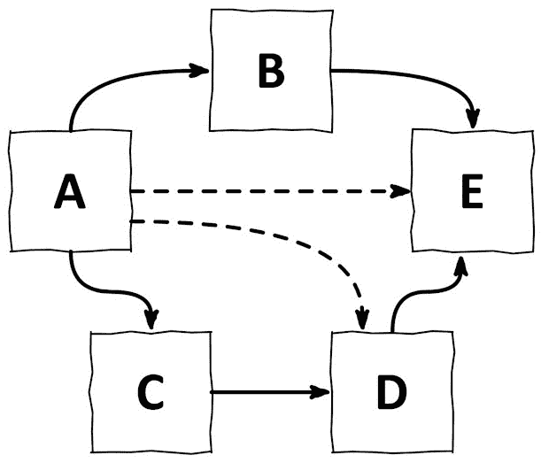
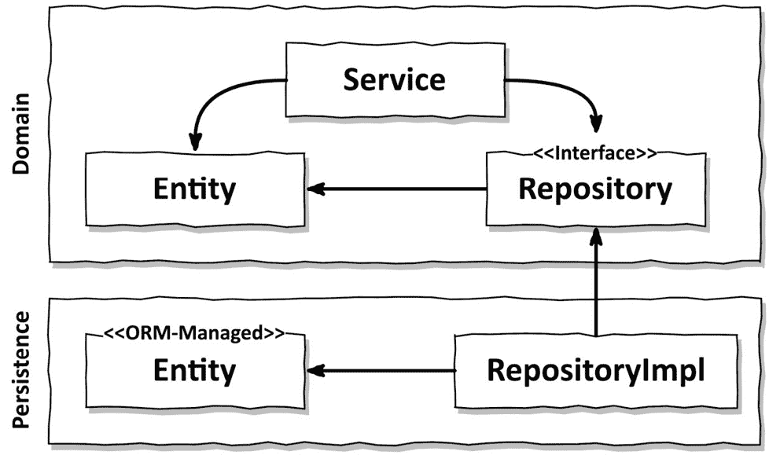
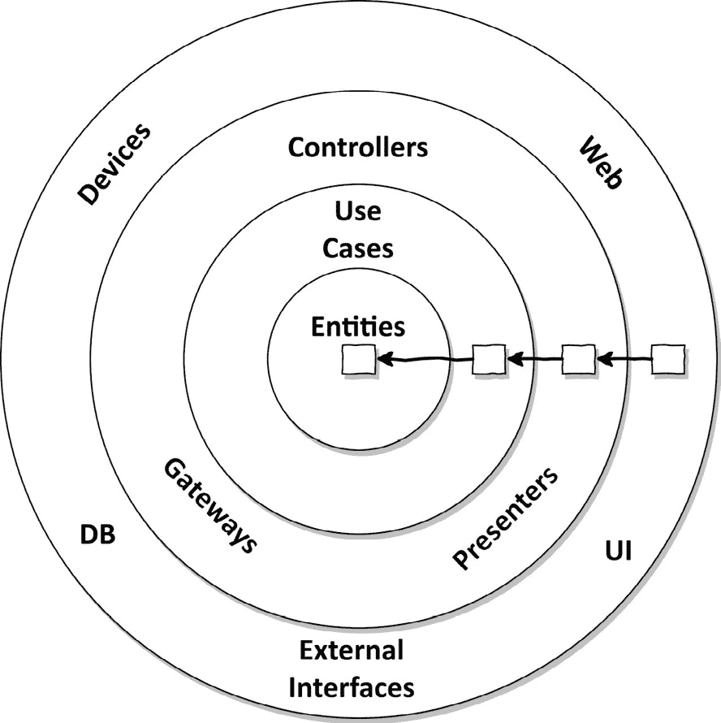
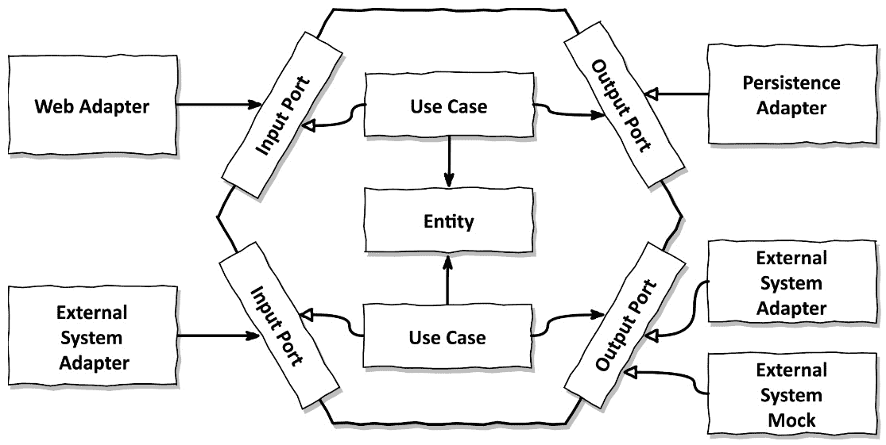
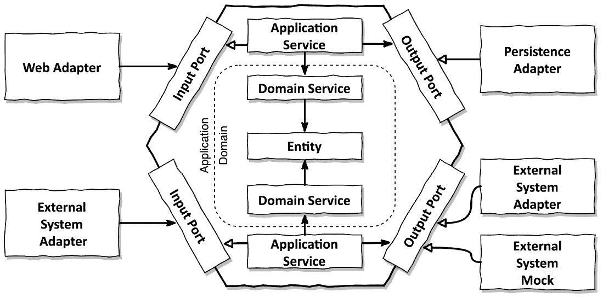

# 第三章：依赖反转

在上一章讨论分层架构之后，你期待这一章讨论一种替代方法是很自然的。我们将从讨论**SOLID**1 原则中的两个开始，然后应用它们来创建一个*整洁*或*六边形*架构，以解决分层架构的问题。

1 SOLID 代表单一责任原则、开闭原则、里氏替换原则、接口隔离原则和依赖反转原则。你可以在 Robert C. Martin 的《整洁架构》或维基百科上了解更多关于这些原则的信息：[`en.wikipedia.org/wiki/SOLID`](https://en.wikipedia.org/wiki/SOLID)。

# 单一责任原则

软件开发中的每个人可能都知道**单一责任原则**（**SRP**）或者至少认为自己知道。这个原则的常见解释是这样的：

*组件应该只做一件事，并且做好这件事*。

这是一条很好的建议，但并非 SRP 的实际意图。

*只做一件事*实际上是“单一责任”最明显的解释，因此 SRP 经常被这样解释。我们只需观察 SRP 的名称具有误导性。

这是 SRP 的实际定义：

*组件应该只有一个改变的理由*。

正如我们所见，“责任”实际上应该翻译为“改变的理由”，而不是“只做一件事”。也许我们应该将 SRP 重命名为“单一改变理由原则”。

如果一个组件只有一个改变的理由，它最终可能只做一件事，但更重要的是，它只有一个改变的理由。

这对我们架构意味着什么？

如果一个组件只有一个改变的理由，那么在改变软件的其他任何原因时，我们不必担心这个组件，因为我们知道它仍然会按预期工作。

可惜，改变的理由很容易通过组件的依赖关系传播到其他组件（参见*图 3.1*）。

图 3.1 – 组件的每个依赖项都是改变此组件的可能原因，即使它只是一个传递依赖（虚线箭头）

在前面的图中，组件**A**依赖于许多其他组件（无论是直接还是间接），而组件**E**则没有任何依赖。

改变组件**E**的唯一理由是当**E**的功能必须因为某些新需求而改变。然而，组件**A**可能需要改变，因为其他组件的任何改变都会影响它，因为它依赖于它们。

许多代码库随着时间的推移变得越来越难以更改——因此成本也更高——这是因为违反了单一职责原则。随着时间的推移，组件会积累越来越多的变化理由。一旦收集了许多变化理由，更改一个组件可能会引起另一个组件失败。

# 一个关于副作用的故事

我曾经参与过一个项目，我的团队继承了另一个软件公司开发的十年老代码库。客户决定更换开发团队以降低持续维护成本并提高新功能的开发速度。因此，我们获得了这个合同。

如预期的那样，理解代码的实际功能并不容易，我们在代码库的一个区域所做的更改往往会在其他区域产生副作用。但我们通过彻底测试、添加自动化测试和大量重构来应对。

在成功维护和扩展代码库一段时间后，客户提出了一个新功能的需求。他们希望我们以对软件用户非常不便的方式来实现这个功能。因此，我提出了一个更用户友好的方案，由于它需要的整体改动更少，所以实现起来甚至更加经济。然而，它需要在某个非常核心的组件上进行一个小改动。

客户拒绝了我们的建议，并要求采用更不便且昂贵的解决方案。当我询问原因时，他们表示担心副作用，因为之前开发团队对那个组件所做的更改过去总是导致其他地方出现问题。

很遗憾，这是一个例子，说明了你如何使客户为了修改糟糕的架构软件而额外付费。幸运的是，大多数客户不会参与这个游戏，所以让我们尝试构建良好的架构软件。

# 依赖倒置原则

在我们的分层架构中，跨层依赖始终指向下一层。当我们从高层次应用单一职责原则时，我们会注意到上层比下层有更多的变化理由。

因此，由于领域层对持久层有依赖，持久层中的每个更改都可能需要在领域层进行更改。但领域代码是我们应用程序中最重要的代码！我们不希望当持久层代码发生变化时不得不更改它！

那么，我们如何摆脱这种依赖呢？

**依赖倒置原则**（**DIP**）提供了答案。

与 SRP 不同，DIP 意味着其名称所暗示的含义：

*我们可以在我们的代码库中（反转）任何依赖的方向**2*

2 实际上，我们只能在控制依赖两端代码的情况下反转依赖。如果我们依赖于第三方库，我们就不能反转它，因为我们不控制那个库的代码。

这是如何工作的？让我们尝试反转域代码和持久化代码之间的依赖关系，使持久化代码依赖于域代码，从而减少需要更改域代码的原因。

我们从一个类似于*第二章*，*《层有什么问题？》*中*图 2.2*的结构开始。我们有一个在域层中的服务，它使用持久化层中的实体和存储库。

首先，我们希望将实体提升到域层，因为它们代表我们的域对象，我们的域代码基本上是围绕改变这些实体的状态来进行的。

但现在，由于持久化层中的存储库依赖于现在位于域层的实体，我们在这两个层之间有一个循环依赖。这就是我们应用 DIP 的地方。我们在域层为存储库创建一个接口，并让持久化层中的实际存储库实现它。结果是类似于*图 3.2*中的那样。

图 3.2 – 通过在域层引入接口，我们可以反转依赖，使持久化层依赖于域层

通过这个技巧，我们使我们的域逻辑摆脱了对持久化代码的压迫性依赖。这是我们在接下来的章节中将要讨论的两个架构风格的核心特性。

# 清洁架构

罗伯特·C·马丁在他的同名书中提出了“**清洁架构**”这个术语。3 在他看来，清洁架构中的业务规则是设计可测试的，并且独立于框架、数据库、UI 技术以及其他外部应用程序或接口。

3 *《清洁架构》*，罗伯特·C·马丁著，普伦蒂斯·霍尔出版社，2017 年，*第二十二章*。

这意味着域代码不能有任何面向外部的依赖。相反，借助 DIP（依赖倒置原则），所有依赖都指向域代码。

*图 3.3*展示了这样一个架构在抽象层面可能的样子。

图 3.3 – 在清洁架构中，所有依赖都指向域逻辑（来源：罗伯特·C·马丁的《清洁架构》）

这个架构中的层以同心圆的形式相互包裹。这种架构中的主要规则是“**依赖规则**”，它规定这些层之间的所有依赖都必须指向内部。

架构的核心包含领域实体，这些实体由周围的使用案例访问。使用案例就是我们之前所说的服务，但它们更细粒度，具有单一责任（即单一改变的理由），从而避免了我们之前讨论的*宽泛的服务*问题。

围绕这个核心，我们可以找到支持业务规则的所有其他应用程序组件。这种支持可能意味着提供持久性或提供用户界面，例如。此外，外部层可能为任何第三方组件提供适配器。

由于领域代码对使用的持久性或 UI 框架一无所知，它不能包含任何特定于这些框架的代码，并将专注于业务规则。我们拥有我们所能希望的所有自由来建模领域代码。例如，我们可以以最纯粹的形式应用**领域驱动设计**（**DDD**）。不必考虑持久性或 UI 特定的问题使得这变得容易得多。

如我们所预期，整洁架构是有代价的。由于领域层完全与外部层（如持久性和 UI 层）解耦，我们必须在每个层中维护应用程序实体的模型。

假设，例如，我们在持久层使用一个**对象关系映射**（**ORM**）框架。ORM 框架通常期望特定的实体类，这些类包含描述数据库结构和对象字段到数据库列映射的元数据。由于领域层不知道持久层，我们不能在领域层使用相同的实体类，而必须在两个层中都创建它们。这意味着持久层需要将领域实体映射到其自身的表示。在领域层和其他外部层之间也适用类似的映射。

但这是好事！这种解耦正是我们想要实现的，以使领域代码摆脱框架特定的问题。例如，Java 持久性 API（Java 世界中的标准对象关系 API）要求 ORM 管理的实体具有不带参数的默认构造函数，而我们可能不想在我们的领域模型中避免它。在*第九章*中，我们将讨论不同的映射策略，包括一种*无映射*策略，它只是接受领域和持久层之间的耦合。

由于罗伯特·C·马丁的《*整洁架构*》有些抽象，让我们深入一个层次，看看*六边形架构*，它给*整洁架构*原则提供了更具体的形状。

# 六边形架构

**六边形架构**这个术语来自阿利斯泰尔·科克本，已经存在一段时间了。4 它应用了罗伯特·C·马丁后来在*整洁架构*中以更一般术语描述的相同原则。

4 “六角架构”这个术语的主要来源似乎是一篇关于 Alistair Cockburn 网站的文章，网址为[`alistair.cockburn.us/hexagonal-architecture/`](https://alistair.cockburn.us/hexagonal-architecture/)。

图 3.4 – 六角架构也被称为“端口和适配器”架构，因为应用程序核心为每个适配器提供特定的端口以进行交互

*图 3*.*4*展示了六角架构可能的样子。应用程序核心以六角形表示，这为这种架构风格命名。然而，六角形的形状没有意义，所以我们也可以画一个八边形并称之为“八角架构”。根据传说，六角形只是用来代替常见的矩形，以表明一个应用程序可以通过多于四条边连接到其他系统或适配器。

在六角形内部，我们找到我们的领域实体以及与这些实体一起工作的用例。请注意，六角形没有外部依赖，因此马丁的清洁架构中的依赖规则是正确的。相反，所有依赖都指向中心。

在六角形外部，我们找到各种**适配器**，它们与应用程序进行交互。可能有一个与网络浏览器交互的网络适配器，一些与外部系统交互的适配器，以及一个与数据库交互以实现持久性的适配器。

左侧的适配器是驱动我们应用程序的适配器（因为它们调用我们的应用程序核心），而右侧的适配器是由我们的应用程序驱动的（因为它们被应用程序核心调用）。

为了允许应用程序核心和适配器之间的通信，应用程序核心提供了特定的**端口**。对于驱动适配器，这样的端口可能是一个由核心中的某个用例类实现并由适配器调用的接口。对于被驱动的适配器，它可能是一个由适配器实现并由核心调用的接口。我们甚至可能有多个适配器实现相同的端口：一个用于与真实的外部系统通信，另一个用于与用于测试的模拟进行通信，例如。

为了清楚地指出六角架构的一个核心属性，*应用程序核心（六角形）定义并拥有对外部接口的所有权*（*端口*）。然后适配器与这个接口一起工作。这是在架构级别应用依赖倒置原则。

由于其核心概念，这种架构风格也被称为**端口和****适配器**架构。

就像清洁架构一样，我们可以将这种六边形架构组织成层。最外层由适配器组成，它们在应用和其他系统之间进行转换。

接下来，我们可以将端口和用例实现结合起来形成应用层，因为它们定义了我们的应用接口。最内层包含实现业务规则的领域实体。

业务逻辑在用例类和实体中实现。用例类是狭窄的**领域服务**，仅实现单个用例。当然，我们可以选择将多个用例组合到一个更广泛的领域服务中，但理想情况下，我们只在用例经常一起使用时这样做，以提高可维护性。

可能的话，我们还想引入应用服务的概念。**应用服务**是一种协调对用例（**领域服务**）调用的服务，如图*图 3.5*所示。

图 3.5 – 使用应用和领域服务的 DDD 概念的六边形架构

在这里，应用服务在输入和输出端口以及领域服务之间进行转换，保护领域服务免受外部世界的干扰，并可能协调领域服务之间的交互。**领域服务**框与*图 3.4*中的**用例**框同义；我们只是现在使用了从领域驱动设计（DDD）借用的术语。

正如这次讨论所暗示的，我们可以在六边形内部自由地设计我们的应用代码。我们可以选择简单或复杂，以匹配我们应用的复杂性和规模。我们将在*第十三章*“管理多个*有界上下文*”中了解更多关于在六边形内管理代码的知识。

在下一章中，我们将讨论一种在代码中组织这种架构的方法。

# 这如何帮助我构建可维护的软件？

称其为“清洁架构”、“六边形架构”或“端口和适配器架构”，通过反转我们的依赖关系，使得领域代码对外部没有依赖，我们可以将领域逻辑从所有那些与持久化和 UI 特定的问题解耦，并减少在整个代码库中需要更改的原因。更少的更改原因导致更好的可维护性。

领域代码可以自由地建模以最佳地适应业务问题，而持久化和 UI 代码可以自由地建模以最佳地适应持久化和 UI 问题。

在本书的剩余部分，我们将应用六边形架构风格来构建一个 Web 应用。我们将从创建应用包结构开始，并讨论依赖注入的作用。
