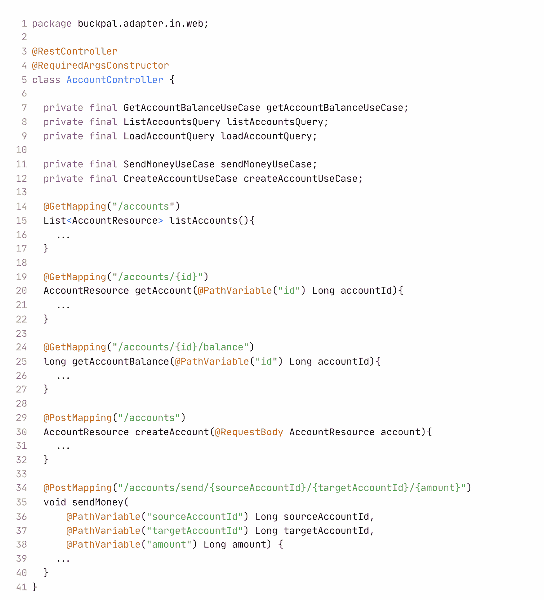

# 第六章：实现 Web 适配器

今天的大多数应用程序都有某种形式的 Web 界面——要么是我们可以通过 Web 浏览器与之交互的 UI，要么是其他系统可以通过调用以与我们的应用程序交互的 HTTP API。

在我们的目标架构中，所有与外部世界的通信都通过适配器进行。因此，让我们讨论如何实现一个提供此类 Web 界面的适配器。

# 依赖倒置

*图 6.1*给出了一个放大视图，展示了与我们讨论 Web 适配器相关的架构元素——适配器本身以及它通过哪些端口与我们的应用程序核心交互：

图 6.1 – 一个传入适配器通过专用传入端口与应用层通信，这些端口是由领域服务实现的接口

Web 适配器是一个“驱动”或“传入”适配器。它从外部接收请求并将它们转换为对应用程序核心的调用，告诉它要做什么。控制流从 Web 适配器中的控制器流向应用层中的服务。

应用层通过特定的端口提供通信，这些端口是我在上一章中所称的“用例”，并由应用层中的领域服务实现。

如果我们仔细观察，会发现这是依赖倒置原则在起作用。由于控制流是从左到右的，我们同样可以让 Web 适配器直接调用用例，如图*6.2*所示。

图 6.2 – 我们可以移除端口接口并直接调用服务

那么为什么我们在适配器和用例之间添加另一层间接层呢？原因在于端口是外部世界可以与我们的应用程序核心交互的地点的规范。通过设置端口，我们确切地知道哪些与外部世界的通信发生了，这对于任何正在为您的遗留代码库工作的维护工程师来说都是宝贵的信息。

了解驱动应用程序的端口也让我们可以为应用程序构建一个测试驱动器。这个测试驱动器是一个适配器，它调用输入端口来模拟和测试某些使用场景——更多关于测试的内容请参阅*第八章*，*测试* *架构元素*。

在讨论了输入端口的重要性之后，我们将在*第十一章*，*有意识地走捷径*中讨论的一个捷径是直接跳过传入端口并直接调用应用程序服务。

尽管如此，还有一个问题与高度交互式应用程序相关。想象一个通过 WebSocket 向用户浏览器发送实时数据的服务器应用程序。应用程序核心如何将实时数据发送到网络适配器，而网络适配器再将数据发送到用户浏览器？

对于这个场景，我们肯定需要一个端口，因为没有端口，应用程序将不得不依赖于适配器实现，这会破坏我们使应用程序免受外部依赖的努力。这个端口必须由网络适配器实现，并由应用程序核心调用，如图*图 6**.3*所示：

图 6.3 – 如果应用程序必须主动通知网络适配器，我们需要通过输出端口来保持依赖关系的正确方向

左侧的`WebSocketController`实现了`out`包中的端口接口，应用程序核心可以通过这个端口调用以将实时数据发送到用户的浏览器。

从技术上来说，这将是一个输出端口，使网络适配器成为一个输入和输出适配器。但没有任何理由说同一个适配器不能同时是两者。在本章的其余部分，我们将假设网络适配器仅作为输入适配器，因为这是最常见的情况。

# 网络适配器的职责

网络适配器实际上做什么？假设我们想要为我们的 BuckPal 应用程序提供一个 REST API。网络适配器的职责从哪里开始，又在哪里结束？

网络适配器通常做以下事情：

1.  将传入的 HTTP 请求映射到对象。

1.  执行授权检查。

1.  验证输入。

1.  将请求对象映射到用例的输入模型。

1.  调用用例。

1.  将用例的输出映射回 HTTP。

1.  返回 HTTP 响应。

首先，网络适配器必须监听符合某些标准（如 URL 路径、HTTP 方法和内容类型）的 HTTP 请求。然后，匹配的 HTTP 请求的参数和内容必须反序列化为我们可以处理的对象。

通常，网络适配器会进行身份验证和授权检查，如果失败则返回错误。

然后，可以验证传入对象的状态。但我们不是已经讨论过输入验证作为输入模型对用例的职责了吗？是的，输入模型对用例应该只允许在用例上下文中有效的输入。但在这里，我们谈论的是网络适配器的输入模型。它可能具有与用例输入模型完全不同的结构和语义，因此我们可能需要进行不同的验证。

我不主张在 Web 适配器中实现与我们在用例输入模型中已经实现的相同验证。相反，我们应该验证我们能否将 Web 适配器的输入模型转换为用例的输入模型。任何阻止我们进行这种转换的因素都是验证错误。

这将我们带到 Web 适配器的下一个责任：使用转换后的输入模型调用特定的用例。然后适配器获取用例的输出并将其序列化为 HTTP 响应，发送回调用者。

如果在过程中出现任何问题并抛出异常，网络适配器必须将错误转换为发送回调用者的消息。

这样，我们的 Web 适配器承担了大量的责任。但这也是应用层不应该关心的责任。任何与 HTTP 相关的事情都不应该泄露到应用层。如果应用核心知道我们在外部处理 HTTP，我们就失去了从其他不使用 HTTP 的传入适配器执行相同领域逻辑的选项。在一个可维护的架构中，我们希望保持选项开放。

注意，如果我们从领域层和应用层开始开发，而不是从网络层开始，那么网络适配器与应用层之间的边界就会自然而然地出现。如果我们首先实现用例，而不考虑任何特定的传入适配器，我们就不会倾向于模糊边界。

# 切片控制器

在大多数 Web 框架中——例如 Java 世界的 Spring MVC——我们创建执行我们之前讨论过的责任的控制器类。那么，我们是否需要构建一个回答所有指向我们应用程序的请求的单个控制器？我们不必这样做。Web 适配器可能由多个类组成。

然而，我们应该注意将这些类放入相同的包层次结构中，以标记它们属于一起，正如在*第四章*“组织代码”中讨论的那样。

那么，我们构建多少个控制器呢？我说我们宁愿构建太多也不愿太少。我们应该确保每个控制器实现尽可能窄的 Web 适配器切片，并且与其他控制器共享尽可能少的内容。

让我们以 BuckPal 应用程序中的账户实体操作为例。一种常见的方法是创建一个单独的`AccountController`，它接受与账户相关的所有操作的请求。

提供 REST API 的 Spring 控制器可能看起来像以下代码片段：

与账户资源相关的一切都在一个类中，这感觉很好。但让我们讨论一下这种方法的缺点。

首先，每个类中代码更少是好事。我在一个遗留项目中工作过，其中最大的类有 30,000 行代码。1 这不是什么有趣的事情。即使控制器多年来只积累了 200 行代码，它也比 50 行代码更难理解，即使它被干净地分离成方法。

1 30,000 行代码：这实际上是我们前辈（请注意）的一个有意识的架构决策，导致这 30,000 行代码位于一个类中：为了在运行时更改系统，而不需要重新部署，它允许他们上传编译后的 Java 字节码到`.class`文件中。而且它只允许他们上传一个文件，所以这个文件必须包含所有代码。

同样的论点也适用于测试代码。如果控制器本身有很多代码，那么就会有大量的测试代码。而且，通常测试代码比生产代码更难理解，因为它往往更抽象。我们还想让特定生产代码的测试更容易找到，这在小型类中更容易实现。

同样重要的是，然而，将所有操作放入单个控制器类中鼓励了数据结构的重用。在先前的代码示例中，许多操作共享`AccountResource`模型类。它作为任何操作所需内容的容器。`AccountResource`可能有一个`id`字段。在`create`操作中不需要这个字段，而且可能会比它有帮助的地方更多造成混淆。想象一下，`Account`与`User`对象之间存在一对一的关系。在创建或更新账户时，我们会包括那些`User`对象吗？用户会被列表操作返回吗？这是一个简单的例子，但在任何大型项目中，我们迟早都会问这些问题。

因此，我提倡为每个操作创建一个单独的控制器，可能是在一个单独的包中。我们还应该尽可能将方法和类名与我们的用例相匹配：

我们可以将原始数据作为输入，就像我们在示例中处理`sourceAccountId`、`targetAccountId`和`amount`时那样。但每个控制器也可以有自己的输入模型。我们可能有一个针对特定用例的模型，如`CreateAccountResource`或`UpdateAccountResource`，而不是一个通用的模型如`AccountResource`。这些专门的模型类甚至可以是控制器包私有的，以防止意外重用。控制器仍然可以共享模型，但使用来自另一个包的共享类让我们更多地思考它，也许我们会发现我们不需要一半的字段，最终会创建自己的。

此外，我们还应该仔细思考控制器和服务的命名。例如，对于`CreateAccount`，难道`RegisterAccount`不是一个更好的名字吗？在我们的 BuckPal 应用中，创建账户的唯一方式是用户注册它。因此，我们在类名中使用“register”这个词来更好地传达它们的含义。当然，有些情况下，常用的命名方式（`Create...`、`Update...`和`Delete...`）足以描述一个用例，但在实际使用之前，我们可能需要三思而后行。

这种切割风格的另一个好处是，它使得在不同操作上的并行工作变得轻而易举。如果两个开发者分别处理不同的操作，我们不会遇到合并冲突。

# 这如何帮助我构建可维护的软件？

当构建一个应用到 Web 的适配器时，我们应该记住，我们正在构建一个适配器，它将 HTTP 协议转换为应用用例的方法调用，将结果转换回 HTTP，并且不执行任何领域逻辑。

另一方面，应用层不应处理 HTTP，因此我们应该确保不要泄露 HTTP 细节。这使得 Web 适配器在需要时可以替换为另一个适配器。

当切割 Web 控制器时，我们不应害怕构建许多不共享模型的小类。它们更容易理解和测试，并且支持并行工作。最初设置这样细粒度的控制器需要更多的工作，但在维护期间会得到回报。

在查看我们应用的输入端之后，我们现在将来看看输出端以及如何实现持久化适配器。
