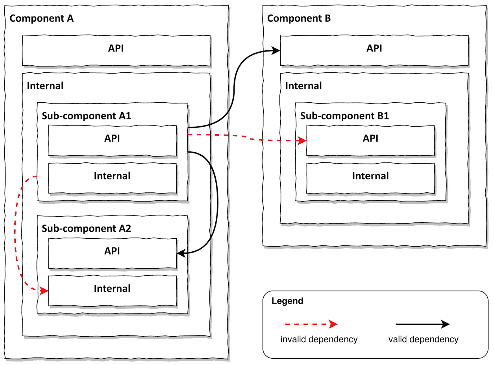
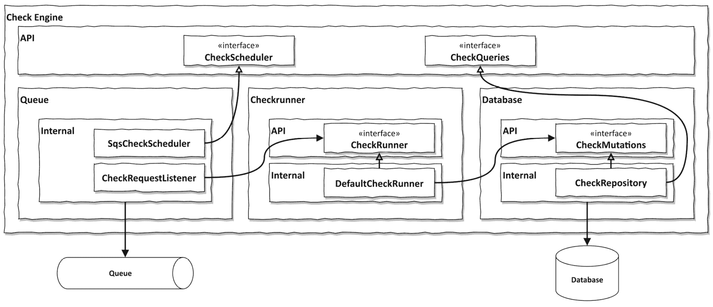
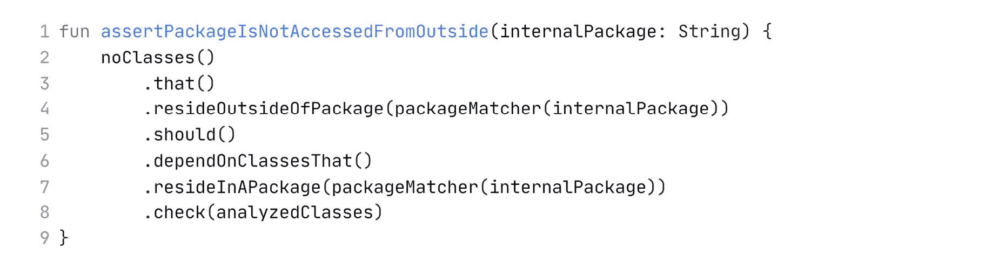

# 第十四章：软件架构的组件化方法

当我们开始一个软件项目时，我们永远不知道用户在使用软件时将会一次性抛给我们哪些需求。软件项目总是伴随着冒险和做出有根据的猜测（我们喜欢称之为“假设”，以使其听起来更专业）。软件项目的环境变化无常，无法事先知道一切将如何展开。正是这种变化无常促成了敏捷运动的诞生。敏捷实践使组织足够灵活，能够适应变化。

但是，我们如何创建一个能够应对如此敏捷环境的软件架构？如果一切都可以随时改变，我们是否还应该关心架构？

是的，我们应该。如*第一章*中所述，*可维护性*，我们应该确保我们的软件架构能够实现可维护性。一个可维护的代码库可以随着时间的推移而演变，适应外部因素。

六边形架构在可维护性方面迈出了重要一步。它在我们应用程序和外部世界之间创建了一个边界。在我们应用程序的内部（六边形内），我们有我们的领域代码，它为外部世界提供了专门的端口。这些端口将应用程序连接到适配器，适配器与外部世界通信，在应用程序的语言和外部系统的语言之间进行翻译。这种架构提高了可维护性，因为应用程序可以主要独立于外部世界进行演变。只要端口不改变，我们就可以在应用程序内部演变任何内容，以应对敏捷环境中的变化。

但是，正如我们在*第十三章*中学习的，*管理多个边界上下文*，六边形架构并不能帮助我们在我们应用程序的核心内部创建边界。我们可能希望在应用程序核心内部应用不同的架构，以帮助我们在这方面。

此外，我多次听说六边形架构感觉很难，尤其是对于一个刚开始的软件项目来说。很难让团队接受，因为并不是每个人都理解依赖倒置的价值以及领域模型与外部世界之间的映射。对于初出茅庐的应用程序来说，六边形架构可能是一种过度设计。

对于这类情况，我们可能希望从一个更简单的架构风格开始，这种风格仍然提供了我们未来演变所需的模块化，同时足够简单，以便让每个人都参与其中。我建议组件化架构是一个好的起点，我们将使用本章来讨论这种架构风格。

# 通过组件实现模块化

可维护性的一个驱动因素是模块化。通过将软件系统划分为更简单的模块，模块化使我们能够征服软件系统的复杂性。我们不需要理解整个系统就能对某个特定的模块进行工作。相反，我们可以专注于那个模块，以及它可能交互的模块。只要模块之间的接口定义得清楚，模块可以相对独立地发展。我们可能能够将一个模块的心理模型放入我们的工作记忆中，但如果没有模块在代码库中，创建心理模型就非常困难了。我们会在代码中无助地跳来跳去。

只有模块化才使我们人类能够创建复杂的系统。在 Dave Farley 的《现代软件工程》一书中，他谈到了阿波罗太空计划的模块化：1

1 阿波罗太空计划的模块化：《现代软件工程》由 Dave Farley 著，Pearson 出版社，2022 年，*第六章*。

“这种模块化有很多优点。这意味着每个组件都可以专注于解决问题的某个部分，并且在设计上需要妥协得更少。它允许不同的团队——在这种情况下，是完全不同的公司——在主要独立于其他团队的情况下工作在每个模块上。只要不同的团队就模块之间的接口达成一致，他们就可以努力解决他们模块的问题，而无需受到约束。”

模块化使我们能够登上月球！模块化使我们能够制造汽车、飞机和建筑物。它也帮助我们构建复杂的软件，这并不令人惊讶。

但什么是模块呢？我觉得在（面向对象）软件开发中，这个术语被过度使用了。所有东西，包括它的猫，都被称作“模块”，即使它只是一堆随意组合在一起以完成有用事情的课程。我更喜欢用“组件”来描述一组精心设计以实现某些功能，并且可以与其他课程组一起组合起来构建复杂系统的课程。组合方面意味着组件可以组合成更大的整体，甚至可以重新组合以应对环境的变化。可组合性要求组件定义一个清晰的接口，告诉我们它向外界提供什么以及它需要什么（输入和输出端口，对吧？）。想想乐高积木。乐高积木为其他积木提供了一定布局的凸点，并且需要一定布局的凸点来连接到其他积木。话虽如此，我不会因为您使用“模块”这个术语而评判您，但在这章的其余部分，我会使用“组件”这个术语。

为了本章的目的，一个组件是一组具有专用命名空间和明确定义的 API 的类。如果另一个组件需要此组件的功能，它可以通过其 API 调用它，但它可能无法访问其内部。一个组件可能由更小的组件组成。默认情况下，这些子组件位于父组件的内部，因此它们从外部不可访问。然而，如果它们实现了应从外部访问的功能，它们可以贡献给父组件的 API。

像任何其他架构风格一样，基于组件的架构完全是关于允许哪些依赖以及哪些依赖被劝阻。这在上图*14.1*中得到了说明。

图 14.1 – 对内部包的依赖无效，但只要 API 包不是嵌套在内部包中，对 API 包的依赖就有效

在这里，我们有两个顶级组件，A 和 B。组件 A 由两个子组件 A1 和 A2 组成，而组件 B 只有一个子组件 B1。

如果 A1 需要访问 B 的功能，它可以通过调用 B 的 API 来获取。然而，它无法访问 B1 的 API，因为作为一个子组件，它是其父组件内部的一部分，因此对外部隐藏。尽管如此，B1 可以通过在父 API 中实现一个接口来向其父组件的 API 贡献功能。我们将在后面的案例研究中看到这一点。

相同的规则适用于兄弟组件 A1 和 A2 之间。如果 A1 需要访问 A2 的功能，它可以调用其 API，但它不能调用 A2 的内部。

这就是基于组件架构的全部内容。它可以总结为四条简单的规则：

1.  一个组件有一个专用命名空间以便可寻址。

1.  一个组件有一个专用的 API 和内部结构。

1.  一个组件的 API 可以从外部调用，但它的内部结构不能。

1.  一个组件可能包含作为其内部部分子组件。

为了使抽象具体化，让我们看看一个基于组件架构的真实代码示例。

# 案例研究 – 构建“检查引擎”组件

作为本章中介绍的基于组件架构的案例研究，我从我参与的一个真实软件项目中提取了一个组件到一个独立的 GitHub 仓库。2 仅仅是我相对容易地提取了组件，并且我们可以对这个组件进行推理，而无需了解它来自哪个软件项目，这表明我们通过应用模块化成功地征服了复杂性！

2 实现了基于组件架构的“检查引擎”的 GitHub 项目：[`github.com/thombergs/components-example`](https://github.com/thombergs/components-example)。

该组件是用面向对象的 Kotlin 编写的，但这些概念适用于任何其他面向对象的编程语言。

该组件被称为“检查引擎”。它原本打算是一种网络爬虫，它会遍历网页并对它们运行一系列检查。这些检查可以是“检查该网页上的 HTML 是否有效”到“返回该网页上的所有拼写错误”等。

由于抓取网页时可能会出现很多问题，我们决定异步运行检查。这意味着组件需要提供一个用于安排检查的 API，以及一个在检查执行后检索检查结果的 API。这暗示需要一个用于存储传入检查请求的队列和一个用于存储这些检查结果的数据库。

从外观上看，无论是将检查引擎“整体构建”还是将其拆分成子组件，都没有关系。只要组件有一个专门的 API，这些细节就会对外隐藏。然而，上述要求为检查引擎内部的子组件定义了某些自然的边界。沿着这些边界拆分检查引擎，使我们能够管理检查引擎组件内部的复杂性，因为每个子组件比整个问题更容易管理。

我们为检查引擎提出了三个子组件：

+   一个队列组件，它封装了对队列的访问以排队和出队检查请求。

+   一个数据库组件，它封装了对数据库的访问以存储和检索检查结果。

+   一个检查运行器组件，它知道要运行哪些检查，并在队列中有检查请求时运行它们。

注意，这些子组件主要引入了技术边界。与六边形架构中的输出适配器非常相似，我们在子组件中隐藏了访问外部系统（队列和数据库）的细节。然而，检查引擎组件是一个非常技术性的组件，几乎没有领域代码。唯一可以考虑为“领域代码”的组件是检查运行器，它充当某种控制器。技术组件非常适合基于组件的架构，因为它们之间的边界比不同功能域之间的边界更清晰。

让我们看看检查引擎组件的架构图，以深入了解细节（*图 14.2*）。

图 14.2 – 检查引擎组件由三个子组件组成，这些子组件有助于父组件的 API

图表反映了代码的结构。你可以把每个框想象成 Java 包（或在其他编程语言中的简单源代码文件夹）。如果一个框在更大的框内，它就是该更大框的子包。最后，最低层的框是类。

检查引擎组件的公共 API 由 `CheckScheduler` 和 `CheckQueries` 接口组成，分别允许安排网页检查和检索检查结果。

`CheckScheduler` 由位于队列组件内部的 `SqsCheckScheduler` 类实现。这样，队列组件就为父组件的 API 做出了贡献。只有当我们查看这个类的名称时，我们才会知道它正在使用亚马逊的简单队列服务（SQS）。这个实现细节并没有泄露到检查引擎组件的外部。甚至兄弟组件也不知道使用了哪种队列技术。你可能还会注意到，队列组件甚至没有 API 包，所以它所有的类都是内部的！

然后，`CheckRequestListener` 类监听来自队列的传入请求。对于每个传入请求，它调用检查运行器子组件 API 中的 `CheckRunner` 接口。`DefaultCheckRunner` 实现了该接口。它从传入请求中读取网页 URL，确定要对其运行的检查，然后运行这些检查。

当检查完成时，`DefaultCheckRunner` 类通过调用数据库子组件 API 的 `CheckMutations` 接口将结果存储在数据库中。这个接口由处理连接和与数据库通信的 `CheckRepository` 类实现。同样，数据库技术也没有泄露到数据库子组件的外部。

`CheckRepository` 类还实现了 `CheckQueries` 接口，这是检查引擎公共 API 的一部分。该接口提供了查询检查结果的方法。

通过将检查引擎组件拆分为三个子组件，我们已经将复杂性分解。每个子组件解决整体问题的一个更简单的部分。它主要可以自行进化。由于成本、可扩展性或其他原因，队列或数据库技术的变化不会渗透到其他子组件中。如果我们想的话，甚至可以用简单的内存实现来替换子组件进行测试。

所有这些，我们都是通过将代码结构化为组件，遵循拥有专用 API 和内部包的惯例来获得的。

# 强制组件边界

习惯是好的，但如果只有这些，有人会打破它们，架构就会逐渐退化。我们需要强制执行组件架构的规范。

组件架构的优点在于，我们可以应用一个相对简单的适应函数来确保没有意外的依赖关系渗透到我们的组件架构中：

*任何不属于“内部”包的类都不应该访问该“**内部**”包中的类。*

如果我们将组件的所有内部内容放入一个名为“internal”的包中（或以其他方式标记为“internal”的包），我们只需检查该包中的任何类都没有从包外部被调用。对于基于 JVM 的项目，我们可以使用 ArchUnit 来规范这个适应度函数：3

3 验证特定包内没有代码访问的 ArchUnit 规则：[`github.com/thombergs/components-example/blob/main/server/src/test/kotlin/io/reflectoring/components/InternalPackageTest.kt`](https://github.com/thombergs/components-example/blob/main/server/src/test/kotlin/io/reflectoring/components/InternalPackageTest.kt).

我们只需要一种方法来识别每次构建过程中的内部包，并将它们全部输入到上面的函数中，如果意外地将依赖引入到内部类中，构建将会失败。

适应度函数甚至不需要了解我们架构中的组件。我们只需要遵循一个用于识别内部包的约定，然后将这些包输入到函数中。这意味着我们不需要在添加或从代码库中删除组件时更新运行适应度函数的测试。非常方便！

注意

这个适应度函数是我们之前在*第十二章**，强制执行架构边界*中引入的适应度函数的倒数形式。在第十二章中，我们验证了来自某个包的类不会访问该包之外的类。在这里，我们验证外部包的类不会访问包内部的类。这个适应度函数更加稳定，因为我们不需要为使用的每个库添加异常。

当然，我们仍然可以通过不遵循内部包的约定来引入不想要的依赖。规则仍然允许一个漏洞：如果我们直接将类放入顶级组件的“内部”包中，任何子组件的类都可以访问它。因此，我们可能还想引入另一条规则，禁止任何类直接位于顶级组件的“内部”包中。

# 这如何帮助我构建可维护的软件？

基于组件的架构非常简单。只要每个组件都有一个专门的命名空间、专门的 API 和内部包，并且内部包中的类不会被外部调用，我们就得到了一个非常可维护的代码库，由许多可组合和重新组合的组件组成。如果我们添加规则，允许组件由其他组件组成，我们可以构建一个由更小部分组成的应用程序，每个部分解决一个更简单的问题。

尽管存在绕过组件架构规则的漏洞，但架构本身非常简单，因此很容易理解和沟通。如果容易理解，那么维护起来也容易。如果维护起来容易，那么漏洞被利用的可能性就较小。

六边形架构关注应用层面的边界。基于组件的架构关注组件层面的边界。我们可以利用这一点在六边形架构中嵌入组件，或者我们可以选择从一个简单的基于组件的架构开始，并在需要时向任何其他架构演变。基于组件的架构是模块化的，设计上模块易于移动和重构。

在下一章和最后一章中，我们将结束关于架构的讨论，并尝试回答我们应该在何时选择哪种架构风格的问题。
