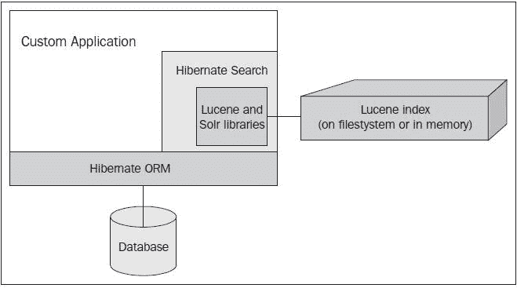

# 序言

在过去的十年里，用户已经期望在搜索数据时软件能够高度智能。仅仅使搜索不区分大小写、作为子字符串查找关键词或其他基本的 SQL 技巧已经不够了。

如今，当用户在电子商务网站上搜索产品目录时，他或她期望关键词能在所有数据点上进行评估。无论一个术语与电脑的型号号还是书的 ISBN 相匹配，搜索都应该找到所有可能性。为了帮助用户筛选大量结果，搜索应该足够智能，以某种方式按相关性对它们进行排名。

搜索应该能够解析单词并理解它们可能如何相互连接。如果你搜索单词`development`，那么搜索应该能够理解这个词与`developer`有关联，尽管这两个单词都不是彼此的子字符串。

最重要的是，搜索应该要友好。当我们在网上论坛中发布东西，把“there”、“they're”和“their”这几个单词弄错了，人们可能只会批评我们的语法。相比之下，搜索应该能够理解我们的拼写错误，并且对此保持冷静！当搜索能够令人愉快地给我们带来惊喜，似乎比我们自己更理解我们在寻找的真实含义时，搜索表现得最好。

这本书的目的是介绍和探索**Hibernate Search**，这是一个用于向我们的自定义应用程序添加现代搜索功能的软件包，而无需从头开始发明。因为程序员通常通过查看真实代码来学习最佳，所以这本书围绕一个示例应用程序展开。我们将随着书的进展而坚持这个应用程序，并在每个章节中引入新概念时丰富它。

# **Hibernate Search** 是什么？

这个搜索功能的真正大脑是 Apache Lucene，这是一个用于数据索引和搜索的开源软件库。Lucene 是一个有着丰富创新历史的成熟 Java 项目，尽管它也被移植到了其他编程语言中。它被广泛应用于各行各业，从迪士尼到推特的知名用户都采用了它。

Lucene 经常与另一个相关项目 Apache Solr 交替讨论。从一个角度来看，Solr 是基于 Lucene 的独立搜索服务器。然而，依赖关系可以双向流动。Solr 的子组件通常与 Lucene 捆绑在一起，以便在嵌入其他应用程序时增强其功能。

### 注意

**Hibernate Search** 是 Lucene 和可选 Solr 组件的薄层封装。它扩展了核心的 Hibernate ORM，这是 Java 持久性最广泛采用的对象/关系映射框架。

下面的图表展示了所有这些组件之间的关系：



最终，Hibernate Search 扮演两个角色：

+   首先，它将 Hibernate 数据对象转换为 Lucene 可以用来构建搜索索引的信息

+   朝着相反的方向前进，它将 Lucene 搜索的结果转换成熟悉的 Hibernate 格式

从一个程序员的角度来看，他或她正以通常的方式使用 Hibernate 映射数据。搜索结果以与正常 Hibernate 数据库查询相同的格式返回。Hibernate Search 隐藏了与 Lucene 的大部分底层管道。

# 本书涵盖内容

第一章, *你的第一个应用*, 直接深入创建一个 Hibernate Search 应用，一个在线软件应用目录。我们将创建一个实体类并为其准备搜索，然后编写一个 Web 应用来执行搜索并显示结果。我们将逐步了解如何设置带有服务器、数据库和构建系统的应用程序，并学习如何用其他选项替换这些组件。

第二章, *映射实体类*, 在示例应用程序中添加了更多的实体类，这些类通过注解来展示 Hibernate Search 映射的基本概念。在本章结束时，您将了解如何为 Hibernate Search 使用映射最常见的实体类。

第三章, *执行查询*, 扩展了示例应用程序的查询，以使用新的映射。在本章结束时，您将了解 Hibernate Search 查询的最常见用例。到这个阶段，示例应用程序将具备足够的功能，类似于许多 Hibernate Search 生产环境的用途。

第四章, *高级映射*, 解释了 Lucene 和 Solr 分析器之间的关系，以及如何为更高级的搜索配置分析器。它还涵盖了在 Lucene 索引中调整字段的权重，以及在运行时确定是否索引实体。在本章结束时，您将了解如何精细调整实体索引。您将品尝到 Solr 分析器框架，并掌握如何自行探索其功能。示例应用程序现在将支持忽略 HTML 标签的搜索，以及查找相关单词的匹配。

第五章, *高级查询*, 更深入地探讨了在第第三章，*执行查询*中介绍的查询概念，解释了如何通过投影和结果转换获得更快的性能。本章探讨了分面搜索，以及原生 Lucene API 的介绍。到本章结束时，您将对 Hibernate Search 提供的查询功能有更坚实的基础。示例市场应用程序现在将使用更轻量级的、基于投影的搜索，并支持按类别组织搜索结果。

第六章，*系统配置和索引管理*，介绍了 Lucene 索引管理，并提供了一些高级配置选项的概览。本章详细介绍了其中一些更常见的选项，并提供了足够的背景知识，使我们能够独立探索其他选项。在本章结束时，你将能够执行标准的管理任务，对 Hibernate Search 使用的 Lucene 索引进行管理，并理解通过配置选项为 Hibernate Search 提供额外功能的能力。

第七章，*高级性能策略*，重点关注通过代码以及服务器架构来提高 Hibernate Search 应用程序的运行时性能。在本章结束时，你将能够做出明智的决定，关于如何按需对 Hibernate Search 应用程序进行扩展。

# 本书需要什么

使用本书中的示例代码，你需要一台安装有 Java 开发工具包（版本 1.6 或更高）的计算机。你还需要安装 Apache Maven，或者安装有 Maven 插件的 Java 集成开发环境（IDE），如 Eclipse。

# 本书适合谁

本书的目标读者是希望为他们的应用程序添加搜索功能的 Java 开发者。本书的讨论和代码示例假设读者已经具备了 Java 编程的基本知识。对**Hibernate ORM**、**Java Persistence API**（**JPA 2.0**）或 Apache Maven 的先验知识会有帮助，但不是必需的。

# 约定

在本书中，你会发现有几种不同信息的文本样式。以下是一些这些样式的示例及其含义的解释。

文本中的代码词汇如下所示："`id`字段被同时注解为`@Id`和`@GeneratedValue`"。

一段代码如下所示：

```java
public App(String name, String image, String description) {
   this.name = name;
   this.image = image;
   this.description = description;
}
```

当我们希望引起你对代码块中的某个特定部分的关注时，相关的行或项目被设置为粗体：

```java
@Column(length=1000)
@Field
private String description;
```

任何命令行输入或输出如下所示：

```java
mvn archetype:generate -DgroupId=com.packpub.hibernatesearch.chapter1 -DartifactId=chapter1 -DarchetypeArtifactId=maven-archetype-webapp 
```

### 注意

警告或重要说明以这样的盒子出现。

### 提示

小贴士和小技巧如下所示。

# 读者反馈

来自我们读者的反馈总是受欢迎的。让我们知道你对这本书的看法——你喜欢或可能不喜欢的地方。读者反馈对我们开发您真正能从中获得最大收益的标题非常重要。

如果您想给我们发送一般性反馈，只需发送一封电子邮件到`<feedback@packtpub.com>`，并在消息主题中提及书名。

如果你在某个主题上有专业知识，并且对撰写或贡献书籍感兴趣，请查看我们在[www.packtpub.com/authors](http://www.packtpub.com/authors)上的作者指南。

# 客户支持

既然你已经拥有了一本 Packt 书籍，我们有很多东西可以帮助你充分利用你的购买。

## 下载示例代码

您可以在 Packt 出版社购买的任何书籍的示例代码文件，可以通过您账户中的[`www.packtpub.com`](http://www.packtpub.com)下载。如果您在其他地方购买了这本书，您可以访问[`www.packtpub.com/support`](http://www.packtpub.com/support)注册，以便将文件直接通过电子邮件发送给您。

## 勘误表

虽然我们已经尽一切努力确保我们内容的准确性，但是错误在所难免。如果您在我们的书中发现任何错误——可能是文本或代码中的错误——我们将非常感谢您能向我们报告。这样做，您可以节省其他读者的挫折感，并帮助我们改进本书的后续版本。如果您发现任何勘误，请通过访问[`www.packtpub.com/support`](http://www.packtpub.com/support)，选择您的书籍，点击**勘误表提交****表单**链接，并输入您的勘误详情。一旦您的勘误得到验证，您的提交将被接受，勘误将被上传到我们的网站，或添加到该标题的勘误表部分现有的勘误列表中。

## 盗版问题

互联网上版权材料的盗版是一个持续存在的问题，涵盖所有媒体。在 Packt，我们对保护我们的版权和许可证非常重视。如果您在互联网上发现我们作品的任何非法副本，无论以何种形式，请立即提供给我们位置地址或网站名称，以便我们可以寻求解决方案。

如果您发现有侵犯版权的材料，请联系我们`<copyright@packtpub.com>`，并提供涉嫌侵权材料的位置链接。

我们感谢您在保护我们的作者和我们提供有价值内容的能力方面所提供的帮助。

## 问题反馈

如果您在阅读本书的过程中遇到任何问题，可以通过`<questions@packtpub.com>`联系我们，我们会尽最大努力解决问题。
