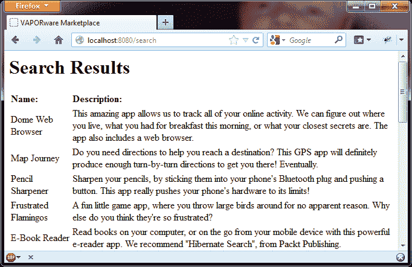
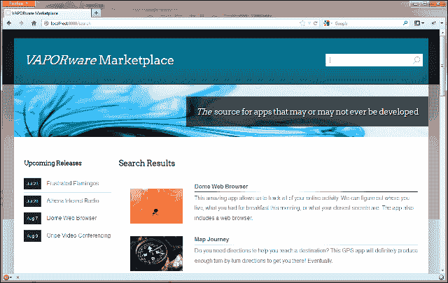

# 第一章：你的第一个应用程序

为了探索**Hibernate Search**的能力，我们将使用对经典“Java 宠物店”示例应用程序的一个变化。我们版本，“VAPORware Marketplace”，将是一个在线软件应用程序目录。想想苹果、谷歌、微软、Facebook 以及……好吧，现在几乎所有其他公司都在运营这样的商店。

我们的应用程序市场将给我们提供大量以不同方式搜索数据的机会。当然，像大多数产品目录一样，有标题和描述。然而，软件应用程序涉及一组更广泛的数据点，如类型、版本和支持的设备。这些不同的方面将让我们看看 Hibernate Search 提供的许多功能。

在高层次上，在应用程序中整合 Hibernate Search 需要以下三个步骤：

1.  向你的实体类中添加信息，以便 Lucene 知道如何索引它们。

1.  在应用程序的相关部分编写一个或多个搜索查询。

1.  设置你的项目，以便在最初就拥有 Hibernate Search 所需的依赖和配置。

在未来的项目中，在我们有了相当基本的了解之后，我们可能从这个第三个项目点开始。然而，现在，让我们直接进入一些代码！

# 创建实体类

为了保持简单，我们这个应用程序的第一个版本将只包括一个实体类。这个`App`类描述了一个软件应用程序，是所有其他实体类都将与之关联的中心实体。不过，现在，我们将给一个“应用程序”提供三个基本数据点：

+   一个名称

+   marketplace 网站上显示的图片

+   一段长描述

下面的 Java 代码：

```java
package com.packtpub.hibernatesearch.domain;

import javax.persistence.Column;
import javax.persistence.Entity;
import javax.persistence.GeneratedValue;
import javax.persistence.Id;

@Entity
public class App {

 @Id
 @GeneratedValue
   private Long id;

 @Column
   private String name;

 @Column(length=1000)
   private String description;

 @Column
   private String image;

   public App() {}

   public App(String name, String image, String description) {
      this.name = name;
      this.image = image;
      this.description = description;
   }

   public Long getId() {
      return id;
   }
   public void setId(Long id) {
      this.id = id;
   }
   public String getName() {
      return name;
   }
   public void setName(String name) {
      this.name = name;
   }
   public String getDescription() {
      return description;
   }
   public void setDescription(String description) {
      this.description = description;
   }
   public String getImage() {
      return image;
   }
   public void setImage(String image) {
      this.image = image;
   }
}
```

这个类是一个基本的**普通旧 Java 对象**（**POJO**），只有成员变量和用于处理它们的 getter/setter 方法。然而，请注意突出显示的注解。

### 注意

如果你习惯了 Hibernate 3.x，请注意版本 4.x 废弃了许多 Hibernate 自己的映射注解，转而使用它们的**Java 持久化 API**（**JPA**）2.0 对应物。我们将在第三章，*执行查询*中进一步讨论 JPA。现在，只需注意这里的 JPA 注解与它们的本地 Hibernate 注解基本相同，除了属于`javax.persistence`包。

该类本身用`@Entity`注解标记，告诉 Hibernate 将该类映射到数据库表。由于我们没有明确指定一个表名，默认情况下，Hibernate 将为`App`类创建一个名为`APP`的表。

`id`字段被注释为`@Id`和`@GeneratedValue`。前者简单地告诉 Hibernate 这个字段映射到数据库表的主键。后者声明当新行被插入时值应该自动生成。这就是为什么我们的构造方法不填充`id`的值，因为我们期待 Hibernate 为我们处理它。

最后，我们用`@Column`注解我们的三个数据点，告诉 Hibernate 这些变量与数据库表中的列相对应。通常，列名与变量名相同，Hibernate 会关于列长度、是否允许空值等做出一些合理的假设。然而，这些设置可以显式声明（就像我们在这里做的那样），通过将描述的列长度设置为 1,000 个字符。

# 为 Hibernate Search 准备实体

现在 Hibernate 知道了我们的领域对象，我们需要告诉 Hibernate Search 插件如何用**Lucene**管理它。

我们可以使用一些高级选项来充分利用 Lucene 的的全部力量，随着这个应用程序的发展，我们会的。然而，在基本场景下使用 Hibernate Search 只需添加两个注解那么简单。

首先，我们将添加`@Indexed`注解到类本身：

```java
...
import org.hibernate.search.annotations.Indexed;
...
@Entity
@Indexed
public class App implements Serializable {
...
```

这简单地声明了 Lucene 应该为这个实体类建立并使用索引。这个注解是可选的。当你编写一个大规模的应用程序时，其中许多实体类可能与搜索无关。Hibernate Search 只需要告诉 Lucene 那些可搜索的类型。

其次，我们将用`@Field`注解声明可搜索的数据点：

```java
...
import org.hibernate.search.annotations.Field;
...
@Id
@GeneratedValue
private Long id;
@Column
@Field
private String name;

@Column(length=1000)
@Field
private String description;

@Column
private String image;
...
```

注意我们只把这个注解应用到`name`和`description`成员变量上。我们没有注释`image`，因为我们不在乎通过图片文件名搜索应用程序。同样，我们也没有注释`id`，因为你要找一个数据库表行通过它的主键，你不需要一个强大的搜索引擎！

### 注意

决定注解什么是一个判断 call。你注释的索引实体越多，作为字段注释的成员变量越多，你的 Lucene 索引就会越丰富、越强大。然而，如果我们仅仅因为可以就注解多余的东西，那么我们就让 Lucene 做不必要的功，这可能会影响性能。

在第七章，*高级性能策略*，我们将更深入地探讨这些性能考虑。现在，我们已经准备好通过名称或描述来搜索应用程序。

# 加载测试数据

为了测试和演示目的，我们将使用一个内嵌数据库，每次启动应用程序时都应该清除并刷新它。在 Java Web 应用程序中，调用启动时间内的代码的一个简单方法是使用`ServletContextListener`。我们只需创建一个实现此接口的类，并用`@WebListener`注解它：

```java
package com.packtpub.hibernatesearch.util;

import javax.servlet.ServletContextEvent;
import javax.servlet.annotation.WebListener;
import org.hibernate.Session;
import org.hibernate.SessionFactory;
import org.hibernate.cfg.Configuration;
import org.hibernate.service.ServiceRegistry;
import org.hibernate.service.ServiceRegistryBuilder;
import com.packtpub.hibernatesearch.domain.App;

@WebListener
public class StartupDataLoader implements ServletContextListener {
   /** Wrapped by "openSession()" for thread-safety, and not meant to be accessed directly. */
   private static SessionFactorysessionFactory;

 /** Thread-safe helper method for creating Hibernate sessions. */
   public static synchronized Session openSession() {
      if(sessionFactory == null) {
         Configuration configuration = new Configuration();
         configuration.configure();
         ServiceRegistryserviceRegistry = new
           ServiceRegistryBuilder().applySettings(
              configuration.getProperties()).buildServiceRegistry();
         sessionFactory =
            configuration.buildSessionFactory(serviceRegistry);
      }
      return sessionFactory.openSession();
   }

   /** Code to run when the server starts up. */
   public void contextInitialized(ServletContextEvent event) {
      // TODO: Load some test data into the database
   }

   /** Code to run when the server shuts down. */
   public void contextDestroyed(ServletContextEvent event) {
      if(!sessionFactory.isClosed()) {
         sessionFactory.close();
      }
   }
}

```

现在，`contextInitialized` 方法将在服务器启动时自动调用。我们将使用此方法设置 Hibernate 会话工厂，并向数据库填充一些测试数据。`contextDestroyed` 方法同样会在服务器关闭时自动调用。我们将使用这个方法在完成时显式关闭我们的会话工厂。

我们应用程序中的多个地方将需要一个简单且线程安全的手段来打开到数据库的连接（即，Hibernate `Session` 对象）。因此，我们还添加了一个名为 `openSession()` 的 `public static synchronized` 方法。该方法作为创建单例 `SessionFactory` 的线程安全守门员。

### 注意

在更复杂的应用程序中，您可能会使用依赖注入框架，如 Spring 或 CDI。这在我们的小型示例应用程序中有些分散注意力，但这些框架为您提供了一种安全机制，用于无需手动编码即可注入 `SessionFactory` 或 `Session` 对象。

在具体化 `contextInitialized` 方法时，我们首先获取一个 Hibernate 会话并开始一个新事务：

```java
...
Session session = openSession();
session.beginTransaction();
...
App app1 = new App("Test App One", "image.jpg",
 "Insert description here");
session.save(app1);

// Create and persist as many other App objects as you like…
session.getTransaction().commit();
session.close();
...

```

在事务内部，我们可以通过实例化和持久化 `App` 对象来创建所有我们想要的数据样本。为了可读性，这里只创建了一个对象。然而，在 [`www.packtpub.com`](http://www.packtpub.com) 可下载的源代码中包含了一个完整的测试示例集合。

# 编写搜索查询代码

我们的 VAPORware Marketplace 网络应用程序将基于 Servlet 3.0 控制器/模型类，呈现 JSP/JSTL 视图。目标是保持事情简单，这样我们就可以专注于 Hibernate Search 方面。在审阅了这个示例应用程序之后，应该很容易将相同的逻辑适配到 JSF 或 Spring MVC，甚至更新的基于 JVM 的框架，如 Play 或 Grails。

首先，我们将编写一个简单的 `index.html` 页面，包含一个用户输入搜索关键词的文本框：

```java
<html >
<head>
   <title>VAPORware Marketplace</title>
</head>
<body>
   <h1>Welcome to the VAPORware Marketplace</h1>
   Please enter keywords to search:
   <form action="search" method="post">
      <div id="search">
         <div>
         <input type="text" name="searchString" />
         <input type="submit" value="Search" />
         </div>
      </div>
   </form>
</body>
</html>
```

这个表单通过 CGI 参数 `searchString` 收集一个或多个关键词，并将其以相对 `/search` 路径提交给一个 URL。我们现在需要注册一个控制器 servlet 来响应这些提交：

```java
package com.packtpub.hibernatesearch.servlet;

import java.io.IOException;

import javax.servlet.ServletException;
import javax.servlet.annotation.WebServlet;
import javax.servlet.http.HttpServlet;
import javax.servlet.http.HttpServletRequest;
import javax.servlet.http.HttpServletResponse;

@WebServlet("search")
public class SearchServletextends HttpServlet {
   protected void doPost(HttpServletRequest request,
         HttpServletResponse response) throws ServletException,
         IOException {

      // TODO: Process the search, and place its results on
      // the "request" object

      // Pass the request object to the JSP/JSTL view
      // for rendering
 getServletContext().getRequestDispatcher(
 "/WEB-INF/pages/search.jsp").forward(request, response);
   }

   protected void doGet(HttpServletRequest request,
         HttpServletResponse response) throws ServletException,
         IOException {
      this.doPost(request, response);
   }

}
```

`@WebServlet` 注解将这个 servlet 映射到相对 URL `/search`，这样提交到这个 URL 的表单将调用 `doPost` 方法。这个方法将处理一个搜索，并将请求转发给一个 JSP 视图进行渲染。

现在，我们来到了问题的核心——执行搜索查询。我们创建了一个 `FullTextSession` 对象，这是 Hibernate Search 的一个扩展，它用 Lucene 搜索功能包装了一个普通的 `Session`。

```java
...
import org.hibernate.Session;
import org.hibernate.search.FullTextSession;
import org.hibernate.search.Search;
...
Session session = StartupDataLoader.openSession();
FullTextSessionfullTextSession =   
   Search.getFullTextSession(session);
fullTextSession.beginTransaction();
...
```

现在我们有了 Hibernate `Search` 会话可以使用，我们可以获取用户的关键词并执行 Lucene 搜索：

```java
...
import org.hibernate.search.query.dsl.QueryBuilder;
...
String searchString = request.getParameter("searchString");

QueryBuilderqueryBuilder =
fullTextSession.getSearchFactory()
   .buildQueryBuilder().forEntity( App.class ).get();
org.apache.lucene.search.QueryluceneQuery =
 queryBuilder
 .keyword()
 .onFields("name", "description")
 .matching(searchString)
   .createQuery();
...
```

正如其名称所示，`QueryBuilder` 用于构建涉及特定实体类的查询。在这里，我们为我们的 `App` 实体创建了一个构建器。

请注意，在前面的代码的第三行中，有一个很长的方法调用链。从 Java 的角度来看，我们是在调用一个方法，在对象返回后调用另一个方法，并重复这个过程。然而，从简单的英语角度来看，这个方法调用链就像一个句子：

> **构建**一个**关键词**类型的查询，在实体**字段**"name"和"description"上，**匹配**"searchString"中的关键词。

这种 API 风格是有意为之的。因为它本身就像是一种语言，所以被称为 Hibernate Search **DSL**（**领域特定语言**）。如果你曾经使用过 Hibernate ORM 中的条件查询，那么这里的视觉感受对你来说应该是非常熟悉的。

现在我们已经创建了一个`org.apache.lucene.search.Query`对象，Hibernate Search 在幕后将其转换为 Lucene 搜索。这种魔力是双向的！Lucene 搜索结果可以转换为标准的`org.hibernate.Query`对象，并且像任何正常的数据库查询一样使用：

```java
...
org.hibernate.Query hibernateQuery =
   fullTextSession.createFullTextQuery(luceneQuery, App.class);
List<App> apps = hibernateQuery.list();
request.setAttribute("apps", apps);
...
```

使用`hibernateQuery`对象，我们获取了在搜索中找到的所有`App`实体，并将它们放在 servlet 请求中。如果你还记得，我们方法的最后一行将这个请求转发到一个`search.jsp`视图以供显示。

这个 JSP 视图将始于非常基础的内容，使用 JSTL 标签从请求中获取`App`结果并遍历它们：

```java
<%@ page language="java" contentType="text/html;
   charset=UTF-8" pageEncoding="UTF-8"%>
<%@ tagliburi="http://java.sun.com/jsp/jstl/core" prefix="c" %>
<html>
<head>
   <title>VAPORware Marketplace</title>
</head>
<body>
   <h1>Search Results</h1>
   <table>
   <tr>
      <td><b>Name:</b></td>
      <td><b>Description:</b></td>
   </tr>
 <c:forEachvar="app" items="${apps}">
   <tr>
      <td>${app.name}</td>
      <td>${app.description}</td>
   </tr>
   </c:forEach>
</table>
</body>
</html>
```

# 选择一个构建系统

到目前为止，我们以某种逆序的方式对待我们的应用程序。我们基本上跳过了初始项目设置，直接进入代码，这样一旦到达那里，所有的管道都会更有意义。

好了，现在我们已经到达目的地！我们需要将所有这些代码整合到一个有序的项目结构中，确保所有的 JAR 文件依赖项都可用，并建立一个运行 Web 应用程序或将其打包为 WAR 文件的过程。我们需要一个项目构建系统。

一种我们不会考虑的方法是全部手动完成。对于一个使用原始 Hibernate ORM 的小型应用程序，我们可能只需要依赖六个半的 JAR 文件。在这个规模上，我们可能会考虑在我们的首选 IDE（例如 Eclipse、NetBeans 或 IntelliJ）中设置一个标准项目。我们可以从 Hibernate 网站获取二进制分发，并手动复制必要的 JAR 文件，让 IDE 从这里开始。

问题是 Hibernate Search 在幕后有很多东西。等你完成了 Lucene 甚至最基本的 Solr 组件的依赖项添加，依赖项列表会被扩大几倍。即使在这里的第一章，我们的非常基础的 VAPORware Marketplace 应用程序已经需要编译和运行超过三十六个 JAR 文件。这些库之间高度相互依赖，如果你升级了它们中的一个，避免冲突可能真的是一场噩梦。

在这个依赖管理级别，使用自动化构建系统来解决这些问题变得至关重要。在本书中的代码示例中，我们将主要使用 Apache Maven 进行构建自动化。

Maven 的两个主要特点是对基本构建的约定优于配置的方法，以及管理项目 JAR 文件依赖的强大系统。只要项目符合标准结构，我们甚至不必告诉 Maven 如何编译它。这被认为是模板信息。另外，当我们告诉 Maven 项目依赖于哪些库和版本时，Maven 会为我们找出整个依赖层次结构。它确定依赖项本身依赖于哪些库，依此类推。为 Maven 创建了标准仓库格式（参见 [`search.maven.org`](http://search.maven.org) 获取最大的公共示例），这样常见的库都可以自动检索，而无需寻找它们。

Maven 确实有自己的批评者。默认情况下，它的配置是基于 XML 的，这在最近几年已经不再流行了。更重要的是，当开发者需要做超出模板基础的事情时，有一个学习曲线。他或她必须了解可用的插件、Maven 构建的生命周期以及如何为适当的生命周期阶段配置插件。许多开发者都有过在学习曲线上的沮丧经历。

最近创建了许多其他构建系统，试图以更简单的形式 harness Maven 的相同力量（例如，基于 Groovy 的 Gradle，基于 Scala 的 SBT，基于 Ruby 的 Buildr 等）。然而，重要的是要注意，所有这些新系统仍然设计为从标准 Maven 仓库获取依赖项。如果您希望使用其他依赖管理和构建系统，那么本书中看到的概念将直接适用于这些其他工具。

为了展示一种更加手动、非 Maven 的方法，从 Packt Publishing 网站下载的示例代码包括本章示例应用程序的基于 Ant 的版本。寻找与基于 Maven 的 `chapter1` 示例对应的子目录 `chapter1-ant`。这个子目录的根目录中有一个 `README` 文件，强调了不同之处。然而，主要收获是书中展示的概念应该很容易翻译成任何现代的 Java 应用程序构建系统。

# 设置项目并导入 Hibernate Search

我们可以使用我们选择的 IDE 创建 Maven 项目。Eclipse 通过可选的 `m2e` 插件与 Maven 配合使用，NetBeans 使用 Maven 作为其本地构建系统。如果系统上安装了 Maven，您还可以选择从命令行创建项目：

```java
mvn archetype:generate -DgroupId=com.packpub.hibernatesearch.chapter1 -DartifactId=chapter1 -DarchetypeArtifactId=maven-archetype-webapp
```

在任何情况下，使用 Maven `archetype`都可以节省时间，`archetype`基本上是给定项目类型的一个模板。在这里，`maven-archetype-webapp`为我们提供了一个空白的网络应用程序，配置为打包成 WAR 文件。`groupId`和`artifactId`可以是任何我们希望的。如果我们将构建输出存储在 Maven 仓库中，它们将用于识别我们的构建输出。

我们新创建项目的`pom.xml` Maven 配置文件开始看起来类似于以下内容：

```java
<?xml version="1.0"?>
<project xsi:schemaLocation="http://maven.apache.org/POM/4.0.0 
      http://maven.apache.org/xsd/maven-4.0.0.xsd"  

         >

   <modelVersion>4.0.0</modelVersion>
   <groupId>com.packpub.hibernatesearch.chapter1</groupId>
   <artifactId>chapter1</artifactId>
   <version>0.0.1-SNAPSHOT</version>
   <packaging>war</packaging>
   <name>chapter1</name>
   <url>http://maven.apache.org</url>

   <dependencies>
      <dependency>
         <groupId>junit</groupId>
         <artifactId>junit</artifactId>
         <version>3.8.1</version>
         <scope>test</scope>
      </dependency>
   </dependencies>

   <build>
 <!-- This controls the filename of the built WAR file -->
      <finalName>vaporware</finalName>
   </build>
</project>
```

我们首要的任务是声明编译和运行所需的依赖关系。在`<dependencies>`元素内，让我们添加一个 Hibernate Search 的条目：

```java
...
<dependency>
   <groupId>org.hibernate</groupId>
   <artifactId>hibernate-search</artifactId>
   <version>4.2.0.Final</version>
</dependency>
...
```

等等，我们之前不是说这需要超过三个小时的依赖项吗？是的，那是真的，但这并不意味着你必须处理它们全部！当 Maven 到达仓库并抓取这个依赖项时，它还将收到有关所有其依赖项的信息。Maven 沿着梯子一路下滑，每一步都解决任何冲突，并计算出一个依赖层次结构，以便您不必这样做。

我们的应用程序需要一个数据库。为了简单起见，我们将使用 H2 ([www.h2database.com](http://www.h2database.com))，一个嵌入式数据库系统，整个系统只有一个 1 MB 的 JAR 文件。我们还将使用**Apache Commons** **数据库连接池** ([commons.apache.org/dbcp](http://commons.apache.org/dbcp))以避免不必要的打开和关闭数据库连接。这些只需要声明每个依赖关系：

```java
...
<dependency>
  <groupId>com.h2database</groupId>
  <artifactId>h2</artifactId>
  <version>1.3.168</version>
</dependency>
<dependency>
  <groupId>commons-dbcp</groupId>
  <artifactId>commons-dbcp</artifactId>
  <version>1.4</version>
</dependency>
...
```

最后但同样重要的是，我们想要指定我们的网络应用程序正在使用 JEE Servlet API 的 3.x 版本。在下面的依赖关系中，我们将作用域指定为`provided`，告诉 Maven 不要将这个 JAR 文件打包到我们的 WAR 文件中，因为反正我们期望我们的服务器会提供：

```java
...
<dependency>
  <groupId>javax.servlet</groupId>
  <artifactId>javax.servlet-api</artifactId>
  <version>3.0.1</version>
  <scope>provided</scope>
</dependency>
...
```

有了我们的 POM 文件完备之后，我们可以将之前创建的源文件复制到我们的项目中。这三个 Java 类列在`src/main/java`子目录下。`src/main/webapp`子目录代表我们网络应用程序的文档根。`index.html`搜索页面及其`search.jsp`结果对应页面放在这里。下载并检查项目示例的结构。

# 运行应用程序

运行一个 Servlet 3.0 应用程序需要 Java 6 或更高版本，并且需要一个兼容的 Servlet 容器，如 Tomcat 7。然而，如果您使用嵌入式数据库以使测试和演示更简单，那么为什么不用嵌入式应用程序服务器呢？

**Jetty web** **服务器** ([www.eclipse.org/jetty](http://www.eclipse.org/jetty))有一个非常适合 Maven 和 Ant 的插件，它让开发者可以在不安装服务器的情况下从构建脚本中启动他们的应用程序。Jetty 8 或更高版本支持 Servlet 3.0 规范。

要向您的 Maven POM 中添加 Jetty 插件，请在`root`元素内插入一小块 XML：

```java
<project>
...
<build>
   <finalName>vaporware</finalName>
   <plugins>
      <plugin>
         <groupId>org.mortbay.jetty</groupId>
         <artifactId>jetty-maven-plugin</artifactId>
         <version>8.1.7.v20120910</version>
 <configuration>
 <webAppConfig>
 <defaultsDescriptor>
 ${basedir}/src/main/webapp/WEB-INF/webdefault.xml
 </defaultsDescriptor>
 </webAppConfig>
 </configuration>
      </plugin>
   </plugins>
</build>
</project>
```

高亮显示的`<configuration>`元素是可选的。在大多数操作系统上，在 Maven 启动一个嵌入式 Jetty 实例之后，你可以在不重新启动的情况下立即进行更改并看到它们生效。然而，由于 Microsoft Windows 在处理文件锁定方面的问题，你有时无法在 Jetty 实例运行时保存更改。

所以，如果你正在使用 Windows 并且希望有实时进行更改的能力，那么就复制一份`webdefault.xml`的定制副本，并将其保存到前面片段中引用的位置。这个文件可以通过下载并使用解压缩工具打开一个`jetty-webapp` JAR 文件来找到，或者简单地从 Packt Publishing 网站下载这个示例应用程序。对于 Windows 用户来说，关键是要找到`useFileMappedBuffer`参数，并将其值更改为`false`。

既然你已经有了一个 Web 服务器，那么让我们让它为我们创建和管理一个 H2 数据库。当 Jetty 插件启动时，它将自动寻找文件`src/main/webapp/WEB-INF/jetty-env.xml`。让我们创建这个文件，并使用以下内容填充它：

```java
<?xml version="1.0"?>
<!DOCTYPE Configure PUBLIC "-//Mort Bay Consulting//DTD
   Configure//EN" "http://jetty.mortbay.org/configure.dtd">

<Configure class="org.eclipse.jetty.webapp.WebAppContext">
   <New id="vaporwareDB" class="org.eclipse.jetty.plus.jndi.Resource">
      <Arg></Arg>
      <Arg>jdbc/vaporwareDB</Arg>
      <Arg>
      <New class="org.apache.commons.dbcp.BasicDataSource">
         <Set name="driverClassName">org.h2.Driver</Set>
         <Set name="url">
 jdbc:h2:mem:vaporware;DB_CLOSE_DELAY=-1
         </Set>
      </New>
      </Arg>
   </New>
</Configure>
```

这使得 Jetty 生成一个 H2 数据库连接池，JDBC URL 指定的是内存中的数据库，而不是文件系统上的持久数据库。我们将这个数据源以`jdbc/vaporwareDB`的名称注册到 JNDI 中，所以我们的应用程序可以通过这个名字来访问它。我们在应用程序的`src/main/webapp/WEB-INF/web.xml`文件中添加一个相应的引用：

```java
<!DOCTYPE web-app PUBLIC
      "-//Sun Microsystems, Inc.//DTD Web Application 2.3//EN"
      "http://java.sun.com/dtd/web-app_2_3.dtd" >
<web-app 

      xsi:schemaLocation="http://java.sun.com/xml/ns/javaee   
      http://java.sun.com/xml/ns/javaee/web-app_3_0.xsd"      
      version="3.0">
   <display-name>VAPORware Marketplace</display-name>
   <resource-ref>
      <res-ref-name>jdbc/vaporwareDB</res-ref-name>
      <res-type>javax.sql.DataSource</res-type>
      <res-auth>Container</res-auth>
   </resource-ref>
</web-app>
```

最后，我们需要通过一个标准的`hibernate.cfg.xml`文件将这个数据库资源与 Hibernate 绑定，这个文件我们将创建在`src/main/resources`目录下：

```java
<?xml version='1.0' encoding='utf-8'?>
<!DOCTYPE hibernate-configuration PUBLIC
      "-//Hibernate/Hibernate Configuration DTD 3.0//EN"
      "http://www.hibernate.org/dtd/hibernate-configuration-
      3.0.dtd">
<hibernate-configuration>
   <session-factory>
      <property name="connection.datasource">
         jdbc/vaporwareDB
      </property>
      <property name="hibernate.dialect">
         org.hibernate.dialect.H2Dialect
      </property>
      <property name="hibernate.hbm2ddl.auto">
         update
      </property>
      <property name="hibernate.show_sql">
         false
      </property>
      <property name=hibernate.search.default.directory_provider">
         filesystem
      </property>
      <property name="hibernate.search.default.indexBase">
         target/lucenceIndex
      </property>

      <mapping class=
              "com.packtpub.hibernatesearch.domain.App"/>
   </session-factory>
</hibernate-configuration>
```

第一行高亮显示的代码将 Hibernate 会话工厂与 Jetty 管理的`jdbc/vaporwareDBdata`数据源关联起来。最后一行高亮显示的代码将`App`声明为一个与这个会话工厂绑定的实体类。目前我们只有这个一个实体，但随着后面章节中更多实体的引入，我们将在这里添加更多的`<class>`元素。

在此之间，`<properties>`元素的大部分与核心设置相关，这些对于有经验的 Hibernate 用户来说可能很熟悉。然而，高亮显示的属性是针对 Hibernate Search 附加组件的。`hibernate.search.default.directory_provider`声明我们希望在文件系统上存储我们的 Lucene 索引，而不是在内存中。`hibernate.search.default.indexBase`指定索引的位置，在我们项目的子目录中，Maven 在构建过程期间会为我们清理这个目录。

好的，我们有一个应用程序，一个数据库，还有一个服务器将这两者结合在一起。现在，我们可以实际部署和启动，通过运行带有`jetty:run`目标的 Maven 命令来实现：

```java
mvn clean jetty:run

```

`clean`目标消除了先前构建的痕迹，然后因为`jetty:run`的暗示，Maven 组装我们的 Web 应用程序。我们的代码很快被编译，并在`localhost:8080`上启动了一个 Jetty 服务器：


我们上线了！现在我们可以使用我们喜欢的任何关键词搜索应用程序。一个小提示：在可下载的示例代码中，所有测试数据记录的描述中都包含单词`app`：



可下载的示例代码让 HTML 看起来更加专业。它还将在每个应用程序的名称和描述旁边添加应用程序的图片：



Maven 命令`mvn clean package`允许我们将应用程序打包成 WAR 文件，因此我们可以将其部署到 Maven Jetty 插件之外的独立服务器上。只要你知道如何为 JNDI 名称`jdbc/vaporwareDB`设置数据源，就可以使用任何符合 Servlet 3.0 规范的 Java 服务器（例如，Tomcat 7+），所以你都可以这样做。

事实上，你可以将`H2`替换为你喜欢的任何独立数据库。只需将适当的 JDBC 驱动添加到你的 Maven 依赖项中，并在`persistence.xml`中更新设置。

# 摘要

在本章中，我们学习了 Hibernate ORM、Hibernate Search 扩展和底层 Lucene 搜索引擎之间的关系。我们了解了如何将实体和字段映射以使它们可供搜索。我们使用 Hibernate Search DSL 编写跨多个字段的全文搜索查询，并且像处理正常数据库查询一样处理结果。我们使用自动构建过程来编译我们的应用程序，并将其部署到一个带有实时数据库的 Web 服务器上。

仅凭这些工具，我们就可以将 Hibernate Search 立即集成到许多实际应用程序中，使用任何其他服务器或数据库。在下一章中，我们将深入探讨 Hibernate Search 为映射实体对象到 Lucene 索引提供的选项。我们将了解如何处理扩展的数据模型，将我们的 VAPORware 应用程序与设备和客户评论关联起来。
