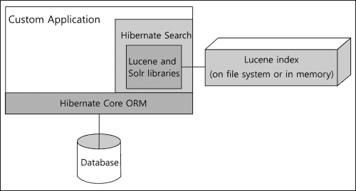
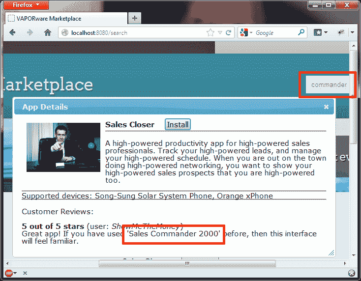

# 第二章：映射实体类

在第一章，*你的第一个应用*中，我们使用了核心 Hibernate ORM 来将一个实体类映射到数据库表，然后使用 Hibernate Search 将它的两个字段映射到一个 Lucene 索引。仅凭这一点，就提供了很多搜索功能，如果从头开始编写将会非常繁琐。

然而，实际应用通常涉及许多实体，其中许多应该可供搜索使用。实体可能相互关联，我们的查询需要理解这些关联，这样我们才能一次性搜索多个实体。我们可能希望声明某些映射对于搜索来说比其他映射更重要，或者在某些条件下我们可能希望跳过索引数据。

在本章中，我们将开始深入探讨 Hibernate Search 为映射实体提供的选项。作为一个第一步，我们必须查看 Hibernate ORM 中的 API 选项。我们如何将实体类映射到数据库，这将影响 Hibernate Search 如何将它们映射到 Lucene。

# 选择 Hibernate ORM 的 API

当 Hibernate Search 文档提到 Hibernate ORM 的不同 API 时，可能会令人困惑。在某些情况下，这可能指的是是否使用 `org.hibernate.Session` 或者 `javax.persistence.EntityManager` 对象（下一章的重要部分）来执行数据库查询。然而，在实体映射的上下文中，这指的是 Hibernate ORM 提供的三种不同的方法：

+   使用经典 Hibernate 特定注解的基于注解的映射

+   使用 Java 持久化 API（JPA 2.0）的基于注解的映射

+   使用 `hbm.xml` 文件的基于 XML 的映射

如果你只使用过 Hibernate ORM 的经典注解或基于 XML 的映射，或者如果你是 Hibernate 的新手，那么这可能是你第一次接触到 JPA。简而言之，JPA 是一个规范，旨在作为对象关系映射和其他类似功能的官方标准。

想法是提供 ORM 所需的类似于 JDBC 提供的低级数据库连接。一旦开发者学会了 JDBC，他们就可以快速使用任何实现 API 的数据库驱动程序（例如，Oracle、PostgreSQL、MySQL 等）。同样，如果你理解了 JPA，那么你应该能够轻松地在 Hibernate、EclipseLink 和 Apache OpenJPA 等 ORM 框架之间切换。

实际上，不同的实现通常有自己的怪癖和专有扩展，这可能会导致过渡性头痛。然而，一个共同的标准可以大大减少痛苦和学习曲线。

使用 Hibernate ORM 原生 API 与使用 JPA 进行实体映射的比较如下图所示：



对长期使用 Hibernate 的开发人员来说好消息是，JPA 实体映射注解与 Hibernate 自己的注解非常相似。实际上，Hibernate 的创始人参与了 JPA 委员会的开发，这两个 API 相互之间有很强的影响。

取决于你的观点，不那么好的消息是 Hibernate ORM 4.x 弃用自己的映射注解，以支持其 JPA 对应物。这些较旧的注解计划在 Hibernate ORM 5.x 中删除。

### 提示

如今使用这种已弃用的方法编写新代码没有意义，因此我们将忽略 Hibernate 特定的映射注解。

第三种选择，基于 XML 的映射，在遗留应用程序中仍然很常见。它正在失去青睐，Hibernate Search 文档甚至开玩笑说 XML 不适合 21 世纪！当然，这有点开玩笑，考虑到基本的 Hibernate 配置仍然存储在`hibernate.cfg.xml`或`persistence.xml`文件中。尽管如此，大多数 Java 框架的趋势很明显，对于与特定类绑定的配置使用注解，对于全局配置使用某种形式的文本文件。

即使你使用`hbm.xml`文件将实体映射到数据库，你仍然可以使用 Hibernate Search 注解将这些实体映射到 Lucene 索引。这两个完全兼容。如果你想在最小努力的情况下将 Hibernate Search 添加到遗留应用程序中，或者即使在开发新应用程序时也有哲学上的偏好使用`hbm.xml`文件，这很方便。

本章包含 VAPORware Marketplace 应用程序的三种版本示例代码：

+   `chapter2`子目录继续第一章, *你的第一个应用程序*的讲解，使用 JPA 注解将实体同时映射到数据库和 Lucene。

+   `chapter2-xml`子目录是相同代码的一个变体，修改为将基于 XML 的数据库映射与基于 JPA 的 Lucene 映射混合。

+   `chapter2-mapping`子目录使用一个特殊的 API 来完全避免注解。这在本章末尾的*程序化映射 API*部分中进一步讨论。

你应该详细探索这些示例代码，以了解可用的选项。然而，除非另有说明，本书中的代码示例将重点介绍使用 JPA 注解对数据库和 Lucene 进行映射。

### 注意

当使用 JPA 注解进行数据库映射时，Hibernate Search 会自动为用`@Id`注解的字段创建一个 Lucene 标识符。

出于某种原因，Hibernate Search 无法与 Hibernate ORM 自身的映射 API 相同。因此，当你不使用 JPA 将实体映射到数据库时，你也必须在应该用作 Lucene 标识符的字段上添加`@DocumentId`注解（在 Lucene 术语中，实体被称为**文档**）。

# 字段映射选项

在第一章*你的第一个应用*中，我们看到了 Hibernate 管理的类上的成员变量可以通过`@Field`注解变得可搜索。Hibernate Search 会将关于注解字段的信息放入一个或多个 Lucene 索引中，使用一些合理的默认值。

然而，你可以以无数种方式自定义索引行为，其中一些是`@Field`注解本身的可选元素。本书将进一步探讨这些元素，但在这里我们将简要介绍它们：

+   `analyze`：这告诉 Lucene 是存储字段数据原样，还是将其进行分析、解析，并以各种方式处理。它可以设置为`Analyze.YES`（默认）或`Analyze.NO`。我们将在第三章*执行查询*中再次看到这一点。

+   `index`：这控制是否由 Lucene 索引字段。它可以设置为`Index.YES`（默认）或`Index.NO`。在第五章*高级查询*中介绍基于投影的搜索后，使用`@Field`注解但不索引字段听起来可能没有意义，但这将更有意义。

+   `indexNullAs`：这声明了如何处理空字段值。默认情况下，空值将被简单忽略并从 Lucene 索引中排除。然而，在第四章*高级映射*中，你可以强制将空字段索引化为某个默认值。

+   `name`：这是一个自定义名称，用于描述字段在 Lucene 索引中的名称。默认情况下，Hibernate Search 将使用注解的成员变量的名称。

+   `norms`：这决定了是否存储用于提升（boosting）或调整搜索结果默认相关性的索引时间信息。它可以设置为`Norms.YES`（默认）或`Norms.NO`。索引时间提升将在第四章*高级映射*中介绍。

+   `store`：通常，字段以优化搜索的方式进行索引，但这可能不允许以原始形式检索数据。此选项使原始数据以这种方式存储，以至于你可以在稍后直接从 Lucene 而不是数据库中检索它。它可以设置为`Store.NO`（默认）、`Store.YES`或`Store.COMPRESS`。我们将在第五章*高级查询*中与基于投影的搜索一起使用这个选项。

## 相同字段的多重映射

有时，你需要用一组选项对字段进行某些操作，用另一组选项进行其他操作。我们将在第三章*执行查询*中看到这一点，当我们使一个字段既可搜索又可排序。

暂时先说这么多，你可以在同一个字段上有尽可能多的自定义映射。只需包含多个 `@Field` 注解，用复数的 `@Fields` 包裹起来即可：

```java
...
@Column
@Fields({
   @Field,
   @Field(name="sorting_name", analyze=Analyze.NO)
})
private String name;
...
```

现在不用担心这个例子。只需注意，当你为同一个字段创建多个映射时，你需要通过 `name` 元素给它们赋予不同的名称，这样你以后才能正确引用。

## 数值字段映射

在第一章，*你的第一个应用程序*中，我们的实体映射示例仅涉及字符串属性。同样，使用相同的 `@Field` 注解与其他基本数据类型也是完全没问题的。

然而，这种方式映射的字段被 Lucene 以字符串格式索引。这对于我们稍后探讨的技术（如排序和范围查询）来说非常低效。

为了提高此类操作的性能，Hibernate Search 提供了一个用于索引数值字段的特殊数据结构。当映射 `Integer`、`Long`、`Float` 和 `Double`（或它们的原始类型）类型的字段时，此选项是可用的。

要为数值字段使用这个优化的数据结构，你只需在正常的 `@Field` 注解之外添加 `@NumericField` 注解。作为一个例子，让我们在 VAPORware Marketplace 应用程序的 `App` 实体中添加一个价格字段：

```java
...
@Column
@Field
@NumericField
private float price;
...
```

如果你将此注解应用于已经多次映射到 `@Fields` 的属性，你必须指定*哪个*映射应使用特殊的数据结构。这通过给 `@NumericField` 注解一个可选的 `forField` 元素来实现，该元素设置为所需 `@Field` 的相同名称。

# 实体间的关系

每当一个实体类被 `@Indexed` 注解标记时，默认情况下 Hibernate Search 将为该类创建一个 Lucene 索引。我们可以有尽可能多的实体和单独的索引。然而，单独搜索每个索引将是一种非常笨拙和繁琐的方法。

大多数 Hibernate ORM 数据模型已经捕捉了实体类之间的各种关联。当我们搜索实体的 Lucene 索引时，Hibernate Search 难道不应该跟随这些关联吗？在本节中，我们将了解如何使其这样做。

## 关联实体

到目前为止，我们示例应用程序中的实体字段一直是很简单的数据类型。`App` 类代表了一个名为 `APP` 的表，它的成员变量映射到该表的列。现在让我们添加一个复杂类型的字段，用于关联第二个数据库表的一个外键。

在线应用商店通常支持一系列不同的硬件设备。因此，我们将创建一个名为 `Device` 的新实体，代表有 `App` 实体可用的设备。

```java
@Entity
public class Device {

   @Id
   @GeneratedValue
   private Long id;

   @Column
   @Field
   private String manufacturer;

   @Column
   @Field
   private String name;

 @ManyToMany(mappedBy="supportedDevices",
 fetch=FetchType.EAGER,
 cascade = { CascadeType.ALL }
 )
 @ContainedIn
 private Set<App> supportedApps;

   public Device() {
   }

   public Device(String manufacturer, String name,
         Set<App>supportedApps) {
      this.manufacturer = manufacturer;
      this.name = name;
      this.supportedApps = supportedApps;
   }

   //
   // Getters and setters for all fields...
   //

}
```

此类的大多数细节应该从第一章 *你的第一个应用程序* 中熟悉。`Device`用`@Entity`注解标记，因此 Hibernate Search 将为它创建一个 Lucene 索引。实体类包含可搜索的设备名称和制造商名称字段。

然而，`supportedApps`成员变量引入了一个新注解，用于实现这两个实体之间的双向关联。一个`App`实体将包含一个它所支持的所有设备的列表，而一个`Device`实体将包含一个它所支持的所有应用的列表。

### 提示

如果没有其他原因，使用双向关联可以提高 Hibernate Search 的可靠性。

Lucene 索引包含来自关联实体的非规范化数据，但这些实体仍然主要与它们自己的 Lucene 索引相关联。长话短说，当两个实体的关联是双向的，并且变化被设置为级联时，那么当任一实体发生变化时，您都可以确信两个索引都会被更新。

Hibernate ORM 参考手册描述了几种双向映射类型和选项。在这里我们使用`@ManyToMany`，以声明`App`和`Device`实体之间的多对多关系。`cascade`元素被设置以确保此端关联的变化正确地更新另一端。

### 注意

通常，Hibernate 是“懒加载”的。它实际上直到需要时才从数据库中检索关联实体。

然而，这里我们正在编写一个多层应用程序，当我们的搜索结果 JSP 接收到这些实体时，控制器 servlet 已经关闭了 Hibernate 会话。如果视图尝试在会话关闭后检索关联，将会发生错误。

这个问题有几个解决方法。为了简单起见，我们还在`@ManyToMany`注解中添加了一个`fetch`元素，将检索类型从“懒加载”更改为“ eager”。现在当我们检索一个 Device 实体时，Hibernate 会在会话仍然开启时立即获取所有关联的`App`实体。

然而，在大量数据的情况下，积极检索是非常低效的，因此，在第五章 *高级查询* 中，我们将探讨一个更高级的策略来处理这个问题。

迄今为止，关于`supportedApps`的一切都是在 Hibernate ORM 的范畴内。所以最后但并非最不重要的是，我们将添加 Hibernate Search 的`@ContainedIn`注解，声明`App`的 Lucene 索引应包含来自`Device`的数据。Hibernate ORM 已经将这两个实体视为有关联。Hibernate Search 的`@ContainedIn`注解也为 Lucene 设置了双向关联。

双向关联的另一面涉及向`App`实体类提供一个支持`Device`实体类的列表。

```java
...
@ManyToMany(fetch=FetchType.EAGER, cascade = { CascadeType.ALL })
@IndexedEmbedded(depth=1)
private Set<Device>supportedDevices;
...
// Getter and setter methods
...
```

这与关联的`Device`方面非常相似，不同之处在于这里的`@IndexedEmbedded`注解是`@ContainedIn`的反向。

### 注意

如果你的关联对象本身就包含其他关联对象，那么你可能会索引比你想要的更多的数据。更糟糕的是，你可能会遇到循环依赖的问题。

为了防止这种情况，将`@IndexEmbedded`注解的可选`depth`元素设置为一个最大限制。在索引对象时，Hibernate Search 将不会超过指定层数。

之前的代码指定了一层深度。这意味着一个应用将带有关于它支持设备的信息进行索引，但*不包括*设备支持的其他应用的信息。

### 查询关联实体

一旦为 Hibernate Search 映射了关联实体，它们很容易被包含在搜索查询中。以下代码片段更新了`SearchServlet`以将`supportedDevices`添加到搜索字段列表中：

```java
...
QueryBuilderqueryBuilder =
fullTextSession.getSearchFactory().buildQueryBuilder()
      .forEntity(App.class ).get();
org.apache.lucene.search.QueryluceneQuery = queryBuilder
   .keyword()
 .onFields("name", "description", "supportedDevices.name")
   .matching(searchString)
   .createQuery();
org.hibernate.QueryhibernateQuery =
   fullTextSession.createFullTextQuery(luceneQuery, App.class);
...
```

复杂类型与我们迄今为止处理过的简单数据类型略有不同。对于复杂类型，我们实际上并不太关心字段本身，因为字段实际上只是一个对象引用（或对象引用的集合）。

我们真正希望搜索匹配的是复杂类型中的简单数据类型字段。换句话说，我们希望搜索`Device`实体的`name`字段。因此，只要关联类字段已被索引（即使用`@Field`注解），它就可以使用[实体字段].[嵌套字段]格式进行查询，例如之前的代码中的`supportedDevices.name`。

在本章的示例代码中，`StartupDataLoader`已经扩展以在数据库中保存一些`Device`实体并将它们与`App`实体关联。这些测试设备中的一个名为 xPhone。当我们运行 VAPORware Marketplace 应用并搜索这个关键词时，搜索结果将包括与 xPhone 兼容的应用，即使这个关键词没有出现在应用的名称或描述中。

## 嵌入对象

关联实体是完整的实体。它们通常对应自己的数据库表和 Lucene 索引，并且可以独立于它们的关联存在。例如，如果我们删除了在 xPhone 上支持的应用实体，那并不意味着我们想要删除 xPhone 的`Device`。

还有一种不同的关联类型，其中关联对象的生存周期取决于包含它们的实体。如果 VAPORware Marketplace 应用有客户评论，并且一个应用从数据库中被永久删除，那么我们可能期望与它一起删除所有客户评论。

### 注意

经典 Hibernate ORM 术语将这些对象称为**组件**（有时也称为**元素**）。在新版 JPA 术语中，它们被称为**嵌入对象**。

嵌入对象本身并不是实体。Hibernate Search 不会为它们创建单独的 Lucene 索引，并且它们不能在没有包含它们的实体的上下文中被搜索。否则，它们在外观和感觉上与关联实体非常相似。

让我们给示例应用程序添加一个客户评论的嵌入对象类型。`CustomerReview`实例将包括提交评论的人的用户名，他们给出的评分（例如，五颗星），以及他们写的任何附加评论。

```java
@Embeddable
public class CustomerReview {

 @Field
   private String username;

   private int stars;

 @Field
   private String comments;

   publicCustomerReview() {
   }

   public CustomerReview(String username,
         int stars, String comments) {
      this.username = username;
      this.stars = stars;
      this.comments = comments;
   }

   // Getter and setter methods...

}
```

这个类被注解为`@Embeddable`而不是通常的`@Entity`注解，告诉 Hibernate ORM`CustomerReview`实例的生命周期取决于包含它的哪个实体对象。

`@Field`注解仍然应用于可搜索的字段。然而，Hibernate Search 不会为`CustomerReview`创建独立的 Lucene 索引。这个注解只是向包含这个嵌入类其他实体的索引中添加信息。

在我们的案例中，包含类将是`App`。给它一个客户评论作为成员变量：

```java
...
@ElementCollection(fetch=FetchType.EAGER)
@Fetch(FetchMode.SELECT)
@IndexedEmbedded(depth=1)
private Set<CustomerReview>customerReviews;
...
```

而不是使用通常的 JPA 关系注解（例如，`@OneToOne`，`@ManyToMany`等），此字段被注解为 JPA `@ElementCollection`。如果这个字段是一个单一对象，则不需要任何注解。JPA 会简单地根据该对象类具有`@Embeddable`注解来推断出来。然而，当处理嵌入元素的集合时，需要`@ElementCollection`注解。

### 提示

当使用基于经典 XML 的 Hibernate 映射时，`hbm.xml`文件等效物是`<component>`用于单个实例，`<composite-element>`用于集合。请参阅可下载示例应用程序源代码的`chapter2-xml`变体。

`@ElementCollection`注解有一个`fetch`元素设置为使用 eager fetching，原因与本章前面讨论的原因相同。

在下一行，我们使用 Hibernate 特定的`@Fetch`注解，以确保通过多个`SELECT`语句而不是单个`OUTER JOIN`来获取`CustomerReview`实例。这避免了由于 Hibernate ORM 的怪癖而在下载源代码中的注释中进一步讨论而导致的客户评论重复。不幸的是，当处理非常大的集合时，这种模式效率低下，因此在这种情况下你可能希望考虑另一种方法。

查询嵌入对象与关联实体相同。以下是从`SearchServlet`中修改的查询代码片段，以针对嵌入的`CustomerReview`实例的注释字段进行搜索：

```java
...
QueryBuilderqueryBuilder =
fullTextSession.getSearchFactory().buildQueryBuilder()
   .forEntity(App.class ).get();
org.apache.lucene.search.QueryluceneQuery = queryBuilder
   .keyword()
   .onFields("name", "description", "supportedDevices.name",
      "customerReviews.comments")
   .matching(searchString)
   .createQuery();
org.hibernate.QueryhibernateQuery = fullTextSession.createFullTextQuery(
   luceneQuery, App.class);
...
```

现在我们有一个真正进行搜索的查询！`chapter2`版本的`StartupDataLoader`已扩展以加载所有测试应用的客户评论。当在客户评论中找到匹配项时，搜索现在将产生结果，尽管关键词本身没有出现在`App`中。

市场应用中的 VAPORware HTML 也得到了更新。现在每个搜索结果都有一个**完整详情**按钮，它会弹出一个包含支持设备和对该应用的客户评论的模态框。注意在这个截图中，搜索关键词是与客户评论相匹配，而不是与实际的应用描述相匹配：



# 部分索引

关联实体每个都有自己的 Lucene 索引，并在彼此的索引中存储一些数据。对于嵌入对象，搜索信息存储在*专有*的包含实体的索引中。

然而，请注意，这些类可能在不止一个地方被关联或嵌入。例如，如果你的数据模型中有`Customer`和`Publisher`实体，它们可能都有一个`Address`类型的嵌入对象。

通常，我们使用`@Field`注解来告诉 Hibernate Search 哪些字段应该被索引和搜索。但是，如果我们想要这个字段随着相关或嵌入的对象而变化呢？如果我们想要一个字段根据包含它的其他实体是否被索引呢？Hibernate Search 通过`@IndexedEmbedded`注解的可选元素提供了这种能力。这个`includePaths`元素表明在*这个*包含实体的 Lucene 索引中，只应该包含关联实体或嵌入对象的某些字段。

在我们的示例应用程序中，`CustomerReview`类将其`username`和`comments`变量都注解为可搜索的字段。然而，假设对于`App`内的`customerReviews`，我们只关心在评论上进行搜索。`App`的变化如下所示：

```java
...
@ElementCollection(fetch=FetchType.EAGER)
@Fetch(FetchMode.SELECT)
@IndexedEmbedded(depth=1, includePaths = { "comments" })
private Set<CustomerReview>customerReviews;
...
```

尽管`CustomerReview.username`被注解为`@Field`，但这个字段不会添加到`App`的 Lucene 索引中。这节省了空间，通过不必要的索引来提高性能。唯一的权衡是，为了防止错误，我们必须记得在我们的查询代码中避免使用任何未包含的字段。

# 程序化映射 API

在本章开头，我们说过，即使你使用`hbm.xml`文件将实体映射到数据库，你仍然可以使用 Hibernate Search 注解映射到 Lucene。然而，如果你真的想完全避免在实体类中放置注解，有一个 API 可以在运行时以程序化的方式声明你的 Lucene 映射。

如果你需要在运行时根据某些情况更改搜索配置，这可能会有所帮助。这也是如果你不能出于某种原因更改实体类，或者如果你是坚定的配置与 POJO 分离主义者，这是唯一可用的方法。

程序化映射 API 的核心是`SearchMapping`类，它存储了通常从注解中提取的 Hibernate Search 配置。典型的使用方式看起来像我们在前一章看到的查询 DSL 代码。你在`SearchMapping`对象上调用一个方法，然后调用返回对象上的方法，以此类推，形成一个长长的嵌套系列。

每一步可用的方法都直观地类似于你已经见过的搜索注解。`entity()`方法替代了`@Entity`注解，`indexed()`替代了`@Indexed`，`field()`替代了`@Field`，等等。

### 提示

如果你需要在应用程序中使用程序化映射 API，那么你可以在[`www.hibernate.org/subprojects/search/docs`](http://www.hibernate.org/subprojects/search/docs)找到更多详细信息，该链接提供了*参考手册*和*Javadocs*，它们都可供查阅。

在 Javadocs 的起点是`org.hibernate.search.cfg.SearchMapping`类，其他相关的类也都位于`org.hibernate.search.cfg`包中。

从 Packt Publishing 网站下载的源代码中，`chapter2-mapping`子目录包含了一个使用程序化映射 API 的 VAPORware Marketplace 应用程序版本。

这个示例应用的版本包含一个工厂类，其中有一个方法根据需求配置并返回一个`SearchMapping`对象。无论你给这个类或方法起什么名字，只要这个方法用`@org.hibernate.search.annotations.Factory`注解标记即可：

```java
public class SearchMappingFactory {

 @Factory
 public SearchMapping getSearchMapping() {

      SearchMapping searchMapping = new SearchMapping();

      searchMapping
         .entity(App.class)
            .indexed()
            .interceptor(IndexWhenActiveInterceptor.class)
            .property("id", ElementType.METHOD).documentId()
            .property("name", ElementType.METHOD).field()
            .property("description", ElementType.METHOD).field()
            .property("supportedDevices",
               ElementType.METHOD).indexEmbedded().depth(1)
            .property("customerReviews",
               ElementType.METHOD).indexEmbedded().depth(1)

         .entity(Device.class)
            .property("manufacturer", ElementType.METHOD).field()
            .property("name", ElementType.METHOD).field()
            .property("supportedApps",   
               ElementType.METHOD).containedIn()
         .entity(CustomerReview.class)
            .property("stars", ElementType.METHOD).field()
            .property("comments", ElementType.METHOD).field();

      return searchMapping;
   }

}
```

请注意，这个工厂方法严格来说只有三行长。它的主要部分是一个从`SearchMapping`对象开始的连续一行链式方法调用，这个调用将我们的三个持久化类映射到 Lucene。

为了将映射工厂集成到 Hibernate Search 中，我们在主要的`hibernate.cfg.xml`配置文件中添加了一个属性：

```java
...
<property name="hibernate.search.model_mapping">
   com.packtpub.hibernatesearch.util.SearchMappingFactory
</property>
...
```

现在，无论何时 Hibernate ORM 打开一个`Session`，Hibernate Search 以及所有的 Lucene 映射都会随之而来！

# 总结

在本章中，我们扩展了如何为搜索映射类的知识。现在，我们可以使用 Hibernate Search 将实体和其他类映射到 Lucene，无论 Hibernate ORM 如何将它们映射到数据库。如果我们任何时候需要将类映射到 Lucene 而不添加注解，我们可以在运行时使用程序化映射 API 来处理。

我们现在已经知道了如何跨相关实体以及其生命周期依赖于包含实体的嵌入对象管理 Hibernate Search。在这两种情况下，我们都涵盖了一些可能会让开发者绊倒的隐蔽怪癖。最后，我们学习了如何根据包含它们的实体来控制关联或嵌入类的哪些字段被索引。

在下一章中，我们将使用这些映射来处理各种搜索查询类型，并探索它们都共有的重要特性。
