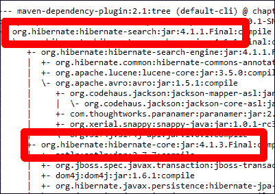
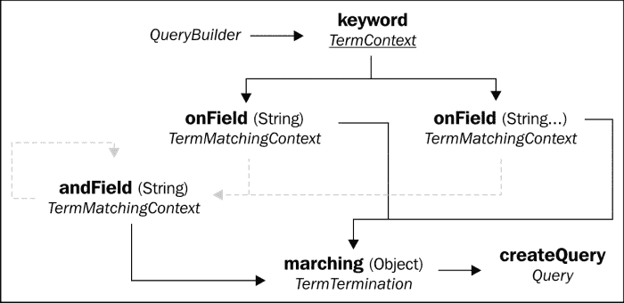
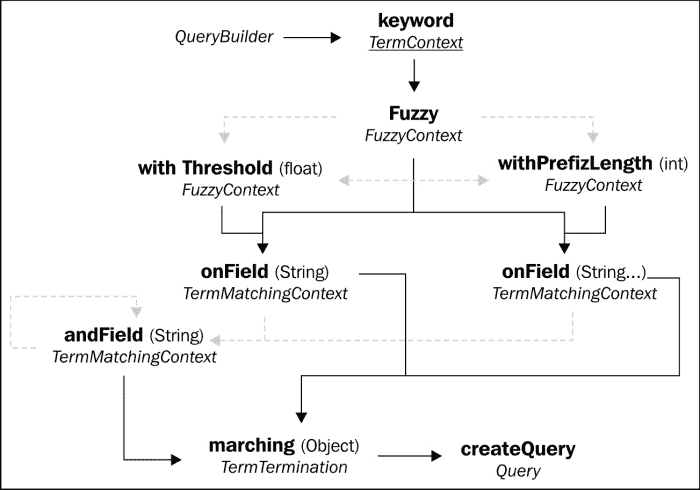
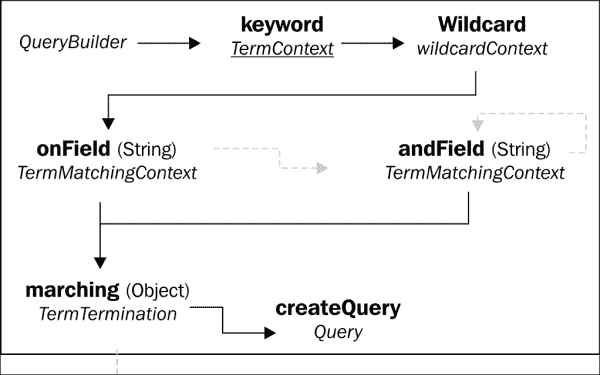
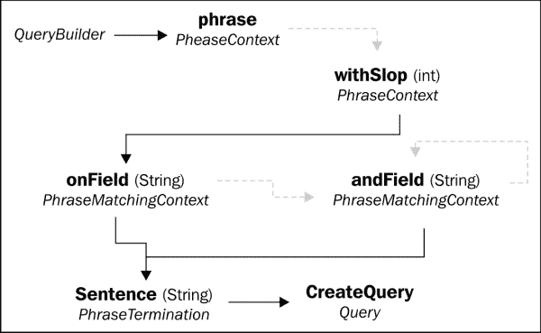
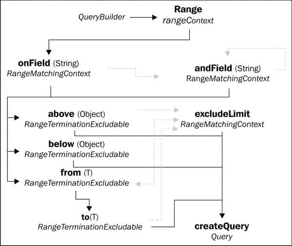
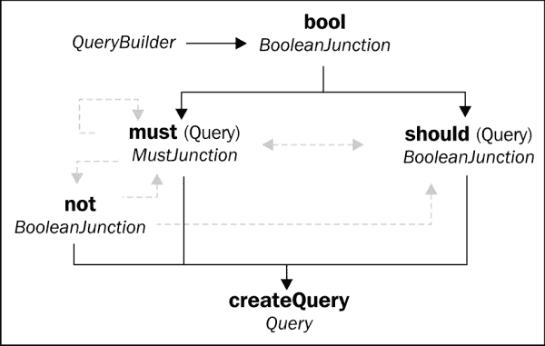
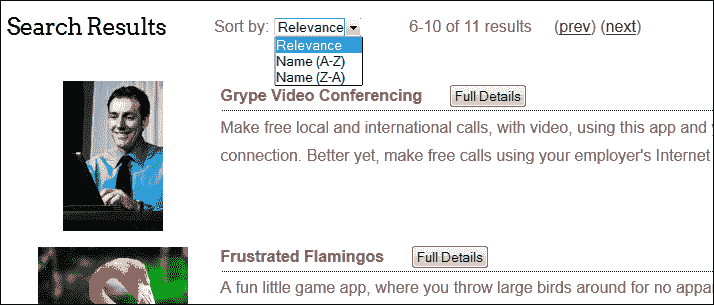

# 第三章：执行查询

在上一章中，我们创建了各种类型的持久化对象，并将它们以各种方式映射到 Lucene 搜索索引中。然而，到目前为止，示例应用程序的所有版本基本上都使用了相同的关键词查询。

在本章中，我们将探讨 Hibernate Search DSL 提供的其他搜索查询类型，以及所有它们共有的重要特性，如排序和分页。

# 映射 API 与查询 API

到目前为止，我们已经讨论了使用 Hibernate ORM 将类映射到数据库的各种 API 选项。你可以使用 XML 或注解来映射你的类，运用 JPA 或传统的 API，只要注意一些细微的差异，Hibernate Search 就能正常工作。

然而，当我们谈论一个 Hibernate 应用程序使用哪个 API 时，答案有两个部分。不仅有一个以上的方法将类映射到数据库，还有运行时查询数据库的选项。Hibernate ORM 有其传统的 API，基于`SessionFactory`和`Session`类。它还提供了一个对应 JPA 标准的实现，围绕`EntityManagerFactory`和`EntityManager`构建。

你可能会注意到，在迄今为止的示例代码中，我们一直使用 JPA 注解将类映射到数据库，并使用传统的 Hibernate `Session`类来查询它们。这可能一开始看起来有些令人困惑，但映射和查询 API 实际上是可互换的。你可以混合使用！

那么，在 Hibernate Search 项目中你应该使用哪种方法呢？尽可能坚持常见标准是有优势的。一旦你熟悉了 JPA，这些技能在你从事使用不同 JPA 实现的其他项目时是可以转移的。

另一方面，Hibernate ORM 的传统 API 比通用的 JPA 标准更强大。此外，Hibernate Search 是 Hibernate ORM 的扩展。在没有找到其他的搜索策略之前，你不能将一个项目迁移到一个不同的 JPA 实现。

### 注意

所以简而言之，尽可能使用 JPA 标准的论据是很强的。然而，Hibernate Search 本来就需要 Hibernate ORM，所以过于教条是没有意义的。在这本书中，大多数示例代码将使用 JPA 注解来映射类，并使用传统的 Hibernate `Session`类来进行查询。

# 使用 JPA 进行查询

虽然我们将重点放在传统的查询 API 上，但可下载的源代码还包含一个不同版本的示例应用程序，在`chapter3-entitymanager`文件夹中。这个 VAPORware Marketplace 变体展示了 JPA 全面使用的情况，用于映射和查询。

在搜索控制器 servlet 中，我们没有使用 Hibernate `SessionFactory`对象来创建`Session`对象，而是使用 JPA `EntityManagerFactory`实例来创建`EntityManager`对象：

```java
...
// The "com.packtpub.hibernatesearch.jpa" identifier is declared
// in "META-INF/persistence.xml"
EntityManagerFactory entityManagerFactory =
   Persistence.createEntityManagerFactory(
   "com.packtpub.hibernatesearch.jpa");
EntityManager entityManager =
   entityManagerFactory.createEntityManager();
...
```

我们已经看到了使用传统查询 API 的代码示例。在之前的示例中，Hibernate ORM 的`Session`对象被包裹在 Hibernate Search 的`FullTextSession`对象中。这些然后生成了实现核心`org.hibernate.Query`接口的 Hibernate `SearchFullTextQuery`对象：

```java
...
FullTextSession fullTextSession = Search.getFullTextSession(session);
...
org.hibernate.search.FullTextQuery hibernateQuery =
   fullTextSession.createFullTextQuery(luceneQuery, App.class);
...
```

与 JPA 相比，常规的`EntityManager`对象同样被`FullTextEntityManager`对象包装。这些创建了实现标准`javax.persistence.Query`接口的`FullTextQuery`对象：

```java
...
FullTextEntityManager fullTextEntityManager =
      org.hibernate.search.jpa.Search.getFullTextEntityManager(
      entityManager);
...
org.hibernate.search.jpa.FullTextQuery jpaQuery =
      fullTextEntityManager.createFullTextQuery(luceneQuery, App.class);
...
```

传统的`FullTextQuery`类及其 JPA 对应类非常相似，但它们是来自不同 Java 包的分开的类。两者都提供了大量我们迄今为止所看到的 Hibernate Search 功能的钩子，并将进一步探索。

### 小贴士

任何`FullTextQuery`版本都可以被强制转换为其相应的查询类型，尽管这样做会失去对 Hibernate Search 方法的直接访问。所以，在转换之前一定要调用任何扩展方法。

如果你在将 JPA 查询强制转换后需要访问非标准方法，那么你可以使用该接口的`unwrap()`方法回到底层的`FullTextQuery`实现。

# 为 Hibernate Search 和 JPA 设置项目

当你的基于 Maven 的项目包含了`hibernate-search`依赖时，它会自动为你拉取三十多个相关依赖。不幸的是，JPA 查询支持并不是其中之一。为了使用 JPA 风格的查询，我们必须自己声明一个额外的`hibernate-entitymanager`依赖。

它的版本需要与已经在依赖层次中`hibernate-core`的版本匹配。这不会总是与`hibernate-search`版本同步。

你的 IDE 可能提供了一种以视觉方式展示依赖层次的方法。无论如何，你总是可以用命令行 Maven 来用这个命令得到相同的信息：

```java
mvn dependency:tree
```



如本输出所示，Hibernate Search 4.2.0.Final 使用核心 Hibernate ORM 4.1.9.Final 版本。因此，应该在 POM 中添加一个`hibernate-entitymanager`依赖，使用与核心相同的版本：

```java
...
<dependency>
   <groupId>org.hibernate</groupId>
   <artifactId>hibernate-entitymanager</artifactId>
   <version>4.1.9.Final</version>
</dependency>
...
```

# Hibernate Search DSL

第一章, *你的第一个应用程序*, 介绍了 Hibernate Search DSL，这是编写搜索查询的最直接方法。在使用 DSL 时，方法调用是以一种类似于编程语言的方式链接在一起的。如果你有在 Hibernate ORM 中使用标准查询的经验，那么这种风格会看起来非常熟悉。

无论你是使用传统的`FullTextSession`对象还是 JPA 风格的`FullTextEntityManager`对象，每个都传递了一个由`QueryBuilder`类生成的 Lucene 查询。这个类是 Hibernate Search DSL 的起点，并提供了几种 Lucene 查询类型。

## 关键字查询

我们已经简要了解的最基本的搜索形式是**关键词查询**。正如名称所暗示的，这种查询类型搜索一个或多个特定的单词。

第一步是获取一个`QueryBuilder`对象，该对象配置为对给定实体进行搜索：

```java
...
QueryBuilderqueryBuilder =
   fullTextSession.getSearchFactory().buildQueryBuilder()
      .forEntity(App.class ).get();
...
```

从那里，以下图表描述了可能的流程。虚线灰色箭头代表可选的侧路径：



关键词查询流程（虚线灰色箭头代表可选路径）

在实际的 Java 代码中，关键词查询的 DSL 将类似于以下内容：

```java
...
org.apache.lucene.search.Query luceneQuery =
 queryBuilder
 .keyword()
 .onFields("name", "description", "supportedDevices.name",
         "customerReviews.comments")
 .matching(searchString)
 .createQuery();
...
```

`onField`方法采用一个索引了相关实体的字段名称。如果该字段不包括在那个 Lucene 索引中，那么查询将失败。还可以搜索相关或内嵌对象字段，使用`"[container-field-name].[field-name]"`格式（例如，`supportedDevices.name`）。

选择性地，可以使用一个或多个`andField`方法来搜索多个字段。它的参数与`onField`完全一样工作。或者，您可以一次性通过`onFields`声明多个字段，如前面的代码片段所示。

匹配方法采用要进行查询的关键词。这个值通常是一个字符串，尽管从技术上讲，参数类型是一个泛型对象，以防您使用字段桥（下一章讨论）。假设您传递了一个字符串，它可能是一个单独的关键词或由空白字符分隔的一系列关键词。默认情况下，Hibernate Search 将分词字符串并分别搜索每个关键词。

最后，`createQuery`方法终止 DSL 并返回一个 Lucene 查询对象。该对象然后可以由`FullTextSession`（或`FullTextEntityManager`）用来创建最终的 Hibernate Search `FullTextQuery`对象：

```java
...
FullTextQuery hibernateQuery =
   fullTextSession.createFullTextQuery(luceneQuery, App.class);
...
```

### 模糊搜索

当我们今天使用搜索引擎时，我们默认它会智能到足以在我们“足够接近”正确拼写时修正我们的拼写错误。向 Hibernate Search 添加这种智能的一种方法是将普通关键词查询**模糊化**。

使用模糊搜索，关键词即使相差一个或多个字符也能与字段匹配。查询运行时有一个介于`0`到`1`之间的**阈值**，其中`0`意味着一切都匹配，而`1`意味着只接受精确匹配。查询的模糊度取决于您将阈值设置得多接近于零。

DSL 以相同的关键词方法开始，最终通过`onField`或`onFields`继续关键词查询流程。然而，在这两者之间有一些新的流程可能性，如下所示：



模糊搜索流程（虚线灰色箭头代表可选路径）

模糊方法只是使普通关键词查询变得“模糊”，默认阈值值为`0.5`（例如，平衡两个极端之间）。您可以从那里继续常规关键词查询流程，这将完全没问题。

然而，您可以选择调用`withThreshold`来指定不同的模糊度值。在本章中，VAPORware Marketplace 应用程序的版本为关键词查询增加了模糊度，阈值设置为`0.7`。这个值足够严格以避免过多的假阳性，但足够模糊，以至于现在拼写错误的搜索“rodio”将匹配“Athena Internet Radio”应用程序。

```java
...
luceneQuery = queryBuilder
   .keyword()
 .fuzzy()
 .withThreshold(0.7f)
   .onFields("name", "description", "supportedDevices.name",
      "customerReviews.comments")
   .matching(searchString)
   .createQuery();
...
```

除了（或代替）`withThreshold`，您还可以使用`withPrefixLength`来调整查询的模糊度。这个整数值是在每个单词的开头您想要从模糊度计算中排除的字符数。

### 通配符搜索

关键词查询的第二个变体不涉及任何高级数学算法。如果您曾经使用过像`*.java`这样的模式来列出目录中的所有文件，那么您已经有了基本概念。

添加**通配符**方法使得普通关键词查询将问号（`?`）视为任何单个字符的有效替代品。例如，关键词`201?`将匹配字段值`2010`、`2011`、`2012`等。

星号（`*`）成为任何零个或多个字符序列的替代品。关键词`down*`匹配`download`、`downtown`等词汇。

Hibernate Search DSL 的通配符搜索与常规关键词查询相同，只是在最前面增加了零参数的`wildcard`方法。



通配符搜索流程（虚线灰色箭头代表可选路径）

## 精确短语查询

当你在搜索引擎中输入一组关键词时，你期望看到匹配其中一个或多个关键词的结果。每个结果中可能不都包含所有关键词，它们可能不会按照你输入的顺序出现。

然而，现在已经习惯于当你将字符串用双引号括起来时，你期望搜索结果包含这个确切的短语。

Hibernate Search DSL 为这类搜索提供了**短语查询**流程。



精确短语查询流程（虚线灰色箭头代表可选路径）

`onField`和`andField`方法的行为与关键词查询相同。`sentence`方法与`matching`的区别在于，其输入必须是`String`。

短语查询可以通过使用可选的`withSlop`子句来实现一种模糊性。该方法接受一个整数参数，代表在短语内可以找到的“额外”单词数，在达到这个数量之前，短语仍被视为匹配。

本章中 VAPORware Marketplace 应用程序的版本现在会检查用户搜索字符串周围是否有双引号。当输入被引号括起来时，应用程序将关键词查询替换为短语查询：

```java
...
luceneQuery = queryBuilder
 .phrase()
   .onField("name")
   .andField("description")
   .andField("supportedDevices.name")
   .andField("customerReviews.comments")
   .sentence(searchStringWithQuotesRemoved)
   .createQuery();
...
```

## 范围查询

短语查询和各种关键词搜索类型，都是关于将字段匹配到搜索词。**范围查询**有点不同，因为它寻找被一个或多个搜索词限定的字段。也就是说，一个字段是大于还是小于给定值，还是在大于或小于两个值之间？



范围查询流程（虚线灰色箭头代表可选路径）

当使用前述方法时，查询的字段必须大于或等于输入参数的值。这个参数是通用的`Object`类型，以增加灵活性。通常使用日期和数字值，尽管字符串也非常合适，并且会根据字母顺序进行比较。

正如你可能会猜到的，下一个方法是一个对应的方法，其中的值必须小于或等于输入参数。要声明匹配必须在两个参数之间，包括这两个参数，你就得使用`from`和`to`方法（它们必须一起使用）。

可以对这些子句中的任何一个应用`excludeLimit`子句。它的作用是将范围变为排他而非包含。换句话说，`from(5).to(10).excludeLimit()`匹配一个`5 <= x < 10`的范围。修改器可以放在`from`子句上，而不是`to`，或者同时放在两个上。

在我们的 VAPORware Marketplace 应用程序中，我们之前拒绝为`CustomerReview.stars`标注索引。然而，如果我们用`@Field`标注它，那么我们就可以用类似于以下的查询来搜索所有 4 星和 5 星的评论：

```java
...
luceneQuery = queryBuilder
   .range()
   .onField("customerReviews.stars")
   .above(3).excludeLimit()
   .createQuery();
...
```

## 布尔（组合）查询

如果你有一个高级用例，其中关键词、短语或范围查询本身不够，但两个或更多组合在一起能满足你的需求，那怎么办？Hibernate Search 允许你用布尔逻辑混合任何查询组合：



布尔查询流程（虚线灰色箭头代表可选路径）

`bool`方法声明这将是一个组合查询。它后面至少跟着一个`onemust`或应该`clause`，每一个都接受一个前面讨论过的各种类型的 Lucene 查询对象。

当使用`must`子句时，一个字段必须与嵌套查询匹配，才能整体匹配查询。可以应用多个`must`子句，它们以**逻辑与**的方式操作。它们都必须成功，否则就没有匹配。

可选的`not`方法用于逻辑上否定一个`must`子句。效果是，整个查询只有在那个嵌套查询不匹配时才会匹配。

`should`子句大致相当于**逻辑或**操作。当一个组合只由`should`子句组成时，一个字段不必匹配它们全部。然而，为了使整个查询匹配，至少必须有一个匹配。

### 注意

你可以组合`must`和`should`子句。然而，如果你这样做，那么`should`嵌套查询就变得完全可选了。如果`must`子句成功，整体查询无论如何都会成功。如果`must`子句失败，整体查询无论如何都会失败。当两种子句类型一起使用时，`should`子句只起到帮助按相关性排名搜索结果的作用。

这个例子结合了一个关键词查询和一个范围查询，以查找拥有 5 星客户评价的"xPhone"应用程序：

```java
...
luceneQuery = queryBuilder
 .bool()
 .must(
      queryBuilder.keyword().onField("supportedDevices.name")
      .matching("xphone").createQuery()
   )
 .must(
      queryBuilder.range().onField("customerReviews.stars")
      .above(5).createQuery()
   )
   .createQuery();
...
```

# 排序

默认情况下，搜索结果按照它们的“相关性”排序返回。换句话说，它们是根据它们与查询的匹配程度进行排名的。我们将在接下来的两章中进一步讨论这一点，并学习如何调整这些相关性计算。

然而，我们有选项可以完全改变排序的其他标准。在典型情况下，你可能会按照日期或数字字段，或者按照字母顺序的字符串字段进行排序。在 VAPORware Marketplace 应用程序的的所有版本中，用户现在可以按照应用程序名称对他们的搜索结果进行排序。

要对一个字段进行排序，当这个字段被映射为 Lucene 索引时，需要特别考虑。通常当一个字符串字段被索引时，默认分析器（在下一章中探讨）会将字符串分词。例如，如果一个`App`实体的`name`字段是"Frustrated Flamingos"，那么在 Lucene 索引中会为"frustrated"和"flamingos"创建单独的条目。这允许进行更强大的查询，但我们希望基于原始未分词的值进行排序。

支持这种情况的一个简单方法是将字段映射两次，这是完全可行的！正如我们在第二章中看到的，*映射实体类*，Hibernate Search 提供了一个复数`@Fields`注解。它包含一个由逗号分隔的`@Field`注解列表，具有不同的分析器设置。

在下面的代码片段中，一个`@Field`被声明为默认的分词设置。第二个则将它的`analyze`元素设置为`Analyze.NO`，以禁用分词，并在 Lucene 索引中给它自己的独立字段名称：

```java
...
@Column
@Fields({
   @Field,
 @Field(name="sorting_name", analyze=Analyze.NO)
})
private String name;
...
```

这个新字段名称可以用如下方式来构建一个 Lucene `SortField`对象，并将其附加到一个 Hibernate Search `FullTextQuery`对象上：

```java
import org.apache.lucene.search.Sort;
import org.apache.lucene.search.SortField;
...
Sort sort = new Sort(
   new SortField("sorting_name", SortField.STRING));
hibernateQuery.setSort(sort);  // a FullTextQuery object
```

当`hibernateQuery`后来返回一个搜索结果列表时，这个列表将按照应用程序名称进行排序，从 A 到 Z 开始。

反向排序也是可能的。`SortField`类还提供了一个带有第三个`Boolean`参数的构造函数。如果这个参数被设置为`true`，排序将以完全相反的方式进行（例如，从 Z 到 A）。

# 分页

当一个搜索查询返回大量的搜索结果时，一次性将它们全部呈现给用户通常是不受欢迎的（或者可能根本不可能）。一个常见的解决方案是分页，或者一次显示一个“页面”的搜索结果。

一个 Hibernate Search `FullTextQuery`对象有方法可以轻松实现分页：

```java
…
hibernateQuery.setFirstResult(10);
hibernateQuery.setMaxResults(5);
List<App> apps = hibernateQuery.list();
…
```

`setMaxResults` 方法声明了页面的最大大小。在前面的代码片段的最后一行，即使查询有数千个匹配项，apps 列表也将包含不超过五个 `App` 对象。

当然，如果代码总是抓取前五个结果，分页将不会很有用。我们还需要能够抓取下一页，然后是下一页，依此类推。因此 `setFirstResult` 方法告诉 Hibernate Search 从哪里开始。

例如，前面的代码片段从第十一个结果项开始（参数是 `10`，但结果是零索引的）。然后将查询设置为抓取下一个五个结果。因此，下一个传入请求可能会使用 `hibernateQuery.setFirstResult(15)`。

拼图的最后一片是知道有多少结果，这样你就可以为正确数量的页面进行规划：

```java
…
intresultSize = hibernateQuery.getResultSize();
…
```

`getResultSize` 方法比乍一看要强大，因为它只使用 Lucene 索引来计算数字。跨所有匹配行的常规数据库查询可能是一个非常资源密集的操作，但对于 Lucene 来说是一个相对轻量级的事务。

### 注意

本章示例应用程序的版本现在使用分页来显示搜索结果，每页最多显示五个结果。查看 `SearchServlet` 和 `search.jsp` 结果页面，了解它们如何使用结果大小和当前起始点来构建所需的“上一页”和“下一页”链接。

以下是 VAPORware Marketplace 更新的实际操作情况：



# 总结

在本章中，我们探讨了 Hibernate Search 查询中最常见的用例。现在，无论 JPA 是整体使用、部分使用还是根本不使用，我们都可以与 Hibernate Search 一起工作。我们了解了 Hibernate Search DSL 提供的核心查询类型，并可以轻松地访问到它们的全部可能流程，而不是不得不浏览 Javadocs 来拼凑它们。

现在我们知道如何按特定字段对搜索结果进行升序或降序排序。对于大型结果集，我们可以现在对结果进行分页，以提高后端性能和前端用户体验。我们 VAPORware Marketplace 示例中的搜索功能现在大于或等于许多生产 Hibernate Search 应用程序。

在下一章中，我们将探讨更高级的映射技术，例如处理自定义数据类型和控制 Lucene 索引过程的详细信息。
