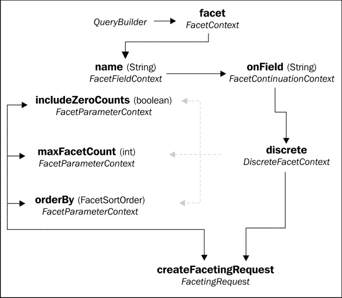
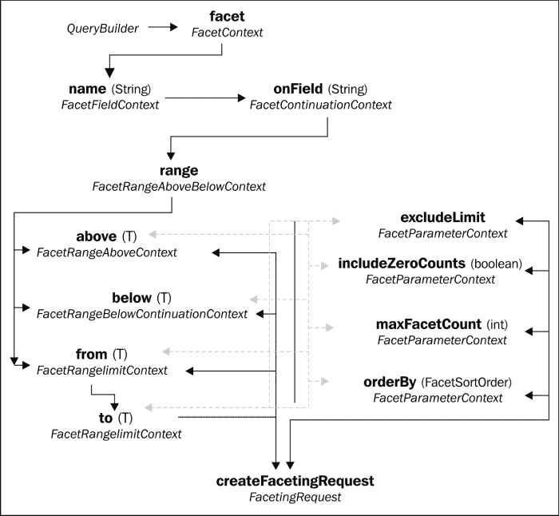
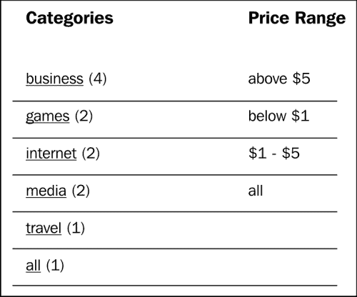

# 第五章：高级查询

在本章中，我们将详细阐述我们在前面章节中介绍的基本搜索查询概念，并融入我们刚刚学到的新的映射知识。现在，我们将探讨使搜索查询更具灵活性和强大性的多种技术。

我们将看到如何在数据库甚至还没有被触碰的情况下，在 Lucene 层面动态地过滤结果。我们还将通过使用基于投影的查询，避免数据库调用，直接从 Lucene 检索属性。我们将使用面向面的搜索，以识别和隔离搜索结果中的数据子集。最后，我们将介绍一些杂项查询工具，如查询时的提升和为查询设置时间限制。

# 过滤

构建查询的过程围绕着寻找匹配项。然而，有时你希望根据一个明确没有匹配的准则来缩小搜索结果。例如，假设我们想要限制我们的 VAPORware Marketplace 搜索，只支持特定设备上的那些应用：

+   向现有查询添加关键词或短语是没有帮助的，因为这只会使查询更加包容。

+   我们可以将现有的查询转换为一个布尔查询，增加一个额外的`must`子句，但这样 DSL 开始变得难以维护。此外，如果你需要使用复杂的逻辑来缩小你的结果集，那么 DSL 可能提供不了足够的灵活性。

+   一个 Hibernate Search 的`FullTextQuery`对象继承自 Hibernate ORM 的`Query`（或其 JPA 对应物）类。因此，我们可以使用像`ResultTransformer`这样的核心 Hibernate 工具来缩小结果集。然而，这需要进行额外的数据库调用，这可能会影响性能。

Hibernate Search 提供了一种更优雅和高效的**过滤器**方法。通过这种机制，各种场景的过滤逻辑被封装在单独的类中。这些过滤器类可以在运行时动态地启用或禁用，也可以以任何组合方式使用。当查询被过滤时，不需要从 Lucene 获取不想要的结果。这减少了后续数据库访问的负担。

## 创建一个过滤器工厂

为了通过支持设备来过滤我们的搜索结果，第一步是创建一个存储过滤逻辑的类。这应该是`org.apache.lucene.search.Filter`的实例。对于简单的硬编码逻辑，你可能只需创建你自己的子类。

然而，如果我们通过过滤器工厂动态地生成过滤器，那么我们就可以接受参数（例如，设备名称）并在运行时定制过滤器：

```java
public class DeviceFilterFactory {

   private String deviceName;

 @Factory
   public Filter getFilter() {
      PhraseQuery query = new PhraseQuery();
      StringTokenizertokenzier = new StringTokenizer(deviceName);
      while(tokenzier.hasMoreTokens()) {
         Term term = new Term(
            "supportedDevices.name", tokenzier.nextToken());
         query.add(term);
      }
 Filter filter = new QueryWrapperFilter(query);
      return new CachingWrapperFilter(filter);
   }

   public void setDeviceName(String deviceName) {
      this.deviceName = deviceName.toLowerCase();
   }

}
```

`@Factory`注解应用于负责生成 Lucene 过滤器对象的方法。在这个例子中，我们注解了恰当地命名为`getFilter`的方法。

### 注意

不幸的是，构建 Lucene `Filter`对象要求我们更紧密地与原始 Lucene API 合作，而不是 Hibernate Search 提供的方便的 DSL 包装器。Lucene 完整 API 非常复杂，要完全覆盖它需要一本完全不同的书。然而，即使这种浅尝辄止也足够深入地为我们提供编写真正有用过滤器的工具。

这个例子通过包装一个 Lucene 查询来构建过滤器，然后应用第二个包装器以促进过滤器缓存。使用特定类型的查询是`org.apache.lucene.search.PhraseQuery`，它相当于我们在第三章，*执行查询*中探讨的 DSL 短语查询。

### 提示

我们在这个例子中研究短语查询，因为它是一种非常有用的过滤器构建类型。然而，总共有 15 种 Lucene 查询类型。你可以探索[`lucene.apache.org/core/old_versioned_docs/versions/3_0_3/api/all/org/apache/lucene/search/Query.html`](http://lucene.apache.org/core/old_versioned_docs/versions/3_0_3/api/all/org/apache/lucene/search/Query.html)上的 JavaDocs。

让我们回顾一下关于数据在 Lucene 索引中是如何存储的一些知识。默认情况下，分析器对字符串进行分词，并将它们作为单独的词项进行索引。默认分析器还将字符串数据转换为小写。Hibernate Search DSL 通常隐藏所有这些细节，因此开发人员不必考虑它们。

然而，当你直接使用 Lucene API 时，确实需要考虑这些事情。因此，我们的`setDeviceName`设置器方法手动将`deviceName`属性转换为小写，以避免与 Lucene 不匹配。`getFilter`方法随后手动将此属性拆分为单独的词项，同样是为了与 Lucene 索引的匹配。

每个分词词项都用于构造一个 Lucene `Term`对象，该对象包含数据和相关字段名（即在这个案例中的`supportedDevices.name`）。这些词项一个接一个地添加到`PhraseQuery`对象中，按照它们在短语中出现的确切顺序。然后将查询对象包装成过滤器并返回。

### 添加过滤器键

默认情况下，Hibernate Search 为更好的性能缓存过滤器实例。因此，每个实例需要引用缓存中的唯一键。在这个例子中，最逻辑的键将是每个实例过滤的设备名称。

首先，我们在过滤器工厂中添加一个新方法，用`@Key`注解表示它负责生成唯一键。这个方法返回`FilterKey`的一个子类：

```java
...
@Key
Public FilterKey getKey() {
   DeviceFilterKey key = new DeviceFilterKey();
   key.setDeviceName(this.deviceName);
   return key;
}
...
```

自定义`FilterKey`子类必须实现`equals`和`hashCode`方法。通常，当实际包装的数据可以表示为字符串时，你可以委派给`String`类相应的`equals`和`hashCode`方法：

```java
public class DeviceFilterKey extends FilterKey {

   private String deviceName;

 @Override
 public boolean equals(Object otherKey) {
      if(this.deviceName == null
           || !(otherKey instanceof DeviceFilterKey)) {
         return false;
      }
      DeviceFilterKeyotherDeviceFilterKey =
           (DeviceFilterKey) otherKey;
      return otherDeviceFilterKey.deviceName != null
              && this.deviceName.equals(otherDeviceFilterKey.deviceName);
   }

 @Override
 public int hashCode() {
      if(this.deviceName == null) {
         return 0;
      }
      return this.deviceName.hashCode();
   }

   // GETTER AND SETTER FOR deviceName...
}
```

## 建立过滤器定义

为了使这个过滤器对我们应用的搜索可用，我们将在`App`实体类中创建一个过滤器定义：

```java
...
@FullTextFilterDefs({
   @FullTextFilterDef(
      name="deviceName", impl=DeviceFilterFactory.class
   )
})
public class App {
...
```

`@FullTextFilterDef`注解将实体类与给定的过滤器或过滤器工厂类关联，由`impl`元素指定。`name`元素是一个字符串，Hibernate Search 查询可以用它来引用过滤器，正如我们在下一小节中看到的。

一个`entity`类可以有任意数量的定义过滤器。复数形式的`@FullTextFilterDefs`注解支持这一点，通过包裹一个由逗号分隔的一个或多个单数形式的`@FullTextFilterDef`注解列表。

## 为查询启用过滤器

最后但并非最不重要的是，我们使用`FullTextQuery`对象的`enableFullTextFilter`方法为 Hibernate Search 查询启用过滤器定义：

```java
...
if(selectedDevice != null && !selectedDevice.equals("all")) {
   hibernateQuery.enableFullTextFilter("deviceName")
      .setParameter("deviceName", selectedDevice);
}
...
```

这个方法的`string`参数与查询中涉及的实体类之一的过滤器定义相匹配。在这个例子中，是`App`上定义的`deviceName`过滤器。当 Hibernate Search 找到这个匹配项时，它会自动调用相应的过滤器工厂来获取一个`Filter`对象。

我们的过滤器工厂使用一个参数，也称为`deviceName`以保持一致性（尽管它是一个不同的变量）。在 Hibernate Search 可以调用工厂方法之前，这个参数必须被设置，通过将参数名和值传递给`setParameter`。

过滤器是在`if`块中启用的，这样在没有选择设备时（也就是，*所有设备*选项），我们可以跳过这一步。如果你检查本章版本 VAPORware Marketplace 应用的可下载代码包，你会看到 HTML 文件已经被修改为添加了设备选择的下拉菜单：


# 投影

在前几章中，我们的示例应用程序在一次大的数据库调用中获取所有匹配的实体。我们在第三章，*执行查询*中引入了分页，以至少限制数据库调用到的行数。然而，由于我们最初已经在 Lucene 索引中搜索数据，真的有必要去数据库吗？

休眠搜索提供了**投影**作为一种减少或至少消除数据库访问的技术。基于投影的搜索只返回从 Lucene 中提取的特定字段，而不是从数据库中返回完整的实体对象。然后你可以去数据库获取完整的对象（如果需要），但 Lucene 中可用的字段本身可能就足够了。

本章的 VAPORware Marketplace 应用程序版本的搜索结果页面修改为现在使用基于查询的投影。之前的版本页面一次性收到`App`实体，并在点击每个应用的**完整详情**按钮之前隐藏每个应用的弹出窗口。现在，页面只接收足够构建摘要视图的字段。每个**完整详情**按钮触发对该应用的 AJAX 调用。只有在那时才调用数据库，并且仅为了获取那一个应用的数据。

### 注意

从 JavaScript 中进行 AJAX 调用以及编写响应这些调用的 RESTful 网络服务的详尽描述，已经超出了本 Hibernate Search 书籍的范围。

说到这里，所有的 JavaScript 都包含在搜索结果的 JSP 中，在`showAppDetails`函数内。所有相应的服务器端 Java 代码都位于`com.packtpub.hibernatesearch.rest`包中，并且非常注释。网络上 endless online primers and tutorials for writing RESTful services, and the documentation for the particular framework used here is at [`jersey.java.net/nonav/documentation/latest`](http://jersey.java.net/nonav/documentation/latest).

## 创建一个基于查询的查询投影

要将`FullTextQuery`更改为基于投影的查询，请对该对象调用`setProjection`方法。现在我们的搜索 servlet 类包含以下内容：

```java
...
hibernateQuery.setProjection("id", "name", "description", "image");
...
```

该方法接受一个或多个字段名称，从与该查询关联的 Lucene 索引中提取这些字段。

## 将投影结果转换为对象形式

如果我们到此为止，那么查询对象的`list()`方法将不再返回`App`对象的列表！默认情况下，基于投影的查询返回对象数组列表（即`Object[]`）而不是实体对象。这些数组通常被称为**元组**。

每个元组中的元素包含投影字段的值，按它们声明的顺序排列。例如，这里`listItem[0]`将包含结果的 ID 值，`field.listItem[1]`将包含名称，`value.listItem[2]`将包含描述，依此类推。

在某些情况下，直接使用元组是很简单的。然而，您可以通过将 Hibernate ORM 结果转换器附加到查询来自动将元组转换为对象形式。这样做再次改变了查询的返回类型，从`List<Object[]>`变为所需对象类型的列表：

```java
...
hibernateQuery.setResultTransformer(
   newAliasToBeanResultTransformer(App.class) );
...
```

您可以创建自己的自定义转换器类，继承自`ResultTransformer`，实现您需要的任何复杂逻辑。然而，在大多数情况下，Hibernate ORM 提供的开箱即用的子类已经足够了。

这里，我们使用`AliasToBeanResultTransformer`子类，并用我们的`App`实体类对其进行初始化。这将与投影字段匹配，并将每个属性的值设置为相应的字段值。

只有`App`的一部分属性是可用的。保留其他属性未初始化是可以的，因为搜索结果的 JSP 在构建其摘要列表时不需要它们。另外，生成的`App`对象实际上不会附加到 Hibernate 会话。然而，我们在此之前已经将我们的结果分离，然后再发送给 JSP。

## 使 Lucene 字段可用于投影

默认情况下，Lucene 索引是为假设它们不会用于基于投影的查询而优化的。因此，投影需要你做一些小的映射更改，并记住几个注意事项。

首先，字段数据必须以可以轻松检索的方式存储在 Lucene 中。正常的索引过程优化数据以支持复杂查询，而不是以原始形式检索。为了以可以被投影恢复的形式存储字段的值，你需要在`@Field`注解中添加一个`store`元素：

```java
...
@Field(store=Store.COMPRESS)
private String description;
...
```

这个元素取三个可能值的枚举：

+   `Store.NO`是默认值。它使字段被索引用于搜索，但不能通过投影以原始形式检索。

+   `Store.YES`使字段以原样包含在 Lucene 索引中。这增加了索引的大小，但使投影变得可能。

+   `Store.COMPRESS`是对妥协的尝试。它也将字段存储原样，但应用压缩以减少整体索引大小。请注意，这更占用处理器资源，并且不适用于同时使用`@NumericField`注解的字段。

其次，一个字段必须使用双向字段桥。Hibernate Search 中所有内置的默认桥都支持这一点。然而，如果你创建自己的自定义桥类型（请参阅第四章，*高级映射*），它必须基于`TwoWayStringBridge`或`TwoWayFieldBridge`。

最后但并非最不重要的是，投影仅适用于实体类本身的基属性。它不是用来获取关联实体或内嵌对象的。如果你尝试引用一个关联，那么你只能得到一个实例，而不是你可能期望的完整集合。

### 提示

如果你需要与关联或内嵌对象一起工作，那么你可能需要采用我们示例应用程序所使用的方法。Lucene 投影检索所有搜索结果的基本属性，包括实体对象的的主键。当我们后来需要与实体对象的关联一起工作时，我们通过数据库调用使用那个主键只检索必要的行。

# 分面搜索

Lucene 过滤器是缩小查询范围到特定子集的强大工具。然而，过滤器对预定义的子集起作用。你必须已经知道你在寻找什么。

有时你需要动态地识别子集。例如，让我们给我们的`App`实体一个表示其类别的`category`属性：

```java
...
@Column
@Field
private String category;
...
```

当我们为应用执行关键字搜索时，我们可能想知道哪些类别在结果中有所体现以及每个类别下有多少结果。我们还可能想知道发现了哪些价格范围。所有这些信息都有助于用户更有效地缩小查询。

## 离散切片

动态识别维度然后通过它们进行过滤的过程称为**切片搜索**。Hibernate Search 查询 DSL 有一个流程为此，从 `QueryBuilder` 对象的 `facet` 方法开始：



离散切片请求流程（虚线灰色箭头表示可选路径）

`name` 方法需要一个描述性标识符作为此切片的名称（例如，`categoryFacet`），以便后来可以通过查询引用它。熟悉的 `onField` 子句声明了按结果分组的字段（例如，`category`）。

`discrete` 子句表示我们是按单个值分组，而不是按值的范围分组。我们将在下一节探讨范围切片。

`createFacetingRequest` 方法完成此过程并返回一个 `FacetingRequest` 对象。然而，还有三个可选的方法，你可以先调用它们中的任何一个，可以任意组合：

+   `includeZeroCounts`：它导致 Hibernate Search 返回所有可能的切片，甚至在当前搜索结果中没有任何点击的那些。默认情况下，没有点击的切片会被悄悄忽略。

+   `maxFacetCount`：它限制返回的切片数量。

+   `orderedBy`：它指定了找到的切片的排序顺序。与离散切片相关的三个选项是：

    +   `COUNT_ASC`: 按相关搜索结果的数量升序排列切片。数量最少点击的切片将被首先列出。

    +   `COUNT_DESC`：这与 `COUNT_ASC` 正好相反。切片从点击量最高到最低依次列出。

    +   `FIELD_VALUE`：按相关字段的值字母顺序排序切片。例如，"business" 类别会在 "games" 类别之前。

本章版本的 VAPORware Marketplace 现在包括以下设置 `app` 类别切片搜索的代码：

```java
...
// Create a faceting request
FacetingRequestcategoryFacetingRequest =
 queryBuilder
 .facet()
   .name("categoryFacet")
   .onField("category")
   .discrete()
   .orderedBy(FacetSortOrder.FIELD_VALUE)
   .includeZeroCounts(false)
   .createFacetingRequest();

// Enable it for the FullTextQuery object
hibernateQuery.getFacetManager().enableFaceting(
   categoryFacetingRequest);
...
```

现在切片请求已启用，我们可以运行搜索查询并使用我们刚刚声明的 `categoryFacet` 名称检索切片信息：

```java
...
List<App> apps = hibernateQuery.list();

List<Facet> categoryFacets =
   hibernateQuery.getFacetManager().getFacets("categoryFacet");
...
```

`Facet` 类包括一个 `getValue` 方法，该方法返回特定组的字段值。例如，如果一些匹配的应用程序属于 "business" 类别，那么其中一个切片将具有字符串 "business" 作为其值。`getCount` 方法报告与该切片关联多少搜索结果。

使用这两个方法，我们的搜索 servlet 可以遍历所有类别切片，并构建一个集合，用于在搜索结果 JSP 中显示：

```java
...
Map<String, Integer> categories = new TreeMap<String, Integer>();
for(Facet categoryFacet : categoryFacets) {

   // Build a collection of categories, and the hit count for each
   categories.put(
 categoryFacet.getValue(),categoryFacet.getCount());

   // If this one is the *selected* category, then re-run the query
   // with this facet to narrow the results
   if(categoryFacet.getValue().equalsIgnoreCase(selectedCategory)) {
      hibernateQuery.getFacetManager()
 .getFacetGroup("categoryFacet").selectFacets(categoryFacet);
       apps = hibernateQuery.list();
   }
}
...
```

如果搜索 servlet 接收到带有`selectedCategory` CGI 参数的请求，那么用户选择将结果缩小到特定类别。所以如果这个字符串与正在迭代的面元值匹配，那么该面元就为`FullTextQuery`对象“选中”。然后可以重新运行查询，它将只返回属于该类别的应用程序。

## 范围面元

面元不仅仅限于单一的离散值。一个面元也可以由一个值范围创建。例如，我们可能想根据价格范围对应用程序进行分组——搜索结果中的价格低于一美元、在一到五美元之间，或者高于五美元。

Hibernate Search DSL 的范围面元需要将离散面元流程的元素与我们在第三章 *执行查询* 中看到的范围查询的元素结合起来：



范围面元请求流程（虚线灰色箭头代表可选路径）

您可以定义一个范围为大于、小于或介于两个值之间（即`from` – `to`）。这些选项可以组合使用以定义尽可能多的范围子集。

与常规范围查询一样，可选的`excludeLimit`方法将其边界值从范围内排除。换句话说，`above(5)`意味着“大于或等于 5”，而`above(5).excludeLimit()`意味着“大于 5，*期终*”。

可选的`includeZeroCounts`、`maxFacetCount`和`orderBy`方法与离散面元的方式相同。然而，范围面元提供了一个额外的排序顺序选择。`FacetSortOrder.RANGE_DEFINITION_ODER`使得面元按照它们被定义的顺序返回（注意“`oder`”中缺少了“`r`”）。

在针对`category`的离散面元请求中，本章的示例代码还包括以下代码段以启用`price`的范围面元：

```java
...
FacetingRequestpriceRangeFacetingRequest =
 queryBuilder
 .facet()
      .name("priceRangeFacet")
      .onField("price")
      .range()
      .below(1f).excludeLimit()
      .from(1f).to(5f)
      .above(5f).excludeLimit()
      .createFacetingRequest();
hibernateQuery.getFacetManager().enableFaceting(
   priceRangeFacetingRequest);
...
```

如果你查看`search.jsp`的源代码，现在包括了在每次搜索中找到的类别和价格范围面元。这两种面元类型可以组合使用以缩小搜索结果，当前选中的面元以粗体突出显示。当**所有**选中任一类型时，该特定面元被移除，搜索结果再次扩大。



# 查询时的提升

在第三章 *执行查询* 中，我们看到了如何在索引时间固定或动态地提升字段的的相关性。在查询时间动态改变权重也是可能的。

Hibernate Search DSL 中的所有查询类型都包括`onField`和`andField`方法。对于每个查询类型，这两个子句也支持一个`boostedTo`方法，它接受一个`weight`因子作为`float`参数。无论该字段索引时的权重可能是什么，添加一个`boostedTo`子句就会将它乘以指示的数字：

```java
...
luceneQuery = queryBuilder
      .phrase()
      .onField("name").boostedTo(2)
      .andField("description").boostedTo(2)
      .andField("supportedDevices.name")
      .andField("customerReviews.comments")
      .sentence(unquotedSearchString)
      .createQuery();
...
```

在本章的 VAPORware Marketplace 应用程序版本中，查询时的提升现在添加到了“确切短语”用例中。当用户用双引号括起他们的搜索字符串以通过短语而不是关键词进行搜索时，我们想要给`App`实体的名称和描述字段比正常情况下更多的权重。高亮显示的更改将这两个字段在索引时的权重加倍，但只针对确切短语查询，而不是所有查询类型。

# 设置查询的超时

我们一直在工作的这个示例应用程序有一个有限的测试数据集，只有十几款应用程序和几款设备。因此，只要你的计算机有合理的处理器和内存资源，搜索查询应该几乎立即运行。

然而，一个带有真实数据的应用程序可能涉及跨数百万个实体的搜索，你的查询可能存在运行时间过长的风险。从用户体验的角度来看，如果你不限制查询的执行时间，可能会导致应用程序响应缓慢。

Hibernate Search 提供了两种时间盒查询的方法。一种是通过`FullTextQuery`对象的`limitExecutionTime`方法：

```java
...
hibernateQuery.limitExecutionTimeTo(2, TimeUnit.SECONDS);
...
```

这个方法会在指定的时间后优雅地停止查询，并返回它找到的所有结果直到那个点。第一个参数是时间单位数，第二个参数是时间单位类型（例如，微秒、毫秒、秒等）。前面的代码片段将尝试在搜索两秒后停止查询。

### 提示

查询运行后，你可以通过调用对象的`hasPartialResults()`方法来确定是否被中断。这个布尔方法如果在查询在自然结束之前超时就返回`true`。

第二种方法，使用`setTimeout()`函数，在概念上和接受的参数上与第一种相似：

```java
...
hibernateQuery.setTimeout(2, TimeUnit.SECONDS);
...
```

然而，这个方法适用于搜索在超时后应该完全失败，而不是像没发生过一样继续进行的情况。在前面的查询对象在运行两秒后会抛出`QueryTimeoutException`异常，并且不会返回在这段时间内找到的任何结果。

### 注意

请注意，这两种方法中，Hibernate Search 都会尽其所能尊重指定的一段时间。实际上，查询停止可能会需要一点额外的时间。

另外，这些超时设置只影响 Lucene 访问。一旦你的查询完成了对 Lucene 的搜索并开始从数据库中提取实际实体，超时控制就由 Hibernate ORM 而不是 Hibernate Search 来处理。

# 摘要

在本书的这一章，我们探讨了更多高级的技术来缩小搜索结果，提高匹配的相关性，以及提高性能。

现在我们可以使用 Lucene 过滤器来缩小匹配结果的一个固定子集。我们也看到了如何使用面向面的搜索在结果中动态识别子集。通过基于投影的查询，我们可以减少甚至消除实际数据库调用的需要。现在我们知道如何在查询时而非仅在索引时调整字段的相关性。最后但同样重要的是，我们现在能够为我们的查询设置时间限制，并优雅地处理搜索运行时间过长的情形。

在下一章中，我们将转向管理和维护的内容，学习如何配置 Hibernate Search 和 Lucene 以实现最佳性能。
