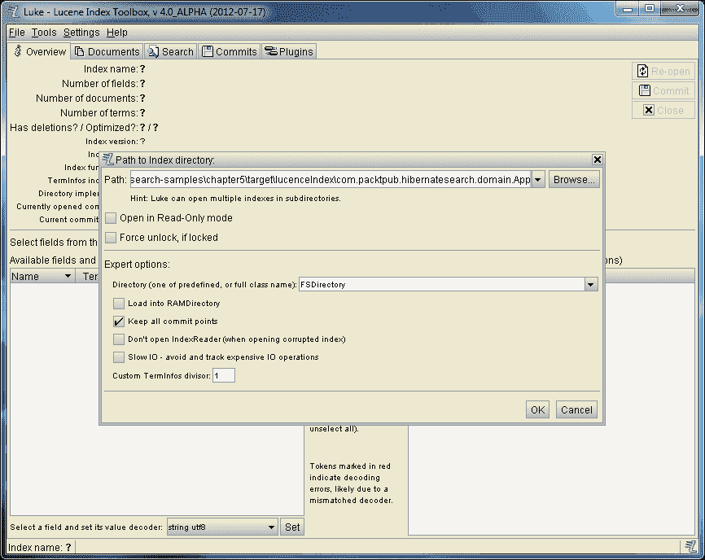
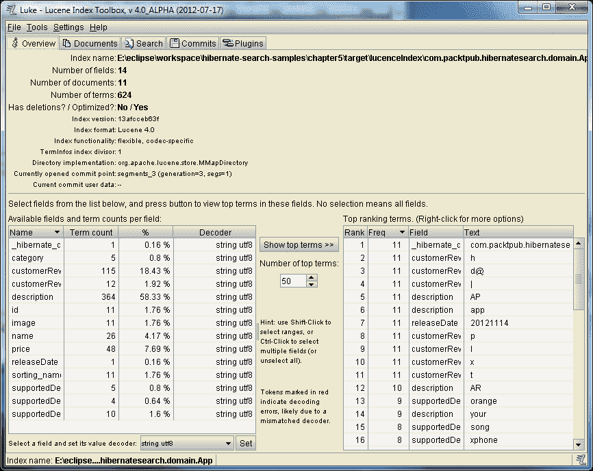
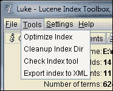
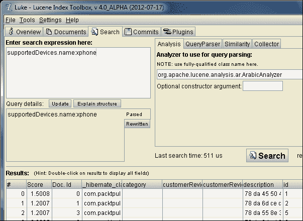
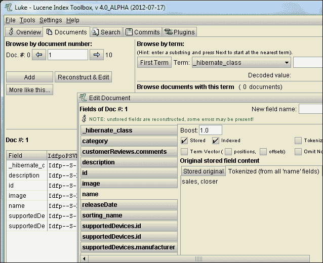

# 第六章 系统配置和索引管理

在本章中，我们将查看 Lucene 索引的配置选项，并学习如何执行基本维护任务。我们将了解如何切换 Lucene 索引的自动和手动更新。我们将研究低延迟写操作、同步与异步更新以及其他性能优化选择。

我们将介绍如何为更好的性能对 Lucene 索引进行碎片整理和清理，以及如何完全不用接触硬盘存储来使用 Lucene。最后但并非最不重要的是，我们将接触到**Luke**这个强大的工具，用于在应用程序代码之外操作 Lucene 索引。

# 自动与手动索引

到目前为止，我们实际上并没有太多考虑实体索引的时间。毕竟，Hibernate Search 与 Hibernate ORM 紧密集成。默认情况下，附加组件在核心更新数据库时更新 Lucene。

然而，你有选择将这些操作解耦的选项，如果你愿意，可以手动索引。一些你可能考虑手动方法的常见情况如下：

+   如果你能轻松地忍受在有限的时间内 Lucene 与数据库不同步，你可能想将索引操作推迟到非高峰时段，以在系统高峰使用期间减轻负载。

+   如果你想使用条件索引，但又不习惯`EntityIndexingInterceptor`的实验性质（参见第四章，*高级映射*），你可以使用手动索引作为一种替代方法。

+   如果你的数据库可能直接被不通过 Hibernate ORM 的过程更新，你必须定期手动更新 Lucene 索引，以保持它们与数据库同步。

要禁用自动索引，请在`hibernate.cfg.xml`（或使用 JPA 时的`persistence.xml`）中设置`hibernate.search.indexing_strategy`属性为`manual`，如下所示：

```java
...
<property name="hibernate.search.indexing_strategy">manual</property>
...
```

## 单独更新

当自动索引被禁用时，手动索引操作是由`FullTextSession`对象上的方法驱动的（无论是传统的 Hibernate 版本还是 JPA 版本）。

### 添加和更新

这些方法中最重要的是`index`，它同时处理数据库侧的**添加**和**更新**操作。此方法接受一个参数，是任何为 Hibernate Search 索引配置的实体类的实例。

本章的 VAPORware Marketplace 应用程序使用手动索引。`StartupDataLoader`在将 app 持久化到数据库后立即调用每个 app 的`index`：

```java
...
fullTextSession.save(theCloud);
fullTextSession.index(theCloud);
...
```

在 Lucene 侧，`index`方法在与数据库侧`save`方法相同的交易上下文中工作。只有在事务提交时才进行索引。在回滚事件中，Lucene 索引不受影响。

### 注意

手动使用`index`会覆盖任何条件索引规则。换句话说，`index`方法忽略与该实体类注册的任何`EntityIndexingInterceptor`。

对于批量更新（请参阅*批量更新*部分），情况并非如此，但在考虑对单个对象进行手动索引时，这是需要记住的。调用`index`的代码需要先检查任何条件。

### 删除

从 Lucene 索引中删除实体的基本方法是`purge`。这个方法与`index`有点不同，因为你不需要向它传递一个要删除的对象实例。相反，你需要传递实体类引用和一个特定实例的 ID（即对应于`@Id`或`@DocumentId`）：

```java
...
fullTextSession.purge(App.class, theCloud.getId());
fullTextSession.delete(theCloud);
...
```

Hibernate Search 还提供了`purgeAll`，这是一个方便的方法，用于删除特定实体类型的所有实例。这个方法也需要实体类引用，尽管显然不需要传递特定的 ID：

```java
...
fullTextSession.purgeAll(App.class);
...
```

与`index`一样，`purge`和`purgeAll`都在事务内操作。**删除**实际上直到事务提交才会发生。如果在回滚的情况下，什么也不会发生。

如果你想在事务提交之前真正地向 Lucene 索引中写入数据，那么无参数的`flushToIndexes`方法允许你这样做。如果你正在处理大量实体，并且想要在过程中释放内存（使用`clear`方法）以避免`OutOfMemoryException`，这可能很有用：

```java
...
fullTextSession.index(theCloud);
fullTextSession.flushToIndexes();
fullTextSession.clear();
...
```

## 批量更新

单独添加、更新和删除实体可能会相当繁琐，而且如果你错过了某些东西，可能会出现错误。另一个选择是使用`MassIndexer`，它可以被认为是自动索引和手动索引之间的某种折中方案。

这个工具类仍然需要手动实例化和使用。然而，当它被调用时，它会一次性重建所有映射实体类的 Lucene 索引。不需要区分添加、更新和删除，因为该操作会抹掉整个索引，并从头开始重新创建它。

`MassIndexer`是通过`FullTextSession`对象的`createIndexer`方法实例化的。一旦你有一个实例，启动批量索引有两种方式：

+   `start`方法以异步方式索引，这意味着索引在后台线程中进行，而主线程的代码流程继续。

+   `startAndWait`方法以同步模式运行索引，这意味着主线程的执行将一直阻塞，直到索引完成。

当以同步模式运行时，你需要用 try-catch 块包装操作，以防主线程在等待时被中断：

```java
...
try {
 fullTextSession.createIndexer().startAndWait();
} catch (InterruptedException e) {
   logger.error("Interrupted while wating on MassIndexer: "
      + e.getClass().getName() + ", " + e.getMessage());
}
...
```

### 提示

如果实际可行，当应用程序离线且不响应查询时，使用批量索引会更好。索引会将系统负载加重，而且 Lucene 与数据库相比会处于一个非常不一致的状态。

大规模索引与个别更新在两个方面有所不同：

+   `MassIndexer`操作不是事务性的。没有必要将操作包装在 Hibernate 事务中，同样，如果出现错误，你也不能依赖回滚。

+   `MassIndexer`确实支持条件索引（参考第四章，*高级映射*）。如果你为那个实体类注册了一个`EntityIndexingInterceptor`，它将被调用以确定是否实际索引特定实例。

    ### 注意

    `MassIndexer`对条件索引的支持是在 Hibernate Search 的 4.2 代中添加的。如果你正在使用一个较老版本的应用程序，你需要将应用程序迁移到 4.2 或更高版本，以便同时使用`EntityIndexingInterceptor`和`MassIndexer`。

# 索引碎片化

随着时间的推移，对 Lucene 索引的更改会逐渐使其变得效率更低，就像硬盘可能会变得碎片化一样。当新的实体被索引时，它们会被放入一个与主索引文件分离的文件（称为**片段**）。当一个实体被删除时，它实际上仍然留在索引文件中，只是被标记为不可访问。

这些技术有助于使 Lucene 的索引尽可能适用于查询，但随着时间的推移，这会导致性能变慢。打开多个片段文件是慢的，并且可能会遇到操作系统对打开文件数量的限制。保留在索引中的已删除实体会使文件比必要的更膨胀。

将所有这些片段合并在一起，并真正清除已删除实体的过程称为**优化**。这个过程类似于对硬盘进行碎片整理。Hibernate Search 提供了基于手动或自动的基础上的索引优化机制。

## 手动优化

`SearchFactory`类提供了两种手动优化 Lucene 索引的方法。你可以在应用程序中的任何你喜欢的事件上调用这些方法。或者，你可能会公开它们，并从应用程序外部触发优化（例如，通过一个由夜间 cron 作业调用的 web 服务）。

您可以通过`FullTextSession`对象的`getSearchFactory`方法获得一个`SearchFactory`引用。一旦你有了这个实例，它的`optimize`方法将会碎片化所有可用的 Lucene 索引：

```java
...
fullTextSession.getSearchFactory().optimize();
...
```

另外，您可以使用一个带有实体类参数的`optimize`重载版本。这个方法将优化限制在只对该实体的 Lucene 索引进行优化，如下所示：

```java
...
fullTextSession.getSearchFactory().optimize(App.class);
...
```

### 注意

另一个选择是使用`MassIndexer`重新构建你的 Lucene 索引（参考*大规模更新*部分）。从零开始重建索引无论如何都会使其处于优化状态，所以如果你已经定期执行这种类型的维护工作，进一步的优化将是多余的。

一个*非常*手动的方法是使用 Luke 工具，完全不在你的应用程序代码中。请参阅本章末尾关于 Luke 的部分。

## 自动优化

一个更简单，但灵活性较低的方法是让 Hibernate Search 自动为你触发优化。这可以全局或针对每个索引执行。触发事件可以是 Lucene 更改的阈值数量，或者事务的阈值数量。

VAPORware Marketplace 应用程序的`chapter6`版本现在在其`hibernate.cfg.xml`文件中包含了以下四行：

```java
<property name="hibernate.search.default.optimizer.operation_limit.max">
   1000
</property>
<property name="hibernate.search.default.optimizer.transaction_limit.max">
   1000
</property>
<property name="hibernate.search.App.optimizer.operation_limit.max">
   100
</property>
<property name="hibernate.search.App.optimizer.transaction_limit.max">
   100
</property>
```

最上面的两行，在属性名称中引用`default`，为所有 Lucene 索引建立了全局默认值。最后两行，引用`App`，是针对`App`实体的覆盖值。

### 注意

本章中的大多数配置属性可以通过将`default`子字符串替换为相关索引的名称，使其变为索引特定。

通常这是实体类的名称（例如，`App`），但如果你设置了该实体的`@Indexed`注解中的`index`元素，它也可以是一个自定义名称。

无论你是在全局还是索引特定级别操作，`operation_limit.max`指的是 Lucene 更改（即添加或删除）的阈值数量。`transaction_limit.max`指的是事务的阈值数量。

总的来说，此代码段配置了在 100 个事务或 Lucene 更改后对`App`索引进行优化。所有其他索引将在 1,000 个事务或更改后进行优化。

### 自定义优化器策略

你可以通过使用带有自定义优化策略的自动方法，享受到两全其美。本章的 VAPORware Marketplace 应用程序使用自定义策略，只在非高峰时段允许优化。这个自定义类扩展了默认优化器策略，但只允许在当前时间在午夜至凌晨 6 点之间时，基类进行优化：

```java
public class NightlyOptimizerStrategy
      extendsIncrementalOptimizerStrategy {

 @Override
 public void optimize(Workspace workspace) {
      Calendar calendar = Calendar.getInstance();
      inthourOfDay = calendar.get(Calendar.HOUR_OF_DAY);
      if(hourOfDay>= 0 &&hourOfDay<= 6) {
 super.optimize(workspace);
      }
   }

}
```

### 提示

最简单的方法是扩展`IncrementalOptimizerStrategy`，并用你的拦截逻辑覆盖`optimize`方法。然而，如果你的策略与默认策略根本不同，那么你可以从自己的基类开始。只需让它实现`OptimizerStrategy`接口。

为了声明你自己的自定义策略，无论是在全局还是每个索引级别，都需要在`hibernate.cfg.xml`中添加一个`hibernate.search.X.optimizer.implementation`属性（其中*X*是*default*，或者是特定实体索引的名称）：

```java
...
<property name="hibernate.search.default.optimizer.implementation">
com.packtpub.hibernatesearch.util.NightlyOptimizerStrategy
</property>
...
```

# 选择索引管理器

**索引管理器**是一个负责将更改应用到 Lucene 索引的组件。它协调优化策略、目录提供者以及工作者后端（在本章后面部分介绍），还有各种其他底层组件。

休眠搜索自带两种索引管理器实现。默认的是基于`directory-based`的，在大多数情况下这是一个非常合理的选择。

另一个内置选项是**近实时**。它是一个从基于目录的索引管理器派生的子类，但设计用于低延迟的索引写入。而不是立即在磁盘上执行添加或删除，这个实现将它们排队在内存中，以便更有效地批量写入。

### 注意

**近实时**实现比基于目录的默认实现具有更好的性能，但有两个权衡。首先，当在集群环境中使用 Lucene 时，**近实时**实现是不可用的（参考第七章，*高级性能策略*）。其次，由于 Lucene 操作不会立即写入磁盘，因此在应用程序崩溃的情况下可能会永久丢失。

与本章中介绍的大多数配置属性一样，索引管理器可以在全局默认或每索引的基础上选择。区别在于是否包括`default`，或者实体索引名称（例如，`App`）在属性中：

```java
...
<property name="hibernate.search.default.indexmanager">
   directory-based
</property>
<property name="hibernate.search.App.indexmanager">
   near-real-time
</property>
...
```

可以编写自己的索引管理器实现。为了更深入地了解索引管理器是如何工作的，请查看提供的两个内置实现源代码。基于目录的管理器由`DirectoryBasedIndexManager`实现，近实时管理器由`NRTIndexManager`实现。

### 提示

编写自定义实现的一种简单方法是继承两个内置选项中的一个，并根据需要重写方法。如果您想从头开始创建自定义索引管理器，那么它需要实现`org.hibernate.search.indexes.spi.IndexManager`接口。

在全局或每索引级别应用自定义索引管理器与内置选项相同。只需将适当的属性设置为您的实现的全限定类名（例如，`com.packtpub.hibernatesearch.util.MyIndexManager`），而不是`directory-based`或`near-real-time`字符串。

# 配置工作者

索引管理器协调的组件类型之一是**工作者**，它们负责对 Lucene 索引进行实际的更新。

如果您在集群环境中使用 Lucene 和 Hibernate Search，许多配置选项是在工作者级别设置的。我们将在第七章，*高级性能策略*中更全面地探讨这些内容。然而，在任何环境中都提供了三个关键的配置选项。

## 执行模式

默认情况下，工作者执行 Lucene 更新**同步**。也就是说，一旦开始更新，主线的执行就会被阻塞，直到更新完成。

工人可能被配置为以**异步**方式更新，这是一种“启动并忘记”的模式，它会创建一个单独的线程来执行工作。优点是主线程将更具响应性，且能更高效地处理工作负载。缺点是在非常短暂的时间内数据库和索引可能会不同步。

执行模式在`hibernate.cfg.xml`（或`persistence.xml`对于 JPA）中声明。可以用`default`子字符串建立全局默认值，而每个实体的配置可以用实体索引名称（例如，`App`）来设置：

```java
...
<property name="hibernate.search.default.worker.execution">
   sync
</property>
<property name="hibernate.search.App.worker.execution">
   async
</property>
...
```

## 线程池

默认情况下，工人在只有一个线程中更新，要么是同步模式下的主线程，要么是异步模式下单独创建的一个线程。然而，你有创建一个更大线程池来处理工作的选项。这个池可能适用于全局默认级别，也可能特定于某个索引：

```java
...
<property name="hibernate.search.default.worker.thread_pool.size">
   2
</property>
<property name="hibernate.search.App.worker.thread_pool.size">
   5
</property>
...
```

### 提示

由于 Lucene 索引在更新操作期间以这种方式被锁定，使用许多并行线程通常不会提供你可能会期望的性能提升。然而，在调整和负载测试应用程序时尝试是有价值的。

## 缓冲队列

挂起的工作会保存在队列中，等待线程空闲时处理。默认情况下，这个缓冲区的大小是无限的，至少在理论上如此。实际上，它受到可用系统内存量的限制，如果缓冲区增长过大，可能会抛出`OutOfMemoryExeception`。

因此，为这些缓冲区设置一个全局大小或每个索引大小的限制是一个好主意。

```java
...
<property name="hibernate.search.default.worker.buffer_queue.max">
   50
</property>
<property name="hibernate.search.App.worker.buffer_queue.max">
   250
</property>
...
```

当一个缓冲区达到其索引允许的最大大小时，将由创建它们的线程执行额外操作。这会阻塞执行并减慢性能，但确保应用程序不会运行 out of memory。实验找到一个应用程序的平衡阈值。

# 选择和配置目录提供程序

内置的索引管理器都使用了一个子类`DirectoryBasedIndexManager`。正如其名，它们都利用了 Lucene 的抽象类`Directory`，来管理索引存储的形式。

在第七章中，我们将探讨一些特殊目录实现，这些实现是为集群环境量身定做的。然而，在单服务器环境中，内置的两种选择是文件系统存储和内存中的存储。

## Filesystem-based

默认情况下，Lucene 索引存储在 Java 应用程序的当前工作目录中。对于这种安排，无需进行任何配置，但在 VAPORware Marketplace 应用程序的所有版本中，都明确设置了这个属性在`hibernate.cfg.xml`（或`persistence.xml`）中：

```java
...
<property name="hibernate.search.default.directory_provider">
   filesystem
</property>
...
```

正如我们在本章中看到的其他配置属性一样，你可以用特定的索引名称（例如，`App`）替换`default`。

当使用基于文件系统的索引时，您可能希望使用一个已知的固定位置，而不是当前工作目录。您可以使用 `indexBase` 属性指定相对路径或绝对路径。在我们见过的所有 VAPORware Marketplace 版本中，Lucene 索引都存储在每个 Maven 项目的 `target` 目录下，这样 Maven 在每次全新构建之前会删除它们：

```java
...
<property name="hibernate.search.default.indexBase">
   target/lucenceIndex
</property>
...
```

### 锁策略

所有 Lucene 目录实现当向其写入时都会锁定它们的索引，以防止多个进程或线程同时向其写入导致的损坏。有四种锁策略可供选择，您可以通过将 `hibernate.search.default.locking_strategy` 属性设置为这些字符串之一来指定一个：

+   `native`: 当没有指定锁策略属性时，基于文件系统的目录默认采用的策略。它依赖于本地操作系统级别的文件锁，因此如果您的应用程序崩溃，索引锁仍然会被释放。然而，这种策略不适用于您的索引存储在远程网络共享驱动器上时。

+   `simple`: 这种策略依赖于 JVM 来处理文件锁。当您的 Lucene 索引存储在远程共享驱动器上时，使用这种策略更安全，但如果应用程序崩溃或被杀死，锁不会被干净地释放。

+   `single`: 这种策略不会在文件系统上创建锁文件，而是使用内存中的 Java 对象（类似于多线程 Java 代码中的 `synchronized` 块）。对于单 JVM 应用程序，无论索引文件在哪里，这种方法都工作得很好，而且在崩溃后没有锁被释放的问题。然而，这种策略只有在您确信没有任何其他外部 JVM 进程可能会写入您的索引文件时才是可行的。

+   `none`: 根本不使用锁。这不是一个推荐的选项。

### 提示

为了删除未干净释放的锁，请使用本章*使用 Luke 工具*部分探索的 Luke 工具。

## 基于 RAM

出于测试和演示目的，我们这本书中的 VAPORware Marketplace 应用程序一直使用内存中的 H2 数据库。每次应用程序启动时都会重新创建它，应用程序停止时会摧毁它，在此过程中没有任何持久化存储。

Lucene 索引能够以完全相同的方式工作。在本章示例应用程序的版本中，`hibernate.cfg.xml` 文件已经被修改以将其索引存储在 RAM 中，而不是文件系统上：

```java
...
<property name="hibernate.search.default.directory_provider">
   ram
</property>
...
```

### 注意

基于 RAM 的目录提供者在其 Hibernate `SessionFactory`（或 JPA `EntityManagerFactory`）创建时初始化其 Lucene 索引。请注意，当你关闭这个工厂时，它会摧毁你所有的索引！

使用现代依赖注入框架时，这不应该是一个问题，因为框架会在内存中保持您的工厂实例，并在需要时可用。即使在我们的基础示例应用程序中，我们也为此原因在 `StartupDataLoader` 类中存储了一个单例 `SessionFactory`。

内存中的索引似乎能提供更好的性能，在您的应用程序调整中尝试一下可能是值得的。然而，通常不建议在生产环境中使用基于 RAM 的目录提供程序。

首先，当数据集很大时，很容易耗尽内存并导致应用程序崩溃。另外，每次重新启动时，您的应用程序都必须从头开始重建索引。由于只有创建内存索引的 JVM 才能访问该内存，因此无法使用集群。最后但同样重要的是，基于文件系统的目录提供程序已经智能地使用了缓存，其性能出奇地与基于 RAM 的提供程序相当。

话虽如此，基于 RAM 的提供程序是测试应用程序的常见方法。单元测试可能涉及相对较小的数据集，因此耗尽内存不是问题。另外，在每次单元测试之间完全且干净地销毁索引可能更是一个特性而非缺点。

### 提示

基于 RAM 的目录提供程序默认使用 `single` 锁定策略，而且真的没有改变它的意义。

# 使用 Luke 工具

Hibernate ORM 为您的应用程序代码提供了与数据库交互所需的大部分功能。然而，您可能仍然需要使用某种 SQL 客户端，在应用程序代码的上下文之外手动操作数据库。

同样，在没有编写相关代码的情况下手动探索 Lucene 索引可能很有用。Luke（[`code.google.com/p/luke`](http://code.google.com/p/luke)）是一个非常有用的工具，它为 Lucene 提供了这一功能。您可以使用 Luke 浏览索引、测试查询，并执行诸如删除未正常释放的索引锁等有用任务。

Luke 的下载文件是一个单片式的可执行 JAR 文件。双击 JAR 文件，或者从控制台提示符执行它，会弹出一个图形界面和一个提示您索引位置的输入框，如下面的屏幕快照所示：



前一个屏幕快照显示了 Luke 启动时的界面。不幸的是，Luke 只能访问基于文件系统的索引，而不能访问本章中使用基于 RAM 的索引。所以在这段示例中，Luke 指向了 `chapter5` 代码文件目录的 Maven 项目工作区。`App` 实体的索引位于 `target/luceneIndex/com.packtpub.hibernatesearch.domain.App`。

请注意打开索引对话框顶部附近的**强制解锁，如果** **锁定**复选框。如果您有一个索引文件锁没有干净释放（参考*锁定策略*部分），则可以通过勾选此复选框并打开索引来解决问题。

一旦您打开了一个 Lucene 索引，Luke 就会显示关于索引文档（即实体）数量的各类信息（即，碎片化）和其他详细信息，如下面的屏幕截图所示：



从工具栏顶部的**工具**菜单中，您可以选择执行诸如检查索引是否损坏或手动优化（即，去碎片化）等基本维护任务。这些操作最好在非高峰时段或全面停机窗口期间执行。



**文档**标签允许您逐一浏览实体，这可能有一些有限的用途。更有趣的是**搜索**标签，它允许您使用自由形式的 Lucene 查询来探索您的索引，如下面的屏幕截图所示：



完整的 Lucene API 超出了本书的范围，但这里有一些基础知识来帮助您入门：

+   搜索表达式的形式是字段名和期望值，由冒号分隔。例如，要搜索`business`类别的应用程序，请使用搜索表达式`category:business`。

+   相关项目可以用实体字段名，后跟一个点，后跟相关项目内的字段名来指定。在上面的屏幕截图中，我们通过使用搜索表达式`supportedDevices.name:xphone`来搜索所有支持`xPhone`设备的应用程序。

+   记住，默认分析器在索引过程中将术语转换为小写。所以如果你想搜索`xPhone`，例如，请确保将其输入为`xphone`。

如果您双击找到的搜索结果之一，Luke 会切换到**文档**标签，并加载相关文档。点击**重建&编辑**按钮来检查该实体的字段，如下面的屏幕截图所示：



浏览这些数据将让您了解分析器如何解析您的实体。单词将被过滤掉，除非您配置了`@Field`注解相反（正如我们用`sorting_name`所做的那样），否则文本将被分词。如果 Hibernate Search 查询没有返回您期望的结果，Luke 中浏览字段数据可以帮助您发现问题。

# 摘要

在本章中，我们了解了如何手动更新 Lucene 索引，一次一个实体对象或批量更新，作为让 Hibernate Search 自动管理更新的一种替代方式。我们了解了 Lucene 更新操作积累的碎片，以及如何基于手动或自动方法进行优化。

我们探索了 Lucene 的各种性能调优选项，从低延迟写入到多线程异步更新。我们现在知道如何配置 Hibernate Search，在文件系统或 RAM 上创建 Lucene 索引，以及为什么您可能会选择其中之一。最后，我们使用 Luke 工具来检查和执行维护任务，而无需通过应用程序的 Hibernate Search 代码来操作 Lucene 索引。

在下一章中，我们将探讨一些高级策略，以提高您的应用程序的性能。这将包括回顾到目前为止介绍的性能提示，然后深入探讨服务器集群和 Lucene 索引分片。
