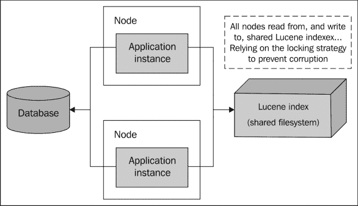
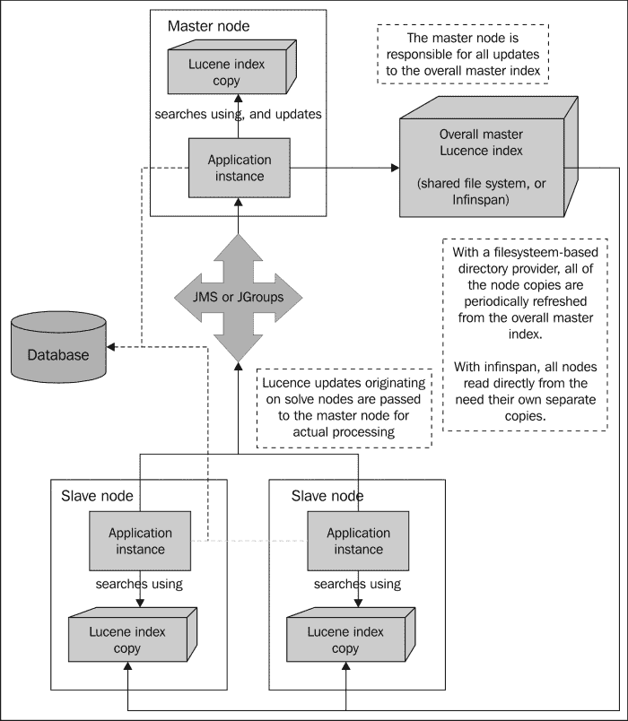
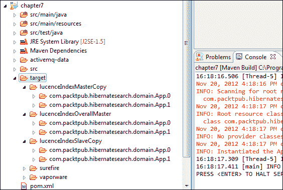

# 第七章 高级性能策略

在本章中，我们将探讨一些高级策略，通过代码以及服务器架构来提高生产应用程序的性能和可伸缩性。我们将探讨运行应用程序的多节点服务器集群选项，以分布式方式分散和处理用户请求。我们还将学习如何使用分片来使我们的 Lucene 索引更快且更易于管理。

# 通用建议

在深入探讨一些提高性能和可伸缩性的高级策略之前，让我们简要回顾一下书中已经提到的某些通用性能优化建议。

+   当为 Hibernate Search 映射实体类时，使用`@Field`注解的可选元素去除 Lucene 索引中的不必要膨胀（参见第二章，*映射实体类*）：

    +   如果你确实不使用索引时提升（参见第四章，*高级映射*），那么就没有理由存储实现此功能所需的信息。将`norms`元素设置为`Norms.NO`。

    +   默认情况下，除非将`store`元素设置为`Store.YES`或`Store.COMPRESS`（参见第五章，*高级查询*），否则基于投影的查询所需的信息不会被存储。如果你有不再使用的基于投影的查询，那么在进行清理时删除这个元素。

+   使用条件索引（参见第四章，*高级映射*）和部分索引（参见第二章，*映射实体类*）来减小 Lucene 索引的大小。

+   依赖于过滤器在 Lucene 层面缩小结果，而不是在数据库查询层面使用`WHERE`子句（参见第五章，*高级查询*）。

+   尽可能尝试使用基于投影的查询（参见第五章，*高级查询*），以减少或消除对数据库调用的需求。请注意，随着数据库缓存的提高，这些好处可能并不总是值得增加的复杂性。

+   测试各种索引管理器选项（参见第六章，*系统配置和索引管理*），例如尝试近实时索引管理器或`async`工作执行模式。

# 在集群中运行应用程序

在生产环境中使现代 Java 应用程序扩展通常涉及在服务器实例的集群中运行它们。Hibernate Search 非常适合集群环境，并提供了多种配置解决方案的方法。

## 简单集群

最直接的方法需要非常少的 Hibernate Search 配置。只需为托管您的 Lucene 索引设置一个文件服务器，并使其可供您集群中的每个服务器实例使用（例如，NFS、Samba 等）：



具有多个服务器节点的简单集群，使用共享驱动上的公共 Lucene 索引

集群中的每个应用程序实例都使用默认的索引管理器，以及常用的`filesystem`目录提供程序（参见第六章，*系统配置和索引管理*）。

在这种安排中，所有的服务器节点都是真正的对等节点。它们各自从同一个 Lucene 索引中读取，无论哪个节点执行更新，那个节点就负责写入。为了防止损坏，Hibernate Search 依赖于锁定策略（即“简单”或“本地”，参见第六章，*系统配置和索引管理*)同时写入被阻止。

### 提示

回想一下，“近实时”索引管理器与集群环境是不兼容的。

这种方法的优点是两方面的。首先是简单性。涉及的步骤仅包括设置一个文件系统共享，并将每个应用程序实例的目录提供程序指向同一位置。其次，这种方法确保 Lucene 更新对集群中的所有节点立即可见。

然而，这种方法的严重缺点是它只能扩展到一定程度。非常小的集群可能运行得很好，但是尝试同时访问同一共享文件的更多节点最终会导致锁定争用。

另外，托管 Lucene 索引的文件服务器是一个单点故障。如果文件共享挂了，那么在整个集群中的搜索功能会立即灾难性地崩溃。

## 主从集群

当您的可扩展性需求超出简单集群的限制时，Hibernate Search 提供了更高级别的模型供您考虑。它们之间的共同点是主节点负责所有 Lucene 写操作的理念。

集群还可能包括任何数量的从节点。从节点仍然可以初始化 Lucene 更新，应用程序代码实际上无法区分。然而，在底层，从节点将这项工作委托给主节点实际执行。

### 目录提供程序

在主从集群中，仍然有一个“总体主”Lucene 索引，它在逻辑上与所有节点区分开来。这个索引可能是基于文件系统的，正如它在一个简单集群中一样。然而，它可能是基于 JBoss Infinispan（[`www.jboss.org/infinispan`](http://www.jboss.org/infinispan)），一个由同一公司主要赞助 Hibernate 开发的开源内存中 NoSQL 数据存储：

+   在**基于文件系统的**方法中，所有节点都保留它们自己的 Lucene 索引的本地副本。主节点实际上在整体主索引上执行更新，所有节点定期从那个整体主索引中读取以刷新它们的本地副本。

+   在**Infinispan 基于**的方法中，所有节点都从 Infinispan 索引中读取（尽管仍然建议将写操作委派给主节点）。因此，节点不需要维护它们自己的本地索引副本。实际上，由于 Infinispan 是一个分布式数据存储，索引的某些部分将驻留在每个节点上。然而，最好还是将整个索引视为一个单独的实体。

### 工作端后端

奴隶节点将写操作委派给主节点的两种可用机制：

+   **JMS**消息队列提供程序创建一个队列，奴隶节点将有关 Lucene 更新请求的详细信息发送到这个队列。主节点监控这个队列，检索消息，并实际执行更新操作。

+   您可以选择用**JGroups**（[`www.jgroups.org`](http://www.jgroups.org)）替换 JMS，这是一个用于 Java 应用程序的开源多播通信系统。它的优点是速度更快，更立即。消息实时接收，同步而不是异步。

    然而，JMS 消息通常在等待检索时持久化到磁盘上，因此可以在应用程序崩溃的情况下恢复并稍后处理。如果您使用 JGroups 并且主节点离线，那么在停机期间奴隶节点发送的所有更新请求都将丢失。为了完全恢复，您可能需要手动重新索引您的 Lucene 索引。

    

    一个基于文件系统或 Infinispan 的目录提供程序和基于 JMS 或 JGroups 的工作程序的主从集群。请注意，当使用 Infinispan 时，节点不需要它们自己的单独索引副本。

### 一个工作示例

要尝试所有可能的集群策略，需要查阅 Hibernate Search 参考指南，以及 Infinispan 和 JGroups 的文档。然而，我们将从实现使用文件系统和 JMS 方法的集群开始，因为其他所有内容都只是这个标准主题的变体。

本章版本的 VAPORware Marketplace 应用摒弃了我们一直使用的 Maven Jetty 插件。这个插件非常适合测试和演示目的，但它只适用于运行单个服务器实例，而我们现在需要同时运行至少两个 Jetty 实例。

为了实现这一点，我们将以编程方式配置和启动 Jetty 实例。如果你在`chapter7`项目的`src/test/java/`目录下查看，现在有一个`ClusterTest`类。它为 JUnit 4 设计，以便 Maven 可以在构建后自动调用其`testCluster()`方法。让我们看看那个测试用例方法的相关部分：

```java
...
String projectBaseDirectory = System.getProperty("user.dir");
...
Server masterServer = new Server(8080);
WebAppContextmasterContext = new WebAppContext();
masterContext.setDescriptor(projectBaseDirectory +
   "/target/vaporware/WEB-INF/web.xml");
...
masterServer.setHandler(masterContext);
masterServer.start();
...
Server slaveServer = new Server(8181);
WebAppContextslaveContext = new WebAppContext();
slaveContext.setDescriptor(projectBaseDirectory +
   "/target/vaporware/WEB-INF/web-slave.xml");
...
slaveServer.setHandler(slaveContext);
slaveServer.start();
...
```

尽管所有这些都在一台物理机器上运行，但我们为了测试和演示目的模拟了一个集群。一个 Jetty 服务器实例在端口 8080 上作为主节点启动，另一个 Jetty 服务器在端口 8181 上作为从节点启动。这两个节点之间的区别在于，它们使用不同的`web.xml`文件，在启动时相应地加载不同的监听器。

在这个应用程序的先前版本中，一个`StartupDataLoader`类处理了所有数据库和 Lucene 的初始化。现在，两个节点分别使用`MasterNodeInitializer`和`SlaveNodeInitializer`。这些依次从名为`hibernate.cfg.xml`和`hibernate-slave.cfg.xml`的不同文件加载 Hibernate ORM 和 Hibernate Search 设置。

### 提示

有许多方法可以配置一个应用程序以作为主节点或从节点实例运行。而不是构建不同的 WAR，具有不同的`web.xml`或`hibernate.cfg.xml`版本，你可能会使用依赖注入框架根据环境中的某个内容加载正确的设置。

Hibernate 的两种版本都设置了`config`文件中的以下 Hibernate Search 属性：

+   `hibernate.search.default.directory_provider`：在之前的章节中，我们看到这个属性被设置为`filesystem`或`ram`。之前讨论过的另一个选项是`infinispan`。

    在这里，我们在主节点和从节点上分别使用`filesystem-master`和`filesystem-slave`。这两个目录提供者都与常规的`filesystem`类似，并且与迄今为止我们看到的所有相关属性（如位置、锁定策略等）一起工作。

    然而，“主”变体包含了定期刷新整体主 Lucene 索引的功能。而“从”变体则相反，定期用整体主内容刷新其本地副本。

+   `hibernate.search.default.indexBase`：正如我们之前在单节点版本中看到的，这个属性包含了*本地* Lucene 索引的基础目录。由于我们这里的示例集群在同一台物理机器上运行，主节点和从节点对这个属性使用不同的值。

+   `hibernate.search.default.sourceBase`：这个属性包含了*整体主* Lucene 索引的基础目录。在生产环境中，这将是某种共享文件系统，挂在并可供所有节点访问。在这里，节点在同一台物理机器上运行，所以主节点和从节点对这个属性使用相同的值。

+   `hibernate.search.default.refresh`：这是索引刷新之间的间隔（以秒为单位）。主节点在每个间隔后刷新整体主索引，奴隶节点使用整体主索引刷新它们自己的本地副本。本章的 VAPORware Marketplace 应用程序使用 10 秒的设置作为演示目的，但在生产环境中这太短了。默认设置是 3600 秒（一小时）。

为了建立一个 JMS 工作后端，奴隶节点*仅*需要三个额外的设置：

+   `hibernate.search.default.worker.backend`：将此值设置为`jms`。默认值`lucene`在之前的章节中已经应用，因为没有指定设置。如果你使用 JGroups，那么它将被设置为`jgroupsMaster`或`jgroupsSlave`，这取决于节点类型。

+   `hibernate.search.default.worker.jms.connection_factory`：这是 Hibernate Search 在 JNDI 中查找你的 JMS 连接工厂的名称。这与 Hibernate ORM 使用`connection.datasource`属性从数据库检索 JDBC 连接的方式类似。

    在这两种情况下，JNDI 配置都是特定于你的应用程序运行的应用服务器。要了解 JMS 连接工厂是如何设置的，请查看`src/main/webapp/WEB-INF/jetty-env.xml`这个 Jetty 配置文件。在这个示例中我们使用 Apache ActiveMQ，但任何兼容 JMS 的提供商都会同样适用。

+   `hibernate.search.default.worker.jms.queue`：从奴隶节点向 Lucene 发送写请求的 JMS 队列的 JNDI 名称。这也是在应用服务器级别配置的，紧挨着连接工厂。

使用这些工作后端设置，奴隶节点将自动向 JMS 队列发送一条消息，表明需要 Lucene 更新。为了看到这种情况的发生，新的`MasterNodeInitializer`和`SlaveNodeInitializer`类各自加载了一半的通常测试数据集。如果我们所有的测试实体最终都被一起索引，并且可以从任一节点运行的搜索查询中检索到它们，那么我们就会知道我们的集群运行正常。

尽管 Hibernate Search 会自动从奴隶节点向 JMS 队列发送消息，但让主节点检索这些消息并处理它们是你的责任。

在 JEE 环境中，你可能会使用消息驱动 bean，正如 Hibernate Search 文档所建议的那样。Spring 也有一个可以利用的任务执行框架。然而，在任何框架中，基本思想是主节点应该产生一个后台线程来监控 JMS 队列并处理其消息。

本章的 VAPORware Marketplace 应用程序包含一个用于此目的的`QueueMonitor`类，该类被包装在一个`Thread`对象中，由`MasterNodeInitializer`类产生。

要执行实际的 Lucene 更新，最简单的方法是创建您自己的自定义子类`AbstractJMSHibernateSearchController`。我们的实现称为`QueueController`，所做的只是包装这个抽象基类。

当队列监视器从 JMS 队列中接收到`javax.jms.Message`对象时，它只是原样传递给控制器的基类方法`onMessage`。那个内置方法为我们处理 Lucene 更新。

### 注意

正如您所看到的，主从集群方法涉及的内容比简单集群要多得多。然而，主从方法在可扩展性方面提供了巨大的优势。

它还减少了单点故障的风险。确实，这种架构涉及一个单一的“主”节点，所有 Lucene 写操作都必须通过这个节点。然而，如果主节点宕机，从节点仍然可以继续工作，因为它们的搜索查询针对的是自己的本地索引副本。此外，更新请求应该由 JMS 提供商持久化，以便在主节点重新上线后，这些更新仍然可以执行。

由于我们程序化地启动 Jetty 实例，而不是通过 Maven 插件，因此我们将不同的目标传递给每个 Maven 构建。对于`chapter7`项目，您应该像以下这样运行 Maven：

```java
mvn clean compile war:exploded test
```

您将能够通过`http://localhost:8080`访问“主”节点，通过`http://localhost:8181`访问“从”节点。如果您在主节点启动后立即发送一个搜索查询，那么您将看到它只返回预期结果的一半！然而，在几秒钟内，从节点通过 JMS 更新。数据集的两个部分将合并并在整个集群中可用。

# 分片 Lucene 索引

正如您可以在集群中的多个节点之间平衡应用程序负载一样，您还可以通过一个称为**分片（sharding）**的过程将 Lucene 索引拆分。如果您的索引变得非常大，出于性能原因，您可能会考虑进行分片，因为较大的索引文件比小型分片索引和优化需要更长的时间。

如果您的实体适合于分区（例如，按语言、地理区域等），分片可能会提供额外的优势。如果您能够可预测地将查询引导到特定的适当分片，性能可能会得到改善。此外，当您能够在物理位置不同的地方存储“敏感”数据时，有时会让律师感到高兴。

尽管它的数据集非常小，但本章的 VAPORware Marketplace 应用程序现在将其`App`索引分成两个分片。`hibernate.cfg.xml`中的相关行类似于以下内容：

```java
...
<property
   name="hibernate.search.default.sharding_strategy.nbr_of_shards">
      2
</property>
...
```

与所有包含子字符串`default`的其他 Hibernate Search 属性一样，这是一个全局设置。可以通过用索引名称（例如`App`）替换`default`来使其特定于索引。

### 注意

这个确切的行出现在`hibernate.cfg.xml`（由我们的“主”节点使用）和`hibernate-slave.cfg.xml`（由我们的“从”节点使用）中。在集群环境中运行时，你的分片配置应与所有节点匹配。

当一个索引被分成多个分片时，每个分片都包括正常的索引名称后面跟着一个数字（从零开始）。例如，是`com.packtpub.hibernatesearch.domain.App.0`，而不仅仅是`com.packtpub.hibernatesearch.domain.App`。这张截图展示了我们双节点集群的 Lucene 目录结构，在两个节点都配置为两个分片的情况下运行中：



集群中运行的分片 Lucene 索引的一个示例（注意每个`App`实体目录的编号）

正如分片在文件系统上编号一样，它们可以在`hibernate.cfg.xml`中按编号单独配置。例如，如果你想将分片存储在不同的位置，你可能如下设置属性：

```java
...
<property name="hibernate.search.App.0.indexBase">
   target/lucenceIndexMasterCopy/EnglishApps
</property>
<property name="hibernate.search.App.1.indexBase">
   target/lucenceIndexMasterCopy/FrenchApps
</property>
...
```

当对实体执行 Lucene 写操作时，或者当搜索查询需要从实体的索引中读取时，**分片策略**确定使用哪个分片。

如果你只是分片以减少文件大小，那么默认策略（由`org.hibernate.search.store.impl.IdHashShardingStrategy`实现）完全没问题。它使用每个实体的 ID 来计算一个唯一的哈希码，并将实体在分片之间大致均匀地分布。因为哈希计算是可复制的，策略能够将实体的未来更新引导到适当的分片。

要创建具有更复杂逻辑的自定义分片策略，你可以创建一个新子类，继承自`IdHashShardingStrategy`，并按需调整。或者，你可以完全从零开始，创建一个实现`org.hibernate.search.store.IndexShardingStrategy`接口的新类，或许可以参考`IdHashShardingStrategy`的源代码作为指导。

# 总结

在本章中，我们学习了如何在现代分布式服务器架构中与应用程序一起工作，以实现可扩展性和更好的性能。我们看到了一个使用基于文件系统的目录提供程序和基于 JMS 的后端实现的集群，现在有了足够的知识去探索涉及 Inifinispan 和 JGroups 的其他方法。我们使用了分片将 Lucene 索引分成更小的块，并知道如何实施自己的自定义分片策略。

这带我们结束了与 Hibernate Search 的这次小冒险！我们已经涵盖了关于 Hibernate、Lucene 和 Solr 以及搜索的一般性关键概念。我们学会了如何将我们的数据映射到搜索索引中，在运行时查询和更新这些索引，并将其安排在给定项目的最佳架构中。这一切都是通过一个示例应用程序完成的，这个应用程序随着我们的知识从简单到复杂一路成长。

学无止境。Hibernate Search 可以与 Solr 的数十个组件协同工作，以实现更高级的功能，同时也能与新一代的“NoSQL”数据存储集成。然而，现在你已经拥有了足够的核心知识，可以独立探索这些领域，如果你愿意的话。下次再见，感谢您的阅读！您可以在 `steveperkins.net` 上找到我，我很乐意收到您的来信。
