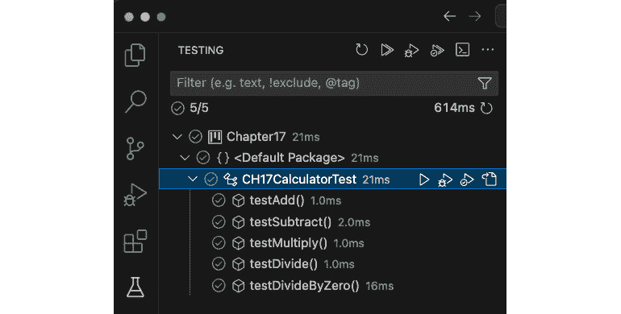

# 第十七章：单元测试和性能测试

代码彻底测试的重要性不容忽视；此外，这种测试应该是高效的。随着我们的系统在复杂性和规模上的增长，确保我们软件的每个组件都能准确且高效地运行变得越来越关键。这就是单元和性能测试发挥作用的地方。这也是本章的重点。

本章首先介绍了**单元测试**，这是我们用来验证代码各个单元的方法。目标是确保单元能够高效且按预期运行。通过单元测试，我们可以在代码部署到生产环境之前及早发现异常（错误）。性能测试作为一个补充过程被引入，在这个过程中，我们测试软件在各种条件下的行为，如响应性、可用性、可伸缩性、可靠性和可伸缩性。正如本章所展示的，性能测试可以帮助我们识别潜在的瓶颈，并确保我们的系统可以处理预期的用例和负载。

本章采用了理论和实践相结合的方法，给你提供了在单元和性能测试中获得知识和经验的机会。我们将涵盖包括集成两种类型测试、自动化、测试环境、持续测试和反馈循环在内的总体策略。

到本章结束时，你将全面理解单元和性能测试，并能够利用它们来提高 Java 应用程序的可靠性和效率。

本章涵盖了以下主要主题：

+   单元测试

+   性能测试

+   总体策略

# 技术要求

要遵循本章中的示例和说明，你需要能够加载、编辑和运行 Java 代码。如果你还没有设置你的开发环境，请参考*第一章*，*Java 虚拟机（JVM）内部窥视*。

本章的完成代码可以在以下链接找到：

[`github.com/PacktPublishing/High-Performance-with-Java/tree/main/Chapter17`](https://github.com/PacktPublishing/High-Performance-with-Java/tree/main/Chapter17)

# 单元测试

软件开发者的格言“测试，测试，再测试”仍然适用于现代系统，但方式更为精细。我们不再测试整个系统，而是关注代码的小组件，以确保它们能够高效且按预期运行。这些组件被称为**单元**。当我们隔离代码单元时，我们可以更容易地检测到错误并提高代码的整体质量。这种方法被称为单元测试，也是本节的重点。

单元测试

单元测试是一种软件测试方法，它涉及测试系统代码的最小部分，以确保它在独立的情况下能够正确且高效地运行。

单元测试的主要好处包括以下内容：

+   **错误检测**：单元测试使我们能够在代码作为更大系统的一部分发布之前早期检测错误。

+   **代码质量**：这种具有有限关注点的测试方法导致代码质量更高。

+   **文档**：单元测试的过程包括记录每个单元的功能、目的、连接性和依赖关系。

现在我们已经了解了单元测试是什么以及为什么它很重要，让我们看看两个流行的单元测试框架。

## 框架

最常见的单元测试框架之一是**JUnit**，可能是因为它的简单性和与**集成开发环境**（**IDEs**）集成的容易性。另一个流行的框架是**TestNG**，它比 JUnit 更灵活，并具有 JUnit 之外的功能。

我们将专注于 JUnit，并在下一节中演示如何编写单元测试。

## 编写单元测试

你可以以多种方式编写和实现单元测试。这里有一个简单的方法：

1.  确保你已经安装了最新的**Java 开发工具包**（**JDK**）。

1.  下载并安装**JUnit Jupiter API 和 Engine JARs**。完成此过程的方法将取决于你的 IDE。

1.  假设你正在使用 Visual Studio Code，请安装**Java 测试运行器**扩展。

为了演示单元测试，我们将编写一个简单的计算器程序，如下所示：

```java
public class CH17Calculator {
  public int add(int a, int b) {
    return a + b;
  }
  public int subtract(int a, int b) {
    return a - b;
  }
  public int multiply(int a, int b) {
    return a * b;
  }
  public int divide(int a, int b) {
    if (b == 0) {
      throw new IllegalArgumentException("Division by zero");
    }
    return a / b;
  }
}
```

如你所见，我们的应用程序包含基于传递参数添加、减去、乘以和除以两个数字的方法。接下来，让我们创建一个`testing`类：

```java
import org.junit.jupiter.api.Assertions;
import org.junit.jupiter.api.BeforeEach;
import org.junit.jupiter.api.Test;
public class CH17CalculatorTest {
  private CH17Calculator calculator;
  @BeforeEach
  public void setUp() {
    calculator = new CH17Calculator();
  }
  @Test
  public void testAdd() {
    int result = calculator.add(3, 4);
    Assertions.assertEquals(7, result);
  }
  @Test
  public void testSubtract() {
    int result = calculator.subtract(10, 5);
    Assertions.assertEquals(5, result);
  }
  @Test
  public void testMultiply() {
    int result = calculator.multiply(2, 3);
    Assertions.assertEquals(6, result);
  }
  @Test
  public void testDivide() {
    int result = calculator.divide(8, 2);
    Assertions.assertEquals(4, result);
  }
  @Test
  public void testDivideByZero() {
    Assertions.assertThrows(IllegalArgumentException.class, () -> {
      calculator.divide(1, 0);
    });
  }
}
```

如前述代码所示，我们已为初级类文件中的方法创建了单独的测试方法。下一步是运行测试。使用 Visual Studio Code，你可以选择左侧面板中的测试图标（烧杯）。现在，你可以通过选择每个测试名称右侧的**运行测试**按钮来运行单个测试或所有测试。



图 17.1 – Visual Studio Code 导航面板

测试结果将在你的`testMultiple()`方法的底部部分显示：

```java
%TESTC  1 v2
%TSTTREE2,CH17CalculatorTest,true,1,false,1,CH17CalculatorTest,,[engine:junit-jupiter]/[class:CH17CalculatorTest]
%TSTTREE3,testMultiply(CH17CalculatorTest),false,1,false,2,testMultiply(),,[engine:junit-jupiter]/[class:CH17CalculatorTest]/[method:testMultiply()]
%TESTS  3,testMultiply(CH17CalculatorTest)
%TESTE  3,testMultiply(CH17CalculatorTest)
%RUNTIME84
```

这演示了一个简单的单元测试。接下来，让我们回顾一些最佳实践，以帮助我们充分利用单元测试。

## 最佳实践

单元测试的一个关键最佳实践是尽量保持测试尽可能小。这将使我们能够更紧密地关注，并允许我们通过代码编辑更快地调试和解决问题。

另一个最佳实践是确保我们的测试是**隔离测试**，即独立于任何外部因素的测试。这有助于确保我们检测到的任何错误或问题是由我们的代码而不是外部环境引起的。如果我们不采取这种做法，我们可能难以有效地确定错误的来源。

第三个实践是确保我们的测试覆盖了各种场景，包括错误条件和甚至边缘情况。这是一个彻底的方法，旨在测试任何可能的情况。这种方法所花费的额外时间是值得的，因为它可以帮助确保我们的系统在常规和不规则条件下都能正常工作。

第四个最佳实践，**断言**，将在下一节中介绍。

### 断言

断言是一个重要的最佳实践。这个最佳实践就是利用断言来验证预期的结果。

断言

断言是用于检查条件是否为真的代码语句。

当一个断言失败时，这表明断言评估的条件是错误的，这通常会导致单元测试失败。在 JUnit 中，我们可以使用几种断言方法。让我们看看四种最常见的断言方法。

`assertEquals`

`Assertions.assertEquals(expected, actual);`

**示例**:

```java
int result = calculator.add(3, 6);
Assertions.assertEquals(9, result, "3 + 6 should equal 9");
```

`assertNotEquals`

`Assertions.assertNotEquals(unexpected, actual);`

**示例**:

```java
int result = calculator.subtract(24, 8);
Assertions.assertNotEquals(10, result, "24 - 8 should not equal 10");
```

`assertTrue`

`Assertions.assertTrue(condition)`

**示例**:

```java
boolean result = someCondition();
Assertions.assertTrue(result, "The condition should be true");
```

`assertFalse`

`Assertions.assertFalse(condition);`

**示例**:

```java
boolean result = someCondition();
Assertions.assertFalse(result, "The condition should be false");
```

要在我们的应用程序中使用断言，我们只需在每个单元测试中添加一行代码。例如，当你审查我们的`CH17CalculatorTest`应用程序中的`testAdd()`方法时，你会看到它使用了`assertEquals()`断言方法：

```java
public void testAdd() {
  int result = calculator.add(3, 4);
  Assertions.assertEquals(7, result);
}
```

现在我们已经了解了编写单元测试的一些最佳实践，让我们回顾一些常见的陷阱。

## 陷阱

尽管单元测试非常强大，但它也伴随着一些陷阱。以下是与单元测试相关的三个常见陷阱以及如何避免它们：

| **陷阱** | **避免策略** |
| --- | --- |
| 忽略边缘情况 | 当我们在单元测试中忽略边缘情况时，我们的系统可能会有未检测到的错误。确保你在单元测试中包含一个健壮的边缘情况策略。 |
| 过度测试 | 在我们的语境中，过度测试是指创建过大、覆盖多个单元的测试。为了避免这个陷阱，创建与外部依赖隔离且专注于单一代码单元的单元测试。 |
| 测试不足 | 测试不足是指没有频繁运行测试以捕捉问题，尤其是在更改环境和扩展系统时。为了避免这个陷阱，要频繁进行测试。 |

表 17.1 – 单元测试陷阱和避免策略

我们将通过查看**测试驱动开发**（**TTD**）来结束我们对单元测试的讨论。

## TDD

TTD 是一种有趣的软件开发方法，其中单元测试是在编写代码之前编写的。TDD 周期通常被称为**红-绿-重构**，并在*图 17.2*中展示。


图 17.2 – TTD 周期

TDD 实施从红色步骤开始，我们编写一个失败的测试，因为相关的功能尚未编写。接下来，在绿色步骤中，我们编写所需的最少代码，以便测试通过。最后，在重构步骤中，我们重构代码以提高其效率、改善其可读性，并确保所有相关单元测试继续通过。

实施 TDD 的优势包括以下内容：

+   促进编写干净的代码

+   确保代码可测试

+   帮助开发者在编写代码前充分考虑需求

TDD 方法也有一些挑战，包括以下内容：

+   它对初学者不友好

+   这需要思维模式的转变

+   它可能会减缓初始开发

现在我们已经对单元测试有了牢固的掌握，让我们在下一节中探索性能测试。

# 性能测试

本书的核心在于确保我们的 Java 应用程序以尽可能高的水平运行。我们已经介绍了多种策略、工具和技术，以帮助我们实现高性能的目标。在前一节中，我们介绍了单元测试，以帮助我们确保功能的正确性。通过性能测试，我们将测试我们的应用程序，看它们是否能在各种条件和负载下运行。这种测试策略包括评估以下应用程序的特性：效率（速度）、稳定性、响应性、可靠性和可扩展性。

性能测试有几个主要目标，包括确定是否满足性能标准。我们还希望识别性能瓶颈，以便我们可以优化代码。另一个目标是确保我们的应用程序可以处理预期的系统和用户负载。

## 类型与工具

五种主要性能测试类型在下面的表格中详细说明：

| **类型** | **重点** |
| --- | --- |
| **耐久性测试** | 在长时间持续负载下检查内存泄漏和资源耗尽 |
| **负载测试** | 使用特定数量的并发用户测试性能 |
| **可扩展性测试** | 通过添加事务和用户来检查可扩展性 |
| **峰值测试** | 确定应用程序是否能够处理负载的突然增加 |
| **压力测试** | 将负载推过容量，以确定破坏点 |

表 17.2 – 性能测试类型

实施一个包含每种性能测试类型，并特别关注对你特定应用程序和目标更关键的类型的性能测试计划是很重要的。

有几种工具可以帮助我们进行性能测试。以下表格中列出了三种最常见工具，并包括每个工具的使用案例：

| **工具** | **描述** | **使用案例** |
| --- | --- | --- |
| Apache Bench | 用于基准测试 HTTP 服务的基本命令行工具 | 简单的 HTTP 服务负载测试 |
| Apache JMeter | 开源负载测试工具 | 支持多种协议的综合测试（即 HTTP、FTP 等） |
| Gatling | 高级开源工具，用于模拟高用户负载 | 高级负载测试场景 |

表 17.3 – 性能测试工具

让我们通过查看针对单元测试和性能测试的具体的大图景方法来结束本章。

# 总体策略

本章的前两节专注于单元测试和性能测试。本节的最后部分考虑了如何将这两种测试类型结合起来形成一个连贯的策略。这种测试的双重性对于我们开发和维护健壮且高效 Java 应用程序的能力至关重要。

我们将首先探讨如何整合这两种测试类型。

## 整合单元测试和性能测试

我们可以采用一些策略来整合这两种测试类型。第一种方法是**并行测试**，它涉及并行运行单元测试和性能测试。这种方法可以节省我们的时间。另一种方法是**共享测试用例**，这可以使我们的测试更加高效。这种方法允许我们利用共享的测试数据和潜在配置。第三种，更高级的策略是使用**统一测试框架**。这些框架支持两种类型的测试，并确保它们之间的无缝过渡。

无论我们的实现方法如何，我们都想确保我们有全面的测试覆盖。为了实现这一点，我们应该使用工具来测量这两种测试类型的代码覆盖率。这被称为**覆盖率分析**，有助于我们确保所有关键路径都已测试。我们还应该使用**增量测试**，通过逐渐增加我们的测试覆盖率，直到所有代码都被测试覆盖。最后，我们应该对我们的测试结果与性能结果进行**交叉验证**。这种验证用于确认功能准确性以及性能效率的可接受性。

# 摘要

本章探讨了测试在确保我们的 Java 应用程序可靠性和效率中的关键作用。我们从一个单元测试的介绍开始，强调了其目的、好处以及编写有效测试的最佳实践。然后我们介绍了性能测试，解释了其目标和各种类型，如负载和压力测试。本章最后讨论了将这两种测试类型无缝集成到开发工作流程中的总体策略，强调了统一框架和全面测试覆盖对于提高我们 Java 应用程序整体质量和性能的必要性。

在下一章中，我们将广泛探讨如何利用**人工智能**（**AI**）工具和技术来确保我们的应用程序尽可能高效，并且它们能够达到最高的性能水平。本章为开发者提供了几个机会，以利用人工智能的力量来提升他们 Java 应用程序的性能。
