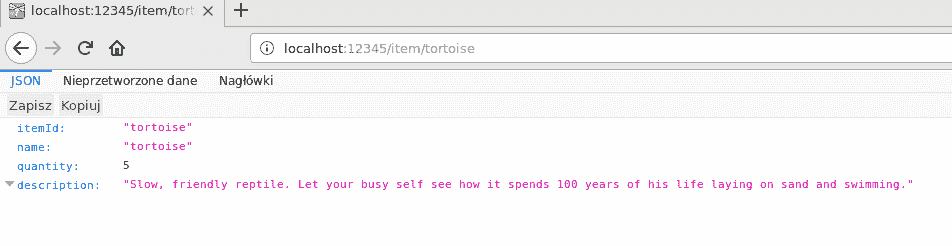
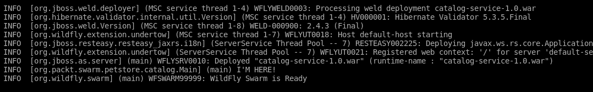
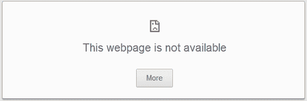
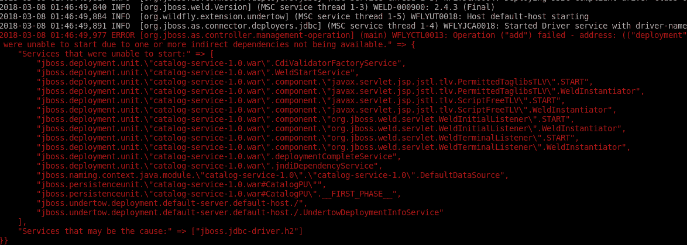
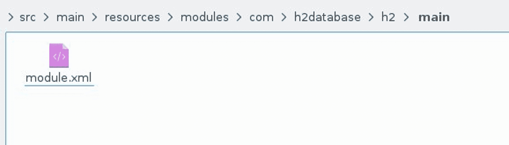
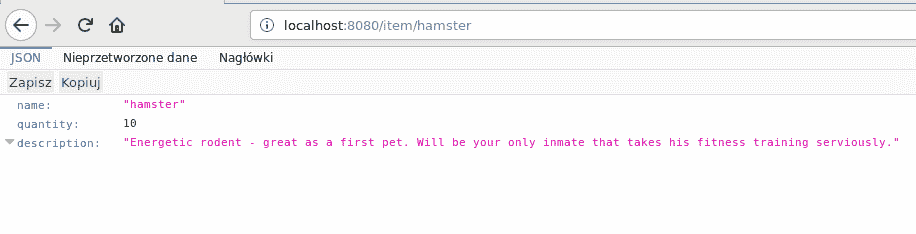
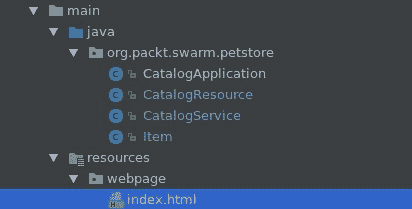
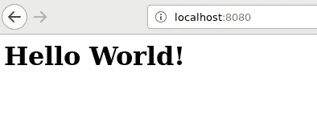
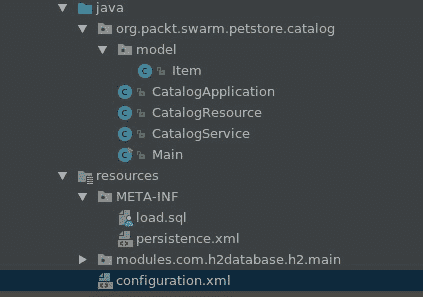

# 第四章：调整您服务的配置

在本章中，你将学习如何配置你的 Swarm 服务。我们将展示不同配置工具的实际示例，以及你如何使用它们来引导应用程序的行为。

# 修改 Swarm 配置

Swarm 中可用的分数都带有合理的默认值。在我们迄今为止看到的示例中，我们没有触摸任何配置，但我们仍然能够看到应用程序在工作。现在，我们将向你展示如何调整 Swarm 创建的服务配置。

Swarm 提供了一套工具，允许你修改应用程序的配置。在下一节中，我们将逐一介绍它们，并展示它们在不同场景中的使用。让我们从最简单的一个开始：系统属性。

# 系统属性

你可以通过指定系统属性来修改配置。让我们回到我们的 catalog-service。正如你在上一章的 catalog-service 示例中所看到的，JAX-RS 应用程序正在监听 8080 端口的 HTTP 请求，这是默认配置。让我们假设我们想要更改该端口。

我们必须做的是在应用程序执行期间指定`swarm.http.port`属性，如下所示：

```java
mvn clean wildfly-swarm:run -Dswarm.http.port=12345
```

当运行网络浏览器时，我们可以看到，确实，应用程序运行的端口已经发生了变化：



那么，这里发生了什么？Undertow 分数发现有一个配置属性覆盖了标准的 HTTP 端口，并相应地修改了套接字配置。结果，运行中的应用程序正在使用指定的端口。

每个分数包含一组可以用来配置它的属性。你将能在 Swarm 文档中找到它们。

编辑属性的方法非常简单，在许多情况下可能足够，但更复杂的程序化配置的入口点可能更可行，让我们学习如何做到这一点。

# 实现自己的`main`类

每个 Swarm 服务都包含一个`main`类，该类负责为服务创建和配置运行时，并在其上运行服务代码。Swarm 创建了`main`类的默认实现（实际上，到目前为止所有示例都使用了默认类），但如果你想要修改默认行为，你可以提供自己的`Main`类实现。这种修改的一个例子可能是提供额外的配置。

让我们回到 catalog-service。让我们回顾一下它的当前操作：我们创建了一个`jaxrs`资源，并使用 CDI 注入了提供邀请消息的服务。现在，让我们修改这个示例以提供我们自己的`main`类。

示例参考：`chapter4/catalog-service-first-main`

为了做到这一点，我们必须按照以下方式修改 catalog-service 的`pom.xml`文件：

```java
(...)

    <dependencies>
 <!-- 2 -->
 <dependency>
            <groupId>org.wildfly.swarm</groupId>
            <artifactId>jaxrs</artifactId>
            <version>${version.wildfly.swarm}</version>
        </dependency>
        <dependency>
            <groupId>org.wildfly.swarm</groupId>
            <artifactId>cdi</artifactId>
            <version>${version.wildfly.swarm}</version> </dependency>
    </dependencies>

    <build>
        <plugins>
            <plugin>
                <artifactId>maven-war-plugin</artifactId>
                <version>${version.war.plugin}</version>
                <configuration>
                    <failOnMissingWebXml>false</failOnMissingWebXml>
                </configuration>
            </plugin>
            <plugin>
                <groupId>org.wildfly.swarm</groupId>
                <artifactId>wildfly-swarm-plugin</artifactId>
                <version>${version.wildfly.swarm}</version>
 <!-- 1 -->
 <configuration>
                    <mainClass>org.packt.swarm.petstore.catalog.Main</mainClass> </configuration>
                <executions>
                    <execution>
                        <phase>package</phase>
                        <goals>
                            <goal>package</goal>
                        </goals>
                    </execution>
                </executions>
            </plugin>
        </plugins>
    </build>

</project>
```

我们必须修改 Swarm 插件，使其配置包含具有我们`main`方法的类（1）。当使用自己的`main`方法时，你必须手动指定你的服务依赖于哪些部分（2）。

现在，让我们看看实现了`main`方法的`org.packt.swarm.petstore.Main`类：

```java
package org.packt.swarm.petstore.catalog;

import org.jboss.logging.Logger;
import org.wildfly.swarm.Swarm;

public class Main {

    public static void main(String[] args) throws Exception {
 //1
        new Swarm().start().deploy();
        //2
        Logger.getLogger(Main.class).info("I'M HERE!");
    }
}
```

我们创建了`org.wildfly.swarm.Swarm`类的实例（1）。`start`方法创建了容器，`deploy`方法将创建的存档部署到容器上。我们还创建了（2）日志输出以证明该类确实在运行。我们将在稍后更详细地查看`Swarm`类，但在那之前，这里是有提到的证明：



消息已经存在，方法已经执行。

# Swarm 类

正如我们在前面的章节中看到的，如果你正在实现自己的`main`方法，你将与`org.wildfly.swarm.Swarm`类进行交互。这个类负责根据提供的配置实例化容器，并创建和部署包含你的应用程序的存档。这两个步骤都可以通过`Swarm`类的操作进行修改。让我们更深入地了解它们。

# 提供配置

`Swarm`类提供了一组方法，允许你使用 Java API 修改配置，例如`fraction`、`socketBinding`和`outboundSocketBinding`。后两个方法，正如它们的名称所暗示的，允许你创建自己的套接字绑定和出站套接字绑定组。对我们来说最有趣的方法是`fraction`方法。它接受一个参数，即`org.wildfly.swarm.spi.api.Fraction`类实现的`fraction`。你将能够修改和重新配置所有部分，并将它们提供给 Swarm。让我们通过我们最喜欢的示例，即更改`CatalogService`的 HTTP 端口，来初步了解这个功能。

示例参考：`chapter4/catalog-service-config-main`

首先，我们必须将`UndertowFraction`依赖项添加到我们的`pom.xml`中：

```java
(...)

    <dependencies>
        <dependency>
            <groupId>org.jboss.spec.javax.ws.rs</groupId>
            <artifactId>jboss-jaxrs-api_2.0_spec</artifactId>
            <scope>provided</scope>
        </dependency>
        <dependency>
            <groupId>javax.enterprise</groupId>
            <artifactId>cdi-api</artifactId>
            <scope>provided</scope>
        </dependency>
        <dependency>
            <groupId>org.wildfly.swarm</groupId>
            <artifactId>jaxrs</artifactId>
            <version>${version.wildfly.swarm}</version>
        </dependency>
        <dependency>
            <groupId>org.wildfly.swarm</groupId>
            <artifactId>cdi</artifactId>
            <version>${version.wildfly.swarm}</version>
        </dependency>
 <!-- 1 -->
        <dependency>
            <groupId>org.wildfly.swarm</groupId>
            <artifactId>undertow</artifactId>
            <version>${version.wildfly.swarm}</version> </dependency>
        <dependency>
            <groupId>org.jboss.logging</groupId>
            <artifactId>jboss-logging</artifactId>
            <version>3.3.0.Final</version>
            <scope>provided</scope>
        </dependency>

    </dependencies>

(...)
```

其次，让我们重新实现`main`方法：

```java
package org.packt.swarm.petstore.catalog;

import org.wildfly.swarm.Swarm;
import org.wildfly.swarm.undertow.UndertowFraction;

public class Main {

    public static void main(String[] args) throws Exception {
 //1
        UndertowFraction undertowFraction = new UndertowFraction();
        //2
        undertowFraction.applyDefaults();
        //3
        undertowFraction.httpPort(12345);
        //4
        Swarm swarm = new Swarm();
        //5
        swarm.fraction(undertowFraction);
        //6
        swarm.start().deploy();
    }
}
```

如果你运行前面的代码，你确实会看到与属性示例中相同的结果：应用程序正在`12345`端口上运行。那么，刚才发生了什么？

在前一段代码的开始部分，我们创建了`UndertowFraction`（1）并运行了`applyDefaults`方法（2）。如果`fraction`是由 Swarm 自动创建的，则默认配置将应用于它。另一方面，如果你手动创建`fraction`，你将创建一个没有任何配置的空`fraction`对象。这就是`applyDefaults`方法的作用。它将默认配置应用于`fraction`对象。因此，每次你不想从头开始创建配置而只是修改它时，你必须首先调用`applyDefaults`方法，然后在此之后应用你的配置更改。这正是我们简单示例中的情况。我们不想手动创建完整的配置。相反，我们只想更改一个配置参数——监听端口。因此，我们将默认配置应用于`fraction`对象，然后只更改了 HTTP 端口。

我们创建了代表 Undertow 分片配置的`UndertowFraction`对象。我们必须将此配置提供给将运行服务的容器。为了做到这一点，我们使用了 Swarm 的`fraction`方法（4）。这里值得提一下，应用程序仍然由许多`fraction`s 组成，但我们只提供了`Undertowfraction`配置。如果我们不向`Swarm`类添加自定义的`fraction`配置，则将使用默认配置。Swarm 仍然会启动 CDI 和 JAX-RS 等，但它们的配置将自动创建，就像我们第一个例子中那样。另一方面，`Undertowconfiguration`对象是由我们手动提供的，Swarm 将使用它。

在应用程序配置完成后，我们准备启动和部署（5）它，就像我们在前面的例子中所做的那样。如果我们运行我们的应用程序，我们将看到我们在使用系统属性的那个例子中获得的结果——应用程序在端口`12345`上运行。

然而，在属性示例中，我们只需要添加一个配置参数，而在这里，我们必须做很多事情。你可能想知道是否可以使用 Java API 提供更详细的配置，但在像 HTTP 端口这样的情况下仍然求助于属性；这是一个好问题。让我们找出答案。

# 使用自己的主程序以及属性

让我们将`Main`类修改为最简单的形式：

```java
package org.packt.swarm.petstore;

import org.jboss.logging.Logger;
import org.wildfly.swarm.Swarm;

public class Main {

    public static void main(String[] args) throws Exception {
        new Swarm().start().deploy();
    }
}
```

然后，使用 HTTP 端口属性运行它：

```java
mvn clean wildfly-swarm:run -Dswarm.http.port=12345
```

此外，我们将在浏览器中检查：



嗯，它不起作用。所以，正如刚刚发生的那样，你无法做到这一点，很抱歉。

我当然是在开玩笑。你可以做到，但正如我们所知，我们完全意外地在上一列表中的代码中犯了一个小错误。问题出在哪里？执行`main`方法时使用的系统属性没有以任何方式传播到 Swarm。考虑另一方面，我们是这样编写我们的代码的：

```java
package org.packt.swarm.petstore;

import org.jboss.logging.Logger;
import org.wildfly.swarm.Swarm;

public class Main {

 public static void main(String[] args) throws Exception {
 //1
 new Swarm(args).start().deploy();
 Logger.getLogger(Main.class).info("I'M HERE!");
 }
}
```

应用程序将使用指定的属性并展示应用程序的行为，我们将能够看到它是否正在正确运行。

总结来说，你现在可以将 Java API 与基于属性的配置混合使用，但必须记住使用带有`main`函数参数创建 Swarm。

# Java API

让我们回到`Swarm`类。我们已经看到，我们能够使用自己的配置创建分数类并将其传递给`Swarm`类。实际上，我们能够通过编程方式控制整个 Swarm 配置。为了创建一个更详细的示例，让我们扩展我们的`CatalogService`，使其将数据存储在数据库中。

示例参考：`chapter4/catalog-service-database`。

让我们从编辑`pom.xml`开始：

```java
(...)

    <properties>
        (...)
 <version.hibernate.api>1.0.0.Final</version.hibernate.api>
        <version.h2>1.4.187</version.h2>
    </properties>

    (...)

    <dependencies>
        (...)
        <dependency>
            <groupId>org.wildfly.swarm</groupId>
            <artifactId>cdi</artifactId>
            <version>${version.wildfly.swarm}</version>
        </dependency>
 //1
 <dependency>
            <groupId>org.wildfly.swarm</groupId>
            <artifactId>datasources</artifactId>
            <version>${version.wildfly.swarm}</version>
        </dependency>
        //2
        <dependency>
            <groupId>org.wildfly.swarm</groupId>
            <artifactId>jpa</artifactId>
            <version>${version.wildfly.swarm}</version>
        </dependency>
        //3
        <dependency>
            <groupId>org.hibernate.javax.persistence</groupId>
            <artifactId>hibernate-jpa-2.1-api</artifactId>
            <version>${version.hibernate.api}</version>
        </dependency>
        //4
        <dependency>
            <groupId>com.h2database</groupId>
            <artifactId>h2</artifactId>
            <version>${version.h2}</version>
        </dependency> 
    </dependencies>

   (...)

</project>
```

我们添加了四个新的 Maven 依赖项。为了配置我们自己的`datasource`，我们必须添加`datasource`分数（1）。由于我们将使用 Java 持久化 API，我们需要`jpa`分数和 JPA API（2）。我们还将使用`h2`内存数据库，并且需要它的`dependency`（3）。最后，我们提供了`dependency`给`h2`数据库（4）。

由于我们打算持久化商店中可用的宠物数据，我们必须修改`Item`类，使其成为一个实体，一个表示将在关系数据库中持久化的状态的 JPA 对象：

```java
package org.packt.swarm.petstore.catalog.model;

import com.fasterxml.jackson.annotation.JsonIgnore;

import javax.persistence.Column;
import javax.persistence.Entity;
import javax.persistence.Id;
import javax.persistence.NamedQueries;
import javax.persistence.NamedQuery;
import javax.persistence.Table;

//1
@Entity
//2
@Table(name = "item")
//3
@NamedQueries({
 @NamedQuery(name="Item.findById",
                query="SELECT i FROM Item i WHERE i.itemId = :itemId"),
})
public class Item {

 //4
    @Id
    @JsonIgnore
    private int id;

    //5
    @Column(length = 30)
 private String itemId;

    //6
    @Column(length = 30)
 private String name;
    @Column
    private int quantity;

    @Column
    private String description;

    public String getItemId() {
        return itemId;
    }

    public void setItemId(String itemId) {
        this.itemId = itemId;
    }

    public String getName() {
        return name;
    }

    public void setName(String name) {
        this.name = name;
    }

    public int getQuantity() {
        return quantity;
    }

    public void setQuantity(int quantity) {
        this.quantity = quantity;
    }

    public String getDescription() {
        return description;
    }

    public void setDescription(String description) {
        this.description = description;
    }
}
```

这是一个简单的`jpa`实体（1），对应的表名为`"ITEM"`（2）。我们创建了`NamedQuery`（3）来通过`name`查找宠物。我们添加了数据库 ID 字段（4）。此外，我们还添加了`@Column`注解，以便`name`和`quantity`字段被持久化到数据库中（5）。

我们还必须修改我们的`CatalogService`类，使其能够从数据库中加载数据：

```java
package org.packt.swarm.petstore.catalog;

import org.packt.swarm.petstore.catalog.model.Item;

import javax.enterprise.context.ApplicationScoped;
import javax.persistence.EntityManager;
import javax.persistence.PersistenceContext;

@ApplicationScoped
public class CatalogService {

 //1
 @PersistenceContext(unitName = "CatalogPU")
 private EntityManager em;

 //2

 public Item searchById(String itemId) {
 return em.createNamedQuery("Item.findById", Item.class).setParameter("itemId", itemId).getSingleResult();
>    }

}
```

我们引用了`CatalogPU`持久化上下文（我们将在稍后进行配置）并使用在`Item`类中定义的命名查询通过`id`查找宠物（2）。

好的，让我们转到有趣的部分。我们将创建并使用内存中的`h2`数据源；以下是如何做到这一点的代码：

```java
package org.packt.swarm.petstore.catalog;

import org.wildfly.swarm.Swarm;
import org.wildfly.swarm.datasources.DatasourcesFraction;

public class Main {

    public static void main(String[] args) throws Exception {
        DatasourcesFraction datasourcesFraction = new DatasourcesFraction()
 //1
                .jdbcDriver("h2", (d) -> {
 d.driverClassName("org.h2.Driver");
                    d.xaDatasourceClass("org.h2.jdbcx.JdbcDataSource");
                    d.driverModuleName("com.h2database.h2");
                }) //2
                .dataSource("CatalogDS", (ds) -> {
 ds.driverName("h2");
                    ds.connectionUrl("jdbc:h2:mem:test;DB_CLOSE_DELAY=-1;DB_CLOSE_ON_EXIT=FALSE");
                    ds.userName("sa");
                    ds.password("sa");
                });

        Swarm swarm = new Swarm();
        swarm.fraction(datasourcesFraction);
        swarm.start().deploy();
    }
}
```

`datasourcesFraction`的配置比简单的端口更改要复杂一些，让我们更详细地看看。在（1）中，我们定义了一个名为`"h2"`的**Java 数据库连接（JDBC**）驱动程序，并提供了实现`org.wildfly.swarm.config.JDBCDriverConsumer`类的 lambda 表达式——这基本上是一个接受者，允许你将额外的配置应用到创建的 JDBC 驱动程序上。在（2）中发生类似的情况。在这里，我们创建了`CatalogDS`数据源，并使用`org.wildfly.swarm.config.DatasourcesConsumer`类应用了额外的配置。

如前述代码所示，这个配置并不像`Undertowport`更改那样简单，但不用担心。Swarm 在每个版本中都附带当前的 Java API 库，并且由于所有配置选项都在那里描述，你不需要在配置应用程序时依赖猜测。[1]

我们仍然需要做更多的事情来使我们的示例工作，比如提供`persistence.xml`并在启动时填充数据库中的一组消息。

让我们从第一件事开始。以下是我们`persistence.xml`文件：

```java
<?xml version="1.0" encoding="UTF-8"?>
<persistence
        xmlns:xsi="http://www.w3.org/2001/XMLSchema-instance"
        version="2.1"
        xmlns="http://xmlns.jcp.org/xml/ns/persistence"
        xsi:schemaLocation="http://xmlns.jcp.org/xml/ns/persistence http://xmlns.jcp.org/xml/ns/persistence/persistence_2_1.xsd">
 <!-- 1 -->
    <persistence-unit name="CatalogPU" transaction-type="JTA">
        <!-- 2 -->
        <jta-data-source>java:jboss/datasources/CatalogDS</jta-data-source>
        <properties>
            <!-- 3 -->
            <property name="javax.persistence.schema-generation.database.action" value="drop-and-create"/>
            <property name="javax.persistence.schema-generation.create-source" value="metadata"/>
            <property name="javax.persistence.schema-generation.drop-source" value="metadata"/>
            <!-- 4 -->
            <property name="javax.persistence.sql-load-script-source" value="META-INF/load.sql"/>
        </properties>
    </persistence-unit>
</persistence>
```

在前述配置中，我们创建了一个名为`CatalogPU`的持久单元，它使用`JTA`事务（1），使持久单元使用之前创建的`CatalogDS`数据源（2），提供了一个配置，将使数据库在部署时创建新数据库，在卸载时使用实体类元数据删除它（3），最后，提供了加载脚本（4）。

问题是我们还没有它；让我们先添加它：

```java
INSERT INTO ITEM(id, itemId, name, description, quantity) VALUES (1, 'turtle', 'turtle',  'Slow friendly reptile. Let your busy self see how it spends a hundred years of his life laying on sand and swimming.', 5);
INSERT INTO ITEM(id, itemId, name, description, quantity) VALUES (2, 'hamster', 'hamster', 'Energetic rodent - great as a first pet. Will be your only inmate that takes his fitness training serviously.', 10);
INSERT INTO ITEM(id, itemId, name, description, quantity) VALUES (3, 'goldfish', 'goldfish', 'With its beauty it will be the decoration of you aquarium. Likes gourmet fish feed and postmodern poetry.', 3);
INSERT INTO ITEM(id, itemId, name, description, quantity) VALUES (4, 'lion', 'lion', 'Big cat with fancy mane. Loves playing the tag and cuddling with other animals and people.', 9);
```

在所有这些工作都最终完成之后，我们应该能够看到我们的应用程序正在运行。现在让我们试试：



哎呀！不是浏览器页面上的消息，而是出现了一个可怕的红色日志。出了什么问题？让我们看看第一条读取消息："`WFLYJCA0041: Failed to load module for driver [com.h2database.h2]`"。确实如此，因为这个是一个自定义驱动模块，我们必须手动将其添加到我们的应用程序中。我们如何做到这一点呢？其实很简单。

要将一个额外的自定义模块添加到我们的应用程序中，我们必须将其添加到应用程序的`resources`目录：



如前一个屏幕截图所示，`modules`目录必须放置在我们的应用程序中 Maven 的`resources`目录内部，并且目录结构必须与模块名称匹配。让我们看看模块描述符：

```java
<?xml version="1.0" encoding="UTF-8"?>
<!-- 1 -->
<module  name="com.h2database.h2">

  <resources>
    <!-- 2 -->
    <artifact name="com.h2database:h2:1.4.187"/>
  </resources>
  <!-- 3 -->
  <dependencies>
    <module name="javax.api"/>
    <module name="javax.transaction.api"/>
    <module name="javax.servlet.api" optional="true"/>
 </dependencies>
</module>

```

为了回忆，这和我们之前在第二章《熟悉 WildFly Swarm》中介绍的是同一种描述符，我们描述了模块化类加载的概念。在上一个文件中，我们创建了一个名为`"com.h2database.h2"`的模块（1），指定唯一资源是`h2`数据库组件。请注意，我们使用 Maven 坐标引用了该组件。最后，我们必须指定所有模块依赖项（3）。

让我们再次构建并运行应用程序。现在我们确实能够查找我们的宠物了：



我们现在确实能够通过`id`搜索宠物了。

让我们继续使用`Swarm`类的用法。接下来我们将查看它的`deploy`方法。

# 修改你的存档

在我们之前的示例中，每次我们创建`Swarm`实例并在其上应用一些配置时，我们都使用了无参数的`deploy`方法。该方法接受由标准 Maven 构建生成的存档，并将其部署到之前配置的容器上。尽管如此，`deploy`方法不止这一种版本。你可以创建自己的存档（或存档），并将它们部署到 Swarm 容器中。如何做到？可以使用`ShrinkWrap` API。

# ShrinkWrap API

如果你曾经与 WildFly AS 一起工作过，尤其是它的测试框架 Arquillian，你可能也对`ShrinkWrap` API 很熟悉，该 API 用于在测试环境中部署应用程序存档之前构建应用程序存档。然而，如果你从未使用过它，不要担心——API 非常简单直观。

API 中的核心类是`org.jboss.shrinkwrap.api.Archive`实例。它是一个抽象类，代表存档。我们最感兴趣的实体实现是`org.jboss.shrinkwrap.api.spec.JavaArchive`和`org.jboss.shrinkwrap.api.spec.WebArchive`，正如你可能猜到的，它们代表 JAR 和 WAR。API 很简单；它包含了一组方法，允许你向存档中添加资源。让我们看看它在实际操作中的表现。

为了这个示例，让我们回到第一个`CatalogService`版本，它只包含`jaxrs`资源和应用程序。

示例参考：`chapter4/catalog-service-shrinkwrap`

要看到`ShrinkWrap`的实际应用，我们必须修改`pom.xml`文件：

```java
(...)

    <dependencies>
        <dependency>
            <groupId>org.jboss.spec.javax.ws.rs</groupId>
            <artifactId>jboss-jaxrs-api_2.0_spec</artifactId>
            <scope>provided</scope>
        </dependency>
 <!-- 1 -->
        <dependency>
            <groupId>org.wildfly.swarm</groupId>
            <artifactId>jaxrs</artifactId>
            <version>${version.wildfly.swarm}</version> </dependency>
    </dependencies>

    <build>
        <plugins>
            <plugin>
                <artifactId>maven-war-plugin</artifactId>
                <version>${version.war.plugin}</version>
                <configuration>
                    <failOnMissingWebXml>false</failOnMissingWebXml>
                </configuration>
            </plugin>
            <plugin>
                <groupId>org.wildfly.swarm</groupId>
                <artifactId>wildfly-swarm-plugin</artifactId>
                <version>${version.wildfly.swarm}</version>
 <!-- 2 -->
                <configuration>
                    <mainClass>org.packt.swarm.petstore.catalog.Main</mainClass> </configuration>
                <executions>
                    <execution>
                        <goals>
                            <goal>package</goal>
                        </goals>
                    </execution>
                </executions>
            </plugin>
        </plugins>
    </build>

(...)
```

由于我们提供了自己的`main`方法，我们必须显式添加对`jaxrs`分片的依赖（1）。我们还需要将方法添加到 Swarm 插件配置（2）中。

让我们看看`ShrinkWrap` API 在`org.packt.swarm.petstore.Main`类中的使用：

```java
package org.packt.swarm.petstore.catalog;

import org.jboss.shrinkwrap.api.ShrinkWrap;
import org.wildfly.swarm.Swarm;
import org.wildfly.swarm.jaxrs.JAXRSArchive;

public class Main {

    public static void main(String[] args) throws Exception {

        Swarm swarm = new Swarm();
        swarm.start();

 //1
        JAXRSArchive deployment = ShrinkWrap.create(JAXRSArchive.class, "deployment.war");
        //2
        deployment.addClasses(CatalogApplication.class, CatalogResource.class, Item.class);
        swarm.deploy(deployment);
    }
}
```

我们创建了 Web 存档（1），添加了我们的示例所包含的类（2），并将它们部署到创建的容器上（3）。结果，我们手动完成了 Swarm 为我们自动完成的事情。

我们已经使用了`addClass`方法将创建的类添加到存档中。以类似的方式，你也能够使用其他`ShrinkWrap` API 方法。`org.jboss.shrinkwrap.api.spec.JavaArchive`类除了包含原生存档方法（`add`和`addDirectory`）外，还包含使处理类（`addClass`和`addPackage`）、资源（`addResource`）和清单（`setManifest`和`addManifestResource`）变得容易的方法。`org.jboss.shrinkwrap.api.spec.WebArchive`类还额外增加了网络资源方法（`addWebResource`和`setWebXML`）。与前面的例子一样，使用这些方法通常很简单，但在任何疑问的情况下，你可以利用`ShrinkWrap` Java API。

# 获取默认存档

`ShrinkWrap`不是太繁琐，以至于在现实生活中的任何情况下都派得上用场吗？毕竟，我们不想手动将应用程序中的所有类和资源添加到存档中。你不必担心这个问题——你将能够从 Swarm 实例中获取默认部署：

```java
package org.packt.swarm.petstore.catalog;

import org.jboss.shrinkwrap.api.Archive;
import org.wildfly.swarm.Swarm;

public class Main {

 public static void main(String[] args) throws Exception {

 Swarm swarm = new Swarm();
 swarm.start();

 //1
 Archive<?> deployment = swarm.createDefaultDeployment();
 swarm.deploy(deployment);

 }

}
```

正如前一个例子所示，我们通过调用`createDefaultDeployment()`方法获得了默认部署。在获得它之后，我们只能向其中添加额外的所需资源。

# Swarm ShrinkWrap 扩展

Swarm 添加了自己的类来补充`ShrinkWrap` API。让我们来介绍它们。

# JARArchive

`org.wildfly.swarm.spi.api.JARArchive`是`JavaArchive`的替代品。除了它提供的所有功能外，`JARArchive`还增加了一个 API，可以轻松添加模块、Maven 依赖项和服务提供者实现。

# WARArchive

由于`WebArchive`在`JavaArchive`的基础上增加了功能，`WARArchive`则在`JARArchive`的基础上增加了新特性。除了提供一个用于处理网络资源的接口外，它还增加了轻松添加静态网络内容的功能。让我们通过一个例子来看看。

如同往常，我们需要`pom.xml`文件：

```java
(...)

    <!-- 1 -->
    <dependencies>
        <dependency>
            <groupId>org.wildfly.swarm</groupId>
            <artifactId>undertow</artifactId>
            <version>${version.wildfly.swarm}</version>
        </dependency>
 </dependencies>

(...)
```

由于我们正在使用自己的`main`，我们需要添加一个`undertow`分数依赖（1）并配置`main`方法（2）。

我们的静态内容将是一个简单的 Hello World 页面：

```java
<html>
<body>
<h1>Hello World!</h1>
</body>
</html>
```

我们将把这个类添加到应用程序资源中的`webpage`目录下：



`main`类看起来是这样的：

```java
package org.packt.swarm.petstore.catalog;

import org.jboss.shrinkwrap.api.ShrinkWrap;
import org.wildfly.swarm.Swarm;
import org.wildfly.swarm.undertow.WARArchive;

public class Main {

    public static void main(String[] args) throws Exception {

        Swarm swarm = new Swarm();

 //1
        WARArchive deployment = ShrinkWrap.create(WARArchive.class);
        //2
        deployment.staticContent("webpage");

        swarm.start().deploy(deployment);

    }
}
```

我们已经创建了`WARArchive`并调用了`staticContent`方法。当我们打开网络浏览器时，我们将看到 Hello World 页面：



发生了什么？静态内容方法已经将`webpage`目录（在我们的例子中是一个文件）中的所有非 Java 文件复制到了创建的存档中，以便它们可以被`undertow`看到。

# JAXRSArchive

我们现在想要查看的 Swarm 存档的最后一类是`org.wildfly.swarm.JAXRSArchive`。这个存档增加了创建默认 JAX-RS 应用程序的能力，应用程序路径设置为`"/"`。到目前为止，我们一直在所有示例中手动完成这项操作。有了 JAX-RS 存档，这个类将自动添加。

# XML 配置

虽然 Java API 很方便，但这并不是我们唯一的选择。如果你熟悉 WildFly 的 XML 配置，或者如果你正在将你的应用程序迁移到 Swarm 并且有一个可工作的 XML 文件，你不需要将其转换为 Java API，因为你可以直接使用它。

示例参考：`chapter4/catalog-service-xmlconfig`

让我们回到我们的数据库示例。你可以使用 XML 配置数据源。在这种情况下，XML 配置看起来像这样：

```java
<subsystem xmlns="urn:jboss:domain:datasources:4.0">
    <datasources>
        <drivers>
            <driver name="h2" module="com.h2database.h2">
                <driver-class>org.h2.Driver</driver-class>
                <xa-datasource-class>org.h2.jdbcx.JdbcDataSource</xa-datasource-class>
            </driver>
        </drivers>
        <datasource jndi-name="java:jboss/datasources/CatalogDS" pool-name="CatalogDS" enabled="true" use-java-context="true">
            <connection-url>jdbc:h2:mem:test;DB_CLOSE_DELAY=-1;DB_CLOSE_ON_EXIT=FALSE</connection-url>
            <driver>h2</driver>
        </datasource>
        <datasource jndi-name="java:jboss/datasources/ExampleDS" pool-name="ExampleDS" enabled="true" use-java-context="true">
            <connection-url>jdbc:h2:mem:test;DB_CLOSE_DELAY=-1;DB_CLOSE_ON_EXIT=FALSE</connection-url>
            <driver>h2</driver>
            <security>
                <user-name>sa</user-name>
                <password>sa</password>
            </security>
        </datasource>
    </datasources>
</subsystem>
```

我们必须将此配置文件添加到`resources`目录中：



最后，我们还需要告诉 Swarm 使用配置文件。以下是被修改的`Main`类：

```java
package org.packt.swarm.petstore.catalog;

import org.jboss.shrinkwrap.api.Archive;
import org.wildfly.swarm.Swarm;
import org.wildfly.swarm.datasources.DatasourcesFraction;
import org.wildfly.swarm.jaxrs.JAXRSArchive;
import org.wildfly.swarm.undertow.UndertowFraction;
import org.wildfly.swarm.undertow.WARArchive;

import java.net.URL;

public class Main {

    public static void main(String[] args) throws Exception {

        Swarm swarm = new Swarm();

 //1
        ClassLoader cl = Main.class.getClassLoader();
        URL xmlConfig = cl.getResource("datasources.xml");

 //2
        swarm.withXmlConfig(xmlConfig);

        swarm.start().deploy();

    }
```

我们获取了类加载器以便定位配置文件（1）。在读取文件后，我们指示 Swarm 使用其中的配置（2）。

然而，我们已经使用了整个配置文件——Swarm 现在会使用所有子系统吗？答案是：不会；只有那些已经指定了依赖关系的部分才会被添加到容器中。给定 XML 文件，Swarm 只会读取构成它的那些子系统的配置。你也可以提供一个只包含你想要使用 XML 配置的子系统的文件。

# YAML 配置

你还可以通过 YAML 数据序列化语言提供 Swarm 配置。

再次，让我们从端口更改示例开始。我们将再次从 JAX-RS 示例开始，并修改它以使用 YAML 配置。

首先，让我们在`resources`目录内创建 HTTP-`port.yml`配置文件：

```java
swarm:
  http:
    port: 12345
```

Swarm 会将嵌套属性转换为平面属性。因此，前面文件中指定的属性被转换为`swarm.http.port`，这是我们非常熟悉的。

要使用以下配置，我们必须修改我们的`Main`类：

```java
package org.packt.swarm.petstore.catalog;

import org.wildfly.swarm.Swarm;

import java.net.URL;

public class Main {

    public static void main(String[] args) throws Exception {

        Swarm swarm = new Swarm();

        //1
 ClassLoader cl = Main.class.getClassLoader();
        URL yamlConfig = cl.getResource("http-port.yml");

        //2
        swarm.withConfig(yamlConfig);

        swarm.start().deploy();
    }
}
```

在从`classpath`（1）获取配置后，我们使用`withConfig`方法通知 Swarm 使用它。就是这样；现在，Swarm 将使用`12345`端口。

# 项目阶段

YAML 配置的强大之处在于它能够为不同的项目阶段提供不同的组属性。再次，让我们先看看示例。

新的配置文件看起来像这样：

```java
swarm:
  http:
    port: 8080
---
project:
    stage: test
swarm:
    http:
        port: 12345
---
project:
    stage: QA
swarm:
    http:
        port: 12346
```

文件的不同部分收集了不同项目阶段的配置。第一组是默认配置。当没有提供阶段名称时使用。其他两个指定了测试和 `QA` 阶段的配置。然而，你如何知道应用程序当前运行在哪个阶段？你必须提供 `swarm.project.stage` 属性。所以，例如，我们使用以下命令运行前面的例子：

```java
mvn wildfly-swarm:run -Dswarm.project.stage=QA
```

然后，我们将能够通过 `12346` 端口访问我们的应用程序。

正如你将在前面的代码中注意到的那样，YAML 配置使得为不同的环境创建配置以及使用简单的命令行参数选择应使用哪些属性组变得很容易。

# YAML 数据库配置

作为另一个 YAML 配置示例，我们将向你展示如何使用 YAML 配置文件配置数据源。让我们看看：

示例参考：`第四章/catalog-service-database-ymlconfig`

这个例子与 XML 配置示例非常相似。我们必须用其 YAML 等价物交换配置文件：

```java
swarm:
  datasources:
    data-sources:
      CatalogDS:
        driver-name: h2
        connection-url: jdbc:h2:mem:test;DB_CLOSE_DELAY=-1;DB_CLOSE_ON_EXIT=FALSE
        user-name: sa
        password: sa
    jdbc-drivers:
          h2:
            driver-class-name: org.h2.Driver
            xa-datasource-name: org.h2.jdbcx.JdbcDataSource
            driver-module-name: com.h2database.h2

```

还需要让 `Main` 类使用它（1）：

```java
package org.packt.swarm.petstore.catalog;

import org.wildfly.swarm.Swarm;

import java.net.URL;

public class Main {

    public static void main(String[] args) throws Exception {
        Swarm swarm = new Swarm();

 //1
 ClassLoader cl = Main.class.getClassLoader();
        URL ymlConfig = cl.getResource("datasources.yml");

        swarm.withConfig(ymlConfig);

        swarm.start().deploy();
    }
}
```

我们将在本书的整个示例中大量使用此类配置。

# 配置的混合使用

现在，关于配置的混合使用呢？你被允许这样做吗？是的。让我们看看以下代码：

```java
package org.packt.swarm.petstore.catalog;

import org.jboss.shrinkwrap.api.Archive;
import org.wildfly.swarm.Swarm;
import org.wildfly.swarm.datasources.DatasourcesFraction;
import org.wildfly.swarm.undertow.UndertowFraction;

public class Main {

 public static void main(String[] args) throws Exception {
 Swarm swarm = new Swarm();

 //1
 ClassLoader cl = Main.class.getClassLoader();
 URL xmlConfig = cl.getResource("standalone.xml");
 swarm.withXMLFile(xmlFile);

 //2
 UndertowFraction undertowFraction = new UndertowFraction();
 undertowFraction.applyDefaults();
 undertowFraction.httpPort(12345);
 swarm.fraction(undertowFraction);

 //3
 Archive<?> deployment = swarm.createDefaultDeployment();
 deployment.addModule("com.h2database.h2");

 //4
 swarm.start().deploy();
 }

}
```

这是我们的数据库示例的另一种变体，你已经知道整个代码中发生了什么。只是为了回顾，我们加载了配置文件，并通知 Swarm 使用它（1），创建了 `UndertowFraction` 并将其配置为使用 `12345` 端口（2），将驱动模块添加到应用程序中（3），最后，启动了应用程序并在其上部署了创建的存档（4）。

这样的代码会产生什么结果？正如你可能已经猜到的，在运行应用程序后，我们将在 `localhost:12345/hello` 上看到随机消息。

注意，你可以混合使用 XML 和 Java API 配置。你也能使用属性吗？当然。让我们将 `swarm.http.port` 与 `12346` 端口添加到命令行中，我们将在地址上看到我们的消息。是的，我们这里有一个冲突。这是一个错误吗？这不是错误。Swarm 对不同的配置方法赋予不同的优先级。优先级如下：

1.  Java API 覆盖了由 XML 指定的配置

1.  YAML 覆盖了 Java API 指定的配置

1.  最后，系统属性覆盖了 YAML 配置

1.  结果，在我们的最后一个例子中，我们将在 `12346` 端口看到我们的消息

# 摘要

在本章中，你学习了如何配置使用 Swarm 创建的服务。你学习了如何使用系统属性来修改 Swarm 的行为，提供自己的 `main` 方法并使用它来通过 Java API 或 XML 提供 Swarm 配置，最后，如何修改已部署应用程序的内容。

在阅读了前三章之后，你现在可以使用 WildFly Swarm 来构建微服务。在接下来的章节中，你将学习 OpenShift，这样你就可以将你的服务部署到云端。

# 进一步阅读

[`wildfly-swarm.io/documentation/`](http://wildfly-swarm.io/documentation/)
