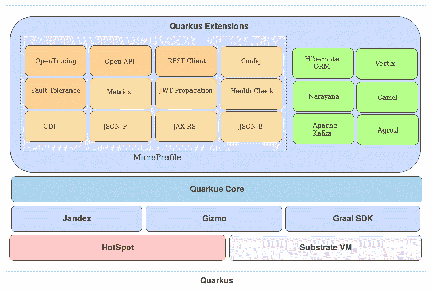
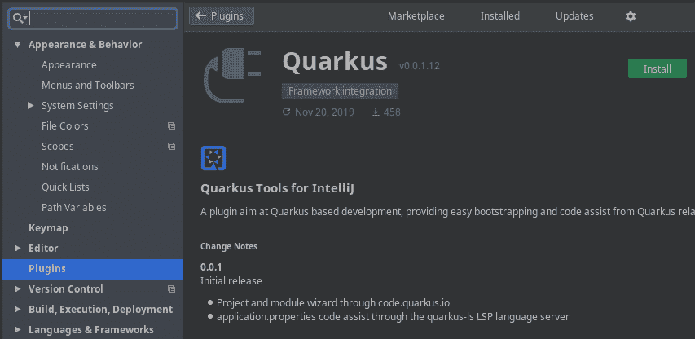
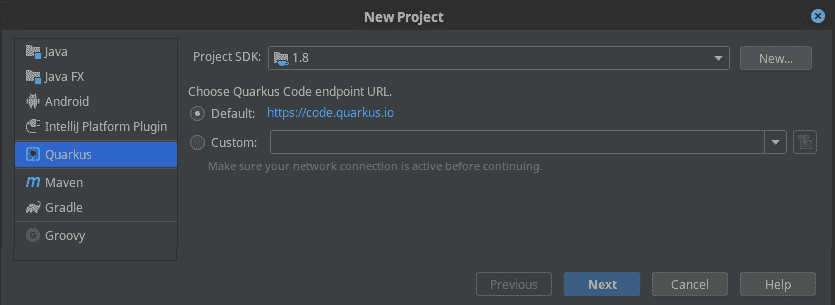
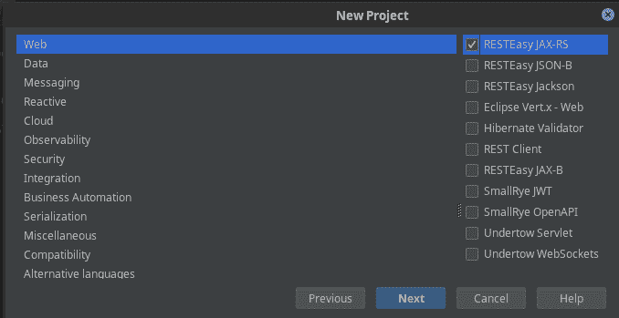

# 第一章：Quarkus 核心概念简介

Java 早在 20 多年前就被引入开源社区。从那时起，我们无法想到有任何一家大型 IT 公司或组织不使用 Java。因此，Java 常常被视为一种**企业级**语言，这本身并不是坏事：Java 是企业标准，它是一个极其成熟的语言，周围有一个庞大的工具和库生态系统，并且仍然是全球开发者使用最多的语言。

然而，在 IT 行业 20 年是一个相当长的时间。从开始，Java 就经历了一系列优化，同时承担着与早期版本保持向后兼容性的负担。然而，如今，随着云、容器、微服务和响应式编程等新标准的兴起，IT 格局已经发生了显著变化。我们是否还需要使用 Java 来应对最新的应用程序架构，并达到更高的生产力和效率水平？是的！本书承诺在向您介绍**Quarkus**的同时做到这一点，Quarkus 是一个 Kubernetes 原生框架，它将把超音速、亚原子级的 Java 提升到新的高度！

在本书的第一部分，我们将学习如何使用简单的工具创建 Quarkus 应用程序，同时使用开发环境进行编码、执行和调试。完成所有绿色条目后，我们将专注于高级主题，向您展示如何结合多个 Quarkus 扩展来构建无服务器基础设施。

就本章而言，我们将通过涵盖以下主题来快速浏览 Quarkus 技术：

+   IT 格局概述，展示云原生应用程序和微服务的优势

+   Quarkus 架构的基本原理

+   安装所需的软件（GraalVM 用于本地编译代码和开发环境）

# 技术要求

你可以在 GitHub 上找到该项目的源代码，请参阅本章中的[`github.com/PacktPublishing/Hands-On-Cloud-Native-Applications-with-Java-and-Quarkus/tree/master/Chapter01`](https://github.com/PacktPublishing/Hands-On-Cloud-Native-Applications-with-Java-and-Quarkus/tree/master/Chapter01)。

# 从大数据炒作到 Kubernetes

大约 10 年前，IT 行业最大的炒作是“大数据”这个术语。每个主要企业都在竞相利用庞大的、但据说可管理的、神秘的数据孤岛的力量。有了大数据，没有任何问题是不可以克服的，所有的预测都会实现。

但最近，这些预测似乎已经消退，IT 行业最不为人知的秘密是大数据已经死亡——至少是我们所知道的大数据。这并不意味着数据的量或增长已经崩溃——或者相反。这只是底层技术发生了变化，这意味着使用大数据的应用程序架构也发生了变化。

以 Hadoop 为例，它一直是大数据炒作的标志。它基于一系列假设设计，这些假设在短时间内发生了巨大变化。其中之一是，为了处理大量数据，网络延迟是邪恶的，云原生存储根本不是一种选择。当时，大多数 IT 行业数据都在本地，因此重点是避免移动大量信息。这意味着数据需要集中存储以便高效计算。

今天，这种场景已经发生了很大变化：大多数应用程序仍然使用大量数据，但现在数据是实时处理的。也就是说，我们现在流式传输数据而不是多次处理整个数据集。

此外，网络延迟障碍对云服务提供商来说已经不再是问题，甚至有多个云源可供选择。此外，公司现在可以选择在自己的本地部署自己的私有云，从而产生新的场景，如**混合云**。

因此，重点是真正发生了什么变化：今天，大数据不仅仅意味着大量数据集的**大**量，而是大量数据的灵活存储选项。

这就是容器和，特别是 Kubernetes 的适用之处。简而言之，你可以把容器想象成一个打包的应用程序，它只包含运行它所需的库，而 Kubernetes 就像是一个编排系统，确保所有容器都有适当的资源，同时管理它们的生命周期。

Kubernetes 使用**Docker**运行镜像并管理容器。然而，Kubernetes 也可以使用其他引擎（例如，`rkt`）。由于我们将在 Kubernetes 之上构建我们的应用程序，因此我们将在下一节中简要概述其架构。

# Kubernetes 架构概述

Kubernetes 的架构侧重于服务发现的概念，这是一种松散耦合且灵活的机制。像大多数其他分布式中间件平台一样，一个 Kubernetes 集群由一个或多个主节点和多个计算节点组成。以下图表展示了 Kubernetes 集群的高级视图：


**Kubernetes 主节点**本质上构成了集群的大脑。它们负责管理整个集群，暴露 API，以及调度部署。**Kubernetes 节点**（前一张图的右侧）包含运行在 Pod 组件中的应用所需的服务。

每个主节点包含以下组件：

+   **API 服务器**：此服务器同步并验证 Pod 和服务的运行信息。

+   **etcd**：这为集群数据提供一致且高度可用的存储。你可以把`etcd`看作是大脑的共享内存。

+   **控制器管理器服务器**：此服务器检查`etcd`服务的更改，并使用其 API 强制执行所需状态。

+   **HAProxy**：在配置 HA 主节点以在多个主端点之间平衡负载时可以添加此组件。

**Kubernetes 节点**（简称**节点**）可以被视为 Kubernetes 集群的驮马。每个节点向您的应用程序提供一组资源（例如计算、网络和存储）。节点还包含用于服务发现、监控、日志记录和可选附加组件的附加组件。在基础设施方面，您可以在云环境中或数据中心运行的裸机服务器上以**虚拟机**（**VM**）的形式运行节点。

每个节点包含以下组件：

+   **Pod**: 这使我们能够逻辑地将容器和我们的应用程序堆栈的各个部分组合在一起。Pod 充当具有共享资源和上下文的此类容器的逻辑边界。Pod 可以通过创建副本集在运行时进行扩展。这反过来又确保了部署始终运行所需数量的 Pod。

+   **Kubelet**：这是一个在 Kubernetes 集群中的每个节点上运行的代理。它确保容器在 Pod 中运行。

+   **Kube-Proxy**：这维护节点上的网络规则，以允许 Pod 之间的网络通信。

+   **容器运行时**：这是负责运行容器的软件。Kubernetes 支持多种容器运行时（如 Docker、`containerd`、`cri-o`和`rktlet`）。

现在我们已经介绍了 Kubernetes 架构的基本知识，让我们来看看它可以为您的组织带来的主要优势。

# 使用 Kubernetes 的好处

Kubernetes 可以为您的组织带来的优势如下：

+   Kubernetes 极大地简化了容器管理。如您所知，在使用 Kubernetes 时，无需直接管理容器。相反，您只需管理 Pod。为了使您的应用程序在 Pod 中可用，Kubernetes 引入了一个称为**服务**的抽象。它定义了一个具有其 IP 地址的逻辑 Pod 集合。这种抽象级别提高了容错性并减少了停机时间，通过在多台机器上启动容器来实现。

+   Kubernetes 通过支持广泛的编程语言（如 Java、Go、Python 等）和提供高级部署功能（如自动化部署和回滚、金丝雀部署等）来加速构建、测试和发布软件的过程。这使得为您的软件配置有效的**持续集成/持续交付**（**CI/CD**）管道变得容易得多。

+   Kubernetes 为您的 Pod 提供最快且成本最低的水平扩展，因此当您的应用程序的用户数量增加时，您可以配置复制服务以触发新的 Pod，并在它们之间平衡负载以避免停机。

+   值得注意的是，Kubernetes 能够管理无状态和有状态的应用程序，因为它允许临时存储和持久卷。它还支持多种存储类型，如 NFS、GlusterFS 和云存储系统。此外，**持久卷**（**PV**）的生命周期不依赖于任何使用它的 Pod，因此您可以保留数据直到您需要它。

在您的行业中使用 Kubernetes 作为服务编排器的优势显而易见，但下一个问题是，我们如何编写我们的服务以充分利用这种架构？我们是否还可以使用我们在过去几年中学到的相同标准来编写我们的应用程序？下一节将解决这个困境。

# 从 Java EE 到 MicroProfile

**Java 企业版**（**EE**）已经达到了一个卓越的成熟度，并在 IT 企业中有巨大的采用率。一个 Java EE 应用程序通常被打包成一个单体应用程序，并在应用程序服务器中部署，它可以托管多个这样的应用程序。

可以将单体应用程序视为一个自包含的应用程序，它包括运行应用程序所需的用户界面和业务组件。

这种方法已经广泛使用了多年。原因是简单的：单体应用程序在概念上简单易开发打包，因为所有内容都包含在一个包中，并且可以使用单个 IDE 进行编辑。此外，扩展单体应用程序很简单：您只需要扩展单个组件。

因此，传统的企业应用程序编码方式产生了一大批应用程序，这些应用程序应该作为长时间运行的过程提供，并需要一个应用程序服务器来管理它们的**高可用性**（**HA**）。反过来，在出现故障的情况下，需要一些其他工具来管理服务器重启并检查系统的整体健康状况。

随着基于服务器的单体应用程序的持续增长，几个缺点变得明显，如下所述：

+   **难以维护**：这是由于应用程序的大小，这使得为它们创建补丁变得复杂。

+   **有限的扩展性**：您可以扩展整个应用程序，而不是单个服务。

+   **较长的发布周期**：对代码所做的任何更改都需要我们部署整个应用程序，这在多个团队在同一应用程序上工作时会使得事情变得复杂。

+   **隔离性较差**：在应用程序服务器中部署多个应用程序可能导致整个系统因单个应用程序的异常行为而失败。

+   **启动速度较慢**：完整的单体堆栈的启动时间以慢而闻名，尤其是在多个应用程序同时部署并可能竞争相同资源的情况下。

+   **复杂的监控**：监控和调整单个单体应用程序的活动更加困难，因为它提供了大量的指标。

+   **更复杂的 CI/CD**：为多个单体应用配置 CI/CD 管道同样困难。

在这种情况下，一个名为**微服务**的新范式围绕着简单但并非全新的想法出现。微服务背后的主要主题是，对于某些类型的应用，一旦它们被分割成更小且可组合的部分，它们就更容易构建和维护。在基于服务的架构中，我们不再需要用周或月来衡量我们应用的正常运行时间，因为我们可以在需要时激活我们的服务。因此，时间因素可以少到分钟或秒。

在这种架构中，每个组件都有自己的生命周期，从开发到测试，而最终的应用只是所有这些单个组件的组合。这种方法与将所有内容作为一个单一单元构建和测试的**单体**应用相比，是一个合理的转变。

将应用构建为一系列较小的模块化组件，这些组件更容易理解，更容易测试/调试，并且在应用生命周期中更容易维护。微服务架构通过减少将改进部署到生产所需的时间，利用了公司的敏捷性。这种方法经过尝试和测试，并且以下原因使其优于其他方法：

+   **增加的弹性**：微服务架构通过启动另一个组件来提高系统的整体能力，以承受任何类型的意外故障或组件或网络的故障，即使剩余的应用继续运行。

+   **开发者独立性**：通过并行工作在较小的团队中，你可以加快正在进行的工作，特别是对于由地理和文化上多元化的团队组成的大型企业应用来说。

+   **可伸缩性**：较小的组件需要的资源更少。这意味着我们可以轻松地将它们扩展以满足特定组件不断增加的需求。

+   **CI/CD 生命周期自动化**：单个组件可以无缝地融入 CD 管道和具有复杂部署的场景。

+   **与业务更简单的映射**：由于微服务架构在组织内具有不断增加的独立性和透明度，因此它们更容易与业务领域逻辑进行映射。

要从我们的**软件即服务**（**SaaS**）中获得最佳结果，需要一种方法论。在下一节中，我们将讨论由开发者推荐的十二要素应用方法论，该方法论旨在通过关注微服务，实现应用的平稳运行和交付。

# 十二要素应用方法论

在 2011 年，Heroku 的创始人 Adam Wiggins 发布了**十二要素应用**方法论，这个方法论很快成为了基于他们自身经验的构建**软件即服务**（**SaaS**）的关键参考。这个方法论不局限于任何编程语言，与微服务架构兼容，并基于容器和 CI/CD 管道。让我们来看看这 12 个因素：

+   **代码库**: 你应该在单个代码库的基础上构建你的应用程序，该代码库由**版本控制系统**（**VCS**）跟踪。你应该依赖一个基础仓库来简化单个应用程序的持续集成/持续部署（CI/CD）流程。因此，部署应该是自动的，这样一切都可以在不同的环境中运行，而不需要做任何事情。

+   **依赖项**: 不要将任何依赖项推送到你的项目代码库。相反，使用包管理器，这样你将能够在你的环境中同步所有依赖项，以确保你可以重现相同的行为。

+   **配置**: 将你的配置存储在环境变量中。配置应该与代码分离，以便配置根据应用程序部署的位置而变化。

+   **支持服务**: 服务应该易于互换，这样你就可以将支持服务作为附加资源来管理。你必须能够轻松地从一家提供商交换到另一家提供商的支持服务，而无需更改你的代码。这最大化了可移植性，并有助于维护你的系统。

+   **构建、运行、发布**: 构建、发布和运行阶段之间应该有明确和严格的分离。你可以通过分配唯一的发布 ID 并允许发布回滚来实现这一点。这些阶段之间的自动化应该尽可能简单。

+   **无状态进程**: 这个因素是微服务架构的核心。你不应该在你的服务中引入状态。任何需要持久化的数据都必须存储在支持服务中，通常是数据库或其他存储。

+   **端口绑定**: 通过这个因素，你的应用程序应该是完全自包含的。它不应该依赖于执行环境中的网络服务器的启动来创建前端服务。Web 应用应该通过将服务绑定到端口，将 HTTP 应用作为服务提供。

+   **并发性**: 你应该将你的应用程序分解成更小的部分。更小、定义良好的应用程序允许你根据需要扩展以处理不同的负载。你应该能够单独扩展单个组件。

+   **可丢弃性**: 你应该通过编写快速启动和优雅关闭的应用程序来最大化你系统的鲁棒性。这意味着你应该能够处理意外的故障。一个推荐的方法是使用健壮的异步后端，当发生故障时返回通知。

+   **开发/生产一致性**：你应该努力保持开发、测试和生产阶段相似和一致，以限制偏差和错误。这也隐含地鼓励了一种 DevOps 文化，其中软件开发和运维是统一的。

+   **日志记录**：日志记录是调试和监控应用程序整体健康状况的关键因素。日志存储的位置不应成为开发者的担忧。相反，这些日志应被视为一个连续的流，由一个服务分别捕获和存储。

+   **管理流程**：在许多情况下，开发者执行一次性管理或维护任务，例如数据库迁移、应用程序修补或为应用程序执行一次性的脚本。在类似于应用程序常规长期运行环境的环境中运行一次性管理流程是至关重要的。

虽然一些先前的模式一开始看起来可能微不足道，但随着服务开始增长，它们成为基本构建块变得至关重要。因此，在设计微服务应用程序时，请记住，大多数挑战不仅与编码相关，而且与基本错误有关。事实上，即使优秀的团队在没有拥抱 DevOps 文化和关键构建块（如 Twelve-Factor App 方法）的情况下，也会在微服务方面失败。

# MicroProfile 倡议

在讨论了微服务的方法论之后，我们现在将涵盖一些与特定 API 相关的方面，这些 API 可以用来开发微服务。

虽然乍一看，Java 和微服务似乎并不真正匹配，但放弃整个 Java EE 生态系统（更名为**Jakarta EE**并转移到 Eclipse 基金会）的想法是错误的。已经投入了大量努力来重用 Java EE 进行微服务编码。

实际上，包括 IBM、Red Hat 和 Payara 在内的许多主要厂商已经提供了一种轻量级且可扩展的运行时环境来支持微服务和云部署。他们的个人努力自然地被**MicroProfile.io**倡议下的开放协作所跟随。

MicroProfile 组件建立在 Java EE 模型之上，因此使过渡到微服务开发变得自然。这意味着你将能够重用多年来积累的 Java EE 宝贵知识，灵活地使用多个供应商规范来定义应用程序需求。

在其初始版本中，MicroProfile 倡议仅包含 Java EE API 的小部分裁剪（JAX-RS 2.0、CDI 1.2 和 JSON-P 1.0）。

然而，在很短的时间内，新的 MicroProfile 项目已经被添加。仅 2018 年，我们就看到了 MicroProfile 1.3、1.4、2.0 和 2.1 的问世，以及它们包含的项目。MicroProfile 倡议的当前版本通过添加不属于 Java EE 的功能（如配置、弹性、监控、健康检查和分布式跟踪）来扩展标准。

以下图表展示了根据最新规范（本书编写时）的 MicroProfile 项目的构建块：


然而，仅凭 MicroProfile 本身在开发复杂的企业应用时通常是不够的。例如，它不包括持久化、事务或**安全套接字层**（**SSL**）管理的 API。因此，我们需要一个框架，它利用 MicroProfile API 的可扩展功能，并且可以被 Kubernetes 编排，从管理角度来看，Kubernetes 将成为新的应用服务器。

# Quarkus – 一个 Kubernetes 原生 Java 框架

微服务架构的主要挑战之一是，除非你有有效的框架来编排它们，否则服务的激增可能会增加你系统的复杂性。此外，如果没有集中的认证、数据管理和 API 网关功能，微服务架构的优势就会被这些挑战所抵消。

在这种意义上，Kubernetes 的到来是 IT 模式的一次真正革命。借助基于 Kubernetes 的编排，你可以通过以动态方式管理和调度你的微服务来提高效率和资源利用率。这也增加了高级的弹性级别。你可以继续在需求变化时运行，而不用担心容器故障。为了闭合这个循环并统一所有组件，我们需要一个专门为这种架构设计的框架。让我们来认识一下**Quarkus**。

当涉及到管理云原生企业应用时，Quarkus 作为一个一等公民出现，并且拥有许多令人惊叹的功能，这些功能可以实现之前不可能的场景。正如你将在接下来的章节中看到的那样，Quarkus 能够从 Java 类构建轻量级的原生代码，并从中创建容器镜像，你可以在 Kubernetes 或 OpenShift 上运行这些镜像。Quarkus 还利用了你多年来一直在使用的 Java 库中的最佳库，如 RESTEasy、Hibernate、Apache Kafka、Vert.x 等等。让我们更详细地看看这个框架的亮点。

# 原生代码执行

在 Java 漫长的历史中，原生代码执行尝试过多次，但开发者对其的采用率始终不高。首先，它需要一些外部工具，因为这些工具并不是平台供应商提供的。对于单体应用来说，原生执行的优势微乎其微，因为从长远来看，由于 Hot Spot 技术的进步，Java 的速度可以接近原生执行（前提是你愿意为更慢的应用启动付费）。

尽管如此，在微服务场景中，启动大量原生服务起着至关重要的作用，甚至优化几秒或一秒钟的时间也能产生巨大的差异。同样，如果你旨在达到最高的内存密度要求，最大请求吞吐量以及一致的 CPU 性能，Quarkus 的原生执行方式完美地融入了这一场景。

另一方面，您可以使用纯 Java 字节码平稳地过渡到 Quarkus，仍然可以交付具有高内存密度要求、卓越的 CPU 原生性能、先进的垃圾收集策略、大量需要标准 JDK 的库或监控工具，以及无处不在的*编译一次，运行在任何地方*。

以下表格总结了在开发 Quarkus 时选择原生应用程序和 Java 应用程序的一些典型用例：

| **Quarkus 原生应用程序** | **Quarkus Java 应用程序** |
| --- | --- |
| 最高内存密度要求 | 高内存密度要求 |
| 更一致的 CPU 性能 | 最佳原生性能（CPU） |
| 最快的启动时间 | 快速启动时间 |
| 简单的垃圾收集 | 高级垃圾收集 |
| 最高吞吐量 | 仅与 JDK 兼容的大量库和工具 |
| 无 JIT 峰值 | 编译一次，运行在任何地方 |

正如这一图景所示，Quarkus 是一个突破性的技术，因为它利用了原生代码执行，同时保留了您使用 OpenJDK 运行服务的能力，并在需要时使用 Hot Spot 丰富的动态代码执行能力。

# 容器优先

如预期的那样，Quarkus 最有希望的功能之一是能够自动从您的应用程序中生成容器镜像。原生应用程序的最小占用空间已优化，以便在容器内运行。

生成您原生应用程序的容器镜像也解决了与原生执行相关的一个常见陷阱，即当使用不同的操作系统构建时可能出现的潜在冲突或错误。由于容器封装了您选择的操作系统，您可以在不遇到崩溃转储或臭名昭著的蓝屏场景的风险下，提供容器安全的原生应用程序构建。

# 统一命令式和响应式编程模型

大多数 Java 开发者都熟悉命令式编程模型，它转化为一系列用于修改对象状态的指令。另一方面，由于固有的复杂性和缺乏传播异步更改的可靠模式，异步编程一直是 Java 开发者的挑战。在这种情况下，一种称为**响应式编程**的范式因其能够将异步编程模式与数据流和变化的传播相结合而受到欢迎。

Quarkus 从头开始设计，旨在统一同一平台上的两种模型，以便你可以利用两种编程模型的好处，并在你的 IT 组织中使用它们。

# 令人愉悦的编码

即使是最强大的框架，如果使用过于复杂，需要大量编码和配置才能完成即使是微小的功能，也不会得到广泛的应用。

正如我们从 Spring Boot 的成功中学到的那样，开发者在使用框架时不需要花费大量时间在其设置或配置上，会更加高效。开箱即用，Quarkus 提供了以下功能：

+   一个统一的配置，可以轻松地在一个属性文件中维护

+   一系列默认设置，这样你实际上可以编写应用程序，甚至无需任何配置

此外，你还可以拥有以下非凡的功能：

+   无需任何第三方插件即可进行应用程序的实时重新加载

+   使用本地可执行文件直接生成容器

+   通过添加专门为 Quarkus 构建的测试扩展来简化测试

# 最佳 Java 库和标准

使开发堆栈成功的标准是各种事物的组合，例如活跃的贡献者数量、顶级工业参与者的高度认可和使用、遵守知名标准以及强大和活跃的标准验证者。

在这个问题上，Quarkus 通过利用你已熟悉的最佳库，将它们自动连接起来以生成最终工件，提供了一个统一的、全栈的框架。Quarkus 扩展包括完整的 Eclipse MicroProfile Stack、持久化 API（JPA）、事务管理器（Narayana）、响应式框架（Vert.x）、异步事件驱动网络应用程序框架（Netty）等等。

Quarkus 还包括一个扩展框架，第三方组件作者可以利用它来扩展框架。Quarkus 扩展框架大大降低了第三方框架在 Quarkus 上运行和编译为本地二进制的复杂性。

# Quarkus 架构

既然我们已经了解了 Quarkus 的一些亮点，让我们更深入地看看这个框架的架构。

在 Quarkus 的核心，有一个**核心**组件在构建阶段完成重写我们的应用程序的繁重工作，以便生成超级优化的本地可执行文件和 Java 可运行的应用程序。为此，Quarkus **核心**需要一组工具的合作：

+   **Jandex**: 这是一个空间高效的 Java 注解索引器和离线反射库，能够将一组类的所有运行时可见 Java 注解和类层次结构索引到一个内存高效的表示中。

+   **Gizmo**: 这是一个字节码生成库，Quarkus 用它来生成 Java 字节码。

+   **GraalVM**：这是一个组件集合。每个组件都有特定的功能，例如编译器、用于集成 Graal 语言和配置原生图像的 SDK API，以及基于 JVM 的语言的运行环境。

+   **SubstrateVM**：这是 GraalVM 的一个子组件，允许对 Java 应用程序进行 **提前编译**（**AOT**）。

接下来，我们将转向可用的 Quarkus 扩展列表。首先，Quarkus 完全实现了 MicroProfile 规范。Quarkus 还包括一套用于处理持久化的 Hibernate ORM 扩展，一个事务管理器（Narayana），一个连接池管理器（Agroal），以及更多其他扩展，例如 Apache Kafka API、Camel 路由以及运行反应式应用程序的能力（Vert.X）。

以下图总结了 Quarkus 架构的核心组件，尽管由于篇幅限制，可用的扩展列表可能无法详尽无遗：



在介绍了 Quarkus 架构的基础之后，我们不再拖延，现在将转向安装我们构建和运行 Quarkus 应用程序所需的工具。我们的待办事项列表并不长，并将很快解决。在下一节中，我们将安装 GraalVM 和我们的应用程序的开发环境。

# 开始使用 GraalVM

要将 Java 代码编译成原生可执行文件，你需要一个虚拟机的扩展，称为 **GraalVM**。更准确地说，GraalVM 是一个通用虚拟机，它简化了各种语言（如 Python、JavaScript、Ruby 等）的字节码编译。除此之外，它还允许在同一个项目中集成这些语言。它还有一些其他特性，其中之一是提供 **Substrate VM**，这是一个允许对用各种语言编写的应用程序进行 AOT 编译的框架。它还允许我们将 JVM 字节码编译成原生可执行文件。

GraalVM 与其他供应商提供的任何其他 JDK 类似，除了它支持基于 Java 的 JVM 编译器接口（**JVMCI**），并且它使用 Graal 作为其默认 JIT 编译器。因此，它不仅能执行 Java 代码，还能执行 JS、Python 和 Ruby 等语言。这可以通过一个名为 **Truffle** 的语言抽象语法树解释器来完成，它是 Oracle 与 GraalVM 协作开发的。

以下图展示了 GraalVM 栈的高级视图：


所有这些听起来都很棒，但 GraalVM 也有其代价。Java 的动态性质受到严重限制；例如，默认的反射机制将不会工作，除非类/成员已被显式注册为反射。此外，运行时类加载、动态代理和静态初始化器至少需要一些更改/解决方案才能工作。

Quarkus 是如何克服这些限制的呢？秘诀在于尽可能地在构建时移动框架初始化。在这个阶段，Quarkus 能够通过元数据发现（如注解）来发现哪些类需要在运行时进行反射。Quarkus 使用一系列工具，如 Jandex 来优化注解处理和字节码生成。此外，为了克服 GraalVM 的其他限制，Quarkus 使用单遍、单类加载器，并通过编程方式提供编译提示，以实现广泛的死代码消除，从而大大减小可执行文件的大小。

要开始，我们将从[`www.graalvm.org/`](https://www.graalvm.org/)安装 GraalVM。正如您可以从下载页面看到的那样，社区版和企业版 GraalVM 都可用。在这本书中，我们将使用社区版，因此请下载适合您操作系统的社区版本。

# 安装 GraalVM

有几种方法可以开始使用 GraalVM。您可以选择下载适合您操作系统的 zip 包二进制文件，或者从源代码构建它。为了本书的目的，我们将选择前者。安装步骤如下：

1.  导航到下载页面，选择**社区版**。您将被重定向到 GitHub 项目，该项目在那里托管。下载与操作系统匹配的存档。**请注意，与 Quarkus 1.0.0.final 一起推荐的 GraalVM 版本是 19.2.1 版本**。实际上，较新的 19.3.0 版本不符合 Quarkus 1.0.0.final 的要求。

1.  将存档提取到您的文件系统中。

您应该在提取 GraalVM 的文件夹中拥有以下顶级结构：

```java
graalvm-ce-19.2.1/
 ├── 3rd_party_licenses.txt
 ├── ASSEMBLY_EXCEPTION
 ├── bin
 ├── GRAALVM-README.md
 ├── include
 ├── jre
 ├── lib
 ├── LICENSE
 ├── man
 ├── release
 ├── sample
 ├── src.zip
```

如您所见，GraalVM 的顶级结构相当类似于 JDK。在`bin`文件夹中，您将找到许多 JDK 工具的实用程序和替代品。值得注意的是，当您在 GraalVM 中使用`java`命令时，它会运行 JVM 和默认编译器，即 Graal。`javac`可用于编译您的代码。除此之外，以下命令在利用 GraalVM 的本地和多语言功能时是必不可少的：

+   `js`：如果我们传递一组选项和 JavaScript 文件名作为参数，则可以使用此命令执行纯 JavaScript 代码。

+   `node`：此命令可用于运行基于 Node.js 的应用程序。它依赖于`npm`命令来安装 Node.js 模块。

+   `native-image`**:** 此命令将您的 Java 类（们）构建为 AOT 编译的可执行文件或共享库。它默认不包括在大多数最新的 GraalVM 安装中，您需要`gu`工具来安装它。

+   `npm`：这是 Node.js 的包管理器。它将模块放置在适当的位置，以便`node`可以找到它们，并智能地管理依赖冲突。

+   `lli`**:** 这是一个可以执行在托管环境中 LLVM 位码的 LLVM 位码解释器。

+   `gu`**:** 此工具可用于安装 Python、R 和 Ruby 的语言包，以及`native-image`工具。

我们要做的第一件事是将 GraalVM 已安装的路径导出到我们的环境中：

```java
export GRAALVM_HOME=/path/to/graal
```

此外，建议在安装过程中将 GraalVM 的`bin`文件夹添加到您的操作系统`PATH`中。例如，在 Linux 上，我们会这样做：

```java
 export PATH=$PATH:$GRAALVM_HOME
```

可选地，您可以通过设置`JAVA_HOME`环境变量来解析到 GraalVM 安装目录，如下所示：

```java
 export JAVA_HOME=$GRAALVM_HOME
```

所有前面的环境设置都应该添加到初始化您的 shell 的脚本中。对于大多数 Linux 发行版，这意味着将它们放入`.bashrc`文件中。

在您设置了`PATH`环境变量之后，使用 GraalVM 的启动器检查语言版本就非常简单了：

```java
$ java -version
openjdk version "1.8.0_232"
OpenJDK Runtime Environment (build 1.8.0_232-20191008104205.buildslave.jdk8u-src-tar--b07)
OpenJDK 64-Bit GraalVM CE 19.2.1 (build 25.232-b07-jvmci-19.2-b03, mixed mode)

$ node -v
v10.16.3

$ lli --version
LLVM (GraalVM CE Native 19.2.1)

```

GraalVM 中所有语言运行时所属的可执行文件都模拟了语言默认运行时的行为。为了运行您的应用程序，您只需在`PATH`环境变量的开头包含 GraalVM 即可。

# 使用 GraalVM 运行 Java 应用程序

为了测试您的 GraalVM 环境是否正确工作，我们将添加一个最小的 Java 类并运行它。打开一个编辑器并创建以下`Main`类：

```java
public class Main {
 public static void main(String[] args) {
 System.out.println("Hello GraalVM!");
 }
}
```

将此类编译成字节码，然后在 GraalVM 上使用以下命令运行：

```java
$ javac Main.java
$ java Main
```

这将给出以下输出：

```java
 Hello GraalVM!
```

# 构建原生图像

现在我们已经测试了 Java 字节码的编译和执行，我们将把字节码转换为原生可执行文件，以实现应用程序更快地启动和更小的占用空间。为了做到这一点，我们需要`native-image`工具，它允许我们将 Java 代码 AOT 编译成独立的可执行文件。我们可以按照以下方式安装`native-image`工具：

```java
${GRAALVM_HOME}/bin/gu install native-image

```

在成功安装后，我们可以使用`native-image`工具针对我们创建的相同的`HelloWorld` Java 类进行操作。运行以下命令来构建原生图像：

```java
 $ native-image Main
```

您将看到以下输出：

```java
Build on Server(pid: 7874, port: 38225)*
[main:7874]    classlist:   1,156.93 ms
[main:7874]        (cap):     859.74 ms
[main:7874]        setup:   1,940.59 ms
[main:7874]   (typeflow):   2,415.87 ms
[main:7874]    (objects):     680.43 ms
[main:7874]   (features):     124.69 ms
[main:7874]     analysis:   3,517.35 ms
[main:7874]     universe:     179.14 ms
[main:7874]      (parse):     413.36 ms
[main:7874]     (inline):     728.98 ms
[main:7874]    (compile):   3,642.72 ms
[main:7874]      compile:   5,219.51 ms
[main:7874]        image:     304.89 ms
[main:7874]        write:      97.09 ms
[main:7874]      [total]:  12,891.94 ms

```

这将构建一个可执行文件，大小仅为 2 MB，命名为`main`，位于当前工作目录中：

```java
$ ls -al main 
-rwxrwxr-x. 1 francesco francesco 2481352 Apr 16 10:06 main
```

调用它将执行`Main`类的本地编译代码，如下所示：

```java
$ ./main
Hello GraalVM!
```

一旦我们验证了我们的 GraalVM 安装正常工作，我们就可以安装一个开发环境，这将需要运行本书中包含的示例。

# 安装开发环境

随着我们远离单体开发，不再需要大量插件来构建应用层之间的复杂交互，选择开发环境的重要性就降低了。因此，我们可以选择任何能够原生导入/导出 Maven 或 Gradle 项目的 IDE，以及一套不错的功能来加速我们的代码或重构它。我们将使用 **IntelliJ IDEA**，我们可以从 [`www.jetbrains.com/idea/`](https://www.jetbrains.com/idea/) 下载它。

从下载页面 ([`www.jetbrains.com/idea/download/`](https://www.jetbrains.com/idea/download/)) 可以看到， Ultimate 和 Community 版本都可用。我们将使用后者，它可以免费下载。选择下载适用于您操作系统的最新二进制文件。然后，将其解压缩到您偏好的文件夹中（例如，在您的 `Home` 文件夹中）：

```java
tar xvzf ideaIC-2019.1.tar.gz -C $HOME
```

接下来，进入安装目录下的 `bin` 文件夹，并使用以下命令执行：

```java
 ./idea.sh
```

让我们对开发环境的视觉元素进行简要概述。

# IntelliJ IDEA 的简要概述

尽管我们不会专注于特定的开发环境来学习 Quarkus，但我们将提供 IntelliJ IDEA 组成元素的简要概述，以便您能够更快、更轻松地了解可以执行的操作。如图所示，这些是 IntelliJ IDEA 界面的主要元素：


让我们看看各种高亮部分：

1.  **菜单栏**：菜单栏包括我们可以使用的选项，用于创建或导入项目，以及其他与项目相关的关键操作，如代码重构、构建、运行、调试、版本控制选项等。

1.  **工具栏**：工具栏包含一些常见执行操作的快捷键，如编译、调试和运行。您也可以根据需求自定义它。

1.  **导航栏**：导航栏允许在项目内部进行源之间的导航。随着代码库的增长，这个功能将非常有用。

1.  **工具栏**：工具栏包含一些常见执行操作的快捷键，如编译、调试和运行。您也可以根据需求自定义它。

1.  **项目视角**：项目视角窗口包含您项目的所有元素，如包、模块、类、外部库等。

1.  **编辑窗口**：这是您在 IntelliJ IDEA 中使用高级功能（如语法高亮、智能完成、快速修复建议等）编辑代码的地方。

太好了！在下一章中，我们将创建一个简单的 Quarkus 应用程序，并将其导入 IntelliJ IDEA。

# 安装 IntelliJ IDEA 的 Quarkus 插件

在结束本章之前，值得一提的是，IntelliJ IDEA 在其插件市场中包含了一个用于引导 Quarkus 应用程序的插件。您可以通过**文件 | 设置 | 插件**顶菜单选项安装它。一旦您选择了插件选项，在市场文本字段中搜索“quarkus”。

一旦找到它，点击以下图片所示的安装按钮：



重新启动 IDE 以使更改生效。一旦插件安装完成，您可以直接从 IDE 中添加新的 Quarkus 项目。以下是更新后的项目列表快照：



项目向导将引导您选择您项目的 Maven 坐标以及您想要包含在内的扩展：



在驶向未知水域之前，我们将稍作停留，简要回顾本章所学内容。然后，泡上一杯茶，准备出发吧！

# 摘要

在本章中，我们概述了当前 IT 行业的格局。正如我们所学的，Kubernetes 通过提供一套新的分布式服务和创建跨多个节点分布式的系统运行环境，为传统的基于语言的构建块添加了一个全新的维度。尽管创建容器化应用程序的核心原则并不严格要求您将单体应用程序分解为单个服务，但在隔离、可扩展性、团队独立性、监控、弹性和生命周期自动化方面，这样做显然具有优势。

之后，我们通过介绍 Quarkus，一个令人惊叹的框架，其中我们可以创建无服务器、原生应用程序，而不会失去作为 Java 开发者所学的技能，讨论了可以原生运行的实际应用。

现在我们已经安装了开始使用 Quarkus 所需的工具，在下一章中，我们将编写我们的第一个示例应用程序。
