# 第六章：使用 MicroProfile API 构建应用程序

到目前为止，您应该已经很好地理解了如何在 Quarkus 应用程序中使用最常用的 Java API（CDI、REST、JSON、JPA）。在本章中，我们将添加一大堆被称为 MicroProfile 规范的 API。通过掌握本章中的主题，您将能够构建基于 Java EE 核心功能的组件，这允许在实现微服务时获得直接的开发体验，提高应用程序的健壮性，并减少过度设计和重复创造相同模式的风险。您将学习到的话题包括如何为您的服务添加容错性和健康检查，如何检查您的服务指标，如何跟踪和记录它们，以及如何为您的端点创建精简的 REST 客户端。其他功能，如配置、安全和反应式消息传递，将在后续章节中介绍。

在本章中，我们将涵盖以下主题：

+   MicroProfile API 概述及其如何补充企业 API

+   MicroProfile API 如何适应您的 Quarkus 项目

+   一些关于如何在云中运行 MicroProfile API 的介绍

# 技术要求

您可以在 GitHub 上的本章中找到项目的源代码：[`github.com/PacktPublishing/Hands-On-Cloud-Native-Applications-with-Java-and-Quarkus/tree/master/Chapter06`](https://github.com/PacktPublishing/Hands-On-Cloud-Native-Applications-with-Java-and-Quarkus/tree/master/Chapter06)[.](https://github.com/PacktPublishing/Hands-On-Cloud-Native-Applications-with-Java-and-Quarkus/tree/master/Chapter06)

# 开始使用 MicroProfile API

Java 企业 API 是构建应用程序的一套优秀技术，但它历史上缺乏一些如果您想将应用程序迁移到云中所需的特性。例如，没有特定的 API 来处理可以注入到您的服务中的配置属性，也没有正式的方式来描述客户端如何与 REST 端点交互。此外，包括一些功能来监控应用程序的健康状况或负载均衡请求肯定会有所帮助；这些目前由供应商使用自定义技术管理。

Eclipse MicroProfile 项目是一个由顶级应用程序供应商推动的合作倡议，旨在优化 Java 应用程序的企业 API，包括我们在此处提到的所有功能。

从 3.2 版本的角度来看，Eclipse MicroProfile 规范的鸟瞰图显示了该环境是多么丰富：


在本章中，我们将深入探讨 MicroProfile 规范的以下领域：

+   **Eclipse MicroProfile 配置**：提供了一种统一的方式，通过注入来自静态文件或环境变量的配置数据来配置您的服务。

+   **Eclipse MicroProfile Health Check**：提供了探测服务状态的能力；例如，它是否正在运行，是否缺少磁盘空间，或者是否存在数据库连接问题。

+   **Eclipse MicroProfile Fault Tolerance**：允许您在服务失败的情况下定义策略，例如配置超时、重试策略、回退方法和断路器处理。

+   **Eclipse MicroProfile Metrics**：为 MicroProfile 服务提供了一种标准方式，可以将监控数据导出到外部代理。度量还提供了一个公共 Java API，用于公开其遥测数据。

+   **Eclipse MicroProfile OpenAPI**：提供了一套 Java 接口，以标准方式记录您的服务。

+   **Eclipse MicroProfile OpenTracing**：提供了一套用于跟踪组件（如 JAX-RS 和 CDI）的仪器库。

+   **Eclipse MicroProfile Rest Client**：它基于 JAX-RS API，提供了一种类型安全的、统一的方法来通过 HTTP 调用 RESTful 服务。

虽然本章没有讨论，但 Quarkus 也支持 MicroProfile **JWT RBAC**，它概述了一个使用基于**OpenID Connect**（**OIDC**）的**JSON Web Tokens**（**JWTs**）在您的服务端点进行**基于角色的访问控制**（**RBAC**）的提案。在下一章，关于安全性的章节中，我们将更详细地介绍这个主题。

# 开始使用 MicroProfile 项目

要了解单个 MicroProfile API，您需要以下项目，这些项目可以在本书 GitHub 仓库的`Chapter06`文件夹中找到：

+   `fault-tolerance`：一个展示如何使用 MicroProfile Fault Tolerance API 的项目

+   `health`：一个专注于 MicroProfile Health Check API 的项目

+   `openapi-swagger`：一个实现 OpenAPI 接口的项目

+   `opentracing`：一个实现 OpenTracing API 的项目

+   `rest-client`：一个专注于 MicroProfile REST Client API 的项目

大多数前面的项目都是源自我们在第五章“使用 Quarkus 管理数据持久性”中讨论的**客户服务**Hibernate 应用程序。因此，一个基本的要求是必须有一个运行中的 PostgreSQL 数据库，这样我们才能运行我们的项目。我们提醒您，这可以通过一条简单的脚本完成：

```java
docker run --ulimit memlock=-1:-1 -it --rm=true --memory-swappiness=0 --name quarkus_test -e POSTGRES_USER=quarkus -e POSTGRES_PASSWORD=quarkus -e POSTGRES_DB=quarkusdb -p 5432:5432 postgres:10.5
```

接下来，我们建议将整个`Chapter06`文件夹导入到您的 IDE 中，这样您就可以在继续本章内容时轻松访问所有项目。话虽如此，我们将从讨论 MicroProfile Health Check API 开始。

# Eclipse MicroProfile Health Check

在云环境中，允许服务向定义的端点报告并最终发布整体健康状况是至关重要的。这可以通过 MicroProfile 健康检查实现，它允许服务在可用时报告整体状态为 `"UP"`，在不可用时报告为 `"DOWN"`。这些信息可以被服务编排器收集，然后使用健康报告来做出决策。

让我们通过 `Chapter06/health` 示例将这些概念付诸实践。首先，为了使用健康扩展，我们在 `pom.xml` 文件中包含了以下依赖项：

```java
<dependency>
  <groupId>io.quarkus</groupId>
  <artifactId>quarkus-smallrye-health</artifactId>
</dependency>
```

一旦前面的库可用，我们就可以添加 `org.eclipse.microprofile.health.HealthCheck` 接口的实现，这允许我们检查服务状态。以下是一个 `DBHealthCheck` 类，它验证 PostgreSQL 数据库连接的状态：

```java
@Health
@ApplicationScoped
public class DBHealthCheck implements HealthCheck {

    @ConfigProperty(name = "db.host")
    String host;

    @ConfigProperty(name = "db.port")
    Integer port;

    @Override
    public HealthCheckResponse call() {

        HealthCheckResponseBuilder responseBuilder = 
        HealthCheckResponse.named("Database connection
         health check");

        try {
            serverListening(host,port);
            responseBuilder.up();
        } catch (Exception e) {
            // cannot access the database
            responseBuilder.down()
                    .withData("error", e.getMessage());
        }
        return responseBuilder.build();
    }

    private void serverListening(String host, int port) throws 
     IOException
    {
        Socket s = new Socket(host, port);
        s.close();
    }
}
```

这个类包含了 MicroProfile 规范的两个核心实现：

1.  首先，我们有 `@Health` 注解，它与 `@ApplicationScoped` CDI 上下文结合使用，在每次收到对 `http://localhost:9080/health` 的请求时返回健康状态检查。

1.  这个类还使用 **MicroProfile 配置 API** 将 PostgreSQL 数据库的主机和端口注入到 bean 中。以下是从 `application.properties` 文件中的摘录：

```java
db.host=${POSTGRESQL_SERVICE_HOST:localhost}
db.port=${POSTGRESQL_SERVICE_PORT:5432}
quarkus.datasource.url=jdbc:postgresql://${db.host}:${db.port}/postgres
```

如您所见，如果 `POSTGRESQL_SERVICE_HOST` 和 `POSTGRESQL_SERVICE_PORT` 环境变量未设置，则使用默认值（`localhost` 和 `5432`）并在 `db.host` 和 `db.port` 变量中存储。

目标主机和端口通过 TCP 套接字连接，在成功尝试后，将返回 `responseBuilder.up()`。否则，`responseBuilder.down()` 将指示失败。

您可以使用以下命令启动 Quarkus 项目：

```java
$ mvn compile quarkus:dev
```

然后，假设数据库正在运行，让我们尝试访问 `http://localhost:9080/health` 端点：

```java
curl http://localhost:8080/health
{
    "status": "UP",
    "checks": [
        {
            "name": "Database connection health check",
            "status": "UP"
        },
        {
            "name": "File system Readiness check",
            "status": "UP"
        }
    ]
}
```

响应确认了数据库连接的状态。让我们也验证数据库不可用的情况。从 PostgreSQL 命令行界面简单地进行 *Ctrl* + *C* 将会发送适当的信号来停止进程。你应该在控制台上看到以下输出：

```java
2019-07-27 09:47:25.564 UTC [54] LOG:  shutting down
2019-07-27 09:47:25.601 UTC [1] LOG:  database system is shut down
```

现在，再次通过 `/health` 端点检查数据库连接的状态：

```java
{
    "status": "DOWN",
    "checks": [
        {
            "name": "Database connection health check",
            "status": "DOWN",
            "data": {
                "error": "Connection refused (Connection refused)"
            }
        }
    ]
}
```

如您从前面的输出中看到的，返回的 JSON 将状态更改为 `"DOWN"` 并在错误字段中设置了错误消息。这个例子设定了我们的第一个里程碑：检查应用程序的健康状况。我们可以通过使用存活性和就绪性检查来进一步细化我们的健康检查策略，这些将在下一节中讨论。

# 使用存活性和就绪性检查

根据最新的 MicroProfile 规范，健康检查现在应使用更具体的模型来帮助我们确定潜在问题的原因。因此，建议您将遗留的`@HealthCheck`迁移到以下检查之一：

+   **可用性检查**：此检查可以指示服务**暂时**无法处理流量。这可能是因为，例如，应用程序可能正在加载一些配置或数据。在这种情况下，您不希望关闭应用程序，但同时也不要向其发送请求。可用性检查旨在涵盖这种场景。

+   **存活检查**：24/7 运行的服务有时可能会过渡到损坏状态，例如，因为它们遇到了`OutOfMemoryError`。因此，除非重新启动，否则它们无法恢复。然而，您可以通过定义一个探测服务存活的存活检查来通知此场景。

为了实现这两个检查，您只需将`@org.eclipse.microprofile.health.HealthCheck`注解替换为更具体的注解，例如`@org.eclipse.microprofile.health.Liveness`和`@org.eclipse.microprofile.health.Readiness`。

在以下示例中，我们实现了一个`@Readiness`检查来验证是否存在锁文件（例如，由于挂起的任务）并在检测到该文件时发出`"DOWN"`状态：

```java
@Readiness
@ApplicationScoped
public class ReadinessHealthCheck implements HealthCheck {

     @Override
     public HealthCheckResponse call() {
         HealthCheckResponseBuilder responseBuilder = 
          HealthCheckResponse.named("File system Readiness check");

         boolean tempFileExists = 
          Files.exists(Paths.get("/tmp/tmp.lck"));
         if (!tempFileExists) {
             responseBuilder.up();
         }
         else {
             responseBuilder.down().withData("error", "Lock file 
              detected!");
         }
         return responseBuilder.build(); 
     }
}
```

可用性检查通过`"/health/ready"` URI 进行验证。您可以通过请求以下 URL 来检查：`http://localhost:8080/health/ready`：

```java
$ curl http://localhost:8080/health/ready
```

如果没有检测到文件，您将看到以下类似的输出：

```java
{
 "status": "UP",
 "checks": [
 {
 "name": "File system Readiness check",
 "status": "UP"
 }
 ]
 }
```

现在，让我们学习如何将**存活检查**添加到我们的服务中。我们将检查运行服务所需的空闲内存量，并根据我们设置为 1GB 的特定内存阈值返回存活检查：

```java
@Liveness
@ApplicationScoped
public class MemoryHealthCheck implements HealthCheck {
    long threshold = 1024000000;
    @Override
    public HealthCheckResponse call() {
        HealthCheckResponseBuilder responseBuilder =
          HealthCheckResponse.named("MemoryHealthCheck 
        Liveness check");
        long freeMemory = Runtime.getRuntime().freeMemory();

        if (freeMemory >= threshold) {
            responseBuilder.up();
        }
        else {
            responseBuilder.down()
                    .withData("error", "Not enough free memory!
                     Please restart application");
        }
        return responseBuilder.build();
    }

}
```

现在，您可以使用 cURL 验证服务的存活状态，如下所示：

```java
curl http://localhost:8080/health/live
```

由于默认的 Quarkus JVM 设置不允许我们设置的阈值内存量，因此服务的状态将指示`"DOWN"`，如下所示：

```java
{
     "status": "DOWN",
     "checks": [
         {
             "name": "MemoryHealthCheck Liveness check",
             "status": "DOWN",
             "data": {
                 "error": "Not enough free memory! Please restart 
                  application"
             }
         }
     ]
 }
```

在我们继续检查清单中的下一个 API 之前，值得检查如何在云环境中使用 Kubernetes 探针检查触发健康检查。我们将在下一节中学习如何做到这一点。

# 让 OpenShift 管理不健康的服务

在迄今为止的示例中，我们已经看到了如何检测不同的健康检查场景。运行 Kubernetes 原生环境的一个最大优点是您可以自动对应用程序状态的变化做出反应。更具体地说，可以通过应用程序的部署描述符来探测以下检查：

+   **存活探针**：Kubernetes 提供了一个存活探针来确定配置在其上的容器是否仍在运行。如果存活探针失败，`kubelet`代理将终止并重新启动容器。

+   **就绪性探针**：Kubernetes 提供了就绪性探针来指示应用程序暂时无法处理流量，例如，因为正在加载配置。在这种情况下，您不希望停止应用程序，但也不希望允许任何请求。

正如您所看到的，前面的探针与在最新规范中定义的 MicroProfile 健康检查相匹配。作为一个概念验证，我们将以二进制构建的形式将我们的示例应用程序部署到 MiniShift 中。像往常一样，我们将从 shell（或如果您更喜欢这种方式，可以从 Web 控制台）创建一个新的项目：

```java
oc new-project quarkus-microprofile
```

如您可能记得，我们需要将一个 PostgreSQL 应用程序添加到我们的项目中，这样我们的检查就可以找到它：

```java
oc new-app -e POSTGRESQL_USER=quarkus -e POSTGRESQL_PASSWORD=quarkus -e POSTGRESQL_DATABASE=quarkusdb postgresql
```

然后，您可以将我们刚刚构建的 Quarkus MicroProfile 健康应用程序推送到云上。以下脚本将用于此目的：

```java
 # Build native application
 mvn package -Pnative -Dnative-image.docker-build=true -DskipTests=true

 # Create a new Binary Build named "quarkus-microprofile"
 oc new-build --binary --name=quarkus-microprofile -l app=quarkus-microprofile

 # Set the dockerfilePath attribute into the Build Configuration
 oc patch bc/quarkus-microprofile -p '{"spec":{"strategy":{"dockerStrategy":{"dockerfilePath":"src/main/docker/Dockerfile.native"}}}}'

 # Start the build, uploading content from the local folder:
 oc start-build quarkus-microprofile --from-dir=. --follow

 # Create a new Application, using as Input the "quarkus-microprofile" Image Stream:
 oc new-app --image-stream=quarkus-microprofile:latest

 # Expose the Service through a Route:
 oc expose svc/quarkus-microprofile
```

前面的脚本对您来说应该没有什么新意，所以让我们继续转到 OpenShift 控制台，在那里我们可以检查我们项目的状态：

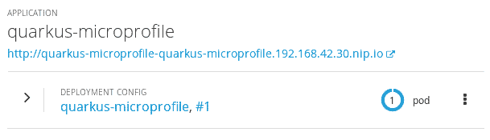

现在，检查您项目的部署配置并选择编辑健康检查：

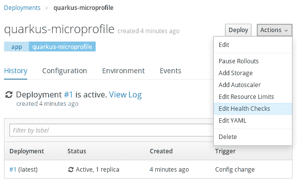

在健康检查 UI 中，您可以选择要添加哪个健康检查：

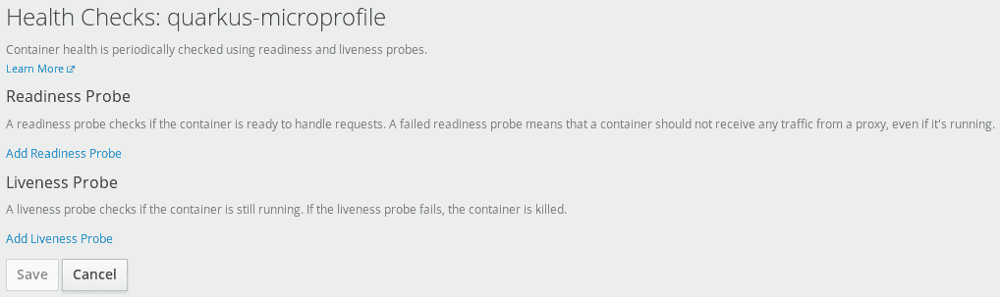

让我们从就绪性探针开始。通过选择它，您将被带到以下用户界面：

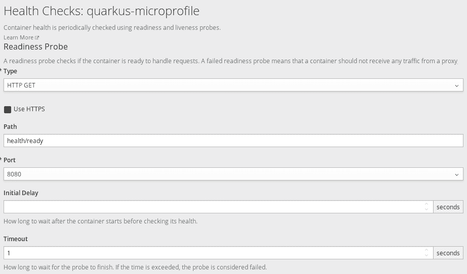

要选择的键参数是路径，它应该匹配我们的 MicroProfile 就绪性 URI（`health/ready`）。除此之外，您还可以配置以下属性：

+   `initialDelaySeconds`：容器启动后，在启动存活性或就绪性探针之前经过的秒数。

+   `timeoutSeconds`：探针超时的秒数。默认为 1 秒。最小值为`1`。

现在，让我们配置存活性探针：

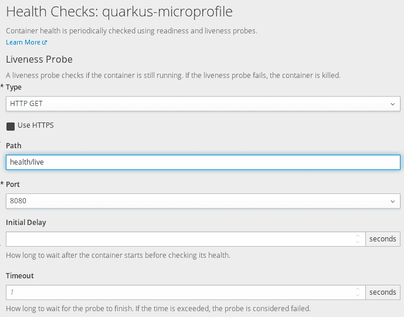

除了路径，它将是`health/live`之外，我们可以保留其他默认值。按原样保存您的更改。现在，让我们尝试破坏一些东西。例如，我们将在应用程序运行所在的 Pod 中创建一个锁文件。这将立即触发就绪性探针的失败。让我们使用以下命令从 shell 中检查 Pod 列表：

```java
$ oc get pods
```

返回的输出如下：

```java
NAME                           READY     STATUS      RESTARTS   AGE
quarkus-microprofile-1-build   0/1       Completed   0          20m
quarkus-microprofile-1-rxp4r   1/1       Running     0          20m
```

好的，我们现在将对这个正在运行的 Pod 运行一个远程 shell：

```java
$ oc rsh quarkus-microprofile-1-rxp4r
```

我们已经进入。现在，创建一个名为`/tmp/tmp.lck`的文件

```java
sh-4.4$ touch /tmp/tmp.lck
```

在几秒钟内（取决于初始延迟设置），您的 Pod 将不再可用。您可以从概览面板中看到这一点：


这个变化也将反映在系统事件中，这些事件可以通过`oc get events`命令捕获，如下所示：

```java
$ oc get events
quarkus-microprofile-3-mzl6f.15b54cfc42ddb728    Pod                     spec.containers{quarkus-microprofile}    Warning   Unhealthy kubelet, localhost 
Readiness probe failed: HTTP probe failed with statuscode: 503
```

最后，值得一提的是，我们的应用程序还包括一个存活检查，该检查验证可用内存量是否大于某个特定阈值。无论你是否达到了阈值，存活探测都取决于 MiniShift 启动时允许的内存量。关于 OpenShift 应用程序内存大小的深入探讨将超出本书的范围，但通过查看官方文档了解更多信息是值得的：[`docs.openshift.com/container-platform/3.9/dev_guide/application_memory_sizing.html`](https://docs.okd.io/latest/dev_guide/application_memory_sizing.html)。

维护应用程序的状态，使其保持健康是设计应用程序时需要考虑的关键要素。另一方面，使你的服务能够对故障或性能退化做出反应同样重要。不过，别担心——下一节将教你如何使用 MicroProfile 容错 API 来处理故障。

# Eclipse MicroProfile 容错 API

**容错**规范是一个基本的 API，可以通过支持一组可以提高应用程序弹性的策略来处理你的微服务的不可用性。以下可用的容错策略有：

+   **超时**：为服务调用的执行定义超时时间

+   **回退**：在发生故障时提供应急解决方案

+   **重试**：允许你根据标准重试执行

+   **隔离舱**：在系统其余部分仍能工作的情况下隔离部分服务故障

+   **断路器**：定义了自动快速失败的准则，以防止系统因过载而退化

+   **异步**：允许我们异步调用操作

让我们通过使用`Chapter06/fault-tolerance`示例来实际看看这些概念。首先，为了使用容错扩展，我们在`pom.xml`文件中包含了以下依赖项：

```java
<dependency>
  <groupId>io.quarkus</groupId>
  <artifactId>io.quarkus:quarkus-smallrye-fault-tolerance</artifactId>
</dependency>
```

让我们从超时、回退和重试策略开始，这些策略通常一起使用，因为它们相互补充。

# 使用超时、回退和重试创建具有弹性的服务

简而言之，`@org.eclipse.microprofile.faulttolerance.Timeout`注解可以用来指定方法返回响应允许的最大时间（以毫秒为单位）。以下是一个在 250 毫秒后超时的`findAll`方法示例：

```java
@Timeout(250)
public List<Customer> findAll() {

    randomSleep();
    return entityManager.createNamedQuery("Customers.findAll", Customer.class)
            .getResultList();
}

private void randomSleep() {
    try {
        Thread.sleep(new Random().nextInt(400));
    } catch (java.lang.InterruptedException e) {
        e.printStackTrace();
    }

}
```

由查找方法触发的随机睡眠可以用来允许一些偶尔的执行失败。

为了减轻超时或其他失败，你可以用`@Fallback`策略装饰你的方法，这样你就可以在失败的情况下指定一个替代执行路径：

```java
@Timeout(250)
@Fallback(fallbackMethod = "findAllStatic")
public List<Customer> findAll() {

    randomSleep();
    return entityManager.createNamedQuery("Customers.findAll", 
    Customer.class)
            .getResultList();

}
private List<Customer> findAllStatic() {
    LOGGER.info("Building Static List of Customers");
    return buildStaticList();

}
```

在此示例中，如果`findAll`方法中发生任何故障，我们将执行重定向到`findAllStatic`方法。`findAllStatic`方法将返回一个静态的`Customer`对象列表（请查看本章的源代码示例以查看此实现的实现）。

# 将重试策略应用于你的故障

有时，你的方法执行中的故障是由临时问题，如网络拥塞引起的。如果我们有信心问题可以按照我们的业务 SLA 解决，我们可以包含一个`@Retry`注解，以允许我们重新执行失败的特定次数。

例如，通过添加`@Retry(maxRetries = 3)`注解，我们将在使用静态客户列表之前尝试从数据库加载数据三次：

```java
@Timeout(250)
@Fallback(fallbackMethod = "findAllStatic")
@Retry(maxRetries = 3)
public List<Customer> findAll() {

    randomSleep();
    return entityManager.createNamedQuery("Customers.findAll", 
     Customer.class)
            .getResultList();

}
```

值得注意的是，`@Retry`注解可以配置为仅重试特定异常的子集。这可以在以下示例中看到，其中我们使用`@Retry`覆盖`RuntimeException`和`TimeoutException`：

```java
@Retry(retryOn = {RuntimeException.class, TimeoutException.class}, maxRetries = 3)
```

现在，让我们学习如何将名为**断路器**的容错模式应用于我们的服务。

# 断路器

**断路器**是创建弹性服务的一个核心模式。它可以用来通过立即拒绝新请求来防止重复异常。MicroProfile 容错 API 使用`@CircuitBreaker`注解来控制传入请求。软件断路器与电路断路器类似，因为它具有以下状态：

+   **关闭状态**：闭合电路表示一个完全功能且可供其客户端使用的系统。

+   **半开电路**：当检测到某些故障时，状态可以变为半开。在此状态下，它会检查失败的组件是否已恢复。如果是，则关闭电路。否则，它将移动到开路状态。

+   **开路状态**：开路状态意味着服务暂时不可用。经过检查后，你可以验证是否可以安全地切换到半开路状态。

这里有一个示例：

```java
@CircuitBreaker(successThreshold = 5, requestVolumeThreshold = 4, failureRatio=0.75,
        delay = 1000)
public List<Orders> findAll(Long customerId) {

    possibleFailure();
    return  (List<Orders>) 
    entityManager.createNamedQuery("Orders.findAll")
            .setParameter("customerId", customerId)
            .getResultList();
}
private void possibleFailure() {
    if (new Random().nextFloat() < 0.5f) {
    throw new RuntimeException("Resource failure.");
}
```

在前面的示例中，`@CircuitBreaker`策略应用于`OrderRepository`类的`findAll`方法。因此，如果在最后四次调用中，有 75%失败，则电路将过渡到开路状态。电路将保持开路状态 1,000 毫秒。当电路处于开路状态时，将抛出`CircuitBreakerOpenException`而不是实际调用方法。

请注意，与重试方法一样，`@CircuitBreaker`也允许我们通过`failon`注解参数定义失败标准。这可以在以下示例中看到：

```java
@CircuitBreaker(failOn={RuntimeException.class}, successThreshold = 5, requestVolumeThreshold = 4, failureRatio=0.75, delay = 1000)
```

在前面的示例中，如果在方法中抛出`RuntimeException`，则`CircuitBreaker`将其计为一个失败；否则，计为一个成功。

现在我们已经了解了核心容错 API 的背景，让我们学习如何通过 bulkhead 和异步模式进一步增强我们应用程序的健壮性。

# 使用异步和 Bulkhead 策略

异步编程对于企业开发者来说并不是一种新模式。然而，当与 `BulkHead` 策略结合使用时，你可以为你的微服务实现一个强大的容错模式。简而言之，如果你用 `@Asynchronous` 注解一个方法，它将在一个单独的线程上异步执行。

在以下示例中，我们在 `createOrder` 方法中执行一些逻辑，通过 `writeSomeLogging` 方法在单独的线程中生成一些调试信息，该方法返回一个 `CompletableFuture` 实例：

```java
public void createOrder(Orders order, Customer c) {
    order.setCustomer(c);
    entityManager.persist(order);
    writeSomeLogging(order.getItem());

}
@Asynchronous
private Future writeSomeLogging(String item) {
        LOGGER.info("New Customer order at: "+new java.util.Date());
        LOGGER.info("Item: {}", item);
        return CompletableFuture.completedFuture("ok");
}
```

当与 `@Bulkhead` 一起使用 `@Asynchronous` 时，将采用线程池隔离方法。线程池方法允许我们配置最大并发请求以及一定的队列大小，就像一个信号量。以下是更新后的示例，其中包含了 `@Bulkhead` 策略：

```java
// maximum 5 concurrent requests allowed, maximum 10 requests allowed in the waiting queue
@Asynchronous
@Bulkhead(value = 5, waitingTaskQueue = 10)
private Future writeSomeLogging(String item) {
        LOGGER.info("New Customer order at: "+new java.util.Date());
        LOGGER.info("Item: {}", item);
        return CompletableFuture.completedFuture("ok");
}
```

这是对 MicroProfile API 中可用的容错策略的快速浏览。让我们继续到下一节，该节是关于捕获服务指标。

# Eclipse MicroProfile Metrics API

MicroProfile Metrics 规范为我们提供了一种统一的方式，将您的服务监控数据导出到管理代理。这有助于我们执行对一些关键统计指标的前瞻性检查，例如服务被请求的次数和速率、每次请求的持续时间等等。

让我们开始编码。在这里，我们将关注 `Chapter06/metrics` 示例。首先，为了使用指标扩展，我们在 `pom.xml` 文件中包含了以下依赖项：

```java
<dependency>
  <groupId>io.quarkus</groupId>
  <artifactId>io.quarkus:quarkus-smallrye-metrics</artifactId>
</dependency>
```

现在，我们将概述添加到我们的 REST 服务之上的指标注解。让我们从 `@Counted` 注解开始，它跟踪请求被调用的次数：

```java
@GET
@Counted(description = "Customer list count", absolute = true)
public List<Customer> getAll() {
    return customerRepository.findAll();
}
```

在 `@Counted` 注解中，我们提供了一个描述并设置了 `absolute` 标志为 `true`，这意味着类的包名将不会添加到指标名称前。

让我们编译并运行应用程序：

```java
$ mvn compile quarkus:dev
```

现在，让我们重新加载主页，这将触发客户列表。接下来，我们将收集一些指标。我们的指标有两个入口点：

+   `http://localhost:8080/metrics`：此端点将返回所有指标，包括应用程序运行时的系统指标。

+   `http://localhost:8080/metrics/application`：此端点将仅返回已部署的应用程序发出的指标。

我们将选择后面的选项，如下所示：

```java
$ curl http:/localhost:8080/metrics/applications
```

由于我们已经加载了主页两次，预期的输出应该如下所示：

```java
 # HELP application:get_all Customer list count
 # TYPE application:get_all counter
 application:get_all 2.0
```

下一个注解是 `@Timed` 注解，它跟踪事件的持续时间。让我们将其应用到 `getAll` 方法上：

```java
@Timed(name = "timerCheck", description = "How much time it takes to load the Customer list", unit = MetricUnits.MILLISECONDS)
public List<Customer> getAll() {
    return customerRepository.findAll();
}
```

你应该能够检索关于前述方法调用频率的详细报告（包括每秒、每分钟、每 5 分钟的速率以及统计分位数指标）。为了简洁起见，以下是其中的一段摘录：

```java
# TYPE application:com_packt_quarkus_chapter6_customer_endpoint_timer_check_rate_per_second 
application:com_packt_quarkus_chapter6_customer_endpoint_timer_check_rate_per_second 0.04980015712212517
# TYPE application:com_packt_quarkus_chapter6_customer_endpoint_timer_check_one_min_rate_per_second 
application:com_packt_quarkus_chapter6_customer_endpoint_timer_check_one_min_rate_per_second 0.09447331054820299
# TYPE application:com_packt_quarkus_chapter6_customer_endpoint_timer_check_five_min_rate_per_second 
application:com_packt_quarkus_chapter6_customer_endpoint_timer_check_five_min_rate_per_second 0.17214159528501158

. . . .
application:com_packt_quarkus_chapter6_customer_endpoint_timer_check_seconds{quantile="0.999"} 0.004191615
```

另一方面，如果你只需要一个记录单个数据单元的基本度量，你可以使用`@Gauge`注解：

```java
@Gauge(name = "peakOfOrders", unit = MetricUnits.NONE, description = "Highest number of orders")
public Number highestNumberOfOrders() {
    return orderRepository.countAll();
}
```

在两个请求落在前面的方法上之后，Gauge 度量将显示以下度量：

```java
# HELP application:com_packt_quarkus_chapter6_order_endpoint_peak_of_orders Highest number of orders
# TYPE application:com_packt_quarkus_chapter6_order_endpoint_peak_of_orders gauge
application:com_packt_quarkus_chapter6_order_endpoint_peak_of_orders 2.0
```

在对 MicroProfile 度量进行快速介绍之后，让我们学习如何使用 OpenAPI 和 Swagger 来记录我们的端点资源。

# 配置 OpenAPI 和 Swagger UI

OpenAPI 规范旨在提供一组 Java 接口和编程模型，可以从 JAX-RS 服务中原生生成 OpenAPI v3 文档。Quarkus 中的默认 OpenAPI 实现为所有通过`/openapi`端点暴露的服务提供开箱即用的标准文档。

尽管如此，你可以通过使用特定的注解进一步增强 JAX-RS 服务，以提供更多关于端点、其参数和响应的见解。接下来，我们将关注`Chapter06/openapi-swagger`示例的代码。正如你可以从其配置中检查到的，我们向项目中添加了以下扩展：

```java
<dependency>
   <groupId>io.quarkus</groupId>
   <artifactId>quarkus-smallrye-openapi</artifactId>
 </dependency>
```

由于我们项目中有几个可用的 REST 端点，我们可以在`http://localhost:8080/openapi`检查生成的 OpenAPI 文档。以下是我们的客户服务应用的（截断）输出：

```java
$ curl http://localhost:8080/openapi
 ---
 openapi: 3.0.1
 info:
 title: Generated API
 version: "1.0"
 paths:
 /customers:
 get:
 responses:
 200:
 description: OK
 content:
 application/json:
 schema:
 type: array
 items:
 type: object
 properties:
 id:
 format: int64
 type: integer
 name:
 type: string
 orders:
 type: array
 items:
 type: object
 properties:
 id:
 format: int64
 type: integer
 item:
 type: string
 price:
 format: int64
 type: integer
 surname:
 type: string
```

如你所见，我们付出了最小的努力就生成了一份描述我们服务功能的 JSON 文档，而不需要直接访问底层源代码或任何其他文档。

除了这个之外，OpenAPI 可以用作构建如**Swagger**这样的强大 UI 的基础，Swagger 是一个可视化并交互 API 的出色工具。它的 UI 是自动从你的 OpenAPI 规范生成的。

为了开始使用 Swagger，你只需指向`http://localhost:8080/swagger-ui/`。这样做后，你将到达 Swagger 主页：

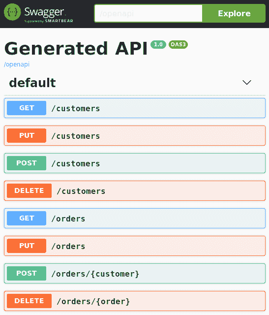

从那里，你可以轻松地通过展开并点击“尝试一下”按钮测试任何可用的操作：

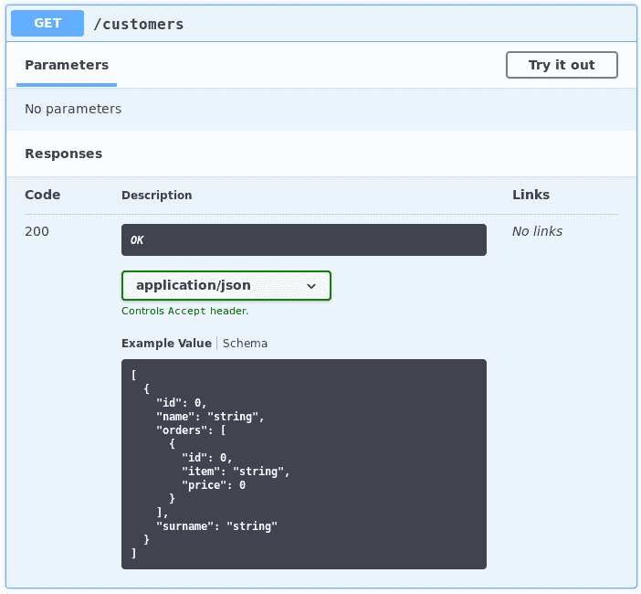

将生成默认的响应体。根据你的需求进行调整，然后点击执行。结果，你将在响应体文本区域看到操作返回的值（如果有）：

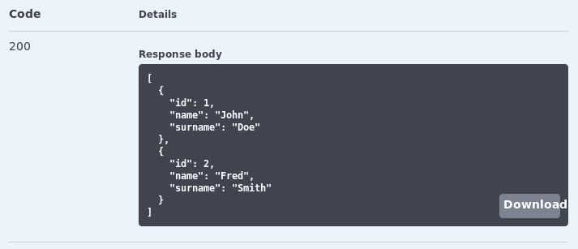

可选地，你可以点击下载按钮将响应保存到本地。

# 自定义 OpenAPI 的输出

根据 OpenAPI 规范([`swagger.io/specification/`](https://swagger.io/specification/))，可以自定义由`/openapi` Servlet 返回的对象的完整模式。这可以通过向你的端点类和方法添加特定的注解来实现。尽管这些注解都不是强制的，但我们将提到一些可以改进你的 OpenAPI 模式可读性的常见注解。

例如，可以使用`@org.eclipse.microprofile.openapi.annotations.tags.Tag`注解作为限定符来描述与端点相关的特定操作组。此注解可以应用于类级别。为了描述单个资源方法，可以使用`org.eclipse.microprofile.openapi.annotations.Operation`标签，该标签可以应用于方法级别。然后，可以使用`org.eclipse.microprofile.openapi.annotations.parameters.Parameter`标签包含操作参数的描述。最后，`org.eclipse.microprofile.openapi.annotations.responses.APIResponse`标签描述了 API 操作的单一响应。您可以将多个`APIResponse`注解附加到单个方法上，以控制每个响应代码的响应。

以下示例展示了在实际中应用于`CustomerEndpoint`类的自定义设置：

```java
@Tag(name = "OpenAPI Example", description = "Quarkus CRUD Example")
public class CustomerEndpoint {

    @Inject CustomerRepository customerRepository;

 @Operation(operationId = "all", description = "Getting All 
     customers")
 @APIResponse(responseCode = "200", description = "Successful 
     response.")
    @GET
    public List<Customer> getAll() {
        return customerRepository.findAll();
    }

    @POST
    public Response create( @Parameter(description = "The new 
     customer.", required = true) Customer customer) {

        customerRepository.createCustomer(customer);
        return Response.status(201).build();
    }

    @PUT
    public Response update(@Parameter(description = "The customer to 
     update.", required = true) Customer customer) {
        customerRepository.updateCustomer(customer);
        return Response.status(204).build();
    }
    @DELETE
    public Response delete(@Parameter(description = "The customer to 
     delete.", required = true) @QueryParam("id") Long customerId) {
        customerRepository.deleteCustomer(customerId);
        return Response.status(204).build();
    }

}
```

为了简洁起见，我们仅使用 OpenAPI 注解标记了`CustomerEndpoint`服务。我们将更新`OrderEndpoint`服务的任务留给你，以便你可以验证你的新技能。

# Eclipse MicroProfile OpenTracing API

分布式跟踪在微服务时代扮演着关键角色，因为它允许您跟踪请求在不同服务之间的流动。为了实现微服务跟踪，我们可以对我们的服务进行配置，以便将消息记录到分布式跟踪服务器，该服务器可以收集、存储并以各种格式显示这些信息。

OpenTracing 规范没有指定哪个分布式系统负责收集跟踪数据，但广泛采用的全端到端开源解决方案是**Jaeger** ([`www.jaegertracing.io/`](https://www.jaegertracing.io/))，它完全实现了 OpenTracing 标准。

让我们通过切换到`Chapter06/opentracing`示例来查看 OpenTracing 的实际应用。首先，为了使用 opentracing 扩展，必须在您的项目中添加以下依赖项：

```java
<dependency>
  <groupId>io.quarkus</groupId>
  <artifactId>io.quarkus:quarkus-smallrye-opentracing</artifactId>
</dependency>
```

实际上，在添加此扩展时，将为您的应用程序提供一个`io.opentracing.Tracer`对象的实现。这意味着您所有的 HTTP 请求都将自动进行跟踪。

在配置方面，我们需要提供有关 Jaeger 端点的某些详细信息。这可以通过`application.properties`文件或使用环境变量来完成。以下展示了我们如何配置`application.properties`文件以向运行在本地主机并监听端口`14268`的 Jaeger 端点发送跟踪通知：

```java
quarkus.jaeger.service-name=quarkus-service
quarkus.jaeger.sampler-type=const
quarkus.jaeger.sampler-param=1
quarkus.jaeger.endpoint=http://localhost:14268/api/traces
```

在前面的配置中，我们还定义了服务名称（`quarkus-service`）和采样器类型。在采样器类型定义中，`"`总是对所有跟踪做出相同的决定。它要么采样所有跟踪（`sampler-param=1`），要么不采样任何跟踪（`sampler-param=2`）。

现在，我们可以启动 Jaeger 服务。最简单的方法是以 Docker 容器的方式运行它。以下命令将启动`jaegertracing/all-in-one`容器镜像，将 Docker 容器的 UDP/TCP 端口转发到 localhost：

```java
docker run -e COLLECTOR_ZIPKIN_HTTP_PORT=9411 -p 5775:5775/udp -p 6831:6831/udp -p 6832:6832/udp -p 5778:5778 -p 16686:16686 -p 14268:14268 -p 9411:9411 jaegertracing/all-in-one:latest
```

现在，我们可以开始使用我们的客户服务应用程序并执行一些操作。然后，我们可以登录到 Jaeger 控制台，它位于`http://localhost:16686`：

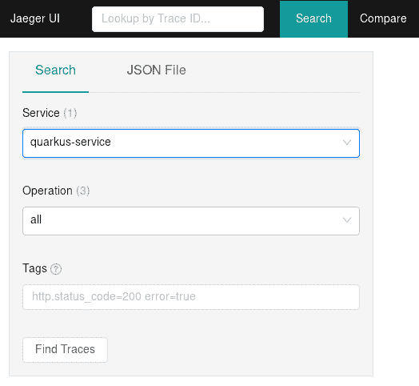

如前一张截图所示，在 Jaeger UI 的左侧面板中，你可以看到一个名为“服务”的组合框，其中包含可用于追踪的服务列表。你应该在其中看到默认的 jaeger 查询服务，它允许我们追踪查询服务。假设你已经配置了你的 Quarkus 应用程序以发出通知，你应该能够看到 quarkus-service 被列出。选择它，然后检查下一个组合框，即“操作”。这个组合框包含为该特定服务追踪的所有操作。以下是包含组合框的 UI 的部分视图：

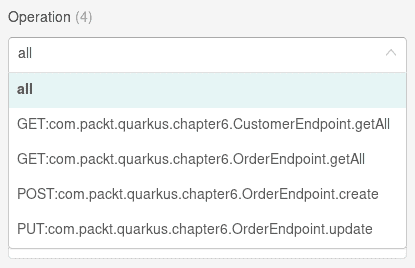

如果你选择全部，你应该能在屏幕上看到所有针对`quarkus-service`的所有 HTTP 请求的追踪，如下面的截图所示：

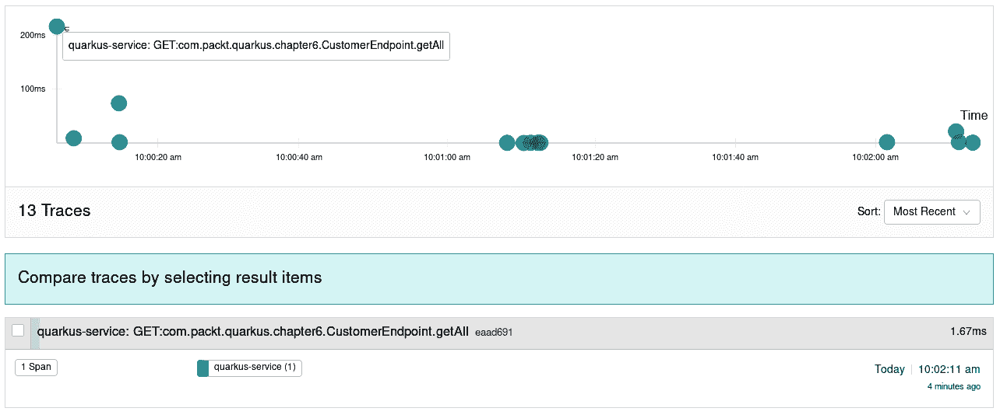

从那里，你可以通过点击它来选择收集有关单个追踪的更多详细信息。你将看到一个包含执行时间、远程调用者和报告的错误等详细信息的综合时间线：

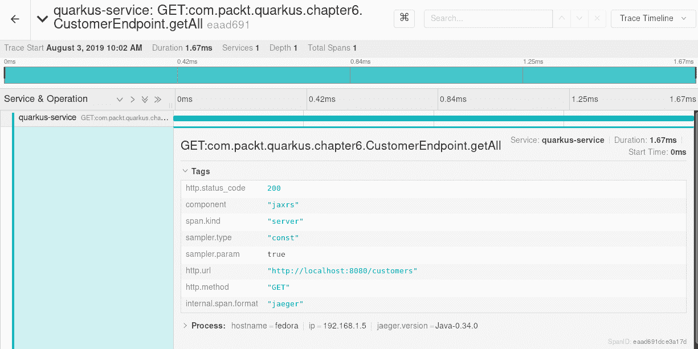

如果你想要下载并详细说明追踪文件，你也可以选择通过在右上角选择“追踪 JSON”将你的操作作为 JSON 进行追踪。

使用 Jaeger 追踪你的应用程序有很多可能性。如果你想在追踪微服务方面成为忍者，我们建议参考[`www.jaegertracing.io/`](https://www.jaegertracing.io/)。

# Eclipse MicroProfile REST 客户端 API

在本章中，我们将讨论的最后一个是 MicroProfile 的 REST 客户端扩展。这个 API 的目标是提供一个类型安全的方式来在微服务架构中调用 REST 服务。

不要混淆 MicroProfile REST 客户端 API 与 JAX-RS 客户端 API！它们实现了不同的标准：JAX-RS 客户端 API 是根据 JSR 370（[`www.jcp.org/en/jsr/detail?id=370`](https://www.jcp.org/en/jsr/detail?id=370)）实现的，而 MicroProfile REST 客户端 API 遵循此处指定的标准：[`microprofile.io/project/eclipse/microprofile-rest-client`](http://microprofile.io/project/eclipse/microprofile-rest-client)。

为了了解 REST 客户端 API，我们将将其作为`Chapter06/rest-client`应用程序的模板。这个项目不过是我们客户服务的简化版本，它只包含接口而不是服务实现。在配置方面，我们在`rest-client`项目的`pom.xml`文件中添加了以下依赖项：

```java
<dependency>
  <groupId>io.quarkus</groupId>
  <artifactId>quarkus-rest-client</artifactId>
</dependency>
```

接下来，我们将具体的服务实现替换为两个接口：一个名为`CustomerEndpointItf`，另一个名为`OrdersEndpointItf`。以下是`CustomerEndpointItf`：

```java
@RegisterRestClient
@Path("customers")
@Produces("application/json")
@Consumes("application/json")
public interface CustomerEndpointItf {
    @GET
    List<Customer> getAll();

    @POST
    Response create(Customer customer);

    @PUT
    Response update(Customer customer);

    @DELETE
    Response delete(Long customerId);
}
```

下面是`OrdersEndpointItf`：

```java
@RegisterRestClient
@Path("orders")
@Produces("application/json")
@Consumes("application/json")
public interface OrderEndpointItf {
    @GET
    List<Orders> getAll(@QueryParam("customerId") Long customerId);

    @POST
    @Path("/{customer}")
    Response create(Orders order, @PathParam("customer") Long 
     customerId);

    @PUT
    Response update(Orders order);

    @DELETE
    @Path("/{order}")
    Response delete(@PathParam("order") Long orderId);
}
```

注意`@org.eclipse.microprofile.rest.client.inject.RegisterRestClient`注解，它使得 REST 客户端可以通过`@org.eclipse.microprofile.rest.client.inject.RestClient`注解通过 CDI 进行注入。让我们在`CustomerEndpoint`中学习如何实际操作：

```java
public class CustomerEndpoint {

 @Inject @RestClient
 CustomerEndpointItf customer;

    @GET
    public List<Customer> getAll() {
        return customer.getAll();
    }
    @POST
    public Response create(Customer c) {
        return customer.create(c);
    }
    @PUT
    public Response update(Customer c) {
        return customer.update(c);
    }
    @DELETE
    public Response delete(Long customerId) {
        return customer.delete(customerId);
    }

}
```

如您所见，我们已经通过将执行委托给已注册为 REST 客户端的接口来替换了 REST 客户端实现。在此阶段，您可能会想知道 REST 客户端是如何知道远程端点的。这是一个好问题，答案包含在`application.properties`文件中：

```java
com.packt.quarkus.chapter6.restclient.CustomerEndpointItf/mp-rest/url=http://localhost:8080
com.packt.quarkus.chapter6.restclient.CustomerEndpointItf/mp-rest/scope=java.inject.Singleton
com.packt.quarkus.chapter6.restclient.OrderEndpointItf/mp-rest/url=http://localhost:8080
com.packt.quarkus.chapter6.restclient.OrderEndpointItf/mp-rest/scope=java.inject.Singleton
```

如您从第一行所见，所有对 REST 客户端接口的请求都将导致调用远程端点的基本 URL，该 URL 使用以下表达式进行限定：

```java
<Fully Qualified REST Client Interface>/mp-rest/url=<Remote REST base URL>
```

此外，REST 客户端接口的默认作用域已被配置为**单例**，这指示 Quarkus 一次性实例化单例，在注入期间将其引用传递给其他对象。其他支持的作用域值包括`@Dependent`、`@ApplicationScoped`和`@RequestScoped`，后者是默认值。有关不同作用域的更多详细信息，请参阅 CDI 规范（[`www.cdi-spec.org/`](http://www.cdi-spec.org/))。

为了运行测试，我们需要一个通过`http://localhost:8080/customers`端点返回`Customers`列表并通过`http://localhost:8080/orders`端点返回`Orders`列表的应用程序。为此，我们可以启动任何版本的实现上述端点的客户服务应用程序，如下所示：

```java
cd Chapter05/hibernate

$ mvn quarkus:dev
```

让我们回到我们的例子：

```java
cd Chapter06/rest-client
```

现在，我们可以使用以下命令运行 REST 客户端测试：

```java
$ mvn compile test
```

您应该在控制台中看到以下输出：

```java
[INFO] Tests run: 1, Failures: 0, Errors: 0, Skipped: 0, Time elapsed: 3.988 s - in com.packt.quarkus.chapter6.restclient.CustomerEndpointTest
 2019-08-04 19:29:43,592 INFO  [io.quarkus] (main) Quarkus stopped in 0.003s
[INFO] Results:
[INFO] Tests run: 1, Failures: 0, Errors: 0, Skipped: 0
```

这意味着您成功地对远程客户端点执行了完整的 CRUD 操作。作为证明，您应该能够在服务控制台中看到执行的 SQL 语句：

```java
    select
         orders0_.id as id1_1_0_,
         orders0_.customer_id as customer4_1_0_,
         orders0_.item as item2_1_0_,
         orders0_.price as price3_1_0_,
         customer1_.id as id1_0_1_,
         customer1_.name as name2_0_1_,
         customer1_.surname as surname3_0_1_
     from
         Orders orders0_
     left outer join
         Customer customer1_
             on orders0_.customer_id=customer1_.id
     where
         orders0_.id=?
```

请注意，前面的日志要求您已启用 SQL 跟踪，如第五章所述，*使用 Quarkus 管理数据持久性*。

# 摘要

在本章中，我们全面概述了 MicroProfile 规范以及如何将其与 Quarkus 应用程序集成。

我们从 MicroProfile API 的概述开始，讨论了它如何融入基于云的微服务整体图景。然后，我们介绍了主要的 MicroProfile 规范。

首先，我们探讨了 Health API 以及它如何报告你服务的存活状态和就绪状态。然后，我们介绍了容错 API，它可以用来设计具有弹性的服务。接下来，我们讨论了应用程序的遥测数据以及如何使用 Metrics API 收集这些数据。我们还涉及了另一个关键方面，即服务的文档化和跟踪请求流，这可以通过 OpenAPI 和跟踪规范来实现。最后，我们学习了如何创建 REST 客户端以简化我们与远程服务的交互。

到目前为止，你应该已经对如何设计一个完整的 Quarkus 企业应用程序有了清晰的认识，尽管我们还没有掌握一个关键方面：Quarkus 应用程序安全。这正是我们将在下一章中学习的内容。
