# 第十章：使用 Quarkus 进行响应式消息传递

在本章中，我们将学习 SmallRye 响应式消息传递的细节，它可以在 Quarkus 中用于实现 Eclipse MicroProfile 响应式消息传递规范。到本章结束时，您将拥有一个坚实的数据流应用程序开发模型，并了解如何连接到 Apache Kafka 和 ActiveMQ 等流平台。

在本章中，我们将涵盖以下主题：

+   开始使用响应式消息传递

+   使用 Apache Kafka 流式传输消息

+   使用 **高级消息队列协议**（**AMQP**）流式传输消息

# 技术要求

您可以在 GitHub 上的本章中找到项目的源代码：[`github.com/PacktPublishing/Hands-On-Cloud-Native-Applications-with-Java-and-Quarkus/tree/master/Chapter10`](https://github.com/PacktPublishing/Hands-On-Cloud-Native-Applications-with-Java-and-Quarkus/tree/master/Chapter10)。

# 开始使用响应式消息传递

响应式流是一个旨在提供跨异步边界交换数据流标准的倡议。同时，它保证接收方不会被强制缓冲任意数量的数据。

有几种可用的响应式流实现，我们已经学习了如何在 Vert.x 中实现响应式编程。在本章中，我们将使用 SmallRye 响应式消息传递实现来补充我们的知识，向您展示如何通过最小配置更改将其与 Apache Kafka 或 ActiveMQ 等流平台或消息代理集成。

为了熟悉 MicroProfile 响应式消息传递，我们需要了解一些关键概念。首先，MicroProfile 响应式消息传递是一个使用 CDI 容器来驱动消息流向特定通道的规范。

消息是一个基本接口，包含要流式传输的有效负载。`Message` 接口是参数化的，以便描述它包含的有效负载类型。此外，`Message` 接口还包含特定于用于消息交换的代理（例如 Kafka 或 AMQ）的属性和元数据。

另一方面，通道是一个字符串，指示使用哪个消息的源或目的地。有两种类型的通道：

+   内部通道位于应用程序内部，用于实现消息的多步骤处理过程。

+   远程通道通过连接器连接到远程代理（例如 Apache Kafka 或 AMQ）。

由于 MicroProfile 响应式消息传递完全受 CDI 模型管理，因此使用两个核心注解来指示方法是否是消息的生产者或消费者：

+   `@Incoming`**:** 该注解用于方法上，表示它从指定的通道消费消息。通道的名称作为属性添加到注解中。以下是一个示例：

```java
@Incoming("channel")
public void consume(Message<String> s) {   
  // Consume message here:
}
```

将此注解放置在方法上的效果是，每次向该通道发送消息时都会调用该方法。从用户的角度来看，它对传入消息是否来自本地 CDI 实例或远程代理是完全透明的。然而，您可能决定明确指出该方法消费特定类型的消息，例如 `KafkaMessage`（它继承自 `Message`）。以下是一个示例：

```java
@Incoming("channel")
public void consume(KafkaMessage<String> s) {     
   // Consume message here:
}
```

+   `@Outgoing`：这个注解表示一个方法向一个通道发布消息。在许多方面，通道的名称都在注解的属性中声明：

```java
@Outgoing("channel")
 public Message<String> produce() {
   // Produce and return a Message implementation
 }
```

在注解了 `@Outgoing` 的方法中，我们返回 `Message` 接口的具体实现。

注意，您只能为单个通道使用 `@Outgoing` 注解一个方法。如果您尝试在多个 `@Outgoing` 注解的方法中使用相同的通道，则在部署时将发出错误。

您还可以使用 `@Incoming` 和 `@Outgoing` 同时注解一个方法，使其表现得像一个**消息处理器**，它转换消息数据的内容：

```java
@Incoming("from")
@Outgoing("to")
public String translate(String text) {
   return MyTranslator.translate(text);
}
```

从前面的示例中，我们可以看到消息从 `@Outgoing` 流生产者流向 `@Incoming` 流消费者，并且反应式消息透明地连接了这两个端点。为了解耦 `Producer` 和 `Consumer` 消息，您可以使用 MicroProfile API 提供的连接器添加一个组件，如 Apache Kafka。在下一节中，我们将介绍使用 Apache Kafka 的第一个反应式消息示例。

# 使用 Apache Kafka 进行流消息

Apache Kafka ([`kafka.apache.org/`](https://kafka.apache.org/)) 是一个分布式数据流平台，可以用于以惊人的速度实时发布、订阅、存储和处理来自多个源的数据流。

Apache Kafka 可以集成到流数据管道中，这些管道在系统之间分配数据，也可以集成到消费这些数据的系统和应用程序中。由于 Apache Kafka 减少了数据共享的点对点集成需求，因此它非常适合需要高吞吐量和可扩展性的各种用例。

此外，一旦将 Kafka 与 Kubernetes 结合使用，您将获得 Kafka 的所有优势，以及 Kubernetes 的以下优势：

+   **可扩展性和高可用性**：您可以使用 Kubernetes 轻松地进行资源的扩展和缩减，这意味着您可以在保证 Kafka 集群高可用性的同时，自动确定 Apache Kafka 将与其他应用程序共享的资源池。

+   **可移植性**：通过在 Kubernetes 上运行 Kafka，您的 Kafka 节点集群可以跨越本地和公有、私有或混合云，甚至可以使用不同的操作系统。

要管理 Kafka 环境，你需要一个名为 **ZooKeeper** 的软件，它负责命名和配置数据，以便在分布式系统中提供灵活且强大的同步。ZooKeeper 控制着 Kafka 集群节点的状态，并跟踪 Kafka 主题、分区以及你需要的所有 Kafka 服务。虽然在本章中不会详细介绍 ZooKeeper 的管理细节，但值得一提的是它在 Kafka 管理员职位中的角色，因为你需要掌握它才能胜任这份工作。

为了展示 Apache Kafka 和 MicroProfile Streaming 在 Quarkus 上的强大组合，我们将设计一个简单的应用程序，该程序模拟实时更新的股票交易行情，通过购买和销售进行更新。准备好并开始营业吧！

# 组装我们的股票交易应用程序

让我们从我们的股票交易应用程序的架构开始。为了设置一个具有最小复杂度的应用程序，我们将创建以下通道：

+   一个绑定到 **"stock-quote"** 通道的 **流出** 生产者，其中包含股票订单的消息将被写入名为 ****"stocks"**** 的主题

+   一个绑定到 **"stocks"** 通道的 **流入** 消费者，它读取 **"stocks"** 主题中可用的消息

+   一个绑定到 **"in-memory-stream"** 通道的 **流出** 生产者，它将新的股票报价广播给所有内部可用的订阅者

+   一个绑定到 **"in-memory-stream"** 通道的 **流入** 消费者，它读取新的股票报价并将其作为 SSE 发送给客户端

以下图表描述了我们将用于示例的基本消息流：


示例应用程序可以在本书 GitHub 存储库的 `Chapter10/kafka` 文件夹中找到。我们建议在继续之前将项目导入到您的 IDE 中。

如您从本项目的 `pom.xml` 文件中看到的，我们已包含以下扩展，以便我们可以将消息流式传输到 Apache Kafka 服务器：

```java
<dependency>
   <groupId>io.quarkus</groupId>
   <artifactId>quarkus-smallrye-reactive-messaging-kafka</artifactId>
</dependency>
```

在我们深入代码之前，我们需要满足一些要求才能在容器中运行 Kafka。正如我们之前提到的，Kafka 需要 ZooKeeper 来管理其集群，因此我们需要启动这两个服务。在开发或测试环境中，你可以使用一个实用的解决方案，即 **Docker Compose**，这是一个用于管理和同步单个 YAML 格式配置文件中多个容器应用的工具。

Docker Compose 的安装细节可以在其文档页面上找到 ([`docs.docker.com/compose/install/`](https://docs.docker.com/compose/install/))，但对于 Linux 机器，你可以使用以下 shell 命令安装其稳定版本：

```java
sudo curl -L "https://github.com/docker/compose/releases/download/1.24.1/docker-compose-$(uname -s)-$(uname -m)" -o /usr/local/bin/docker-compose
```

完成后，请对 `docker-compose` 工具申请适当的权限：

```java
chmod a+x /usr/local/bin/docker-compose
```

现在，你可以按照以下方式验证已安装的版本：

```java
docker-compose --version
```

你应该看到以下输出：

```java
docker-compose version 1.24.1, build 1110ad01
```

现在我们完成了初步需求，是时候添加一些代码行了！

# 编码 bean 类

我们将添加的第一个类是 `QuoteGenerated`，它是一个 `ApplicationScoped` CDI bean，每两秒为一家公司生成随机报价。以下是这个类的代码：

```java
@ApplicationScoped
public class QuoteGenerator {

    private Random random = new Random();

 @Outgoing("stock-quote")
    public Flowable<String> generate() {
       return Flowable.interval(2, TimeUnit.SECONDS)
         .map(tick -> generateOrder(random.nextInt(2), 
          random.nextInt(5),   random.nextInt(100)));
 }

    private String generateOrder(int type, int company, int amount) {
       Jsonb jsonb = JsonbBuilder.create();
       Operation operation = new Operation(type, Company.values()
        [company], amount);
       return jsonb.toJson(operation);
    }
}
```

这个类通过 `"stock-quote"` 通道生成将被写入 Kafka 的消息。消息包含通过三个参数随机生成的股票订单：

+   订单类型（卖出/买入）

+   公司名称

+   卖出/买入的股票数量

到了最后，`generate` 方法将生成一个包含 JSON 字符串的消息，类似于以下内容：

```java
{"amount":32,"company":"Soylent","type":0}
```

为了更好地理解辅助组件，以下是 `Company` 枚举，其中包含以下公司集合：

```java
public enum Company {
        Acme, Globex, Umbrella, Soylent, Initech
}
```

我们还需要 `Operation` 类的核心部分，它是一个 Java POJO，用于存储每个股票订单的数据：

```java
public class Operation {

    public static final int SELL = 0;
    public static final int BUY = 1;

    private int amount;
    private Company company;
    private int type;

    public Operation(int type, Company company, int amount) {
        this.amount = amount;
        this.company = company;
        this.type = type;
    }
    // Getters/Setters method omitted for brevity
}
```

现在，简要介绍一下华尔街 101：每个股票订单将决定一家公司的报价变化。简单来说，通过卖出股票，公司的价格会下降，而买入订单会使股票需求增加，这意味着价格会上涨。卖出的/买入的股票数量最终将决定价格上升和下降的幅度。

以下 `QuoteConverter` 类将负责将股票订单转换为交易涉及的 `Company` 的新报价：

```java
@ApplicationScoped
public class QuoteConverter {
    HashMap<String,Double> quotes;

    private Random random = new Random();
    @PostConstruct
    public void init() {
        quotes = new HashMap<>();
        for (Company company: Company.values())
        quotes.put(company.name(), new Double(random.nextInt
        (100) + 50));

    }

 @Incoming("stocks")
 @Outgoing("in-memory-stream")
    @Broadcast
    public String newQuote(String quoteJson) {
        Jsonb jsonb = JsonbBuilder.create();

        Operation operation = jsonb.fromJson(quoteJson, 
         Operation.class);
        double currentQuote = 
         quotes.get(operation.getCompany().name());
        double newQuote;
        double change = (operation.getAmount() / 25);

        if (operation.getType() == Operation.BUY) {
              newQuote = currentQuote + change;
        }
        else  {
            newQuote = currentQuote - change;
        }
        if (newQuote < 0) newQuote = 0;

        quotes.replace(operation.getCompany().name(), newQuote);
        Quote quote = new Quote(operation.getCompany().name(), 
         newQuote);

        return jsonb.toJson(quote);

    }

}
```

这个类的 `init` 方法只是用一些随机值启动每个 `Company` 的初始报价。

`newQuote` 方法是我们交易系统的核心。通过读取 JSON 文件中包含的操作数据，使用基本算法生成一个新的报价：对于任何交易的 25 只股票，将对股票的价值产生一个点的影响。返回的 JSON 字符串封装了 `Quote` 类，通过方法顶部的 `@Broadcast` 注解，将消息广播到 `"in-memory-stream"` 通道的所有匹配订阅者。

为了完整性，我们还将包括 `Quote` Java 类，它将被作为 JSON 发送到客户端：

```java
public class Quote {
    String company;
    Double value;

    public Quote(String company, Double value) {
        this.company = company;
        this.value = value;
    }

   // Getters Setters method omitted for brevity
}
```

在我们的示例中，我们有一个 `"in-memory-stream"` 通道的以下订阅者，其中 `Quote` 被发布：

```java
@Path("/quotes")
public class QuoteEndpoint {

    @Inject
@Channel("in-memory-stream") 
    Publisher<String> quote;

    @GET
    @Path("/stream")
    @Produces(MediaType.SERVER_SENT_EVENTS)
    @SseElementType("text/plain")
    public Publisher<String> stream() {

        return quote;
    }
}
```

`QuoteEndpoint` 是我们的 REST 端点。在这个端点中，我们使用 `@Channel` 限定符将 `"in-memory-stream"` 通道注入到 bean 中。这正是反应式世界（由流控制）与命令式世界（CDI bean，按顺序执行代码）统一的地方。简单来说，这就是我们的 bean 能够检索由反应式消息管理的通道的地方。

所有的先前组件都需要一个经纪人，这是发布股票报价并读取它们的地方。以下是 `application.properties` 文件，它将这些组件组合在一起：

```java
#Kafka destination
mp.messaging.outgoing.stock-quote.connector=smallrye-kafka
mp.messaging.outgoing.stock-quote.topic=stocks
mp.messaging.outgoing.stock-quote.value.serializer=org.apache.kafka.common.serialization.StringSerializer

#Kafka source
mp.messaging.incoming.stocks.connector=smallrye-kafka
mp.messaging.incoming.stocks.topic=stocks
mp.messaging.incoming.stocks.value.deserializer=org.apache.kafka.common.serialization.StringDeserializer
```

第一个块与 Kafka 目标相关，在流式通信中通常称为**sink**，这是我们写入由`QuoteGenerator`产生的股票报价的地方。为了在类的节点之间复制数据，有必要序列化其内容。字节流是操作系统用于 I/O 的标准语言。在我们的情况下，由于数据是 JSON 格式，我们使用`StringSerializer`。

在第二个块中，我们配置了源主题和连接器，其中我们以 JSON 序列化流的形式读取股票报价。

现在，我们只需要添加一个能够捕获 SSE 并将其文本以格式化的表格形式显示的客户端应用程序。为了简洁起见，我们只添加收集 SSE 的核心 JavaScript 函数：

```java
<script>
    var source = new EventSource("/quotes/stream");
    source.onmessage = function (event) {
    var data = JSON.parse(event.data);
    var company = data['company'];
    var value = data['value'];
        document.getElementById(company).innerHTML = value;
    };
</script>
```

上述代码将被包含在`index.html`页面中，该页面位于本章的源代码中。让我们看看它的实际效果！在构建应用程序之前，使用以下命令启动 Kafka/ZooKeeper 容器：

```java
docker-compose up
```

Docker Compose 工具将搜索根目录中的`docker-compose.yaml`文件。在这里，我们已配置 Kafka 和 ZooKeeper 容器以便它们启动。成功的启动将在控制台底部产生以下输出：

```java
kafka_1      | [2019-10-20 07:05:36,276] INFO Kafka version : 2.1.0 (org.apache.kafka.common.utils.AppInfoParser)
 kafka_1      | [2019-10-20 07:05:36,277] INFO Kafka commitId : 809be928f1ae004e (org.apache.kafka.common.utils.AppInfoParser)
 kafka_1      | [2019-10-20 07:05:36,279] INFO [KafkaServer id=0] started (kafka.server.KafkaServer)
```

你可以通过执行`docker ps`命令来验证 Kafka 和 ZooKeeper 容器是否正在运行：

```java
docker ps --format '{{.Names}}'
```

上述命令将显示以下活动进程：

```java
kafka_kafka_1
kafka_zookeeper_1
```

现在，使用以下命令以常规方式启动应用程序：

```java
mvn install quarkus:dev
```

应用程序的欢迎页面（可在`http://localhost:8080`访问）将显示正在运行的股票报价行情，如下截图所示：

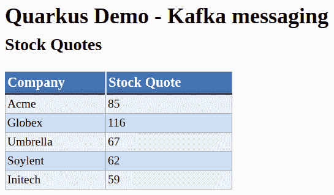

列表中的每家公司都将开始于一个 N/A 报价，直到对其执行随机操作。最后，你会看到前面的页面每两秒更新一次，这是我们配置在`QuoteGenerator`类中的。很酷，不是吗？

当你完成这个示例后，使用以下命令停止所有正在运行的容器：

```java
docker stop $(docker ps -a -q)
```

一旦`docker-compose`进程终止，上述命令将显示所有已停止的容器层列表：

```java
6a538738088f
f2d97de3520a
```

然后，通过再次执行`docker ps`命令来验证 Kafka 和 ZooKeeper 容器是否已停止：

```java
docker ps --format '{{.Names}}'
```

上述命令不应产生任何输出，这意味着没有挂起的 Docker 进程正在运行。

我们刚刚开始使用 Docker Compose 工具。现在，让我们继续并在 OpenShift 上部署完整的应用程序堆栈。

# 在云中向 Kafka 发送流消息

为了完成我们接下来的挑战，我们强烈建议使用最新的 OpenShift 4.X 版本。事实上，为了编排多个服务，如 Kafka 和 ZooKeeper，使用基于**Operator**概念的 OpenShift 4 版本要简单得多。Kubernetes Operator 是在集群上的 Pod 中运行的软件片段，它通过**自定义资源定义**（**CRDs**）引入新的对象类型。CRD 不过是 Kubernetes 中的一个扩展机制，它允许您为用户定义接口；例如，您可以定义一个用于 Kafka 服务器的 CRD，这为我们提供了一个更简单的方法来配置和在我们的集群中运行它。

此外，Operator 已经有一个公共目录([`operatorhub.io/`](https://operatorhub.io/))，您可以在其中找到现有的 Operator 或添加您自己的。

您可以通过访问[`www.openshift.com/trial/`](https://www.openshift.com/trial/)来评估 OpenShift 4。在那里，您可以找到评估 OpenShift 的几种选择，无论是在云中还是在您的机器上。在本章中，我们假设您已经完成了注册流程，并且 OpenShift 4 已经启动并运行。

对于下一个项目，请参考`Chapter10/kafka-openshift`目录，在那里您将找到为 OpenShift 配置的股票交易应用程序以及设置和配置 Kafka 集群的 YAML 文件。

# 在 OpenShift 上安装 Kafka

在 OpenShift 集群上安装和管理工作 Apache Kafka 集群的最简单方法是使用**Strimzi**项目([`strimzi.io/`](https://strimzi.io/))，该项目可以作为 OpenShift Operator 安装。

首先创建一个名为`kafka-demo`的新 OpenShift 项目。您可以从管理员控制台创建它，或者使用`oc`命令行工具，如下所示：

```java
oc new-project kafka-demo
```

返回的输出将确认项目命名空间已创建在您的虚拟地址中：

```java
Now using project "kafka-demo" on server "https://api.fmarchioni-openshift.rh.com:6443".
```

服务器名称将根据您在登录时选择的账户名称而有所不同。

我们建议从 OpenShift web-console 继续操作。从左侧管理员面板中选择 OperatorHub，如下截图所示：

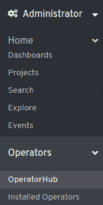

OperatorHub 目录将在主 OpenShift 仪表板中显示。选择**Strimzi** Operator，如下截图所示：

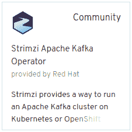

然后，在以下 UI 中，选择安装 Operator：

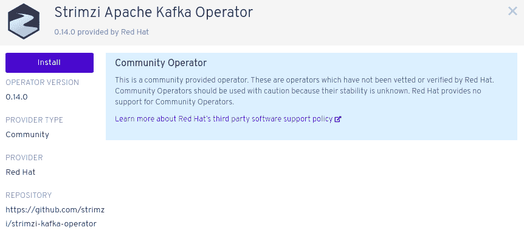

接下来，您将能够选择是否要在集群的所有可用命名空间中安装 Operator，或者只在特定的项目中安装。由于我们不会在其他项目中使用此 Operator，只需选中“集群上的特定命名空间”选项并选择您的项目。您的选择应如下所示：

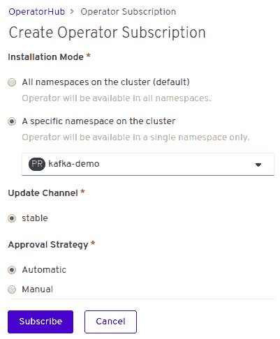

几秒钟后，在主面板中，您将收到通知，Operator 已安装，以及所有提供的 API：

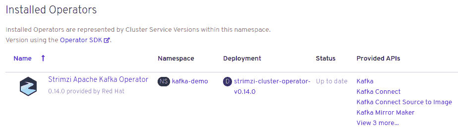

现在您已经有了 Strimzi Operator，安装 Kafka 集群将变得轻而易举！在`Chapter10/kafka-openshift/strimzi`文件夹中，您将找到以下文件：

+   `kafka-cluster-descriptor.yaml`：此文件包含基于 Strimzi Operator 的 Kafka 集群定义。

+   `kafka-topic-queue-descriptor.yaml`：此文件定义了一个资源（一个 Kafka 主题），我们需要在我们的 Kafka 集群中进行配置。

您可以使用`oc`命令安装它们两个。让我们从集群开始：

```java
oc create -f strimzi/kafka-cluster-descriptor.yaml
```

前一个命令的输出如下：

```java
kafka.kafka.strimzi.io/my-kafka created
```

现在，等待几秒钟，直到 Kafka 集群启动并运行。您可以使用以下命令检查当前项目中 Pod 的状态：

```java
oc get pods 
```

然后，等待直到所有 Pod 都在运行，如下所示：

```java
NAME                                                READY   STATUS    RESTARTS   AGE
my-kafka-entity-operator-58d546cf6c-dw85n           3/3     Running   0          5m50s
my-kafka-kafka-0                                    2/2     Running   1          6m27s
my-kafka-kafka-1                                    2/2     Running   1          6m27s
my-kafka-kafka-2                                    2/2     Running   0          6m27s
my-kafka-zookeeper-0                                2/2     Running   0          7m5s
my-kafka-zookeeper-1                                2/2     Running   0          7m5s
my-kafka-zookeeper-2                                2/2     Running   0          7m5s
strimzi-cluster-operator-v0.14.0-59744f8569-d7j44   1/1     Running   0          7m47s
```

一个成功的集群设置将包括以下组件：

+   三个 Kafka 集群节点处于运行状态

+   三个 ZooKeeper 集群节点也处于运行状态

集群的名称（`my-kafka`）已经在`kafka-cluster-descriptor.yaml`文件中指定，如下所示：

```java
apiVersion: kafka.strimzi.io/v1beta1
 kind: Kafka
 metadata:
   name: my-kafka
```

现在，让我们通过添加一个名为`stock`的队列来继续，该队列在`kafka-topic-queue-descriptor.yaml`文件夹中定义。您可以使用以下命令创建它：

```java
oc create -f strimzi/kafka-topic-queue-descriptor.yaml
```

您将看到以下输出：

```java
kafkatopic.kafka.strimzi.io/stocks created
```

如果您想对 Kafka 集群有一些了解，您可以检查主题是否可用。为此，使用`oc rsh`登录到任何可用的 Kafka 节点：

```java
oc rsh my-kafka-kafka-0
```

通过这样做，您将能够访问该容器的终端。从那里，执行以下命令：

```java
sh-4.2$ ./bin/kafka-topics.sh --list --zookeeper localhost:2181
```

控制台中最小的输出是`stocks`，这是我们的主题名称：

```java
stocks
```

要连接到 Kafka 集群，我们不会使用 IP 地址或 Pod 名称（这些名称在重启后会发生变化）。相反，我们将使用服务名称，这将让您通过别名访问集群。您可以使用以下命令检查可用的服务名称：

```java
oc get services -o=name
```

前一个命令的输出将仅限于`name`列。在我们的情况下，它将如下所示：

```java
service/my-kafka-kafka-bootstrap
service/my-kafka-kafka-brokers
service/my-kafka-zookeeper-client
service/my-kafka-zookeeper-nodes
```

我们感兴趣的服务名称是`my-kafka-kafka-bootstrap`，我们很快将其添加到我们的 Quarkus 项目中。

# 为原生云执行准备我们的项目

要在 OpenShift 上运行我们的项目，我们将对配置文件进行一些最小更改，以便我们可以访问我们刚刚确定的 Kafka 服务名称。在以下代码中，我们已突出显示必须应用到`application.properties`文件中的更改：

```java
mp.messaging.outgoing.stock-quote.connector=smallrye-kafka
mp.messaging.outgoing.stock-quote.topic=stocks
mp.messaging.outgoing.stock-quote.value.serializer=org.apache.kafka.common.serialization.StringSerializer
mp.messaging.outgoing.stock-quote.bootstrap.servers=my-kafka-kafka-bootstrap:9092

mp.messaging.incoming.stocks.connector=smallrye-kafka
mp.messaging.incoming.stocks.topic=stocks
mp.messaging.incoming.stocks.value.deserializer=org.apache.kafka.common.serialization.StringDeserializer
mp.messaging.incoming.stocks.bootstrap.servers=my-kafka-kafka-bootstrap:9092
```

如您所见，在先前的配置中，我们使用了`bootstrap.servers`属性来指定 Kafka 服务器列表（`host:port`）。

在配置中，您可以通过逗号分隔每个条目来添加多个服务器。

在本例的源代码中，你也会发现所有在消息流中序列化的 POJO 类都标注了 `@io.quarkus.runtime.annotations.RegisterForReflection`，如下所示：

```java
@RegisterForReflection
public class Quote   { . . . }
```

实际上，在构建原生可执行文件时，GraalVM 会做一些假设以删除所有未直接在代码中使用的类、方法和字段。通过反射使用到的元素不是调用树的一部分，因此它们是消除原生可执行文件时的候选元素。由于 JSON 库严重依赖反射来完成其工作，我们必须使用 `@RegisterForReflection` 注解明确告诉 GraalVM 不要排除它们。

这是我们为了将其发布到云端所做的微小更改。现在，使用以下命令构建和部署原生应用程序：

```java
#Build the native application
mvn clean package -Pnative -Dnative-image.docker-build=true

#Create a new build for it 
oc new-build --binary --name=quarkus-kafka -l app=quarkus-kafka

#Patch the Docker.native file 
oc patch bc/quarkus-kafka -p "{\"spec\":{\"strategy\":{\"dockerStrategy\":{\"dockerfilePath\":\"src/main/docker/Dockerfile.native\"}}}}"

#Deploy the application in the build
oc start-build quarkus-kafka --from-dir=. --follow

# To instantiate the image as new app
oc new-app --image-stream=quarkus-kafka:latest

# To create the route
oc expose service quarkus-kafka
```

请注意，你可以找到前面的脚本，即 `deploy-openshift.sh`，在 `Chapter10/kafka-openshift` 文件夹中。

一旦执行了前面的脚本，请使用以下命令验证 `quarkus-kafka` Pod 是否已启动并运行：

```java
oc get pods
```

输出将确认这一点：

```java
NAME                 READY   STATUS      RESTARTS    AGE
kafka-demo-1-deploy   0/1     Completed   0          30s
kafka-demo-1-p9qdr    1/1     Running     0          36s
```

你可以按照以下方式检查路由地址：

```java
oc get routes
```

路由将在 `HOST/PORT` 列输出：

```java
NAME            HOST/PORT                                                 PATH   SERVICES        PORT       TERMINATION   WILDCARD
quarkus-kafka   quarkus-kafka-kafka-demo.apps.fmarchio-qe.qe.rh-ocs.com          quarkus-kafka   8080-tcp                 None
```

如果你只想通过点击就能访问你的应用程序，请转到管理控制台并选择网络 | 路由。然后，点击路由位置，如下面的截图所示：

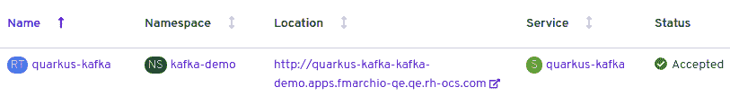

一旦配置的输出引言超时时间结束，你将在 OpenShift 上看到股票交易应用程序的实际运行情况：

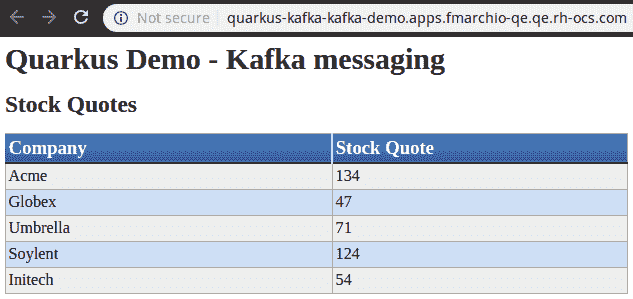

我们已经到达了 Apache Kafka 流的辉煌旅程的终点！在下一节中，我们将学习如何接近另一个候选解决方案，即基于 AMQP 协议的流消息。

# 使用 AMQP 进行消息流

如果你只是在多年的 Java 企业社区之后刚刚发现 Quarkus，你将已经熟悉消息代理，这些代理用于允许不同的 Java 应用程序使用 JMS 作为标准协议进行通信。尽管 JMS 是实现消息系统的健壮和成熟的解决方案，但它的主要局限性之一是它仅专注于 Java。在微服务世界中，使用不同的语言来构建整体系统架构相当常见，因此需要一个平台无关的解决方案。在这种情况下，AMQP 提供了一系列优势，使其成为在分布式系统中的微服务实现反应式流 API 的完美选择。

简而言之，以下是一些 AMQP 协议的主要功能：

+   它提供了一个平台无关的底层消息协议，允许跨多种语言和平台进行互操作性。

+   它是一个底层协议，数据作为字节流通过网络发送。

+   它在低级别字节流工作的情况下可以实现高性能。

+   它支持长连接消息和经典消息队列。

+   它支持如轮询（负载在服务器之间均匀分配）和存储转发（消息在发送方侧存储在持久存储中，然后转发到接收方侧）等分发模式。

+   它支持事务（跨消息目的地），以及使用通用标准（XA、X/Open、MS DTC）的分布式事务。

+   它支持使用 SASL 和 TLS 协议进行数据加密。

+   它允许我们通过元数据控制消息流。

+   它提供消息流控制以控制背压。

为了让我们的应用程序与 AMQP 交互，我们需要一个支持此协议的代理。Java 企业中常用的解决方案是**Apache Artemis ActiveMQ** ([`activemq.apache.org/components/artemis/`](https://activemq.apache.org/components/artemis/))，它也与 Java 企业**面向消息的中间件**（**MOM**）兼容。在下一节中，我们将学习如何在我们的股票报价应用程序中启动和配置它。

# 配置 AMQP 代理

为了尽可能快地启动我们的应用程序，我们将使用 Docker Compose 脚本。这将下载一个合适的消息代理版本，并设置一些必要的环境变量，以便我们可以访问代理。

只需使用以下命令启动`amqp`文件夹中的`docker-compose.yaml`文件：

```java
docker-compose up
```

如果启动成功，你应该会看到以下输出：

```java
artemis_1  | 2019-10-26 17:20:47,584 INFO  [org.apache.activemq.artemis] AMQ241001: HTTP Server started at http://0.0.0.0:8161
artemis_1  | 2019-10-26 17:20:47,584 INFO  [org.apache.activemq.artemis] AMQ241002: Artemis Jolokia REST API available at http://0.0.0.0:8161/console/jolokia
artemis_1  | 2019-10-26 17:20:47,584 INFO  [org.apache.activemq.artemis] AMQ241004: Artemis Console available at http://0.0.0.0:8161/console
```

你可以通过执行`docker ps`命令来验证 Kafka 和 ZooKeeper 容器是否正在运行：

```java
docker ps --format '{{.Names}}'
```

上述命令将显示以下活动进程：

```java
amqp_artemis_1
```

现在，让我们配置我们的应用程序，使其可以使用 ActiveMQ。你可以在本书 GitHub 仓库的`Chapter10/amqp`文件夹中找到更新后的应用程序。首先，我们需要将 Kafka 的响应式消息传递依赖项替换为 AMQP 响应式消息传递依赖项：

```java
<dependency>
      <groupId>io.quarkus</groupId>
      <artifactId>quarkus-smallrye-reactive-messaging-amqp</artifactId>
</dependency>
```

在应用配置方面，我们需要对`application.properties`文件进行一些修改。首先，我们需要包含在`docker-compose.yaml`中设置的用户名和密码（`quarkus/quarkus`）：

```java
amqp-username=quarkus
amqp-password=quarkus
```

然后，我们需要配置 AMQP 连接器，以便我们可以写入`stock-quote`队列，通过指定队列是持久的（例如，持久化到磁盘并在代理重启后存活）：

```java
 mp.messaging.outgoing.stock-quote.connector=smallrye-amqp
 mp.messaging.outgoing.stock-quote.address=stocks
 mp.messaging.outgoing.stock-quote.durable=true
```

相反，我们需要配置 AMQP 连接器，以便它可以读取`stocks`队列：

```java
 mp.messaging.incoming.stocks.connector=smallrye-amqp
 mp.messaging.incoming.stocks.durable=true  
```

现在，我们可以使用以下命令像往常一样引导应用程序：

```java
mvn install quarkus:dev
```

应用程序的欢迎页面（可在`http://localhost:8080`访问）将显示股票报价的实时行情，现在它使用 ActiveMQ 作为其代理。正如你所见，UI（仅标题）进行了最小调整，但它准确地掩盖了底下的变化：

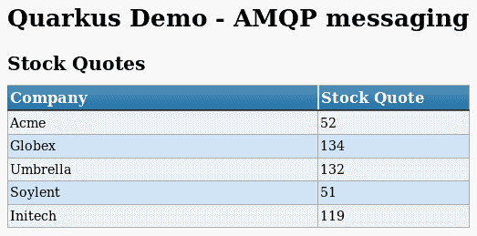

您可以通过登录到 AMQ 管理控制台了解更多关于此过程的信息，该控制台位于 `http://localhost:8161/console`。一旦您使用配置的凭据（`quarkus/quarkus`）登录，您可以在可用地址列表中检查是否已创建目标队列：

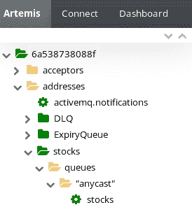

通过选择 `stocks` 目标，您可以在管理控制台的主面板中检查任何进一步的详细信息，如下面的截图所示：

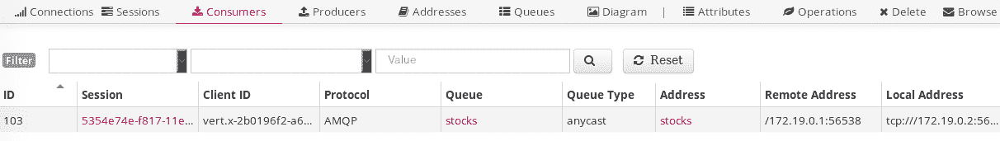

完成后，使用以下命令停止所有正在运行的容器：

```java
docker stop $(docker ps -a -q)
```

上述命令将显示已停止的所有容器层的列表，如下所示：

```java
6a538738088f
f2d97de3520a
```

然后，再次执行 `docker ps` 命令以验证 ActiveMQ 容器已被停止：

```java
docker ps --format '{{.Names}}'
```

上述命令不应产生任何输出。现在，让我们在云端测试相同的应用程序堆栈。

# 在云端向 AMQ 流式传输消息

我们将要做的最后一件事是在使用 AMQ 作为消息代理的同时将 Quarkus 应用程序部署到云端。为此，我们将之前测试过的 ActiveMQ Docker 镜像插入到 OpenShift 中（有关此镜像的更多详细信息可在 GitHub 上找到：[`github.com/vromero/activemq-artemis-docker`](https://github.com/vromero/activemq-artemis-docker))。

首先，创建一个名为 `amq-demo` 的新项目：

```java
oc new-project amq-demo
```

输出将确认项目命名空间已创建在您的虚拟地址中：

```java
Now using project "amq-demo" on server "https://api.fmarchioni-openshift.rh.com:6443"
```

接下来，使用以下命令将 AMQ 服务器部署到您的项目中，这将设置用户名和密码，以便您可以访问代理：

```java
oc new-app --name=artemis vromero/activemq-artemis:2.9.0-alpine -e ARTEMIS_USERNAME=quarkus -e ARTEMIS_PASSWORD=quarkus -e RESTORE_CONFIGURATION=true
```

注意 `RESTORE_CONFIGURATION=true` 环境变量。这是必需的，因为 OpenShift 自动挂载所有声明的空卷。由于此行为影响此镜像的 `/etc` 文件夹，而配置存储在该文件夹中，因此我们需要将 `RESTORE_CONFIGURATION` 环境变量设置为 `true`。

执行 `new-app` 命令后，将显示以下输出：

```java
--> Found container image 2fe0af6 (10 days old) from Docker Hub for "vromero/activemq-artemis:2.9.0-alpine"

* An image stream tag will be created as "artemis:2.9.0-alpine" that will track this image
* This image will be deployed in deployment config "artemis"
* Ports 1883/tcp, 5445/tcp, 5672/tcp, 61613/tcp, 61616/tcp, 8161/tcp, 9404/tcp will be load balanced by service "artemis"
* Other containers can access this service through the hostname "artemis"
* This image declares volumes and will default to use non-persistent, host-local storage.
You can add persistent volumes later by running 'oc set volume dc/artemis --add ...'
--> Creating resources ...
 imagestream.image.openshift.io "artemis" created
 deploymentconfig.apps.openshift.io "artemis" created
 service "artemis" created
--> Succes
```

您可以使用 `oc` 命令检查 Pods 的状态：

```java
oc get pods
```

以下输出确认 `artemis` Pod 正在运行状态：

```java
NAME               READY   STATUS      RESTARTS   AGE
artemis-1-deploy   0/1     Completed   0          80s
artemis-1-p9qdr    1/1     Running     0          76s
```

最后，让我们检查服务名称，它将是 `artemis`：

```java
oc get services -o name
```

确认返回的输出与这里显示的输出匹配：

```java
service/artemis
```

现在，让我们进行最后的终结操作：我们将部署位于 `Chapter10/amqp-openshift` 目录中的应用程序。在这个文件夹中，您将找到配置为在 AMQ 上流式传输消息的股票交易应用程序。

这里是更新后的 `application.properties` 文件，其中包含 AMQ 用户名和密码，以及服务运行的主机和端口：

```java
amqp-username=quarkus
amqp-password=quarkus

# Configure the AMQP connector to write to the `stocks`  address
mp.messaging.outgoing.stock-quote.connector=smallrye-amqp
mp.messaging.outgoing.stock-quote.address=stocks
mp.messaging.outgoing.stock-quote.durable=true
mp.messaging.outgoing.stock-quote.host=artemis
mp.messaging.outgoing.stock-quote.port=5672

# Configure the AMQP connector to read from the `stocks` queue
mp.messaging.incoming.stocks.connector=smallrye-amqp
mp.messaging.incoming.stocks.durable=true
mp.messaging.incoming.stocks.host=artemis
mp.messaging.incoming.stocks.port=5672
```

接下来，我们将部署与同一文件夹（`Chapter10/amqp-openshift`）中的应用程序到 OpenShift。为了方便，你可以简单地运行`deploy-openshift.sh`脚本，该脚本位于同一目录下。以下是脚本的内容，这应该对你来说相当熟悉：

```java
#Build native image of the project
mvn clean package -Pnative -Dnative-image.docker-build=true

# Create a new binary build
oc new-build --binary --name=quarkus-amq -l app=quarkus-amq

# Patch the native file 
oc patch bc/quarkus-amq -p "{\"spec\":{\"strategy\":{\"dockerStrategy\":{\"dockerfilePath\":\"src/main/docker/Dockerfile.native\"}}}}"

# Add project to the build
oc start-build quarkus-amq --from-dir=. --follow

# To instantiate the image
oc new-app --image-stream=quarkus-amq:latest

# To create the route
oc expose service quarkus-amq
```

然后，检查`quarkus-amq` Pod 是否处于运行状态：

```java
oc get pods
```

你将收到的输出确认了这一点：

```java
 NAME                   READY   STATUS      RESTARTS   AGE
 artemis-1-deploy       0/1     Completed   0          9m9s
 artemis-1-p9qdr        1/1     Running     0          9m5s
 quarkus-amq-1-deploy   0/1     Completed   0          14s
 quarkus-amq-1-zbvrl    1/1     Running     0          10s
```

现在，你可以通过点击路由地址来验证应用程序是否工作。只需在控制台中的“网络 | 路由”路径下进行操作：

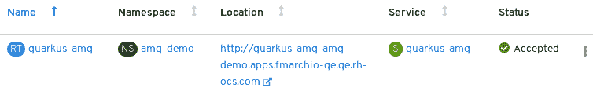

输出将几乎相同，只是路由名称会庆祝你在本书中的最后一次成就：


好了，朋友们！

# 摘要

在本章中，我们学习了如何使用 CDI Bean 根据反应式消息规范来产生、消费和处理消息。我们还学习了如何启动和配置 Apache Kafka 和 Active MQ 的代理，使其作为我们的 CDI Bean 的分布式流平台。为了将我们的新技能付诸实践，我们创建了一个示例股票交易应用程序，该应用程序最初以开发模式运行，然后作为原生镜像部署到 OpenShift 上。

现在，我们已经到达了本书的结尾，在这里我们了解了 Java 企业应用程序从单体到在云中运行的本地微服务的逐步更新故事。这是一次激动人心的旅程，确实设立了一个里程碑，但这并不是我们辛勤工作的结束——这只是这个故事的一个结束。
