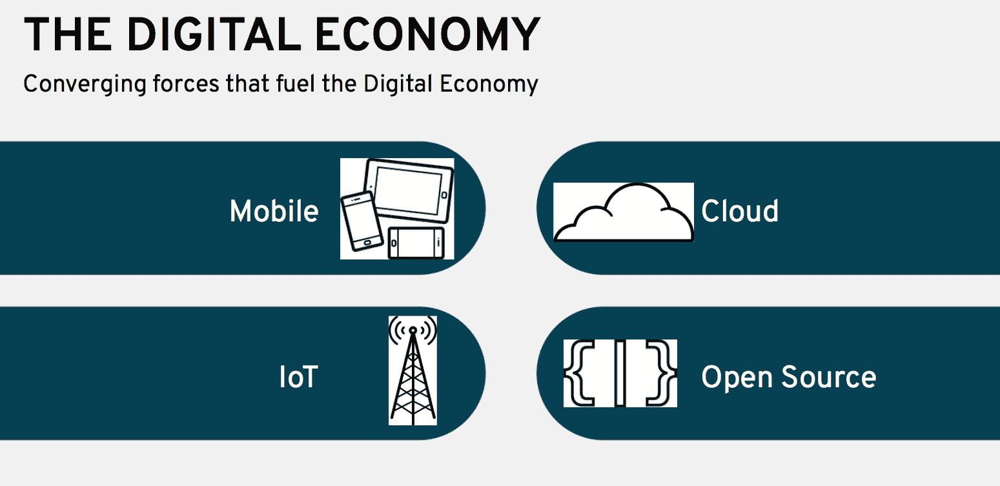

# 第一章：Eclipse MicroProfile 介绍

Eclipse MicroProfile 是一套用 Java 编写的微服务规范。这是一个由社区驱动的项目，市场上有很多实现。该项目于 2016 年 6 月首次宣布，继续开发一套适用于现代应用程序开发技术、架构和环境的 Java 微服务常见**应用程序编程接口**（**APIs**）。在本章中，您将了解 Eclipse MicroProfile 的起源和重要性。

本章将涵盖以下主题：

+   企业级 Java 微服务

+   推动数字经济的动力和多速度 IT 的需求

+   介绍 Eclipse MicroProfile

+   MicroProfile...

# 企业级 Java 微服务

应用程序开发不再包括使用运行在你最喜欢的操作系统上的单一高级编程语言。如今，有许多语言、规范、框架、专有和开源软件及工具、底层部署基础设施和开发方法，程序员需要学习这些来开发现代应用程序。在 IT 组织中，开发已经变得多语言化了，也就是说，根据特定项目的需求，会使用多种编程语言。在这个云计算、容器、微服务、反应式编程、12 因子应用程序、无服务器、MINI 服务、多语言环境和等等的时代，开发者现在可以选择合适的工具来完成他们的任务，使他们更加有效和高效。

随着 Java EE 最近更名为 Jakarta EE，作为 Eclipse 基金会的一部分，MicroProfile 将在企业级 Java 的未来中发挥非常重要的作用，因为它与 Jakarta EE 的协同效应以及它可能对其产生影响的潜在方式。

云计算和移动设备的到来，以及开源的加速和物联网（**IoT**）的兴起，催生了数字经济。虽然这为新的市场打开了大门，但也对企业和他们的 IT 组织提出了新的要求，现在要求他们不仅要支持和维护传统的工作负载，还要更快地交付新的应用程序。

许多技术和语言、架构和框架在组织内变得流行，试图应对这些新的需求。其中一个是微服务，特别是企业级 Java 微服务，因为 Java 仍然是 IT 公司中最受欢迎的语言之一。但是什么是企业级 Java 微服务呢？

企业级 Java 微服务具有以下特点：

+   它是用 Java 语言编写的。

+   它可以使用任何 Java 框架。

+   它可以使用任何 Java API。

+   它必须是企业级的；也就是说，要可靠、可用、可扩展、安全、健壮且性能优良。

+   它必须满足微服务架构的特征，如在 [`martinfowler.com/microservices/`](https://martinfowler.com/microservices/) 所列出的那样，具体如下：

    +   通过服务实现组件化

    +   围绕业务能力组织

    +   产品而非项目

    +   智能端点和哑管

    +   去中心化治理

    +   去中心化数据管理

    +   基础设施自动化

    +   设计容错

    +   进化式设计

# 推动数字经济发展的力量

术语**数字经济**和**数字化转型**描述了改变企业需求的四个不同力量的汇聚：移动、云、物联网和开源：

在互联网出现之前，组织需要实体店铺或电话线来进行业务。互联网的出现和可访问性为组织创造了一个**关键的类别形成时间**的机会。企业开始主要使用互联网作为一个店面或展示，以吸引人们到他们的实体店铺。它也被用于广告目的。

不久之后，企业...

# 多速 IT

尽可能快地实施和交付应用程序并不是一个新的要求。实际上，自从第一台计算机的发明以来，提高效率一直计算机科学家的心头大事。高级编程语言、封装、可重用性、继承、事件驱动设计、SOA、微服务、机器学习和人工智能，都是旨在更快地完成事情的概念。随着每一波新技术的出现，变速箱为软件的开发和交付方式的演变增加了新的速度要求。数字经济又为变速箱增加了一个高速档位。

企业需要适应数字经济的新的要求。他们不仅要创建、运行和支持传统风格的应用程序，还要支持符合数字经济新要求的应用程序。他们必须支持瀑布和 DevOps 流程、混合云基础设施以及 SOA 和微服务架构。

这给 IT 组织带来了许多挑战，这些组织的流程、人员和技术都是为了实现、交付和维护传统风格的应用程序而设计的。许多组织已经开始了他们的数字化转型之旅，或者正准备开始，以应对数字经济带来的挑战。这一旅程包括改变应用程序开发、交付、集成和维护的技术、框架、语言和过程。

无论你称之为双模 IT（[`www.gartner.com/it-glossary/bimodal`](https://www.gartner.com/it-glossary/bimodal)）还是业务技术战略（[`go.forrester.com/wp-content/uploads/Forrester-False-Promise-of-Bimodal-IT.pdf`](https://go.forrester.com/wp-content/uploads/Forrester-False-Promise-of-Bimodal-IT.pdf)），事实是 IT 需要比以往任何时候都更快地满足业务需求，无论是现有还是新应用程序。这意味着 IT 还需要加快现有应用程序的维护和交付，同时专门为新的应用程序采用敏捷方法论。然而，这并不意味着不再使用不同的开发流程、发布周期和支持时间线来处理现有应用程序与新应用程序，这实际上是 IT 的多速度特性。

# 介绍 Eclipse MicroProfile

Java EE 已经成为一个极其成功的平台。Java 社区流程（Java Community Process，JCP）在其近 20 年的历史中，一直是超过 20 个兼容实现的监护人，促成了一个 400 亿美元产业。然而，Oracle 对 Java EE 的管理（无论是否无意）阻碍了创新，尽管其他标准已经发展，但全球 Java 社区和所有主要企业的 CIO 们都渴望在企业内部有一个开放的 Java 标准。

在早期阶段，J2EE 从 J2EE 1.2 迅速发展到 J2EE 1.4，因为该平台需要解决企业的迫切需求。从 2006 年 5 月 Java EE 5 开始，节奏开始变慢...

# MicroProfile 价值主张

对于信任 Java EE 来运行其生产工作负载的客户，Eclipse MicroProfile 为客户提供了企业 Java 微服务的开源、中立规范。Eclipse MicroProfile 使客户能够通过提高敏捷性和可伸缩性、缩短上市时间、提高开发生产力、简化调试和维护以及持续集成和持续部署，更好地满足业务需求。

使用 Eclipse MicroProfile 的客户获得的好处与使用微服务的好处相同。总的来说，根据受人尊敬的软件开发者、作家和演讲者马丁·福勒的说法，微服务提供以下好处([`martinfowler.com/articles/microservice-trade-offs.html`](https://martinfowler.com/articles/microservice-trade-offs.html)):

+   **强模块边界**：微服务加强了模块化结构，这对于大型团队尤为重要。

+   **独立部署**：简单的服务更易于部署，由于它们是自主的，因此在出错时更不可能导致系统故障。

+   **技术多样性**：通过微服务，你可以混合多种语言、开发框架和数据存储技术。

除了微服务的通用优势外，Eclipse MicroProfile 还特别提供了以下优势：

+   **社区协作的优势**：Eclipse MicroProfile 是一个由社区运行的开源项目。没有单一的供应商控制或决定规格说明书的演变和成熟。

+   **实施选择的自由**：许多供应商已将 Eclipse MicroProfile 作为其软件堆栈的一部分实现，客户可以选择最适合其环境的任何实现。

+   **更快的演变**：由于 Eclipse MicroProfile 是一个创新项目，新的和改进的功能经常在时间盒发布的周期内交付。这使得开发人员和客户能够掌握这些功能，并尽早而不是稍后在他们的项目中利用更新。

+   **基于数十年的经验：**不仅规格说明书的主题专家们带来了丰富的经验、专业知识和技能，Eclipse MicroProfile 还利用了在 Java EE API 中经过市场检验和生产验证的功能，它在此基础上构建，为开发者提供了成熟度。

+   **熟悉企业 Java**：Eclipse MicroProfile 建立在熟悉的企业 Java 构造之上，使得企业 Java 开发者易于采用。

+   **无需重新培训**：您的现有企业 Java 开发人员会发现 Eclipse MicroProfile 是他们专业知识的自然进步。学习曲线很小甚至没有。他们将能够利用他们的技能。

+   **互操作性：**不同的 MicroProfile 实现是互操作的，每个实现都为用户提供自由选择一个或结合许多 MicroProfile 实现于应用程序中的能力。

+   **多种使用 API 的方式：**Eclipse MicroProfile API 提供了易于使用的接口，如基于 CDI、程序化、命令行和基于文件（配置 based）的接口。

+   **一套完整的工件：**每个 API 都包括一个**测试兼容性套件**（**TCK**）、Javadoc、可下载的 PDF 文档、API Maven 工件坐标、Git 标签和下载（规格说明书和源代码）。

+   每个 API 特有的许多其他优势。这些在本书的每个 Eclipse MicroProfile 子项目中讨论。

# 总结

在本章中，我们讨论了软件开发的新趋势，包括使用新方法（如微服务、容器、移动和物联网（IoT））的多元语言部署，这些新方法运行在本地和云上；以及在混合或多云环境中。这些趋势要求 Enterprise Java 在微服务世界中进行演变，这就是 MicroProfile 所解决的问题。推动数字经济的四大力量，即云、移动、IoT 和开源，导致了组织需要多速度 IT 部门，这是维护和演变现有应用程序以及利用新技术趋势开发新应用程序的必要条件...

# 问题

1.  企业级 Java 微服务是什么？

1.  推动数字经济的四大力量是什么？

1.  为什么 IT 组织必须以不同的速度开发和维护应用程序？多速度 IT 是什么？

1.  为什么 Java 和 Java EE 对组织仍然重要？

1.  是什么关键原因导致了 MicroProfile 的产生？

1.  哪些 API/规范是 MicroProfile 伞/平台发布的一部分？

1.  哪个版本的 MicroProfile 引入了第一次革命性的变化？

1.  为什么 MicroProfile 对组织有价值？
