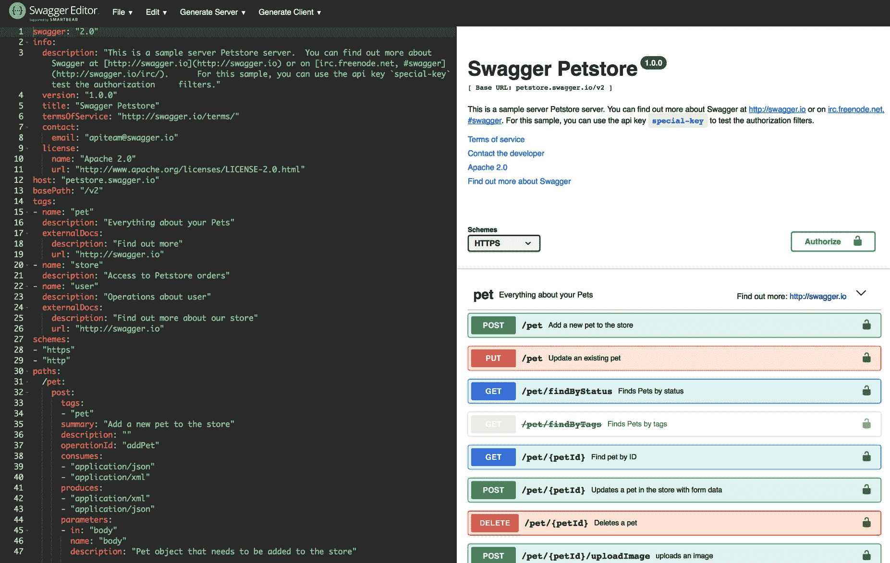

# 第七章：MicroProfile OpenAPI 和类型安全的 REST 客户端

Eclipse MicroProfile 为 Java 微服务提供了一系列丰富的规范。其中两个，Eclipse MicroProfile OpenAPI 和 Eclipse MicroProfile REST Client，分别帮助您微服务的 API 文档化，并为 REST 端点提供类型安全的调用 API。OpenAPI 简化了微服务端点的文档化，并使此元数据可供第三方开发者查阅。类型安全的 REST 客户端简化了对象到 HTTP 或 JSON 的编解码。

本章将涵盖以下主题：

+   每个这些规范提供的能力。

+   一些这些能力的简单代码示例

+   如何获取关于这些规范的更多信息

# MicroProfile OpenAPI 及其能力的介绍

推动数字经济的移动力量导致企业需要建立一个全渠道开发方法，以优化成本、提高效率和改善客户体验。这种方法的促进者是 API，这导致了 API 经济和 API 引导或 API 优先的开发实践等概念。此外，微服务架构已成为现代开发的架构选择。微服务之间的 API（即 RESTful）通信已被采用为事实上的标准，因为它与微服务的*智能端点和大管道*、*去中心化治理*和*去中心化数据管理*特征相契合。

然而，随着微服务数量的增加，微服务架构的管理可能会变得难以控制。然而，您可以通过 API 管理您的微服务。您可以将管理、安全、负载均衡和节流策略应用于面向您的微服务的 API。

Eclipse MicroProfile OpenAPI 为开发者提供 Java 接口，用于从他们的 Java RESTful Web Services (JAX-RS)应用程序生成 OpenAPI v3 文档。规范要求在根 URL `/openapi` 上提供一个完全处理的 OpenAPI 文档，作为 HTTP `GET`操作，如下所示：

```java
GET http://myHost:myPort/openapi
```

所需的协议是`http`。然而，规范的实现者强烈鼓励也支持`https`协议，以便安全地连接到 OpenAPI 端点。

OpenAPI 文档是从以下三个来源创建的。这三个来源（在本章后面的部分中介绍）如下：

+   通过处理应用程序中发现的 JAX-RS 注解（和可选的 OpenAPI 注解）生成。

+   通过提供一个实现`OasModelReader`的 Java 类，应用程序程序化地构建。

+   应用程序部署中包含的静态 OpenAPI 文档。

这三个来源（任意组合）结合产生一个 OpenAPI 文档，该文档可以通过提供实现`OasFilter`接口的 Java 类进行过滤，然后在前面的`/openapi`端点提供服务。

# 配置

MicroProfile OpenAPI 规范利用 MicroProfile 配置规范来配置其参数和值。例如，用于注入配置值，MicroProfile OpenAPI 可以使用默认和自定义 ConfigSources。

关于 ConfigSources 的更多信息，你可以访问[`github.com/eclipse/microprofile-config/blob/master/spec/src/main/asciidoc/configsources.asciidoc`](https://github.com/eclipse/microprofile-config/blob/master/spec/src/main/asciidoc/configsources.asciidoc)。

有很多可配置的项目。以下表格包含它们的子集：

| **配置项** | **描述** |
| --- | --- |
| `mp.openapi.scan.disable` | 禁用注解扫描的配置属性。默认值是`false`。 |
| `mp.openapi.servers` | 指定全局服务器列表的配置属性，用于... |

# 生成 OpenAPI 文档

如前所述，MicroProfile OpenAPI 规范要求从三个来源的组合生成 OpenAPI 文档。

然后你有几个选择：

+   使用 MicroProfile OpenAPI 注解扩展由 JAX-RS 注解生成的 OpenAPI 文档。

+   利用从`/openapi`的初始输出，你可以将其作为参考开始记录你的 API。在这种情况下，你可以在编写任何代码之前编写静态 OpenAPI 文件（在本章后面的部分介绍），这是组织通常采用的方法来锁定 API 的合同，即它是 API 优先的开发实践。

+   通过编程使用编程模型来启动或完成 OpenAPI 模型树。这部分内容将在本章后面介绍。

此外，你可以使用一个过滤器在构建 OpenAPI 模型后更新它。

# MicroProfile OpenAPI 注解

可能是 OpenAPI 信息最常见来源的是组成标准 JAX-RS 应用程序定义的一组注解。这些注解，加上由 MicroProfile OpenAPI 规范定义的额外（可选）注解，可以被 MicroProfile 平台扫描和处理，以产生一个 OpenAPI 文档。

MP OpenAPI 规范要求从纯 JAX-RS 2.0 应用程序生成有效的 OpenAPI 文档。如果你对 OpenAPI 不熟悉，你可以简单地将你的现有 JAX-RS 应用程序部署到 MicroProfile OpenAPI 运行时，并查看`/openapi`的输出。

为了填写生成的 OpenAPI 文档的额外详细信息，你可以进一步注解你的...

# 使用示例

以下是 MicroProfile OpenAPI 注解的一些使用示例：

示例 1 – 简单操作描述（缩写）：

```java
@GET
@Path("/findByMake")
@Operation(summary = "Finds cars by make",
           description = "Find cars by their manufacturer")
public Response findCarsByMake(...)
{ ... }
```

以下是示例 1 的输出：

```java
/car/findByMake:
 get:
 summary: Finds cars by make
 description: Find cars by their manufacturer
```

示例 2 – 具有不同响应的操作（简化）：

```java
@GET
@Path("/{name}")
@Operation(summary = "Get customer by name")
  @APIResponse(description = "The customer",
             content = @Content(mediaType = "application/json",
                                schema = @Schema(implementation = Customer.class))),
@APIResponse(responseCode = "400", description = "Customer not found")
public Response getCustomerByName(
        @Parameter(description = "The name of the customer to be fetched", required = true) @PathParam("name") String name)

{...}
```

以下是示例 2 的输出：

```java
/customer/{name}:
 get:
 summary: Get customer by name
 operationId: getCutomerByName
 parameters:
 - name: name
 in: path
 description: 'The name of the customer to be fetched'
 required: true
 schema:
 type: string
 responses:
 default:
 description: The customer
 content:
 application/json:
 schema:
 $ref: '#/components/schemas/Customer'
 400:
 description: Customer not found
```

更多示例，请参考 MicroProfile OpenAPI 规范的 wiki 页面：[`github.com/eclipse/microprofile-open-api/wiki`](https://github.com/eclipse/microprofile-open-api/wiki)。

# 静态 OpenAPI 文件

如本章前面提到的，静态 OpenAPI 文件是创建 OpenAPI 文档的三个来源之一。在下面，我们给你一个简短的介绍，告诉你如何生成一个以及如何将其包含在你的部署中。许多组织使用 API 优先的开发实践，这涉及到在为它们实现任何代码之前，甚至定义静态 OpenAPI 文件。

首先，你可以通过使用开源编辑器如 Swagger Editor（[`editor.swagger.io`](https://editor.swagger.io)）来创建一个 OpenAPI 文档。下面是一个显示这个过程的屏幕截图：



使用这个编辑器，你可以从样本...开始。

# 编程模型

你可以通过使用 MicroProfile OpenAPI 编程模型，通过 Java POJOs（Plain Old Java Objects）提供 OpenAPI 元素。完整的模型集在`org.eclipse.microprofile.openapi.models`包中描述。你可以在[`github.com/eclipse/microprofile-open-api/tree/master/api/src/main/java/org/eclipse/microprofile/openapi/models`](https://github.com/eclipse/microprofile-open-api/tree/master/api/src/main/java/org/eclipse/microprofile/openapi/models)了解更多。

你可以使用`OASFactory`创建一个 OpenAPI 树。以下是一个示例的代码块：

```java
OASFactory.createObject(Info.class).title("Weather")
          .description("Weather APIs").version("1.0.0");
```

为了引导 OpenAPI 模型树，你可以使用`OASModelReader`接口。然后，你可以创建这个接口的一个实现，并使用`mp.openapi.model.reader`配置键进行注册。

以下是全局地在`META-INF/microprofile-config.properties`中它的定义示例：

```java
mp.openapi.model.reader=com.mypackage.MyModelReader
```

与静态文件类似，模型读取器可以用来提供完整的或部分的模型树。要提供一个完整的 OpenAPI 模型树，你应该将`mp.openapi.scan.disable`配置设置为`true`。否则，将假设这是部分模型。

# 使用过滤器进行更新

要更新或删除 OpenAPI 文档的某些元素和字段，你可以使用一个过滤器。OASFilter([`github.com/eclipse/microprofile-open-api/blob/master/api/src/main/java/org/eclipse/microprofile/openapi/OASFilter.java`](https://github.com/eclipse/microprofile-open-api/blob/master/api/src/main/java/org/eclipse/microprofile/openapi/OASFilter.java))接口允许你为各种 OpenAPI 元素接收回调。它允许你覆盖你关心的方法。你可以创建这个接口的一个实现，并使用`mp.openapi.filter`配置键来注册它。

下面是在`META-INF/microprofile-config.properties`中其定义的样子：

```java
mp.openapi.filter=com.mypackage.MyFilter
```

已注册的过滤器对每个模型元素调用一次。例如，`filterPathItem`方法是...

# 介绍 MicroProfile REST Client 及其功能

**MicroProfile REST Client**（**MP-RC**）提供了一个 API，用于对 REST 端点的类型安全调用。它可以被应用程序用来执行对其他服务的远程调用。

它利用 Java 接口上的 JAX-RS 注解来描述与远程服务实际的合同。这些接口随后被用来创建客户端代理，隐藏了大部分底层的 HTTP 通信。

MP-RC 规范定义了在 Java 接口上使用 JAX-RS 注解的要求，以及 MP-RC 特定的注解来增强行为，包括如何传播进入请求头，如何使用提供者增强 JAX-RS 行为，异常映射，CDI 支持，与其他 MicroProfile 规范的集成。我们从定义一个类型安全的端点接口开始，更详细地查看 MP-RC。

# 定义端点接口

为了定义一个类型安全的端点接口，我们创建一个 Java 接口，利用 JAX-RS 注解将接口方法映射到它们代理的 REST 端点。一个基本的示例在下述的`WorldClockApi`接口中说明：

```java
package io.pckt.restc.contract;import javax.ws.rs.GET;import javax.ws.rs.Path;import javax.ws.rs.PathParam;import javax.ws.rs.Produces;import javax.ws.rs.core.MediaType;@Path("/api/json")public interface WorldClockApi { static final String BASE_URL = "http://worldclockapi.com/api/json"; @GET @Path("/utc/now") @Produces(MediaType.APPLICATION_JSON) Now utc(); @GET @Path("{tz}/now") @Produces(MediaType.APPLICATION_JSON) Now tz(@PathParam("tz") String tz);}public class Now ...
```

# MicroProfile REST Client 编程 API 使用

MP-RC 支持编程查找和 CDI 注入两种使用方法。以下是一个使用`org.eclipse.microprofile.rest.client.RestClientBuilder`的 REST 服务示例，它创建了一个类型安全的客户端，用于`WorldClockApi`接口，作为`WorldClockUser.java`列出：

```java
package io.pckt.restc.contract;

import javax.ws.rs.GET;
import javax.ws.rs.Path;
import javax.ws.rs.PathParam;
import javax.ws.rs.Produces;
import javax.ws.rs.core.MediaType;

@Path("/api")
@ApplicationScoped
public class WorldClockUser {
 @GET
 @Path("/now-utc")
 @Produces(MediaType.TEXT_PLAIN)
 public String getCurrentDateTime() {
 WorldClockApi remoteApi = RestClientBuilder.newBuilder()
 .baseUri(URI.create(WorldClockApi.BASE_URL))
 .build(WorldClockApi.class);
 Now now = remoteApi.utc();
 return now.getCurrentDateTime();
 }
}
```

`baseUri()`方法用于指定与`WorldClockApi`方法路径解析相对的服务器 URI。`build()`方法接收要构建的类型安全客户端的 Java 接口。`RestClientBuilder`的其他方法包括以下内容：

+   `baseUrl(URL)`：与`baseUri`类似，但接受`java.net.URL`类型。

+   `connectTimeout(long timeout, TimeUnit unit)`：等待连接到远程服务器的时长。值为 0 表示需要无限等待。

+   `readTimeout(long timeout, TimeUnit unit)`：在远程服务器连接的读取上等待的时间量。0 的值表示需要无限等待。

+   `executorService(ExecutorService executor)`：用于异步请求。我们将在异步部分回到这个。

# MicroProfile REST Client CDI 使用

MP-RC 类型安全的接口可以作为 CDI bean 注入。运行时必须为每个用`@RegisterRestClient`注解标记的接口创建一个 CDI bean。CDI 客户端注入创建的 bean 将包括一个限定符，`@RestClient`，以区分作为 MP-RC 注入点的使用。以下是我们`WorldClockApi`接口的更新示例，使用了`@RegisterRestClient`注解：

```java
import javax.ws.rs.GET;import javax.ws.rs.Path;import javax.ws.rs.PathParam;import javax.ws.rs.Produces;import javax.ws.rs.core.MediaType;import org.eclipse.microprofile.rest.client.inject.RegisterRestClient;@Path("/api/json")@RegisterRestClient()public interface WorldClockApi { static final String BASE_URL = "http://worldclockapi.com/api/json"; ...
```

# MicroProfile Config 集成

对于 CDI 定义的接口，可以使用 MicroProfile Config 属性来定义通过`RestClientBuilder` API 可用的附加行为。给定我们的`io.pckt.restc.contract.WorldClockApi`接口，以下 MicroProfile Config 属性可用于控制生成的代理行为：

+   `io.pckt.restc.contract.WorldClockApi/mp-rest/url`：用于此服务的基 URL，相当于`RestClientBuilder#baseUrl`方法。

+   `io.pckt.restc.contract.WorldClockApi/mp-rest/scope`：用于注入的 CDI 作用域的全限定类名；默认为`javax.enterprise.context.Dependent`。

+   `io.pckt.restc.contract.WorldClockApi/mp-rest/providers`：一个由逗号分隔的全限定提供者类名列表，用于包含在客户端中，相当于`RestClientBuilder#register`方法或`@RegisterProvider`注解。

+   `io.pckt.restc.contract.WorldClockApi/mp-rest/providers/com.mycompany.MyProvider/priority`：这将覆盖`com.mycompany.MyProvider`提供者在此接口上的优先级。

+   `io.pckt.restc.contract.WorldClockApi/mp-rest/connectTimeout`：等待连接到远程端点的超时时间，以毫秒为单位。

+   `io.pckt.restc.contract.WorldClockApi/mp-rest/readTimeout`：等待远程端点响应的超时时间，以毫秒为单位。

# 简化配置键

由于默认的 MP Config 属性名由于包含接口包名而可能较长，MP-RC 规范支持使用`@RegisterRestClient`注解的`configKey`属性来简化属性名前缀：

```java
@Path("/api/json")@RegisterRestClient(baseUri = WorldClockApi.BASE_URL, configKey = "worldClock")public interface WorldClockApi { static final String BASE_URL = "http://worldclockapi.com/api/json";...}
```

使用`worldClock`配置键，之前的属性名列表简化为以下内容：

+   `worldClock/mp-rest/url`

+   `worldClock/mp-rest/uri`

+   `worldClock/mp-rest/scope`

+   `worldClock/mp-rest/providers`

+   `worldClock/mp-rest/providers/com.mycompany.MyProvider/priority ...`

# 处理客户端头

假设您想要在 HTTP 授权头中为安全的远程服务指定凭据，但不想在客户端接口方法中有一个`authHeader`字符串参数。MP-RC 的`@ClientHeaderParam`注解可以用来指定应该发送而不改变客户端接口方法签名的 HTTP 头部。

以下示例展示了使用`@ClientHeaderParam`注解提供`User-Agent` HTTP 头的`WorldClockApi`接口的两种用法：

```java
WorldClockApiWithHeaders.java
public interface WorldClockApiWithHeaders {
 static final String BASE_URL = "http://worldclockapi.com/api/json";

 default String lookupUserAgent() {
 Config config = ConfigProvider.getConfig();
 String userAgent = config.getValue("WorldClockApi.userAgent", String.class);
 if(userAgent == null) {
 userAgent = "MicroProfile REST Client 1.2";
 }
 return userAgent;
 }

 @GET
 @Path("/utc/now")
 @Produces(MediaType.APPLICATION_JSON)
 @ClientHeaderParam(name = "User-Agent", value = "{lookupUserAgent}")
 Now utc();

 @GET
 @Path("{tz}/now")
 @Produces(MediaType.APPLICATION_JSON)
 @ClientHeaderParam(name = "User-Agent", value = "MicroProfile REST Client 1.2")
 Now tz(@PathParam("tz") String tz);
}

```

还可以使用`ClientHeadersFactory`实现批量添加或传播头部：

```java
package org.eclipse.microprofile.rest.client.ext;

public interface ClientHeadersFactory {
 MultivaluedMap<String, String> update(
    MultivaluedMap<String, String> incomingHeaders,
    MultivaluedMap<String, String> clientOutgoingHeaders);
}
```

在前面的代码片段中，`incomingHeaders`和`clientOutgoingHeaders`参数的使用方式如下：

+   `incomingHeaders`：表示入站请求的头部映射

+   `clientOutgoingHeaders`：代表在客户端接口上指定的只读头部值映射，是`@ClientHeaderParam`、`@HeaderParam`等头部值的并集

`update`方法应该返回一个`MultivaluedMap`，其中包含要与`clientOutgoingHeaders`映射合并的头部，以便将完整的头部映射发送到出站请求。提供者（如过滤器、拦截器和消息体写入器）仍然可以在发送 HTTP 请求之前修改最终的头部映射。

要启用`ClientHeadersFactory`，客户端接口必须用`@RegisterClientHeaders`注解标注。如果此注解指定了一个值，客户端实现必须调用指定`ClientHeadersFactory`实现类的实例。如果没有指定值，那么客户端实现必须调用`DefaultClientHeadersFactoryImpl`。这个默认工厂将把从入站 JAX-RS 请求中指定的头部传播到出站请求——这些头部是用逗号分隔的列表在 MicroProfile Config 属性`org.eclipse.microprofile.rest.client.propagateHeaders`中指定的。

# 高级用法的提供商注册

`RestClientBuilder`接口扩展了来自 JAX-RS 的`Configurable`接口，允许用户在构建过程中注册自定义提供商。支持的提供者的行为由 JAX-RS 客户端 API 规范定义。MP-RC 实现将支持 JAX-RS 的`ClientResponseFilter`、`ClientRequestFilter`、`MessageBodyReader`、`MessageBodyWriter`、`ParamConverter`、`ReaderInterceptor`和`WriterInterceptor`。

对于具有`ClientRequestContext`参数的`filter`方法的`ClientResponseFilter`和`ClientRequestFilter`接口，MP-RC 实现添加了一个名为`org.eclipse.microprofile.rest.client.invokedMethod`的属性，其值是一个`java.lang.reflect.Method`对象...

# 提供商优先级

提供者可以通过注解和`RestClientBuilder`进行注册。通过构建器注册的提供者将优先于`@RegisterProvider`注解。`@RegisterProvider`注解的优先级值优先于类上的任何`@javax.annotation.Priority`注解。使用`RestClientBuilder`接口上的注册方法可以覆盖提供者优先级，因为它允许优先级设置。

# 特性注册

如果注册的提供者类型是 JAX-RS`特性`，那么该`特性`设置的优先级也将作为构建器的一部分。实现维护注册提供者的总体优先级，无论它们是如何注册的。`特性`用于在运行时注册附加提供者，可以通过`@RegisterProvider`、配置或通过`RestClientBuilder`进行注册。`特性`将立即执行。因此，不考虑其优先级（特性总是执行）。

# 默认提供者

MP-RC 实现必须提供一组最小提供者，包括以下内容：

+   `*/json`类型：

    +   JSON-P, `javax.json.JsonValue`

    +   JSON-B, `javax.json.bind`

+   `*`类型：

    +   `byte[]`

    +   `java.lang.String`

    +   `java.io.InputStream`

    +   `java.io.Reader`

+   `text/plain`类型：

    +   `java.lang.Number 和其子类型`

    +   `int, long, float 和 double`

    +   `java.lang.Character 和 char`

    +   `java.lang.Boolean 和 boolean`

# 异常映射

MP-RC 为通过`org.eclipse.microprofile.rest.client.ext.ResponseExceptionMapper`接口将调用响应映射到异常提供支持：

```java
import javax.annotation.Priority;import javax.ws.rs.Priorities;import javax.ws.rs.core.MultivaluedMap;import javax.ws.rs.core.Response;import java.util.Optional;public interface ResponseExceptionMapper<T extends Throwable> {    int DEFAULT_PRIORITY = Priorities.USER;    T toThrowable(Response response);    default boolean handles(int status, MultivaluedMap<String, Object> headers) {        return status >= 400;    }    default int getPriority() {        return Optional.ofNullable(getClass().getAnnotation(Priority.class))            .map(Priority::value)            .orElse(DEFAULT_PRIORITY);    }}
```

考虑以下情况...

# 默认异常映射

每个实现提供了一个默认的`ResponseExceptionMapper`实现，当响应状态码 >= 400 时，它会将响应映射并调用`javax.ws.rs.WebApplicationException`。它的优先级为`Integer.MAX_VALUE`，旨在用作遇到错误时的回退。此映射器默认注册到所有客户端接口，但可以通过将 MP 配置属性`microprofile.rest.client.disable.default.mapper`设置为`true`来禁用它。它还可以通过在构建客户端时使用相同属性来在每个客户端上禁用：

```java
RestClientBuilder.newBuilder().property("microprofile.rest.client.disable.default.mapper",true)
```

# 异步支持

MP-RC 支持异步方法调用。当客户端接口方法返回类型为`java.util.concurrent.CompletionStage<?>`类型时，该方法是异步的。`WorldClockApi`接口的异步方法声明的替代版本，称为`WorldClockApiAsync.java`，如下所示：

```java
import java.util.concurrent.CompletionStage;import javax.ws.rs.GET;import javax.ws.rs.Path;import javax.ws.rs.PathParam;import javax.ws.rs.Produces;import javax.ws.rs.core.MediaType;@Path("/api/json")public interface WorldClockApiAsync { String BASE_URL = "http://worldclockapi.com/api/json"; @GET @Path("/utc/now") @Produces(MediaType.APPLICATION_JSON) CompletionStage<Now> utc(); @GET @Path("{tz}/now") @Produces(MediaType.APPLICATION_JSON) ...
```

# 总结

在本章中，我们学习了两个 Eclipse MicroProfile 规范，分别是 Eclipse MicroProfile OpenAPI 和 Eclipse MicroProfile REST Client。前者提供了一个规范，用于生成符合 OpenAPI 的微服务文档，后者提供了一个规范，用于以类型安全的方式调用 REST 端点。在本章中，我们介绍了这些规范的具体功能，提供了一些示例代码，并指出了如何获取关于这些规范的更多信息。您已经学习了 Eclipse MicroProfile OpenAPI 和 Eclipse MicroProfile REST Client 规范的功能和能力，如何使用它们的注解和程序化接口，以及如何将它们集成到您的应用程序中。

在下一章中，我们将讨论并深入研究市场上目前存在的 Eclipse MicroProfile 的开源实现。

# 问题

1.  您需要对提供给`/openapi`端点的信息做任何事情吗？

1.  我能否仅通过添加一两个额外的注解来增强 OpenAPI 输出？

1.  使用静态 OpenAPI 文件有什么意义？

1.  我是否需要我想要使用的 REST 端点微服务来提供 MP-REST 接口？

1.  您如何为类型安全的接口外部化基础 URL？

1.  如果需要传播传入请求头，该怎么办？
